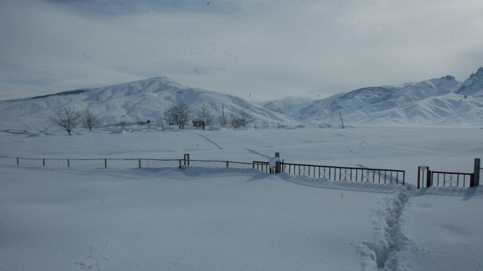

### AYS News Digest 24/1/22: Exposing torture suffered at the Turkish\-Iranian border
### Belgium condemned at court / Minors in the north of France remain unprotected / hate speech and attacks remain present in Greek society / updates on SAR missions / interesting op\-eds, reports and stories recommended by our team

[Are You Syrious?](?source=post_page-----de02406e2083-----------------------------------)

[Jan 25](ays-news-digest-24-1-22-exposing-torture-suffered-at-the-turkish-iranian-border-de02406e2083?source=post_page-----de02406e2083-----------------------------------) · 6 min read

Turkish\-Iranian border area, Unknown author of the photo, [source](https://anfenglish.com/human-rights/refugees-tortured-at-the-border-with-iran-57566?fbclid=IwAR3fEPy6RDuo7lFv3WZg3uYHgNmfqH7u6GFA1iABSTdk-ypx-R6aFl07RSE)

According to recent reports from different organisations, people are testifying that they are being arrested, beaten, tortured, having their money and valuables stolen, and their phones destroyed after crossing the border\. They say that they are then returned to the border without any procedure being followed\. Fleeing war and poverty, many continue to die trying to cross the Turkish\-Iranian border and get one step closer to Europe\.

> _People are trying to enter the western provinces of Turkey with the help of smugglers without being registered\. But especially in the winter months, many people who try to cross the border die from the cold or from attacks by wild animals\. Just a few days ago, two people, believed to be from Afghanistan, froze to death, a representative of an NGO [said](https://anfenglish.com/human-rights/refugees-tortured-at-the-border-with-iran-57566?fbclid=IwAR1iwI_fPtv0uoGm3I8uHV7jNJ8RB4TrATRdlVlD3JBCnZoeKh9jtQiSwGc) \._ 

See [video](https://1649452211.rsc.cdn77.org/vod/2022-01-18-van-mahmut-kacan-van-barosu-yon-kurul-uyesi-sinirda-olum-ve-iskence_1.mp4) \.
### SEARCH AND RESCUE AT SEA

Good news first: The crew is now waiting for the medical paperwork to be processed as the last survivor disembarked from the Mare Jonio in a safe port\.

Also, on board the Louise Michel:

At least 1,838 people have died or gone missing in the Mediterranean attempting to reach Europe in 2021\.

Calls in distress keep coming to other SAR crews:
### GREECE

In Greece, the nationalist narratives in local media, coming from facist groups free to express such views in the media, breed racism and violence\. The most recent in line of violent events was an attack on board a train\.

Also, a bomb with nails exploded outside a building used as a mosque in central Athens, it was reported:
### Biometric data collection — no benign procedure

In the meantime, with the increasing use of machine learning and AI in securitisation, both Human Rights Watch \(HRW\) and Homo Digitalis say the recently planned police program in Greece — to obtain the facial and fingerprint biometric data of people on the move and asylum seekers — is inconsistent with laws on privacy, and is likely to increase discrimination, leading to human rights violations\.

> _The program will use devices that can scan vehicle license plates, faces, and collect fingerprints\. The biometric and biographic data could be immediately referenced against 20 databases held by national and international authorities, and HRW says at least one database may already be collecting biometric data in public spaces\._ 

HRW reports that Greek police have carried out abusive and often discriminatory stop and searches of migrants and other marginalized populations\. The human rights organization adds that even when documents are presented, migrants and undocumented people are detained for hours at a police station in a discriminatory fashion based on appearance, race, and perceived nationality or ethnicity\.

Read [more](https://www.biometricupdate.com/202201/groups-say-greece-migrant-biometric-data-collection-will-violate-human-rights?fbclid=IwAR2tY_8RQKWzIXouazx4Y0SNK1_fNjDXUJj4JObj-4A4HEQ5n_C1J1FFAgQ) \.
### FRANCE
### Calais

Several associations deplore a chronic lack of accommodation for young people, who are made even more vulnerable by the “zero fixation point” strategy\. InfoMigrants observes this in a piece that documents unaccompanied minors in the area being put in serious danger:
### [Mettre à l’abri les mineurs isolés de Calais : un défi quotidien](https://l.facebook.com/l.php?u=https%3A%2F%2Fwww.infomigrants.net%2Ffr%2Fpost%2F38044%2Fmettre-a-labri-les-mineurs-isoles-de-calais--un-defi-quotidien%3Fpreview%3D1643018532022%26fbclid%3DIwAR1cq1hudAirGxtK0_O3mviYTqB5fIurumXUGw6uuPMiZy_VSqLYQ5_UIIM&h=AT1EYEUp_jTsAGrDelLDRWHN1uA5CPF9g3BN_fpwMVXr8amoU5lc_NgXbMsMWPWOgeUe1RNBiWALqbutjnwKAbak3fbwzF6hy0HpJ5evYynbI2EJILQmQ5IbJFzNwzavSq3kXkiYx-wOcw&__tn__=R]-R&c[0]=AT3LLkqam83tbNtTr2BjCJVev80OpJoB0duWB3aIljGATveIf3MCvSdBtE2nQP83gpR96oICzB_7IVNXcMCOdIy0epSWD-gcMdLaTazSEwF6F1LoN_MDxa0aZOMgYETb2vjIxKH7VDomR948WQVU8QY0wL0fkLpxKDUZL0ZDUjGyUR41RtjCp3RHJnc77VMMP9joZA6t-HXsWp-1mLQ)
### [Parmi le millier de personnes présentes dans les campements informels autour de Calais, survivent de nombreux mineurs…](https://l.facebook.com/l.php?u=https%3A%2F%2Fwww.infomigrants.net%2Ffr%2Fpost%2F38044%2Fmettre-a-labri-les-mineurs-isoles-de-calais--un-defi-quotidien%3Fpreview%3D1643018532022%26fbclid%3DIwAR1cq1hudAirGxtK0_O3mviYTqB5fIurumXUGw6uuPMiZy_VSqLYQ5_UIIM&h=AT1EYEUp_jTsAGrDelLDRWHN1uA5CPF9g3BN_fpwMVXr8amoU5lc_NgXbMsMWPWOgeUe1RNBiWALqbutjnwKAbak3fbwzF6hy0HpJ5evYynbI2EJILQmQ5IbJFzNwzavSq3kXkiYx-wOcw&__tn__=R]-R&c[0]=AT3LLkqam83tbNtTr2BjCJVev80OpJoB0duWB3aIljGATveIf3MCvSdBtE2nQP83gpR96oICzB_7IVNXcMCOdIy0epSWD-gcMdLaTazSEwF6F1LoN_MDxa0aZOMgYETb2vjIxKH7VDomR948WQVU8QY0wL0fkLpxKDUZL0ZDUjGyUR41RtjCp3RHJnc77VMMP9joZA6t-HXsWp-1mLQ)

[l\.facebook\.com](https://l.facebook.com/l.php?u=https%3A%2F%2Fwww.infomigrants.net%2Ffr%2Fpost%2F38044%2Fmettre-a-labri-les-mineurs-isoles-de-calais--un-defi-quotidien%3Fpreview%3D1643018532022%26fbclid%3DIwAR1cq1hudAirGxtK0_O3mviYTqB5fIurumXUGw6uuPMiZy_VSqLYQ5_UIIM&h=AT1EYEUp_jTsAGrDelLDRWHN1uA5CPF9g3BN_fpwMVXr8amoU5lc_NgXbMsMWPWOgeUe1RNBiWALqbutjnwKAbak3fbwzF6hy0HpJ5evYynbI2EJILQmQ5IbJFzNwzavSq3kXkiYx-wOcw&__tn__=R]-R&c[0]=AT3LLkqam83tbNtTr2BjCJVev80OpJoB0duWB3aIljGATveIf3MCvSdBtE2nQP83gpR96oICzB_7IVNXcMCOdIy0epSWD-gcMdLaTazSEwF6F1LoN_MDxa0aZOMgYETb2vjIxKH7VDomR948WQVU8QY0wL0fkLpxKDUZL0ZDUjGyUR41RtjCp3RHJnc77VMMP9joZA6t-HXsWp-1mLQ)
### BELGIUM
### Belgium condemned

On Wednesday 19 January, the Brussels Court of First Instance [condemned](https://www.infomigrants.net/fr/post/38063/letat-belge-condamne-pour-sa-mauvaise-gestion-des-demandeurs-dasile?fbclid=IwAR09nagFJaghEg0H0xjWrfBSO6Co--XUsF80MYsZ8An57Fi6RMPkyCXdGk0) the Belgian State and Fedasil, the Federal Agency for Asylum Seekers, for their handling of the reception crisis in the country\. According to this decision, the State breached its international obligations and acted illegally by restricting the right to asylum\.

“It is up to the Belgian State to provide the appropriate structures to accommodate increases in the number of applications which, in their current form, are not by any means exceptional, and are recurrent”, the court ruled\.
### Many detainees in closed centres are or will be deported these days

[Getting the voice out reports](https://www.gettingthevoiceout.org/mass-deportations-20-01-2022-and-covid-in-closed-centre-20-01-2022/?fbclid=IwAR3CFv9h_NfwD0tgLLTUZF4yj5X_sqsd0WwH_Zac8Xll3s9nQCrmVWsY728) :

> _Most of them are people who have been arrested at the airport and denied asylum\. They are desperate and tell us that they are in danger in the country they left but that the CGRA or the Office des étrangers did not consider their application valid for various reasons\. Everything is based on written evidence, their word is not heard, the fact that they come from so\-called “safe” countries etc\._ 

> _These frightened detainees are constantly calling us for help\. We juggle with their lawyers, some of whom are absent and others who are unable to find a legal solution to prevent deportations\._ 

### NORWAY

As the Taliban delegation made plans to visit Norway, lots of people protested against this event, demanding that no legitimacy be given to the Taliban\.

The Norwegian politicians insist: “This is not an identification or recognition of the Taliban\. But we must talk to those who in practice govern the country today\. We cannot let the political situation lead to an even worse humanitarian catastrophe\.”

Here are more hands\-on reactions to the visit:
### [Taliban delegation’s visit to Norway prompts protest in Oslo](https://l.facebook.com/l.php?u=https%3A%2F%2Fwww.euronews.com%2F2022%2F01%2F22%2Fafghanistan-taliban-delegation-s-visit-to-norway-prompts-protest-in-oslo%3Ffbclid%3DIwAR1_IfFAKAfmAeceGrzzj6UTEWz7QVgu8uy92VSsmmuUkTqoPVch9m95yn8&h=AT2kXYbygfKIQhR55bK-ogy5-hGd1AAuqNy1MBDOzPEU3var5w8zK_H3CJXn7hGwNS4ZGAsyqigrFdjhURXsWGxlw3waiIM7_GRN_F_DizZTFfXVpUiY_NfVKaaC1HRrc1ccB3Wu6PvzpDBzXJUEnZjyqVvmqA&__tn__=R]-R&c[0]=AT3YdHwRPAWNH1EQ_UbvKNZeRuyLr_eE7Fr43Ibz1Y86wzKFhqWnV9FgQzgEZmcPE3fKrdiG8_Jgpm2knH3g5_1vWw-8-TjquhT4vjhfpqkDI_JUqDGTxag2jhp1v16nw65e88jT_P6f9f3UXbqAf_RSp9RLaHbGOn8QaQFST8415GHGo5-knD-rJXE98OrSbWUNfehkxSou)
### [There was a small protest of Afghan citizens in Oslo ahead of the Taliban’s visit to the Norwegian capital on Sunday…](https://l.facebook.com/l.php?u=https%3A%2F%2Fwww.euronews.com%2F2022%2F01%2F22%2Fafghanistan-taliban-delegation-s-visit-to-norway-prompts-protest-in-oslo%3Ffbclid%3DIwAR1_IfFAKAfmAeceGrzzj6UTEWz7QVgu8uy92VSsmmuUkTqoPVch9m95yn8&h=AT2kXYbygfKIQhR55bK-ogy5-hGd1AAuqNy1MBDOzPEU3var5w8zK_H3CJXn7hGwNS4ZGAsyqigrFdjhURXsWGxlw3waiIM7_GRN_F_DizZTFfXVpUiY_NfVKaaC1HRrc1ccB3Wu6PvzpDBzXJUEnZjyqVvmqA&__tn__=R]-R&c[0]=AT3YdHwRPAWNH1EQ_UbvKNZeRuyLr_eE7Fr43Ibz1Y86wzKFhqWnV9FgQzgEZmcPE3fKrdiG8_Jgpm2knH3g5_1vWw-8-TjquhT4vjhfpqkDI_JUqDGTxag2jhp1v16nw65e88jT_P6f9f3UXbqAf_RSp9RLaHbGOn8QaQFST8415GHGo5-knD-rJXE98OrSbWUNfehkxSou)

[l\.facebook\.com](https://l.facebook.com/l.php?u=https%3A%2F%2Fwww.euronews.com%2F2022%2F01%2F22%2Fafghanistan-taliban-delegation-s-visit-to-norway-prompts-protest-in-oslo%3Ffbclid%3DIwAR1_IfFAKAfmAeceGrzzj6UTEWz7QVgu8uy92VSsmmuUkTqoPVch9m95yn8&h=AT2kXYbygfKIQhR55bK-ogy5-hGd1AAuqNy1MBDOzPEU3var5w8zK_H3CJXn7hGwNS4ZGAsyqigrFdjhURXsWGxlw3waiIM7_GRN_F_DizZTFfXVpUiY_NfVKaaC1HRrc1ccB3Wu6PvzpDBzXJUEnZjyqVvmqA&__tn__=R]-R&c[0]=AT3YdHwRPAWNH1EQ_UbvKNZeRuyLr_eE7Fr43Ibz1Y86wzKFhqWnV9FgQzgEZmcPE3fKrdiG8_Jgpm2knH3g5_1vWw-8-TjquhT4vjhfpqkDI_JUqDGTxag2jhp1v16nw65e88jT_P6f9f3UXbqAf_RSp9RLaHbGOn8QaQFST8415GHGo5-knD-rJXE98OrSbWUNfehkxSou)
### POLAND

**_Poland wants the EU’s blessing to restrict people’s right to asylum if they sneak in from Belarus, among other “emergency” measures\._**

The Polish articles were to be added to an EU Commission proposal on how “to address the emergency situation at the EU’s external border with Belarus”\.
The original EU Commission proposal said Latvia, Lithuania, and Poland should be able to detain migrants in asylum centres for 16 weeks instead of just four\.

Perhaps most importantly, Poland now wants an “article which may allow to leave the application for international protection unprocessed if it was submitted by a foreigner apprehended immediately after illegally crossing the external border of the EU … unless the foreigner arrived directly from the territory in which his life or freedom was threatened”\.
### Hunger strike in Wędrzyn

Since January 19, seven Syrians have been refusing to eat in a closed center for foreigners in Wędrzyn\. Because life behind bars, on an active military training ground, reminds them of prisons and the war in Syria, lawyers, activists and the Commissioner for Human Rights agree that there is no worse center in Poland:
### [Strajk głodowy w Wędrzynie\. Dr Machińska: „Ośrodek poniżej standardu więziennego, wymaga…](https://l.facebook.com/l.php?u=https%3A%2F%2Foko.press%2Fstrajk-glodowy-w-wedrzynie-dr-machinska-osrodek-ponizej-standardu-wieziennego-wymaga-likwidacji%2F%3Ffbclid%3DIwAR1nsy5p2346FHL3bHbU32s0GLcQnYp3C1_uKPE3QoWXUGYPy5CfqvT4GwA&h=AT3YpwzOtlYxgtKrDC9g9LoGTOU3e2eeFqx_Vgg8rYbRpB-4DNAKRPFfbJPhUmhiTR6mWqTGoqBBE5RRyM55vugStzJUg-6h8kqtyljqIB-uuZ98Viu0ZvF3EvsGjELfpZDYOSbqByomKw&__tn__=R]-R&c[0]=AT0VlRJkvGlxyAZPCWwIKHNehC_Fg65TF1K3e5TEeyaePVuTa_VJwz83wo2fd6eP2yT5kuc2_bNSwvw41e61tBnAHQTKi6vtd6eMb_lDa_R0isTlJyf2-bIqRZ6_huJahmAf6u6gQ9HcW71I1N3uun4Klumg3B_8l6yyjeLIfSnFuxAoAkrFkX3oIrdvreYc0Fhh9NS-FRiO)
### [27\-letni Syryjczyk — Munzer, absolwent geologii najpierw stracił dom, jego wioska została zniszczona przez ISIS\. Potem…](https://l.facebook.com/l.php?u=https%3A%2F%2Foko.press%2Fstrajk-glodowy-w-wedrzynie-dr-machinska-osrodek-ponizej-standardu-wieziennego-wymaga-likwidacji%2F%3Ffbclid%3DIwAR1nsy5p2346FHL3bHbU32s0GLcQnYp3C1_uKPE3QoWXUGYPy5CfqvT4GwA&h=AT3YpwzOtlYxgtKrDC9g9LoGTOU3e2eeFqx_Vgg8rYbRpB-4DNAKRPFfbJPhUmhiTR6mWqTGoqBBE5RRyM55vugStzJUg-6h8kqtyljqIB-uuZ98Viu0ZvF3EvsGjELfpZDYOSbqByomKw&__tn__=R]-R&c[0]=AT0VlRJkvGlxyAZPCWwIKHNehC_Fg65TF1K3e5TEeyaePVuTa_VJwz83wo2fd6eP2yT5kuc2_bNSwvw41e61tBnAHQTKi6vtd6eMb_lDa_R0isTlJyf2-bIqRZ6_huJahmAf6u6gQ9HcW71I1N3uun4Klumg3B_8l6yyjeLIfSnFuxAoAkrFkX3oIrdvreYc0Fhh9NS-FRiO)

[l\.facebook\.com](https://l.facebook.com/l.php?u=https%3A%2F%2Foko.press%2Fstrajk-glodowy-w-wedrzynie-dr-machinska-osrodek-ponizej-standardu-wieziennego-wymaga-likwidacji%2F%3Ffbclid%3DIwAR1nsy5p2346FHL3bHbU32s0GLcQnYp3C1_uKPE3QoWXUGYPy5CfqvT4GwA&h=AT3YpwzOtlYxgtKrDC9g9LoGTOU3e2eeFqx_Vgg8rYbRpB-4DNAKRPFfbJPhUmhiTR6mWqTGoqBBE5RRyM55vugStzJUg-6h8kqtyljqIB-uuZ98Viu0ZvF3EvsGjELfpZDYOSbqByomKw&__tn__=R]-R&c[0]=AT0VlRJkvGlxyAZPCWwIKHNehC_Fg65TF1K3e5TEeyaePVuTa_VJwz83wo2fd6eP2yT5kuc2_bNSwvw41e61tBnAHQTKi6vtd6eMb_lDa_R0isTlJyf2-bIqRZ6_huJahmAf6u6gQ9HcW71I1N3uun4Klumg3B_8l6yyjeLIfSnFuxAoAkrFkX3oIrdvreYc0Fhh9NS-FRiO)
### GENERAL

Frontex has reportedly urged the EU to provide clearer rules on establishing a balance between the human rights of asylum seekers and greater border protection\. Their request follows accusations from the EU ombudsperson \(and many others\) that the agency is failing to fulfill transparency requirements\.

More on the illegitimate and illegal side of official things — The EU Agency for Judicial Cooperation has advised that the frequency of confiscation of mobile phones and storage media from refugees increases, in order to identify those who help facilitate escape, Matthias Monroy notes:
### WORTH READING & WATCHING
- German documentary about SaR — Mission in the Mediterranean — Every human life counts:

### [Mission im Mittelmeer — Jedes Menschenleben zählt](https://l.facebook.com/l.php?u=https%3A%2F%2Fwww.ardmediathek.de%2Fvideo%2Fdoku-und-reportage%2Fmission-im-mittelmeer-jedes-menschenleben-zaehlt%2Fswr%2FY3JpZDovL3N3ci5kZS9hZXgvbzE1NzI2NTA%2F%3Ffbclid%3DIwAR1cq1hudAirGxtK0_O3mviYTqB5fIurumXUGw6uuPMiZy_VSqLYQ5_UIIM&h=AT0_fdGglEn6DlBMNnMO9PWR6rt90DcYMwnykeQCMtYUdQoZ_6nhHx6YvGMZK_uRV7tj0qvH0FPzwx9PeVu9CMNDiqUfGpJn5GXWNNsdWB9PmKMY3YQd7dmwxdyvOwNGFmbBYMcECFfE1w&__tn__=R]-R&c[0]=AT1TRZEYe_LQfde6x3AMUDdq8HVUTLsMtvgxTu2D1XY7siX-AidAGUoy8s_dUzYcOl2lgLycwlJurmFSeB_Yc59YxJn408asgckr68WHDtBlRWDwuAHBr0y5L9BEq4H3hq45lSeoYbHLo8AHR2dtrcrOLR2KirZJSjelwPT2m1Z0FSE_zKdQ40mMaezWdw82Fj2JKhCg6m0r)
### [Raphael Reschke von den “Sea Punks” will Leben retten\. Er hat die Bilder und Nachrichten aus dem Mittelmeer nicht mehr…](https://l.facebook.com/l.php?u=https%3A%2F%2Fwww.ardmediathek.de%2Fvideo%2Fdoku-und-reportage%2Fmission-im-mittelmeer-jedes-menschenleben-zaehlt%2Fswr%2FY3JpZDovL3N3ci5kZS9hZXgvbzE1NzI2NTA%2F%3Ffbclid%3DIwAR1cq1hudAirGxtK0_O3mviYTqB5fIurumXUGw6uuPMiZy_VSqLYQ5_UIIM&h=AT0_fdGglEn6DlBMNnMO9PWR6rt90DcYMwnykeQCMtYUdQoZ_6nhHx6YvGMZK_uRV7tj0qvH0FPzwx9PeVu9CMNDiqUfGpJn5GXWNNsdWB9PmKMY3YQd7dmwxdyvOwNGFmbBYMcECFfE1w&__tn__=R]-R&c[0]=AT1TRZEYe_LQfde6x3AMUDdq8HVUTLsMtvgxTu2D1XY7siX-AidAGUoy8s_dUzYcOl2lgLycwlJurmFSeB_Yc59YxJn408asgckr68WHDtBlRWDwuAHBr0y5L9BEq4H3hq45lSeoYbHLo8AHR2dtrcrOLR2KirZJSjelwPT2m1Z0FSE_zKdQ40mMaezWdw82Fj2JKhCg6m0r)

[l\.facebook\.com](https://l.facebook.com/l.php?u=https%3A%2F%2Fwww.ardmediathek.de%2Fvideo%2Fdoku-und-reportage%2Fmission-im-mittelmeer-jedes-menschenleben-zaehlt%2Fswr%2FY3JpZDovL3N3ci5kZS9hZXgvbzE1NzI2NTA%2F%3Ffbclid%3DIwAR1cq1hudAirGxtK0_O3mviYTqB5fIurumXUGw6uuPMiZy_VSqLYQ5_UIIM&h=AT0_fdGglEn6DlBMNnMO9PWR6rt90DcYMwnykeQCMtYUdQoZ_6nhHx6YvGMZK_uRV7tj0qvH0FPzwx9PeVu9CMNDiqUfGpJn5GXWNNsdWB9PmKMY3YQd7dmwxdyvOwNGFmbBYMcECFfE1w&__tn__=R]-R&c[0]=AT1TRZEYe_LQfde6x3AMUDdq8HVUTLsMtvgxTu2D1XY7siX-AidAGUoy8s_dUzYcOl2lgLycwlJurmFSeB_Yc59YxJn408asgckr68WHDtBlRWDwuAHBr0y5L9BEq4H3hq45lSeoYbHLo8AHR2dtrcrOLR2KirZJSjelwPT2m1Z0FSE_zKdQ40mMaezWdw82Fj2JKhCg6m0r)
- a Professor for Public Law at the University of Applied Sciences in Germany comments on the pushbacks as a phenomenon and the “non\-word of the year” in Germany:

### [Pushbacks? Never mind, we’re doing it](https://verfassungsblog.de/pushbacks-never-mind-were-doing-it/?fbclid=IwAR1iXhaiAOpDSBOfN818WyrAN1Qq5C-Bl450dluyhbsc3B3Sc0ZP5H-g_6U)
### [Edit description](https://verfassungsblog.de/pushbacks-never-mind-were-doing-it/?fbclid=IwAR1iXhaiAOpDSBOfN818WyrAN1Qq5C-Bl450dluyhbsc3B3Sc0ZP5H-g_6U)

[verfassungsblog\.de](https://verfassungsblog.de/pushbacks-never-mind-were-doing-it/?fbclid=IwAR1iXhaiAOpDSBOfN818WyrAN1Qq5C-Bl450dluyhbsc3B3Sc0ZP5H-g_6U)
- Javier Rios has released a documentary on the journey people on the move take to the Canaries:
- The International Criminal Court \(ICC\) has been asked to investigate alleged war crimes committed against thousands of migrants trapped in Libyan detention centres with the support of Italian and Maltese authorities\.

### [Three NGOs want Malta and Italy investigated for war crimes in Libya](https://l.facebook.com/l.php?u=https%3A%2F%2Ftimesofmalta.com%2Farticles%2Fview%2Fthree-ngos-want-malta-and-italy-investigated-for-war-crimes-in-libya.928675%3Ffbclid%3DIwAR1HraCShs-jXwqOCFGeG3b33PL-016JvBzRLO9YBy5RvKPFQZ6vzGGfh4M&h=AT2OJYEyJQhqHonRaPsdMh5k8PHgpcHjeKgxlAxZjQRWa9b_PFNTB5qanDWmq-DUvrmtGVWtFnVwp5uKx70cFVtXYiA2ykUzlJDYgMHiCi--I4zogedziwvUOPbFEB74yv9ycb-T8-nkWg&__tn__=R]-R&c[0]=AT0iZixXVEqDt2ehjXdMJp9QEkdQMH0hQrywMTd6bsCNoAHmho5_vj6YIxCrclbUTgt7T_3s6DOMOLjgj3VTBVhqHJim2Wd53_ZRfovjrK_y5v2XxKnjzfHcv5Vw3Eeai1fROh_7WtXvGova4SzxqPDouQnfmBYuvtWWxlYAQhBh7SAT8jS6c0yefcMFAkOOiaAxZXhQP7Qi)
### [The International Criminal Court \(ICC\) has been asked to investigate alleged war crimes committed against thousands of…](https://l.facebook.com/l.php?u=https%3A%2F%2Ftimesofmalta.com%2Farticles%2Fview%2Fthree-ngos-want-malta-and-italy-investigated-for-war-crimes-in-libya.928675%3Ffbclid%3DIwAR1HraCShs-jXwqOCFGeG3b33PL-016JvBzRLO9YBy5RvKPFQZ6vzGGfh4M&h=AT2OJYEyJQhqHonRaPsdMh5k8PHgpcHjeKgxlAxZjQRWa9b_PFNTB5qanDWmq-DUvrmtGVWtFnVwp5uKx70cFVtXYiA2ykUzlJDYgMHiCi--I4zogedziwvUOPbFEB74yv9ycb-T8-nkWg&__tn__=R]-R&c[0]=AT0iZixXVEqDt2ehjXdMJp9QEkdQMH0hQrywMTd6bsCNoAHmho5_vj6YIxCrclbUTgt7T_3s6DOMOLjgj3VTBVhqHJim2Wd53_ZRfovjrK_y5v2XxKnjzfHcv5Vw3Eeai1fROh_7WtXvGova4SzxqPDouQnfmBYuvtWWxlYAQhBh7SAT8jS6c0yefcMFAkOOiaAxZXhQP7Qi)

[l\.facebook\.com](https://l.facebook.com/l.php?u=https%3A%2F%2Ftimesofmalta.com%2Farticles%2Fview%2Fthree-ngos-want-malta-and-italy-investigated-for-war-crimes-in-libya.928675%3Ffbclid%3DIwAR1HraCShs-jXwqOCFGeG3b33PL-016JvBzRLO9YBy5RvKPFQZ6vzGGfh4M&h=AT2OJYEyJQhqHonRaPsdMh5k8PHgpcHjeKgxlAxZjQRWa9b_PFNTB5qanDWmq-DUvrmtGVWtFnVwp5uKx70cFVtXYiA2ykUzlJDYgMHiCi--I4zogedziwvUOPbFEB74yv9ycb-T8-nkWg&__tn__=R]-R&c[0]=AT0iZixXVEqDt2ehjXdMJp9QEkdQMH0hQrywMTd6bsCNoAHmho5_vj6YIxCrclbUTgt7T_3s6DOMOLjgj3VTBVhqHJim2Wd53_ZRfovjrK_y5v2XxKnjzfHcv5Vw3Eeai1fROh_7WtXvGova4SzxqPDouQnfmBYuvtWWxlYAQhBh7SAT8jS6c0yefcMFAkOOiaAxZXhQP7Qi)
- IRC report on Greece:

### [People in Greece are going hungry, as over one third of those living in refugee camps are denied…](https://l.facebook.com/l.php?u=https%3A%2F%2Fwww.rescue.org%2Fpress-release%2Fpeople-greece-are-going-hungry-over-one-third-those-living-refugee-camps-are-denied%3Ffbclid%3DIwAR3C6fB4m3pqsLi_toC41pEDdy_prz9spqI91ia8v_fj3-LIzbAmpjAvYcY&h=AT2QZFYH2A_y5UBFPNrQCUqYvV_iFXYev9JaLfy-s8EtXRaL20tUwTQn-AZl67Cejc-7zz3E9oT6UuiiohrkEGu-F_EWOMBZTOIpjQgNuxZoFLnjZ0jmPAmFMWocFaUkqvbl2xNezjewiQ&__tn__=R]-R&c[0]=AT3J_zL8qm4M4XV0M4AQc9nBn3MQfU5CnFTqIvP57eFE7DKGKCHsI6vubJYWTZL5vH-Kza4jX9ZhS8KjtkYFqznRrFDCX7UprM3a_plSWmToagao-o8ZekNYd1ajHfw58HoDCuHwgCd5jnLh8RZ96fuYXq9M_wCyAA7BUsxdAQx7ycBB35GNfaG-Gnia19XxomElKGh_Erkw)
### [The hunger crisis in Greece is continuing as figures show that forty per cent of people living in Greek refugee camps…](https://l.facebook.com/l.php?u=https%3A%2F%2Fwww.rescue.org%2Fpress-release%2Fpeople-greece-are-going-hungry-over-one-third-those-living-refugee-camps-are-denied%3Ffbclid%3DIwAR3C6fB4m3pqsLi_toC41pEDdy_prz9spqI91ia8v_fj3-LIzbAmpjAvYcY&h=AT2QZFYH2A_y5UBFPNrQCUqYvV_iFXYev9JaLfy-s8EtXRaL20tUwTQn-AZl67Cejc-7zz3E9oT6UuiiohrkEGu-F_EWOMBZTOIpjQgNuxZoFLnjZ0jmPAmFMWocFaUkqvbl2xNezjewiQ&__tn__=R]-R&c[0]=AT3J_zL8qm4M4XV0M4AQc9nBn3MQfU5CnFTqIvP57eFE7DKGKCHsI6vubJYWTZL5vH-Kza4jX9ZhS8KjtkYFqznRrFDCX7UprM3a_plSWmToagao-o8ZekNYd1ajHfw58HoDCuHwgCd5jnLh8RZ96fuYXq9M_wCyAA7BUsxdAQx7ycBB35GNfaG-Gnia19XxomElKGh_Erkw)

[l\.facebook\.com](https://l.facebook.com/l.php?u=https%3A%2F%2Fwww.rescue.org%2Fpress-release%2Fpeople-greece-are-going-hungry-over-one-third-those-living-refugee-camps-are-denied%3Ffbclid%3DIwAR3C6fB4m3pqsLi_toC41pEDdy_prz9spqI91ia8v_fj3-LIzbAmpjAvYcY&h=AT2QZFYH2A_y5UBFPNrQCUqYvV_iFXYev9JaLfy-s8EtXRaL20tUwTQn-AZl67Cejc-7zz3E9oT6UuiiohrkEGu-F_EWOMBZTOIpjQgNuxZoFLnjZ0jmPAmFMWocFaUkqvbl2xNezjewiQ&__tn__=R]-R&c[0]=AT3J_zL8qm4M4XV0M4AQc9nBn3MQfU5CnFTqIvP57eFE7DKGKCHsI6vubJYWTZL5vH-Kza4jX9ZhS8KjtkYFqznRrFDCX7UprM3a_plSWmToagao-o8ZekNYd1ajHfw58HoDCuHwgCd5jnLh8RZ96fuYXq9M_wCyAA7BUsxdAQx7ycBB35GNfaG-Gnia19XxomElKGh_Erkw)

**Find daily updates and special reports on our [Medium page](https://medium.com/are-you-syrious) \.**

**If you wish to contribute, either by writing a report or a story, or by joining the info gathering team, please let us know\.**

**We strive to echo correct news from the ground through collaboration and fairness\. Every effort has been made to credit organisations and individuals with regard to the supply of information, video, and photo material \(in cases where the source wanted to be accredited\) \. Please notify us regarding corrections\.**

**If there’s anything you want to share or comment, contact us through Facebook, Twitter or write to: areyousyrious@gmail\.com**

_Converted [Medium Post](https://medium.com/are-you-syrious/ays-news-digest-24-1-22-exposing-torture-suffered-at-the-turkish-iranian-border-d22464da9e7b) by [ZMediumToMarkdown](https://github.com/ZhgChgLi/ZMediumToMarkdown)._
