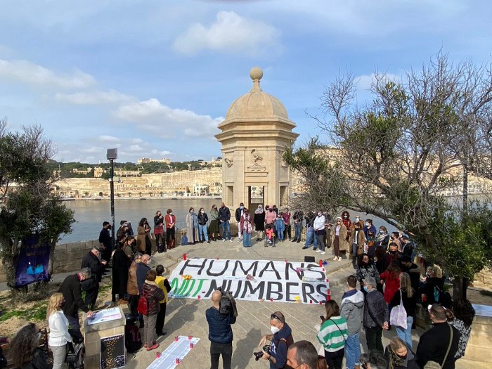
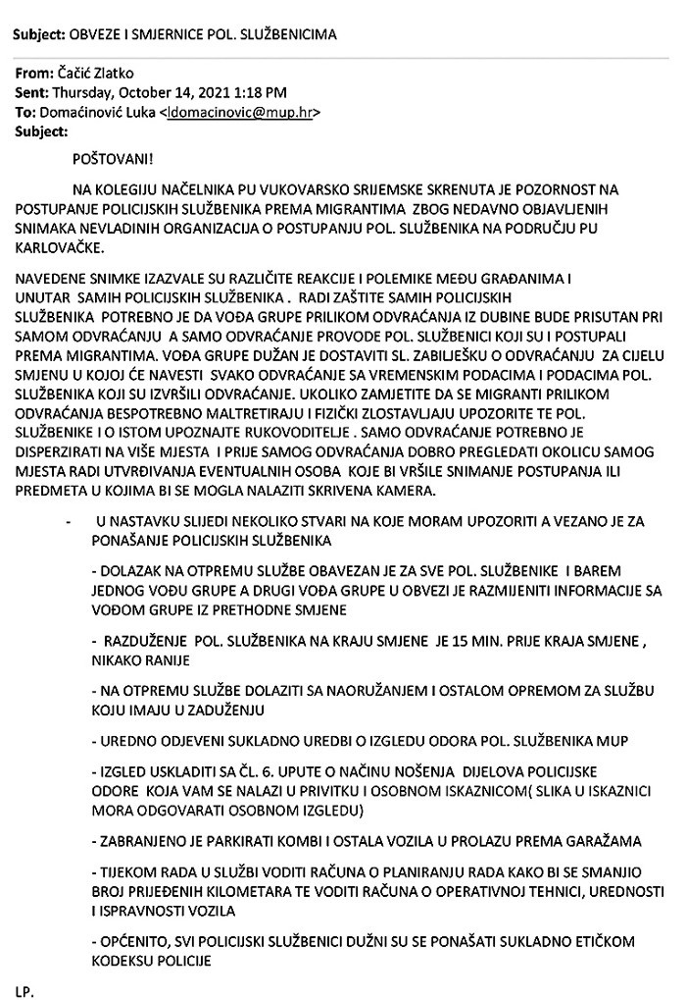
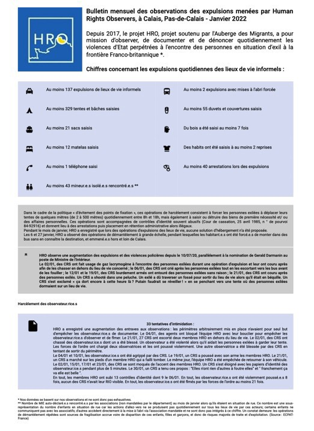
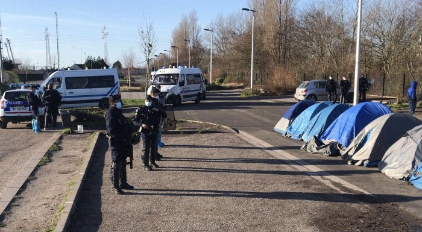
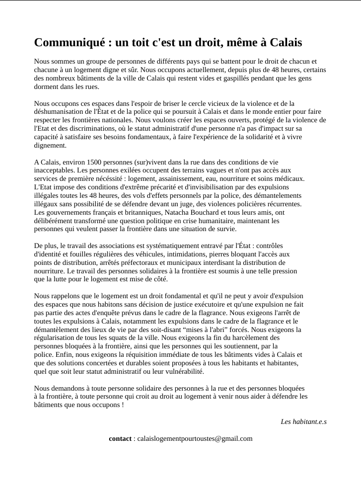
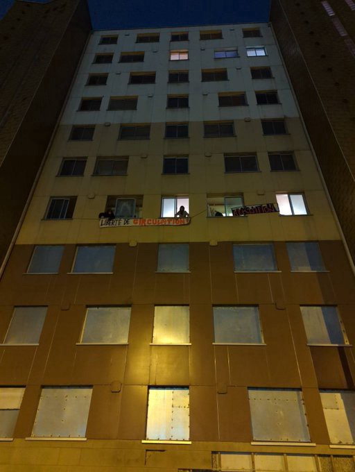
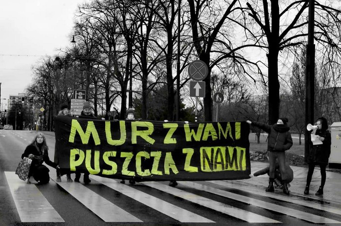

### AYS Daily Digest 7/2/22: ‘Watch out for the cameras’: an instruction to the border police doing pushbacks
### Will the whistleblowers do what the international community are unable to? // Greece: surveillance of camps vs locals protesting the new centres being built // 20 years sentence for 2 Bengali torturers of people in Libyan camps, how many will the EU signatories of the Deal get? // Homelessness grows across Europe, evictions continue and new spaces are being occupied // announced solidarity gatherings and protests // more news and a lot of recommended reads from the AYS team

[Are You Syrious?](?source=post_page-----1102d5eb6c2-----------------------------------)

[Feb 8](ays-daily-digest-7-2-22-watch-out-for-the-cameras-an-instruction-to-the-border-police-doing-1102d5eb6c2?source=post_page-----1102d5eb6c2-----------------------------------) · 11 min read

Malta — 38 local organisations and groups came together at Gjardola Garden to protest the ongoing dying in the Mediterranean Sea\. We will never forget those who died or disappeared\. They are “Humans, not Numbers”\. — via [Alarm Phone](https://twitter.com/alarm_phone)
### FEATURE

“Obligation and directions” issued to police officers working on the Croatian border with Serbia and Bosnia and Herzegovina, obtained by the Croatian news portal [Index](https://www.index.hr/vijesti/clanak/ovo-je-naredba-policajcima-o-tjeranju-migranata-pazite-da-vas-ne-snime/2336836.aspx?fbclid=IwAR1WjMzCIrnSDd2T2D49y2H0H-j4LzCiGAQfcoiW3GV0-4aoJpjG26ZmjfY) , clearly show what we have all been claiming the entire time — that border securitisation, along with its disregard for the human rights and the right to seek protection, is defined, ordered and observed by the top officials of the MoI\.

As the MO at very distant border areas and in different jurisdictions fits the same pattern, many organisations who reported, followed and documented the actions at the border, concluded that such behaviour \(including the often violent group expulsions\) is a result of a direct order which the ground police is simply obeying and putting into practice\. The MoI’s stories of “individual poor decisions” when it comes to video/photo documented torture at the border therefore falls into the same pit as all of their other claims when it comes to “not having anything to do with any violent acts at the border”\.

The newest document that reveals and confirms this is an email sent to the police in the Bajakovo border crossing area, with clear instructions on how to proceed with pushbacks, including a note to be aware of potential cameras that could document the process\.

Given the geographical configuration of the terrain, the Bajakovo area is particularly suitable for pushbacks, so people have been brought in police vans from all other areas of the country and pushed back there, and signed off as “deterrence” cases found in the Bajakovo area\. This, of course, is not the case, and all this time we have been witnessing pushbacks from the centre of the country, often from the very police stations in big towns where people came to express the intention to seek international protection\.

As a continuation of the great investigative work of Lighthouse reports, this document is a call for caution given the reactions coming after the media reports\. The letter states:

“The recordings resulted in different reactions and polemics among the citizens and within the police circles\. In order to protect the police officers it is necessary that during the deterrence \(pushback\) from inland the group leader is present, and that the deterrence is done by the police officers who handled the migrants\. The group leader is obliged to deliver a note on the deterrence for the entire shift where he will state each deterrence with times and names of those who processed the deterrence\. If you notice that the migrants are being unnecessarily \(sic\! \) molested and physically abused during the deterrence, notify the police officers about this and inform the main culprits\.”

The letter continues with instructions on how to proceed with pushbacks:

> _“The deterrence itself should be dispersed in more places and before that you should make sure to examine the area so as to determine the presence of possible individuals who might be recording the process or the objects that might have a hidden camera inside\.”_ 

A signatory to the Geneva Convention on the Status of Refugees, the International Covenant on Civil and Political Rights \(ICCPR\) and the European Convention on Human Rights, Croatia has in the past few years often been the topic of many reports, testimony collections, and a station on the route of many people who sadly died along the way, mostly around the heavily guarded and unsafe border areas\. As a country with the longest terrestrial border of the EU with third countries, Croatia has — tacitly or willingly — accepted the role of the bouncer and bully within the EU, and all the tragedies that happen as a result of such decisions\.

Croatia’s failure to individually assess the inhumane conditions awaiting many in Bosnia and Herzegovina not only violates article 7 of the ICCPR which prohibits torture or cruel and degrading treatment, but also is one of the main issues behind collective pushbacks orchestrated by the Croatian heads of police and put into practice by the thousands of police officers along its borders\. The question remains whether the leaked document, if not the CPT’s report and other important international documentation on this issue, will now finally prompt some acceptance of responsibility, resignations and, ultimately, change\.
### GREECE

About 30 people were on board the two boats that were “intercepted” and returned to Turkey:

The shores revealed more victims of the shipwrecks in the Aegean, as 3 more bodies were found, two \(of a man and a woman\) in Folegandros, and a body of a man in Symi, the local media [reported](https://www.topontiki.gr/2022/02/07/folegandros-simi-entopistikan-tris-sori-se-katastasi-prochorimenis-sipsis/) \.
### Protests against the new centre

Locals from villages near Mantamados protested against the planned construction of a “closed\-controlled” camp structure for asylum seekers, 1 and a half years after the fire of Moria, F [ranziska Grillmeier](https://twitter.com/f_grillmeier) reported\. He notes that some are concerned about the remoteness of the camps, fearing even more “black boxes” of human rights abuses on their islands; others have felt politically abandoned since 2015\.

At the same time, the [Moria 16 trial](https://twitter.com/cantevict/status/1489928506125570051?fbclid=IwAR1SPlShwunn0ctgA3uISHLn_KHdSN7rfmMx7-0RgX7mTJLFHOVKin0ae8c) should have started but was reportedly postponed\.
### Dystopian surveillance project

40cameras are being installed in each camp, which can be operated from the control room as part of the newest line of surveillance projects by the EU and Greek governments\.

> _There will also be thermal cameras, drones, and other technology — including augmented reality glasses, which will be distributed to police and private security personnel, AlJazeera reported\._ 

_The_ policy and campaigns officer at European Digital Rights said:

> _“Money which could be used to help people is instead used to punish them, all while the surveillance industry makes vast profits selling false promises of magical technology that claims to fix complex structural issues\.”_ 

Read the entire story on the project Centaur [here](https://www.aljazeera.com/news/2021/12/24/greece-pilots-high-tech-surveillance-system-in-refugee-camps?fbclid=IwAR0wIxAKjY-yJQTZeKscRUw3mX89yrsB12iLGlKFoey5Udy4JgV6ROBUJs8) \.
### ITALY
### Sentenced to 20 years in prison for torture

A couple accused of being the jailers of the Zuhara prison camp in Libya where people were kept under detention and tortured have been sentenced to 20 years in prison at court in Palermo\. It was the people who had traveled with the two accused and sentenced Bengalis, who recognized them, crying and accused the two of being the torturers at the Libyan camp\.

It is the Italy\(EU\) \-Libya agreement that provides for the training and support of the so\-called Libyan coast guard — which has the task of patrolling the coasts to stop the boats of people on the move — and the financing of the Libyan detention centers, called “reception centers” by the agreement, so that those who signed it could sleep at night\. In the meantime, the Libyans continued to operate in ways that seriously endanger the lives and well\-being of many people\.

AYS is one of the hundreds of associations, individuals and organisations that have asked the Italian government to revoke the pact, presenting an analysis of the effects of the agreement on the lives of people stuck there\.

Read more in a story by the Italian [Globalist](https://www.globalist.it/news/2022/02/04/migranti-sequestrati-e-torturati-ce-un-giudice-a-palermo/?fbclid=IwAR37Tkh3kAfGYiNJukPesK62Lg65r1AYp1aBMiciqeR91Hj1qyuDWrVy0ns) \.

At the same time, people have been on hunger strike in Ain Zara prison in Libya since Saturday:
### SPAIN

The Spanish coast guard reportedly refused to help a group at sea, leaving it up to the Moroccans to decide on the people’s fate, AlarmPhone reported:
### Protest against the closure of homeless accommodation

A group of about 40 people who are staying at the Tarajal ships has mobilized this Monday to protest the announcement by the Autonomous City of Ceuta of the closure of these facilities as an emergency shelter starting from Tuesday next week\. Their protest was stopped by the police, supposedly because they didn’t announce it\.

The local Executive assured that this closure could take place on February 15\. 170 people currently live in these ships, which are managed by the Red Cross\. Among them are some twenty homeless Ceutí, approximately as many sub\-Saharans waiting to join the CETI, several children of school age with relatives, and elderly people over 70\.

The City has assured that with the Tarajal it wants to do the same as in Piniers — part of the de\-escalation after the crisis of May\. Several political groups have asked the City what will happen to these people and demanded to know what options will be offered\.
### FRANCE
### Reports on evictions in Calais and Grande Synthe in January:

by [Human Rights Observers](https://twitter.com/HumanRightsObs)

Utopia teams report about the state people are in, and the “reception” conditions currently met by the state when it comes to the north of France and people on the move, constantly being pushed back, having their belongings taken away, and being evicted on an almost daily basis:

Some of the initiatives fighting this include the occupation of abandoned buildings in Calais:

### GERMANY

The Brandenburg Ministry of the Interior has announced that it will build a so\-called “entry and exit centre” at Schönefeld Airport by 2025\. It will be a pilot project to accelerate & extend restrictive asylum procedures and deportations, Bündnis Abschiebezentrum am Flughafen BER verhindern group has reported\.

The first demonstration will take place this Wednesday, February 9th in Schönefeld\. The route goes from the Schönefeld S\-Bahn station \(4:45 p\.m\. \) to the final rally at Schönefeld Town Hall at 5:45 p\.m\. \(Hans\-Grade\-Allee 11\) \. The idea is to increase the pressure on the local politicians, who are holding a meeting in the Schönefeld municipal council at the same time, because the decision on the construction plans is still pending, the group writes\. 
Find out more information [here](https://noborderassembly.blackblogs.org/de/pressemitteilung-abschiebezentrum-am-flughafen-ber-verhindern/) \.
### POLAND
### Solidarity protest

Solidarity among people in Poland continues\.

A solidarity action aiming to show support for all people imprisoned in detention centres and to oppose the criminalisation of migration is scheduled for February 12\. Details of the event can be found [here](https://nobordersteam.noblogs.org/.../demonstracja.../) \.
### UK

Priti Patel’s government plans to revive the Detained Fast Track \(DFT\) project \(which was successfully defeated in the courts in 2017 by [Detention Action](https://twitter.com/DetentionAction) and others\) \. DA team writes:

> _In 2013, 99% of people forced through it were refused asylum by the Border Agency on first decision\. They were given just two days to appeal, regardless of how complex their cases were\. This was clearly unjust\._ 

> _Vulnerable people & those with complex cases, incl\. LGBT\+ people and victims of torture, trafficking and gender\-based violence, were too often deported under DFT\. This resulted in shocking cases like that of PN, an LGBT\+ woman from Uganda\._ 

> _The Government’s rush to deport people seeking asylum denied them access to legal support and advice\. In 2012, 59% of people in Harmondsworth detention centre were unrepresented at first appeal\. 1% of them won their appeals, compared to 20% of those with representation\._ 

> _In 2015, the High Court ruled that the Detention Fast Track system was unlawful & had unfairly treated more than 10,000 people seeking asylum\. Even the Minister for Immigration said “We cannot be certain of the level of risk of unfairness to \(people\) who may enter DFT\.”_ 

> _Detention Fast Track was a moral, legal & political failure that returned people seeking asylum to danger\. We defeated it before & we will again, if necessary\._ 

### GENERAL

From one of the gatherings commemorating victims of the borders, in Paris:

Make sure to read our Special on this, from the AYS Specials series:
### [AYS Special from Greece: “I cannot swim\.”](https://l.facebook.com/l.php?u=https%3A%2F%2Fmedium.com%2Fare-you-syrious%2Fays-special-from-greece-i-cannot-swim-bf1b1bd091eb%3Ffbclid%3DIwAR24mwpfdFK8mNlq-4vTiBqvROrZ37_0y3JfIRwA7F00VaVN2-RxxQgpnoI&h=AT3j6dJS3pGc0sKsffczFlnhKDKIkMtnyM2RXD8kTwG0wvShHZBwsT8woIpZciUel6p1VEoWlOboKv0hYP8DtIBlGKIc0LKtbvbHnRXKf6Xt3OVMUwexIOvU_xds-duh293ZhRrwT2uo90PJ4Q&__tn__=%2CmH-R&c[0]=AT0AyFHXgsLv4YmVVWgIQ4PJtphC6_9U4U-WVtIq_weaITK61NgL5QY8QQ4yBitTERAuRq5QYxRAUsJRBrolktnQvPsd4h_eUQuyRV1qEvSjrmDXJrdE84s-TAczJ4v-Jj-EblC-vw10jYYSevv_BrC8xQXiYeMrQdTdJVZSv4pyjlW5lUMWFyzU9jJHjgyH4HWn63Qs)
### [Today is a global day of CommemorAction for people who have died, gone missing or forcibly disappeared on their…](https://l.facebook.com/l.php?u=https%3A%2F%2Fmedium.com%2Fare-you-syrious%2Fays-special-from-greece-i-cannot-swim-bf1b1bd091eb%3Ffbclid%3DIwAR24mwpfdFK8mNlq-4vTiBqvROrZ37_0y3JfIRwA7F00VaVN2-RxxQgpnoI&h=AT3j6dJS3pGc0sKsffczFlnhKDKIkMtnyM2RXD8kTwG0wvShHZBwsT8woIpZciUel6p1VEoWlOboKv0hYP8DtIBlGKIc0LKtbvbHnRXKf6Xt3OVMUwexIOvU_xds-duh293ZhRrwT2uo90PJ4Q&__tn__=%2CmH-R&c[0]=AT0AyFHXgsLv4YmVVWgIQ4PJtphC6_9U4U-WVtIq_weaITK61NgL5QY8QQ4yBitTERAuRq5QYxRAUsJRBrolktnQvPsd4h_eUQuyRV1qEvSjrmDXJrdE84s-TAczJ4v-Jj-EblC-vw10jYYSevv_BrC8xQXiYeMrQdTdJVZSv4pyjlW5lUMWFyzU9jJHjgyH4HWn63Qs)

[l\.facebook\.com](https://l.facebook.com/l.php?u=https%3A%2F%2Fmedium.com%2Fare-you-syrious%2Fays-special-from-greece-i-cannot-swim-bf1b1bd091eb%3Ffbclid%3DIwAR24mwpfdFK8mNlq-4vTiBqvROrZ37_0y3JfIRwA7F00VaVN2-RxxQgpnoI&h=AT3j6dJS3pGc0sKsffczFlnhKDKIkMtnyM2RXD8kTwG0wvShHZBwsT8woIpZciUel6p1VEoWlOboKv0hYP8DtIBlGKIc0LKtbvbHnRXKf6Xt3OVMUwexIOvU_xds-duh293ZhRrwT2uo90PJ4Q&__tn__=%2CmH-R&c[0]=AT0AyFHXgsLv4YmVVWgIQ4PJtphC6_9U4U-WVtIq_weaITK61NgL5QY8QQ4yBitTERAuRq5QYxRAUsJRBrolktnQvPsd4h_eUQuyRV1qEvSjrmDXJrdE84s-TAczJ4v-Jj-EblC-vw10jYYSevv_BrC8xQXiYeMrQdTdJVZSv4pyjlW5lUMWFyzU9jJHjgyH4HWn63Qs)

One of the most globally influential people, Pope Francis, who time and time again speaks in favour of safe migration and reception, stated in a recent interview that what is being done to people migrating is a crime:
### WORTH READING
- Mixed Migration new update is ready and available here:

### [January 31\-February 7, 2022 Mixed Migration Update](https://mixedmigration.substack.com/p/january-31-february-7-2022-mixed?fbclid=IwAR0gIyWPXob8bitAaccXFBuOnTfaqfuOJH_GoFVEDBsnaETtWJ86TQ_52ZY)
### [Last week, as investigators prepared to release yet another tranche of chilling testimony on violent pushbacks from…](https://mixedmigration.substack.com/p/january-31-february-7-2022-mixed?fbclid=IwAR0gIyWPXob8bitAaccXFBuOnTfaqfuOJH_GoFVEDBsnaETtWJ86TQ_52ZY)

[mixedmigration\.substack\.com](https://mixedmigration.substack.com/p/january-31-february-7-2022-mixed?fbclid=IwAR0gIyWPXob8bitAaccXFBuOnTfaqfuOJH_GoFVEDBsnaETtWJ86TQ_52ZY)
- … border walls and anti\-immigrant laws are better at stigmatizing migrants and driving migration underground than effectively controlling migration\. As a result, the policies that aim to restrict migration often force migrants to find ways to migrate outside the law\. …

### [Law, Geography, and Ethics in Global Undocumented Migration](https://l.facebook.com/l.php?u=https%3A%2F%2Faustinkocher.substack.com%2Fp%2Flaw-geography-and-ethics-in-global%3Ffbclid%3DIwAR1WjMzCIrnSDd2T2D49y2H0H-j4LzCiGAQfcoiW3GV0-4aoJpjG26ZmjfY&h=AT06vQLohyjJyOepygfh4BOc9pXBFP9zTwhe4c_Yr0mu8Kg1FuXk4HEjAYoO8daR-wNQhCcdQRvZqAoSuJl6keeUqeeAr0jKGIxfUE6SNTgOQpxDq_HafKwj4dLAS89vPsrcDFpeUrfA_Vzafm_swDSjWxxU3g&__tn__=R]-R&c[0]=AT1SOLxNolGh7lrXZ3FBI89KCyFxvlqjb83Way6WFXfMyCteED6W8CJcnN8vLHyn9-pdLKePFFLz4XQhYI6YmxUCdAJf4ZXn8bOhBLb-XGofOibHrs5yUpaOMXccFwwS9QXdYRCj5RJ8kixTwVu4YYezRIfFfmGOll9zyTnk_KEZL17kkID9FPibV0N-Mp3rpxXZzCHblCOz)
### [Why would anyone spend four years studying the immigration courts? And why would a geographer \(of all people\) do such a…](https://l.facebook.com/l.php?u=https%3A%2F%2Faustinkocher.substack.com%2Fp%2Flaw-geography-and-ethics-in-global%3Ffbclid%3DIwAR1WjMzCIrnSDd2T2D49y2H0H-j4LzCiGAQfcoiW3GV0-4aoJpjG26ZmjfY&h=AT06vQLohyjJyOepygfh4BOc9pXBFP9zTwhe4c_Yr0mu8Kg1FuXk4HEjAYoO8daR-wNQhCcdQRvZqAoSuJl6keeUqeeAr0jKGIxfUE6SNTgOQpxDq_HafKwj4dLAS89vPsrcDFpeUrfA_Vzafm_swDSjWxxU3g&__tn__=R]-R&c[0]=AT1SOLxNolGh7lrXZ3FBI89KCyFxvlqjb83Way6WFXfMyCteED6W8CJcnN8vLHyn9-pdLKePFFLz4XQhYI6YmxUCdAJf4ZXn8bOhBLb-XGofOibHrs5yUpaOMXccFwwS9QXdYRCj5RJ8kixTwVu4YYezRIfFfmGOll9zyTnk_KEZL17kkID9FPibV0N-Mp3rpxXZzCHblCOz)

[l\.facebook\.com](https://l.facebook.com/l.php?u=https%3A%2F%2Faustinkocher.substack.com%2Fp%2Flaw-geography-and-ethics-in-global%3Ffbclid%3DIwAR1WjMzCIrnSDd2T2D49y2H0H-j4LzCiGAQfcoiW3GV0-4aoJpjG26ZmjfY&h=AT06vQLohyjJyOepygfh4BOc9pXBFP9zTwhe4c_Yr0mu8Kg1FuXk4HEjAYoO8daR-wNQhCcdQRvZqAoSuJl6keeUqeeAr0jKGIxfUE6SNTgOQpxDq_HafKwj4dLAS89vPsrcDFpeUrfA_Vzafm_swDSjWxxU3g&__tn__=R]-R&c[0]=AT1SOLxNolGh7lrXZ3FBI89KCyFxvlqjb83Way6WFXfMyCteED6W8CJcnN8vLHyn9-pdLKePFFLz4XQhYI6YmxUCdAJf4ZXn8bOhBLb-XGofOibHrs5yUpaOMXccFwwS9QXdYRCj5RJ8kixTwVu4YYezRIfFfmGOll9zyTnk_KEZL17kkID9FPibV0N-Mp3rpxXZzCHblCOz)
- Why do Bangladeshi migrants take irregular routes to Italy? a DW story:

### [Why do Bangladeshi migrants take irregular routes to Italy? \| DW \| 07\.02\.2022](https://www.dw.com/en/why-do-bangladeshi-migrants-take-irregular-routes-to-italy/a-60683932?fbclid=IwAR0-tXpm1wn1ro6xWaB9VgRsPKAJIzreiyMR0vzKA__yJ4JMog-kYUpVS9E)
### [“I decided to go to Libya when my father died a few years ago\. I was the only person of the eight\-member family and I…](https://www.dw.com/en/why-do-bangladeshi-migrants-take-irregular-routes-to-italy/a-60683932?fbclid=IwAR0-tXpm1wn1ro6xWaB9VgRsPKAJIzreiyMR0vzKA__yJ4JMog-kYUpVS9E)

[www\.dw\.com](https://www.dw.com/en/why-do-bangladeshi-migrants-take-irregular-routes-to-italy/a-60683932?fbclid=IwAR0-tXpm1wn1ro6xWaB9VgRsPKAJIzreiyMR0vzKA__yJ4JMog-kYUpVS9E)
- The fearless Duncan Lewis Public Law team, known for their groundbreaking challenges to government policies, ranked 1 in Immigration and Human Rights work in the Legal 500, now brings you The No Walls Podcast\! This is a podcast about all things human rights and refugee law, including the people working within it and the clients we represent\.

### [The No Walls Podcast](https://l.facebook.com/l.php?u=https%3A%2F%2Fsoundcloud.com%2Fuser-22382014%3Fref%3Dclipboard%26p%3Di%26c%3D1%26si%3DAC487D3E05554A9585807357AB96486D%26utm_source%3Dclipboard%26utm_medium%3Dtext%26utm_campaign%3Dsocial_sharing%26fbclid%3DIwAR3q8Ks8BbXDooRXf7HT80oz-XvuS12g2PNiNwWjrztDDFtf_kfTVsqjWP8&h=AT1Vw8W8G0oi_XggjI_hzmaMHSOSdUtw9Ovkil7R-W0HD1VxOeQ9ja5q3nOHuL4hrR-DHtvmL47Xwf_yUtB2aOba90F1jwfmoVpz2Q2b90L-WLqFgH9SLOeTeTtgpOA5Zr8zlFR0gp6u5td6uuTQTL5oDEnqpw&__tn__=R]-R&c[0]=AT1B2FrggnS8iZRA-EGWRiGsYnVo2GBfzzMJ4SLcV5xVAcJyKeFzL8XKy7iy87-j6lG-5O-G8N3SK5LQnbIeSAKS5MrpHYZyOHfPCsrZdfraTGt8rxzG_cTWRiesnL3ha_QZ1_9BxET978VquYh4lxFCJ2Eql7n-lCE8MH41vsyGLe5GYyu5Bgh6ZIW3hNzbL_VSVZhxCBO0)
### [Duncan Lewis Public Law The fearless Duncan Lewis Public Law team, known for their groundbreaking challenges to…](https://l.facebook.com/l.php?u=https%3A%2F%2Fsoundcloud.com%2Fuser-22382014%3Fref%3Dclipboard%26p%3Di%26c%3D1%26si%3DAC487D3E05554A9585807357AB96486D%26utm_source%3Dclipboard%26utm_medium%3Dtext%26utm_campaign%3Dsocial_sharing%26fbclid%3DIwAR3q8Ks8BbXDooRXf7HT80oz-XvuS12g2PNiNwWjrztDDFtf_kfTVsqjWP8&h=AT1Vw8W8G0oi_XggjI_hzmaMHSOSdUtw9Ovkil7R-W0HD1VxOeQ9ja5q3nOHuL4hrR-DHtvmL47Xwf_yUtB2aOba90F1jwfmoVpz2Q2b90L-WLqFgH9SLOeTeTtgpOA5Zr8zlFR0gp6u5td6uuTQTL5oDEnqpw&__tn__=R]-R&c[0]=AT1B2FrggnS8iZRA-EGWRiGsYnVo2GBfzzMJ4SLcV5xVAcJyKeFzL8XKy7iy87-j6lG-5O-G8N3SK5LQnbIeSAKS5MrpHYZyOHfPCsrZdfraTGt8rxzG_cTWRiesnL3ha_QZ1_9BxET978VquYh4lxFCJ2Eql7n-lCE8MH41vsyGLe5GYyu5Bgh6ZIW3hNzbL_VSVZhxCBO0)

[l\.facebook\.com](https://l.facebook.com/l.php?u=https%3A%2F%2Fsoundcloud.com%2Fuser-22382014%3Fref%3Dclipboard%26p%3Di%26c%3D1%26si%3DAC487D3E05554A9585807357AB96486D%26utm_source%3Dclipboard%26utm_medium%3Dtext%26utm_campaign%3Dsocial_sharing%26fbclid%3DIwAR3q8Ks8BbXDooRXf7HT80oz-XvuS12g2PNiNwWjrztDDFtf_kfTVsqjWP8&h=AT1Vw8W8G0oi_XggjI_hzmaMHSOSdUtw9Ovkil7R-W0HD1VxOeQ9ja5q3nOHuL4hrR-DHtvmL47Xwf_yUtB2aOba90F1jwfmoVpz2Q2b90L-WLqFgH9SLOeTeTtgpOA5Zr8zlFR0gp6u5td6uuTQTL5oDEnqpw&__tn__=R]-R&c[0]=AT1B2FrggnS8iZRA-EGWRiGsYnVo2GBfzzMJ4SLcV5xVAcJyKeFzL8XKy7iy87-j6lG-5O-G8N3SK5LQnbIeSAKS5MrpHYZyOHfPCsrZdfraTGt8rxzG_cTWRiesnL3ha_QZ1_9BxET978VquYh4lxFCJ2Eql7n-lCE8MH41vsyGLe5GYyu5Bgh6ZIW3hNzbL_VSVZhxCBO0)
- Eastern Pyrenees is the new crossing point for migrants arriving from Spain:

### [France: Eastern Pyrenees is the new crossing point for migrants arriving from Spain](https://www.infomigrants.net/en/post/38346/france-eastern-pyrenees-is-the-new-crossing-point-for-migrants-arriving-from-spain?fbclid=IwAR0_KHfwiFF3cQgP8j9QUpI7USmOGwGIbsDIiuG5DqeRJUb2weY6d2cEqNE)
### [In the eastern Pyrenees, on the border between France and Spain, the number of migrants arriving is increasing\. French…](https://www.infomigrants.net/en/post/38346/france-eastern-pyrenees-is-the-new-crossing-point-for-migrants-arriving-from-spain?fbclid=IwAR0_KHfwiFF3cQgP8j9QUpI7USmOGwGIbsDIiuG5DqeRJUb2weY6d2cEqNE)

[www\.infomigrants\.net](https://www.infomigrants.net/en/post/38346/france-eastern-pyrenees-is-the-new-crossing-point-for-migrants-arriving-from-spain?fbclid=IwAR0_KHfwiFF3cQgP8j9QUpI7USmOGwGIbsDIiuG5DqeRJUb2weY6d2cEqNE)
- New Civil Fleet podcast episode:

**Find daily updates and special reports on our [Medium page](https://medium.com/are-you-syrious) \.**

**If you wish to contribute, either by writing a report or a story, or by joining the info gathering team, please let us know\.**

**We strive to echo correct news from the ground through collaboration and fairness\. Every effort has been made to credit organisations and individuals with regard to the supply of information, video, and photo material \(in cases where the source wanted to be accredited\) \. Please notify us regarding corrections\.**

**If there’s anything you want to share or comment, contact us through Facebook, Twitter or write to: areyousyrious@gmail\.com**

_Converted [Medium Post](https://medium.com/are-you-syrious/ays-daily-digest-7-2-22-watch-out-for-the-cameras-an-instruction-to-the-border-police-doing-25fa34f40bed) by [ZMediumToMarkdown](https://github.com/ZhgChgLi/ZMediumToMarkdown)._
