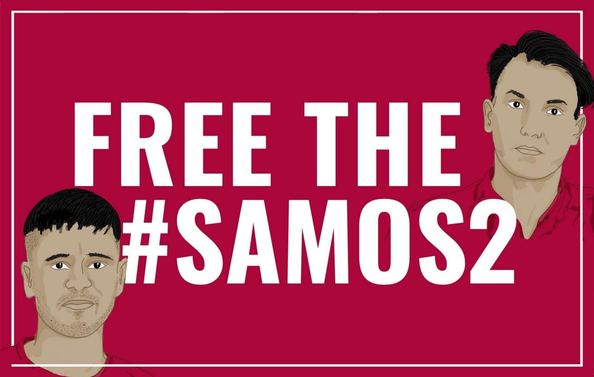

### AYS News Digest 10–11/2/2022: Eviction in Calais

BALKANS: New health project and more testimonies of pushbacks\. DENMARK: Refugee Board pushes for new deportation to Afghanistan\. NORWAY: Report on Deportation of reject asylum seekers with children in the country\. Hunger strikes in LITHUANIA & POLAND\. Continued criminalisation on GREECE’s islands…

 \(Credit: [Luis Witter](https://twitter.com/LouisWitter/status/1491592783282548741/photo/1) \)](assets/458cb08b0/1*P3mAbpKXUzILSbIZlIFzaA.jpeg)

“In more than 50 towns and villages in France, posters have appeared this evening denouncing the reality of borders, in particular at the call of the collective [Faim Aux Frontières](http://twitter.com/faimofrontieres) \(Credit: [Luis Witter](https://twitter.com/LouisWitter/status/1491592783282548741/photo/1) \)

FEATURE
#### **Eviction in Calais**

](assets/458cb08b0/1*qghRYm0B8mwj_BbumUxe-g.jpeg)

Eviction at Rue dàAjaccio, Calais, 11 February 2022 — Credit: [_Calais Logement Pour Toustes_](https://twitter.com/CalaisLogement)

On Friday, 4th February, activists of [_Calais Logement Pour Toustes_](https://twitter.com/CalaisLogement) occupied a building in Rue d’Ajaccio, which had been uninhabited for a year\. This occupation took place within the framework of the CommemorAction, an international day of mobilisation initiated by the families and relatives of people who have died at the border, to denounce the murderous migration policies of the UK, France and the EU\. As they stated in a [statement](https://fr.squat.net/2022/02/07/calais-communique-de-calais-logement-pour-toustes/) :

> “We are occupying a tower \[block\] in Rue d’Ajaccio, as well as a house on Rue Frederic Sauvage in political and material solidarity with the 1,000 people blocked at the French\-British border who are made to live outside” 

> In Calais, about 1500 people are living on the streets in unacceptable living conditions\. Displaced people occupy wastelands and have no access to basic services: housing, sanitation, water, food and medical care\. The state imposes conditions of extreme precariousness and invisibility through illegal evictions every 48 hours, the theft of personal belongings by the police, the illegal dismantling of living sites without the possibility of defence in front of a judge, and recurrent police violence\. _\(Statement by Calais logement pour toustes, 10 February\)_ 

Not only people on the move are forced to face precariousness and lack of access to housing\. The building squatted is part of a housing estate which is due to be evicted and destroyed\. Some of the inhabitants have already been evicted from their homes, while others are still opposing their eviction\.

> French or foreign, with or without papers, a roof is a right\. 

Since the occupation, police officers surrounded the building, with many residents showing support for the occupiers\. A massive police presence cordoned off the building, banning people from going in or out and impeding the provision of food and water for those stuck inside\. Police used more than 100 tear gas canisters, targeting people coming to show their solidarity\.

■■■■■■■■■■■■■■ 
> **[Calais Logement Pour Toustes](https://twitter.com/CalaisLogement) @ Twitter Says:** 

> > Ce matin,le RAID est intervenu pour expulser la tour assiégée par la police que nous occupions depuis une semaine. Utilisant des moyens dignes d’une action anti-terroriste, ils sont intervenus par le toit en hélicoptère et ont utilisé des explosifs pour fracturer les portes. https://t.co/zUzejuKPFI 

> **Tweeted at [2022-02-11 13:05:19](https://twitter.com/calaislogement/status/1492122578990866435).** 

■■■■■■■■■■■■■■ 

On Friday 11, the elite tactical unit RAID of the French Police [evicted](https://fr.squat.net/2022/02/11/calais-expulsion-par-le-raid-de-la-tour-occupee-rue-dajaccio/) the building\. Videos circulating online show officers reaching the roof of the building on a police helicopter and [launching stun grenades](https://twitter.com/CalaisLogement/status/1492122960521482248) inside the building while people were still inside\. One person was arrested\.

Once more, French authorities have responded with a militarised action to a political problem, refusing to listen to the demands of the occupants, in the same way they evict and destroy the belongings of hundreds of people living in makeshift camps on the outskirts of the city\.

Read more: [**Tactical police unit tear gasses housing activists and refugees from an empty tower block in Calais**](https://thecivilfleet.wordpress.com/2022/02/11/tactical-police-unit-tear-gasses-housing-activists-and-refugees-from-an-empty-tower-bloc-in-calais/) , by the Civil Fleet\.

GREECE
#### Update on 19 people who froze to death in Evros

Last week the bodies of [19 young people were found outside the village of Ipsala](https://theworld.org/stories/2022-02-09/turkish-border-town-migrant-pushbacks-greece-turn-deadly?fbclid=IwAR3meF_cMFAqc_tqVfjKP8f1koReMzPItoLIVnJFJOl1PSULs7Ddj1YvlGE) in Turkey in various states of undress and without their phones or wallets\. Greek migration minister Mitarachi continues to deny that pushbacks are taking place, instead blaming \(again\) Turkish propaganda despite there currently being at least eight cases at the EU Court of Human Rights regarding pushbacks from Greece\. [He states that the 19 people in question never entered Greece, even though pushbacks have been recorded in the area since the 1980s](https://www.dw.com/en/war-of-words-over-migrant-deaths-at-greece-turkey-border/a-60729270?fbclid=IwAR32eEfHa3yoKO78B3UTMDWkcvshbc6XIct0fHe_x9lv2owtgOZIR3NMDqA) \.

In the latest [Universal Periodic Review of Greece](https://undocs.org/A/HRC/49/5?fbclid=IwAR2swnDYpfIlZdRPp7uCkw6a840wAwLhWig4hb2ad01uxEhJPgP1EXBoYNg) , multiple countries have asked for [pushback allegations to be investigated](https://twitter.com/rspaegean/status/1491809353069780992?fbclid=IwAR3VD4EI0iamoZ1CjoRDL7W-gwavmlDidNgQTLrzOVP-FaXYuykju8qiQKE) \. There have also been repeated calls for independent monitoring along Greece’s borders which have been repeatedly refused by the Greek Government\.
#### Crackdown on solidarity means no human rights monitoring in the Aegean

In line with this policy of refusing border monitoring, [the Mare Liberum](https://mare-liberum.org/en/crack-down-on-solidarity/?fbclid=IwAR3dDxGS_tZIGsDJrPE2zlB00fi0QmqrzGtJekZfqZL-vvsx2cUhRsB_R94) have again been forced to leave the Aegean\.

> As most NGOs and solidarity groups in Greece we are now confronted with the NGO registry, an overall crack down on NGOs working with people on the move with the aim to control the situation at sea and in the camps to block solidarity movements\. 

They hope to announce a new strategy in the spring and to be allowed to continue their valuable work\.

> There are currently no civil monitoring or rescue assets active in the Aegean Sea\. We are devastated to leave the sea strait between Turkey and Greece again to the ruthless actions of the Hellenic Coast Guard and Frontex who are perpetrating human rights violations and border crimes on a daily basis\. We are left speechless that the Hellenic Coast Guard has been perpetrating these illegal and lethal pushbacks for two years now — without any consequences\. 

#### Criminalisation for saving lives

The Samos Two face trial in May\. N\. is charged with endangering the life of his son who drowned\. Hassan is charged with driving the boat and thus smuggling\.

> N\. , 25, lost his son to the negligence of the Greek Coast Guard\. Hasan, 23, set off with his little sister, brother and his disabled mother on a life\-threatening journey in the hope of safety and is now risking a life sentence\. The shipwreck and death of N\. s son was neither her fault, nor was it an unfortunate tragedy\. — [**_Borderline Europe_**](https://www.facebook.com/borderlineeurope/posts/5012888102067175) 

■■■■■■■■■■■■■■ 
> **[Dimitris Choulis](https://twitter.com/DimitrisChoulis) @ Twitter Says:** 

> > The witness against Hassan is his sister. She told the port police how Hassan saved everybody. Between them his mother who she couldn’t walk and he was carrying her. Now his only future is behind bars. #Refugees are not smugglers. #samos2 

> **Tweeted at [2022-02-10 20:34:47](https://twitter.com/dimitrischoulis/status/1491873300896784394).** 

■■■■■■■■■■■■■■ 

There is a [current petition](https://www.change.org/p/efeteioaigaiou-gmail-com-lasst-die-anklage-gegen-n-hasan-fallen?fbclid=IwAR19EjPaXOlB4-FyFKWS0quyMwKxEHYxXAK02RVXugGuIf5jTHym-MIroKM) calling for the charges to be dropped and [a fund to support them during their legal struggle](https://www.betterplace.org/en/projects/101514-free-the-samos2-stop-the-criminalization-of-refugees-in-greece?fbclid=IwAR0ZJKzxPPuHPpteFogtKW_TdvsutNNgLt6JkLrlrS-6xA3xvvNi6DktX3w) \.
#### Pushback in the Aegean

On the morning of Saturday 5th, a boat carrying 20 people landed on Samos and contacted Aegean Boat report\. Seventeen people in the group were arrested and put into two boats which drifted apart\. Of the three remaining people, one was a woman with a severe leg injury and they walked to a hospital\.

> They didn’t get any medical assistance, instead they were arrested by police, blindfolded, transported to the port, robbed of all their belongings and beaten, before taken out to sea\. 

> They claim that the Greek coast guard threw them directly into the sea, no boat, no life jackets, if true, this is nothing but attempted murder\. — [**_Aegean Boat Report_**](https://aegeanboatreport.com/2022/02/10/pushbacks-should-never-be-normalised-pushbacks-should-never-be-legalized/?fbclid=IwAR2MqHLhi4Amyc4fakI7_LZiyI9XC1nAALG9Jy__PbhZLOJ8TdS9-nawvXg) 

Three of the twenty people were pregnant women\.

In another incident, a boat with 180 people was intercepted and towed back to Turkey\. It is unclear if the boat was in Greek or Turkish waters\. If Greek, then this is also a case of a pushback\.

■■■■■■■■■■■■■■ 
> **[Daphne Tolis](https://twitter.com/daphnetoli) @ Twitter Says:** 

> > The Greek coastguard intercepted a boat with 180 people off the island of #Samos on Friday. The boat was reportedly heading to Italy. According to the @[HCoastGuard](https://twitter.com/HCoastGuard), Turkey’s coastguard was informed and returned the people back to Turkey and towed the boat to shore. https://t.co/u3jVxXrWXS 

> **Tweeted at [2022-02-11 13:52:42](https://twitter.com/daphnetoli/status/1492134502298173443).** 

■■■■■■■■■■■■■■ 

#### Where does all the money go?

Questions have once again been raised as to where the money fundraised in the wake of the fire at Moria in September 2020 ended up\. [Caritas Austria reportedly raised 2\.3 million Euros, yet only spent 854,000\.](https://jungle.world/blog/von-tunis-nach-teheran/2022/02/update-moria-und-die-caritas-millionen?fbclid=IwAR12V3-9R9KYnq6nNOiUlLWEX75Vwc_pOVEy8VcaTsuo6h9lds34UE3mSr4) According the [Moria Corona Awareness Team](https://www.facebook.com/MoriaWhiteHelmets/posts/497250955251302) , Drop in the Ocean also received three million in 2020 for carrying out Corona safety work in the island camps, but only spent 1\.6 million and where not actually present in Moria at the time\.
#### Self Defence instructor training for women in Athens

Training taking place from 20th to 25th March\. Register [HERE\.](https://forms.office.com/pages/responsepage.aspx?id=wMBlTUsS9EO32pfQu9cbfjKmwH9TGRxMjWfigYD9kCBUREVKNlFHTENBQU1YMzI3UzZSMEdNVTRPSi4u&fbclid=IwAR2WcRmnRmVCUEHrkxxS064sSZ12s8d4Ve9EgJzyKi3unM-1fHASqC4GxQw)

LITHUANIA
#### Multiple reports of mistreatment and inhumane living conditions

[The Kybartai centre used to be a correctional facility](https://www.lrt.lt/en/news-in-english/19/1610208/cold-water-and-3-square-metres-of-space-what-s-life-like-in-lithuania-s-prison-turned-migrant-cetre?fbclid=IwAR2hKzLn51ZMFcl5pD9nUd9tvGCswnxRL3uAHPWYXY7KmKQQ1jVYFf_X7Fw) and was converted to house people on the move four months ago\. The area where people are now housed was a disciplinary area used for the punishment of prisoners\. Current residents only have three square metres each, but the required minimum is four square metres\. There are currently about 550 people there\. People are offered 1000 euro to go back to their home countries\.

[The Head of the Seimas Ombudsmen’s Office, Erika Leonaitė, concluded in a recent report](https://www.lrt.lt/en/news-in-english/19/1596976/report-slams-lithuania-s-treatment-of-asylum-seekers-as-inhuman-and-degrading?fbclid=IwAR2Fipp0znDiYXPLqpkZ2kMp18a-o7-NW_v4IZymEa5fvD2vsrqwLIR1ugY) that the conditions are equivalent to inhuman or degrading treatment, prohibited under the Convention against Torture and Other Cruel, Inhuman or Degrading Treatment or Punishment\. On the 10th, it was reported that [there is an ongoing hunger strike](https://www.facebook.com/ewa.wolkanowska/posts/10161672788638574) in the centre and several people had passed out\.

In the Pabradé camp there have also been protests\. [One person who spoke to Info Migrants about the diabolical living conditions was later taken away and beaten\.](https://www.infomigrants.net/en/post/38475/the-soldiers-wake-us-up-at-6am-they-come-with-dogs-eric-inside-a-migrant-camp-in-lithuania?fbclid=IwAR2MqHLhi4Amyc4fakI7_LZiyI9XC1nAALG9Jy__PbhZLOJ8TdS9-nawvXg) He has since been uncontactable and journalists are forbidden entry\. It is a heavily militarised space, soldiers carry arms and army dogs frequently attack residents\. Racist language is used and medical help is routinely withheld\.

It has been reported that [asylum claims are not being properly dealt with\. So far only 2% have been accepted](https://observers.france24.com/en/tv-shows/the-observers/20220211-migrants-stuck-in-lithuania-report-dismal-living-conditions-we-have-no-hope?fbclid=IwAR3NSs73fwvFlpfbSfBy3vVoVa-IbZe8KBaXUshY97hbpVUu7dUgKau4BtY) \.

POLAND/BELARUS
#### Protest against the wall

Today, Saturday the 12th, a [protest was held in Poland](https://radar.squat.net/en/event/no-borders-team/2022-02-12/solidarity-demonstration-enough-criminalizing-migration) demanding an end to anti\-immigration rhetoric, the criminalisation of people on the move, detention and the border wall\.

> Anti\-immigration propaganda makes it possible to arouse an irrational fear of “strangers” in society, which enables the introduction of further states of emergency and restriction of freedom not only for migrants, but for all society\. Outwardly, entrepreneurs and politicians show concern through generously subsidized charities while in the background, in politics, they do everything to maintain the status quo — namely the dependency of the so\-called ‘countries of the global south’\. They ignore the fact that this dependency leads to war, inequality in the distribution of resources, flight and migration\. Underpinned by media reports, we are becoming more and more accustomed to the fact that a life is worth different amounts depending on which side of the border we stand\. 

#### Hunger strike against detention conditions

There are 130 people on hunger strike in the Wędrzyn centre, which is a part of a military base that was converted for use as a guarded holding centre for border\-crossers last August\. It houses 600 people in total, [24 to a room](https://www.infomigrants.net/en/post/38499/migrants-in-polish-detention-center-stage-hunger-protest?fbclid=IwAR3Sf5Z1Q-4zpbc-YsOjQXrqlTrLkgibSannHnpurMC9ZkMxyrnkMkDPz90) , [in conditions described by Poland’s deputy commissioner for human rights, Hanna Machińska, as inhumane and degrading](https://notesfrompoland.com/2022/02/10/hunger-protest-over-conditions-at-holding-centre-for-refugees-and-migrants-in-poland/?fbclid=IwAR3NSs73fwvFlpfbSfBy3vVoVa-IbZe8KBaXUshY97hbpVUu7dUgKau4BtY) \. The people striking [have hung signs on their doors saying ‘Freedom\.’](https://www.facebook.com/SeebrueckeSchafftsichereHaefen/posts/1574280056277505)
#### Polish couple jailed for smuggling

[Two people have been sentenced after admitting to transporting 16 Iraqi Kurdish people](https://www.infomigrants.net/en/post/38493/couple-receive-jail-terms-for-smuggling-migrants-to-germany?fbclid=IwAR2swnDYpfIlZdRPp7uCkw6a840wAwLhWig4hb2ad01uxEhJPgP1EXBoYNg) , 12 adults and four children, from the Polish city of Bialystok, on the Belarus border with Poland, to Germany\. The minivan they used was just 5\.4 cubic meters in volume which, given that the journey happened in summer, could have led to suffocation\.
#### BALKANS
#### Project BURN — Health on the Move is active in Bihac

The project [BURN — Health on the Move](https://www.facebook.com/NoNameKitchenBelgrade/posts/1415614902170123) in Bihac, born from a collaboration between [No Name Kitchen](https://www.facebook.com/NoNameKitchenBelgrade/?__cft__[0]=AZWaxtngDYXSUD5Zf6qH54eDs0-rmCv3wkZUHBt2wzJ4ZZXenMi55KmXauC_CnManI4oue-fpqNQHAdOpd-X5Yq-rLLAqAnWBCj5TfLog1xwqXagaR9TNzLZZzKkSCf6XqTnbCH71wQ02xZboD5h8n7X&__tn__=kK-R) , [YaBasta Bologna](https://www.facebook.com/YaBastaBologna/?__cft__[0]=AZWaxtngDYXSUD5Zf6qH54eDs0-rmCv3wkZUHBt2wzJ4ZZXenMi55KmXauC_CnManI4oue-fpqNQHAdOpd-X5Yq-rLLAqAnWBCj5TfLog1xwqXagaR9TNzLZZzKkSCf6XqTnbCH71wQ02xZboD5h8n7X&__tn__=kK-R) and [Laboratorio Salute Popolare](https://www.facebook.com/labsalutepopolare/?__cft__[0]=AZWaxtngDYXSUD5Zf6qH54eDs0-rmCv3wkZUHBt2wzJ4ZZXenMi55KmXauC_CnManI4oue-fpqNQHAdOpd-X5Yq-rLLAqAnWBCj5TfLog1xwqXagaR9TNzLZZzKkSCf6XqTnbCH71wQ02xZboD5h8n7X&__tn__=kK-R) , has started\!

The project will provide an increasingly structured response to health issues for people travelling on the Balkan route and facilitate access to adequate medical care\. The team will include two people with a medical and health background who will be able to respond to first aid problems, one activist facilitating access to specialised treatment \(such as eye or dental treatment, which is almost impossible to access for people on the move\), and two more people who will develop a system for scabies treatment, hot water showers, washing of dirty or abandoned clothes and distribution of hygiene products\.
#### Testimonies of pushbacks from the Croatian/Bosnian border

On the morning of 27th January 2022, [a group of six people was pushed back from Croatia to Bosnia and Herzegovina](https://www.borderviolence.eu/violence-reports/january-27-2022-0200-green-border-near-melinovac/) \. The group consisted of six men from Afghanistan, including two minors\. Border Violence Monitoring Network report on this violent pushbacks, with uniformed officers kicking people on the move in the legs and chest\.

This is only one of many pushbacks in the area and across Europe\. Since then, as we reported, a note from the Croatian Minister of the Interior emerged in which it is spelled out that “border securitisation, along with its disregard for human rights and the right to seek protection, is defined, ordered and observed by the top officials of the MoI\.” Furthermore, the MoI has alerted all police officers on the border to watch out for cameras that may be recording their illegal actions\.

Read more: [**The police are also embarrassed**](https://www.portalnovosti.com/milena-zajovic-i-policajcima-je-neugodno) , an interview with journalist and AYS president Milena Zajović\.

GERMANY
#### Detention and deportations

A young woman, mother of three, was [arrested](https://www.wp.de/staedte/siegerland/angst-vor-abschiebung-elvin-muradis-ehefrau-festgenommen-id234550245.html) on Friday in Siegen, North\-Rhine\-Westphalia\. She was at the local immigration office to sign for an apprenticeship when officers took her and put her in arrest, pending detention\. Her husband is already under risk of being deported, and now she has been separated from her three children\.

On the same day, several activists showed their solidarity in front of the police station where she is now detained\.

Deportation Alarm reports of a [collective deportation charter flight](https://twitter.com/Deport_Alarm/status/1492125557953343496) to Serbia and Northern Macedonia on Monday, 14 February at 12:15 from the Baden\-Baden airport of Karlsruhe, in south\-west Germany\.

FRANCE
#### New Surveillance cameras on the French channel coast

Infomigrants reports of a [new surveillance project](https://www.infomigrants.net/en/post/38473/france-new-surveillance-cameras-to-stop-migrant-smuggling) targeting people on the move, dubbed “Terminus” and funded by British authorities\. Through this project, dozens of new cameras will be installed in more than 20 locations on the French coast of the Channel\. About 50 cameras will be installed between Montreuil and Calais by the middle of this year\. Reportedly, the aim is to record smuggling activities\. The cost of the project is not yet known, and French police have issued assurances that British authorities will not have access to the video feeds\.
#### Paris: Food collection organised by Red Star FC

The Paris football club Red Star FC will organise a [solidarity food collection](https://www.redstar.fr/2022-02-10/divers/solidarite) for Solidaritè Migrantes Wilson on Monday, 21st February at the Bauer stadium, where they will play against Annecy\.

> The Red Star is convinced that we all have a role to play in helping people in precarious situations to live with more dignity\. 

> This is why the club organises a food drive for the benefit of those in need\. The Red Star invites all Red Star fans to participate in the food collection as part of the match against Annecy\. You will be able to drop off your donations at the entrance to the Stade Bauer from 7:15 p\.m\. on the evening of the match\. 

DENMARK
#### Refugee Appeals Board pushes for new deportations to Afghanistan

The Danish Refugee Appeals Board took the decision to push for deportation to Afghanistan once again\. In a recent case, they stated that “the general conditions in Afghanistan after the Taliban’s takeover could in themselves justify a residence permit”\.

Quoting words here and there from recent reports from the EU and the Danish Immigration Service, they justified their decision [stating](https://www.dr.dk/nyheder/seneste/afgoerelse-faldet-udvisning-af-afghansk-flygtning-stadfaestes) that “since the Taliban regime occupied the capital of Afghanistan, Kabul on 15 August 2021, and subsequently declared war on the previous government and also formed a temporary government on 7 September 2021, the general security situation in Afghanistan has been improved\.” In order to push for the restart of deportations, they incidentally admitted that the country, even before the Taliban return to power, “had to be described as a so\-called non\-international armed conflict\.”

Now the Danish government will have to decide whether to follow this indication and cooperate with the Taliban or not\. Anyway, Afghan people in Denmark are, once again, in a dangerous limbo\.

NORWAY
#### Stop deportation of parents of children\!

NOAS — The Norwegian Organisation for Asylum Seekers [reports](https://www.noas.no/stopp-utvisning-av-foreldrene-til-barn-i-norge/) that on Tuesday, the Ministry of Justice presented a report on deportation of rejected asylum seekers with children in Norway\.

NOAS stated that several of the conclusions and recommendations in the report are in line with the organisation’s views also in relation to the child’s best interests in deportation cases\. While the committee behind the report is divided on many of the conclusions, NOAS stress that the Ministry should follow up on their intention to protect children and their parents\.

SEA
#### A total of 128 people rescued in the Med

[On Friday, 80 \(other sources say 75\) people in the Maltese SAR zone contacted Alarm Phone](https://twitter.com/alarm_phone/status/1492169044035780612?fbclid=IwAR3_2cBnuaLiSC24XQR3-7-Jy0YjYCl83hGUI0r2GV0KSDw41LgOEzhqotU) \. The Maltese Authorities did not respond, but the group were eventually rescued by the Italian Coast Guard and brought to Lampedusa\. [Two further groups of 14 and 39 were also rescued](https://tg24.sky.it/palermo/2022/02/11/migranti-lampedusa-news?fbclid=IwAR0YYD9jZ6o3zBYsPsutEGF7vaqPtmFpww_j4qCRIIgn8hbHcXw74d0PMlo) \.
#### Over 200 people rescued in the Atlantic

A total of [222 people were rescued from four boats](https://www.swissinfo.ch/spa/espa%C3%B1a-inmigraci%C3%B3n_m%C3%A1s-de-200-inmigrantes-rescatados-en-el-mar-cerca-de-islas-espa%C3%B1olas/47339662?fbclid=IwAR3meF_cMFAqc_tqVfjKP8f1koReMzPItoLIVnJFJOl1PSULs7Ddj1YvlGE) and brought to Gran Canaria\. Six people required hospital treatment\.
#### 50 people returned to Libya

On the same day, [50 people found themselves in distress off the coast of Libya](https://twitter.com/alarm_phone/status/1492044468442349568?fbclid=IwAR1Cn1Fw3tp79xVeA231zkOqRLfK0knMoRKF3WlWNFzq55mdv-AmHJ9-jwM) \. They were picked up by the Libyan Coast Guard and forced back to Libya\.
#### Non\-assistance in the Atlantic leads to preventable deaths

[On 6th February, Alarm Phone was in contact with 54 people](https://alarmphone.org/en/2022/02/09/migrants-lives-dont-matter-in-the-atlantic-another-case-of-fatal-non-assistance/?fbclid=IwAR2EdtT_sLQFDh7z-lsgb8eIy89ptxKBj6tTcV4bRHfv7CxsIg7l75K6LpE) aboard a vessel in the Atlantic\. One person had already reportedly died and their boat was half deflated\. Though the Spanish and Moroccan Authorities were informed and their boats were in the area, there was no rescue until the 7th when, according to the people on board, three further lives had already been lost\. As many as [151 people have already drowned or gone missing in the Mediterranean in 2022\.](https://www.facebook.com/SeebrueckeSchafftsichereHaefen/posts/1574852932886884)
#### Sea Watch Fact Sheet

Sea Watch have [published a fact sheet](https://sea-watch.org/en/airborne-monthly-factsheet-november-2021/?fbclid=IwAR3zejFAa8cxuzGBuMYwznc0HVSGmeB2MF4byjsI2ce0G9rcvRXBFuXeMeA) detailing distress calls and operations during November 2021\. During this time they spotted at least 1,862 persons in distress aboard 25 different boats\.

EU/FRONTEX
#### French Presidency Pushing for detention at EU borders

During its EU Presidency, [France wants to instigate a five\-day window after arrival during which people would be considered as not having fulfilled the entry requirements](https://euobserver.com/migration/154340?s=09&fbclid=IwAR2AKeDj3dQtLPQi_1NqZS75XduOpeJhpNcmbl67mRuB2sRSCe9cy4zvu-w) and thus would not yet be legally present in Europe\. This of course leaves people even more vulnerable to rights abuses at EU borders\. There are concerns that it could lead to more Moria\-style camps\.
#### Frontex and EU expansion into Africa

The ever expanding agency is now [making deals with Senegal to further its reach outside Europe’s borders and Mauritania might be next](https://digit.site36.net/2022/02/11/status-agreement-with-senegal-frontex-wants-to-operate-in-africa-for-the-first-time/?fbclid=IwAR3AJh8gVrwRZPOm8kPY6rdRoLsoOciyQj0DMVhokNPmXogOX6MChN-vLTk) \. Ylva Johansson has offered Senegal an operational force and surveillance equipment such as drones and vessels\. The the [EU\-African Union \(AU\) summit is on 17–18 February](https://ecre.org/frontex-eu-border-control-in-africa-set-to-expand-commission-floats-political-oversight-switzerland-to-vote-on-frontex-funding-belgium-plans-scrutiny-hearing/?fbclid=IwAR2swnDYpfIlZdRPp7uCkw6a840wAwLhWig4hb2ad01uxEhJPgP1EXBoYNg) \.

[The Belgian Government is due to hold a hearing](https://www.statewatch.org/news/2022/february/belgium-parliamentary-scrutiny-not-over-for-frontex/?fbclid=IwAR1UtHEOZazr61NR2vriaNWjzKAKe8nktKNyu4Kbcu6hIm2xXkV78cb-eq4) on Frontex involvement in pushbacks and Switzerland will have a referendum in May over increasing funding to the agency\.

Meanwhile, the European Maritime Safety Agency is furthering its activities in Libya\.

■■■■■■■■■■■■■■ 
> **[Matthias Monroy (@Mastodon)](https://twitter.com/matthimon) @ Twitter Says:** 

> > With a new cooperation agreement, #EMSA is offering the military mission EUNAVFOR MED it's "Automated Behaviour Monitoring" (ABM) capabilities. 
#IRINI might "keep a close eye on Libya’s ports" and target vessels based on their "suspicious behaviour":
[emsa.europa.eu/newsroom/press…](https://www.emsa.europa.eu/newsroom/press-releases/item/4648-emsa-signs-cooperation-agreements-with-eu-naval-missions-to-provide-enhanced-maritime-awareness-for-operations-in-somalia-and-libya.html) https://t.co/MWTnMARIKT 

> **Tweeted at [2022-02-11 09:52:18](https://twitter.com/matthimon/status/1492074004852752385).** 

■■■■■■■■■■■■■■ 

GENERAL
#### The true cost of the politics of exclusion

■■■■■■■■■■■■■■ 
> **[Tihomir Sabchev](https://twitter.com/TihomirSabchev) @ Twitter Says:** 

> > More than 47,000 deaths since 2014, half of them in the Mediterranean. https://t.co/4fA3UYqMmk 

> **Tweeted at [2022-02-11 09:10:34](https://twitter.com/tihomirsabchev/status/1492063500474228749).** 

■■■■■■■■■■■■■■ 

WORTH READING
- [**Racial Capitalism and the “Migration Fix”**](https://www.law.ox.ac.uk/research-subject-groups/centre-criminology/centreborder-criminologies/blog/2022/02/racial-capitalism) , by Gemma Bird, Davide Schmid\.

_“…we argue that state and international actors draw on a series of bordering and encampment practises to manage uneven patterns of capitalist development, creating certain racialised spaces and places for the housing and policing of displaced people\.”_
- [**The EU Court of Human Rights is failing to provide effective remedies to people on the move**](https://www.ejiltalk.org/a-lost-opportunity-for-border-justice-at-the-european-court-of-human-rights/) , an article by Itamar Mann for EJIL:Talk\!
- [**ECRE Weekly Bullettin**](https://mailchi.mp/ecre/ecre-weekly-bulletin-11022022) & [**ELENA Legal Update**](https://mailchi.mp/ecre/elena-weekly-legal-update-11-february-2022?e=1fd2db1ebf) , 11 February 2022
- [**Forced Migration — Thematic focus on Gender Issues**](https://fm-cab.blogspot.com/2022/02/thematic-focus-gender-issues.html)
- [**Where have the people trapped at the border gone?**](https://bylinetimes.com/2022/02/11/humanitarian-crisis-the-asylum-seekers-slipping-out-of-sight-on-the-polish-border/) By Linda Mannheim for Byline Times
- [**An in\-depth look at the role of Frontex in EU migration policy and fundamental rights abuses**](https://www.theoutlawocean.com/investigations/the-secretive-libyan-prisons-that-keep-migrants-out-of-europe/subsequent-coverage/europes-border-agency-under-fire/) , by Ian Urbina & Joe Galvin for The Outlaw Ocean

**Find daily updates and special reports on our [Medium page](https://medium.com/are-you-syrious) \.**

**If you wish to contribute, either by writing a report or a story, or by joining the info gathering team, please let us know\.**

**We strive to echo correct news from the ground through collaboration and fairness\. Every effort has been made to credit organisations and individuals with regard to the supply of information, video, and photo material \(in cases where the source wanted to be accredited\) \. Please notify us regarding corrections\.**

**If there’s anything you want to share or comment, contact us through Facebook, Twitter or write to: areyousyrious@gmail\.com**

_Converted [Medium Post](https://medium.com/are-you-syrious/ays-news-digest-10-11-2-2022-eviction-in-calais-458cb08b0) by [ZMediumToMarkdown](https://github.com/ZhgChgLi/ZMediumToMarkdown)._
