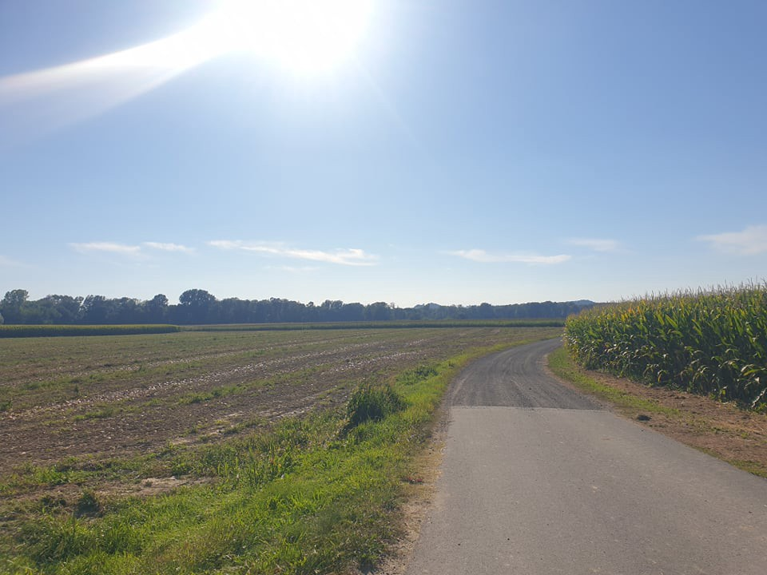
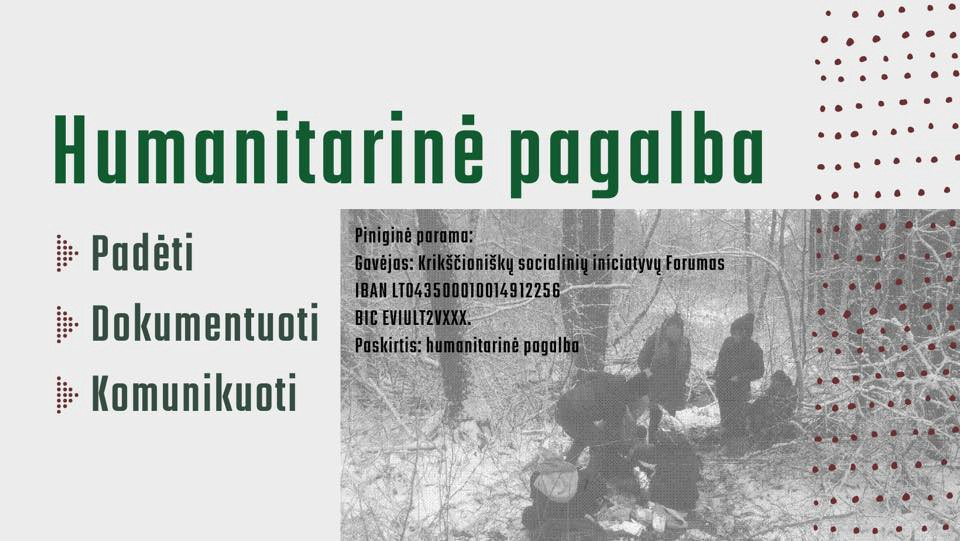

### AYS News Digest 21/2/22: A minor who had been pushed back wins appeal in Austrian Court
#### EU opts for “a large wave of returns” in the agreement with Cyprus / New pullbacks to Libya / UK: the first inquiry into immigration detention in the UK resumes / Lithuanian activists need support / In the case of Belarus, the ECHR applied interim measures in 65 of the 69 applications / updates, reports and stuff worth reading

The area near Bad Radkersburg where pushbacks occur frequently \(Photo: AYS\)

The Regional Administrative Court of Styria declared the rejection of Amin N\. to be unlawful and concluded, among other things, that push\-backs in Austria “are used methodically”\.”

During the identification procedure, the complainant stated that he wanted to apply for asylum and was told by a police officer that he should not worry, that a bus would come later and that proceedings would be initiated\. When asked about medical care, the complainant was told that there was a doctor in the camp\. The complainant suffered from pain in his legs as he had already been walking for 17 hours\. As the legal documents further state, when handed over to the Slovenian police, the complainant commented to a Slovenian police officer that he had intended to ask for asylum in Austria, the Slovenian police told him that he was not informed about this\. The Slovenian police officer then spoke to his superior, but to no avail\. In the end, all the persons apprehended were handed over to the Slovenian police and taken to Slovenia by bus\. The complainant has in the meantime been granted asylum in Slovenia\.

The reason for the rejection was allegedly that no application for international protection had been filed by the complainant\. This would have required at least an informal request to place himself under the protection of Austria\. The police officers had stated that none of the persons apprehended had applied for asylum or international protection\. Although the prosecuting authority claimed that the return was lawful, in accordance with Art\. 14 Schengen Borders Code, the Court verdict reads:

> The rejection of the complainant had taken place unlawfully, as the complainant had been granted de facto protection against deportation within as covered by § 12 of the Asylum Law \(AsylG\) \.
 

> Therefore, the application was made to declare the refoulement unlawful and to declare that the refoulement had violated the complainant’s right of protection against preventing him from entering the country or refusal of entry despite legal requirements having been met\. In addition, an application for costs was filed\. A complaint pertaining to the directive was submitted concurrently and dealt with in another procedure, GZ: LVwG 22\.3–2622/2021\. 

#### EU
### ECHR update on interim decisions concerning member States’ borders with Belarus

The latest press release of the ECHR regarding the interim measures goes in the direction of supporting the rights of the people not to be sent back to imminent danger and other circumstances likely depriving them of their right in Belarus, thus preventing pushbacks in this context\.

The requests for interim measures since August 2021 from individuals at the Belarusian borders with Council of Europe member States \(mostly in Poland or those claiming they are in Poland and expressing the intention to seek asylum\) fell under Article 3 \(prohibition on inhuman or degrading treatment\) and Article 2 \(right to life\) of the European Convention\.

Since August 2021 the Court has ruled on requests for interim measures in 65 applications involving Poland, three applications involving Lithuania and one application involving Latvia\.

> Overall, the Court applied interim measures in 65 of the 69 applications\. 

See the entire document [here](https://hudoc.echr.coe.int/fre-press#{%22itemid%22:[%22003-7264687-9892524%22]}) \.

_Interim measures are applied only in limited situations: the most typical cases are ones in which there are fears of a threat to life \(situation falling under Article 2 of the Convention\) or  ill\-treatment prohibited by Article 3 of the Convention \(prohibition of torture and inhuman or degrading treatment\) \. In highly exceptional cases they can also be applied in respect of certain requests relating to the right to respect for private and family life \(Article 8 of the Convention\) \. The vast majority of interim measures indicated concern deportation and extradition cases\. In these cases, the Court can request the State concerned to suspend a deportation order against the applicant\._
#### THE MEDITERRANEAN

The journey and torture in Libya is what the [stories](https://www.rainews.it/tgr/sicilia/video/2022/02/sic-migranti-ocean-viking-nave-torture-libia-bea9c4bb-3e75-42b4-ba23-33dfa666751f.html?fbclid=IwAR2Gq-K4oqRPkN05ZAhXcmSz4xKcEg3k0yWZnzFNTkksYWEWIqvOpwpCjpw) of the people on the Ocean Viking are telling — The ship is off the coast of Syracuse and has been asking for a safe port for days\. In the meantime, the Lampedusa hotspot, where only 31 people remain, is almost empty\.

■■■■■■■■■■■■■■ 
> **[SOS MEDITERRANEE](https://twitter.com/SOSMedIntl) @ Twitter Says:** 

> > The disembarkation of the 201 remaining survivors from #OceanViking is now complete. 

As rescue operations only legally end once survivors are disembarked in a Place of Safety, the 5 rescues of 247 people from unseaworthy boats in distress last weekend/Monday are now complete. https://t.co/eFtj5gbKft 

> **Tweeted at [2022-02-20 11:04:13](https://twitter.com/sosmedintl/status/1495353592143826950).** 

■■■■■■■■■■■■■■ 

At the same time, Malta failed to welcome newly arriving rafts with people in distress and people were once again pulled back to Libya

■■■■■■■■■■■■■■ 
> **[Alarm Phone](https://twitter.com/alarm_phone) @ Twitter Says:** 

> > UPDATE !
Finally, after hours of uncertainty relatives confirmed the interception of the ~68 people by the so-called Libyan Coastguard, which matches with the spotting of @[PVolontaires](https://twitter.com/PVolontaires) from yesterday. All people are imprisoned now back in #Libya. #CrimesOfMalta 

> **Tweeted at [2022-02-20 12:38:12](https://twitter.com/alarm_phone/status/1495377243786420232).** 

■■■■■■■■■■■■■■ 

#### CYPRUS
### EU opts for “a large wave of returns” in the agreement with Cyprus

Aiming to “enhance first reception capacity, the implementation of timely asylum procedures, establish effective integration and improve the efficiency of returns”, with a particular focus on the last one, a memorandum was signed with the EU on Monday\.

To the Cypriot understanding of the memorandum, it “has identified three key areas for improvement: identifying and dealing with migration flows from Turkey, assisting in asylum procedures through funding while also increasing the number of people returned to their countries of origin\.”

European Commission vice\-president Margaritis Schinas said there must be a “large wave of returns to their country of origin for those who do not have the right to remain in Europe and he will go to Turkey himself in March to address the issue of irregular migrants\.” See [more](https://cyprus-mail.com/2022/02/21/historic-agreement-on-migrations-signed-with-eu/?fbclid=IwAR22ZWGE4w4xoBDsaCh6w98sjlkkUm9HkJOniX0lXmzIJK2ihym-vPlXKvE) \.
#### FRANCE

Following the passage of storms, an emergency accommodation facility was temporarily set up in Calais\.

_Nice initiative, now we just need to keep it open 365 days a year for a decent start,_ they say\.

More reporting from Calais, in [Spanish](https://l.facebook.com/l.php?u=https%3A%2F%2Fwww.elsaltodiario.com%2Fmigracion%2Fcalais-la-ultima-frontera-de-europa%3Ffbclid%3DIwAR1jgdSexzOtUcjozQqd6laRLYb_fw1pYyBXhbVAqdEf40-kLDYZPOuMwT4&h=AT1W9I0-q6tTtQWmTsBpE2v_FZ44Y6wSiq21u8-tKHnoIkRoSsEedVIVx8BZxS2AeM9U0m_mVLfem_zpSdCU0M1CSh-yaQdclzFM9VRuJTKZJvH4dl_Lny2LRFtoakiJC8OBYMNBAjn1gxpuA3IZwDKR4KXwHg&__tn__=R]-R&c[0]=AT3Ro-CK5E85EF1GRXT3A09D-NUZ82QtT3iEv3SZ5_gWGOuMjwZoy1iVATh2xJ9CdQDolog207oR6vgZlOvHsH1_xxiLAEYejYkxyyp7CPcExQiabrTj4E7Qz2l27JGxw-UPeAeX8VIeS9LZpARtoaQ6MsQGc_ds7Dd7yXqL_iq_lZd_Q1Uq3ygz6he605YPiHKMAR6oOZ4x) : The routes of arrival in the north of France, to the camps of Calais and Dunkirk, are almost as diverse as the reasons why migrants, once again, are willing to risk their lives in this last sea\.
#### LITHUANIA

From the report on activities of the volunteer activists group [Sienos](http://Sienos Grupė) :

> We are communicating with a lot of asylum seekers held currently in prison like detention centers in Lithuania\. 

> Their psychological state and the tension arising from their interactions with the officers of those centers is very worrying\. We have been communicating with these people from the beginning of our activity\. 

> We are meeting now more often with people from those camps\. We are looking for ways to offer them a more consistent communication\. Emotional support, how to provide them with a sense that they are valued and how to help them survive the undefined period of the detention\. 

> You will hear from us soon more about the life and day to day reality of the imprisoned migrants\. 

> At the moment the majority of this support goes to cover legal expenses, rent of our facilities, fuel and coverage of other volunteer compensation costs, materials \(educational, art\) and other services for the people held in camps\. 

#### NORWAY
### Information to Afghans in Norway

Afghans can now apply to have their asylum application processed again\. One can also apply to stay in Norway while the application is being processed\.
See more information [here](https://l.facebook.com/l.php?u=https%3A%2F%2Fwww.noas.no%2Finformasjon-til-afghanere-i-norge-uten-tillatelse%2F%3Ffbclid%3DIwAR1SgGjnHR5fGdo-bSfugbDAkOR07xdKI4lNrCwBB0zaEfafTd6IO-ksH04&h=AT2FEOjADy5AJ5ooZeV7-RQtlC9pMEciztmzoQbryhPCYS1uTsbKeUzcOxw7CxiV6dNmC4VPkmAlac5RtUboy1xcyHcDgPQNbpm5Q3PeKNhPp5zOVAJuopbAF2hppFITIEcAlzjmsrJlHOE7Es0ZSoDo5GwxCg&__tn__=R]-R&c[0]=AT2ZmH5P_m4rivdjvLifa0I8EpG_oX379MBmCV5bcg7opQURK7t-3KHvQkzWCGpQCA2NW6YU4iQSk3wQ5BEN6Kvp1t9hFmm6NFxdGaeMA6SRZRlNpBpC1tlbKYcKc0HjqENe_U2httunKMQV57hSKRyIosn9bwO_v-0t5PJCIU4ekyuSaCPEm9KoOZLfLRd2asqip7fLrEDT) \.
#### UK
### The Brook House Inquiry — the first inquiry into immigration detention in the UK — resumes

[DuncanLewisPublicLaw](https://twitter.com/DLPublicLaw) is representing 13 Core Participants & Witnesses, mainly former detainees at Brook House who experienced bullying, racist abuse or physical assault\.

The [mistreatment](https://www.duncanlewis.co.uk/news/Brook_House_Public_Inquiry_Hearings_Begin_(22_November_2021).html) was first exposed in the BBC Panorama programme “Under\-Cover: Britain’s Immigration Secrets”, aired on 4 September 2017 can be watched [here](https://www.youtube.com/watch?v=_fp0QLDKgME) \.

The programme followed an undercover detention officer secretly filming inside Brook House on behalf of the BBC\. The footage revealed repeated, routine and appalling mistreatment and abuse including racial abuse of detainees by officers\. Most shockingly, it showed one officer strangling a detainee, ‘MA’, and threatening to put him “to sleep” before detention and healthcare staff conspired to cover it up\. MA was a suicidal detainee with a history of severe mental\-ill health and trauma\. He was being observed on ‘constant supervision’ at the time of the assault\.

> Strangulation, hand binding, humiliation rituals, threats that one man would be “throttled and put to sleep”\. Another was stripped naked while staff gathered around and laughed at him\. 

#### GENERAL

From our network:

■■■■■■■■■■■■■■ 
> **[Border Violence Monitoring Network](https://twitter.com/Border_Violence) @ Twitter Says:** 

> > Today BVMN attended the🇺🇳Human Rights Council Intersessional Panel Discussion on the Human Rights of Migrants in Vulnerable Situations. In the sessions' follow-up, BVMN will outline the widespread and systematic use of #pushbacks by 🇪🇺 🇭🇷 🇬🇷[twitter.com/UNSR_Migration…](https://twitter.com/UNSR_Migration/status/1495655301512585218?s=20&t=KOZsSYuh5cOQZNwCnFIO6g) 

> **Tweeted at [2022-02-21 14:04:16](https://twitter.com/border_violence/status/1495761292614848517).** 

■■■■■■■■■■■■■■ 

](assets/704743af4ff9/0*dDN9ojy7ApAs9Z6u)

Sign up here [https://bit\.ly/3h2Mfyt](https://t.co/hiF86OqW0U)

Some perspectives on the welcoming of Ukrainian refugees in Poland — [here](https://euobserver.com/migration/154391?fbclid=IwAR0CVk6O38HGUVQivFk7gHdo88JpqkoxAQR3Xtf6_UDEpR2Q8kkBNAF8VBU)
#### WORTH READING
- Where individuals can be so apprehended, detained and deported without due process, the right to asylum — indeed any legal protection — dies\. In light of what we have observed at the EU’s external borders, would one really want [pushbacks](https://socialeurope.eu/border-pushbacks-its-time-for-impunity-to-end) to be legally endorsed _within_ the EU?

- Al\-Mabani was emblematic of the unaccountable nature of Libya’s broader detention system\. Now, Libya closed its most notorious jail\. — Is That Good News?

- Everyday Violence and Resistance in Europe’s ‘Migration Management’ During the Covid\-19 Pandemic

- New Mixed Migration update:

- IMIX’s Ahmed Elmi writes about the historical significance of free movement for queer people seeking safety:

- Caught between Frontex and the Libyan Coast Guard, chronicling a migrant rescue at Europe’s doorstep

[](https://l.facebook.com/l.php?u=https%3A%2F%2Felpais.com%2Fplaneta-futuro%2F2022-02-21%2Fatrapados-entre-el-frontex-y-la-guardia-costera-libia-los-migrantes-luchan-por-sobrevivir-a-las-puertas-de-europa.html%3Ffbclid%3DIwAR0vRtrPFddODrS_bcKY7Hwv5F8dpZKfXO9moVCuB8gayup_YTtf5hhLbMk&h=AT1mN4qrIWncHvu7rf8dP3hT5lLg6cfKoqJtRbXOw-PgF4Y_B3IPvhk5AVmpislQu-K1ykiy-QDKxRWU4BSqRkIgmdD-BaoY6cRooY3-gaKxdcAsIStdg_37AhFrTSV6bnMFjVtEzCOQx2wUHA14DSW9xuOTZA&__tn__=R]-R&c[0]=AT2dHreyaElYAbjcKetIAS-99gnR9-AteIRyeXryZogwZ5JQV4EuZP4m9v2mwMdzPOuY4aRFd_iVWg0hRksgWfL34FrHDjLhESHLY9fim8vCtZZVjF-Hctf82D6cSqfmhnWikNfxyZfaRSAlVyqVeYFGClfGqEG30nbOm3EMlveetFdmx5UjWcoR_u4TQLrwCcaeUpK7OfBk)

**Find daily updates and special reports on our [Medium page](https://medium.com/are-you-syrious) \.**

**If you wish to contribute, either by writing a report or a story, or by joining the info gathering team, please let us know\.**

**We strive to echo correct news from the ground through collaboration and fairness\. Every effort has been made to credit organisations and individuals with regard to the supply of information, video, and photo material \(in cases where the source wanted to be accredited\) \. Please notify us regarding corrections\.**

**If there’s anything you want to share or comment, contact us through Facebook, Twitter or write to: areyousyrious@gmail\.com**

_Converted [Medium Post](https://medium.com/are-you-syrious/ays-news-digest-21-2-22-a-minor-who-had-been-pushed-back-wins-appeal-in-austrian-court-704743af4ff9) by [ZMediumToMarkdown](https://github.com/ZhgChgLi/ZMediumToMarkdown)._
