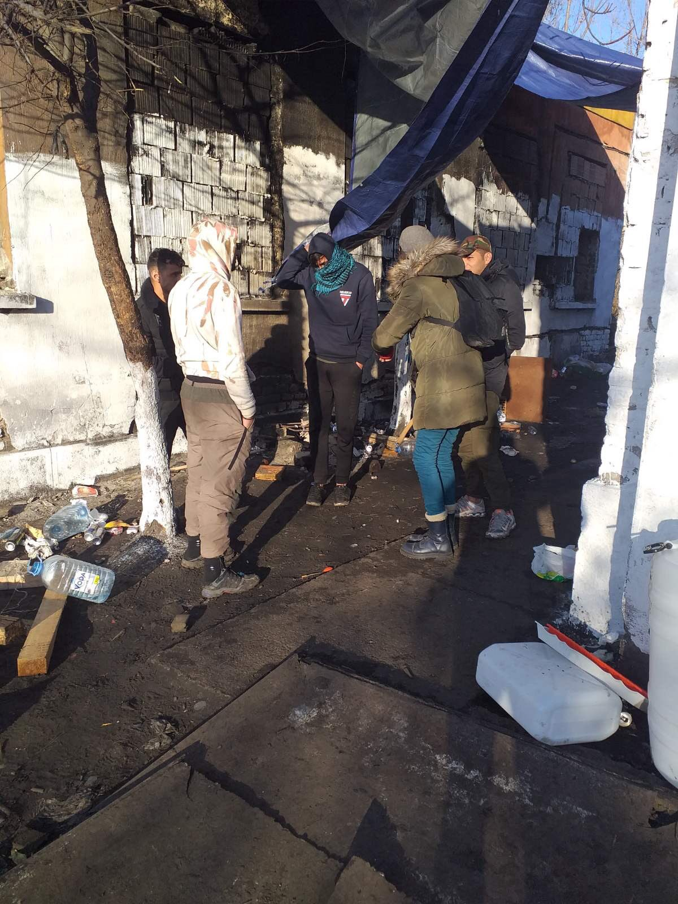

### AYS News Digest 23/2/22: After the Taliban\-takover more Afghans arrive in Europe
### Number of doubled since 2020 // EU says it’s prepared to host Ukrainian refugees // Volunteers in Serbia denied access to camp, Thousands sleep in the open // One more dead at Belarus’ border // UK Home Office taken to court

Credits: [Twitter/@APC\_CZA](https://twitter.com/APC_CZA)
### EU

**An increase in asylum applications in Europe in 2021 was driven mainly by Afghan applications**

In 2021, asylum applications rose to pre\-pandemic levels, partly due to the crisis in Afghanistan\. This increase from 2020 was driven predominantly by Afghan and Syrian applications\.

Afghans claimed around 97,800 applications, double that of 2020, and following the takeover by the Taliban, Afghans became the largest group of applications in Europe\. Nevertheless, in 2021, Syrians were the main applications, of around 106,000 applications\. These figures are still significantly lower than in 2015/16\.

In terms of positive decisions, in 2021, roughly 35% of first instance decisions were granted a form of protection\. This was the highest average rate of recognition since 2017\.
### [Unaccompanied minors, Afghans drive rise in asylum applications](https://www.infomigrants.net/en/post/38707/unaccompanied-minors-afghans-drive-rise-in-asylum-applications?fbclid=IwAR0DHjcNTLTcktfz1IoaQf1sDGOeoZyA4ggwz4FKjUdzsVSdcbhiEOejO-c)
### [Asylum applications in Europe rose in 2021 to pre\-pandemic levels, partly due to the crisis in Afghanistan\. Claims from…](https://www.infomigrants.net/en/post/38707/unaccompanied-minors-afghans-drive-rise-in-asylum-applications?fbclid=IwAR0DHjcNTLTcktfz1IoaQf1sDGOeoZyA4ggwz4FKjUdzsVSdcbhiEOejO-c)

[www\.infomigrants\.net](https://www.infomigrants.net/en/post/38707/unaccompanied-minors-afghans-drive-rise-in-asylum-applications?fbclid=IwAR0DHjcNTLTcktfz1IoaQf1sDGOeoZyA4ggwz4FKjUdzsVSdcbhiEOejO-c)

An article by the [**Ultrecht Law Review**](https://www.utrechtlawreview.org/articles/10.36633/ulr.770/?fbclid=IwAR3wHexdVxeJjxWGwdZJBt4rffaNLu7eMwV3Y2Bqp6PCRBaK42yWf6Fc8Vo) explores the way in which EU migration policy has been driven by security and crisis, outweighing the fundamental human rights of migrants\. Within this context, Frontex has grown immensely and has benefited from greater funding\. The article dives into the concerns around the lack of transparency in multi\-agency structures that is perpetuated through the crisis and emergency narrative, and how this affects fundamental rights and accountability\.
### European Commissioner states the EU is “well prepared” to take in Ukrainian refugees

Ylva Johansson has [stated](https://www.euronews.com/2022/02/22/eu-ready-and-well-prepared-to-host-ukrainian-refugees-says-commissioner-ylva-johansson?fbclid=IwAR2kDa14B35of5xezE8rnDhQCF7TApmaiTtotFCCRODep448wI5525I3iC8) that neighbouring countries, such as Poland, will be united in the reception of Ukrainian refugees\.

“We can expect a lot of EU unity and EU solidarity towards Ukrainians if the situation deteriorates significantly”

Early Thursday morning Russia started to attack Ukraine\.

Frontex Director made statement about the statements on refoulement, here is a good reaction:

Several organizations called the EU to end its “security approach to migration policies” with African countries\. They criticize, that the EU is prioritising its interest “by implementing restrictive and repressive measures and policies aimed at curbing migration on its soil by investing colossal human, material and financial resources that could be used in more relevant sectors”, [Statewatch](https://www.statewatch.org/news/2022/february/eu-africa-build-bridges-between-people-not-walls-civil-society-statement/?fbclid=IwAR3TRmgWeOfZdpWLXgvdLfUT3hMWdKetI8isw06wpgZiGAelhtlCUPKGN3U) reports\. What is needed are bridges\. By enhancing the potential of migrats, respecting international law and the obligation of non\-refoulment as well as facilitating visa this could be reached, the organizsations suggest\.
### Turkey

The Turkish Interior Minister presented plans to limit the number of foreigners living in neighbourhoods across the country\. ““If the number of foreigners in a neighborhood exceeds 25%, we will send them to other neighborhoods,” Suleyman Soylu said according to [Al\-Monitor](https://www.al-monitor.com/originals/2022/02/turkeys-quota-plan-refugees-alarms-rights-activists?fbclid=IwAR1Hf1daV4h71prWhBQ0PQQp1WN8qHlYthA1L2CoyHEO_db-n3gguphJzzg) \. Several districts in Ankara, Istanbul and Izmir had already been closed for new foreigners, relocations had already been implemented on voluntary basis\. Several organizations in Turkey criticized the plans\.
### Serbia

Volunteers of Azil u Srbiji [report](https://twitter.com/APC_CZA/status/1496056806271074307?fbclid=IwAR3uR2xP2ZMb1aJhO2GCdU-ZbEhDzqzpMTXcDl9Ax3nBMYyy8q1b8GQxL8c) , that they are often denied acees to Adasevci camp on the highway to Zagreb\. Numerous reports of abuse and violence come from this “black spot” of the Balkan Route\. Additionally, more than 2500 people in Vojvodina are forces to sleep in open camps\. From Shid, Sombor, Subotica, Kanjiža, Majdan to Kikinda, there are more than 1,000 people staying in the open\. More than half of the people from Afghanistan, the volunteers spoke to, said they left after Taliban took over the country\.
### Poland

Several sources report, that one more man died near Poland’s border with Belarus\. On the passport, he carried with him, was written he was 26 years old and from Yemen\. His relatives were informed\.
### Germany
### Mheddin Saho, a blind Syrian asylum seeker, has finally been given another opportunity to apply for asylum in Germany

The Federal Office for Migration and Refugees has confirmed that Mheddin Saho’s Dublin period has ended, according to [InfoMigrants](https://www.infomigrants.net/en/post/38683/germany-syrian-asylum-seeker-given-a-rare-second-chance?fbclid=IwAR3KW0Rx8prtztDV50sBzkE9VIfAyrnMA-6vlOSMfgrI78-TeqbURue8I3I) \. He has been living under church asylum since his first deportation order was issued in 2019\. A couple who had been sponsoring Mheddin Saho began a petition calling for him to be allowed to stay in Germany and to stop his deportation\. This petition was signed by over 500 people\. Mheddin had also been studying at the Ludwig\-Maximilians\-university in Munich, where he has proposed methods of teaching and learning foreign languages to blin and vision\-impaired people that could help a significant number of people\.

**Attacks on refugees and asylum seekers have decreased in Germany, but still remain very high**

[Infomigrants has reported](https://www.infomigrants.net/en/post/38708/germany-less-violence-against-asylum-seekers-in-2021-but-attacks-continue?fbclid=IwAR0A3bL2zIYy71VXvDfM0HlORU05oi7eDdfTSD-WpV1uNyt14FCDoJLwOsE) that in 2021, there were over 1,250 criminal offenses against asylum seekers and their places of accommodation in Germany\. Whilst this is a very high number, it is much lower than the 1,690 offenses recorded in 2020, and 1,749 in 2019\. However, the Amadeu Antonio Foundation has stated that the correct number of attacks against asylum seekers is much higher than these official statistics\. They are argue that many attacks were not recorded, and others were incorrectly defined in police reports\.

They have a joint [online database](https://www.mut-gegen-rechte-gewalt.de/chronik-karte) with Pro Asyl that provides much more accurate statistics of anti\-refugee attacks and events with the general geographical data as well\.

**Organisations, such as, Pro Asyl and the Afghanistan Sponsorship Network [have been calling](https://www.schengenvisainfo.com/news/german-government-urged-to-accelerate-processing-of-visas-for-afghans/?fbclid=IwAR2X6Z-_d2uQYBwwEoDs_pOiETGP-l98w6OmH57DmDgL6aaY9t0vI6ZtNJA) for the German Government to issue visas quickly to Afghans at airports in Germany, and to negotiate direct evacuation flights from Afghanistan\.**
### Italy
### UK

**UK\-based NGO, Women for Refugee Women, are taking the Home Office to Court**

Women for Refugee Women have been campaigning against the opening of the new Derwentside detention centre in the North East of England for about a year\. The Home Office started detaining women at Derwentside in later December 2021\. Women in this centre were only able to receive legal advice over the phone, which is problematic in many ways but Women for Refugee Women state below some of the main reasons why this is a huge issue;
- [Women for Refugee Women’s research](https://www.refugeewomen.co.uk/legal-challenge-derwentside/?fbclid=IwAR2oLa8sAHYYQEIpUoXq829mvhIKm3h8a0i-JzgCNBE6R3PUMUGE12-5oS8) \(summarised in the notes below\) has demonstrated that the **majority of women in detention are survivors of sexual or other gender\-based violence** \. Survivors of such violence **experience significant and particular difficulties disclosing what has happened to them\.** Many women we have spoken to have said they felt too ashamed to talk about their previous experiences\.
- Being denied access to in\-person legal advice will **exacerbate the difficulties women already face in disclosing these experiences** , since they will be expected to talk about what happened to them to someone they have never met, over the phone\.
- Difficulties in disclosing previous experiences can have **significant negative consequences for women in detention** \. It can result in delays in release from detention, their credibility being questioned in asylum and trafficking cases, and inaccurate or incomplete legal advice\.

### Libya

**The Concerning Circumstances surrounding the closure of Al Mabani Prison, Libya**

[The Libyan government closed down Al Mabani](https://www.newyorker.com/news/news-desk/a-migrant-prison-officially-closes-but-how-much-has-changed?fbclid=IwAR33FFT5uF0tUb6jLBcZtpfSYuhbbr2ROXfSCWa-I1A500u1REKelV_IuIc) , Libya’s most notorious prison for migrant detainees, in mid\-January\. As Jeff Crisp stated, prisons such as Al Mabani were, and still are, part of the European Union’s preventative measures to stop migrants ever reaching Europe because, as the EU may publicly call for the closures of such prisons, they continue to encourage and train the Libyan Coats Guard to intercept boats in the Mediterranean which then lead to asylum seekers being detained in these prisons\.

The conditions at Al Mabani have been described as inhumane, where detainees have been deprived of food, they have been assaulted physically, emotionally and sexually, and have been made to work in construction sites, among many other horrific forms of abuse\.

The closing of Al Mabani may seem like a step in the right direction, however, the Director and Founder of The Outlaw Ocean Project, Ian Urbina, has written about the concerns surrounding the closure\. He states that there are detainees that have mysteriously gone missing between the journey from one prison to another, with no trace of where they are now\. There is also a great deal of money in the detention business in Libya, influenced by people in power; It is highly likely that the closing of Al Mabani is due to the political battle between two men trying to run Libya’s Directorate of Combating Illegal Migration \(DCIM\), rather than pressure from NGOs and activist groups\. The former director of the DCIM, General Al\-Mabrouk Abdel\-Hafiz, was linked to the militia that ran Al Mabani, and consequently, the profits made from the detainees in Al Mabani would go to his favoured centre\. He was, however, removed from the role in December, and replaced with Mohammed al\-Khoja, who oversees the agency from Tariq al\-Sikka\. In turns out, that a large group of Al Mabani detainees have now ended up in Tariq al\-Sikka\. In addition, only a week after the closure, Henrike Trautmann, a representative of the European Commission, said that the EU would provide 5 more vessels to the Libyan Coast Guard to support with the interception of boats\. This makes it quite clear that there is no real intention on either the Libyan or the EU side to improve the rights of refugees and asylum seekers and reduce the rate of detention and imprisonment\.

You can read more on this story here:
### [Libya Closed Its Most Notorious Migrant Jail\. Is That Good News?](https://www.linkedin.com/pulse/libya-closed-its-most-notorious-migrant-jail-good-news-ian-urbina/)
### [With no explanation from the government, fanfare by aid groups, nor coverage by domestic or foreign media, Libya’s most…](https://www.linkedin.com/pulse/libya-closed-its-most-notorious-migrant-jail-good-news-ian-urbina/)

[www\.linkedin\.com](https://www.linkedin.com/pulse/libya-closed-its-most-notorious-migrant-jail-good-news-ian-urbina/)
### Al Jazeera reports on the daily beatings, deprivation of food and water, and the indefinite detention in the Ain Zara detention centre in Libya

On January 10th, Libyan militias and security forces opened fire on a group of 2000 asylum seekers who had been taking part in a months\-long sit\-in outside a UN compound in Tripoli\. Many were taken to the Ain Zara detention centre\.

There are photos of people crammed into one room, many having no choice but to sleep in the corridor\.

“More than 12,000 people are estimated to be held in 27 prisons across Libya, according to statistics provided by Libyan authorities to the UN’s Support Mission in Libya”\.

Asylum\-seekers in the detention centre of Ain Zara say they are crammed in one room, where they remain from 5pm until around midday the next day with no food or water\.

**Find daily updates and special reports on our [Medium page](https://medium.com/are-you-syrious) \.**

**If you wish to contribute, either by writing a report or a story, or by joining the info gathering team, please let us know\.**

**We strive to echo correct news from the ground through collaboration and fairness\. Every effort has been made to credit organisations and individuals with regard to the supply of information, video, and photo material \(in cases where the source wanted to be accredited\) \. Please notify us regarding corrections\.**

**If there’s anything you want to share or comment, contact us through Facebook, Twitter or write to: areyousyrious@gmail\.com**

_Converted [Medium Post](https://medium.com/are-you-syrious/ays-news-digest-23-2-22-after-the-taliban-takover-more-afghans-arrive-in-europe-8e7222c1ab1d) by [ZMediumToMarkdown](https://github.com/ZhgChgLi/ZMediumToMarkdown)._
