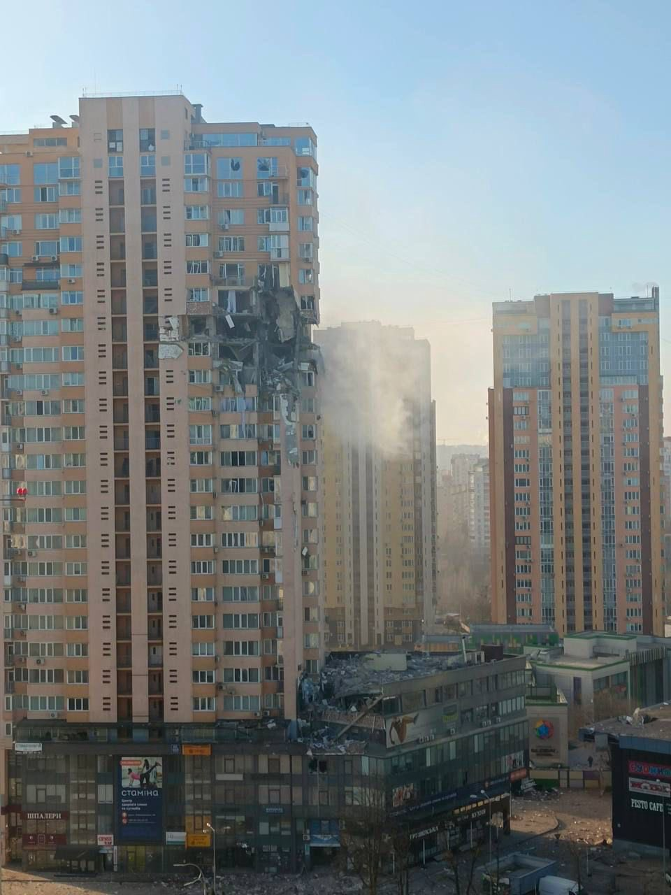
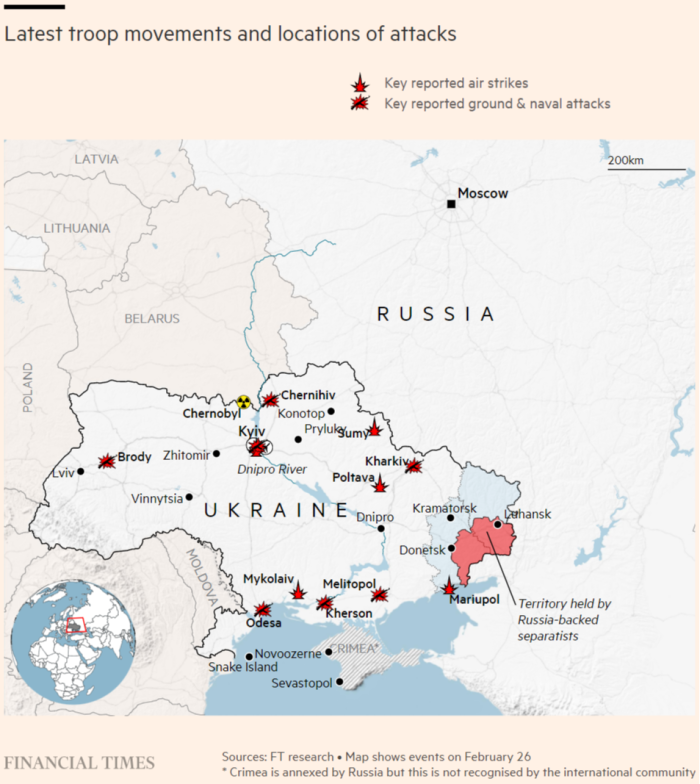
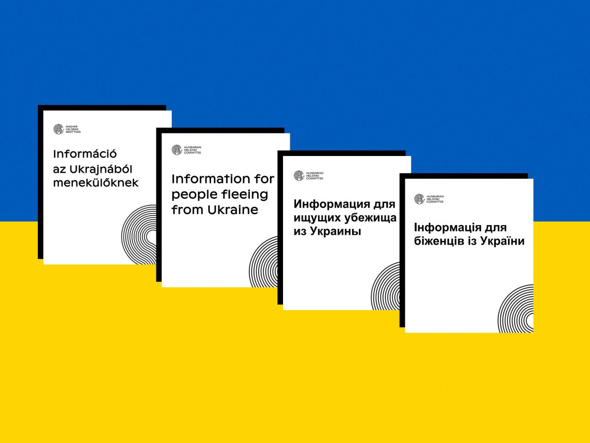

### AYS News Digest 25/2/22 **: Afghans and other people who had found refuge in Ukraine are now among those fleeing the country**
#### What is happening to those who are not Ukranian and need to flee \(again\)? / A document with travel, accommodation, legal and other important information for Ukranian refugees / International hypocrisy / Greece: RSA calls for shipwrecks protocols / UK to remove people to a ‘safe third country’ whilst their asylum claim is pending / Belarus might put more pressure on Poland as Ukrainian refugees arrive / News from the French north, some reads proposed by our team & more

#### FEATURED

In mid\-September, they were expressing their relief at being evacuated from Kabul to Kyiv\. Today, they are fleeing another war as Russia attempts to invade Ukraine\. A few hundred Afghans who had fled the Taliban takeover in Afghanistan are now stuck in this new European conflict, with no clear escape in sight\.

Back in September, Ukraine had made [international headlines](https://www.nytimes.com/2021/09/24/world/middleeast/ukraine-taliban-rescue-afghanistan.html) for succeeding to airlift 96 people out of the country by negotiating with the Taliban, “including a group of students from a Vatican\-sponsored university and a 3\-year\-old boy who was wounded in the terrorist attack on the airport”\. Once in Ukraine, their asylum requests and applications to move to other countries started to be processed\. But the resettlements were stalled, slowed down by bureaucratic red tape and political unwilllingness\. Several of them had been approved to settle in Canada, but were told [the process could take up to two years](https://www.theglobeandmail.com/world/article-afghan-refugees-stuck-in-ukraine-with-no-exit-in-sight/) \.

Over the past month, as tensions quickly escalated, Russia menacingly stationed its troops at the border and the fear of an invasion loomed, several Afghan families [managed to leave](https://www.aninews.in/news/world/europe/afghan-evacuees-in-ukraine-urgently-departing-from-country-reports20220217144332/) for Doha, Qatar\. Those who remained in Ukraine, struggling with language and cultural barriers, tried to find a way out\.

> My generation and I have been fighting ignorance with our lives 

23\-year\-old Masouma Tajik rushed to apply to universities in the United States of America and in Germany\. “My generation and I have been fighting ignorance with our lives\. Many people sacrificed their lives so that my generation can have a better future and access to a good education,” she wrote in one application letter [according to Foreign Policy](https://foreignpolicy.com/2022/02/25/afghan-refugee-russia-ukraine-war-putin/) \. She secured a visa interview on February 22 — but by then, the US embassy in Kyiv had been evacuated\. She is now waiting in Lviv, uncertain of what to do as Russian troops quickly advance into the country\.

> “I escaped Herat when the Taliban took over and came to Kabul\. I thought I was safe there\. But then they came to Kabul, and I had to leave and came to Kiev\. Then I had to leave Kiev and came to Lviv because things seemed to be getting worse\. And now I am looking for ways to leave here too,” [she said](https://www.thenationalnews.com/world/europe/2022/02/26/afghan-refugee-in-ukraine-flees-second-conflict-in-six-months/) \. 

In addition to the language barriers and lack of community, which make it so much harder to flee and understand the rapid developments, Afghans and other internationals in Ukraine are once again facing another obstacle: visas and administrative proceedings\. On Friday, nearly [100 Afghans were waiting](https://www.vice.com/en/article/epxqvp/afghan-refugees-ukraine-conflict) by the border with Poland, where hundreds of thousands of Ukrainians are escaping to\.

Without visas to the Schengen area, it might be harder for the internationals to enter the EU\. Into a country that, up until a few days ago, was still building a border wall to continue brutally pushing back asylum\-seekers from non\-European countries\. To find out more about this topic, read [this article on Vice](https://www.vice.com/en/article/epxqvp/afghan-refugees-ukraine-conflict) \.

■■■■■■■■■■■■■■ 
> **[Sahraa Karimi/ صحرا کریمی](https://twitter.com/sahraakarimi) @ Twitter Says:** 

> > My family is in Kyiv and they cannot go anywhere. I may go to Ukraine to save them.
They are waiting almost five months to get their visa to Canada.

@[CitImmCanada](https://twitter.com/CitImmCanada)  has approved their file on October 2021 but they are so slow to give them visa. 

#StandWithUkraine 

> **Tweeted at [2022-02-24 08:29:00](https://twitter.com/sahraakarimi/status/1496764083294584836).** 

■■■■■■■■■■■■■■ 

More racism and hypocrisy at the borders:

■■■■■■■■■■■■■■ 
> **[Stephanie Hegarty](https://twitter.com/stephhegarty) @ Twitter Says:** 

> > A Nigerian medical student at Poland/Ukraine border (Medyka-Shehyni) told me she has been waiting 7hrs to cross, she says border guards are stopping black people and sending them to the back of the queue, saying they have to let 'Ukrainians' through first. 

> **Tweeted at [2022-02-26 16:02:37](https://twitter.com/stephhegarty/status/1497603013799784449).** 

■■■■■■■■■■■■■■ 

**More on Ukraine with lists of practical advice, info and contacts at the end of today’s Digest, of course, including information for those who are not European, but are in the same need for help as anyone else\.**
#### GREECE
### **RSA calls for shipwrecks protocols**

“The recent shipwrecks have once again highlighted the huge shortcomings in the information, support and care of survivors, in the coordination of the management of shipwreck victims such as the protocol for the search and identification of the missing and dead respectively and the referral to an appropriate reception facility\.”

[Refugee Support Aegean is calling](https://rsaegean.org/en/deaths-at-the-borders-refugee-and-migrant-shipwrecks/?fbclid=IwAR3kf7Z89MJWxgfqgR5J7L75KReX2PeDExTH2klMNBJbE85KSCJv4i4jZgc) for official and appropriate protocols to be set up in cases of shipwrecks in Greek seas\. After the tragic shipwrecks in Paros, Folegandros and Antikythera over Christmas, the need for proper identification of the victims and psychological support for the survivors has been dire\.
### **Survivors of deadly pushback say Greek authorities are responsible**

On February 1st, 19 bodies were found huddled against a wall in Turkey, close to the Greek border, stripped of their jackets and shoes\. The men had died of cold after being pushed back by Greek police, Turkish president Erdogan claimed\. Four survivors of the pushback, now in a migrant center in Edirne, [recounted that night to the New York Times](https://www.nytimes.com/2022/02/24/world/europe/greece-turkey-migrants-deaths.html?fbclid=IwAR3CJPQoscdFpCC1gsXVs6X5T1Ou3yMt8kqqYRDs-cqFyeTqJpg82SGiiRM) \.
#### SLOVENIA

Our friends from InfoKolpa joined the public discussion in Slovenia initiated by civil society about harmful measures of the authorities, pointing out the controversial changes to the Law on Foreigners \(ZTuj\-2\) and the Law on International Protection \(ZMZ\-1\), which we have noticed in our practice of working with asylum seekers, refugees, migrants, undocumented people and other foreigners residing in Slovenia\.

#### BELGIUM
### **Sudanese refugees face “everyday violence”**

Sudanese people seeking refuge in Belgium are denied their basic needs and facing uncertainty, discrimination, police violence, exploitation and hampered mobility, [explains](https://www.law.ox.ac.uk/research-subject-groups/centre-criminology/centreborder-criminologies/blog/2022/02/sudanese-migrants?fbclid=IwAR07q16B8cZ1zwNfdsP_q9k0BNqT0gveAt21Xy0LaYsVclaXbCHr2XnKYjM) Dalal rajab, co\-founder of Brussels\-based diaspora organization Sudan Action Group\.
#### SEA/SAR
### **Sea\-Watch 4 has a safe port, and more rescues at sea**

After days at sea, sheltering from very bad weather, 129 people on board the Sea\-Watch 4 will be [allowed to disembark](https://www.facebook.com/plugins/post.php?href=https%3A%2F%2Fwww.facebook.com%2FNewsfromtheMed%2Fposts%2F1405943349859257&show_text=true&width=500&__cft__[0]=AZUp1aw02l8ZU5COS3VXMOkxYtiDqEGOt6JH27i5GzromhfLAhkQ0Qd2SNFtIVB0QRDv7s29A7lNOMxj-MmR1mMQmTsseJyRzpi8oBRxrCqw9cnBAHn2qZlkWnKq2zeUj2QD2HmTQBX4neF2uomr1M9Rr_bhrrfKO5cZOYLzhmnxel4rN8R6CBeLM_9gmNb_8AA&__tn__=R]-R) in Trapani\.

In the Canaries, Salvamento Maritimo has [rescued](https://www.canarias7.es/canarias/desembarcan-gran-canaria-20220225091028-nt.html?fbclid=IwAR2pA9i8iL8hog0X5bnhiRz-GtePUuv34JLOvBT24MFCDQjX0Q7WG66Z3c4&ref=https%3A%2F%2Fl.facebook.com%2F) 177 people, including 7 children, in four boats south of Gran Canaria\. The day before, on 24 February, [7 people were rescued](https://www.facebook.com/plugins/post.php?href=https%3A%2F%2Fwww.facebook.com%2FNewsfromtheMed%2Fposts%2F1405315033255422&show_text=true&width=500&__cft__[0]=AZUwLFjKkOUDW8KncxnsO9EMQqYQhL6iBX5483EoboivTZ52FiMfSMXVw4_sY-SnUmmzRUK0IbHMZjHeT6RNYDMsQhiZA97TdZM7atHl5ekn2WzHA1nLbvl8b6TUkPNb2vR2Cgkz3h23_8GAlrh8-P5psNcEbd9dXLFvGRy5wBpS4DdtVLBOoac0KuCobkKDX8I&__tn__=R]-R) in the Strait of Gibraltar\.
#### FRANCE
### **Senseless violence against displaced people**

180 people were [expelled](https://twitter.com/Utopia_56/status/1496790558672515073?fbclid=IwAR3wbB0SzqOwarGYkRFMFD_dvF8MMdmo1RlBQQyd5_eTVMODkt1FtLWBtaY) from their camp in Dunkirk in continued police harassment\. A water tank set up by an NGO was also seized, and tents and belongings were confiscated and destroyed\. In Paris, 120 people including several families with children narrowly escaped a potential disaster when two trash cans were set alight on both sides of the tunnel in which they were sleeping\. At least two tents were burnt\. Utopia56 [highlights](https://twitter.com/Utopia_56/status/1496840969102053377?fbclid=IwAR2NhkGo5NElgBvg7QuLCPwAGPcGIFAff8Iyx2DUwZgKNNX98JJBVG1Dq_A) that these people and children should never have been sleeping in a tunnel in the first place, and should have been provided with shelter by the French authorities\.
### **Seeking asylum from abroad, the fake “solution” of far\-right candidates**

Far\-right and right\-wing presidential hopefuls Marine Le Pen, Eric Zemmour and Valerie Pecresse all mention their plan to reform asylum procedures by having them filed and processed in french embassies and consulates abroad or at the border\. The proposal, while not new, is [contrary to international law](https://www.infomigrants.net/en/post/38774/french-presidential-election-2022-the-issue-of-seeking-asylum-from-abroad?fbclid=IwAR0vrYJ6butt9nqOErE7g8b3hIcDDzo4yKVVOuLirBjxLuX8fI8dCT0uhog) and the 1951 Geneva Convention\.
#### BELARUS / EASTERN BORDER
### Belarus might put more pressure on Poland as Ukrainian refugees arrive

Activists [believe](https://euobserver.com/migration/154425?fbclid=IwAR0rUJE9PvmAj77g6JhmGg8pN0gWDBWaiRQpOR66uQKGRT25F4egbvgVPVc) Belarus might be pushing more people to cross the border to Poland, in an attempt to pressure the country as it welcomes thousands of Ukrainians fleeing the Russian invasion\. Organizations have observed an increase in border crossing attempts\. The Belarus dictator Lukashenko is allied with Russia\.

And while the world’s attention is turned to Ukraine, hundreds of people are still in detention near the Polish border\. About a hundred of them have [started a hunger strike](https://openmigration.org/analisi/cosa-ne-resta-dei-migranti-bloccati-sul-confine-bielorusso/?fbclid=IwAR3kbaFBC37kXH3IFbuot8HtrXZ6k4g4nJ7QJ5500UHpYRk_V3pyq_NgRAs) , locked up in a former military base in Wędrzyn, Poland\.
#### UK
### UK to remove people to a ‘safe third country’ whilst their asylum claim is pending

The UK government has just released this publication on the [Nationality and Borders bill](https://www.gov.uk/government/publications/nationality-and-borders-bill-overseas-asylum-processing/nationality-and-borders-bill-overseas-asylum-processing?fbclid=IwAR3T7Y7NxaXKcl6GzzeldWckOY2jBgFwdwr5Q86U74vnbq0ftzvz3wafv18) and how it more easily enables the UK to move someone to a third country while processing their asylum case\.

The UK must not act in such a way which means a person’s life is at risk, or that they may suffer from torture or inhuman and degrading treatment, and the government claims to be aware of this and that they will respect the Refugee Convention\.

In the meantime, the UK **continues to employ practices of sending LGBTQ\+ asylum seekers back to their home countries with the advice of not presenting as LGBTQ\+**

[](https://l.facebook.com/l.php?u=https%3A%2F%2Fwww.pinknews.co.uk%2F2022%2F02%2F25%2Flgbt-asylum-seekers-refugees-nationality-borders-bill%2F%3Ffbclid%3DIwAR13xXh5J-BLsO3I6gMpfUbVvq_I-8JBkpDx-ANRNm8jyz5AtWpeEJQ_HfU&h=AT2QoREFNzX-JkW_UzXJnq1zWkf7zHuqHZ5bWneh2umP7X5u_OgyDHxC9qSBIii_wPaHDn2k4ntHrc7VsxrbE0c0AX6VsZ7g_nRApimwjpIfOp48buSSeu1HOnbD7X537YNKiJF20-7GIBUbMUN6ooPmF8v4Aw&__tn__=R]-R&c[0]=AT0yXYZk2Sp0qmghK8EvkCdA1rZOn8rgOCzl4far3Ly6DjKJxvf6vV0PK5ExkN2lghGkckuDf5E_RYg9uFpaUCuEMW_IkFkD7mDu4Bx9CQ3dmVipK2r3nq0CcfkwSlC2E90JOpYZwYPq9Km4tE2ekEue-kcCobRpiR0mlxy7xEuF8DGCPmWS8l6iNmuGRTeeWYqbL0viucKR)

People who cross the English Channel in small boats now account for more than three\-quarters of the total number of people on the move entering the UK\. Home Office figures have shown that 28,526 [people were detected arriving on small boats](https://www.thenationalnews.com/world/europe/2022/02/10/french-coastguard-rescues-36-migrants-in-the-english-channel/) in 2021, compared with 8,466 in 2020, 1,843 in 2019, and 299 in 2018\. Activists warn that it is the deterring and policy of harassment carried out daily against people in exile that aims to hinder smugglers and ends up supporting the criminal smuggling networks to a great extent\.

■■■■■■■■■■■■■■ 
> **[Utopia 56](https://twitter.com/Utopia_56) @ Twitter Says:** 

> > 28 526 traversées de la manche en 2021 contre 299 en 2018. @[GDarmanin](https://twitter.com/GDarmanin) et @[OFII_France](https://twitter.com/OFII_France) veulent faire croire que leur politique de harcèlement menée quotidiennement contre les personnes en exil a pour objectif d'entraver les passeurs. Résultat : ils n’y ont jamais autant contribué. https://t.co/tGAu7p6qkw 

> **Tweeted at [2022-02-25 08:57:34](https://twitter.com/utopia_56/status/1497133659853316101).** 

■■■■■■■■■■■■■■ 

### UKRAINE

visual by Hungarian Helsinki Committee

Our network, Border violence monitoring network, has published a common list of information relevant to everyone fleeing Ukraine and in need of transport, logistics, legal and other help in getting protection in different EU countries\. Here is constantly updated list of information:

■■■■■■■■■■■■■■ 
> **[Border Violence Monitoring Network](https://twitter.com/Border_Violence) @ Twitter Says:** 

> > **RESOURCES FOR UKRAINIAN REFUGEES** (last updated 25 Feb). Here is basic information about organizations you can contact if you are in a need of assistance while trying to reach safety. Please share! #Ukraine ⬇️
[docs.google.com/document/d/14T…](https://docs.google.com/document/d/14TY4rE1tz4cJBkrgWiZe2sZBBamuCJF2-luoz4MaBak/edit) 

> **Tweeted at [2022-02-25 23:01:06](https://twitter.com/border_violence/status/1497345941552209924).** 

■■■■■■■■■■■■■■ 

A special not from Germany, for people fleeing Ukraine, not to apply for asylum straight away:

■■■■■■■■■■■■■■ 
> **[fluechtlingsnetzwerk](https://twitter.com/berlin_hilft) @ Twitter Says:** 

> > Und bitte im Moment KEINE ASYLANTRAG stellen! Es wird vermutlich ein anderes Aufenthaltsrecht in D geben. UkrainerInnen können idR visumfrei nach D einreisen &amp; verlieren ihren Status mit Asylantrag #Ukraine  #UkraineWar #berlinhilftukraine #RussiaUkraineWar #StandWithUkriane 

> **Tweeted at [2022-02-26 11:05:56](https://twitter.com/berlin_hilft/status/1497528352932044801).** 

■■■■■■■■■■■■■■ 

For those originally from North Africa, now fleeing Ukraine:

■■■■■■■■■■■■■■ 
> **[Ouissal Harize| وصال حريز | ⵡⵉⵙⴰⵍ](https://twitter.com/OuissalHarize) @ Twitter Says:** 

> > Algerian students in #ukraine can go to Romania, they should take their Algerian passports and student cards with them. If you know any students, please let them know about this. Students from other African countries should also check with the Romanian embassy. https://t.co/2RY4UZcuU5 

> **Tweeted at [2022-02-25 21:17:13](https://twitter.com/ouissalharize/status/1497319800405741568).** 

■■■■■■■■■■■■■■ 

Information for Africans can be found in posts under this thread:

■■■■■■■■■■■■■■ 
> **[Koko 🇺🇦](https://twitter.com/korrinesky) @ Twitter Says:** 

> > How can I help African/Caribbean students evacuating Ukraine? - A thread 

> **Tweeted at [2022-02-26 15:08:40](https://twitter.com/korrinesky/status/1497589436904660992).** 

■■■■■■■■■■■■■■ 

Also for Africans:

■■■■■■■■■■■■■■ 
> **[Koko 🇺🇦](https://twitter.com/korrinesky) @ Twitter Says:** 

> > Please can you ensure if you are African / Caribbean you fill out this form 

[forms.monday.com/forms/863334be…](https://forms.monday.com/forms/863334bedf120f10dc8ed757e3a5ba42?r=use1)

There is an option for an emergency contact, so should you lose contact with your relatives we have some kind of record and contact details for you. 

> **Tweeted at [2022-02-26 16:21:32](https://twitter.com/korrinesky/status/1497607774447886336).** 

■■■■■■■■■■■■■■ 

#### Secure communication

Julian Assange reportedly stated that that everyone in Ukraine “should install BriarApp NOW before the internet goes down\. [BriarApp](https://briarproject.org) is designed to let people safely communicate with each other in exactly this situation” — [https://briarproject\.org](https://l.facebook.com/l.php?u=https%3A%2F%2Fbriarproject.org%2F%3Ffbclid%3DIwAR3YeZNADi4k-ZXHvGt5Uvh35o0LWmZMgkLPNHiINoscNKmDZM5N1sZoOGc&h=AT3G0OhhP4iFA7NpyO27KS24vvVdM6HEgIk3khU9HoARSHuC4HIUYnJfRj6HmYoBE4y__TXsGFBBRBCYII0cF7imWj7DatrBGyIAuYELcN_0ftxUe-9hE0JR5LBUZEObrqksURKh-VRG8KVhLw&__tn__=-UK-R&c[0]=AT3FDWlcYUOz10X6KKedRmhrZg4zweJ5TPu0wHVeKdb78xAJadvZMPbSnqi77_pWo_krO3Pephp9IRhzbWph30cI1X69X_is4BKvmzxh85GMU9FeZvT8D-pETuoE62bkDFgAw-T5cEid9KkWeuVg7UIw95yGqoEckv0BS1UhphSmnNA)

■■■■■■■■■■■■■■ 
> **[Committee to Protect Journalists](https://twitter.com/pressfreedom) @ Twitter Says:** 

> > Are you a journalist covering the Russian invasion of #Ukraine? CPJ has safety information you may need to stay safe:

Risk assessment information: [cpj.org/2018/09/basic-…](https://cpj.org/2018/09/basic-preparedness-risk-assessment/)

PPE guide: [cpj.org/wp-content/upl…](https://cpj.org/wp-content/uploads/2020/11/ppe-glossary_cpj-final.pdf)

War reporting safety note: [cpj.org/2019/10/physic…](https://cpj.org/2019/10/physical-safety-war-reporting/) 

> **Tweeted at [2022-02-24 12:44:46](https://twitter.com/pressfreedom/status/1496828448601427974).** 

■■■■■■■■■■■■■■ 

In the **US** , there are growing [calls from lawmakers in the US to grant temporary protected status to Ukrainians](https://l.facebook.com/l.php?u=https%3A%2F%2Fwww.wsj.com%2Flivecoverage%2Frussia-ukraine-latest-news%2Fcard%2F8KvBlH68VCozZ7RhwccT%3Ffbclid%3DIwAR3PTAUYLxn2l4_BE17OK6H6QbbkTx3oF7eI35-x2Zdib2CK5KGdPI7uQfA&h=AT3lrnSqZeDmN6-4EqkStMZhgjoXmt9ylRRfWU4BEyGrE_G22Qwp-1QLXHuIvUNk3Ml_nFMCN-_10QHO93PMxaTOqEYb4nPc_i4T_mJ_aTiDYsCueTY7LVZRv-sh-cUao_IIQSRr3ipKDPfcWmSNCSuUlSD7aw&__tn__=R]-R&c[0]=AT3wsiWDwNbwqAX3MQamuUeBS-wOZ7AGd77mJrzdntHGUqXdSkCE9se3omAjMl43YklS7EZHEknzBQj5XlpMK6O0707zoTTX4rWe9bDnFYBoyiLWYeLIy0ZWFzhJxsoKQDbxDZqwP_ZCMKikNakH1BovCPsm_044GyesuL7k2bcd7tQCKyuz5DgwnfIFPhcEDCuBnoC1qAKyrSHSDbU) in the US to prevent potential deportation\.

Unfortunately, the international community and most of the EU countries have displayed hypocrisy in their answer both to what is going on in Ukraine, but also in terms of accepting people fleeing the country\. These people are spoken abut as ‘true refugees’, as opposed to other people coming to Europe after having fled war and persecution, whilst the only difference is their colour and possibly different background, but the humanity and the need is the same\.

For example, in [**Denmark**](https://l.facebook.com/l.php?u=https%3A%2F%2Fcphpost.dk%2F%3Fp%3D131616%26fbclid%3DIwAR3qR19rfT_J1Nbu1yjRxD4Ehhx2Ep7IUDdTDyiY3FxNJzJDLUeUEGMNXI8&h=AT3q_CgQqX_8oOEX3FJE0vfTVGwJq88iUPeZUo014_t2NQ1ooI7Y2emiIlYzl2ygw1JjMthpyHwx8dSCXY9caSNt7MpjjZcSGbNQc2dwR-aF44bk6m_OtyLwsqBDmRpF5FYDVksVJxAyQI-rA_nLCsknk8AZoA&__tn__=R]-R&c[0]=AT3wsiWDwNbwqAX3MQamuUeBS-wOZ7AGd77mJrzdntHGUqXdSkCE9se3omAjMl43YklS7EZHEknzBQj5XlpMK6O0707zoTTX4rWe9bDnFYBoyiLWYeLIy0ZWFzhJxsoKQDbxDZqwP_ZCMKikNakH1BovCPsm_044GyesuL7k2bcd7tQCKyuz5DgwnfIFPhcEDCuBnoC1qAKyrSHSDbU) , at a press conference PM Mette Frederiksen stated that Denmark would provide humanitarian aid to Ukraine and assist refugees in nearby regions, including here at home\. “We will also need to be ready to accept Ukrainian refugees here,” said Frederiksen\. A majority of Parliament supports the government’s stance on this issue\.” This is the same country that said Syria is safe for people’s returns\.

The Bulgarian Prime Minister had very openly racist statements on this, as [reported](https://l.facebook.com/l.php?u=https%3A%2F%2Ftwitter.com%2FTihomirSabchev%2Fstatus%2F1497264454236610563%3Ffbclid%3DIwAR1MpWHBIJDBsfywE3_7zIrW2JUEr_XmG2ldzx7Hs6EgPRwU6s7yJx2tT2k&h=AT3ig628o_0GRataqCIoraJJxt1UCzIRS3-39YMe-SMQJiiwIaYNmIgRGO5BQ7L_h_fFXq693MKCdG9maw8ppk10HoLGIjHeQhNZSi12OPSAF8InPH2kpU_Q6vtm9gMi2Qf3w3Ikr2vYAwYjnrLaDCQZMUkveA&__tn__=R]-R&c[0]=AT3wsiWDwNbwqAX3MQamuUeBS-wOZ7AGd77mJrzdntHGUqXdSkCE9se3omAjMl43YklS7EZHEknzBQj5XlpMK6O0707zoTTX4rWe9bDnFYBoyiLWYeLIy0ZWFzhJxsoKQDbxDZqwP_ZCMKikNakH1BovCPsm_044GyesuL7k2bcd7tQCKyuz5DgwnfIFPhcEDCuBnoC1qAKyrSHSDbU) , while the Slovenian government “won” with their racist tweet:

“the Ukranian refugees arrive from a surrounding which is in a cultural, religious and historical sense something completely different from those of the Afghan refugees”\.
#### WORTH READING
- Roundup: What Ukraine’s humanitarian crisis looked like before the Russian invasion

- individual stories of people around Calais:

- Faced with the Russian invasion of Ukraine, locals in doubt and panic tell InfoMigrants they are desperately looking for ways to leave the country\. But the flight to the borders is strewn with pitfalls:

[](https://l.facebook.com/l.php?u=https%3A%2F%2Fwww.infomigrants.net%2Ffr%2Fpost%2F38809%2Ffuir-lukraine-de-toute-urgence--ces-hommes-et-ces-femmes-qui-laissent-leur-vie-derriere-eux%3Fswdfghjgfdsq%26fbclid%3DIwAR3dUzuMQeTaHT9A_n-RKqS2WZrzF46A08mwesdeNzxkywGOB-FFQcgztgA&h=AT0iai2ApMJkcliJhhYvWYa_T8p4g7H7w0YBvm3XSKXU5AczVgc8B8r1hyMToCB2nnn0P-3ZYU2rzNk5jlSS-jFvF0sMzCtRrjd2AGCVtEtYbpRaHk3fs5jACpv3kjlWzgOx-tJcQnbSrkNhJYqBTufrlxy92w&__tn__=R]-R&c[0]=AT3wsiWDwNbwqAX3MQamuUeBS-wOZ7AGd77mJrzdntHGUqXdSkCE9se3omAjMl43YklS7EZHEknzBQj5XlpMK6O0707zoTTX4rWe9bDnFYBoyiLWYeLIy0ZWFzhJxsoKQDbxDZqwP_ZCMKikNakH1BovCPsm_044GyesuL7k2bcd7tQCKyuz5DgwnfIFPhcEDCuBnoC1qAKyrSHSDbU)

- Following condemnation of Russia’s invasion of Ukraine, even from the most unlikely quarters, the immediate response of the countries in the region has been to prepare for the flood of war refugees already arriving\.

[](https://l.facebook.com/l.php?u=https%3A%2F%2Fbalkaninsight.com%2F2022%2F02%2F25%2Fdemocracy-digest-zeman-and-orban-join-chorus-of-criticism-of-russian-invasion%2F%3Ffbclid%3DIwAR1SYmIoSkkER83AkcQVhee7aSHfpJAEX2WXEFHUJqPVNXs4R1XRXIdJw34&h=AT1bSwx-ux8sY70vT0Zt5YlaKFo9qLENeDPJDTWnjWA9vvBiiycMTLQxJifuLVoljlG1SvY4KLodKWMYFv8vmJQnk4jZbTWQ4DlVCHRAziEiP3m2_To2QgbguULdzKHiK02gwFMtlKkhU1fZPIcZejRqTn4GBw&__tn__=R]-R&c[0]=AT3wsiWDwNbwqAX3MQamuUeBS-wOZ7AGd77mJrzdntHGUqXdSkCE9se3omAjMl43YklS7EZHEknzBQj5XlpMK6O0707zoTTX4rWe9bDnFYBoyiLWYeLIy0ZWFzhJxsoKQDbxDZqwP_ZCMKikNakH1BovCPsm_044GyesuL7k2bcd7tQCKyuz5DgwnfIFPhcEDCuBnoC1qAKyrSHSDbU)

**Find daily updates and special reports on our [Medium page](https://medium.com/are-you-syrious) \.**

**If you wish to contribute, either by writing a report or a story, or by joining the info gathering team, please let us know\.**

**We strive to echo correct news from the ground through collaboration and fairness\. Every effort has been made to credit organisations and individuals with regard to the supply of information, video, and photo material \(in cases where the source wanted to be accredited\) \. Please notify us regarding corrections\.**

**If there’s anything you want to share or comment, contact us through Facebook, Twitter or write to: areyousyrious@gmail\.com**

_Converted [Medium Post](https://medium.com/are-you-syrious/ays-news-digest-25-2-22-afghans-and-other-people-who-had-found-refuge-in-ukraine-are-now-among-bcd1ab7b5a06) by [ZMediumToMarkdown](https://github.com/ZhgChgLi/ZMediumToMarkdown)._
