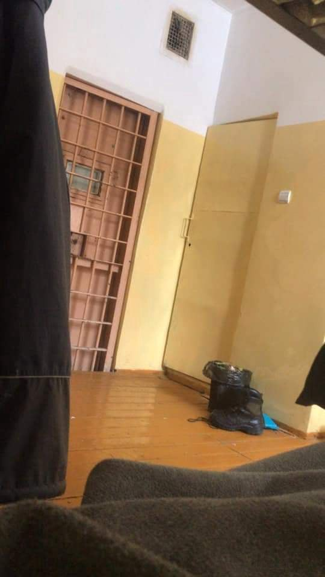

### AYS Special from Lithuania: “They treat you like criminals”

_In recent months multiple reports have come out of Lithuania about [deplorable living conditions, prisonlike environments, lack of access to medical support, legal support and poor food quality](https://www.infomigrants.net/en/post/38251/you-do-your-asylum-interview-wearing-handcuffs-sekou-in-lithuania) \. [Racist abuse and violence have been common throughout](https://www.infomigrants.net/en/post/38475/the-soldiers-wake-us-up-at-6am-they-come-with-dogs-eric-inside-a-migrant-camp-in-lithuania) , especially in relation to any voices of dissent against the conditions in which people are forced to live\._

\(Photo Credit: [Amy L Beam](https://www.facebook.com/photo?fbid=10225720771743473&set=pcb.10225720782703747) \)

The majority of people currently seeking asylum in Lithuania are from Iraq, comprised of around [3,000 people out of a total population of 4,500](https://www.infomigrants.net/en/post/38403/lithuania-pays-272-migrants-to-return-home) according to government statistics at the end of 2021\. [Iraq continues to be a dangerous country for many](https://www.hrw.org/world-report/2022/country-chapters/iraq) , with Turkish attacks on Kurdish areas and torture, enforced disappearances and judicial killings without due process by the Iraqi Government and armed groups which operate in the country\.

This week, an Iraqi man currently imprisoned with his family reached out to ask for his voice to be heard\. He had been living in Germany until 2015, but was forced to return to Iraq when his mother and father died\. He has now been detained with his young family for 7 months\.

> _Can you help us and transfer our suffering to the world? We are families from Iraq, and have been in Lithuania prisons for the past 7 months, they torment us every day and they insult us every day_ 

> _I have a family of 4 children, aged 10 years, 7 years and 6 years\. My youngest son is one month old\. My wife and I were arrested on the Lithuania border \[…\] \. My children complained of a very difficult psychological condition and my young son is very ill\. We are tormented by the Lithuanian government the most\. They deal very harshly and do not have human rights in Lithuania\. Help us if you can\._ 

Having travelled through Belarus to reach Lithuania, they did not expect the situation which awaited them\. The rooms of the place where they are held all have bars on the windows and doors\. Their youngest child, a baby, is suffering from an undiagnosed skin condition\. The father has a wound on the back of his head\. Repeated reports state that the asylum system in Lithuania is not functioning and that [people have been forced to sign deportation papers without knowing what they are](https://www.facebook.com/photo/?fbid=10225720771823475&set=pcb.10225720782703747) \.

The Lithuanian parliament passed a bill allowing for the detention of people on the move entering the country for six months in July 2021\. In December 2021, they extended this detention time to 12 months\. The law also stipulates that migrants can be deported even if their appeal is still being considered\.

Many people, including this family, are scared to speak out about the conditions they are living under for fear of punishment\. Indeed, [a young man who spoke with InfoMigrants at the start of February](https://www.infomigrants.net/en/post/38475/the-soldiers-wake-us-up-at-6am-they-come-with-dogs-eric-inside-a-migrant-camp-in-lithuania) and took part in a demonstration against the situation in Pabradé camp was beaten until he could no longer walk, handcuffed and taken away, and since then, he has been uncontactable\.

The father of this family stated that he would be put back into solitary for talking to the press and removed from his wife and children\.

> _We are treated here as brutally as prisoners of war who insult us and kill us with a stick\._ 

**_Article by Niklas Golitschek and the AYS Info Team_**

**Find daily updates and special reports on our [Medium page](https://medium.com/are-you-syrious) \.**

**If you wish to contribute, either by writing a report or a story, or by joining the info gathering team, please let us know\.**

**We strive to echo correct news from the ground through collaboration and fairness\. Every effort has been made to credit organisations and individuals with regard to the supply of information, video, and photo material \(in cases where the source wanted to be accredited\) \. Please notify us regarding corrections\.**

**If there’s anything you want to share or comment, contact us through Facebook, Twitter or write to: areyousyrious@gmail\.com**

_Converted [Medium Post](https://medium.com/are-you-syrious/ays-special-from-lithuania-they-treat-you-like-criminals-5f67a4e80b5f) by [ZMediumToMarkdown](https://github.com/ZhgChgLi/ZMediumToMarkdown)._
