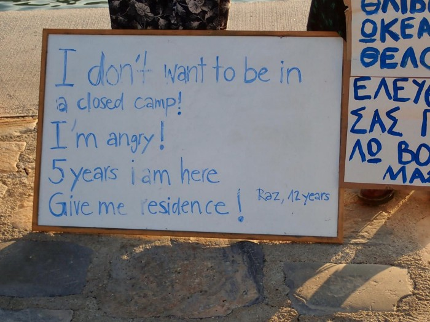
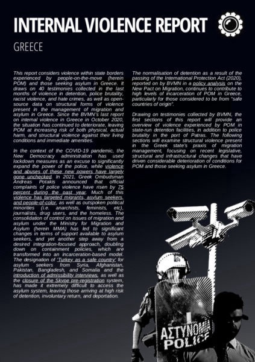
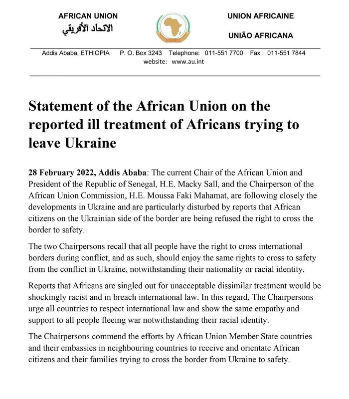
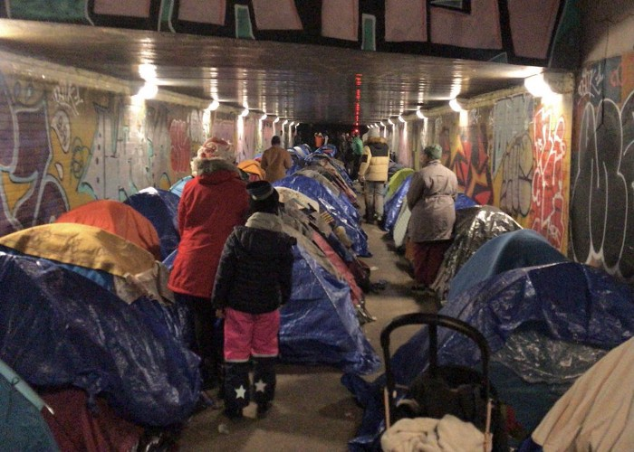

### AYS News Digest 28/2/22: Structural forms of violence in the management of migration and asylum in Greece
#### Information on Ukraine for those fleeing and people helping them // Updates from the Mediterranean // Police pressure continues in France // UK: asylum seekers in hotels waiting for months for £8 // Open your eyes to the deportations and other repressive actions taking place silently while all eyes are pointed at Ukraine // Afghanistan: a new travel ban // recommended articles and news summaries…

Image Source: Samos Advocacy Collective
### FEATURE

Today we want to highlight the ongoing injustice and violence \(still\) taking place across the routes people take to reach safety for the chance of protection\. This time we focus on Greece, through a report that was composed and published by the colleagues from the Border Violence Monitoring Network \(BVMN\) \.

It considers violence within state borders experienced by people\-on the\-move and those seeking asylum in Greece\.

40testimonies that were collected in recent months clearly and undoubtedly speak of violence in detention, police brutality, racist violence, and hate crimes, as well as open source data on structural forms of violence present in the management of migration and asylum in Greece\.

The situation continues to deteriorate, leaving people at increasing risk of both physical harm, and structural violence against their living conditions and immediate amenities\.

> _This report is part of a relatively new branch of our network that documents violence within a state’s borders on a recurring basis\. Here, we look more broadly at violence against people\-on\-the\-move in Greece and contextualise it in the political context\. In the report you will find:_ 

> _\- a case\-study of Paranesti Pre\-Removal Detention Centre_ 

> _\- violence in the Port of Patras_ 

> _\- evictions_ 

> _Read the full report below for extended analysis and testimonies by people\-on\-the\-move, as informed by our long\-term monitoring through qualitative and quantitative observations of the situation on the ground by BVMN’s partner organisations\._ 

> _This report was produced within the Border Violence Monitoring Network’s \(BVMN\) Internal Violence Working group\. BVMN is a network of watchdog organisations active in Greece and the Western Balkans including No Name Kitchen, Rigardu, Are You Syrious, MobileInfoTeam, Push\-back Alarm Austria, Josoor, InfoKolpa, Centre for Peace Studies, BlindSpots, Mare Liberum, Collective Aid, and Fresh Response\. As such, this document was produced through joint collaboration of these groups\._ 

Download the report [here](https://www.borderviolence.eu/wp-content/uploads/Internal-Violence-Greece-2022.pdf) \.
### UKRAINE
### Be mindful of people’s \(trust and\) vulnerability

Note to helpers: many private initiatives and different organisations have formed in order to help people fleeing Ukraine\. However, drawing from experience and advice from organisations focused on women and children, we would like to invite everyone to [be particularly careful](https://missingchildreneurope.eu/war-on-ukraine-protect-children-before-they-go-missing/) both when giving their support, but especially when passing information, contacts or documents of people to other parties, be it organisations or people willing to host/transport/help\. The safety of everyone should be at the heart of everything being done, so please be mindful of this\.
### [Children’s lives and wellbeing at risk in Ukraine — Ukraine](https://reliefweb.int/report/ukraine/childrens-lives-and-wellbeing-risk-ukraine)
### [We are deeply concerned by the escalation of hostilities in Ukraine which is putting the lives and wellbeing of…](https://reliefweb.int/report/ukraine/childrens-lives-and-wellbeing-risk-ukraine)

[reliefweb\.int](https://reliefweb.int/report/ukraine/childrens-lives-and-wellbeing-risk-ukraine)
### Racist borders prevail even in war

While the war rages in Ukraine, thousands are trying to flee the country and go to neighbouring EU states from where they would either continue their journey towards places where they have family and relatives, or to cities in countries with strong Ukrainian diaspora, like Poland\. The [plight of the people](https://t.co/1sxEv5aIym) is dramatic and sadly follows the same patterns some of us have already seen elsewhere\. Even in these circumstances, racism, segregation, lack of understanding and acceptance and consistent discrimination remains\.

Many cases of racial and other discrimination in the course of evacuation of people and at the border crossings have been documented, as stated in the thread by Lighthouse Reports:

[Africans trying to flee Ukraine complain of being blocked and of racist treatment](https://l.facebook.com/l.php?u=https%3A%2F%2Fwww.irishtimes.com%2Fnews%2Fworld%2Fafrica%2Fafricans-trying-to-flee-ukraine-complain-of-being-blocked-and-of-racist-treatment-1.4813571%3Ffbclid%3DIwAR3c0hyniMmZPDRCtFjJsxJsO_ds8l8RQxSVwat-mDXtqJ0i6OPeCICFkXM&h=AT2KZcmcnDe5MJksQgvW4rH9S5fHeMqrWdwA7SQK4rmBzPOG4pBMZ7j4rWaNGQYdQIpSbggMLy0Bq19SvdibSQSfdN-AjXTJChGvXy4WTIVVHcr6PpCdp3dCxERrksNOE-mbEMEaDhBxPc2vfCFM0gFb_IIbNg&__tn__=R]-R&c[0]=AT0v4CDYbsE03smByqXHBBn-YYOzaJ6sZ3mlZJ7cWIPzSmvzViBPkJvyUblzNagmp1KUw1dU36FVWHd7ITuJFPP5VHruth8jXrgS-Xr2cpqHtDIt54UyhG7mgnk4rH88ScR9ke4yZX4DfTYVPWFnTorPoB67w9OmXEW-bQqc4zr_zIaNgLfc3Mm27NlO3LMds1Pyf5Or-Vdn) \. Black students say they have been stopped from boarding trains, and abused by police\. Reactions from different sides arrive, among others a statement from the African Union on cases of mistreatment of Africans currently attempting to leave Ukraine:

The [Ukrainian Antiracist Community](https://linktr.ee/ukr.antiracist.community?fbclid=IwAR2CYMUzUZqrwC3sM0H0sTX3o_mg6A4wFqzAqx3LV41vL5QvSdsAZANhQo4) is also calling for racial equity and inclusion in the Ukrainian\-North American diaspora\.

Because of all this, the No Border community advises certain border crossings for those who are not Ukrainians and are leaving the country:

Most of the western news outlets have, since the start of the Russian invasion in Ukraine, been airing views and statements that have been condemned as racist or problematic\.
### Information for \(all\) people fleeing Ukraine and those helping them

Once again, we would like to ask you to share the information collected in this document with all those who might use it\. The information is being updated according to changes and needs:

Another document with a list of practical information, list of apps, organisations, contacts and procedures helpful for everyone leaving Ukraine or helping people on the move is **available [here](https://docs.google.com/document/d/1OlZIz-72A2xI2uUOFE07L5ObQGP4JDcXZ2vdIs2P9BQ/preview?fbclid=IwAR0wxEJ5soxistkzpbAUuIdbui3YXduyxVt9mrVzIj919pAzbigi1LLn4BU&pru=AAABf2TeNus*R62zP2E7MDxUWBQYH3K1Yg#) \.**
### Hungary

On Sunday evening [**Migration Aid**](https://www.facebook.com/migrationaid.org/?__cft__[0]=AZWGo0mS_acEnnvmsRiihc244QJTdo4_5vzFFWj8iBMyOPNOvDClsgz6yv50UxAHyGAWTq_eDKkhpPvMFlRS9wxc-qzwo0jIQI_gojYOuaCcvQ91uATzOTXMmZ03bhaY1OE3Zl5-VYQ--EFgBLwqOnJl&__tn__=-UC%2CP-R) posted:

> _A small amount of vehicles pass every hour at the Záhony road crossing\. According to the information on the other side, drivers wait in queues for 8–10 hours to pass\. At the moment, there is no need for help at the road crossing\. Cars crossing the border are moving forward\. Some people are waiting for family members, acquaintances, but they don’t spend any more time crossing the border\._ 

Before you go to Záhony to make donations, contact [Záhony Város Önkormányzata](https://www.facebook.com/zahonyvaros/?__cft__[0]=AZWGo0mS_acEnnvmsRiihc244QJTdo4_5vzFFWj8iBMyOPNOvDClsgz6yv50UxAHyGAWTq_eDKkhpPvMFlRS9wxc-qzwo0jIQI_gojYOuaCcvQ91uATzOTXMmZ03bhaY1OE3Zl5-VYQ--EFgBLwqOnJl&__tn__=kK-R)

Wanted: accommodation / transport / translator offers — write to: info@migrationaid\.org

On transport offers, they write:

> _We will solve the transport with larger buses in order to minimise environmental pollution, efficiency and avoid disruption\. Thank you for your understanding\!_ 

If you would like to donate to Migration Aid, you can find detailed information on the website: [https://migrationaid\.org/adomanyozas/](https://migrationaid.org/adomanyozas/?fbclid=IwAR1_HCKLjt990wy3-jJevJClJrOmX_uROWXfdE-PO0i2Cj53uW7qFIM0Px0)
- Also, [**Host a sister**](https://www.facebook.com/groups/hostasister/?__cft__[0]=AZX-OP5eAyKOHBewHWYN7QflONQXSqqbRPA6m_iWKpWAepKbY3dypfauXbQNOr1NRJm9BFD1VE80M2bjw9rNx0SngKaXmGFUwlV21hpuWmBUlwKOaZlP7JQia9cKkXxZXwba8k99HoJ-T1DhvZXMXpT43909jfA6q3JFBEvWF67kcpv2n9hzBgDUMjEpDRUazqM&__tn__=R]-R) group is a private initiative/platform asking and offering transport, accommodation, any help, also for Hungary: [https://www\.facebook\.com/groups/hostasister](https://www.facebook.com/groups/hostasister/?__cft__[0]=AZX-OP5eAyKOHBewHWYN7QflONQXSqqbRPA6m_iWKpWAepKbY3dypfauXbQNOr1NRJm9BFD1VE80M2bjw9rNx0SngKaXmGFUwlV21hpuWmBUlwKOaZlP7JQia9cKkXxZXwba8k99HoJ-T1DhvZXMXpT43909jfA6q3JFBEvWF67kcpv2n9hzBgDUMjEpDRUazqM&__tn__=R]-R)

### Croatia

National and many local authorities have expressed readiness to receive people from Ukraine in the coming period, with three main points as reception centres: Zagreb, Varaždin \(north\) and Osijek \(east\) \.

The City of Zagreb has stated they will provide accommodation in temporary centres which will be located at Motel Plitvice, Tomislavov dom \(Sljeme\) and Grad mladih, all governed by the City\.

Organisation ADRA will be collecting aid and funds for people in Ukraine and the border area, while Solidarna Foundation will be supporting Ukrainians in Croatia\. Solidarna will also need volunteers for organising different activities related to these planned actions, but more information will be available through their social media channels\.

We hope that the Croatian system for reception and international protection will get equally quick and effective towards those coming from other war\-torn parts of the world, already in Croatia and waiting for the answer to their request for asylum\. We also hope that the authorities and international organisations deliver what they promise, not just an indefinite period of grey blankets, temporary beds and tuna cans…

So far, there is no need for aid in kind or donations and practical action in terms of parallel systems to the ones that will be secured by the local and national authorities and well funded orgs\.
We will keep you updated on the development of the situation\.

If you wish to volunteer, remotely or in Zagreb, AYS is open for new volunteers for different teams, so reach out to us and let’s do this\!
### POLAND

Grupa Granica has demanded some clear steps from their government in the face of the current crisis:

> _In view of the ongoing Russian aggression against Ukraine and the arrival in Poland of more people fleeing the hostilities, we call on the Government of Poland and all parliamentarians to undertake urgent legislative work to introduce, in an extremely expedited manner, the necessary changes to the legislation which will include:_ 

> _Ensuring legal entry and stay of every citizen and national from Ukraine on the territory of Poland solely on the basis of holding Ukrainian citizenship for the necessary period, at least 6 months_ 

All the while, many people remain stuck around the Polish borders from the Belarusian side\. Difficulties, hardship and the lack of options show themselves in some very dramatic situations such the one where a woman and a man were stuck in a swamp in a border area, and thankfully in this case they were saved\. Many face such degrading and impossible situations on a daily basis\.
### THE MEDITERRANEAN

It is [reported](https://www.reuters.com/world/africa/nine-migrants-drowned-another-nine-rescued-off-tunisia-tap-2022-02-28/?fbclid=IwAR1YCLiPAQ_VFdSeVuYCQuGd4BrQy21nI4vhD6-CCDkU2nv6EZPIXls52HE) that at least 9 people drowned off Tunisia as they tried to cross to Italy on Monday\. A rise in the number of people drowning off the Tunisian coast is staggering\.

Some of the Search and Rescue \(SAR\) updates from the Med:
### FRANCE
### Calais

This morning in Calais people in 10 different living areas were evicted by the police\. According to the local groups, no prior information has been given to the people in the area\.
### Paris

Five nights after an arson attack on displaced individuals sleeping in a tunnel in Paris, 119 people, and mostly unaccompanied minors, continue sleeping in the area without options for safe accommodation, Utopia 56 reports\.

Another evening in front of the Paris City Hall, where more than 150 people in families hope to access emergency accommodation\. Some will spend the night in our solidarity accommodation network, but many will remain on the street\. It’s like that every night
### UK
### Asylum seekers in hotels waiting for months for £8

Following previous accounts of malnutrition and poor living conditions in hotels for asylum seekers in England, there is now a number of reports claiming that asylum seekers living in hotels in Scotland are not being paid the £8/week they have been promised by the Home Office since the beginning of the pandemic\. See [more](https://www.thetimes.co.uk/article/asylum-seekers-are-waiting-months-for-cash-owed-to-them-j89dxmrsf?fbclid=IwAR0FePZ5c6TNC1tr1hPq3ef4ON2JUjhskabkWq63Rv1ip3EkTxJ1oZFLfbs) \.
### Anti\-deportation campaigns

[SOAS Detainee Support](https://twitter.com/sdetsup) writes:

> _This deportation is the latest in the Home Office’s cruel and inhumane campaign to tear people away from their families and communities and place them at risk\. Some, like V, are political dissidents and victims of torture and abuse\._ 
 

> _V was a victim of torture by the Zimbabwean Government in 2000, and was deliberately injected with HIV\-contaminated blood\. He has been diagnosed with PTSD\. V arrived in the UK and claimed asylum in March 2003\. He was granted refugee status\._ 

> _While in the UK, V was wrongly convicted of a crime\. He has since challenged this conviction after serving his full sentence\. Since his release in 2016, V has been forced to wear a Home Office GPS tag and adhere to a curfew\._ 

> _V was given indefinite leave to remain in 2003, but this was revoked because of the crime he was wrongly convicted of\. He is scheduled to be deported to Zimbabwe on Wednesday’s flight, which will have severe consequences to his wellbeing\._ 

> _V is considered to be a political dissident, and his life will be in danger if he returns to Zimbabwe\. V will also not be able to access HIV medication, so his health will deteriorate dramatically\._ 

> _V is part of the Ndebele tribe, which has long suffered genocide by the Zimbabwean government\. More than 40,000 tribe members have been killed since 1981, including V’s grandparents \(as ordered by the current Zimbabwean president\) \._ 

> _V has a wife and a 14\-year\-old step\-daughter, both of whom are British and live in the UK\. He, and every other person being deported on Wednesday’s flight, are impacted by these violent systems of border policing\._ 

### AFGHANISTAN

A new travel ban was announced late on Sunday by Taliban spokesman Zabihullah Mujahid, who packaged the restrictions as being aimed at preventing hardship for Afghans abroad, media are [reporting](https://l.facebook.com/l.php?u=https%3A%2F%2Fwww.france24.com%2Fen%2Flive-news%2F20220228-taliban-ban-afghans-from-evacuating-amid-massive-security-sweep%3Ffbclid%3DIwAR1aaNmckFD0IiCXxrYP6IgHw-cTFXN3yq7XeU4VwAQXhFoFPIg-Hg0c_T4&h=AT3PPaA_u9qg3EfH0ZPSutD6yGjwYRNK7kJmPHzHNguJNli1lrpYwU15Eb0GHBFd0auGzWaYXJIuPucdLSvnBhiXJ5SD_NYM54ka8VmlaKzrPrFx1-TtvNTeYn7g3TQPaSAdzu8pIQSwnP5dqcyhCXLaiPGTnw&__tn__=R]-R&c[0]=AT3R-vGJasX0kCeX4zrMZOdpJdQL8vkuHaVbh---g6tP-EElb3lyy3tnyh_XdOTJ7P53CJ18GO7GVkg8IwBgLm7iRp-EXvc-qov1ID1KxEeZgXVx86wKKkhfbJs08O8AAEvtOMeNbtlXStUNZ04NW7ZalFDdlqpS9J9-Y6xdZhPntYC2xx4_OAsqFXF3JQxk3_L9VTReUTdY) \.

The Taliban have clamped down on Afghans leaving the country as, separately, their forces continue a massive security sweep, going house\-to\-house across the capital Monday in a “clearing operation”\.
### WORTH READING
- “We must meet the needs and honour the plight of displaced Ukrainians while advocating for the needs and plight of displaced people worldwide if we want to achieve structural change\. Anything less is gas lighting by consent\.” — latest from the Mixed Migration:

### [February 21–28, 2022 Mixed Migration\-hebdo](https://l.facebook.com/l.php?u=https%3A%2F%2Fmixedmigration.substack.com%2Fp%2Ffebruary-21-28-2022-mixed-migrationhebdo%3Ffbclid%3DIwAR2vkH0_XXqx4SIhgBvOOFrx91Bo_t1-OAd_QbB128DXeUAz_03nd6eH508&h=AT14EvE21kC_8BRX3k1npXEdM7PXNVKfAkFZmAJKq8oHW4yJLKCntaBtvsn2gdXMZQwCBtzi58QdLZIMFdgSDzH4Su0CNlv8pXmgZ_uDoHCedX0D64UpKV6cyN2qQgdxM4gku354l-zw4mPSEo8BxL43Taja4A&__tn__=R]-R&c[0]=AT12POQ3K83wRRwv1_8e5ZrsJ0WhiDBiH_5bzp_XjiFYs_5s3P6o-4QicOHmu6hNab2EnLmFw3sYUcw4uFzogeOLSkcUbNaYeXTdvP_lZgs_S5mtczJf9cQy6lwLgX5b123lP5waxisdehLjHvgApj1np-fFkwSM9u9N56hApOEQplimaFNAYXQdDHz5aorDug9IIB4GSack)
### [Welcome to MMh\! Here\-in the time it takes to read one feature\-you get a global sweep of the last week’s most relevant…](https://l.facebook.com/l.php?u=https%3A%2F%2Fmixedmigration.substack.com%2Fp%2Ffebruary-21-28-2022-mixed-migrationhebdo%3Ffbclid%3DIwAR2vkH0_XXqx4SIhgBvOOFrx91Bo_t1-OAd_QbB128DXeUAz_03nd6eH508&h=AT14EvE21kC_8BRX3k1npXEdM7PXNVKfAkFZmAJKq8oHW4yJLKCntaBtvsn2gdXMZQwCBtzi58QdLZIMFdgSDzH4Su0CNlv8pXmgZ_uDoHCedX0D64UpKV6cyN2qQgdxM4gku354l-zw4mPSEo8BxL43Taja4A&__tn__=R]-R&c[0]=AT12POQ3K83wRRwv1_8e5ZrsJ0WhiDBiH_5bzp_XjiFYs_5s3P6o-4QicOHmu6hNab2EnLmFw3sYUcw4uFzogeOLSkcUbNaYeXTdvP_lZgs_S5mtczJf9cQy6lwLgX5b123lP5waxisdehLjHvgApj1np-fFkwSM9u9N56hApOEQplimaFNAYXQdDHz5aorDug9IIB4GSack)

[l\.facebook\.com](https://l.facebook.com/l.php?u=https%3A%2F%2Fmixedmigration.substack.com%2Fp%2Ffebruary-21-28-2022-mixed-migrationhebdo%3Ffbclid%3DIwAR2vkH0_XXqx4SIhgBvOOFrx91Bo_t1-OAd_QbB128DXeUAz_03nd6eH508&h=AT14EvE21kC_8BRX3k1npXEdM7PXNVKfAkFZmAJKq8oHW4yJLKCntaBtvsn2gdXMZQwCBtzi58QdLZIMFdgSDzH4Su0CNlv8pXmgZ_uDoHCedX0D64UpKV6cyN2qQgdxM4gku354l-zw4mPSEo8BxL43Taja4A&__tn__=R]-R&c[0]=AT12POQ3K83wRRwv1_8e5ZrsJ0WhiDBiH_5bzp_XjiFYs_5s3P6o-4QicOHmu6hNab2EnLmFw3sYUcw4uFzogeOLSkcUbNaYeXTdvP_lZgs_S5mtczJf9cQy6lwLgX5b123lP5waxisdehLjHvgApj1np-fFkwSM9u9N56hApOEQplimaFNAYXQdDHz5aorDug9IIB4GSack)
- Refugees in Libya highlight the injustice of the EU opening up borders to white people but not to them:

### [Refugees in Libya highlight injustice of EU opening up borders to white people but not them](https://l.facebook.com/l.php?u=https%3A%2F%2Fthecivilfleet.wordpress.com%2F2022%2F02%2F27%2Frefugees-in-libya-highlight-injustice-of-eu-opening-up-borders-to-white-people-but-not-them%2F%3Ffbclid%3DIwAR3-uDI7Va0CwTkWyFFFoqfvpsCLPO9v-l9xW5N8qwU6Iny8cMO6ItBLwck&h=AT0943UVPxwnY54hDqYmg0KhRmF-rHTjzAOMcGd_b-K2-5KeqicuAqxb4MqkDpivGpT7lepps8zoLaPpPaDkLesI-JC0Q1feRPGnAYJ9QD75U-LQbJXXG179VtsYyQmpqYK1RopZgMKFIhgPo9qRwobAgU1O_A&__tn__=R]-R&c[0]=AT12POQ3K83wRRwv1_8e5ZrsJ0WhiDBiH_5bzp_XjiFYs_5s3P6o-4QicOHmu6hNab2EnLmFw3sYUcw4uFzogeOLSkcUbNaYeXTdvP_lZgs_S5mtczJf9cQy6lwLgX5b123lP5waxisdehLjHvgApj1np-fFkwSM9u9N56hApOEQplimaFNAYXQdDHz5aorDug9IIB4GSack)
### [REFUGEES stuck in Libya have hit out at European governments’ treatment of non\-white refugees following the Russian…](https://l.facebook.com/l.php?u=https%3A%2F%2Fthecivilfleet.wordpress.com%2F2022%2F02%2F27%2Frefugees-in-libya-highlight-injustice-of-eu-opening-up-borders-to-white-people-but-not-them%2F%3Ffbclid%3DIwAR3-uDI7Va0CwTkWyFFFoqfvpsCLPO9v-l9xW5N8qwU6Iny8cMO6ItBLwck&h=AT0943UVPxwnY54hDqYmg0KhRmF-rHTjzAOMcGd_b-K2-5KeqicuAqxb4MqkDpivGpT7lepps8zoLaPpPaDkLesI-JC0Q1feRPGnAYJ9QD75U-LQbJXXG179VtsYyQmpqYK1RopZgMKFIhgPo9qRwobAgU1O_A&__tn__=R]-R&c[0]=AT12POQ3K83wRRwv1_8e5ZrsJ0WhiDBiH_5bzp_XjiFYs_5s3P6o-4QicOHmu6hNab2EnLmFw3sYUcw4uFzogeOLSkcUbNaYeXTdvP_lZgs_S5mtczJf9cQy6lwLgX5b123lP5waxisdehLjHvgApj1np-fFkwSM9u9N56hApOEQplimaFNAYXQdDHz5aorDug9IIB4GSack)

[l\.facebook\.com](https://l.facebook.com/l.php?u=https%3A%2F%2Fthecivilfleet.wordpress.com%2F2022%2F02%2F27%2Frefugees-in-libya-highlight-injustice-of-eu-opening-up-borders-to-white-people-but-not-them%2F%3Ffbclid%3DIwAR3-uDI7Va0CwTkWyFFFoqfvpsCLPO9v-l9xW5N8qwU6Iny8cMO6ItBLwck&h=AT0943UVPxwnY54hDqYmg0KhRmF-rHTjzAOMcGd_b-K2-5KeqicuAqxb4MqkDpivGpT7lepps8zoLaPpPaDkLesI-JC0Q1feRPGnAYJ9QD75U-LQbJXXG179VtsYyQmpqYK1RopZgMKFIhgPo9qRwobAgU1O_A&__tn__=R]-R&c[0]=AT12POQ3K83wRRwv1_8e5ZrsJ0WhiDBiH_5bzp_XjiFYs_5s3P6o-4QicOHmu6hNab2EnLmFw3sYUcw4uFzogeOLSkcUbNaYeXTdvP_lZgs_S5mtczJf9cQy6lwLgX5b123lP5waxisdehLjHvgApj1np-fFkwSM9u9N56hApOEQplimaFNAYXQdDHz5aorDug9IIB4GSack)
- EU: Ongoing rollout of biometric identification systems likely to exacerbate ethnic profiling

### [EU: Ongoing rollout of biometric identification systems likely to exacerbate ethnic profiling](https://l.facebook.com/l.php?u=https%3A%2F%2Fwww.statewatch.org%2Fnews%2F2022%2Ffebruary%2Feu-ongoing-rollout-of-biometric-identification-systems-likely-to-exacerbate-ethnic-profiling%2F%3Ffbclid%3DIwAR0tI_FR2baqr88ulFjCUDuCoTugRxX2mcjjCNoVgG0HwYZFr5iERpCIvJg&h=AT2EmlfF3-CfSXFc_GIWV8z1GKOiXOsgkiDI2B2YltQpqkzCmhGJoFO7CsjrdS9uWkmLq-eW_1smuLuhr0tLn4qsSBILEJfvNVkIWy3COQoERX_JJKOID67E4QK9GzBRPbtC2EkBsaABUxw82uVaLe0XdEM5GQ&__tn__=R]-R&c[0]=AT1Rm-pYthkMbRQnVmspobbLv67dDhnRhFmD4ddUxyIPMH3FOFPhMbcISmdgaiFDni9J4cfYJRG75dZhVi8rlECK9bzuvJuzdAONtau0r6AWApkFdpJePTvyyN4BHKlSm1MJi3gE62cIqhilIJvTsHFCNKdI1CDx5MDGHuftYe584oAdALHV7-VgXM6c9TgFLbFR7fa5RgGj)
### [Attempts by the EU and its member states to step up identity controls by equipping police and immigration authorities…](https://l.facebook.com/l.php?u=https%3A%2F%2Fwww.statewatch.org%2Fnews%2F2022%2Ffebruary%2Feu-ongoing-rollout-of-biometric-identification-systems-likely-to-exacerbate-ethnic-profiling%2F%3Ffbclid%3DIwAR0tI_FR2baqr88ulFjCUDuCoTugRxX2mcjjCNoVgG0HwYZFr5iERpCIvJg&h=AT2EmlfF3-CfSXFc_GIWV8z1GKOiXOsgkiDI2B2YltQpqkzCmhGJoFO7CsjrdS9uWkmLq-eW_1smuLuhr0tLn4qsSBILEJfvNVkIWy3COQoERX_JJKOID67E4QK9GzBRPbtC2EkBsaABUxw82uVaLe0XdEM5GQ&__tn__=R]-R&c[0]=AT1Rm-pYthkMbRQnVmspobbLv67dDhnRhFmD4ddUxyIPMH3FOFPhMbcISmdgaiFDni9J4cfYJRG75dZhVi8rlECK9bzuvJuzdAONtau0r6AWApkFdpJePTvyyN4BHKlSm1MJi3gE62cIqhilIJvTsHFCNKdI1CDx5MDGHuftYe584oAdALHV7-VgXM6c9TgFLbFR7fa5RgGj)

[l\.facebook\.com](https://l.facebook.com/l.php?u=https%3A%2F%2Fwww.statewatch.org%2Fnews%2F2022%2Ffebruary%2Feu-ongoing-rollout-of-biometric-identification-systems-likely-to-exacerbate-ethnic-profiling%2F%3Ffbclid%3DIwAR0tI_FR2baqr88ulFjCUDuCoTugRxX2mcjjCNoVgG0HwYZFr5iERpCIvJg&h=AT2EmlfF3-CfSXFc_GIWV8z1GKOiXOsgkiDI2B2YltQpqkzCmhGJoFO7CsjrdS9uWkmLq-eW_1smuLuhr0tLn4qsSBILEJfvNVkIWy3COQoERX_JJKOID67E4QK9GzBRPbtC2EkBsaABUxw82uVaLe0XdEM5GQ&__tn__=R]-R&c[0]=AT1Rm-pYthkMbRQnVmspobbLv67dDhnRhFmD4ddUxyIPMH3FOFPhMbcISmdgaiFDni9J4cfYJRG75dZhVi8rlECK9bzuvJuzdAONtau0r6AWApkFdpJePTvyyN4BHKlSm1MJi3gE62cIqhilIJvTsHFCNKdI1CDx5MDGHuftYe584oAdALHV7-VgXM6c9TgFLbFR7fa5RgGj)

**Find daily updates and special reports on our [Medium page](https://medium.com/are-you-syrious) \.**

**If you wish to contribute, either by writing a report or a story, or by joining the info gathering team, please let us know\.**

**We strive to echo correct news from the ground through collaboration and fairness\. Every effort has been made to credit organisations and individuals with regard to the supply of information, video, and photo material \(in cases where the source wanted to be accredited\) \. Please notify us regarding corrections\.**

**If there’s anything you want to share or comment, contact us through Facebook, Twitter or write to: areyousyrious@gmail\.com**

_Converted [Medium Post](https://medium.com/are-you-syrious/ays-news-digest-28-2-22-structural-forms-of-violence-in-the-management-of-migration-and-asylum-in-1078502b4ff) by [ZMediumToMarkdown](https://github.com/ZhgChgLi/ZMediumToMarkdown)._
