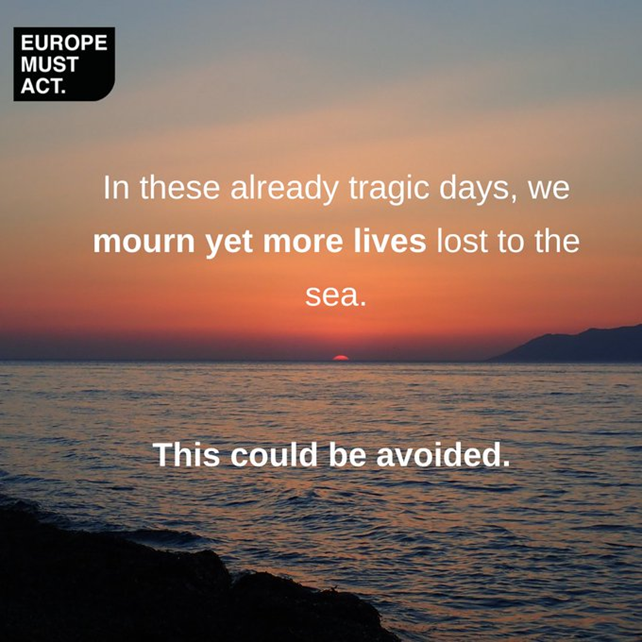

### AYS News Digest 2/3/22: The EU’s Emergency Plan to Support Ukrainian Refugees
#### The EU’s emergency plan to support Ukrainian refugees / Differences in the welcoming approach to Ukrainian refugees vs refugees from Middle Eastern countries / Calls for disciplinary action against senior Frontex officials who concealed pushbacks in Greece / 100 people evacuated from Libya to Italy

 \)](assets/2bf2d7bfd972/1*mohVRID8nW-CoeNncRFK3w.jpeg)

Queues at the Moldovan border with Ukraine at Palanca \(Source: [Erno Simon](https://twitter.com/Embrrrr/status/1499080272192720906/photo/2) \)
#### **FEATURE**

As a response to the Russian invasion of Ukraine and, reportedly, “to reduce the pressure on EU asylum systems”, the [EU is planning to allow Ukrainians the right to live and work in the EU for up to three years](https://www.theguardian.com/world/2022/mar/02/ukraine-refugees-right-to-live-in-eu-plan?fbclid=IwAR1oHsDZ7C_dBmsdTAw7NWmIp0WobRyKRFDwaIWOpOH_YB4-03u41GZb6bM) \.

> “…would grant Ukrainian nationals and permanent residents the right to live, work, access healthcare, housing and education immediately for up to one year, without the requirement to go through lengthy asylum procedures\. If the conflict continues, or refugees cannot return safely, that status could be extended for a further two years\.” 

This emergency plan, referred to as the Temporary Protection Directive \(TPD\) was created in 2001 following the refugees fleeing from the former Yugoslavia\. Since 2001, the TPD has not been used\. This status allows individuals to temporarily access work and education\.

[A Twitter Thread by Jeff Walsh](https://twitter.com/Jeffugee/status/1498674436811149313?fbclid=IwAR1rfaITQXNSL_qpfwPnjC2z2LoMKW2s9-316Dw5uSb6OC5xDu8eneK3ixw) further explains how this plan came about\.

In the first few days, over 500,000 Ukrainians have fled into neighbouring countries\. In the coming weeks and months, an estimated four million people may flee Ukraine\. The UNHCR provides a [data](http://data2.unhcr.org/en/situations/ukraine) portal here, illustrating the latest statistics on refugee arrivals from Ukraine to receiving countries:

[**Information provided on how to get out of Ukraine**](https://cryptpad.fr/pad/?fbclid=IwAR3HtxifV8NUfDYrMbI4beGuzk7RMyZWjoe5Eu57fdTr_cqWxicJy6G7Xcg#/2/pad/view/wznYh8Q6eEGuTI-UrgBjqqwsUrz9JzlHFoLURk1kd48/)

This cryptpad provides updated information on travel information and advice on either getting out of Ukraine or relocating within the country\.

**As we reported in the previous days, media are under [extensive criticism and debate over the](https://menafn.com/1103785663/UK-Arabs-Afghans-decry-racist-double-standard-in-Ukraine-media-commentary) differences in how they approached Ukrainian refugees compared to refugees from non\-European countries\.**

> “You know, this is a relatively civilized, relatively European — I have to choose those words carefully, too — city where you wouldn’t expect that…” — Charlie D’Agata, CBS News Foreign Correspondent 

The international media coverage has brought out and highlighted the [discriminatory and xenophobic European policies and views towards refugees coming from countries outside of Europe](https://www.independent.co.uk/news/world/europe/ukraine-refugees-response-europe-racist-b2024840.html) \. Several media anchors and channels have made comments that illustrate their supportive and empathetic views towards Ukrainian refugees, but expose the criminalisation and ‘othering’ of refugees coming from Middle Eastern countries specifically\. The New York Times [further discusses](https://www.nytimes.com/2022/02/26/us/politics/ukraine-europe-refugees.html) this topic\.

Following what we reported earlier, there have been **mixed experiences from non\-Ukrainian refugees fleeing the Russian invasion\.**

> **“We cannot divide people into worthy and unworthy refugees\. Non\-Ukrainians escaping the war face the same challenges as Ukrainians\. We have to offer support to all people in need, not only to white ones who are similar to us\.”** — _Anna Alboth, Minority Rights Group_ 

[A twitter thread by Bijan Hosseini](https://mobile.twitter.com/BijanCNN/status/1498692799939624962) from CNN telling the story of his sister who fled Ukraine to reach Poland details the racism, freezing temperatures and sleep deprivation she endured\.

> “When they arrived to the border they were not let in\. Two lines were formed\. One for white people, the other for everyone else\. Only Ukrainians were being let over the border\. Thousands of people were forced to sleep outside in the cold\. Fires were started to keep people warm\.” 

■■■■■■■■■■■■■■ 
> **[Lorenzo Tondo](https://twitter.com/lorenzo_tondo) @ Twitter Says:** 

> > Dozens of Polish nationalists gathered this evening near the train station in Przemyśl, where #refugees from Middle East and Africa fleeing the #war in #Ukraine are being sheltered, &amp; attempted to attack them, shouting slogans and anti-immigrants chants. #Poland #Putin #Russia 

> **Tweeted at [2022-03-01 22:59:51](https://twitter.com/lorenzo_tondo/status/1498795179792384000).** 

■■■■■■■■■■■■■■ 

**For further reading:**

[Alexei Navalny, Russia’s jailed opposition leader, calls Putin an “insane tsar” and has encouraged Russian citizens to protest every day against the invasion of Ukraine\.](https://www.euronews.com/2022/03/02/ukraine-war-kremlin-critic-alexei-navalny-calls-for-protests-and-labels-putin-as-an-insane?fbclid=IwAR2OnSAmbikPHH4IaHU4YEkumxPqQrsWfCkG2rUu6wMLIY6F_wxklVjL1jk)

[Chef Jose Andrew, founder of World Central Kitchen, has set up sites along the border of Ukraine in order to feed refugees fleeing to neighbouring countries\. WCK has provided over 8000 meals\.](https://www.wsj.com/livecoverage/russia-ukraine-latest-news-2022-03-01/card/world-central-kitchen-s-chef-jos-andr-s-is-feeding-refugees-leaving-ukraine-sbbUlHCBcqPuOOxu5S6u)

At the same time t [he **EU and its member states consider offering asylum to Russian deserters**](https://verfassungsblog.de/the-legal-obligation-to-recognize-russian-deserters-as-refugees/?fbclid=IwAR3mQDDb35Iui3t1HotceFI_EjiRRb4pqFr5mn9fvRHuBf32VW7VNCfmZ9U) **\.**

Under international law, those who flee punishment for refusing to join the military action in aggressive wars are seen as refugees\. If the EU makes it clear they will recognise Russian deserters as refugees, they will also need to recognise the need to share the responsibility of protection between member states\.
### Info for all fleeing Ukraine and those helping them

[Grupa Granica](https://ukraina.grupagranica.pl/?fbclid=IwAR2OnSAmbikPHH4IaHU4YEkumxPqQrsWfCkG2rUu6wMLIY6F_wxklVjL1jk) have created a site to collect and service information for volunteers and provide general support for Ukrainian citizens who are fleeing\.

Once again, we would like to ask you to share the information collected in this document with all those who might use it\. The information is being updated according to changes and needs:

■■■■■■■■■■■■■■ 
> **[Border Violence Monitoring Network](https://twitter.com/Border_Violence) @ Twitter Says:** 

> > **RESOURCES FOR UKRAINIAN REFUGEES** (last updated 25 Feb). Here is basic information about organizations you can contact if you are in a need of assistance while trying to reach safety. Please share! #Ukraine ⬇️
[docs.google.com/document/d/14T…](https://docs.google.com/document/d/14TY4rE1tz4cJBkrgWiZe2sZBBamuCJF2-luoz4MaBak/edit) 

> **Tweeted at [2022-02-25 23:01:06](https://twitter.com/border_violence/status/1497345941552209924).** 

■■■■■■■■■■■■■■ 

Another document with a list of practical information, list of apps, organisations, contacts and procedures helpful for everyone leaving Ukraine or helping people on the move is **available [here](https://docs.google.com/document/d/1OlZIz-72A2xI2uUOFE07L5ObQGP4JDcXZ2vdIs2P9BQ/preview?fbclid=IwAR0wxEJ5soxistkzpbAUuIdbui3YXduyxVt9mrVzIj919pAzbigi1LLn4BU&pru=AAABf2TeNus*R62zP2E7MDxUWBQYH3K1Yg#) \.**
#### **FRONTEX**

The European Anti\-Fraud Office, OLAF, has [reported](https://www.infomigrants.net/en/post/38907/frontex-leaders-concealed-pushbacks-watchdog-reports?fbclid=IwAR1tvklFElnVwayO7TX7HqL4XhuQLEx8T-U_Nj74WWHsyPn-s_9xQ183ToA) that **three** **senior officials** at Frontex have actively concealed the fact that Greek officials carried out illegal pushbacks of refugees\. OLAF has advised disciplinary action against these senior officials\. Whilst these officials have not been identified, Fabrice Leggeri, head of Frontex, is rumoured to be one of them\. Nevertheless, Leggeri has faced several accusations of concealing and even encouraging pushbacks\.

■■■■■■■■■■■■■■ 
> **[Tineke Strik](https://twitter.com/Tineke_Strik) @ Twitter Says:** 

> > Anti-fraud agency OLAF investigated #Frontex, but findings are not public.

We have to be able to know if mismanagement or human rights violations are taking place in one of the EU’s biggest agencies.

Upon my initiative, the LIBE committee urges Frontex to disclose: 👇 https://t.co/AE7HndU35c 

> **Tweeted at [2022-03-02 10:39:30](https://twitter.com/tineke_strik/status/1498971252341592076).** 

■■■■■■■■■■■■■■ 

#### **LIBYA**

UNHCR have [stated](http://en.people.cn/n3/2022/0302/c90000-9964572.html?fbclid=IwAR2j7Qq3SJdKZCtf8_qvcrtsA5QcUN-pQEVa7DPJb-s4ur4KdEefWXI7pnI) that almost 100 asylum seekers were evacuated from Libya to Italy on Tuesday, 1 March\. This is the first humanitarian flight of 2022 and included women at risk, survivors of violence, children, and those with serious medical conditions\.
#### GREECE

In the early morning of 1 March, the [Greek coast guard found four bodies on the shores of Lesvos](https://www.infomigrants.net/en/post/38875/six-migrants-found-dead-on-shore-of-lesbos?fbclid=IwAR0FRENiSyYcBRKu66kanM7nEKHx4ukeXrJPpMkYhoq1Fwf7ETR6wGVE5Mk) , near the island’s main town of Mytilene\. Two others were found at sea\.

[**Greece rejects asylum applications, and orders the readmission of asylum seekers to Turkey based on the “safe third country” concept**](https://rsaegean.org/en/turkey-safe-third-country/?fbclid=IwAR0gDY2CRr7C9jStnyqZ37T0PMeYi0tradizIq2AthYjp9qObceO8UlNtBo)

In identifying Turkey as a safe third country and refusing to consider and/or dismissing asylum applications based on such an idea, Greece is violating international and EU law\. The Refugee Support Aegean \(RSA\) and Pro ASYL therefore call upon the European Commission to launch infringement proceedings against the Greek government\.

Lost in Europe have created an accessible, quick and safer way to provide tips from individuals and NGOs that support their investigations into missing migrant children **:** [SAFE & ANONYMOUS Whistleblowing platform](https://lostineurope.eu/about-lost-in-europe) \.
#### SPAIN

[Over 2000 people have arrived in Melilla in Spain, the majority from sub\-Saharan Africa](https://www.lavanguardia.com/politica/20220302/8093375/cerca-2-000-inmigrantes-intentan-saltar-valla-melilla.html?utm_medium=social&utm_source=twitter&utm_content=politica&fbclid=IwAR3PcfuwGxW9z99NqpWlUfMOzmQMAkbqpzgeyCrJ2u0XE6rPNVVBm1FF1Z4) \.
#### **MALTA**

Back in 2019, [an agreement between Malta and Libya that aimed to prevent migrant crossings caused accusations of human rights abuses](https://www.eureporter.co/world/malta/2022/03/01/malta-the-mediterranean-purgatory-that-casts-migrants-back-to-the-baying-shores-from-whence-they-came/?fbclid=IwAR0LV6pOZeZVnvHqLYAhYbf7khTi-V3L_RA4fYzKFriym8gRn5AChpjyK2Q) \. Malta supports Libya with the training and equipment to intercept boats, which then results in individuals being detained in prisons and detention facilities across Libya\. Accounts of human rights violations, abuse, and torture have been rife in these prisons, with Malta turning a blind eye\.
#### **UK**

[The Home Office planned to fly 40 Zimbabweans out on 2 March 2022](https://www.voice-online.co.uk/news/uk-news/2022/03/01/i-cant-see-the-use-of-living-detainee-speaks-of-fear-and-despair-ahead-of-deportation-flight/?fbclid=IwAR3IkARNKtcLEkPUFqMuH5vdUQi58PmHJIn5uUe3_1bw0IWnl0YsUUw_Wb0)

Many have been seriously traumatised by their experiences with the Home Office and have been detained for long periods of time\. Detention Action have been supporting 36 people threatened with forced deportation to Zimbabwe since 2019\. Almost 44% of those have lived in the UK for at least 20 years\.

[Byline Times reports](https://bylinetimes.com/2022/03/01/stuck-in-limbo-uk-asylum-and-immigration-system-in-post-brexit-turmoil/?fbclid=IwAR2j7Qq3SJdKZCtf8_qvcrtsA5QcUN-pQEVa7DPJb-s4ur4KdEefWXI7pnI) that since 2010 there has been a rise in asylum applications in the UK, along with an increase in the length of time an asylum seeker awaits a decision from the Home Office\. These delays cause uncertainty about the future, prolonged destitution and inactivity, which are all devastating for so many asylum seekers\. In 2021, around 61% of people waiting on an asylum application decision, waited six months or more\.

Despite this general increase in asylum applications, neighbouring countries take many more asylum seekers in comparison to the UK\. At a time where there is mounting pressure to welcome refugees, with the Taliban takeover in Afghanistan, and the Russian invasion in Ukraine, the UK continues to fail in providing support for such individuals\.

[Ukrainian refugees unable to join loved ones in Britain, under the Home Office scheme](https://www.independent.co.uk/news/uk/home-news/ukraine-refugees-visas-family-home-office-uk-b2025715.html?fbclid=IwAR1_R5i3TgdtSQeJr2Y875sD7VZcFqP_ARIaL_E4xQGmXTkTLUOX9fi_EPE)

The Home Office announced a new sponsorship scheme to support people fleeing the Russian invasion\. They further expanded the humanitarian route to include more relatives of British nationals and people settled in the UK\. However, this scheme will still exclude many Ukrainians trying to reach their loved ones, and there are huge delays in this sponsorship route\.

■■■■■■■■■■■■■■ 
> **[Sophie Spector](https://twitter.com/SophieSpector) @ Twitter Says:** 

> > I have just got off the phone with the helpline. The scheme for extended family members where the British National is in the UK IS NOT OPEN! There is no means to apply. Helpline are frustrated and upset as we all are as receiving thousands of calls. Do not call the number. 1/2 

> **Tweeted at [2022-03-02 10:52:18](https://twitter.com/sophiespector/status/1498974473915092995).** 

■■■■■■■■■■■■■■ 

#### **FRANCE**

A number of NGOs in Calais, France, have reported that a 25\-year\-old Sudanese refugee died after being hit by a train\.

■■■■■■■■■■■■■■ 
> **[Utopia 56](https://twitter.com/Utopia_56) @ Twitter Says:** 

> > Au même moment, même ville, plus de 800 personnes, venues elles d'Afghanistan, Érythrée, Soudan, sont humiliées et forcées à la misère dans des campements. Lundi encore, un jeune homme est mort à Calais en tentant de traverser la frontière. Hypocrisie et racisme en gros titres. 

> **Tweeted at [2022-03-02 16:14:55](https://twitter.com/utopia_56/status/1499055662348832769).** 

■■■■■■■■■■■■■■ 

**Find daily updates and special reports on our [Medium page](https://medium.com/are-you-syrious) \.**

**If you wish to contribute, either by writing a report or a story, or by joining the info gathering team, please let us know\.**

**We strive to echo correct news from the ground through collaboration and fairness\. Every effort has been made to credit organisations and individuals with regard to the supply of information, video, and photo material \(in cases where the source wanted to be accredited\) \. Please notify us regarding corrections\.**

**If there’s anything you want to share or comment, contact us through Facebook, Twitter or write to: areyousyrious@gmail\.com**
### Sign up for AYS Daily Newsletter
### By Are You Syrious?

Daily news digests from the field, for volunteers, people on the move, journalists, and the general public [Take a look\.](https://medium.com/are-you-syrious/newsletters/ays-daily-newsletter?source=newsletter_v3_promo--------------------------newsletter_v3_promo--------------)

You’re an editor of AYS Daily Newsletter

_Converted [Medium Post](https://medium.com/are-you-syrious/ays-digest-2-3-22-the-eus-emergency-plan-to-support-ukrainian-refugees-2bf2d7bfd972) by [ZMediumToMarkdown](https://github.com/ZhgChgLi/ZMediumToMarkdown)._
