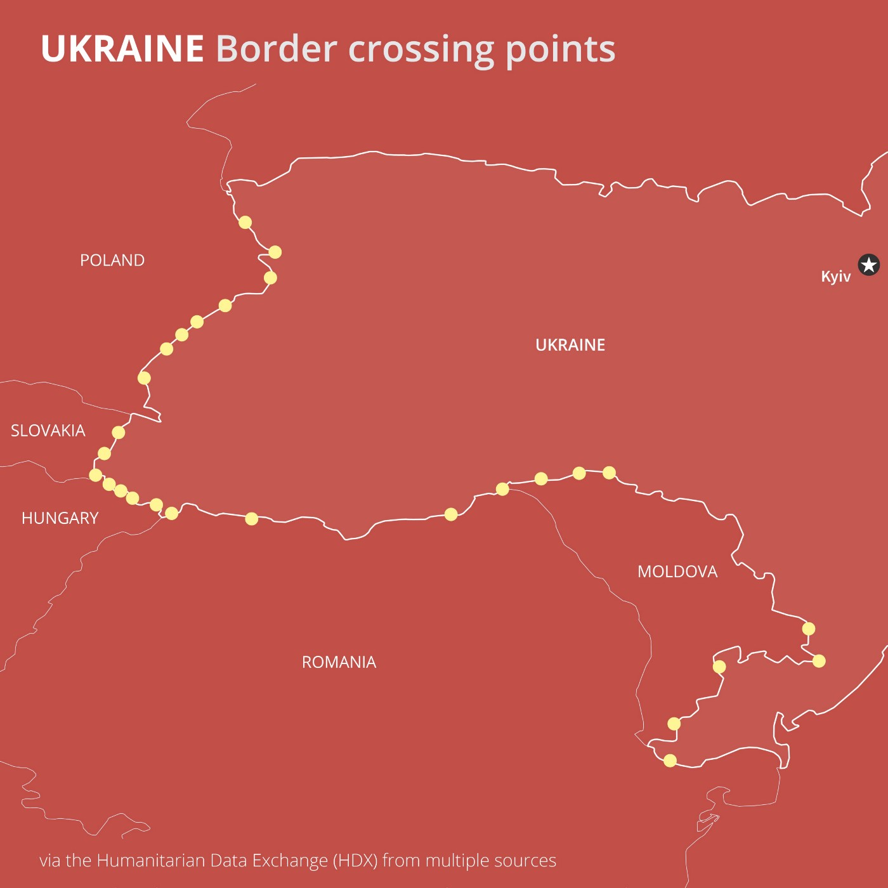

### AYS News Digest 04/03/2022: Temporary Protection Directive reveals double\-standard refugee law

Updates from the Ukrainian borders / Pushbacks in Greece and Romania / Violence against new arrivals in Melilla / UK Government failings / Updates from France and Germany and more\.

](assets/6eb92d0432eb/1*R3NeF58uKzT3xW4-Za8pNw.jpeg)

Border control, Emad Hajjaj, 2 March 2022, [Cartoon Movement](https://cartoonmovement.com/cartoon/border-control-0)
#### FEATURED: Temporary Protection Directive reveals racialised double\-standard refugee law

According to UNICEF, 10 days into the conflict, the Russian invasion has already [exacted](https://www.unicef.org/eca/press-releases/one-week-conflict-ukraine-half-million-children-become-refugees) a “harrowing toll on children”, with 500,000 children among the [1,368,864 people](https://data2.unhcr.org/en/situations/ukraine) who have fled Ukraine to neighbouring countries\. M [edia analysis](https://foreignpolicy.com/2022/03/04/ukraine-russia-war-refugees-10-million/) , suggest the conflict could generate over 10 million refugees and internally displaced people in the coming months and years\.

> Hundreds of homes have been damaged or destroyed, and there are reports of schools, orphanages and health centres sustaining heavy damage\. 

> Humanitarian needs across the country are multiplying by the hour\. Hundreds of thousands of people are without safe drinking water because of damage to water system infrastructure and many have been cut off from access to other essential services like healthcare\. The country is running low on critical medical supplies and has had to halt urgent efforts to curb a polio outbreak\. _\( [UNICEF](https://www.unicef.org/eca/press-releases/one-week-conflict-ukraine-half-million-children-become-refugees) \)_ 

 \)](assets/6eb92d0432eb/1*2s7sz0m25Dv8agRyH-f1Xg.png)

Refugee arrivals from Ukraine \(since 24 February 2022\), By Country and By Date \(Source: [UNHCR](https://data2.unhcr.org/en/situations/ukraine) \)

The UN Special Rapporteur on Human Rights Defenders Mary Lawlor published an update on the work of civil society organisations in Ukraine\. Read it [HERE](https://srdefenders.org/information/ukrainian-human-rights-defenders-update-un-special-rapporteur-mary-lawlor-on-their-responses-to-invasion/) \.

As we reported in our last news digest, among the many big developments in response to the Russian invasion of Ukraine, there was an important potential asylum law measure — the decision to trigger the EU’s Temporary Protection Directive \(TPD\), a legal instrument dating back to 2001, which has never previously been used\. Member States indicated ‘broad support’ for use of the Directive at the EU Council meeting of February 27\. The Commission duly proposed a Decision to give effect to this on March 2, alongside guidance for applying EU external borders law\. The Council agreed on the Decision on March 3, and formally adopted it on March 4\.

■■■■■■■■■■■■■■ 
> **[EUR-Lex](https://twitter.com/EURLex) @ Twitter Says:** 

> > #Ukraine : @[EUCouncil](https://twitter.com/EUCouncil) introduced temporary protection for persons fleeing the #war

Read the Decision in the Official Journal L71
🇺🇦 [europa.eu/!4VqFxv](https://europa.eu/!4VqFxv)

#StandWithUkraine #UkraineRussianWar #migration #Refugees https://t.co/2c4MMVQFnQ 

> **Tweeted at [2022-03-05 08:43:38](https://twitter.com/eurlex/status/1500029257514369028).** 

■■■■■■■■■■■■■■ 

It is positive news for the more than 1 million people who have fled Ukraine, but contains worrying elements that set in law the discrimination we have witnessed and reported taking place against non\-white people at the country’s border\.

According to the Decision, it applies to “the following categories of persons displaced from Ukraine on or after 24 February 2022, as a result of the military invasion by Russian armed forces that began on that date”:

> _a\. Ukrainian nationals residing in Ukraine before 24 February 2022;_ 

> _b\. stateless persons, and nationals of third countries other than Ukraine, who benefited from international protection or equivalent national protection in Ukraine before 24 February 2022; and,_ 

> _c\. family members of the persons referred to in points \(a\) and \(b\) \._ 

The Decision applies in a different way to another category of people:

> _…stateless persons, and nationals of third countries other than Ukraine, who can prove that they were legally residing in Ukraine before 24 February 2022 on the basis of a valid permanent residence permit issued in accordance with Ukrainian law, and who are unable to return in safe and durable conditions to their country or region of origin\._ 

As professor Steve Perry [wrote](https://eulawanalysis.blogspot.com/2022/02/temporary-protection-for-ukrainians-in.html) , for this group, “Member States shall apply either this Decision or adequate protection under their national law”\. Adequate protection is not further defined; the preamble of the Decision adds only that it is “to be decided upon by each Member State”\. The granting of protection to this category of people — as well as the definition of the criteria on who falls into this category, the type of protection, etc… — are suggested in the Decision, but ultimately left optional to each Member State\.

**Read More:** [Temporary Protection for Ukrainians in the EU?](https://eulawanalysis.blogspot.com/2022/02/temporary-protection-for-ukrainians-in.html) Q and A, by professor Steve Perry, EU Law Analysis

■■■■■■■■■■■■■■ 
> **[ECRE](https://twitter.com/ecre) @ Twitter Says:** 

> > NEW: @[ecre](https://twitter.com/ecre) has compiled an info sheet on access to territory, asylum procedures &amp; reception conditions for 🇺🇦 nationals in European countries.

The document is non-exhaustive but covers many of the current measures taken by 🇪🇺 countries.

Read &amp; share: [bit.ly/3vCEsjC](https://bit.ly/3vCEsjC) https://t.co/aptvPykhrI 

> **Tweeted at [2022-03-03 16:06:10](https://twitter.com/ecre/status/1499415846229360644).** 

■■■■■■■■■■■■■■ 

Many countries have already implemented national legislation in line with the European Directive\. As of yesterday, 2,500 Ukrainian citizens had already arrived in [Greece](https://twitter.com/EleniKonstanto/status/1499718312321761280) and will be hosted under the terms of the Temporary Protection Directive, receiving a 12\-month residence and work permit\. This follows the statement of Asylum and Migration Minister Notis Mitarakis before the Hellenic Parliament that Ukrainians are the “real refugees\.” As Eva Cossé of Human Rights Watch [pointed out](https://www.hrw.org/news/2022/03/03/greece-should-know-refugees-can-come-anywhere) :

> what he was trying to say was that the people fleeing devastating conflict and persecution in Afghanistan, Syria, and other countries who are coming to Greece are not\. 

The Parliament of Denmark, which is the only EU Member State not participating in the Temporary Protection Directive, has [expressed](https://uim.dk/nyhedsarkiv/2022/marts/bred-aftale-om-lovgivning-til-fordrevne-fra-ukraine/) broad agreement in establishing legislation that will enable people expelled from Ukraine to be granted a residence permit, so they can quickly start school and work\.

Canada’s government is introducing new immigration streams for Ukrainians who want to come to Canada temporarily or permanently\. Read more [here](https://www.canada.ca/en/immigration-refugees-citizenship/news/2022/03/canada-to-welcome-those-fleeing-the-war-in-ukraine.html) \.
#### Racialised borders

At the borders, and within Ukraine, scenes of racism and discrimination against people from Africa and Asia have been reported by local and international media\.

On Thursday, InfoMigrants [reported](https://www.infomigrants.net/en/post/38941/from-ukraine-to-poland-refugees-at-a-crossroads) that many foreign nationals were holding out in the warehouse turned reception facility in Korczowa, on the Polish side of the border with Ukraine:

> Students from India, Angola, or Uzbekistan, along with migrant workers from Central Asian countries\. The International Organization for Migration estimates that about 470,000 foreigners were living in Ukraine, about 75,000 of them are students\. These people are also fleeing the country\. 

Many reported being pushed and kicked out of trains when trying to leave Kiyv or other Ukranian cities, and of being refused passage across the border or beyond the reception facilities\. There are also reports of [bribery attempts](https://rzeszow.wyborcza.pl/rzeszow/7,34962,28161856,dramat-emigrantow-z-afryki-i-azji-ktorzy-chca-uciec-z-ukrainy.html) , [stolen belongings](https://sciencenorway.no/opinion-refugees-researchers-zone/why-does-poland-welcome-ukrainian-refugees-but-not-others/1991637) , humiliation and abuse\. Over the last few days, several embassies have taken action to provide safe passage for their own citizens, but many remain stuck, especially those detained in detention facilities\.

As InfoMigrants report, people of many nationalities have been [forced to stay](https://www.infomigrants.net/en/post/38965/please-rescue-us-bangladeshi-migrants-stuck-in-ukraine-urge) in detention centres in various parts of the country after the Russian invasion\. In Mycolav, nine people are detained near a military airfield, which has been targeted by Russian forces since February 26\. The people detained have reported being beaten up by police when they tried to leave the camp last week to flee to Poland\. In the Ukrainian town of Kivertsi, around a hundred people on the move, among them women and children, are staying at another detention centre which has been converted to a military base, living with Ukrainian soldiers\.

**Read more:** [Ukraine’s Refugees & Racialised Borders](https://bylinetimes.com/2022/03/04/ukraines-refugees-and-racialised-borders/) By Charlotte Galpin and Sara Jones
#### Updates from the borders

A constantly updated document on the situation at each border crossing in the country is available [HERE](https://docs.google.com/spreadsheets/d/e/2PACX-1vTmKNAxZn2cPpBqPHnRx9Hc_GPzfi7U92h05hkNuES6pA8l7IcbfdRELMkTBWGcBFoRkUdwlnfX889X/pubhtml?gid=0&single=true) \.

**\*Zahony border crossing \(Hungary\):**

■■■■■■■■■■■■■■ 
> **[Petra Molnar](https://twitter.com/_PMolnar) @ Twitter Says:** 

> > 🚨For those from #Ukraine seeking legal help at the #Zahony train station in Hungary, the Office of the Commissioner for Fundamental Rights just opened a pop up office inside train terminal to provide legal counselling and admin assistance. 

[ajbh.hu](http://www.ajbh.hu) +361 475 7100 https://t.co/kz0qxeBb8v 

> **Tweeted at [2022-03-03 17:47:02](https://twitter.com/_pmolnar/status/1499441231671218178).** 

■■■■■■■■■■■■■■ 

#### A message from Poland

On Friday, Solidarity group Grupa Granica published an important [text](https://www.facebook.com/grupagranica/posts/365351268726808) on the hidden tragedy taking place at the border with Belarus\. Here’s an extract:

> …Group Granica reminds about the ongoing humanitarian crisis at the Belarusian\-Polish border\. We don’t want it to disappear in the shadow of tragic events in Ukraine\. People illegally pushed across borders back and forth by the services of both countries, exhausted and often in a fatal state, have the right to security and seek international protection as well as those fleeing war in Ukraine\. They are also victims of wars and political crises in their countries\. We should also help them\.
 

> According to Border Guard data until the afternoon of March 3, i\.e\. within a week since the start of the invasion of Ukraine by Russian troops, more than 600 thousand people fleeing the war have arrived to Poland \[from Belarus\] \. Their safety, health, and sometimes their lives depend greatly on the support provided by ordinary people and local government authorities throughout the country\. The newly introduced facilities to cross the Ukrainian\-Polish border are also not of any importance\. **It turns out that professional behaviour of officers and human treatment of refugees at the border is possible — it’s a matter of political will\.** We therefore appeal to expand the application of law and humanitarian standards also to refugees trying to obtain international protection on the border with Belarus\.
 

> Due to the lack of legal solutions and access to any humanitarian aid on the Polish\-Belarusian border, help is still carried by activists and activists of Grupa Granica— despite serious difficulties arising from the prohibition laws entrance to the closed zone\. 

> …Only in the period from February 26 to March 3, 51 people, including 7 children, sought help from Grupa Granica\. They fled through Belarus from conflict countries — Eritrea, Sudan, Yemen, Syria and Iraq\.
 

> At the same time, people fleeing Ukraine are reporting to us\. In connection with the growing difficulties faced by refugees and refugees of non\-Ukrainian origin on the Polish side, more and more of them are asking for help from activists and activists of the Border Group\. Off they go m\. In\. from Algeria, Yemen, Somalia, Pakistan, Iraq, Nigeria, Kurdistan, Lebanon…
 

> Human rights are universal\. Rulers cannot apply double standards towards people seeking protection in the territory of the Republic depending on which border they cross and where they come from … 

#### Supporting people fleeing Ukraine in Serbia

The [Organization for Migration and Refugees “Info Park”](https://www.facebook.com/infoparkserbia/posts/4810999978954228) is hereby calling on Serbian citizens who would like to temporarily host and care for refugees from Ukraine in case of need \(no matter what ethnic origin\), to contact them through the following e\-mail: info@infopark\.online — phone: 0604050248 \(9am to 5pm\) \. Info Park wants to collect the contacts of Serbian citizens who would like to help refugees from Ukraine by welcoming them into their homes for as long as needed\. The organisation guarantees discretion and privacy of data\.
#### Is the British government U\-Turn on people fleeing Ukraine enough?

Over the last few days, it was reported that a group of nine people from Ukraine were turned back at the French\-British border in Calais, because they did not have visas\. In a series of clumsy [statements](https://www.itv.com/news/2022-03-04/ukrainian-refugees-can-stay-in-the-uk-for-three-years-after-government-u-turn) , the British government first introduced one\-year protection for people leaving Ukraine, then extended it to three years following pressure from campaign groups, but excluded a waiver of visa rules\. On Friday, the UK opened a dedicated [helpline](https://twitter.com/ukhomeoffice/status/1499750327926546435) to support extended family members of British citizens, which was immediately criticised for malfunctioning and for [charging](https://twitter.com/supertanskiii/status/1499713903886053379) for calls from outside the country\.

**Read More:** [The \(sorry\) State of the UK Asylum System](https://www.freemovement.org.uk/briefing-the-sorry-state-of-the-uk-asylum-system/) by Colin Yeo\.

SPAIN
#### Arrivals in Melilla

> At the southern border of the European Union, Civil Guards and National Police are brutally beating, kicking heads, stepping on the necks of people who flee from other conflicts and only seek to be able to live in peace\. — [_No Name Kitchen_](https://twitter.com/NoNameKitchen1/status/1499684659143266308?fbclid=IwAR25QSN5zvyBdODwSD0QDs8fq62M482kr-ZKb7fGYfRYdXuo1OIih1VtV9g) 

The last few days have seen many attempts to cross into Melilla, a Spanish territory in Northern Africa, from Morocco\. [Around 940 people have made it so far in 2022](https://www.infomigrants.net/en/post/38932/melilla-thousands-of-migrants-attempt-to-scale-fence-into-spanish-enclave?fbclid=IwAR0a6GeIYFfNSR4c6RLujpOmC8Yj2w5ZYHvwH-2llxKEljcV7QPQyA0Zne8) \. Extreme violence has been used by law enforcement officers against the people who climbed the fence, an act which in itself often leaves people with multiple injuries due to the use of razor wire\.

■■■■■■■■■■■■■■ 
> **[Solidary Wheels](https://twitter.com/SolidaryW) @ Twitter Says:** 

> > 🔴AVISO DE CONTENIDO🔴 imágenes violentas

Denunciamos la #ViolenciaPolicial sistemática en la #FronteraSur. 

Es intolerable que no se pueda identificar a los agentes actuantes en la valla cuando se han producido agresiones. Las actuaciones policiales van en contra del protocolo https://t.co/3ZW0kUIuX0 

> **Tweeted at [2022-03-03 14:12:31](https://twitter.com/solidaryw/status/1499387246767661062).** 

■■■■■■■■■■■■■■ 

GREECE
#### Pushbacks

[The European Commission has proposed that the Council of the EU recommend that Greece](https://www.statewatch.org/news/2022/march/pushbacks-in-greece-commission-calls-for-investigations-and-more-border-surveillance/?fbclid=IwAR21H0f7dqis8NnV_krrfdRwWIkdAELr4ZGk-x-5plwTTbxbvDS4PVkUITM) “carry out independent investigations into all serious allegations of ill\-treatment by the Hellenic Police and Hellenic Coast Guard at external borders” that are “capable of leading to the identification and punishment of those responsible\.”

However, they have also recommended increased border surveillance, which would in fact aid Greece in continuing its current violent practice, and [increased collaboration with Frontex](https://digit.site36.net/2022/03/03/demands-from-eu-member-states-greece-to-upgrade-borders-with-helicopters-drones-and-police-dogs/?fbclid=IwAR3VEiJdC_cxquExzNeoMHvMzo5j3DaNTh89y3vgnRBelGhov_PBaiZ6ZDs) , who are also implicated in multiple pushbacks\.

Two people, Amir and Razuli, who were accused of assisting illegal entry after their boat was reportedly attacked and deflated by the HGC will have their appeal hearing on the 17th of March\. They were originally sentenced to 50 years in prison\.

On Friday, [five boats on route to Greece were apparently “detected early” and prevented from entering Greek waters](https://www.hcg.gr/el/drasthriothtes/egkairos-entopismos-lembwn-poy-epixeirhsan-na-eisel8oyn-sta-ellhnika-xwrika-ydata-sthn-eyryterh-8alassia-perioxh-ths-n-kw/?fbclid=IwAR0KCsMogu-PkSVvSlgiLc7DPElB0Ux-ohAciC3hHqJFAkppzfGJPUKKMe8) in a collaborative effort between the HGC and Frontex\. The methods used to prevent their entry were unsurprisingly not listed\. [As researcher Lena K\. points out](https://twitter.com/lk2015r/status/1499716742251266048?fbclid=IwAR3j-aDQpzLj_CJJQD8ZxwQ33YfACLb0JHYS5YJuwMGDeyKY-f3oT01la0c#) , this is a purposeful blurring of the boundary between prevented entry and pushback\.

Meanwhile, the [Greek poet Thanasis Triaridis](https://twitter.com/iopapadimitriou/status/1499329869011996672?fbclid=IwAR2j8mDzCScWAnk-7lmQWDf2MBodC7fCRVHUExZSeR5jBTjBPz2ykBJfJk0) has rejected his nomination for a State Literature Award stating:

> There is no chance I will include myself in the awards list of a state that kills migrants through pushbacks\. 

#### Ukrainians in northern Greece

Greek farmers of the IBP Thrace Cooperative in northern Greece [have offered Ukrainians permanent homes, for people who have lost their own, and jobs](https://www.zougla.gr/greece/article/agrotes-sto-tixero-evrou-perimenoun-me-anikti-agalia-prosfiges-apo-tin-oukrania) \. They are currently experiencing a shortfall in workers and need to employ 1000 people for the coming harvest\.

■■■■■■■■■■■■■■ 
> **[Lena K.](https://twitter.com/lk2015r) @ Twitter Says:** 

> > 'Farmers from Tychero (village in #Evros) wait for refugees from Ukraine with open arms' report several 🇬🇷news sites. Commendable, but these farmers, and many other locals, were patrolling the border with shotguns in March 2020 so as not to let other refugees in. Racism rules. 

> **Tweeted at [2022-03-02 11:36:57](https://twitter.com/lk2015r/status/1498985710367522816).** 

■■■■■■■■■■■■■■ 

ROMANIAN/SERBIAN BORDER
#### New Report on Pushbacks

[KlikAktiv — Center for Development of Social Policies — have published a report](https://drive.google.com/file/d/1yv8Bs8KnoNlfSjNN7zXIK-XD8eLCi4uj/view?fbclid=IwAR3Wv0QlIjSQnyqFDtmh_jsZ5kl8LboM7GR0Xij8qZNzES7WXqZQA-tQ8xA) based on collected testimonies describing the pushbacks of 3,700 people on the move in the period between July 2020 and November 2021\. The route through Romania first became active in the winter of 2019/2020, but the police and border guard presence did not increase until the summer of 2020 when they began to initiate pushbacks\. Testimonies often include the Romanian police beating and stealing cash from people on the move, breaking or confiscating their mobile phones, or destroying their personal belongings such as passports, bags, clothes, documents or any other items they found on them\.

FRANCE
#### Letter to Mrs\. Natacha Bouchart, Mayor of Calais

[L’auberge des Migrants have written a letter to Mayor Bouchart](https://www.facebook.com/AubergeMigrants/posts/10159425697380339) calling her out on her discriminatory behaviour towards refugees from different countries: offering recent arrivals from Ukraine train rides, accommodation and restaurant food after opposing the opening of a winter shelter for other people on the move\.

> This attitude can be classified as discriminatory, as the extract of the law below proves\. Discrimination based on origin, physical appearance, belonging or non\-belonging, true or suspected, to an ethnicity, a nation, an alleged race or a determined religion, is a crime, likely to be prosecuted and condemned\. 

If she persists in this discriminatory behaviour they will take her to court\.
#### A total of 202 people rescued in the Channel

[In multiple operations, 202 people were rescued](https://france3-regions.francetvinfo.fr/hauts-de-france/pas-calais/manche-202-migrants-sauves-dans-le-detroit-du-pas-de-calais-pour-les-associations-la-france-doit-changer-de-politique-2483293.html?fbclid=IwAR3_sE2YH4eMA_u8e78VJ5CXE3LDdHyLSfrNbg9uK5rRACVNSUo3ljp2kXo) between the 2nd and 3rd of March as weather conditions became more favourable\.
#### Calais Food Collective needs volunteers

[Calais Food Collective](https://www.facebook.com/calaisfoodcollective/posts/500873174898535) are looking for volunteers for at least two months, but preferably longer, to take part in their activities\. Ideally, you should have previous experience, speak French and be a driver\.

GERMANY
#### Destitute: Recognised Refugee in Athens

[Refugee Support Aegean have reported on the case of “Farhad”](https://rsaegean.org/en/recognised-refugee-returned-to-greece/?fbclid=IwAR0iFxKwiIQu8pJwrTkxAL_yTvzNB3QvZUyPlIqpS0kjfYNJ4qiqiGuXR9Y) a 31\-year\-old from Afghanistan who was returned to Greece from Germany after waiting for five years to have his asylum claim heard\. Despite his family receiving protection and his physical and mental health problems, he was returned to Greece without any access to public or private services, [no access to food or money to feed himself](ays-special-from-greece-are-you-eligible-to-eat-8cc3ac6bed3e) , no access to healthcare and no place to sleep\. Unfortunately, this is an [all too common story in Greece](ays-special-from-greece-recognised-refugees-sleeping-on-the-street-as-eu-scheme-scrapped-cfd8c54e5c6f) \.
#### Church Asylum case sets new precedent

[A monk who gave church asylum to a Palestinian person facing deportation in 2020 has been acquitted](https://www.infomigrants.net/en/post/38980/ruling-in-church-asylum-case-creates-legal-precedent-in-germany?fbclid=IwAR1zqOQmbQEmNFGp_GXs6mP8Keyh8LhaLwkFQJGBhqU_qmdO6PymfWR3cTM) by the Bavarian High Court of interfering with legal due process\. The Court stated that offering room and board to a rejected asylum seeker was not a crime\. The judge stated that authorities must tolerate church asylum without taking action, though churches are not protected from criminal liability\.

WORTH READING
- [**Migrant resistance against yet another new level of brutality**](https://alarmphone.org/en/2022/03/02/migrant-resistance-against-yet-another-new-level-of-brutality/) , Alarm Phone — Central Mediterranean Analysis, July to December 2021\.
- [**Frontex: border agency with ballooning budget in transparency tug of war**](https://www.statewatch.org/news/2022/march/frontex-border-agency-with-ballooning-budget-in-transparency-tug-of-war/) **,** by Statewatch\.
- ‘ [**Hypervulnerability’ Through Adapted Asylum Procedures During Covid\-19 In Belgium**](https://www.law.ox.ac.uk/research-subject-groups/centre-criminology/centreborder-criminologies/blog/2022/03) , by Lukas Kestens\.

**Find daily updates and special reports on our [Medium page](https://medium.com/are-you-syrious) \.**

**If you wish to contribute, either by writing a report or a story, or by joining the info gathering team, please let us know\.**

**We strive to echo correct news from the ground through collaboration and fairness\. Every effort has been made to credit organisations and individuals with regard to the supply of information, video, and photo material \(in cases where the source wanted to be accredited\) \. Please notify us regarding corrections\.**

**If there’s anything you want to share or comment, contact us through Facebook, Twitter or write to: areyousyrious@gmail\.com**

_Converted [Medium Post](https://medium.com/are-you-syrious/ays-news-digest-04-03-2022-temporary-protection-directive-reveals-double-standard-refugee-law-6eb92d0432eb) by [ZMediumToMarkdown](https://github.com/ZhgChgLi/ZMediumToMarkdown)._
