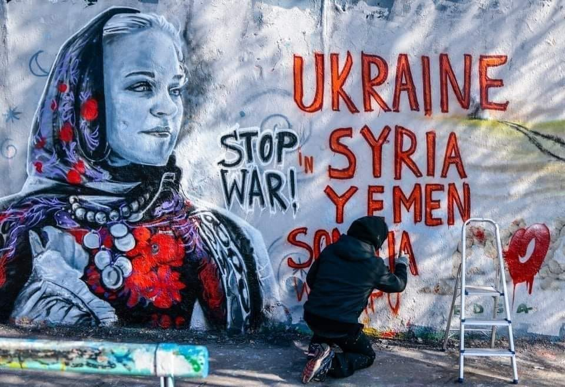
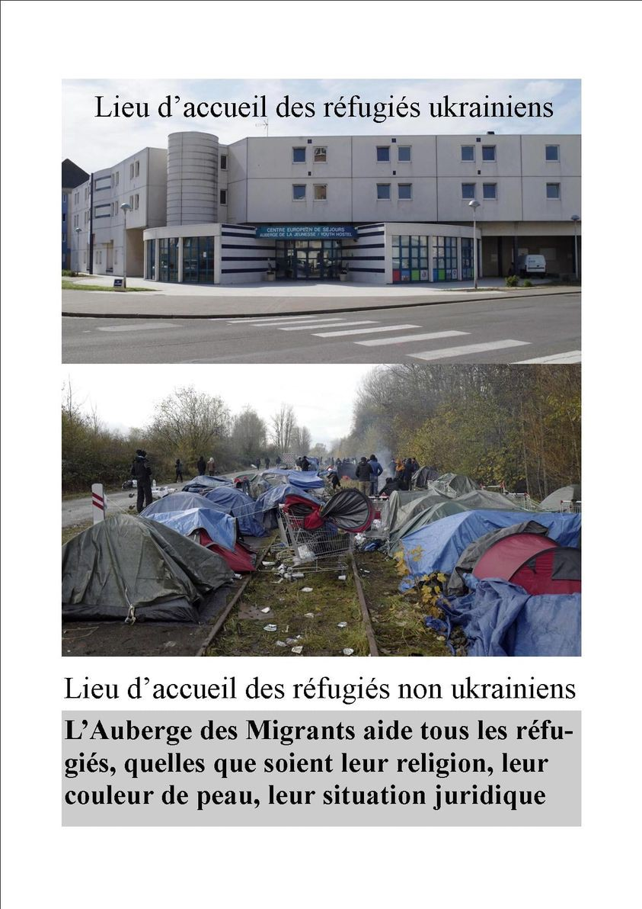

### AYS News Digest 07/03/2022: Whose wars count?
#### How did a grassroots campaign take on one of the world’s biggest holiday firms and win? / The UK’s Marine Accident Investigation Branch has launched a probe into the emergency response to the tragedy “on the assumption that some part of the accident occurred in UK waters” / Mixed Migration update & some good read material curated by our team

_Streets of Berlin, by Arte Vilu @Art Against_

**Denmark** continues to create a two tier system for people on the move in the country and expose its racist underbelly\. [The controversial ‘jewellery law’ which allowed the police to take money and valuables from asylum seeker](https://www.opindia.com/2022/03/denmark-plans-to-exempt-ukrainian-refugees-from-jewellery-law/?fbclid=IwAR0dIOYUdHy7TCL_QCCdAHdKd_LLvnZQR7qlJKPRK883COs8tWkQx0-kkTQ) , and was brought in in 2016 thus targeting Syrians, will not apply to Ukrainians\. They have also brought in a Special Law in line with the EU Protection Directive, but offering a two year rather than one year residence permit which allows for the right to work, healthcare, schooling etc\. [Refugees DK have described this as “pure ethnic discrimination\.](http://refugees.dk/en/focus/2022/march/special-law-for-ukrainians-is-discriminating-and-short-sighted/?fbclid=IwAR3a9k_o2Jo9CQneEv4Cyh1XRPsXfOxJ73g-7bOqQcGf0bVfJd8EJFKO7nQ) ” Meanwhile, [Syrians are still have their residence permits revoked](https://www.nytimes.com/2022/03/07/world/europe/denmark-syrian-refugees.html?fbclid=IwAR28Og6zEGABXX-_Wgdoy2EZB8dNDiL5Z_s0UGDJMhGePEMUvZNqtbSPSEM) and being placed in indefinite detention away from the their families with the constant threat of deportation to a country which has seen multiple reports of returnees facing extortion, torture, sexual violence and forced disappearance, and with which there is no diplomatic relation\.

> The Transbalkan Solidarity collective calls for wide street protests on March 8, for a strike and disobedience until the end of the war in Ukraine, Yemen, Syria, and the occupation of Palestine and all other wars and occupations around the world\. 

[See more](https://transbalkanskasolidarnost.home.blog/no-to-war-in-ukraine-and-apartheid-in-europe/?fbclid=IwAR3uzY_e-Da4r8cGHwp7Zr5TVMATaIJCMyNUnjRSHmskeQM63hRfn_Dpy9w)
#### SEA
#### Returns

452 people were returned to Libya between the 27th and 5th of March\.

■■■■■■■■■■■■■■ 
> **[Jeff Crisp](https://twitter.com/JFCrisp) @ Twitter Says:** 

> > As usual, a reminder that these returns are sponsored and undertaken at the request of the EU, and that the people returned to Libya will now be in abusive detention centres. 
Not exactly minor details... 

> **Tweeted at [2022-03-07 12:50:43](https://twitter.com/jfcrisp/status/1500816213575884806).** 

■■■■■■■■■■■■■■ 

#### Deaths at sea

There were [50 deaths in one shipwreck](https://twitter.com/alarm_phone/status/1500936972222832645?fbclid=IwAR2_oWtGI3gHag-xOP2YEOS6f5rtlC75Ur1ZXS-rxQOcRtaUIiF_KrTQOqY) off Libya on the 27th of February\.

> Over a dozen bodies have washed up on Libyan shores since\. The EU border regime keeps killing people on the move\. 

#### Missing

[Alarm Phone report](https://twitter.com/alarm_phone/status/1500877519418974212) that 60 people left Tunisia 4 days ago\. Their relatives are now trying to locate them\.
#### Rescues

MSF aboard the Geobarents rescued 31 people on the 5th of March\.

 \)](assets/28d924c325e1/1*On5Cj80muOL6oOfnaCqgvw.jpeg)

\(Photo Credit: [MSF Sea](https://twitter.com/MSF_Sea/status/1500442687077601280?fbclid=IwAR1rvGpV43rfl9iUIflN9Y7a9zjBfPygihF3cbbc-ZLbrFK49Q4aVDLnqJk) \)
#### GREECE
### Urgent appeal to prevent a pushback on Lesvos

25 children in imminent danger of being pushed back

> We urge locals, organizations and journalists on Lesvos, to go to Skala Sikamineas to document and to protect the rights of people on the move, _ABR [warns](https://l.facebook.com/l.php?u=https%3A%2F%2Faegeanboatreport.com%2F2022%2F03%2F06%2Fbeaten-robbed-and-forced-to-paddle-themselves-by-hand-back-to-turkey-greeces-government-continues-its-barbaric-pushbacks-regime%2F%3Ffbclid%3DIwAR2IXOkb9VugqZtuSL2z51K80vll8pQOLIpsl9IjNYqkzHde7sMfhiBE5pQ&h=AT1LrYExuId60Xy8LzyV9gr_r_HW58mEt03cZSuSAbLnjWPlDSdksyiN_EGENWm1YEKM90nSe9tb9PXJOAU-WkxSIFIyp0si4A51KmF6BA40W2IGnXW6K5_KJYu6Fdzuc9zg4WL-i3SFSW1HFen1VQeeQEs1WA&__tn__=R]-R&c[0]=AT1vRy6v2gm2TOa6vOvjJveuuQew7O6vH1pzIMdWgJ_ncm32SHF6TkN4vyVxzkYZeUMHke3E40MjwN3hyI_OyayYYuDGa8jCgcUBGHNw9WDPUsLz1bZfLImLHWU-7pXtGvpOqrv4AKEX3x57ctfd1pF1K9AGjzX83lbErrLu_RebkB1-nqBktdZN9JZpJwIv0hluoh9_EJInKmy9LLQ)_ 

### A memorial for the drowned

A memorial service for the drowned refugees washed up by the sea in the Kalamari area, in the “courtyard” of Mytilene, was [held](https://l.facebook.com/l.php?u=https%3A%2F%2Fwww.stonisi.gr%2Fpost%2F24231%2Fena-mnhmosyno-gia-toys-pnigmenoys-video%3Ffbclid%3DIwAR2G9KBuOWbBxI3b2671SLD3lK5rTCeBcwiAq4BEicgxw806Mq2h6cUP0Kw&h=AT0spr3QHHGbwAy3ytEky4QHmhXHVJS0vABnmWcemXyiY3tz36N9IPyBagwznuefHbFQrYuQiWPE13PWMrOKMaGn2yQjkioRc7GHXEVzDnxA6esUgoPWj-YYX1bva0dgwGhPC29ibQ2V1eWUuq5heDjSkgXGQQ&__tn__=R]-R&c[0]=AT1vRy6v2gm2TOa6vOvjJveuuQew7O6vH1pzIMdWgJ_ncm32SHF6TkN4vyVxzkYZeUMHke3E40MjwN3hyI_OyayYYuDGa8jCgcUBGHNw9WDPUsLz1bZfLImLHWU-7pXtGvpOqrv4AKEX3x57ctfd1pF1K9AGjzX83lbErrLu_RebkB1-nqBktdZN9JZpJwIv0hluoh9_EJInKmy9LLQ) at noon on Sunday by the African community of asylum seekers, as well as representatives of Somalis living three kilometers away in the temporary reception center\.

Urgent appeal to prevent a pushback on Lesvos, 25 children in imminent danger of being pushed back

We urge locals, organizations and journalists on Lesvos, to go to Skala Sikamineas to document and to protect the rights of people on the move
#### SPAIN
### EU allocates 4\.5 million euros to Mauritania

[The EU will pay 4\.5 million](https://www.eldiario.es/canariasahora/migraciones/ue-destina-4-5-millones-euros-luchar-trafico-migrantes-mauritania_1_8810304.html?fbclid=IwAR0lQY7oxVcTzRouQsp3drF14Nqr-vITzuaAV2w7yy2z5mbhMKZy0mZ4yQo) to improve the countries police and judicial systems to “combat smuggling”\. Mauritania is a transit country for people travelling to the Canary islands in Spain\.
#### UK
### More Asylum Shambles

The UK has so far managed to issue a whopping [50 visas](https://www.dailymail.co.uk/news/article-10585263/Fury-revealed-FIFTY-Ukrainian-refugees-given-UK-visas.html?fbclid=IwAR0fqEBikywiIpH3Lhi5MCdOYszKFURJk2iWiUM6mZmWMFxUIIYyTYo1XXI) to Ukrainians who are trying to join family members, drastically lagging behind EU states\. In total, the UK expects to accept [200,000 family reunification cases](https://www.infomigrants.net/en/post/39003/hesitant-uk-plans-to-help-ukraine-refugees-are-met-with-criticism-and-ire?fbclid=IwAR3P8SOsOzxm0JkMmI9yDcGPqtkcqa-UlND3FQv4DMflrbsvZgtDWz8e4DM) \.
### November’s 27 deaths took place in British waters

On the 24th of November last year [the tragic death of 27 people](https://inews.co.uk/news/channel-migrants-dinghy-sank-deaths-uk-waters-1484702?fbclid=IwAR3KuCXQIKsk2EEKLlFVA7AR_50maKkHKs60c5UY6djalAGDhtjX-8uHW-A) became evident as their bodies started to be discovered in French Maritime waters\. What was not revealed at the time was that these young people had made it to British waters after all and likely died there\. People who die at this stage of their journey have often survived many difficulties and dangers already, have made friends and helped out other people, have taken part in projects and worked or volunteered along their route\. Their loss is felt right the way along it, through all of Europe, all the way back to the place where they started\.

 puts the location of the dinghy given by the smuggler at 2\.03am UK time within the search area of the HM Coastguard helicopter, which took off around one hour and 20 minutes later\. It is to the north east of a mayday alert raised by the French coastguard inside French waters at 1\.03pm\. i has been unable to independently verify the origin of the image\. \(Data analysis and mapping by Thomas Saunders, i data reporter\)](assets/28d924c325e1/0*OChKSVRW9Mhc6OHu.jpg)

Research by [i](https://inews.co.uk/news/channel-migrants-dinghy-sank-deaths-uk-waters-1484702?fbclid=IwAR3GcY3oAfQzkuk4OpKLSkKOLXzq3Hsccu-NXD_LnjSmCD0VJxhucDPHmWQ) puts the location of the dinghy given by the smuggler at 2\.03am UK time within the search area of the HM Coastguard helicopter, which took off around one hour and 20 minutes later\. It is to the north east of a mayday alert raised by the French coastguard inside French waters at 1\.03pm\. i has been unable to independently verify the origin of the image\. \(Data analysis and mapping by Thomas Saunders, i data reporter\)

If it was proved the dinghy was in UK waters, a public inquiry could consider whether “acts or omissions” by British agencies resulted in human rights breaches and contributed to the deaths\.
#### GENERAL

The refugee crisis of people fleeing Russian military aggression against Ukraine once again lays bare the inadequacies, to put it mildly, of refugee protection and cross\-border migration law and policy\. The EU’s [temporary protection Directive](https://eur-lex.europa.eu/legal-content/EN/TXT/?uri=CELEX%3A32001L0055) does not afford third country nationals [who have moved to Ukraine in recent years](http://eulawanalysis.blogspot.com/2022/02/temporary-protection-for-ukrainians-in.html) the same protections as Ukrainian citizen nationals, noting that temporary protection is afford to ‘persons leaving their country or region of origin’\. Over 470,000 third country nationals in Ukraine, including many overseas students and labour migrants, are currently stranded, trying to find safe passage to Moldova, Slovakia, Hungary, and Poland\.

> Recognition of the deep roots of systemic racism and xenophobia that are embedded in immigration and citizenship laws, and resistance to the perpetuation of exclusionary, restrictive, protection for persons fleeing war can, and must, exist simultaneously with gratitude to the [people](https://www.bbc.com/news/world-europe-60611188) , [companies](https://www.forbes.com/sites/suzannerowankelleher/2022/03/02/airbnb-european-hosts-ukraine/?sh=78d26546706e) and [countries](https://www.euronews.com/my-europe/2022/03/03/eu-countries-agree-to-trigger-a-never-used-law-to-host-ukrainian-refugees) who are opening their homes to those fleeing 

Read the entire paper from the [Border Criminologies](https://www.law.ox.ac.uk/research-subject-groups/centre-criminology/centreborder-criminologies) : [**here**](https://www.law.ox.ac.uk/research-subject-groups/centre-criminology/centreborder-criminologies/blog/2022/03/living-nightmare?fbclid=IwAR0XpMsh2e9fbe4N5YjU7PiYXG1E1wQQXAjIPbVrT8FWOlbE11FHJXz0hh0) \.
#### UKRAINE

■■■■■■■■■■■■■■ 
> **[ECRE](https://twitter.com/ecre) @ Twitter Says:** 

> > New coverage of the weekend's media on #Ukraine displacement:

📈 1.5m displaced
🇷🇴 requests @[Frontex](https://twitter.com/Frontex) support
🇲🇩 takes in 200,000
🇩🇪 welcomes &gt;27,000 Ukrainians
🇳🇴 follows EU to offer collective protection
❓ Has 🇺🇦 thrown open Fortress Europe?

Read more: [bit.ly/3Mte1To](https://bit.ly/3Mte1To) https://t.co/yV6maXxYUn 

> **Tweeted at [2022-03-07 15:16:48](https://twitter.com/ecre/status/1500852977149648903).** 

■■■■■■■■■■■■■■ 

It is estimated that more than 1\.5 million people have now fled [Ukraine](https://www.irishtimes.com/topics/topics-7.1213540?article=true&tag_location=Ukraine) since the Russian invasion\.

671 people have arrived into Ireland from Ukraine but they have gone straight to family already living here\. After that the officials are looking at finding accommodation for the people\. Their estimate is that the country will take in 2% of the estimated number of people who will leave Ukraine, which means that over 100,000 will be welcomed in [Ireland](https://www.irishtimes.com/news/social-affairs/ireland-may-take-in-more-than-100-000-ukrainian-refugees-minister-says-1.4819785?fbclid=IwAR0K7Zo58pxKHCVx9G9Wn35YjjRtKjC0Wq6SIYyZUPgHAyK2rIspV2AHXWs) \.

Germany would take [refugees fleeing the war](https://www.dw.com/en/from-ukraine-to-poland-refugees-at-a-crossroads/a-60996290) in Ukraine [no matter what their nationality](https://www.dw.com/en/ukraine-russia-war-uncertainty-and-anger-remains-for-lviv-residents/a-61014942) , German Interior Minister Nancy Faeser told the weekly _Bild am Sonntag\._
#### Info for helpers

From the No Borders Team channel on Telegram:

> We have a [file](https://l.facebook.com/l.php?u=https%3A%2F%2Fcryptpad.fr%2Fpad%2F%3Ffbclid%3DIwAR1_6wy1KVu1lE5p7ZbknhJ5RG29LB1RJr59yrX1OV21I9XGEBWxxcTsbhM%23%2F2%2Fpad%2Fview%2FLmUjw6%2BA4PL7zTOP2DqlEOWKH5nFf9DQeQTQ952-lOI%2Fembed%2F&h=AT1MS87Ov1lNrv7VLhGattGBYUMv-uiqGbI7UJijxqFvy-8sGpES0GukaJVa2Q__5bnN6NX8nC3QnaZBEPvqjUvf-3IEFXPRjAA-wovDQ-_zuN5mAeYXqMiVNE9ZUbCXXbcDm0oE8SOEL55p_SeHuQPwMbRoLA&__tn__=R]-R&c[0]=AT2MPeEQG7SM3MFEnF5BYQmrzN6sCvEzrq7xLOwKX4kQpE6n3m8OpUhTZUd03yI-7FSuj97LL7887T8GCU7LXtHfEJc_xO0Uka5B1hxcH_wa7PuJfCX6aiXAUfE4KWtB9A-1Pj1I-Jw8Ukkv9a2kwsZaDQQ4wEIDgPMCmWYD5p03BHWrX7fWmKgkGumFAfQ3RuvjOvc_lY-k) for you with lots of useful information about refugees from territory of Ukraine situation\. This is a list of support that is offered by mamy groups, NGOs, associations, quickly established headquarters\. We realize that in this link are not all initatives; the situation is dynamic and is so much help that we would not be able to collect all offers\. 

> On the Ukrainian\-Polish border of course you can also meet grassroots teams, Food Not Bombs, for example, supporting mainly those exposed to the most discrimination\. 

■■■■■■■■■■■■■■ 
> **[Katy Fallon](https://twitter.com/katymfallon) @ Twitter Says:** 

> > Incredible to see this being handed out at Slovakian/Ukrainian border - in my time reporting on migration I’ve never seen protection rights explained so clearly &amp; given so easily. It’s absolutely as it should be but a world away from so many others experience of refuge in EU. https://t.co/eoqsyI77Ek 

> **Tweeted at [2022-03-07 09:08:06](https://twitter.com/katymfallon/status/1500760187690536962).** 

■■■■■■■■■■■■■■ 

However, even in the midst of such a tragedy, EU institutions and border police have not changed their way of acting, thinking and governing people’s right to escape, adding to the barbarity of war the hierarchical separation of people on a [racial](https://l.facebook.com/l.php?u=http%3A%2F%2Fwww.romea.cz%2Fen%2Fnews%2Fworld%2Froma-and-other-people-of-color-fleeing-war-in-ukraine-face-discrimination-and-racism-jaroslav-miko-tells-romea-tv-that%3Ffbclid%3DIwAR1-lKmOQNY0kQYj0vyNlVZPV5b-c0tfhN2tiMGmUgXkO3OOkiyav4Igo90&h=AT0nFzEzxhKAbTII0RLPHhlNUel5IPTX0IGaljj9CHs1u1b3vlyBQFrv_GB87_1-Q0PUiR09qusWKqmNZ_7L22MlR307emzhIlPs1cBA6EdirxRo1TKS-PSKyO7LWqPTP85I4n0rHhhYOGRoNMy5uLnULIGbAg&__tn__=R]-R&c[0]=AT2MPeEQG7SM3MFEnF5BYQmrzN6sCvEzrq7xLOwKX4kQpE6n3m8OpUhTZUd03yI-7FSuj97LL7887T8GCU7LXtHfEJc_xO0Uka5B1hxcH_wa7PuJfCX6aiXAUfE4KWtB9A-1Pj1I-Jw8Ukkv9a2kwsZaDQQ4wEIDgPMCmWYD5p03BHWrX7fWmKgkGumFAfQ3RuvjOvc_lY-k) basis:

[](https://l.facebook.com/l.php?u=https%3A%2F%2Fwww.elsaltodiario.com%2Fguerra-en-ucrania%2Fescapar-guerra-ucrania-acogida-diferencial-union-europea%3Ffbclid%3DIwAR218PJ-ay2h5Wy_kTvH4c7c_3v3JLK6ga4rbOWuEj6_uEkCE56fOeAQGVg&h=AT2kueAXUSedUJqk7TohAB9zKXl5iJ4v5qi-ZYLnePNMFEq5zlpUy9Uh3IaNVe9lAuNpeXC3yBXpiuqRdNWS1dsY48otp0dWIIkhVwdBoPmVGfVr1LLT7x5MSAyaGow1eGKNxxZAPjlmumsQWBcqtuoMxDRcow&__tn__=R]-R&c[0]=AT2MPeEQG7SM3MFEnF5BYQmrzN6sCvEzrq7xLOwKX4kQpE6n3m8OpUhTZUd03yI-7FSuj97LL7887T8GCU7LXtHfEJc_xO0Uka5B1hxcH_wa7PuJfCX6aiXAUfE4KWtB9A-1Pj1I-Jw8Ukkv9a2kwsZaDQQ4wEIDgPMCmWYD5p03BHWrX7fWmKgkGumFAfQ3RuvjOvc_lY-k)

The French collective [L’Auberge des Migrants](https://www.facebook.com/AubergeMigrants/?__cft__[0]=AZV5KLpKq8auUWt82rDLi7yIvdPE-yeqJzxy2Fn3YU_eKYpOCf4raRhAFXbBglaCEkG4CwSqKkuCeJrnmeO-SbCJJPp6fVKwkpNtG78SCR-1K2K8jeMghs7V8rKtuZ3087eSl2h53AsKhER_ke_Xdi25&__tn__=-UC%2CP-R) also [stresses](https://www.facebook.com/AubergeMigrants/posts/10159430945370339) the difference in the approach:

According to several media reports, a little more than 500 Ukrainian refugees have appeared in the port or tunnel in Calais to enter the UK\. More than half have been refilled by the Border Force\. About 150 have stayed in Calais, the others have probably gone to Paris to attempt to get a UK visa\. For now no news of the “British Consulate in Calais” hoped by Darmanin\.

The youth hostel \(European Vacation Center\) has welcomed, to date, about 130, and now there is no room left\. What about those that will be showing up in the next few days? City Hall and sub\-prefecture are not responding\.
#### WORTH READING
- Why don’t we treat all refugees like they were Ukrainian?

With the wellspring of global compassion for Ukrainians fleeing Russia’s war, it’s time we treated all refugees the same — by Sonali Kolhatkar, born in Dubai to Indian parents, co\-founder of the Afghan Women’s Mission \(AWM\)

[](https://l.facebook.com/l.php?u=https%3A%2F%2Fasiatimes.com%2F2022%2F03%2Fwhy-dont-we-treat-all-refugees-like-they-were-ukrainian%2F%3Ffbclid%3DIwAR03lHfGT57puFrE3ADH7OFo7mVZj2L3yZw7nsTMlskXDZbkQ0qzCE1EleI&h=AT11I50DEy5qpXzMYHw9N635XrYs-7yyzauKEPxGkRjD2Zfl-ByttsIM78WH0anXLst0H8-pVrBQ1KxVRTadQORHCIuXCJYEVJgiURvOb_iFg7IJoaWPEqd3_QOBNCWWtX86Ken6_aPn0C832MmaMhHTD3qSJw&__tn__=R]-R&c[0]=AT3GPUvidR5AHEWFSYDsu6fBiOsVQjEfAwn9fZHNKkmUdYO3AcRVPjPTWbAYdPnOWELj1sI5AHSNRjxxyHo9dk7cKzbXAQBE5I-0k6uEWteg1NCn6fX5_IaW6F4uBK9vSRu7Ad0Q6PUc8sImrJcsYhEl4--UxwZ7EgcfFIWnc31nuH1lopMm9PxAOzYSvu2a5r-g8lNNjofi)

- State of emergency until June, aid in the swamps\. What is happening on the Polish\-Belarusian border? —

- A personal Account of the Temporary Protection Directive and its non\-implementation —

- How did a grassroots campaign take on one of the world’s biggest holiday firms and win?

- Mixed Migration — Spotlight: This week, UNHCR deployed Angelina Jolie to Yemen to remind us that, while it’s perfectly justified for Ukraine to consume most of the world’s editorial attention, perhaps it shouldn’t consume all of the world’s editorial attention\. Fingers crossed for a next stop in Idlib, then Tigray, then Kabul, then Cox’s Bazaar, then the Darién Gap\.

[](https://l.facebook.com/l.php?u=https%3A%2F%2Fmixedmigration.substack.com%2Fp%2Ffebruary-28-march-7-2022-mixed-migrationhebdo%3Fs%3Dr%26fbclid%3DIwAR3uzY_e-Da4r8cGHwp7Zr5TVMATaIJCMyNUnjRSHmskeQM63hRfn_Dpy9w&h=AT0DMKUsXNo6-o_ysd3JhWw5u0forP63Bz94gUAcUxVhgc8WS36yIbcuJAy-IebCSHpQ6xj7u-NndkYvLxD15zmzJgDisWIRroiJp7gKqR4y0Q2QaN3v700yE87bsLs1tVQS9VkYQ1gqdgNZdg&__tn__=R]-R&c[0]=AT3GPUvidR5AHEWFSYDsu6fBiOsVQjEfAwn9fZHNKkmUdYO3AcRVPjPTWbAYdPnOWELj1sI5AHSNRjxxyHo9dk7cKzbXAQBE5I-0k6uEWteg1NCn6fX5_IaW6F4uBK9vSRu7Ad0Q6PUc8sImrJcsYhEl4--UxwZ7EgcfFIWnc31nuH1lopMm9PxAOzYSvu2a5r-g8lNNjofi)

**ind daily updates and special reports on our [Medium page](https://medium.com/are-you-syrious) \.**

**If you wish to contribute, either by writing a report or a story, or by joining the info gathering team, please let us know\.**

**We strive to echo correct news from the ground through collaboration and fairness\. Every effort has been made to credit organisations and individuals with regard to the supply of information, video, and photo material \(in cases where the source wanted to be accredited\) \. Please notify us regarding corrections\.**

**If there’s anything you want to share or comment, contact us through Facebook, Twitter or write to: areyousyrious@gmail\.com**

_Converted [Medium Post](https://medium.com/are-you-syrious/ays-news-digest-07-03-2022-whose-wars-count-28d924c325e1) by [ZMediumToMarkdown](https://github.com/ZhgChgLi/ZMediumToMarkdown)._
