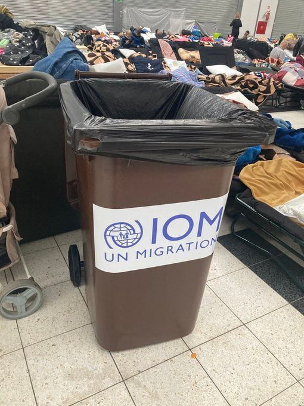
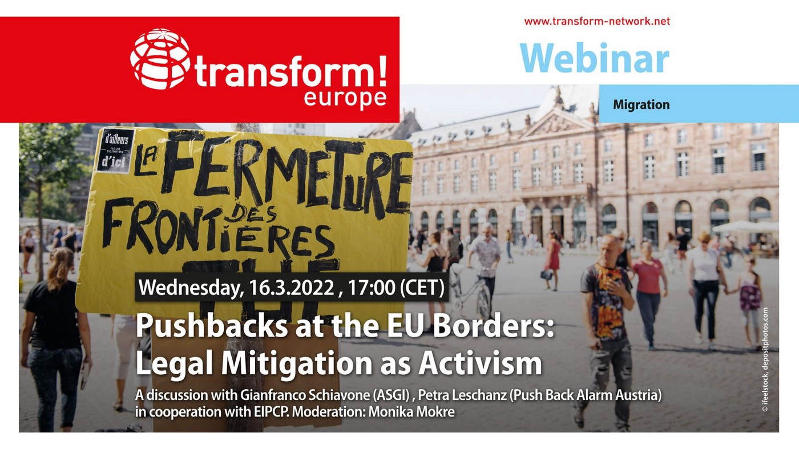
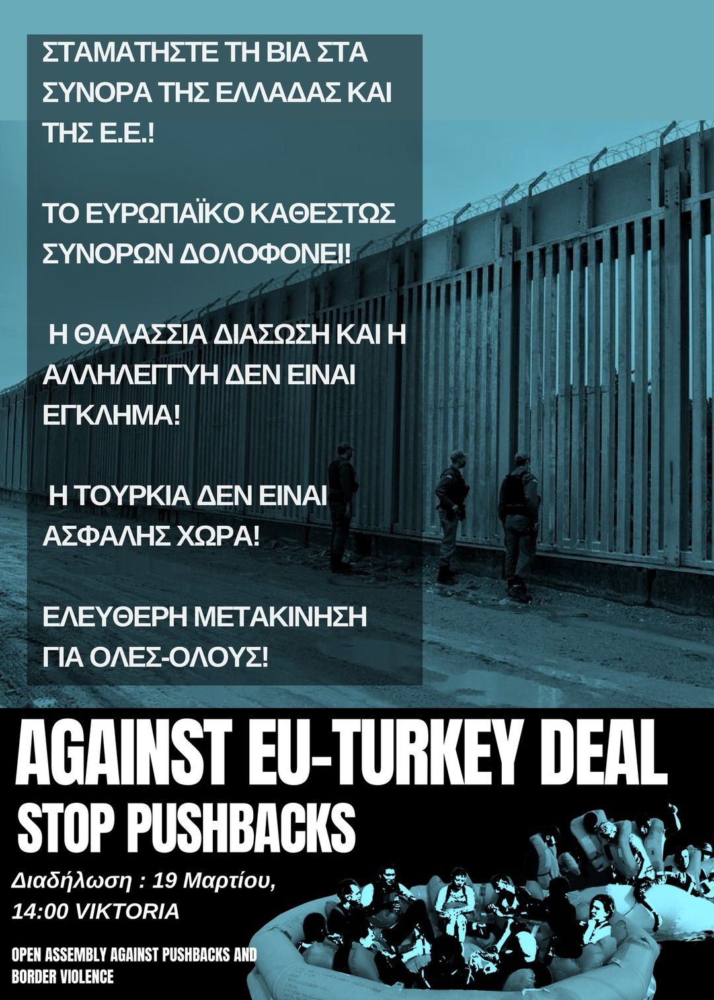

### AYS News Digest 14/3/22: Discrimination of the stateless people fleeing Ukraine indicative of the EU States treatment
#### Inhuman treatment face deportees from Algeria to Niger / Hunger catastrophe looms for 161,000 Yemenis as global food supply deteriorates / situation at the Polish\-Belarusian border is still alarming / Mixed Migration weekly report / this week’s recommended events, reads and more

Here just to draw your attention to other more important things in the Digest \(Photo via Jeff Crisp\)

Stateless people fleeing the crisis in Ukraine may face additional barriers and differential treatment depending on their residence, nationality, and/or documentation status, the latest findings of the EU Network on Statelessness say\. It is imperative that EU States ensure this does not stop stateless people and those at risk of statelessness from accessing the same level of protection as currently offered to Ukrainian nationals\.

> How can the EU and member states ensure these people can access protection in line with international law? 

Most people affected by statelessness residing in Ukraine will not be able to prove their residence or nationality status due to the nature of statelessness\. These are largely: Roma and other minoritized groups; former citizens of the USSR who were unable to demonstrate permanent residence in Ukraine in 1991 and could therefore not acquire Ukrainian nationality; people on the move \(formally asylum\-seekers, refugees, and migrants\) and those people living in non\-government controlled areas and Crimea\.

> Hungary, Slovakia, Poland, Romania, and Moldova have stated that they are currently admitting everyone fleeing the war in Ukraine, including stateless people, those at risk of statelessness and/or undocumented people\. However, inconsistent practices and racial profiling have been reported at different border crossings \(e\.g\., in Hungary and Poland\) with non\-Ukrainians facing barriers to accessing the territory, or additional ‘secondary screening’ procedures, including in detention\-like conditions in Poland\. 

> EU Member States are not currently required under EU law to extend temporary protection to most stateless people and those at risk of statelessness who are/were living in Ukraine\. 

#### What is statelessness?

**‘Stateless person’** is defined in international law as ‘a person not considered as a national by any State under the operation of its law’\. Stateless people may have always lived in the same country, or they may also be migrants or refugees\. Being stateless is not the same as being undocumented\.

**‘At risk of statelessness’** does not have a legal definition but is a term used to refer to people who may not be stateless at present but may become stateless due to circumstances that can cause statelessness\. Sometimes it is unclear whether a person is stateless, and statelessness may become evident over time\.

**‘Undocumented’** people lack any documentary proof of their residence or civil status in a country\. Being undocumented is not the same as being stateless, but if a person cannot acquire or has never had any personal documents this may be an indicator that they are stateless or at risk of statelessness\.

> There are over 12 million stateless people globally, including over half a million in Europe\. 

Read the entire report [here](https://www.statelessness.eu/sites/default/files/2022-03/ENS%20Briefing%20-%20Stateless%20people%20displaced%20from%20Ukraine%20-%20March%202022_1.pdf) \.
#### ALGERIA
### Inhuman treatment face deportees from Algeria to Niger

Violence, starvation and adverse living conditions report deportees from Algeria to the camp of Assamaka in Niger\. On February 7, **1269 people were deported and faced with inhuman treatment and brutality** of Algerian authorities\. Alarmephone Sahara [documents](https://twitter.com/AlarmephoneS/status/1502993395106697228?fbclid=IwAR1WPOK1o1gnaX2ASjyypR5iG0Oa4tAmXawsckz7jtSfblSDh1rULlo8tSM) with videos the stories from two Malians who were deported from Algeria to Assamaka\.
#### SEARCH AND RESCUE AT SEA

24 people missing in the Mediterranean after attempting to reach Europe’s borders

■■■■■■■■■■■■■■ 
> **[Alarm Phone](https://twitter.com/alarm_phone) @ Twitter Says:** 

> > 🔴 Dove sono?

Oggi pomeriggio, i parenti ci hanno informate di una barca con ~24 persone a bordo, partita circa 2 giorni fa da #Sfax, in Tunisia. Abbiamo informato le autorità competenti ma nessuna ci da informazioni. Il meteo sta peggiorando, siamo preoccupate per le loro vite. 

> **Tweeted at [2022-03-13 20:49:37](https://twitter.com/alarm_phone/status/1503111059548393473).** 

■■■■■■■■■■■■■■ 

Alarm Phone reports that 24 people are missing in the Mediterranean Sea since they left the coast of Sfax in Tunisia on Friday, March 11\. All relevant authorities have been alerted, however, there is no information provided\.

> At the same time their safety might be at stake as the weather is getting worse, says Alarm Phone\. 

19 people missing after a boat carrying a group of 23 people capsized on Saturday in the Mediterranean Sea set off the coast of **Libya** , the media have reported\. Three people were rescued by the Libyan coast guard, while one was retrieved\. The group of people had set off from the eastern city of Tobruk earlier in the day\.

> The authorities presume them dead\. 

101 people were rescued near the island of Paros in Greece on March 13 by the Hellenic Coast Guard\. The sailboat had set off from the west of Turkey and headed towards Italy\. The survivors are mostly from Afghanistan, [reports](https://www.infomigrants.net/fr/post/39159/grece--100-migrants-secourus-dans-un-bateau-en-difficultes-pres-de-paros) InfoMigrants\. While Alarm Phone has [raised concerns](https://twitter.com/alarm_phone/status/1502932542395138057) about the fact that they were transferred to a military vessel a few meters offshore instead of towing their boat to land and the Hellenic Coast Guard’s [refusal to share more information](https://www.ekathimerini.com/news/1179672/coast-guard-rescues-100-off-paros/?fbclid=IwAR3qsw1_2YtGosp7U_TAakkqu5y-nnhlAf7jnwZKwh2_QwKz8VOo2dHNJzA) \.
#### GREECE
### The double standards

More than 5,000 Ukrainian refugees [have fled to Greece since Russia invaded the country](https://greekreporter.com/2022/03/07/ukrainian-refugees-greece-war-russia/) in late February\. Among them, there are more than 1,500 minors\. A large number of the refugees are naturally women and children since men aged 18 to 60 are not permitted to leave Ukraine, which seems to be one of the ‘legitimacy’ arguments for the Greeks to set off the principle of the double standard, as many have since noted:

■■■■■■■■■■■■■■ 
> **[Lena K.](https://twitter.com/lk2015r) @ Twitter Says:** 

> > I'm struggling to remember any instances when the Church of Greece took such a broad-ranging initiative for refugees. 
But I remember the archbishops of Thrace blessing the Greek state's violent efforts to keep people on the move out at the Evros border in March 2020. 

> **Tweeted at [2022-03-14 12:10:34](https://twitter.com/lk2015r/status/1503342822069608454).** 

■■■■■■■■■■■■■■ 

At the same time, another group of Syrian refugees have been trapped on an island in Evros since Saturday night, without food and water\.

20 people, including seven minors and at least two pregnant women \(one of whom is bleeding and in serious condition\) are stuck with no access to help, food or water, and a four\-year\-old child had [reportedly](https://l.facebook.com/l.php?u=https%3A%2F%2Ftwitter.com%2FVassilisTsarnas%2Fstatus%2F1503506138435887107%3Ffbclid%3DIwAR3lf9-URRdXJJNq8du-V57uJ9FzhiQnW1czuWaiAZEKyCIFLw_j3RSdpFU&h=AT2fRQzQQxqQ12U8nyp-LPBjAvm2jrloaaoVwvBT4Fy0hgRKzS3QePt4RSiAbZjhZwPYLu5LwvAU5D1-xpD5GHBDD6FwvpTjEfXFmvi_udzzPVijJ3L_SZsou62uUtsR4ZJrrTaCaAtAv9C4WfxQR7fkaxnUxw&__tn__=R]-R&c[0]=AT28wiNP0WXnMDX6hxpVUyGMnYjuy17AxRUfprmgjabXKui8LWXufJRhV4I3iTUNFV3w04VMVW71r4Lm8zLvlak5xwIn6cjVT4ZL1juXQw4WILSd9q_I3m31h_rIvssnJcAEwPHOj0KwgMHu9YR0g4tKMG5ZBfjx2OYfKWOv4aTkk3KMq54wr_ENfJaRvSVtsC3BPlUYNxxq) fallen into the waters of Evros and is missing\.
#### ITALY
### Bus accident in Italy kills a woman fleeing war in Ukraine

A bus transporting around 50 Ukrainian people overturned on a major highway in the north of Italy on Sunday morning, killing one passenger and injuring five people\. The rest of those aboard were safely evacuated\. The cause of the accident is [reportedly](https://apnews.com/article/russia-ukraine-italy-europe-migration-accidents-b7a2f550d2ceab545c9c1da4bf523158?fbclid=IwAR3aSGP206RzB8mRffUInbqvEBN3U9EUTHwXBqHpZRWBMdw3gF3vm6WDWB8) still under investigation by the authorities\.
#### FRANCE
### Dunkirk: Displaced people experience unbearable living conditions

Unbearable conditions are experienced by the people living in the camp in Dunkirk north of France, reports Mobile Refugee Support\. After the storm Eunice had swept everything, from trees to tents and shelters, French police took over by conducting a huge eviction and destroying hundreds of tents and leaving people with nothing for the night ahead\. What is more, associations providing support and emergency vehicles were restricted from accessing the camp\. People affected by the eviction were re\-equipped with essential items, shelter and bedding by the MRS team\.
### Man missing in the waters of Bidasoa river

A young man still remains [missing](https://www.eldiario.es/euskadi/buscan-migrante-desaparecido-aguas-bidasoa-frontera-francia-irun_1_8825676.html?fbclid=IwAR0FNzVoWkxA3F4iokoI7_F1ixnBL-D4bnH5gPiWyyyyfquUwOfp4qSp-B8) since the operation of searching started on March 12, in the waters of the Bidasoa river — the natural border between Irún and Hendaye — between Spain and France\. According to eldiario\.es, initially, there were three people crossing the river while trying to avoid police checkpoints\. Two of them have already been located on the French shore while the third one is presumed to be dead\.
#### POLAND

> The haphazard but generous relief response appears to be the result of a relatively hands\-off approach by Poland’s authorities, who in recent years have had much more experience in turning away refugees than welcoming them\. The burden of organizing the logistics of support for refugees has instead fallen on local municipalities — sleepy eastern Polish towns that have suddenly found themselves near the epicenter of what threatens to be the worst European refugee crisis since World War II — as well as NGOs and thousands of independent volunteers\. 

The situation at the Polish\-Belarusian border is still alarming\. Men, women and children are being denied assistance in Poland and pushed\-back to Belarus\. Belarusian border forces are getting more and more violent, forcing people to either enter Poland or war\-torn Ukraine, it is [reported](https://l.facebook.com/l.php?u=https%3A%2F%2Ftwitter.com%2FMarGorczynska%2Fstatus%2F1503406633048805381%3Ffbclid%3DIwAR0cyZA8QuD5R7R1WgqVBoY0L2qXjfD2tvbbC_b-Gbsz35g4bPTWnyxzaZw&h=AT2Re56z0LArzJJ5I9CdU4j_YRJuLSvtUFfqolaIXbtecjjhfoZXaCgn30ZvQfJ6sFtW6h9U6XUa5yr5lQ1_52V9L85H3Rclwi1-hsqh2H_QVQA-3hLI2wRglEvixUOLvnZqwu2_cGAOIoF1LCtW8h-c5g86wA&__tn__=R]-R&c[0]=AT1ZT2WftJ1NIFdQNYzBHUE7uYu1B_qN-st3oxe-0_ntK83noWX-qGkIAxyicRJjGt_nHEwXPQUKtSi_3YsitVuqJdJLLv42JambRGxUbIAZ3J5TPUYIBpajazG3ImiiNWBJ7l8zfHAhkT-D_Yz_Ka7b6Q8dvbzPZSR4z-hUbAbZxe3R0spnFUQutweaOhzsTIig7Xuyc8nz) \.

Dozens of asylum seekers stuck for months in a makeshift dormitory in Bruzgi, a village in [Belarus](https://www.theguardian.com/world/belarus) less than a mile from the Polish border, were ordered by a group of Belarusian soldiers on 5 March to leave the building at gunpoint and given two options: crossing the border into Poland, where guards have beaten them back, or entering Ukraine, one of them said, as documented by Lorenzo Tondo in his latest [report](https://www.theguardian.com/global-development/2022/mar/14/fears-grow-of-new-crisis-as-refugees-in-belarus-driven-into-ukraine?fbclid=IwAR2zPEdc91UDgWviQcjHES9h62Hfk6o_BMzPRtGQUoHomfEJEc92xoOx6QE) \.
#### UKRAINE

An estimated 100,000 children living in orphanages and institutions in Ukraine are at risk of being left behind or being permanently separated from family members as the conflict continues, Save the Children [said](https://reliefweb.int/report/ukraine/ukraine-children-without-caregivers-risk-being-forgotten?fbclid=IwAR0nuktp47Cwa1VUpZQn20FOOaflejirUAkHEDKLmI8bms3HC83uN8-G_94) \. They are concerned that the children in these institutions won’t be able to access appropriate care as the violence in Ukraine escalates and food, heating and access to education and medical care becoming more difficult\.

UNICEF, UNFPA, and WHO [called](https://l.facebook.com/l.php?u=https%3A%2F%2Freliefweb.int%2Freport%2Fukraine%2Fstop-attacks-health-care-ukraine%3Ffbclid%3DIwAR25SZCdtEtPqLjid9Ldd9--SQBmd1WRSHLNtk9WjFYa9LOkY35Trvf4Hak&h=AT0UDdPxHCio8TfFjLunSH_756KW_BjJtXbYwe0DHr2MhlGy0KtaislGo96TIEvcbNKQPN4chtLTx4eqqoPZ0aQR4aB9jk7ar2s-2HhKFv2HQH5Mpx9mwQ6hsdQ8IKCtpR2lRvIKUVe5pHKEivUP272mr15CsQ&__tn__=R]-R&c[0]=AT2kod5GvzesHA2E-mcoQI17LWuz5UkdAiEp2g20rEMxpSc844snRmwawWrnzmcpqZ-vso1pvP7JkT0ELpXiYa92kI76MgFa72ejQQKVheAOvKSxOF2oiJPVMh7wu9IeTEWO5eRI22N3dCxjD7Vz5yvyYx08OAT5P-ya3PPy0dNR_F1X3ztO5uPpGiA-FJ5Ec20h3_v9Bg0DgqHIiUQ) for an immediate cessation of all attacks on health care in Ukraine that are killing and causing serious injuries to patients and health workers, destroying vital health infrastructure and forcing thousands to forgo accessing health services despite catastrophic needs\.

> “To attack the most vulnerable — babies, children, pregnant women, and those already suffering from illness and disease, and health workers risking their own lives to save lives — is an act of unconscionable cruelty\.” 

Local Ukrainian authorities [said](https://l.facebook.com/l.php?u=https%3A%2F%2Ftwitter.com%2FKyivIndependent%2Fstatus%2F1503055599281573898%3Ffbclid%3DIwAR3lf9-URRdXJJNq8du-V57uJ9FzhiQnW1czuWaiAZEKyCIFLw_j3RSdpFU&h=AT17viph9eLOp5qQggoohVZp6cKurlokCXs7AIqVjB5utnqebKBvJl5fYkDTooABEAEPW8soniHkdIUqp707GmEB1cyySo6rgq-7sGFxeTYWixvk5Ed627xdgXIy73DAyk6ayqc7oQ5u9DlYFs5vEClksLTo5A&__tn__=R]-R&c[0]=AT2kod5GvzesHA2E-mcoQI17LWuz5UkdAiEp2g20rEMxpSc844snRmwawWrnzmcpqZ-vso1pvP7JkT0ELpXiYa92kI76MgFa72ejQQKVheAOvKSxOF2oiJPVMh7wu9IeTEWO5eRI22N3dCxjD7Vz5yvyYx08OAT5P-ya3PPy0dNR_F1X3ztO5uPpGiA-FJ5Ec20h3_v9Bg0DgqHIiUQ) that 35 people were killed in the March 13 attack, and 134 were injured\. They didn’t disclose the nationality of the victims\. More and more people are fleeing the country\.

The **Czech Republic** has applied for 25 modular humanitarian bases that could accommodate up to 50,000 people via the EU Civil Protection Mechanism\. Those bases will be used once other emergency capacities run out\.

> We are slowly getting to a state where we can only provide emergency shelter for refugees, i\.e\. to ensure emergency survival in emergency conditions\. People will have to be concentrated in gyms, halls and so on, and their accommodation will not be comfortable, _a spokeswoman of the Czech firefighters’ general directorate [said](https://www.euractiv.com/section/politics/short_news/czech-capacities-to-host-ukrainian-refugees-have-run-out/?fbclid=IwAR3mwWXLi_HBTRO7t5vH06tYduirQE6x4dhD4tsdABa-jtfA2P4k1OgaCos) \._ 

■■■■■■■■■■■■■■ 
> **[Petra Molnar](https://twitter.com/_PMolnar) @ Twitter Says:** 

> > “Migration is a topic that is dividing people and uniting people” - Helena, a medical volunteer. 

From the Ukrainian border in 🇭🇺 🇸🇰 🇵🇱 with @[f_grillmeier](https://twitter.com/f_grillmeier) and @[katymfallon](https://twitter.com/katymfallon) 🧵 https://t.co/KOE4wGVRBo 

> **Tweeted at [2022-03-12 10:59:31](https://twitter.com/_pmolnar/status/1502600169153609731).** 

■■■■■■■■■■■■■■ 

#### YEMEN
### Hunger catastrophe looms for 161,000 Yemenis as global food supply deteriorates

> Thousands of children in Yemen are on the verge of losing access to life\-saving healthcare as the country faces its worst fuel crisis since the start of the conflict, Save the Children said\. 

Health facilities across the country are being forced to shut off ventilators and other life\-saving equipment because of a sharp drop in fuel imports\. Many hospitals have warned they risk shutting down completely if the delivery of fuel continues to be delayed and restricted\.

> It is critical to remember that the analysis carried out for 2022 preceded the current humanitarian situation in Ukraine\. 

Figures from the newly released Integrated Food Security Phase Classification \(IPC\) report confirm the serious concerns felt and foreseen by humanitarian organizations such as CARE in Yemen for 2022\. The level of food insecurity and the risk of famine conditions for a higher number of Yemenis are now vivid, inevitable and undeniable\. According to the report, during the period January to May 2022, 17\.4 million Yemenis will experience high levels of food insecurity \(IPC phases 3 to 5, classified from Crisis to Catastrophe\[1\] \) — amounting to an over 7 per cent increase compared to the previous year\. This is expected to rise to 19 million over the second half of the year\.

Reliefweb report [here](https://l.facebook.com/l.php?u=https%3A%2F%2Freliefweb.int%2Freport%2Fyemen%2Fyemen-fuel-crisis-pushes-sickest-children-brink%3Ffbclid%3DIwAR1gX0RiGfw94GcouiaWyUrzkRvjhLuCPqOGNtPPSfBdTXFkroNhAajxQaM&h=AT12okRuxKdzEGRPrdPBl4ktEBHh0AHQzV8pVwtCsPrG4OI8S53yeut-eoIwFIvMKS9nSpI3ExD0WA7gbca-8rBmIVpotE_0tA-JH8rMNVbJHzkvBvw0DlGKBTDXVB2eb3hL3WOj1uDvw5ubnCXb3gxjgKtpRg&__tn__=R]-R&c[0]=AT0BrYJBKxiD1xMdJl7WBtdVoxvCZiNU7j-I3jWA6XkVWj6REEJc35-59r3_zn32jd1oYmyMDGmdCOS5qvyYxsXASay-bBSb2vxBRB1g24xaL00nOr4PJyicn8JpgmGpLSeSagfm6g7C6_hlBgrc1oT7wMlEX0TvJKU1KJSji_MgYM6_w5chn0SS5QdMCriDGU_IV0oiYiZ_)
#### GENERAL
### Webinar: Legal Mitigation as Activism

March 16, 17:00h CET

This is the first webinar of the webinar series “Resisting the normalization of Push\-Backs”\. We will be discussing different cases of legal mitigation against documented Push\-Back cases around Europe and explore the strategic importance of documentation and legal mitigation for stopping these inhumane practices\. A discussion with Petra Leschatz \(Push\-Back Alarm Austria\) , Gianfranco Schiavone \(ASGI\)
moderation: Monika Mokre \(EIPCP\)

Register here:
[https://us02web\.zoom\.us/\. \. \./reg\. \. \./WN\_Ya\_m7sE\-TeikxvxJvI85\-A](https://us02web.zoom.us/webinar/register/WN_Ya_m7sE-TeikxvxJvI85-A?fbclid=IwAR2QGg6yAoatI3HBdFlPhzX3dubgCIETAMcgkFSCpzqb2PFoHL5-un39b70)
### **Open Assembly against Pushbacks and Border Violence**

> Open assembly against pushbacks and border violence, organised with a microphone on an open space \(Protomagias square at Pedion tou Areos\) \. At the same time with the war in Ukraine and the development of Europe’s border regime against the migrants, and also ahead of the antiracist demonstration of 19th March, we meet to discuss the war against migrants on the Greece\-Turkey borders, the deal between them and the EU on migration, and our response on all that\. 

> We also call at the antiracist demonstration on Saturday March 19th, on Victoria square at 2pm\. 

> Stop Pushbacks and Border Violence\!
 

> Against the EU\-Turkey Deal\! 

[Event link](https://www.facebook.com/events/377993927662463)
#### WORTH READING
- Putin’s Endgame Is Not a Mystery\. It’s Regime Survival\. “Ukraine is a speed\-chess version of the wars in Bosnia, Chechnya, and Syria, with the pieces on the board including nuclear weapons\.”

- New ASILE paper on The EU grants temporary protection for people fleeing war in Ukraine:

- Hugarian welcome of the Ukranian refugees: As of Monday morning, [more than 250,000](https://www.police.hu/hu/hirek-es-informaciok/hatarinfo/magyar-ukran-hatarszakasz-forgalma?daily_refugee_created%5Bmin%5D=2022-03-01&daily_refugee_created%5Bmax%5D=2022-04-01&daily_refugee_created%5Bmin_year%5D=2022&daily_refugee_created%5Bmin_month%5D=03) Ukrainians have made their way to Hungary — often traveling through the country to more refugee\-friendly nations where they hope to find somewhere to live and work\.

- Mixed Migration Update:

- For the capitalists’ minds:

Accepting refugees raises income per capita and wages in the long term, finds new research from ESMT Berlin:

- Interesting read on ‘integration’:

- After the U\.S\. withdrawal and with their country’s economy collapsing, countless Afghans are trying to escape\. Who does the West consider worthy of saving?

[](https://l.facebook.com/l.php?u=https%3A%2F%2Fwww.nytimes.com%2F2022%2F02%2F14%2Fopinion%2Frefugees-migrants-afghanistan.html%3Ffbclid%3DIwAR2IILIbfgRuktVIKxgFV2EnF0eqwMhzGKjBe3e6FPOMqA9sBl1R9tZ3WkM&h=AT2xBiUWvj_634yBvGNDJ9dkmqYcukSBQN1jzx43DcZj4Uad1lHusFFLHIirtB8Y_ZUxtMSKTtrWRdyzmCrSL41xAJOk4pHaB9vL6IpCxOhUWlTe46IQQ7ZxU4nkXzyp6zXi4Ou2Q8xqP6nMo95UAAci1vkPKA&__tn__=R]-R&c[0]=AT1LrlDelLd-Pz2AZWxu2KxpNk2d1dCg40L5CZ8nFrqTeWjtGV-YhJIAi_zzHcsTFp_Bq2ZfhbCRRW_ARsQEr7vR_ytRvWTNbnDCMObyEjSwqeJxIqB9CkS-oPz2tBc0BAVG2gnTOA8784pBFieP5HW-_twvB4gSuMu9o516lHKagcbFiNKj5GSrGRwWiBDfEsinxsSjExw4)

- Marina Sestasvili\-Piotrowska and her family have transformed their guest house near Poland’s border with Ukraine into a refugee shelter, but just seven hours away on the Belarus border Dorota could face time in prison for the exact same act:

**Find daily updates and special reports on our [Medium page](https://medium.com/are-you-syrious) \.**

**If you wish to contribute, either by writing a report or a story, or by joining the info gathering team, please let us know\.**

**We strive to echo correct news from the ground through collaboration and fairness\. Every effort has been made to credit organisations and individuals with regard to the supply of information, video, and photo material \(in cases where the source wanted to be accredited\) \. Please notify us regarding corrections\.**

**If there’s anything you want to share or comment, contact us through Facebook, Twitter or write to: areyousyrious@gmail\.com**

_Converted [Medium Post](https://medium.com/are-you-syrious/ays-news-digest-14-3-22-discrimination-of-the-stateless-people-fleeing-ukraine-indicative-of-the-afca05582e69) by [ZMediumToMarkdown](https://github.com/ZhgChgLi/ZMediumToMarkdown)._
