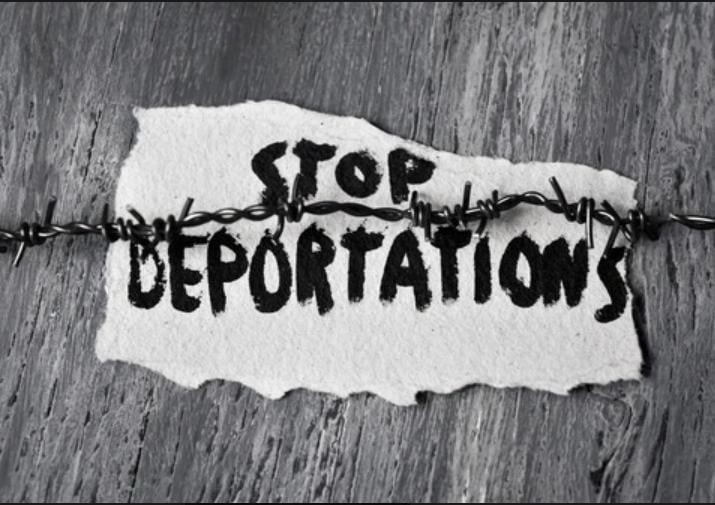
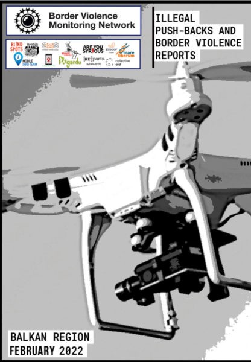

### AYS News Digest 23/3/22: Mother and 13\-year\-old daughter deported after 10 years in Germany
#### Bodies of people who have died in shipwrecks found along Tunisian coast / BVMN Monthly Report / EU leaders have tacitly admitted that EU migration policies, at a purely mechanical level, are unfit for purpose / and more

#### FEATURE

All of Europe seems to be on high alert regarding the situation in Ukraine and the needs of the \(Ukrainian\) people fleeing the country\. And while authorities and civil society throughout Europe and Germany are jointly organising for reception of hundreds of thousands of people and a new culture of welcome is being created, meanwhile the detention and the deportation machinery continues to work relentlessly\.

A particularly blatant case occurred last Wednesday when an Iranian family from Büdingen, who had lived in Germany since 2012, was separated by deportation\.

> The mother and the 13\-year\-old daughter were surprisingly deported to Iran, the father was left behind because there was no more room for him on the plane\. 

He is now likely to leave voluntarily in the coming weeks in order to be able to be with his family\.

He knows that if he manages to stay in Germany despite his deportation order and tries to bring his wife and daughter back to Germany, this could take years\. Even if he managed to get legal status, they are banned from entering Germany for a period of around two years because of a rule that applies to people who have been forcibly removed\.

“We demand that the best interests of the child be taken into account as a matter of priority and for the authorities to admit the error, mother and daughter be granted re\-entry to Germany, and the family granted the right of residence”, [Hessischer Flüchtlingsrat](https://fr-hessen.de/) press [statement](https://fr-hessen.de/wp-content/uploads/2022/03/2022-03-21_Familientrennung.pdf?fbclid=IwAR02CLXlH0-qKhWhGoFiAZhQI8HUjS2cWu1LLm8-0gLGwbyASLIz7ELhNSM) says\.

A demand for an **immediate moratorium on deportation** in Hesse is sought by the engaged groups\.
#### TUNISIA
### **Dead bodies appeared at the north\-eastern coast**

The death of 25 people was confirmed by the IOM when bodies started to appear already last Saturday off the north\-eastern coast of Tunisia, revealing that a shipwreck had happened on the Mediterranean, [reported](https://ilmanifesto.it/tunisia-famiglia-distrutta-nel-naufragio/?fbclid=IwAR0TJC_jbNqPkUVguYWlTquyZv8msUiUwe2iyJEquvIPf6FOcuzcGLiqZV4) the Italian news media Il Manifesto\.

> Among the victims were a mother and two children who were trying to reunite with the father who has been working in Italy for several years\. 

The boat left the coastal Tunisian city of Mahdia on 4 March with 59 people from Tunisia and Syria on board, according to a prosecutor in Nabeul, a city a few kilometres from Hammamet on the southern part of the Cap Bon peninsula\.

> “They tried to cross the sea because family reunification applications had always failed\. Once the man’s income was insufficient, another one was missing some square meters to the rented house,” says Karbai \(Tunisian MP, note\) bitterly\. And he adds: “To die like this, because of bureaucratic quibbles, is wrong\. It is not possible that the law forces people to risk their lives in this way\. There are Italian and Tunisian responsibilities\.”

— says Majdi Karbai, a Tunisian parliamentarian of the Attayar Social Democratic Party\.
#### GREECE
### **Two people in urgent need of support close to the town of Didimoticho, near the Evros border**

A new alert from Alarm Phone arrived regarding two people in an urgent situation close to the town of Didymoteicho, the nearest town to the Turkish\-Greek border\. In need of applying for asylum in Greece and after traveling for three days, they are now reportedly injured and without water\. Alarm Phone reports that local authorities and UNHCR have been informed\.

■■■■■■■■■■■■■■ 
> **[Alarm Phone](https://twitter.com/alarm_phone) @ Twitter Says:** 

> > 🆘! 2 people in urgent need of support close to Didymoteicho, #Greece at the Turkish-Greek border. They have been traveling for 3 days, ran out of drinking water & are injured. Local police & @refugees are informed. They urgently need help and want to apply for asylum in Greece! https://t.co/8FtGCBmXfu 

> **Tweeted at [2022-03-23 11:21:38](https://twitter.com/alarm_phone/status/1506591999943655424).** 

■■■■■■■■■■■■■■ 

### **Misinformation by the Greek minister of Migration and Asylum**

Allegations with no basis in international or European law about who is a real refugee were made on a Greek television program by the Minister of Migration and Asylum Notis Mitarakis, [reported](https://wearesolomon.com/mag/logodosia/polemos-stin-oukrania-oi-pragmatikoi-prosfyges-kai-ta-psemata-tis-ellinikis-kivernisis/?lang=el&fbclid=IwAR2FponC01becoRv_znkmVwLswgZ3lLbqb8HOhJot2koY5R2TVx_9rXnayo) Solomon news media\.

The minister once again stressed that the “refugees leaving Ukraine are war refugees, they are the real refugees” and that the Greek government is ready to provide technical and humanitarian assistance and support the Ukrainian people\.

What is more, he expressed that “Ukraine borders the EU, the country has been invaded illegally and these people are coming straight from a country in danger onto EU territory\.”

Immigration law experts—Salvatore Lombardo, a lecturer at the Sciences Po University of Paris, and Anna\-Jasmine Vallianatou, an Athens lawyer and researcher at the British Institute of International Relations—and UNHCR refute all information leading to false conclusions\. At the same time, allegations of illegal repatriation of asylum seekers continue\.
#### THE BALKAN ROUTE

In February, the Border Violence Monitoring Network \(BVMN\) shared 32 testimonies of pushbacks impacting 364 people\-on\-the\-move across the Balkans\. This report brings together first\-hand testimony from a range of countries in the region to look at the way European Union states and other actors are affecting systemic violence towards people crossing borders\.

This month’s BVMN report covers:
- trends in violent pushbacks from North Macedonia, Bulgaria and in BiH
- 19 bodies found in Evros region
- a court victory in Austria, where a verdict condemned the pushback of an unaccompanied minor
- police raids, forced relocations, and raids on attacks on solidarity structures in Serbia
- MEPs visiting the Western Balkans

Read the full [report](https://www.borderviolence.eu/wp-content/uploads/BVMN-Monthly-Report-February-2022.pdf-1.pdf) for more information on these topics, as well as further updates from the region including: the latest developments in Samos and Trieste, a campaign against pushbacks and border violence in Greece, and an update on the ongoing war in Ukraine, highlighting the systemic racism against people of color fleeing the conflict\.
#### FRANCE
### **Young people left on the streets of France**

40 young people are to be evicted from an emergency accommodation centre in Essone, according to Utopia 56\. The eviction was already planned to happen two weeks ago but the process was suspended following the organization’s denunciation\.

■■■■■■■■■■■■■■ 
> **[Utopia 56](https://twitter.com/Utopia_56) @ Twitter Says:** 

> > Il y a deux semaines, l’expulsion par @[Prefet91](https://twitter.com/Prefet91) d’une quarantaine de jeunes d’un centre d’hébergement d’urgence avait pu être suspendue suite à notre dénonciation. Le temps de repos aura été bref : leur expulsion a été reprogrammée à demain. 

> **Tweeted at [2022-03-23 09:04:35](https://twitter.com/utopia_56/status/1506557511087923202).** 

■■■■■■■■■■■■■■ 

#### BELARUS
### People still stranded in Bruzgi

People still continue living in limbo inside a customs warehouse camp in the village of Bruzgi — the Belarusian cross border with Europe — while Belarus officially states that there is no one left there\. Video footage from 12 March, released by Grupa Granica, the Polish network of human rights organizations, shows the existing situation of people living in makeshift dormitories made from planks and cardboard\.

■■■■■■■■■■■■■■ 
> **[Grupa Granica](https://twitter.com/GrupaGranica) @ Twitter Says:** 

> > 1/1 #Belarus informuje oficjalnie, że w #Bruzgi gdzie od listopada przebywały w koszmarnych warunkach osoby uchodźcze, nie ma już nikogo. Kłamstwem jest jednak, ze wróciły do domów- jakich domów🤷🏻‍♀️- lub czeka na lot deportacyjny. Nagranie z #Bruzgi z 12.03. https://t.co/42wpn6NV8p 

> **Tweeted at [2022-03-22 10:23:40](https://twitter.com/grupagranica/status/1506215023420624897).** 

■■■■■■■■■■■■■■ 

Read also: [Emergency conditions ignored at Poland\-Belarus Border](ays-news-digest-21-03-2022-emergency-conditions-ignored-at-poland-belarus-border-c152c6a8c55b)

A similar situation in **Lithuania** , where more than 100 people have been prevented from entering the country from Belarus during the past week, reports journalist Dominik Wilczewski on Twitter\.

Since the beginning of this year, the Lithuanian border guard \(VSAT\) has deterred 786 people and 8106 last year\.

■■■■■■■■■■■■■■ 
> **[Dominik Wilczewski](https://twitter.com/DeWilcz) @ Twitter Says:** 

> > Last Tuesday, Lithuanian border guards prevented 31 migrants from entering Lithuania from the territory of Belarus. For the third day in a row, the number of deterred migrants has exceeded 30. No data about migrants allowed on humanitarian basis was provided. 

> **Tweeted at [2022-03-23 08:43:29](https://twitter.com/dewilcz/status/1506552198012014603).** 

■■■■■■■■■■■■■■ 

#### UKRAINE
### On Zhuravychi detention

The EU is responsible for these refugees because of its pivotal role in setting up the detention centre in which they are being held\.

■■■■■■■■■■■■■■ 
> **[Daniel Howden](https://twitter.com/daniel_howden) @ Twitter Says:** 

> > Our ongoing Ukraine thread finds a group of undocumented migrants being held in an EU-built detention facility inside war-torn Ukraine. In the possible path of the offensive 

> **Tweeted at [2022-03-21 22:09:08](https://twitter.com/daniel_howden/status/1506030172008505355).** 

■■■■■■■■■■■■■■ 

Trans women fleeing Ukraine are reportedly being denied passage to safer countries, despite their legal status as women and the danger posed by Russia’s transphobic policies, Guardian [reports](https://l.facebook.com/l.php?u=https%3A%2F%2Fwww.theguardian.com%2Fglobal-development%2F2022%2Fmar%2F22%2Fi-will-not-be-held-prisoner-the-trans-women-turned-back-at-ukraines-borders%3Ffbclid%3DIwAR33zYAF_Gw9CCZMSwAu8eiiNtWo7rogdxo424tW6eySW1X3aNMH0wNFfhM&h=AT0qvphT8b3mAvyNCD27mUeKUgMPKzB7auDOp_YnSWtA6ouNGH8uJIiZQ5BOPxr_bGLGUrc54wj-cR9WPJr1okRCsvaGnN6X5g9CoHkDJga5aPFY0eCZoJQBwmMilCZWxvFWIoeCZxE_tUmhcS38Y1NUH8ZSBg&__tn__=R]-R&c[0]=AT0MhYprN5sL1Ipmriwz-MS2K1m9tUd5TbxVfnHGv_KFm8ij_17OwHPH9psthokXprMbMjsL9w_dE2RKPRfycQ1kF9eTkiX3QLNRaY3eXqYfsdd4iyD2jhWrX5mrItfFcFMENjFRcXRnt9B91_JX4FNKoVR_Odi8Mf0nBhtjn9aAl3Iy5QPicvhcPBr507UWEuKduESnPNOo) \.
#### UK

■■■■■■■■■■■■■■ 
> **[Freedom from Torture🧡](https://twitter.com/FreefromTorture) @ Twitter Says:** 

> > 🚨BREAKING: The House of Commons has just voted clause 11 of the Nationality and Borders Bill, one of the cruellest parts of this #AntiRefugeeBill, through to the final stages, by 318-220.

The real fight starts now. Here's what happens next.

THREAD 🧵

1/4 

> **Tweeted at [2022-03-22 17:09:07](https://twitter.com/freefromtorture/status/1506317058585341962).** 

■■■■■■■■■■■■■■ 

#### WORTH READING
- El Hiblu three have written down their testimony about their trip to Malta for the first time since being accused of terrorism three years ago:

[](https://l.facebook.com/l.php?u=https%3A%2F%2Ftimesofmalta.com%2Farticles%2Fview%2Fthree-youths-give-testimony-three-years-after-being-accused-of.942816%3Ffbclid%3DIwAR0xac8iooto-Oh5918PjLHblOaL_tPPC99TRDMnevMzlzVSYH1K3Na8cP8%23.YjsfN0WejjM.twitter&h=AT39ErMXGigEsN-5U6yITJFHt4smz_q4dz9ny14p5MmEX1QQSIUtGJUQG9KIX_wef5CrWMcynq3rCm1Pgw1auY57y7RmWH3Cu8EiCWWIUjr8yOqoUwROHdr9XtdNIW-wVG6BZeifpByappnOPwuzvRMjKmMzcQ&__tn__=R]-R&c[0]=AT3eSarvGEFdvMOOgaZYkHs8D8FMwq_mGbi-qD3_mQ5sOfSBnpjV3dSct0bazywfojZ6MX_EtvUBcmoUlfkXA8OZn-NLFdsCMCyt_jC_VrSK2PvYqIdJ20OfAppZIL-xB0ukraWxZ9JcajduQbp908cOJaEueYSdH-WfkCcUg_cqD03oUqwrMtle1xRWqwipqxdfsWd84mIm)

- Mixed Migration Hebdo opens with another discussion of pushbacks in the Aegean Sea, and why the undeniable evidence that just emerged of their commission will lead to anything but their omission\. Then the news:

[](https://l.facebook.com/l.php?u=https%3A%2F%2Fmixedmigration.substack.com%2Fp%2Fmarch-14-21-2022-mixed-migrationhebdo%3Fs%3Dr%26fbclid%3DIwAR2c4dsI5bt_Hl6ObcSG11KMKEko3lX0aA6606m1E95cEPeZzyPZ7BDvs8E&h=AT2ODQmrqUpvOjsifucZi0Mo5eKAlBWMyZLmmeekQlYKcZQkfMGIdL7NDuCEuZRYuFJiTp_3tMzux1hzQt7TAFDcs27jukvVzJkHFPHYt2LFOirvjRTBdryWje2WsqF_YrIgpeJNercJYFtayGYw6bLVv1q1vA&__tn__=R]-R&c[0]=AT31an46nP_SCU3btzgbs0QOzBf0e1Pbgi8LQjuytoRHd0kRzLOV4iQGhAUPTaLoV3eEEj9rWZgkvX_uGJFJTSuSjb-Bpndb2yMBYrneRKqaQYYMti9-ryZIRCzIKJFg35dMW_fkIOTnk1FC6_toCZuYBqMLt3bqLxf7Xt1KAERA7F8OI4NuKAfUpKrGyIKqLfYHLbKxgLnv)

- EU leaders have tacitly admitted that EU migration policies, at a purely mechanical level, are unfit for purpose:

[](https://l.facebook.com/l.php?u=https%3A%2F%2Fwww.thenewhumanitarian.org%2Fopinion%2F2022%2F03%2F23%2Feu-should-treat-all-refugees-like-it-is-treating-ukrainians%3Ffbclid%3DIwAR3vJhvvIlAx7l4PG3qHrdsWH1dHQe4mLbFw3q1oSGDQ9jOcpXvjYWHw-aI&h=AT2XcqtstVCdiCMxgHtpmsbori-xOsmrAETO5fN6VbM2oSoUy5k2DBbOIbLcTDR1L7vAFPcOvFg6Va8tSI6g462hJe2FYqVdLiuoKbRL1MjdXLNXME_Bn7_P3xLPdqn2WjLs-Sbnm7jWO1G41O4lZANRESRtYw&__tn__=R]-R&c[0]=AT31an46nP_SCU3btzgbs0QOzBf0e1Pbgi8LQjuytoRHd0kRzLOV4iQGhAUPTaLoV3eEEj9rWZgkvX_uGJFJTSuSjb-Bpndb2yMBYrneRKqaQYYMti9-ryZIRCzIKJFg35dMW_fkIOTnk1FC6_toCZuYBqMLt3bqLxf7Xt1KAERA7F8OI4NuKAfUpKrGyIKqLfYHLbKxgLnv)

- Contrary to what people tend to think, climate migration will be mainly national: the latest major UN report on climate change says so:

[](https://l.facebook.com/l.php?u=https%3A%2F%2Fwww.ilpost.it%2F2022%2F03%2F22%2Fmigrazioni-climatiche-nazionali-ipcc-rapporto%2F%3Ffbclid%3DIwAR2qCgxWGk68RCLBoTf7Iz-d9lut6w4qq4MiQj3az4f73me1_4aZZbLxccg&h=AT0Mi84FxeK8FQKdCugj3sZVSOSdJrBoxVkLupqZwbzxL2FkPglKZ8KHjkTPuULxmNYerLPxgxJdCTBB6vRi72vnDvt_u8byotI-uwhOwfVndLqdqa5cE0hbA2Qw5J-rU4hYYwnUlmWBOw-_8Um1-g4yWxvL0A&__tn__=R]-R&c[0]=AT31an46nP_SCU3btzgbs0QOzBf0e1Pbgi8LQjuytoRHd0kRzLOV4iQGhAUPTaLoV3eEEj9rWZgkvX_uGJFJTSuSjb-Bpndb2yMBYrneRKqaQYYMti9-ryZIRCzIKJFg35dMW_fkIOTnk1FC6_toCZuYBqMLt3bqLxf7Xt1KAERA7F8OI4NuKAfUpKrGyIKqLfYHLbKxgLnv)

**Find daily updates and special reports on our [Medium page](https://medium.com/are-you-syrious) \.**

**If you wish to contribute, either by writing a report or a story, or by joining the info gathering team, please let us know\.**

**We strive to echo correct news from the ground through collaboration and fairness\. Every effort has been made to credit organisations and individuals with regard to the supply of information, video, and photo material \(in cases where the source wanted to be accredited\) \. Please notify us regarding corrections\.**

**If there’s anything you want to share or comment, contact us through Facebook, Twitter or write to: areyousyrious@gmail\.com**

_Converted [Medium Post](https://medium.com/are-you-syrious/ays-news-digest-23-3-22-mother-and-13-year-old-daughter-deported-after-10-years-in-germany-8eebd8cb89a2) by [ZMediumToMarkdown](https://github.com/ZhgChgLi/ZMediumToMarkdown)._
