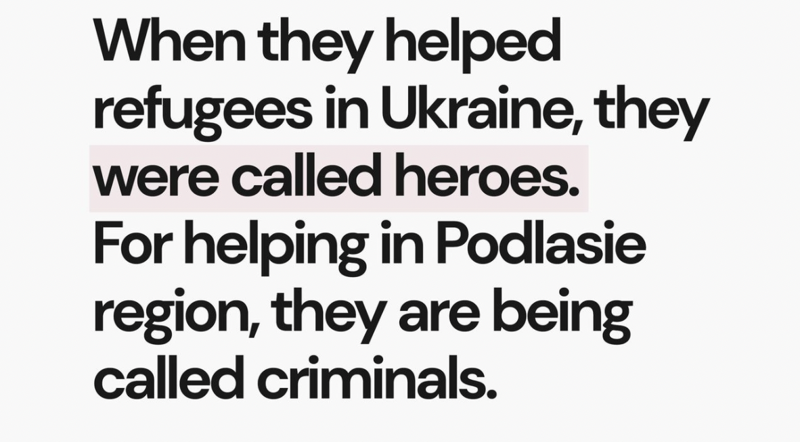
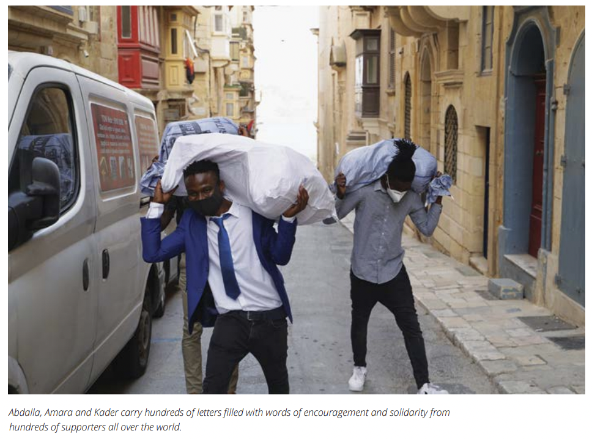

### AYS News Digest 25/3/22: Poland activists detained for helping at Belarus border

El\-Hiblu 3 publish their testimonies / Non\-Ukrainian asylum seekers abandoned, evicted and detained everywhere / UK illegally seized refugees’ phones / Fact\-checking the Greek government / More Frontex news / Our recommendations to read this week

Statement by Grupa Granica
### FEATURE
#### At the Poland\-Belarus border, helping is still a crime

Four activists from Grupa Granica were [detained](https://www.theguardian.com/global-development/2022/mar/25/poland-detains-activists-accused-of-smuggling-migrants-over-belarus-border?CMP=Share_iOSApp_Other) at the Poland\-Belarus border on 23 March\. **They are accused of transporting in their cars a family with seven children who had been stuck in the forest for three months\.** Exactly what hundreds of people have been doing some 400 km to the south, at the border with Ukraine — where the activists were actually helping only a few days ago\. But here, at the Belarus border, transporting refugees in dire need is illegal\.

The prosecutor said that the activists had been arrested on suspicion of illegally smuggling people over the border — an accusation they deny, explaining they only supported them once on the Polish side\. The prosecutor requested that the accused be detained in pre\-trial detention for three months, but **this petition was luckily [rejected](https://www.facebook.com/grupagranica/posts/379969600598308)** yesterday by the district court in Hajnówce\. One of the activists, who does not hold Polish citizenship, is still held by the border guards and might still be sent back to her home country\.

> “We read this action as a form of repression against those who prove with their actions that human life has the highest value — regardless of which side of the border they seek refuge,” stated Grupa Granica\. 

■■■■■■■■■■■■■■ 
> **[Commissioner for Human Rights](https://twitter.com/CommissionerHR) @ Twitter Says:** 

> > The arrest and prosecution of 4 activists helping people seeking protection in Poland is an attempt to criminalise humanitarian aid. Saving lives of fellow humans should never be criminalised. The harassment of #humanrightsdefenders at #Poland / #Belarus border should stop. 

> **Tweeted at [2022-03-25 16:20:20](https://twitter.com/commissionerhr/status/1507391945991151616).** 

■■■■■■■■■■■■■■ 

The humanitarian crisis at the border with Belarus has intensified in recent weeks, and solidarity groups have [received calls for help from 196 people](https://www.facebook.com/grupagranica/posts/379969600598308) , including 45 children, just between March 15 and 21\. Belarusian forces have forcibly removed many people who were staying in a warehouse in Bruzgi\. As a result, **[the most vulnerable refugees](https://www.facebook.com/grupagranica/posts/379740387287896) are now in the forest** : mainly families with small children, sick and disabled people, and victims of torture\.

> Every day we receive dramatic calls for help\. Among last interventions were an eight\-year\-old girl with congenital kidney disease and urinary tract infection, a ten\-year\-old with intellectual disability, in the forest there was also a boy with four\-limbs failure after a fracture of the spine, as well as a feverish woman in third month of pregnancy with kidney inflammation\. Everyone was dehydrated and, in the case of refusal to help, everyone would be threatened with death\.” 

This comes as even non\-Ukrainians fleeing Ukraine are facing serious obstacles in accessing help\. Despite the war, [**dozens of asylum seekers are still being held**](https://twitter.com/Nadia_Hardman/status/1507369276835082241?fbclid=IwAR2FUuiJEO-NtpeVlH2MRViwbvg32Rk0WSNYIDt3MZzMkAS1Vx6IbZRqnLc) **in Zhuravyci Migrant Accommodation Center** in North\-Western Ukraine\. At least 52 third\-country nationals have also been i [mprisoned in closed detention camps](https://twitter.com/Seebruecke_intl/status/1507433585644642307) after fleeing from Ukraine to Poland or Estonia\. The IOM is reportedly aware of over three such camps, and people have been held there for weeks\. Since 2015, Ukraine [had been given EU funds](https://www.spiegel.de/international/europe/ukraine-receives-eu-funds-to-block-asylum-seekers-from-reaching-europe-a-1018907.html?fbclid=IwAR0H0ortpwkz3sq7E6s8rTQDkZ21RQuRmyO7zNpSj5fi64UDJnUHdfj7M8Y) to keep asylum seekers from reaching Fortress Europe\.

■■■■■■■■■■■■■■ 
> **[Seebrücke International](https://twitter.com/Seebruecke_intl) @ Twitter Says:** 

> > People are reportedly forced to sign non-translated papers after crossing the border, otherwise they are threatened with a 5-month prison sentence. In the camps, mobile phones are taken from them and any contact with the outside world is largely prevented. 

> **Tweeted at [2022-03-25 19:05:51](https://twitter.com/seebruecke_intl/status/1507433597363531779).** 

■■■■■■■■■■■■■■ 

### MALTA
#### El\-Hiblu 3 youth publish their testimonies

The three youth have been waiting since 2019 for their trial, as they are accused of terrorism, violence and hijacking \(among a long list of charges\) by the Maltese State\. They have now [published their testimonies](https://timesofmalta.com/articles/view/three-youths-give-testimony-three-years-after-being-accused-of.942816#.YjsfN0WejjM.twitter) for the first time in a document ahead of a seminar, on the third anniversary of their arrest\.

Victims of slavery, torture and detention in Libya, Amara Kromah, Abdul Kader and Abdalla Bari boarded a dinghy with 108 passengers to try to make the route to Europe in March 2019\. The people were rescued by the merchant vessel El Hiblu, whose captain promised that he would not return them to Libya\. But the next morning, the passengers recognized the Libyan coastline and resisted the pushback\. The three youths, aged 15, 16 and 19 at the time, acted as translators and mediators between the ship’s crew and the asylum seekers\. The vessel eventually headed for Malta, where the Armed Forces arrested the three teenagers\.

“Amara had hoped that his language skills would be the key to his future, writes Amnesty, but sadly it was those skills which led to all these charges being laid against him\. Because they translated between the migrants and the captain, they have been classified as the leaders of the revolt,” [outlines InfoMigrants](https://www.infomigrants.net/en/post/39447/shattered-dreams-migrants-of-el-hiblu-3-speak-out-for-first-time?fbclid=IwAR0V7puGcmoJJQZrgSgMVaPQJ-RANtWK4r3YdZhdn2NSzg5MMiPFz05R5GA) \.

“The El Hiblu 3 live in Malta\. Every day they have to sign in with the police\. Every month they go to hearings in the Maltese court, hoping to leave as free men\. They have jobs, they have flatmates, one has children, but they are not free”, begins the document\.

The testimonies are [available in this document](https://cdn-others.timesofmalta.com/0a05c655494359bb485ffc11e2c81ae609dd7c01.pdf) , which highlights the murderous migration policies of Malta and Europe\. [Read more about the El\-Hiblu 3 case here](https://www.infomigrants.net/en/post/39447/shattered-dreams-migrants-of-el-hiblu-3-speak-out-for-first-time?fbclid=IwAR0V7puGcmoJJQZrgSgMVaPQJ-RANtWK4r3YdZhdn2NSzg5MMiPFz05R5GA) \.
### UK
#### Court rules that the Home Office illegally seized asylum seekers’ phones

The Home Office seized the phones of over 2,000 asylum seekers, in a policy that was deemed unlawful by the High Court\. Officers reportedly “bullied” asylum seekers into handing over their phone passwords, and their data was downloaded into an intelligence database called Project Sunshine, officially to gather evidence about people smugglers\.

> “Such systematic extraction of personal data from vulnerable asylum seekers, who were not suspects in any crime, was an astonishing and unparalleled assault on fundamental privacy rights,” one of the lawyers representing three asylum seekers said\. 

### GREECE
#### Fact\-checking the Greek government

The Minister of Migration and Asylum Notis Mitarachi expressed, on a TV show, his willingness to support the “real refugees” — the Ukrainians\. [Solomon fact\-checked this claim](https://wearesolomon.com/mag/accountability/ukraine-war-the-real-refugees-and-the-lies-of-the-greek-government/?fbclid=IwAR1j6Wwzk6s0AUCu4MWn6c17xEiGrVRWXU0ODMru7LzMsJZ2fbgkZqseyCQ) and others, proving that, evidently, this distinction doesn’t make sense:

> “The distinction between ‘real’ and ‘not\-real’ refugees serves political expediency and has no basis in international or European law\.” 

Journalist Stavros Malichudis also analyzed how the Ministry of Migration and Asylum has become an “influencer”, promoting companies and brands through its social media presence:

■■■■■■■■■■■■■■ 
> **[Stavros Malichudis](https://twitter.com/Malichudis) @ Twitter Says:** 

> > 1/ The Greek ministry of Migration has turned into an influencer promoting big interests through its social media accounts. 

Here are some examples: 

> **Tweeted at [2022-03-25 10:19:20](https://twitter.com/malichudis/status/1507301096066277392).** 

■■■■■■■■■■■■■■ 

#### Police raids and dystopias

[Police raids have been continuing](https://twitter.com/EleniKonstanto/status/1507299787913191441?fbclid=IwAR3uTcJ9WZyCzFZ07RbzRU-6GrM5neiZow5jfw0PVcfy7Hx4d-WeZ1haMbI) in the center of Athens and other Greek cities, especially with the elections approaching\. 530 allegedly undocumented people have been arrested and put in detention in Amygdaleza\.

On Samos, the “Closed Controlled Access Camp” continues to operate as a dystopia, [a “place of total surveillance and control”](https://dm-aegean.bordermonitoring.eu/2022/03/24/the-dystopia-in-form-of-a-camp-the-closed-controlled-access-centre-of-samos/?fbclid=IwAR15UNjrGanjj47LHADnmxIhAtyiyzhkm0mhi97MeDY87B0KNn8GC0VeHL4) — and yet touted as a model for European migration policy\.
### BELGIUM
#### Non\-Ukrainian asylum seekers “feel abandoned”

In Brussels, over 8,000 people have been registered in a center opened only for Ukrainian asylum seekers\. But at the country’s only asylum registration center, where all non\-Ukrainians must register, [the lines are long](https://www.infomigrants.net/en/post/39429/they-feel-abandoned-nonukrainian-asylum-seekers-in-belgium-left-out-in-the-cold?fbclid=IwAR2gXvkcdx4HVn78IyYdXhJJLz4N8o6obbngEbiLgvWKw3HzxNG5Og6ujV4) \. “Nearly a thousand single men were unable to register their applications last week,” writes InfoMigrants\. Hundreds of people are still sleeping in the streets, awaiting registration or a response on their bids for asylum\.
### EU\-FRONTEX
#### Ylva Johansson may end up in court over Frontex case

EU home affairs commissioner Ylva Johansson [has been issued a legal notice by Front\-LEX](https://euobserver.com/world/154567?fbclid=IwAR2T-bXujDBifcnUxnvA_PN6VAg5lkjTxe4MdXlAWhsol-_fo2LpPSSvzDA) , demanding that she drives forward a proposal to fire Frontex chief Fabrice Leggeri\.
#### Frontex operations in Africa

Even as it is mired in scandals and investigations, [Frontex wants to launch its first own operation on the African continent](https://twitter.com/cilip_de/status/1507470131773022212?fbclid=IwAR2S5Yvj5klgGyjRkf_z7mDYN9iCuDKdmbgWrIetDyUR01VWLeVkwQ8kmIQ) , in Senegal\. This is yet nother attempt at externalization and outsourcing “migration management” to third\-countries\. EU Commission President Ursula von der Leyen even [travelled to Dakar in February](https://digit.site36.net/2022/02/11/status-agreement-with-senegal-frontex-wants-to-operate-in-africa-for-the-first-time/) to discuss it\. It is not Frontex’s first cooperation with African troops, though:

■■■■■■■■■■■■■■ 
> **[Matthias Monroy (@Mastodon)](https://twitter.com/matthimon) @ Twitter Says:** 

> > Even after the coup in #Mali, the EU agency #Frontex is working with border troops there (as well as with police from Chad, Niger, etc.). 
The meetings take place within the framework of the  #AFIC intelligence network:
[fragdenstaat.de/anfrage/hochra…](https://fragdenstaat.de/anfrage/hochrangige-treffen-mit-senegalesischen-behorden-oder-ministerien/#nachricht-682272)
@[MigControl](https://twitter.com/MigControl) https://t.co/I3YMJdjdax 

> **Tweeted at [2022-03-25 13:56:09](https://twitter.com/matthimon/status/1507355659469266949).** 

■■■■■■■■■■■■■■ 

### LITHUANIA
#### Pushbacks at the Belarus border

For three consecutive days, the Lithuanian border guards [pushed back more than 30 people](https://twitter.com/DeWilcz/status/1506552198012014603?fbclid=IwAR23buM2CYhYuEsbe11r0chOljjhNpYFwyOE3gh5IKdDWXGaLSrgw6vObhQ) daily towards Belarus\. They have prevented 786 persons from crossing into Lithuania since the beginning of the year\. In Lithuania, just as in Poland, conditions in reception and detention facilities were [described as “worse than prisons”](https://ecre.org/eu-eastern-borders-disastrous-reception-conditions-in-poland-and-lithuania-pushbacks-denounced-uptick-in-arrivals-to-latvia-amid-fears-of-war-in-ukraine/?fbclid=IwAR2Ep0riqqC0Iq87vecCfDxSLESPj_Q9c42T3MyQzpTdXAsDLFzMVkeLm_k) in February\.
### NETHERLANDS
#### Government opens empty buildings for 15,000 Ukrainian refugees

Dutch Housing Minister Hugo de Jonge [said that places could be opened up for 15,000 Ukrainian refugees](https://www.dutchnews.nl/news/2022/03/government-finds-15000-places-for-refugees-in-empty-buildings/?fbclid=IwAR2sJQzi256J2W5JQ_Ih82L1P1Hf72DOkfGl0bLf0rlFoQBHfkc0JBHbtOc) in empty buildings, including former offices and prisons\. €75 million has been allocated to fund the redevelopment work\. The government estimates that 100,000 people might eventually resettle from Ukraine to the Netherlands if the war continues\.

The cabinet is also [considering creating “refugee villages”](https://nltimes.nl/2022/03/25/cabinet-considering-refugee-village-fleeing-ukrainians-report?fbclid=IwAR2pQ95V285OMlEkXNwR8Zb7BKvCoajMrWeGC_bHCl8sep_wuU6HEmIvnMs) to host large numbers of people from Ukraine\. And clearly, double standards have not disappeared: the police are reportedly “worried that refugees from other countries could mix with Ukrainians”, and they state that “identification is important\.”
### FRANCE
#### 49 minors narrowly avoid expulsion to make space for Ukrainians

49 minors housed in hotels in Ormoy have been [under the threat of expulsion to make space for Ukrainian refugees](https://www.humanite.fr/societe/migrants/refugies-en-france-les-uns-arrivent-les-autres-sont-expulses-743310?fbclid=IwAR25hAXis2UjyxNeNVRvql-8OMtTgGtVjSdM4KR9CPzP0k42nzJuQQCpRB8) \. The authorities are trying to push them to apply for asylum — but this would force them to abandon procedures to recognize their minority and be supported by the child welfare office\. The 49 youth have been rejected by the Red Cross, in charge of assessing the age of unaccompanied minors\. This rejection, a common practice, requires them to then reach out to a juvenile court judge\. They have all been waiting for decisions in these procedures, and granted this emergency accommodation after weeks on the streets\.

Thanks to the mobilisation of supporters, the expulsion was finally suspended on Friday\. But in Rennes, 142 people including 44 children were awaiting their own expulsion from a gymnasium that they have been living in for 2 months\. The authorities have provided no other living alternative\.

■■■■■■■■■■■■■■ 
> **[Utopia 56](https://twitter.com/Utopia_56) @ Twitter Says:** 

> > À Rennes, 142 personnes (44 enfants) rangent leurs affaires en attendant l'arrivée de la police pour les expulser du gymnase où ils survivent depuis 2 mois. Aucune solution n'est communiquée par @[metropolerennes](https://twitter.com/metropolerennes) et @[bretagnegouv](https://twitter.com/bretagnegouv). Si rien n'est fait, toutes seront ce soir à la rue https://t.co/3MWu15OsBy 

> **Tweeted at [2022-03-25 11:32:46](https://twitter.com/utopia_56/status/1507319577763803141).** 

■■■■■■■■■■■■■■ 

### SEA / SAR
#### Survival and death in the Mediterranean

The dying continues in the Central Mediterranean: MV OCEAN VIKING \(SOS MEDITERRANÉE\) [rescued](https://twitter.com/SOSMedIntl/status/1507459439334502400?fbclid=IwAR38tzrqw-XwfJQbRDE2egTxZ97t8dd1GYwydDO8zxo2t2c2fYy77k8avCo) 128 people in a 5\-hour rescue operation on Friday, but two people were found deceased in the rubber boat\.
### SERBIA
#### No Name Kitchen opens new project in Serbia

No Name Kitchen has opened a new project in the city of Subotica in Northern Serbia\. They support people on the move living around the towns of Horgos and Majdan, close to the Hungarian and Romanian borders\. The organisation reports “numbers of people on the move fluctuating between 200 and 500 spread between the two towns, many of them requesting nutrition and medical help”\.
#### Bad treatment of asylum seekers in Preševo

■■■■■■■■■■■■■■ 
> **[Azil u Srbiji Asylum Protection in Serbia](https://twitter.com/APC_CZA) @ Twitter Says:** 

> > Preševo 23/03/21, 450 refugees in the camp. Complaints against doctors &amp; nurses continue. They do not provide medical assistance and postpone their appointments, refugees complain on lack of medication, unprofessional &amp; rude attitude nas use of vulgar language against refugees. https://t.co/PMh15DJkOc 

> **Tweeted at [2022-03-25 11:31:49](https://twitter.com/apc_cza/status/1507319337107009539).** 

■■■■■■■■■■■■■■ 

### Worth Reading
- **Investigative book highlights the billion\-dollar business of the illegal organ trade** : “ _Most people I spoke to were asylum seekers and refugees from Sudan, South Sudan, Ethiopia, Eritrea and Somalia_ \.”

- **Ukrainian Refugees in Poland: The Festival of Help and the Government’s Reluctance to Act**

- **Why is Europe suddenly so interested in helping refugees?**

- **The consolidation of Europe’s border regime in Greece**

**Find daily updates and special reports on our [Medium page](https://medium.com/are-you-syrious) \.**

**If you wish to contribute, either by writing a report or a story, or by joining the info gathering team, please let us know\.**

**We strive to echo correct news from the ground through collaboration and fairness\. Every effort has been made to credit organisations and individuals with regard to the supply of information, video, and photo material \(in cases where the source wanted to be accredited\) \. Please notify us regarding corrections\.**

**If there’s anything you want to share or comment, contact us through Facebook, Twitter or write to: areyousyrious@gmail\.com**

_Converted [Medium Post](https://medium.com/are-you-syrious/ays-news-digest-25-3-22-poland-activists-detained-for-helping-at-belarus-border-ca2805ae2053) by [ZMediumToMarkdown](https://github.com/ZhgChgLi/ZMediumToMarkdown)._
