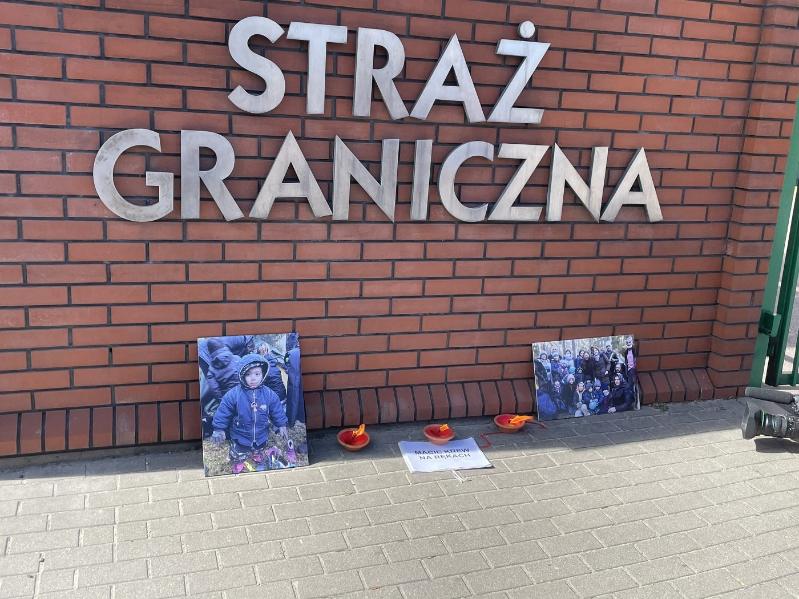

### AYS News Digest 28/3/22: New testimonies of abuses by Polish Border Guards
#### _Ethiopian government gives humanitarian aid workers access to Northern regions // UN investigates reports on mass graves in Libya // More people arrive in Northern Morocco // One man died in France_

“You have blood on your hands,” Grupa Granica tells the Polish Border Guards\. Credits: [Twitter/@GrupaGranica](https://twitter.com/GrupaGranica/status/1508154198881361932)
### Ethiopia

The government has [declared](https://eastandhornofafrica.iom.int/news/iom-welcomes-declaration-indefinite-truce-ethiopia?fbclid=IwAR2KJ2uTwdSCYy6fKSWD6X4QSvOh7hHHo4UOVegNU6hWdnDQAjAc25IwG_Y) an indefinited truce in the Northern part of the country for humanitarian aid and access\. According to the East and Horn of Africa section of IOM, the UN body has assisted more than one million people in the area with basic supplies and emergency shelter\. However, more than 5\.2 million people are [in need](https://reliefweb.int/report/ethiopia/ethiopia-federal-government-humanitarian-truce-tigray-positive-step-forward-and-must?fbclid=IwAR1kL4mecIJaSrPo93WwmoSfYOrNiGgPdowcfMYsVkQ-f6dkUFxVuJtCqjs) of food aid\.
### Libya

UN investigators are following reports on mass graves at a trafficking hub in Libya’s Bani Walid\. In their report they also documented crimes such as rape, murder and torture\. One person testified to have buried three people, Reuters [writes](https://www.reuters.com/world/africa/un-investigates-reports-migrant-mass-graves-libya-2022-03-28/?fbclid=IwAR2QGkDUY38R5SX9X1x67B1nupM_XsV3lbCglvRuq07I0sTX4fwNd1wp15M) \. The mayor admitted absuses but denied mass graves and highlighted improvements in the past years\.
### Morocco

Two people were found dead following a shipwreck, according to local authorities\. In police raids during the weekend, three inflatable boats, two motor sculls and gasoline were seized\. Additionally, 236 people were intercepted and arrested, when they tried to depart to Spain\. Last year, more than 40,000 people arrived in the country, Infomigrants [reports](https://www-infomigrants-net.translate.goog/fr/post/39462/au-maroc-deux-migrants-retrouves-morts-noyes-plus-de-200-personnes-interpellees-alors-quelles-tentaient-de-prendre-la-mer?ref=tw_i&fbclid=IwAR3-l9eDCjo2cYI0lntSgTj1QExRfjtk-hn1mmIkDoduNRg9zDv9ibOyW6w&_x_tr_sl=auto&_x_tr_tl=en&_x_tr_hl=de&_x_tr_pto=wapp) \.

Meanwhile, [Aidez Nous A Aider](https://www.facebook.com/AideznousaAiderA.N.A/) \(A\.N\.A\) sees more people heading to the Northern border of Morocco and “completely new faces coming to take our aid”\. The priority is to provide people in need with food supplies\. The complete update can be found in their newsletter\.
### [News from ANA](https://mailchi.mp/4d006f324e73/news-from-ana?e=[UNIQID]&fbclid=IwAR073sb8GUy1lwQqe6pbx6XxNKi4ec1E7LNmR8QP4b5JQ1pwWFydOmABVS8)
### [Hey Friends, Another month passes and more refugees are migrating to the Northern border of Morocco\. Elfadil says that…](https://mailchi.mp/4d006f324e73/news-from-ana?e=[UNIQID]&fbclid=IwAR073sb8GUy1lwQqe6pbx6XxNKi4ec1E7LNmR8QP4b5JQ1pwWFydOmABVS8)

[mailchi\.mp](https://mailchi.mp/4d006f324e73/news-from-ana?e=[UNIQID]&fbclid=IwAR073sb8GUy1lwQqe6pbx6XxNKi4ec1E7LNmR8QP4b5JQ1pwWFydOmABVS8)
### Sea

32 people have been rescued by a cargo vessel after they survived a stormy night\. In a thread on Twitter Alarm Phone updated on their situation, when they got in distress on Sunday off Bengazi and the boat started drifting\.

SOS Mediterranee informs, that from the current rescue operation in the central Mediterranean, all unaccompanied minors were allowed to disembark the Ocean Viking in August\. However, 109 rescued people needed to spend another night on the ship\. “With heavy hearts we bid farewell to the deceased who was disembarked and thought of the casualty we could not recover,” the team states\.
### Greece

Alarm Phone [received](https://twitter.com/alarm_phone/status/1508516825750982659?fbclid=IwAR1QbL1a8gJsIPW0kD8_ADpaHVomXchXoeNj1M8H147y57N2RqMGOhUKkKQ) a distress call on Kos\. Some six people were stranded there\. As they did not have direct contact and competent authorities do not share information, they fear an unlawful pushback\.

Some 50 people arrived on Lesvos on Sunday, journalist Franziska Grillmeier reported on Twitter\. In fear of a pushback, the group split up and hid for hours\. Also volunteers are hesistating to assist, as they are scared to be criminalized for aiding “illegal entry”, and [journalists are intimidated](https://ipi.media/greece-mfrr-report-finds-systemic-challenges-to-press-freedom/?fbclid=IwAR3gGs02mrx5IBzDhEZKhFC6PIREL6wc3J-_lVaPc4OKdsvhi6_5F1GeJoc) \.

**Further reading:**
- [Ukraine or the Middle East? Greece applies varying rules on refugees](https://www.dw.com/en/ukraine-or-the-middle-east-greece-applies-varying-rules-on-refugees/a-61262360?fbclid=IwAR3gGs02mrx5IBzDhEZKhFC6PIREL6wc3J-_lVaPc4OKdsvhi6_5F1GeJoc) \(DW\)

### Ukraine

The Responsibility to Protect \(R2P\) reminds on stateless and undocumented people in Ukraine, which is especially a problem for the Romani population and children born in Donetzk, Luhansk and Crimea, who do not have birth certificates or personal documents\. As there are many checkpoints throughout the country, missing identity confirmation can create obstacles, R2P warns\. However, no such case had been documented so far\. Of the 700 beneficiaries of the team’s work, 138 could be contacted and only 24 had left the country\. Most urgent needs were drinking water and food\. R2P further highlights in its [report for Statelessness](https://www.statelessness.eu/updates/blog/assisting-stateless-people-trapped-ukraine-report-ground?fbclid=IwAR2xFkOXip19HlildI7WVoJMJ3O2w82jLlJpZbi1yRvne90XuygOHNaj5_0) that neither German laws nor the EU’s Temporary Protection Directive oblige the authorities to grant temporary protection to stateless people\.

**Further reading:**
- [Ukrainian female refugees are fleeing a war, but in some cases more violence awaits them where they find shelter](https://theconversation.com/ukrainian-female-refugees-are-fleeing-a-war-but-in-some-cases-more-violence-awaits-them-where-they-find-shelter-179754?fbclid=IwAR2DcvADuU_n5pCWNdoqD_913_EGr1mKm7zTqRT2AAr2GjRQ_NagtS2wlfU) \(The Conversation\)

### Poland

In a forest near Białowieża the body of a man was found\. The man’s identity is still unknown and it is assumed the body has been there for some time\. Investigations are ongoing, by now authorities did not provide much information, according to [Wydarzenia Interia](https://wydarzenia.interia.pl/podlaskie/news-cialo-mezczyzny-znalezione-w-poblizu-polsko-bialoruskiej-gra,nId,5914581?fbclid=IwAR2itGICt3aYpyOghMf8J6NXo2L8Eui1NhQy0D7NFxgZAOvBM-rjUZANtcM) \.

Polish Border Guards arrested a Kurdish family near the border to Belarus\. 12 people, among them seven children and one pregnant woman, were pushed back to the country, in which a dictator is supporting Putin’s war in Ukraine\. Among the deportees was also a paralysed man\. “The family carried him for 16km, until they ran out of food and water,” Grupa Granica states\. On Twitter, the border guards [denied](https://twitter.com/GrupaGranica/status/1508140794724683785?fbclid=IwAR0i3DlPnWYGqu1qChJpHWiuMLOuez9a4eJoZLnn5gb4-YTZ84yf0F_iZBs) the incident\.

In another incident, a group of nine people got lost in swamps near Siemianowka and needed to be rescued by the border guards\. Among them was one man who was missing for a couple of weeks\. AYS volunteer Uli followed the case:
### France

A man from Eritrea died of electrocution last week, when he was hiding in a train in Valenciennes, Utopia 56 [revealed](https://twitter.com/Utopia_56/status/1508015657207713796?fbclid=IwAR27rfa3setCs9_Ms5VYGQXXG51njnWK1iTtw1T8aIeGEMje3nPN2U5PyCU) and criticized: “If free transport were applied to all refugees, wherever they come from, this young person would still be alive\. Discrimination kills\.”

The French State was finally sentenced for having committed an “assault” \(an action that infringes a property right or a fundamental freedom\) against displaced persons during an eviction from a informal living space in Calais in September 2020, la Voix du Nord [reports](https://www.lavoixdunord.fr/1157928/article/2022-03-25/le-prefet-du-pas-de-calais-sanctionne-pour-l-evacuation-d-un-camp-de-migrants?utm_medium=Social&utm_campaign=echobox_calais&utm_source=Twitter#Echobox=1648241627-1) \. However, the police is still raiding public spaces\. In a recent eviction last Monday, 35 people were affected, according to [Human Rights observers](https://twitter.com/HumanRightsObs/status/1508141876163092481?fbclid=IwAR27rfa3setCs9_Ms5VYGQXXG51njnWK1iTtw1T8aIeGEMje3nPN2U5PyCU) \.
### Worth reading or watching
- [People are not born to live in camps \| Dr\. Apostolos Veizis](https://www.youtube.com/watch?v=D_q2tN1umHw) \(Youtube\)
- [Act Now on Older People’s Rights](https://www.hrw.org/news/2022/03/28/act-now-older-peoples-rights?fbclid=IwAR1uqqMqCdDl3YVoxkAvg75IRUlJB-VcG-uuxm3KQ2Ayt_WrstPYwgveMXM) \(HRW\)
- [The EU should treat all refugees like it is treating Ukrainians](https://www.thenewhumanitarian.org/opinion/2022/03/23/eu-should-treat-all-refugees-like-it-is-treating-ukrainians?fbclid=IwAR2XmVMXxGRFYMgM4vaIjlDTJVaj3EYya6ETdguqZWnq-FE7vEG48ywK5Kg) \(The New Humanitarian\)
- [Supporting Ukrainian refugees](https://timesofmalta.com/articles/view/supporting-ukrainian-refugees.944166?fbclid=IwAR2c9zYqwbmNpnh3_S1giUXFMrIFMC3TXdR1inwAe7Ek7-AOVyJpU3yIMMk) \(Times of Malta\)

**Find daily updates and special reports on our [Medium page](https://medium.com/are-you-syrious) \.**

**If you wish to contribute, either by writing a report or a story, or by joining the info gathering team, please let us know\.**

**We strive to echo correct news from the ground through collaboration and fairness\. Every effort has been made to credit organisations and individuals with regard to the supply of information, video, and photo material \(in cases where the source wanted to be accredited\) \. Please notify us regarding corrections\.**

**If there’s anything you want to share or comment, contact us through Facebook, Twitter or write to: areyousyrious@gmail\.com**

_Converted [Medium Post](https://medium.com/are-you-syrious/ays-news-digest-28-3-22-new-testimonies-of-abuses-by-polish-border-guards-62fdd28c224c) by [ZMediumToMarkdown](https://github.com/ZhgChgLi/ZMediumToMarkdown)._
