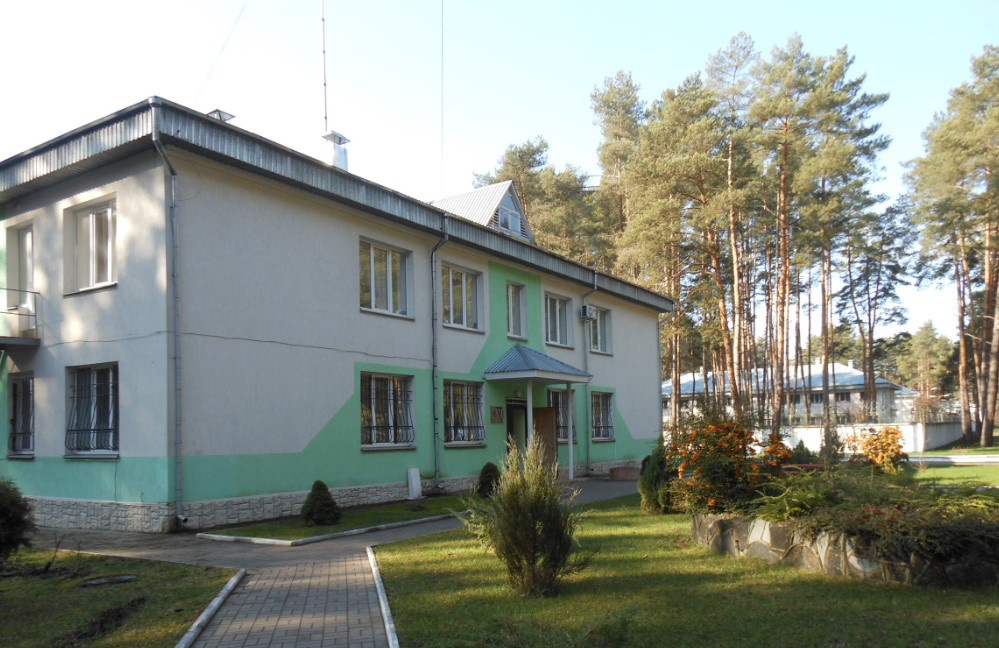

### AYS News Digest 4/4/22: As the war rages, so does the racism and violent discrimination
#### News from the SAR teams across the Med / Palermo continues setting example in putting an effort / A follow up on the French attempt to legalise the presence of the people / How is the reception going in Berlin & other news

VOLYN TEMPORARY STAY FOR FOREIGNERS AND STATELESS PERSONS \(in Zhuravychi\) \(© Ukraine Ombudsperson

A joint investigation led by Lighthouse Reports reveals that the so called migrant detention centre Volyn near Lutsk in Ukraine continued to hold an unconfirmed number of people despite the war and Russia’s invasion\.

The centre operates thanks to the EU which had allocated 1\.7 million euros \($1\.8m\) for the securitisation of this centre in 2009\.
As the LR reports, “the camp got EU support to confine asylum seekers, many of them pushed back from the EU\. Voyln is a migrant prison still in operation even now, in the midst of a war, that detains undocumented people for up to 18 months\.

Global Detention Project [tweeted](https://twitter.com/migradetention/status/1507254593729744901?s=20&t=O3qX-hskoXP_iI4yPznpSw) that the detention centre in Mykolaiv is also likely to still be operational but there are still no confirmations of this\.

The European Commission [reportedly](https://www.aljazeera.com/news/2022/4/4/fear-grows-for-migrants-held-in-ukraines-detention-centre) did not answer questions from the reporters regarding its operation and whether there were plans to help evacuate any remaining people\. Ukrainian authorities also did not respond to a request for comment\.

However, after AYS volunteer inquired about the actions taken to investigate and help those in the detention centres, the Ukranian organisation Right to Protection said they are monitoring the situation, occasionally giving legal support to the detainees during the visits to the centres, and checking if the legal aspects of the laws in place affecting people in these circumstances are being respected\. The answer stated: “R2P lawyers periodically make monitoring visits to this center and provide free consultations and legal assistance for everyone who asks for them\. At the moment, Ukraine has appropriate legislative regulation for the evacuation of detainees in the event of hostilities\.”

Procedure for mandatory evacuation of certain categories of the population in case of martial law — online [translation](https://l.facebook.com/l.php?u=https%3A%2F%2Fzakon-rada-gov-ua.translate.goog%2Flaws%2Fshow%2F934-2018-%25D0%25BF%3F_x_tr_sl%3Dauto%26_x_tr_tl%3Den%26_x_tr_hl%3Dde%26_x_tr_pto%3Dwapp%26fbclid%3DIwAR33OF7pSqmCfQf0vhJQE9aqwOBFLUza8d50QJprBbDqUrZK5nc2Rar8fYA%23Text&h=AT1rlU1Ge7c9FvEJFV1KGEk0bzW2oqa2YSfKA8lm-dyPhN95HzN7haekCC0nUd_lXvnsxOrq0jXqxSQtnqNL-W0i0loc9ME4nz7NXZKLYPP2Gh5z8yo9xL_-_fAS7kNu_73dfxhBrzQ1s5aM3Q&__tn__=R]-R&c[0]=AT2QxlXUo2kJCRCf-gg6ZzxeH5hNriIG0zi9wZ3zuAweBNAZn9ra5jJdcfsOtBIs8cdjrqOzVshte3A0HMIENAF_SUtwcN17cVFGKvFARXuJv3Zw8bmV2Oo2JRWX1MtNvm9f9f0C7zrYQ9x6_ZExR5LFM2EdK2QewWbYnpC4viEAvd1eAFy_7rFn4M8kDjjK8POLPWdzg5gA) 
On the legal regime of martial law — — online [translation](https://l.facebook.com/l.php?u=https%3A%2F%2Fzakon-rada-gov-ua.translate.goog%2Flaws%2Fshow%2F389-19%3F_x_tr_sl%3Dauto%26_x_tr_tl%3Den%26_x_tr_hl%3Dde%26_x_tr_pto%3Dwapp%26fbclid%3DIwAR0OM3-j_eS67vP4-DHHSDdk1tysLPFOeFkrjS09xHx0xVSsfROmofIWgbA%23Text&h=AT1i0Kn6pmx4SEVaUii3riRqBQn-eqfRJ-7ENAyPFxwefTkgkW8iyLcl3R-2RCS47NR-bEZOBlJ8rm3I7fRlpZhBzCHiu18GGuQ6sUphw_37clRctHOW6PjxmWMkOvFSFy8MOgfv-fmSsflOcg&__tn__=R]-R&c[0]=AT2QxlXUo2kJCRCf-gg6ZzxeH5hNriIG0zi9wZ3zuAweBNAZn9ra5jJdcfsOtBIs8cdjrqOzVshte3A0HMIENAF_SUtwcN17cVFGKvFARXuJv3Zw8bmV2Oo2JRWX1MtNvm9f9f0C7zrYQ9x6_ZExR5LFM2EdK2QewWbYnpC4viEAvd1eAFy_7rFn4M8kDjjK8POLPWdzg5gA)
#### SEA

Several reports arrived from different parts of the Mediterranean:
- The **Greek** Coast Guard has seized around 70 people from a sailboat that was hit in the sea west of the Peloponnese Peninsula\. The people mostly from Afghanistan and Iraq were brought to the southern Greek port by Pylos, the Greek state radio reported on Saturday, News from the Med reported
- 59 people rescued south of Gran Canaria: **Spanish** sea rescue organization Salvamento Marítimo rescued a refugee boat with 59 migrants on board last night, located south of Gran Canaria, the Canary Emergency and Security Cord shared Inauguration site 112 and Salvamento included\. After they had been brought to the port of Arguineguín, they were provided with medical orders, and eventually four of them had to be taken to a hospital\.

■■■■■■■■■■■■■■ 
> **[MSF Sea](https://twitter.com/MSF_Sea) @ Twitter Says:** 

> > Unfortunately despite our efforts, the 4 survivors rescued by #Alegria1 were taken back to Libya. At the same time we have 113 people who after a critical rescue & 6 days on board need to find safety. We ask the Italian authorities to provide a place of safety as soon as possible https://t.co/mF0YYPuBCG 

> **Tweeted at [2022-04-04 10:57:28](https://twitter.com/msf_sea/status/1510934573022158850).** 

■■■■■■■■■■■■■■ 

Where are they?

■■■■■■■■■■■■■■ 
> **[Alarm Phone](https://twitter.com/alarm_phone) @ Twitter Says:** 

> > 🟠 Where are they? 
We were informed about ~30 people in distress who fled #Libya from #Khoms yesterday night. Since then relatives are not able to reconnect with them anymore.
Authorities don't give any information if they spotted the boat. We ask authorities to give answers! 

> **Tweeted at [2022-04-02 16:12:13](https://twitter.com/alarm_phone/status/1510289005895725056).** 

■■■■■■■■■■■■■■ 

#### MALTA

Only yesterday Malta left 106 people seeking protection at sea\. The RCC Malta insisted in writing and by telephone that it was not „competent”\. This cynicism on Malta’s part is intolerable und inhuman, [says](https://l.facebook.com/l.php?u=https%3A%2F%2Ftwitter.com%2Fgorden_isler%2Fstatus%2F1510178556382531587%3Ffbclid%3DIwAR3PVfsp-4fhChzd3vIcJW1BChSux2vaRRtSAMF3V4KFbkllo_JKqWkO5Ok&h=AT1JgsTMI-g2hceQgZtB0egO3kYmwGzPgsiXzHHFxDcvpSB5CRp97-QYVfM1GTqJzj0vG1cRV2yA34em92BH4j8h7aFp0JrfX_lLas4rQjEv4nzIDJYOedrZVp-WsJEIHhGRdEW6DPf2IuVX-OFmvCYIOiWv_Q&__tn__=R]-R&c[0]=AT17PhZNmmBFuB0_eHid1134uY0umpySePw_p1mZbeKgMv1XGWO_B46je-W9DCukpah5UZNYmaYytBYiBHl0WXTU0By3gKGKscXvV10HHYPuWSmynxC2bFPQ6RMoJbyJm_R3TqV__afvihTvg0bhre5IwaLObfx6Fkj_VxLNX5ZdzaweWFvi0Hu_IaaW3rKtuO3xWp8F5Qnj) G\. Isler\.

■■■■■■■■■■■■■■ 
> **[ElHiblu3](https://twitter.com/ElHiblu3) @ Twitter Says:** 

> > The #ElHiblu3 met Pope Francis today to tell him about their never ending trial in Malta. They thanked him for his support and handed over the "Free The ElHiblu3" publication: [elhiblu3.info/FreeEH3_book.p…](https://elhiblu3.info/FreeEH3_book.pdf) https://t.co/1iqCpy5ivk 

> **Tweeted at [2022-04-03 17:18:28](https://twitter.com/elhiblu3/status/1510668064915955713).** 

■■■■■■■■■■■■■■ 

#### ITALY
### Palermo — A model of civil coexistence internationally recognised

The contribution of so many for the reopening of Molti Volti has confirmed the cultural change of our city in recent years\. “Palermo defends the only race that exists, the human race, it respects the identity of all and defends the rights that are too often violated and mortified by the laws of the states, the importance of rights that we have discovered also thanks to the suffering of migrants\. Moltivolti’s experience confirms that Palermo has built an alternative to uncivil behaviour and inhuman laws\.”

#### FRANCE
### A follow up on the attempt to legalise the presence of the people

In spite of the mailboxes \(which is how evictions should be carried out\), people were kicked out today:

■■■■■■■■■■■■■■ 
> **[Human Rights Observers](https://twitter.com/HumanRightsObs) @ Twitter Says:** 

> > Malgré la présence de boîtes aux lettres sur les lieux de vie qui rappellent la voie légale pour mener une #expulsion dans le respect des droits de la défense, les [habitant.es](http://habitant.es) de neuf lieux de vie ont été [expulsé.es](http://xn--expuls-gva.es) ce matin. https://t.co/UDBAwJR9Uu 

> **Tweeted at [2022-04-02 20:52:34](https://twitter.com/humanrightsobs/status/1510359559189237765).** 

■■■■■■■■■■■■■■ 

#### GERMANY
### Berlin’s reception of refugees from Ukraine

Hundreds of people come to “Moabit helps” every day, and some are hungry\. They have no money, no information on what to do to be recognized as war refugees\. Many things are going better than in 2015/16\. But there is an “insane lack of information” everywhere, [says](https://l.facebook.com/l.php?u=https%3A%2F%2Fwww.zdf.de%2Fnachrichten%2Fpolitik%2Ffluechtlinge-moabit-hilft-berlin-ukraine-krieg-russland-100.html%3Ffbclid%3DIwAR125yBASahPmzKBwRp7xU2vIRjlYxmvr-upnIgHCpfuNdidRMab1pjLosQ&h=AT1ZOPhY9l-2C__cw6NP8MzTX8yYnSk_kk34ReSESGL7P6MC1NYPDWA_xi2tCr8erqvjtVgpbupB_KQ6IRCNQxKzJaixZ94FWR6DGe-kFu6AS7DfvkXY_AhDIuVwZxHuxpA4MnSym06N6sC-ew&__tn__=R]-R&c[0]=AT2QxlXUo2kJCRCf-gg6ZzxeH5hNriIG0zi9wZ3zuAweBNAZn9ra5jJdcfsOtBIs8cdjrqOzVshte3A0HMIENAF_SUtwcN17cVFGKvFARXuJv3Zw8bmV2Oo2JRWX1MtNvm9f9f0C7zrYQ9x6_ZExR5LFM2EdK2QewWbYnpC4viEAvd1eAFy_7rFn4M8kDjjK8POLPWdzg5gA) Diana Henniges from Moabit helps group\.

The federal government should have reacted much more quickly, says Henniges\. She herself would never have thought that she would have to agree with the demands of the CDU: Despite the three\-month visa\-free period for people from Ukraine, registration should have started immediately\. On the one hand, they could have been distributed more quickly and accommodated better\.

The group [Moabit hilft e\.V\.](https://www.facebook.com/Moabithilft?__cft__[0]=AZU2W1TqFmK0EAUr5GStos4ZcJUmc82g9mbY2gGLhNIuNe7yPAB9Y3uEVpEqV3d9lCD7CyJv1E6SjQhNWqsZZbI2D2jv6W8mfZyEJLDiP0d5NRFZDAjfRltL0gjwwfFCHTNrg3EMEWUJAbYx5lP7KViT&__tn__=-]C%2CP-R) needs donations to keep up with the demanding tasks they are undertaking to support the people arriving:

In the meantime, Fluchtlingsrat Berlin [reports](https://www.facebook.com/fluechtlingsratberlin/posts/4916189005102542) about a forced distribution of a group of 180 deaf people from Ukraine, who arrived in Berlin four weeks ago\. “The group is forced to be dependent on each other because of their common Ukrainian sign language\. To crush them and expel them from Berlin under threat of homelessness, because there is no room for such partisan interests here, that is the lowest level\.”
#### POLAND — BELARUS
### Despite a court ruling — the border guards continue their pushbacks

There are more families and vulnerable people because the Belarus camp in Bruzgi was closed, Grupa Granica [reports](https://www.facebook.com/grupagranica/posts/386700866591848?__cft__[0]=AZXCEUbWFttS4H5097k6KRXrRAFbpKaEyRSorQsYfuxjQxv-KxtBK8qP_oviG1g_kfqjSsRUieJsSu-3MPjrvcP6gKc1odTtA_hM9kutDz7jRZhdeEm5XaIPHD43niWJHp4dNZ4EvpG-rb-dph1Yo4MH4nUWiVbUBZfy-UfyjSH5c66q0-lnTYTt11P6Tqslu1w&__tn__=R]-R) , where the ones remained who could not repatriate or did not have enough strength to cross into Poland before were staying\. All these people are now attempting to cross into the EU\.
#### GENERAL

**_We’re not criminal\. We just want peace for our children\._**

Meet Dayana, from Aleppo\. Europe shut its [\#borders](https://www.facebook.com/hashtag/borders?__eep__=6&__cft__[0]=AZUtDssAUX1Ap8I7R99N6fYD6aE8AsRdkKC5rT65Nq_W6A6CFH-wnK8_-v_k5V7Nrh2799tQb_980wKnj8PZuYR6TGueDlb3AgUcgOZJaJhrPpJPsd4uaPnAFmPfG4oxPLm0dblcL9qQIRyIZLAsuqZY-sm5uo1vZEDrdvaEqErM-E-N1wB5-UqEF1bG9ILKPcA&__tn__=R]-R) to her, her family and to all refugees in 2016\. She joined the March of Hope and peacefully crossed the border into North Macedonia\. Officers forced her back with 1\.500 refugees, giving her no access to asylum\. She took her case to the European Court of Human Rights\. On 5 April the court will rule in her case\. The message must be clear: Pushbacks are illegal\.

■■■■■■■■■■■■■■ 
> **[EDRi](https://twitter.com/edri) @ Twitter Says:** 

> > By using #AI tech at the borders “We’re crystalising assumptions about people on the move before they even reach Europe’s shores” says @[edri](https://twitter.com/edri)’s @[sarahchander](https://twitter.com/sarahchander) for @[bbcworldservice](https://twitter.com/bbcworldservice).
Listen to the full report here 🎧 [bbc.co.uk/sounds/play/w3…](https://www.bbc.co.uk/sounds/play/w3ct1j1q)
Reporting by @[FreyLindsayMCP](https://twitter.com/FreyLindsayMCP) 

> **Tweeted at [2022-04-04 07:45:00](https://twitter.com/edri/status/1510886135291125762).** 

■■■■■■■■■■■■■■ 

#### WORTH READING

■■■■■■■■■■■■■■ 
> **[Ghouta](https://twitter.com/ActForGhouta) @ Twitter Says:** 

> > On this day five years ago, in northwestern Syria, April 4, 2017, sarin covered the sky of Khan Sheikhoun, which was outside Assad's control areas.
#donotsuffocatetruth
#Khan_Sheikhoun https://t.co/SlGQE1RLiD 

> **Tweeted at [2022-04-04 09:55:23](https://twitter.com/actforghouta/status/1510918949537525760).** 

■■■■■■■■■■■■■■ 

- New Mixed Migration Hebdo is out:

[](https://l.facebook.com/l.php?u=https%3A%2F%2Fmixedmigration.substack.com%2Fp%2Fmarch-28-april-4-2022-mixed-migrationhebdo%3Fs%3Dw%26fbclid%3DIwAR0mxNXFbeOZSxoa_Dsa5F7PFlWHScU-vl3swFTLetpiSTQinq1BaXcgBDg&h=AT32zgbnm8SOfLr5ds6VqKdUtasC3pvR4xAfLEWbUrwppK4DGLFcAiFj2cJFzOrcAP6AHRb-kjGpaeYIjmKGzvLCo8c2620Z5vf9Pfp_gDm6nqcgbMZ4eZGwYI6qsXGNTRaUqkWZnmVoaUci71J__I6l9Dk8iA&__tn__=R]-R&c[0]=AT2HFMzGG3-d0yfGm2OdbEfz8drFt3Pdg1X9Tvk_J_qskpaZ2nNep0wicOxck1NANVNG3UFJiynK9Xi2qtt8GSUt6eFAvRZIJS7kZO_WzUpN553tv2xKZz_S3xWFX7E_g7lPUhNVC8RjWKNvSUaR7AMMpCSWq4gzukotcOYFKFEIC09tudBcq9YseR64U81kUaebxvDQinY0)

- Melting Pot europa put together a guide for unaccompanied minors\. It is translated into 6 languages and is free to download after registration:

[](https://l.facebook.com/l.php?u=https%3A%2F%2Fwww.meltingpot.org%2F2022%2F03%2Fmanuale-msna-2022%2F%3Ffbclid%3DIwAR10lMLHUOuAc5TuN3fsjI41JoTdIFVppsg6zBAsjuxjMI89QSlfTy5YX54&h=AT2pyxO6jc7TyUj5PuGTQ_0K66k-ZsKGktun4Idncqi8QNakAOYGK23dYnwpLwNZytMI-X2-Ur2VAr6ObCLEekrXbgAhBtzQAyFAAHUpzXhaDb6fif-66UM4HoYmBrJ4sfi9wFhrFiRguDSfXOMIPHXNKuwmCA&__tn__=R]-R&c[0]=AT1wZCO4R8vUucE6uFSEc1NgzQkA0-eWpf_xaDEY8SERZVoDqPH_-0GRDC1-5_vFk5F7cPWA41EaK2Tx_z_cs4BRSX6X1HjXD2_Xo17pyOdOVdxcPK9R195bEmAYQnqtx2OOPk5fSlmX8sf_wDK0tGwi0rj3GVv_pKcOzJ3G5FbCj_gW1qA6RdsG5TiQQE86XiAfw4kgWx8T)

**Find daily updates and special reports on our [Medium page](https://medium.com/are-you-syrious) \.**

**If you wish to contribute, either by writing a report or a story, or by joining the info gathering team, please let us know\.**

**We strive to echo correct news from the ground through collaboration and fairness\. Every effort has been made to credit organisations and individuals with regard to the supply of information, video, and photo material \(in cases where the source wanted to be accredited\) \. Please notify us regarding corrections\.**

**If there’s anything you want to share or comment, contact us through Facebook, Twitter or write to: areyousyrious@gmail\.com**

_Converted [Medium Post](https://medium.com/are-you-syrious/ays-news-digest-4-4-22-as-the-war-rages-so-does-the-racism-and-violent-discrimination-5f1e5d4c32f3) by [ZMediumToMarkdown](https://github.com/ZhgChgLi/ZMediumToMarkdown)._
