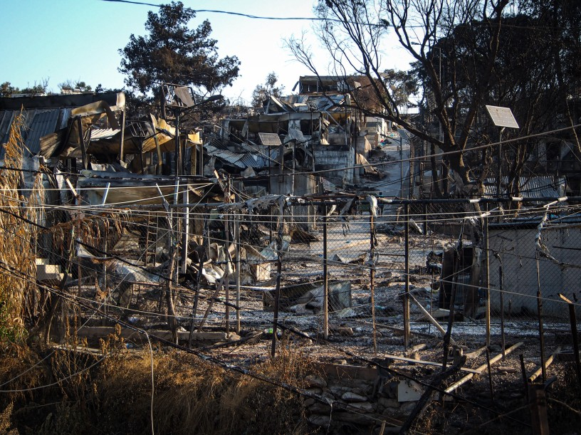
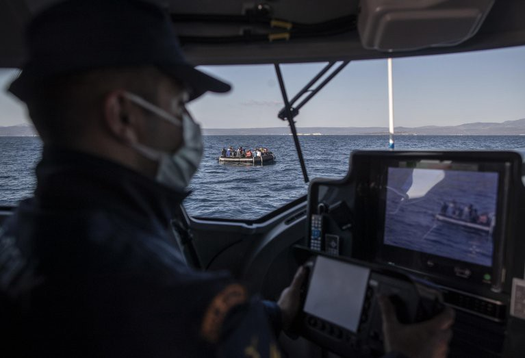
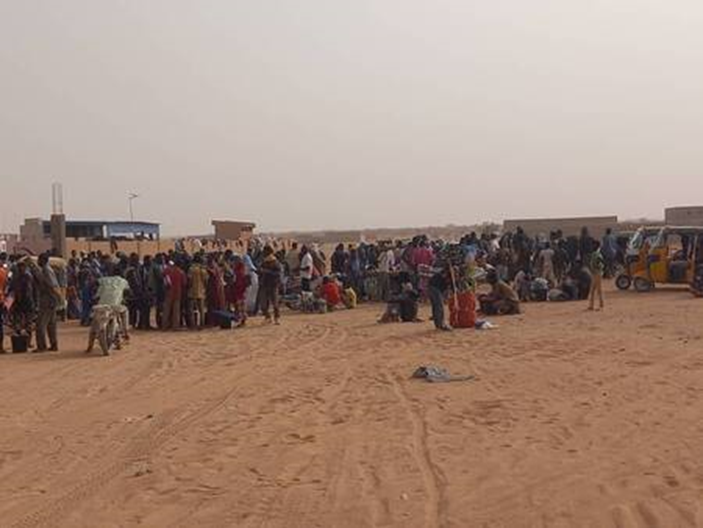

**AYS News Digest 6/4/22: A rise in violence against Ukrainian refugees in Germany**

Four Afghans deported from Turkey to Syria/FRONTEX’s concerns of human trafficking at the Ukraine border/The transformation of RICs in Greece/Italy arrests refugees and asylum seekers on charges of human smuggling/Germany has halted deportations to eastern European countries/Ten proposals from Utopia 56 for a more humane refugee reception system/and much more…

Source: The International Law Blog

**TURKEY**

[**Four Afghans stranded in north\-western Syria**](https://www.middleeastmonitor.com/20220404-four-afghan-refugees-are-stranded-in-syrias-idlib-after-being-deported-by-turkey/?fbclid=IwAR3jtWH0BIr_9dp0KoPxAgcwqFxaIGIwBcFHZSgF-_R8wUDccQODWH_WemI) **after they were deported by Turkish authorities**

The young men \(Khiyali Gul, Nasratullah, Safiallah, and Attaallah\) spoke with Middle East Eye\. Following the Taliban’s takeover last August, the young men fled from Jalalabad and made it to Ankara, Turkey\. They were then found by Turkish authorities and the men informed the authorities they were Afghans\.

> “The police caught us and we were persecuted … We begged them to send us to Greece\. They said they would send us to Greece or Afghanistan but they sent us to Syria\.” — Nasratullah 

Upon arrival in Syria, they were arrested and detained for a month before the opposition militant group Hay’at Tahrir Al\-Sham released them\. This was only after they had finally convinced the group that they were not Iranian agents, and they supported the Syrian revolution\.

They are currently living in hiding, trying to gain enough money to cross into Turkey and then into Europe\.

There have been multiple reports of Syrians being deported back to Syria from Turkey, and this is also not the first time non\-Syrians have been deported to Syria\. A previous [AYS Special](ays-special-from-turkey-deportations-to-syria-e2ea70e20b14) explains in further detail the circumstances for many refugees in Turkey\.

**FRONTEX/EU External borders**

Fabrice Leggeri, Frontex Executive Director, talks about [his concerns of human trafficking and gun smuggling](https://frontex.europa.eu/media-centre/news/news-release/fabrice-leggeri-we-are-concerned-about-human-trafficking-and-gun-smuggling--ZU83Tk?fbclid=IwAR24bvDnpOxhFREzLdA_iBE55Dptc-mABDTIRL50tMa25VS0xv1HkoerULA) on the borders between Ukraine and its neighbouring countries\. He further discusses how Frontex has supported these neighbouring countries in the last few weeks, since the beginning of the Russian invasion of Ukraine\.

**The hotspot approach, intended to be a temporary method of managing increasing numbers of asylum seekers in Greece and Italy, has now become a permanent element of EU migration policy**

[An article by Josepha Close](https://internationallaw.blog/2022/04/04/the-eu-policy-of-containment-of-asylum-seekers-at-the-borders-of-europe-1-the-hotspot-approach/?fbclid=IwAR0zh2B19AcgHoQJsGlA-ea1awNVO83I2-n8FzNr8uB59uYSUJjRHcAt1-Y) , in the International Law Blog, details how reception and identification centres \(RIC\) have transformed from temporary functions of movement to a mechanism of containing asylum seekers, with a greater intention of return\.

They were initially set up in 2015 as a response to the increasing numbers of asylum seekers attempting to reach Europe, and aimed to be used in conjunction with methods of relocation\. The 2015 Agenda on Migration listed the European Asylum Office and Frontex as agencies who were responsible for supporting member states\. The initial RIC, Moria, Lesvos, was set up in October 2015, followed by others on Chios, Samos, Leros, and Kos, and then in southern Italy in 2016\.

Josepha explains that in Italy the registration centres have tended to continue with the approach of migrants passing through rapidly, staying no more than one or two days\. However in Greece, following the EU\-Turkey agreement in 2016, any asylum seeker who did not apply for asylum or who received a negative decision on their asylum claim would be returned to Turkey\. The RICs became essential throughout the asylum process, as asylum seekers now needed to apply for asylum in Greece before moving on into Europe\.

As a result, whilst fewer people travelled to Greece from Turkey, the numbers of people staying in the reception centres awaiting their decision grew exponentially\. Conditions in the camps deteriorated, they became overcrowded, leading to even greater tensions between those staying in the camps\. Over the years, there have been multiple reports of human rights violations, and individuals being deprived of their basic needs\.

**UKRAINE**

**AYS and many organisations and media outlets have reported on the racism experienced by non\-Ukrainians fleeing Ukraine**

[This article](https://www.dw.com/en/ukraine-war-african-students-face-russian-missiles-and-racism/a-61356066?fbclid=IwAR0usBI13zHpjZljFX9bMYFsJDOvsiMr1VXd3QO696wkJ_oHHjxBzTxBtZY) details the experience of Olufunmilola Bamidele, a Nigerian post\-graduate student who had to flee Ukraine, and her experiences of racism along this journey\. She talks of racial discrimination at train stations and bus stops, and was fearful of being rejected and discriminated against\. There have been multiple stories of African, Indian and Arab students left stranded and prevented from getting on public transport to flee\.

**ITALY**

[**Italy using human smuggling laws to criminalise and imprison refugees and asylum seekers**](https://www.bbc.co.uk/news/world-africa-60492918)

Refugees and asylum seekers are charged using weak evidence, and they often lack access to adequate legal support\. It has also been reported that minors have ended up in adult prisons\.

■■■■■■■■■■■■■■ 
> **[borderline-europe](https://twitter.com/BorderlineEurop) @ Twitter Says:** 

> > Cheikh is one of many people on the move who have been jailed for steering the boat. According to official figures, 562 ppl are currently in Italian prisons because of this. He recently spoke to the BBC about the criminalisation of boat drivers in Italy:
🔍[bbc.com/news/world-afr…](https://www.bbc.com/news/world-africa-60492918) https://t.co/pdpc7k7yNa 

> **Tweeted at [2022-04-06 15:59:26](https://twitter.com/borderlineeurop/status/1511735338523373579).** 

■■■■■■■■■■■■■■ 

**SEA/SAR**

168 people were [stopped by the Turkish coast guard](https://www.infomigrants.net/en/post/39681/turkey-stops-168-italybound-migrants-in-aegean?fbclid=IwAR39dA8KJLi7jfiq7nbqjpOC1M43PdUpqSpMwbfRC2oSEETMT29v1E6Dbac) on Tuesday, as authorities believed they were heading to Italy\. In March, more than 17,000 migrants were stopped in Turkey\.

Source: InfoMigrants

**MSF Sea are STILL trying to find a safe port to disembark the survivors after they were rescued on 29 March 2022** \. The extreme weather conditions have made it even more imperative that the 113 people on board find a safe port\.

■■■■■■■■■■■■■■ 
> **[MSF International](https://twitter.com/MSF) @ Twitter Says:** 

> > On the afternoon of 29 March, @[MSF_Sea](https://twitter.com/MSF_Sea) teams on board the #GeoBarents rescued 113 people from a rubber boat in distress.

We are waiting for a port of safety to disembark the survivors. 

[twitter.com/MSF_Sea/status…](https://twitter.com/MSF_Sea/status/1511367956906844166?s=20&t=GsGLU5L1tM5J6M8MXPzkgA) 

> **Tweeted at [2022-04-06 14:06:09](https://twitter.com/msf/status/1511706831948820481).** 

■■■■■■■■■■■■■■ 

**GREECE**

**The IRC has published a report exploring the idea of an Independent Border Monitoring Mechanism \(IBMM\) in Greece that would investigate allegations of fundamental human rights allegations\.**

You can read the full report here: [IRC Report](https://eu.rescue.org/report/mapping-potential-elements-independent-border-monitoring-mechanism-greece?fbclid=IwAR2iQPSin0pEIVLGUqUT0ZbM52uc1qmVqmvSH1ScYrSDNDBYsjM02wA-BcI)

■■■■■■■■■■■■■■ 
> **[International Rescue Committee - EU](https://twitter.com/RESCUE_EU) @ Twitter Says:** 

> > Last year, 12,000+ people in search of protection were reportedly pushed back from EU borders.

Today, as MEPs debate pushbacks, they must press EU states to create truly Independent Border Monitoring Mechanisms.

In Greece, this process is moving in a worrying direction... (1/3) https://t.co/pcC07rHDbd 

> **Tweeted at [2022-04-06 11:22:36](https://twitter.com/rescue_eu/status/1511665674254491648).** 

■■■■■■■■■■■■■■ 

■■■■■■■■■■■■■■ 
> **[Vassilis Tsarnas](https://twitter.com/VassilisTsarnas) @ Twitter Says:** 

> > .@[ErnstCornelia](https://twitter.com/ErnstCornelia): "Some people here don't want to talk about #pushbacks in #Greece. I do: About the coast guard and the manhunters on #Samos, who track down #RefugeesGr, put them on life-threatening inflatable boats and push them back. And about the many deaths in #Evros @[Left_EU](https://twitter.com/Left_EU)" 

> **Tweeted at [2022-04-06 18:35:52](https://twitter.com/vassilistsarnas/status/1511774706600394763).** 

■■■■■■■■■■■■■■ 

■■■■■■■■■■■■■■ 
> **[Lena K.](https://twitter.com/lk2015r) @ Twitter Says:** 

> > In the EP debate on violations &amp; #pushbacks at EU borders, 🇬🇷 MEP E. Vosenberg-Vrionidi (of the ruling New Democracy) cited the National Transparency Authority audit to deny #pushbacks in Greece. In case it wasn't clear what the purpose of the audit was. 
[europarl.europa.eu/plenary/en/hom…](https://www.europarl.europa.eu/plenary/en/home.html) 

> **Tweeted at [2022-04-06 16:40:07](https://twitter.com/lk2015r/status/1511745577050116107).** 

■■■■■■■■■■■■■■ 

**Update on the numbers of individuals on Lesvos and a breakdown of the demographics:**

■■■■■■■■■■■■■■ 
> **[Franziska Grillmeier](https://twitter.com/f_grillmeier) @ Twitter Says:** 

> > Update from #Lesvos: 

≈ 1,830 refugees &amp; asylum-seekers reside on island. Of those, 1,589 reside in #Moria2. The majority of the population is from #Afghanistan (64%), #Somalia (15%) &amp; #Syria (4%).

Men: 51% of population, women: 23% &amp; children: 26%. acc. to @[UNHCRGreece](https://twitter.com/UNHCRGreece) 

> **Tweeted at [2022-04-06 12:02:28](https://twitter.com/f_grillmeier/status/1511675704848658440).** 

■■■■■■■■■■■■■■ 

**In 2016, [over 1,500 were pushed back from North Macedonia to Greece](https://www.ecchr.eu/en/press-release/ecthr-mass-pushback-refugees-greece-idomeni/) , being forced through a hole in the fence by armed officers\.** The ECtHR found that this mass pushback did not violate their rights\. The group of refugees were staying in horrific conditions with no access to state support in a camp in Idomeni\.

> “There is no justice for the eight plaintiffs and the hundreds more unnamed victims of this illegal and violent pushback\. The violence, the degradation, the denial of individual rights remains unpunished\. It’s a bleak day for those in search of protection and for human rights protection in Europe,” adds Karl Kopp from PRO ASYL\. 

■■■■■■■■■■■■■■ 
> **[ECCHR](https://twitter.com/ECCHRBerlin) @ Twitter Says:** 

> > 🚨Alarming #ECHR judgment!
1.500 forced back through hole in fence to dire conditions in #Idomeni #Greece in 2016.
Borders were shut,group was peaceful.
❌#ECHR says #pushback lawful, claiming there was access to asylum where there was none.
Press release👉[ecchr.eu/en/press-relea…](https://www.ecchr.eu/en/press-release/ecthr-mass-pushback-refugees-greece-idomeni/) https://t.co/n4TlRjrH3f 

> **Tweeted at [2022-04-05 12:08:40](https://twitter.com/ecchrberlin/status/1511314879340232718).** 

■■■■■■■■■■■■■■ 

**Last night a boat carrying 59 people, many of them small children, was heading towards Lesvos south\.**

At 3am, about one kilometer from the south of Lesvos, the boat was stopped by a vessel from the Greek coast guard\. The Greek officers destroyed their engine and towed them away from Lesvos\. Men, women and children were left drifting in the dark in the open sea\.

**On 5 April, a man died after being hit by a train going from Thessaloniki to Idomeni\.** Two other men were also injured\. It has been reported that they were all refugees:

■■■■■■■■■■■■■■ 
> **[RSA](https://twitter.com/rspaegean) @ Twitter Says:** 

> > A man died yesterday after being swept away by a commercial train travelling from Thessaloniki to #Idomeni. Two other men were also swept away and are injured.Reportedly they are #refugeesgr who were following the railway line to the #border.
[alterthess.gr/enas-nekros-dy…](https://alterthess.gr/enas-nekros-dyo-traymaties-apo-parasyrsi-emporikis-amaxostoichias-sto-kilkis/) 

> **Tweeted at [2022-04-06 09:58:15](https://twitter.com/rspaegean/status/1511644446022057988).** 

■■■■■■■■■■■■■■ 

**A report by Human Rights Watch is being published on 7 April 2022:**

■■■■■■■■■■■■■■ 
> **[Eva Cossé](https://twitter.com/Eva_Cosse) @ Twitter Says:** 

> > 📢New @[hrw](https://twitter.com/hrw) report coming out tomorrow, documenting how #Greece police are using people who appear to be of Middle Eastern or South Asian origin, to force migrants onto dinghies, take them to the middle of the Evros River, and force them back to Turkey.

For more info DM me https://t.co/gi0IUmAYku 

> **Tweeted at [2022-04-06 12:31:00](https://twitter.com/eva_cosse/status/1511682886231076874).** 

■■■■■■■■■■■■■■ 

**GERMANY**

**For the first time, Germany has halted the deportation of people to eastern European nations**

All 16 states have said they have [suspended deportations to Ukraine, Russia and Moldova](https://www.infomigrants.net/en/post/39655/germany-halts-deportations-to-eastern-european-countries?fbclid=IwAR24bvDnpOxhFREzLdA_iBE55Dptc-mABDTIRL50tMa25VS0xv1HkoerULA) until further notice\. The vast majority of states have also temporarily halted deportations to Poland, Romania, the Czech Republic and Slovakia\.

[**InfoMigrants**](https://www.infomigrants.net/en/post/39698/germany-reports-of-more-attacks-on-ukrainians?fbclid=IwAR1KR3KsuiHsZuiLYy3ZExkoBSaClK-83azS8VmpN1zspPWNcDz6J5K-p_o) **reports there has been an increase in violence against Ukrainian nationals since Russia’s invasion of Ukraine**

Since the end of February, there have been 109 offenses against Ukrainian nationals\. Furthermore, at least nine cases of sexual assault against women have been reported, and in western Germany, individuals pretending to be police officers robbed a Ukrainian family\.

**ALGERIA**

1693 people have been sent from Algeria to Niger on 20 and 22 March, raising [the number of individuals expelled to Niger to 5069 since the beginning of 2022](https://alarmephonesahara.info/fr/blog/posts/mars-2022-arrivee-d-autres-convois-d-expulsion-situation-precaire-a-assamaka-et-dans-les-villes-du-niger?fbclid=IwAR2qsXj1QfuxUEg6Il5UCjuKGQhkDw92sm4b_d0Ilv6U_5efNzFIh323Qfo) \.

Source: Alarm Phone Sahara

Alarm Phone Sahara have stated there are increasing concerns and risks for these individuals, particularly those who have not yet been fully taken care of at the IOM camps\. Reports have shown a lack of food and medical equipment assistance in Assamaka, along with deteriorating conditions in other cities, such as, Arlit and Agadez\.

**FRANCE**

Utopia 56 has created 10 proposals for political leaders to provide a more supportive, dignified and unconditional welcome to refugees and asylum seekers\. This comes in the midst of an election period and aims to encourage a reconstruction of the reception system in both France and across Europe\. You can find more information on the 10 proposals here: [Utopia 56 Proposals](https://utopia56.org/nos-10-propositions-pour-un-accueil-digne-solidaire-et-inconditionnel/?fbclid=IwAR0lgXDgwbBhrz4lR14W-g9RSq3N1W3gIqDv6hfKVVpbMSW_jEOvpzcrJZg)

**Extra Resources:**
- InfoMigrants \- Canary Islands: More migrants risk deadly Atlantic Route

- Los Angeles Times — ‘Flee’ didn’t win an Oscar, but its refugee story couldn’t be more timely

- The Guardian — ‘Homes for Ukraine’ is just a slogan — as I found out by trying to welcome a refugee

**Find daily updates and special reports on our [Medium page](https://medium.com/are-you-syrious) \.**

**If you wish to contribute, either by writing a report or a story, or by joining the info gathering team, please let us know\.**

**We strive to echo correct news from the ground through collaboration and fairness\. Every effort has been made to credit organisations and individuals with regard to the supply of information, video, and photo material \(in cases where the source wanted to be accredited\) \. Please notify us regarding corrections\.**

**If there’s anything you want to share or comment, contact us through Facebook, Twitter or write to: areyousyrious@gmail\.com**

_Converted [Medium Post](https://medium.com/are-you-syrious/ays-news-digest-6-4-22-increased-violence-against-ukrainian-refugees-in-germany-d09142e9bcdf) by [ZMediumToMarkdown](https://github.com/ZhgChgLi/ZMediumToMarkdown)._
