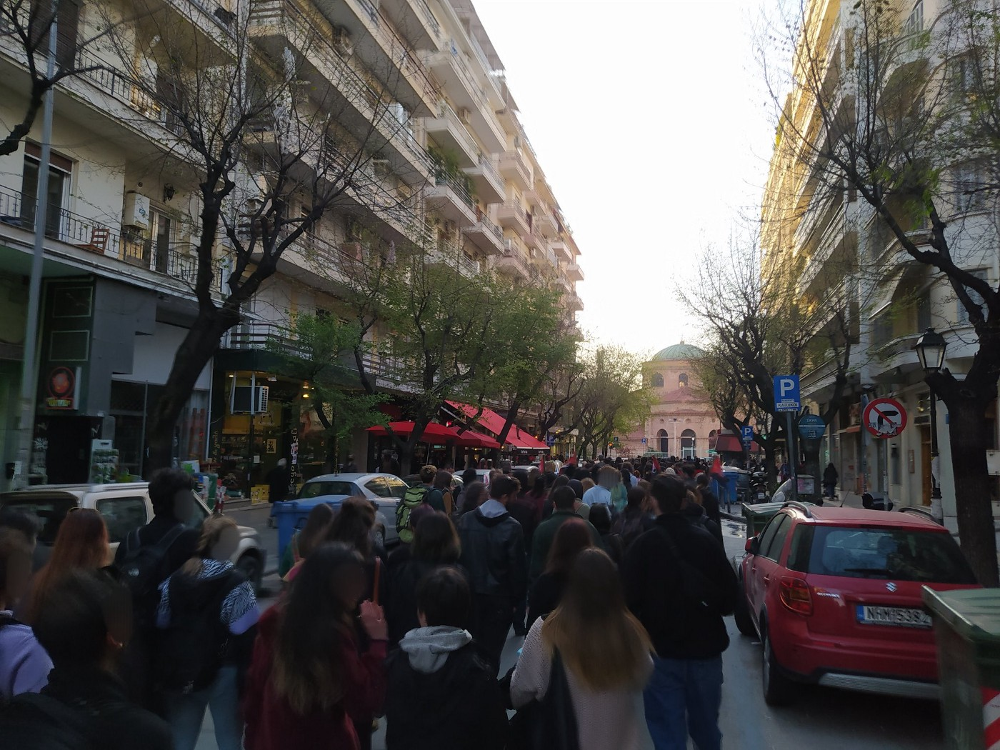
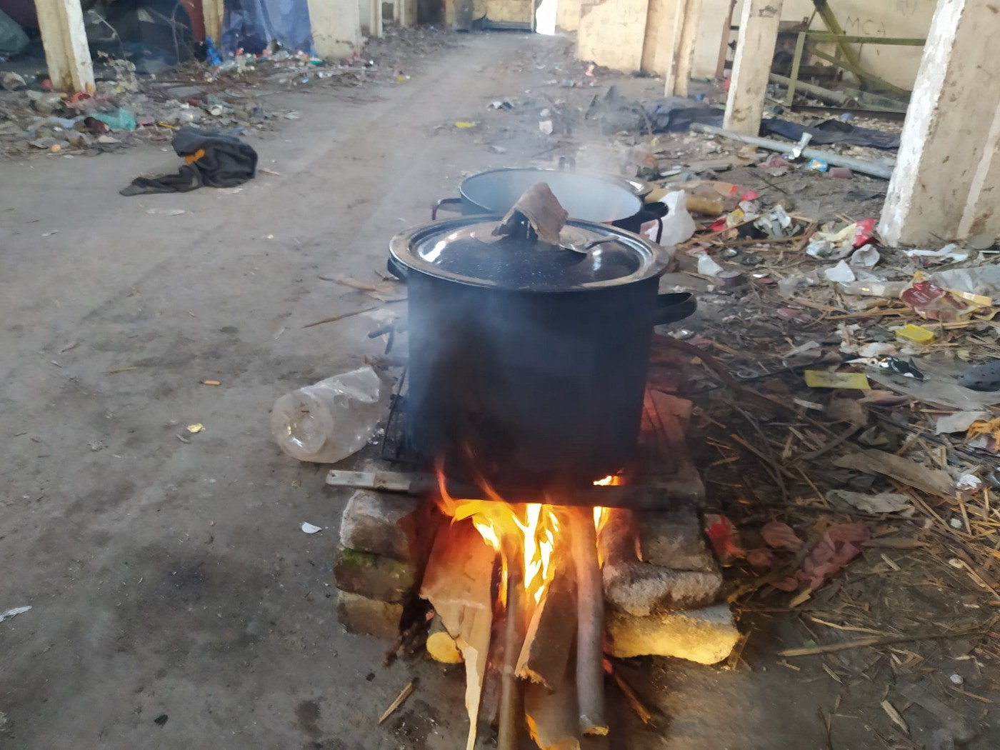
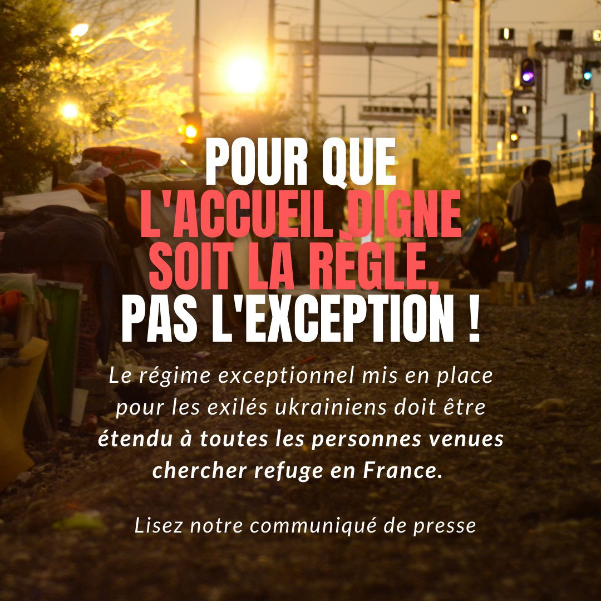
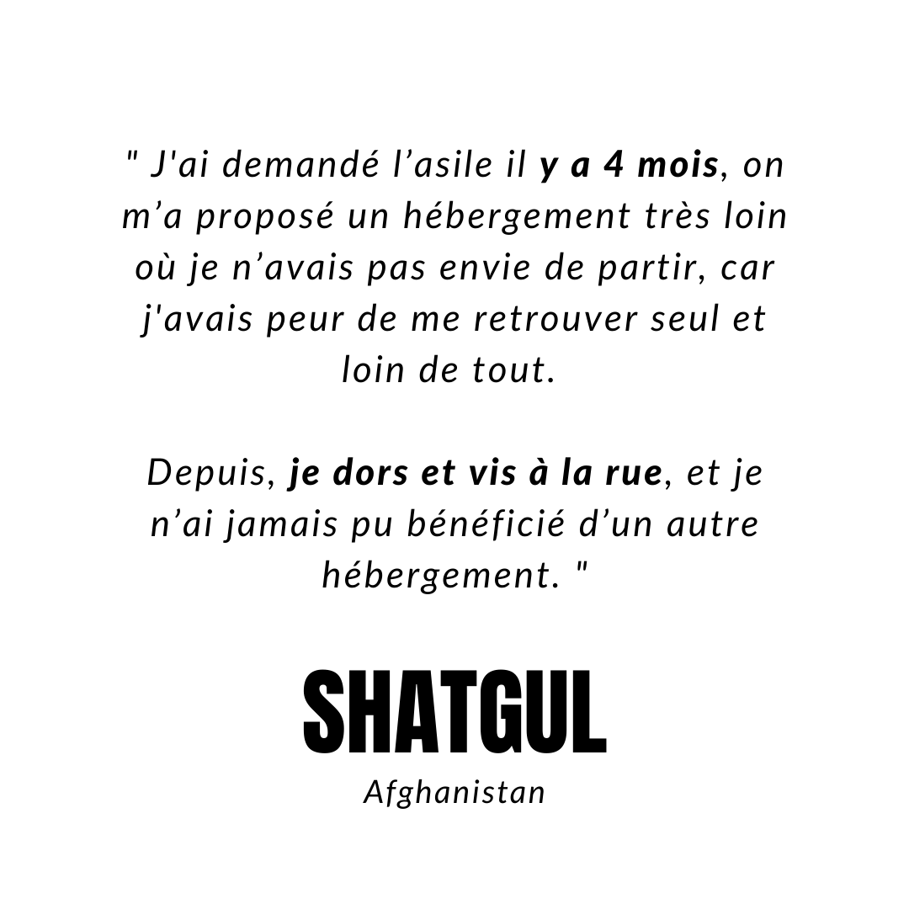
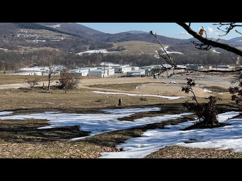

### AYS News Digest 15/4/22: Minors in the border area with Belarus need urgent support
#### BAMF ordered the examination of the more than 43\.000 pending asylum applications / Pushbacks continue in the south of Spain / Is Danish externalization compatible with adequate refugee protection? / podcasts, interviews and reading recommendations \+ more news

](assets/c06cb1a6591b/0*oOYFXfkAfSfKqkc2)

Photo: [worldsbetweenlines](https://unsplash.com/@worldsbetweenlines)

A 16\-year\-old boy from Yemen [remains unconscious at the border](https://www.facebook.com/watch/?v=1032738290956381) between Poland and Belarus, as we [reported](ays-news-digest-13-04-2022-unconscious-youth-at-polish-border-43bb843947e3) previously\.

Grupa Granica once again reported that he has not received any help in the meantime\. His brothers managed to arrange for him to be transported to Minsk, where medical assistance is being sought\.

> Many other children are currently in the border area\. They all need immediate help\! 

■■■■■■■■■■■■■■ 
> **[Grupa Granica](https://twitter.com/GrupaGranica) @ Twitter Says:** 

> > Chory 16-latek nadal przebywa w Mińsku, o czym poinformował nas jego brat. Mimo wielkiego zainteresowania sprawą nie otrzymał żadnej pomocy. Tymczasem @[Straz_Graniczna](https://twitter.com/Straz_Graniczna) zajmuje się publikowaniem filmików z wyczerpanymi z odwodnienia ludźmi, biernie obserwując ich cierpienie. 

> **Tweeted at [2022-04-15 11:20:39](https://twitter.com/grupagranica/status/1514926672298098688).** 

■■■■■■■■■■■■■■ 

> There are many unaccompanied children on the PL\-BY border\. Their cases are not dealt with by family courts, welfare institutions or even the police\. They are thrown behind barbed wire to the state, which starves and tortures them\. These kids are terrified and beg for rescue, which is not forthcoming, h _uman rights Lawyer Marta Górczyńska said\._ 

■■■■■■■■■■■■■■ 
> **[Katy Fallon](https://twitter.com/katymfallon) @ Twitter Says:** 

> > Protest in Warsaw against criminalisation of humanitarian aid on Belarusian border and in solidarity with refugees arriving at Poland’s other border - that with Belarus. https://t.co/7jhpNYmdRS 

> **Tweeted at [2022-04-14 17:05:50](https://twitter.com/katymfallon/status/1514651153275011082).** 

■■■■■■■■■■■■■■ 

#### GREECE
### Thessaloniki protest against evictions \(photo\)

](assets/c06cb1a6591b/0*1w8kwzOHbdgZ9lx5)

Photos: [Land & Freedom](https://twitter.com/laf_portal)

#### SERBIA
### Violent pushbacks from Hungary continue

At the border with Hungary, people on the move are again reporting violence by the Hungarian border police against them, KlikAktiv reports\.

](assets/c06cb1a6591b/0*FesSXU6e0zvA3jKB)

[Klikaktiv — Centar za razvoj socijalnih politika](https://web.facebook.com/klikaktiv/?__tn__=-UC*F)

> For months, since May 2021, the people we met have claimed that the Hungarian police began to treat them more normally — without beating them, they would return them to Serbian territory, but even then they still talked about confiscating money and how they were returned to Serbian territory illegally — the police would only return them to Serbia on the green border, without papers and without the presence of the Serbian police\. Nevertheless, people generally felt relieved, because the violence on that border has significantly decreased after so many years\. 

#### THE SEA

The Spanish government continues the illegal deportations from the Canaries to Western Sahara\. Spain and Morocco continue being allies in violating the Geneva Convention, Alarm Phone teams [note](https://l.facebook.com/l.php?u=https%3A%2F%2Ftwitter.com%2Falarm_phone%2Fstatus%2F1514917067773911041%3Ffbclid%3DIwAR0Dyta8sB8iUiWtMKQgqB61GAXZ4I78_XiA7R8btOZ7-_UaOaCqWTVQ8ls&h=AT0QsrweaVJ4I4rfZFfvwpZWgEScoqoq4Nb1anZzE0zOEoGxJRiW9mF8rlEpkgb0UDhjyYRPmnXtCUJfNyN_A-Zk4mni0oJe1zK7r23S2aBpsMBFIPKw9145QfgH154d0xU8po3ZI36HVg&__tn__=R]-R&c[0]=AT1V-wIH6IbU-LQTF3KFS_CzWv3akPoWF7hxtdma7-34rUL1nPWcp_BYlKyzZ9CCVGzxGNzDR1Xd1LD-r_OCluYSJBopFxTB-yx_6qc77QbTB79DjqtxB5z7JzvPfwaQe8U75wJpFEoH4CKedLTEXpFvaA1HUw9ej7tDumS7OuxGckSd9WPZfSTuXUyizwow9mQV9yj8eW8M0wn1Txj6jUG0uHDuB_M) \.

■■■■■■■■■■■■■■ 
> **[Alarm Phone](https://twitter.com/alarm_phone) @ Twitter Says:** 

> > At the 18th day after the announcement of the agreements between @[sanchezcastejon](https://twitter.com/sanchezcastejon) &amp; #Morocco over #WesternSahara, it is becoming more and more tragic for black people in Laayoune: Continuous raids, robbery, torture, moving away from the coast &amp; deportation. 
#BlackLivesMatters https://t.co/iP3X8c9J7I 

> **Tweeted at [2022-04-12 16:28:35](https://twitter.com/alarm_phone/status/1513917003668635657).** 

■■■■■■■■■■■■■■ 

We continue following the Sea Watch 3 team’s nerve\-wracking quest for a safe port, this time with some good news:

■■■■■■■■■■■■■■ 
> **[Sea-Watch International](https://twitter.com/seawatch_intl) @ Twitter Says:** 

> > 🔴 The wait is over! The #SeaWatch3 has a port of safety. Tomorrow morning, our ship will enter the port of Trapani. We are so incredibly relieved that our guests, who have experienced and survived the most terrible things, will soon finally be allowed ashore! https://t.co/VC0SPlNaYW 

> **Tweeted at [2022-04-15 14:42:32](https://twitter.com/seawatch_intl/status/1514977478476972036).** 

■■■■■■■■■■■■■■ 

#### FRANCE

The French Presidency of the Council is seeking EU\-wide comparisons of every DNA profile held by police forces against all those held by other national police forces, as well as the EU policing agency Europol, as part of plans to upgrade the ‘Prüm’ network of police databases\. It also hopes to automate the police exchange of facial images by eliminating requirements for human review, Statewatch [reports](https://www.statewatch.org/news/2022/april/eu-policing-france-proposes-massive-eu-wide-dna-sweep-automated-exchange-of-facial-images/?fbclid=IwAR2XvGjvmpOGgmtAAk5G2ECh5M6PRrzI6C-96uz1Gjn-QCE407FeF9eZnE0) \.
### Ease access to housing and protection for all\!

Organisations active in the field in northern France demand a stop to the hypocritical attitude of Europeans when it comes to universal rights:

> Since the invasion of Ukraine, we have witnessed a strong mobilization to welcome people fleeing war, and the measures put in place testify to the possibility of offering a dignified welcome for all\.
 

> With 35 associations, we are calling for immediate and lasting measures to be put in place to help all those who are seeking protection in France\. 

](assets/c06cb1a6591b/1*ZFuvGjnrS4bbUC17H5xD6w.jpeg)

by [Solidarité migrants Wilson](https://web.facebook.com/Solidarit%C3%A9-migrants-Wilson-598228360377940/?__cft__[0]=AZVxbP-Fn0cLNC6olC1BBIY9p3Xmjd2mWoTAOImeh-xiRg5U7k7i52AAk99HMXnjJQtHaPwNyr7iUXA0K-Lo6gmiHxdKsZ_Ry8diXk3x8tLaRI3pZIJRtb_vLa5UVXgjqlyComvg2EeqJWsWe-AvDlWp78A9_hJmQBWJ-KK1-ubDiNN1JT5pHJ6PMmF1M1mJri745HUgGxGu2sxJBy8ej2ek&__tn__=-UC%2CP-y-R)
#### SPAIN
### Minors who were under Spanish guardianship until turning 18 face homelessness in Ceuta

> Youssef, for example, is an 18 year old teenager who has been living in one of the minor centers for around 8 months\. At the beginning of this year, the prosecutor’s office for minors decided to carry out the humiliating procedure for his age determination\. As a result of the “decreto de mayoría de edad”, in February 2022, he was regarded as over 18\. Due to now being legally an adult, he had no place in the minor center — since then he has had to live on the street, _local NNK team [reported](https://web.facebook.com/NoNameKitchenBelgrade/posts/1456687661396180?__cft__[0]=AZU5CtLbLoqZ5hmD1kxzQfRM2AGIpIxLBtpgCkR50Ws3Fs8TV4MX_yojvAfXGhz2IrgEI_Laprf7xGfxD7Fl31EOmExeSY53OMAac-9lfBO5pd5RQwda-CADR5TYsb0LTQyCLVy60vsiwnEOO_FRfgRkbnt_I9z3_m94W0Gn2uIlngJan-LLlaRDKzuHf8xxNq46fiIZS-gkhL1krdryn9ql&__tn__=R]-R) \._ 

#### GERMANY
### BAMF announces asylum procedures for asylum seekers already recognized in Greece

Given that they do not feel bound by the decision from Greece, the Federal Office for Migration and Refugees has not processed further asylum applications from asylum seekers who have already been recognized as refugees in Greece or who have received subsidiary protection\.

More than two years after freezing the asylum procedures of beneficiaries of international protection status from Greece, the German Federal Office for Migration and Refugees has ordered the examination of the more than 43\.000 pending asylum applications\.

Also, deportations to Greece are no longer [generally prohibited by German administrative courts\.](https://www.asyl.net/fileadmin/user_upload/publikationen/Arbeitshilfen/2021-6_rues_griechenland_web.pdf) However, Pro Asyl asked BAMF directly and it seems that the asylum applications will not be rejected as inadmissible\. 
“The sword of Damocles of an impending deportation to Greece should therefore be off the table in most cases,” Pro Asyl [writes](https://www.proasyl.de/news/anerkannt-in-griechenland-abgelehnt-in-deutschland-die-odyssee-der-anerkannten/) \.
#### FRONTEX
### Matthias Monroy on migration control from space

All the information Frontex collects at the EU’s external borders is fed into the EUROSUR border surveillance system, which went into operation in 2014\. From space, this data comes from the satellites of the EU’s Copernicus Earth Observation Programme, which is used for security, civil protection, environmental management and climate change research\. To date, the EU has launched several optical and radar\-based reconnaissance satellites for the programme\. The space data are received and processed by the EU Satellite Centre \(SatCen\) in Torrejón, Spain, which has the status of an agency\.

Read [more](https://digit.site36.net/2022/04/14/frontex-migration-control-from-space/?fbclid=IwAR1ZhOQRoKNmUp9uSWER3sJ5EZjUu34WOEfUhWm21AzHz8EjNjZtiXAUNH8) \.
#### WORTH READING & WATCHING

> In November of 2021, the Danish government [put](https://www.theguardian.com/world/2021/jun/03/denmark-passes-law-to-let-it-relocate-asylum-seekers-outside-europe) forth a bill seeking to collaborate with third parties in order to relocate asylum seekers out of the EU while their case was being reviewed, also known as externalization\. The outsourcing of administrative obligations, first explored during the 2015 migration crisis, has been on the rise in the EU, despite sustained criticisms\. Is externalization compatible with adequate refugee protection? 

[](https://l.facebook.com/l.php?u=https%3A%2F%2Fmjps.ssmu.ca%2F2022%2F04%2F11%2Fthe-danish-bill-l-226-offshoring-asylum-outsourcing-hope%3Ffbclid%3DIwAR3epmvceBGDRFqZioF0fAEbnEyCZFhVDGqid-TLc_0euZrjlgbDBTp1kyc&h=AT0_d4ldbM9W-vXJkOxfF3xZs3GOoOOmWHHZeSETizQeeQfboYieKL9V5Xk2rgwvsaqI5r8U4ooomdy5vS3A9RJ_5IDWwLflipeoRQtOMKuQ2dUiU1w5IQiBjkx6pNLJDg&__tn__=%2CmH-R&c[0]=AT1Br61XRLHlshxR6neKevTMo4RHp2D9lMOS1tAEB2YQ5n-BcC-LASowpDLEV6VLOfNerA-FhZn-IfRyJGR_QLOLjqLBkB2YMStLCY63VZOdluaMvQB84TbKhw2lfN6bEYK1u_4Ijw_epS-7O5-S74tzMQNBgY1PuHlDXHZh_O36PEOnkhSKOw37newb79s8sislhLD41ruW_YgGL-Y)

- Smugglers or saviours? Poland’s double standards:

[](https://l.facebook.com/l.php?u=https%3A%2F%2Fwww.theguardian.com%2Fglobal-development%2F2022%2Fapr%2F15%2Fsmugglers-or-saviours-poland-divided-stance-on-aiding-refugees-ukraine-belarus%3Ffbclid%3DIwAR0NO6LBqJnFu_hKAFDPgHeGuEKSMWtUeO_ib1OkVbtMWiUHKI_ltLyN5oU&h=AT3T0eDKL4AxgmwBkSoF4lj_ym1hM2nk1ix2YrLhxqVwj_qTxddva2tkdOaUedqmLjDVja8-nKhk-zwsNdUdpWPVuvPDMeiDLoVekDqBdeSQ1rmrBOEQgPphia9W_VQcf1dITYLyevjqjA&__tn__=R]-R&c[0]=AT2HrIGLp4mSeGXBLayIEGHfWWBfrm1bQbiizxB-t499krm-rdjaJA2b0ejo7naQXdCzwd5_fupeByQbe7NCIYJjLoJOSyWMvgW7SMtlL6MW6UeJMHGxI7nPAtEiSjqkY_Gv7g-LO3OGiGjdjDfcn37BN_aaJMVtmd6yMp6se2C4fPlTlthcSzUqbEgaw1j3P9-MjXmAAiZY)

- heads up for some interesting interviews:

- podcast with [Franziska Grillmeier](https://www.zeit.de/autoren/G/Franziska_Grillmeier/index?fbclid=IwAR1kt0MS80KfyvbzwqqBXSL6H52BkvUhO90bTms499VRtjUCYp5hKZh8BvU) on situation in Greece:

[](https://l.facebook.com/l.php?u=https%3A%2F%2Fwww.zeit.de%2Fpolitik%2F2022-04%2Fgriechisch-tuerkische-grenze-grenzschutz-nachrichtenpodcast%3Ffbclid%3DIwAR2yqJGPNDY084arRGRrEYZUrlJHExud3eqmYoTqL13SpmtNR0WBteTPRZ4&h=AT0lB6Nk8v0jGW5Ow8p2CqL0qGZjYjHLojAgmlS-AXLaz6oEvgeojiiBdIjTIEHoqDW02g0nw3vR50rOj_t6iEihLoZyOWOInivC6d_C0a6p4_eu7TlqI54H2uQzFi3wXw&__tn__=-UK-R&c[0]=AT1wZcocRlzSg8wC-D0nV5Oyk4-5ec00c11baFyA0jQaNcRx6q1wLUUc6Eq4BnlRu7Rlf6fDkcRsf81-iHivTwudn3hERY4y7_hbmnvrj4xhooCe33mQgIfnluiZXgh2aVmjBJCszDS6da60a8TdeYAkprbn5CHyn1wWlebsAth0EKZrdjtsdtxPhW8i4mVdiUj9QgyW9OAsMieTIKI)

**Find daily updates and special reports on our [Medium page](https://medium.com/are-you-syrious) \.**

**If you wish to contribute, either by writing a report or a story, or by joining the info gathering team, please let us know\.**

**We strive to echo correct news from the ground through collaboration and fairness\. Every effort has been made to credit organisations and individuals with regard to the supply of information, video, and photo material \(in cases where the source wanted to be accredited\) \. Please notify us regarding corrections\.**

**If there’s anything you want to share or comment, contact us through Facebook, Twitter or write to: areyousyrious@gmail\.com**

_Converted [Medium Post](https://medium.com/are-you-syrious/ays-news-digest-15-4-22-minors-in-the-border-area-with-belarus-need-urgent-support-c06cb1a6591b) by [ZMediumToMarkdown](https://github.com/ZhgChgLi/ZMediumToMarkdown)._
