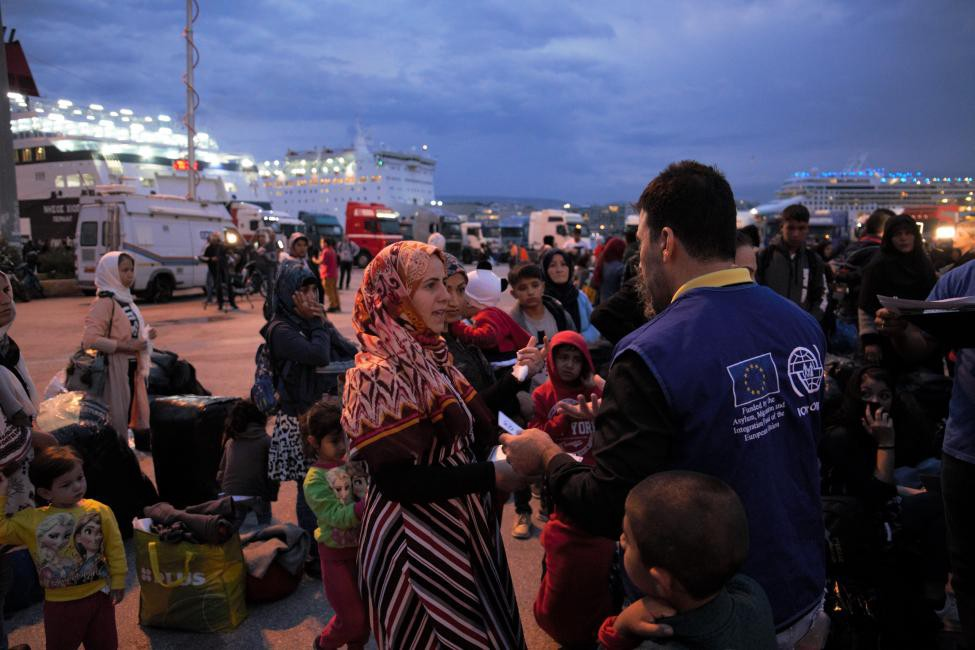

### AYS Digest 20/4/2022: Outsourcing responsibility of refugees and asylum seekers — a deeply flawed, inhumane and dangerous approach

\#FreetheSamos2/Development of electronic surveillance system in Cyprus/Protests outside UNHCR building in Tunisia/A poem to GeoBarents/UK looking towards Israel and Australia, as well as Greece, in its approach to asylum seekers and refugees/Denmark considering offshoring asylum seekers to Rwanda/An asylum seeker shot trying to cross from Turkey to Greece/Further resources and podcasts…

Source: The New Arab — Hundreds protest outside the UK Home Office

**FEATURE**

**The UK using Israel as a model for the transfer of asylum seekers to Rwanda, and Greece as a model for detention centres in the UK**

[In 2014, Israel secretly implemented the deportation of asylum seekers to Rwanda, knowing that this was breaking the 1951 UN Refugee Convention](https://www.middleeasteye.net/opinion/israel-uk-fortress-state-model-new-asylum-policy?fbclid=IwAR18zrJJVbxJbGT9PC9YpErUg0yydQs4LsERoDKCkIcjP2Yp6SgnFMWClH0) \.

This hidden element is evidently not part of the UK’s approach as the UK government has instead tried to justify this policy by stating it aims to prevent people\-smugglers from helping to transport asylum seekers across the Channel\. However, not only is it clear that the UK simply wants to outsource their responsibility onto another country, this argument is exceptionally weak and [the previous implementation of this policy by Israel completely counteracts this argument](https://foreignpolicy.com/2022/04/20/britain-rwanda-refugees-asylum-kagame-authoritarianism/?tpcc=recirc_latest062921&fbclid=IwAR2HYuUtBdLhvEHw0Vqq_66JKXtWBIZKuRCptRULxVgzWf-lmfr-_ZGRF1c) \. Israel gave up on this scheme when it became evident that there was an incredibly high rate of exploitation, human smuggling, and modern\-day slavery for those who had been sent to Rwanda and were fleeing once again, on another dangerous journey\.

■■■■■■■■■■■■■■ 
> **[ECRE](https://twitter.com/ecre) @ Twitter Says:** 

> > ECRE condemns the UK-Rwanda dodgy deal. Unlawful, inhumane, unworkable, expensive, based on false premises, an attempt to distract from political challenges (anyone for a party?) and so much more. Here, our first read-out on the content – 10 issues to consider: https://t.co/nHWfuQ4lPH 

> **Tweeted at [2022-04-20 12:53:05](https://twitter.com/ecre/status/1516761874410487813).** 

■■■■■■■■■■■■■■ 

Rwanda further has a long history of corruption and human rights abuses, as seen by Lewis Mudge, the Central Africa director of Human Rights Watch:

> “Arbitrary detention, ill\-treatment, and torture in official and unofficial detention facilities are commonplace, and fair trial standards are flouted in many cases\.”

Many who were sent to Rwanda from Israel between 2014 and 2017 found themselves in horrendous conditions and left the country soon after arriving\.

It is also important to note that Priti Patel has attempted to make similar deals with countries such as Ghana and Kenya, however these deals were rejected due to criticism from their citizens\. The UK government continues to attempt to leverage other countries to take on the responsibility of welcoming and resettling refugees and asylum seekers who are trying to reach the UK\.

> “The first world’s treatment of refugees is already shameful\. Developing countries [shelter 85 percent of asylum seekers](https://www.unhcr.org/statistics/unhcrstats/618ae4694/mid-year-trends-2021.html) , while western states host only 15 percent\. That disparity is only going to grow\.”

This UNHCR statistic and statement by the Middle East Eye is further supported by Frank Habineza, the president of the Democratic Green Party of Rwanda who states:

> “How could a richer, bigger country be unable to host refugees and think they could just dump them in Rwanda because they have money\. It is unacceptable,”

Source: The Independent — The UK Home Secretary looks at plans for the closed camp on Samos

Whilst the offshoring of asylum seekers has been a core discussion point in the UK recently, Andriani Fili looks at another strategy [the UK is developing which is based on Greece’s system of reception centres](https://www.law.ox.ac.uk/research-subject-groups/centre-criminology/centreborder-criminologies/blog/2022/04/modelling-uk?fbclid=IwAR1rRjKSM17QWL4Pb9FrU7QGP49x8-QbTpOizG-vz3znMtYocEyjSJWCZ4E) \.

> “Since the 1990s, immigration detention and refoulement practices have defined [Greece’s response](https://borderlandscapes.law.ox.ac.uk/regions/greece) \. The [asylum system](https://www.upenn.edu/pennpress/book/15206.html) , managed by an untrained and racist police force, [welcomed only a limited few](https://www.hrw.org/sites/default/files/reports/greeceturkey1108web_0.pdf) \.”

Despite policies being implemented to improve the immigration system, in 2015, the Greek immigration system was under a great deal of national and international criticism\. With the financial support of the European Commission in implementing a ‘hotspot approach’ in Greece, what followed was a disaster\. Camps were built in around 10 days, sometimes fewer\. They were cramped, people had limited access to welfare services, legal aid, and information about their immigration status\. Conditions were deemed inhumane, and exploitation, violence, trafficking, and sexual assault became the norm for many\.

Since 2019, there has been another change towards slowing the movement of asylum seekers and decongesting the Aegean islands\. This has led to the construction of high\-tech, closed camps, which are once again being funded by the European Union\. The camps on Samos, Leros and Kos are already up and running\.

Source: IOM \(October 2019\)

Fili’s overall argument is that whilst the UK Home Secretary is impressed by the systems in Greece and aims to develop similar systems in small towns in the UK, this only reinforces the discriminatory, unequal, and inhumane approach being taken towards asylum seekers and refugees within the UK and across European countries\.

> If the UK government is after a model reception system that puts people under severe mental and physical stress and leaves them stranded within an enormous geographical, physical and psychological limbo, then, in Greece they have come to the right place\. 

**More reading on this topic:**
- _Freemovement_ , Is it legal to outsource the UK’s refugee responsibilities to Rwanda?:

- _Freemovement_ , UK\-Rwanda refugee deal: first thoughts:

- _OpenDemocracy_ , The Rwanda deal is yet another act of colonial violence:

**BALKANS**

■■■■■■■■■■■■■■ 
> **[Balkanbrücke](https://twitter.com/balkanbruecke) @ Twitter Says:** 

> > 📢26.04.22 Balkanbrücke-WEBINAR: New Route, old story- Border Violence along the Serbian/Romanian border

➡️Facebook-Event: [fb.me/e/2swaxZpYx](https://fb.me/e/2swaxZpYx)
➡️Youtube-Stream: [youtu.be/S0Zaf-gO9R4](https://youtu.be/S0Zaf-gO9R4)

What about? Read the Thread 🧵⬇️ https://t.co/Cs3aHyqFmW 

> **Tweeted at [2022-04-20 07:39:37](https://twitter.com/balkanbruecke/status/1516682987907207169).** 

■■■■■■■■■■■■■■ 

**POLAND**

A really insightful interview with individuals providing a warm place to stay for asylum seekers crossing from Belarus to Poland:

■■■■■■■■■■■■■■ 
> **[Piotr Czaban](https://twitter.com/CzabanPiotr) @ Twitter Says:** 

> > Byliśmy wywożeni na Białoruś 20 razy - informują Kurdowie, którzy koczują przy granicy z Polską, niedaleko Czeremchy. Wyrzucono ich z PL podczas świąt. A ostatnio dzisiaj o g. 4 rano. W grupie są dzieci. https://t.co/0VdbRzJ7IV 

> **Tweeted at [2022-04-19 12:31:01](https://twitter.com/czabanpiotr/status/1516393932472688649).** 

■■■■■■■■■■■■■■ 

**GREECE**

A Twitter thread from Alarm Phone provides information on a group of asylum seekers stranded on an islet in the river Evros in Greece\. They informed the authorities, and the group have reported boats owned by the Greek Coastguard coming near to the island\. Alarm Phone are very concerned that they may be pushed back\.

■■■■■■■■■■■■■■ 
> **[Alarm Phone](https://twitter.com/alarm_phone) @ Twitter Says:** 

> > ...Alarm Phone alerted Greek authorities more than a day ago and, according to videos sent by the group, they have been located and addressed to several times by men arriving from the Greek river bank. 2/2 

> **Tweeted at [2022-04-19 19:35:21](https://twitter.com/alarm_phone/status/1516500721100898310).** 

■■■■■■■■■■■■■■ 

**Free the Samos 2**

■■■■■■■■■■■■■■ 
> **[Sea-Watch International](https://twitter.com/seawatch_intl) @ Twitter Says:** 

> > In Greece, after a shipwreck, one of the survivors faces 230 years in prison & a father is arbitrarily charged for the death of his 6-year-old child. The real crime, however, is the #EU border regime and the increasing criminalization of people on the move. https://t.co/ZqPjZMwlA4 

> **Tweeted at [2022-04-19 08:06:36](https://twitter.com/seawatch_intl/status/1516327391102181382).** 

■■■■■■■■■■■■■■ 

Border Criminologies have posted five videos explaining elements of the Greek immigration detention system:

■■■■■■■■■■■■■■ 
> **[Border Criminologies](https://twitter.com/BorderCrim) @ Twitter Says:** 

> > Drawing on our continuing work on immigration detention in #Greece, building upon a number of collaborations with researchers, NGO practitioners and activists we have created 5 short videos that try to explain parts of the immigration detention system in Greece 

> **Tweeted at [2022-04-20 11:31:40](https://twitter.com/bordercrim/status/1516741384354635777).** 

■■■■■■■■■■■■■■ 

A 21\-year\-old man was found dead in a village about 20 km from the Greek\-Turkish border\. The suspected cause of death was hypothermia and exhaustion\. It is still unclear as to where he originally came from\.

The local press reports that residents of Koila village often distribute nuts and olives on the windowsills by the roadside so that passing fugitives can fortify themselves\.

■■■■■■■■■■■■■■ 
> **[Franziska Grillmeier](https://twitter.com/f_grillmeier) @ Twitter Says:** 

> > Gestern wurde vor der Kirche von Koila - einem Dorf etwa 20km vom griechisch-türkischen Grenzfluss #Evros entfernt - ein 21-jähriger geflüchteten Mann tot aufgefunden. 

Die vermutete Todesursache: Unterkühlung und Erschöpfung. 

> **Tweeted at [2022-04-19 09:10:58](https://twitter.com/f_grillmeier/status/1516343588229165056).** 

■■■■■■■■■■■■■■ 

Furthermore, a [n asylum seeker was shot dead trying to cross into Greece from Turkey](https://www.euronews.com/2022/04/18/migrant-found-shot-dead-near-turkish-border-say-greek-police?fbclid=IwAR3nfv3TXTj6zrz5yX1r24qqt9J7M7gI3CQOPKwBnceB9l_Fgc2Ff8kjJmI) \. Whilst it has not yet been confirmed who shot her, the article suggest the shots came from the Turkish side of the border\.

**CYPRUS**

Source: AP News — Migrants walk, near the Pournara Emergency Reception center, in Kokkinotrimithia, on the outskirts of the capital Nicosia, Cyprus, Monday, April 18, 2022\.

A buffer zone that divides the island along ethnic lines will soon have an additional [electronic surveillance system to track and divert the flow of asylum seekers and refugees](https://apnews.com/article/immigration-middle-east-asia-migration-illegal-2842a0c0bbeb39fd3cee6e408082a159?fbclid=IwAR19wRdEGViK7kQ4O_erBtNgE4eu6xOUi8Wd2D4lldfSwMswU0V646-krNM) crossing between the north and south of the island\.

Last month, Cyprus and the EU signed a deal whereby the EU would provide financial support for this surveillance system\.

**LIBYA**

■■■■■■■■■■■■■■ 
> **[Matthias Monroy (@Mastodon)](https://twitter.com/matthimon) @ Twitter Says:** 

> > So far, three vessels belonging to the Libyan General Administration of Coastal Security (#GACS) have been "rehabilitated" by the EU with the #SIBMMIL programme. See the answer in writing:
[europarl.europa.eu/doceo/document…](https://www.europarl.europa.eu/doceo/document/E-9-2022-000560_EN.html)
No comment on Italy’s bilateral programmes by the EU Commission. 

> **Tweeted at [2022-04-19 16:10:02](https://twitter.com/matthimon/status/1516449050744303622).** 

■■■■■■■■■■■■■■ 

IOM Libya Statistics on the numbers of asylum seekers returned to Libya, and who have gone missing or died in the Mediterranean\.

■■■■■■■■■■■■■■ 
> **[Jolie Rouge](https://twitter.com/JigginoRuss) @ Twitter Says:** 

> > Bilancio 2022 della cooperazione Italia-Libia: 95 persone morte, 381 disperse, 4.013 persone catturate per imprigionarle, torturarle e stuprarle nei lager. In più lunedi l'Italia ha consegnato due nuove imbarcazioni alla Libia e a breve previsti nuovi finanziamenti https://t.co/hqIBS0QBSA 

> **Tweeted at [2022-04-20 07:25:33](https://twitter.com/jigginoruss/status/1516679449080647681).** 

■■■■■■■■■■■■■■ 

**TUNISIA**

Protests were held outside the UNHCR building in Tunis, after growing frustration about the lack of response and action from UNHCR\. [They are demanding to be evacuated to other countries](https://www.infomigrants.net/en/post/39955/refugees-demand-evacuation-from-tunisia) and are stating that the UNHCR have cut funding and support for them\.

A group of [18 refugees were detained](https://alarmphone.org/en/2022/04/19/criminalization-of-refugees-the-dark-side-of-eu-and-unhcr-policies-in-tunisia/?fbclid=IwAR2wE56OPDGFTXCzwDEXytMguUnMnZ8B9VOJ_VAl5C7LffVanZbAeICd2OA) and released the following day, on 15 April 2022\.

■■■■■■■■■■■■■■ 
> **[Abdulrasoul Ibrahim](https://twitter.com/abdulrasoul3) @ Twitter Says:** 

> > More than 250 @[Refugees](https://twitter.com/Refugees) are suffering in the south of Tunisia Zarzis, demanding their immediate evacuation after they were expelled from their homes and now they have been holding for more than three months in front of the UNCHR office Zarzis #Children #women
@[FilippoGrandi](https://twitter.com/FilippoGrandi) https://t.co/W5LgOh1sib 

> **Tweeted at [2022-04-15 04:56:07](https://twitter.com/abdulrasoul3/status/1514829900661903363).** 

■■■■■■■■■■■■■■ 

> The signatory actors: 

> \- stand in solidarity with the refugees struggling and protesting for their rights and dignity 

> \- hold the UNHCR responsible of the escalating situation caused by the absence of dialogue with refugees and asylum seekers and deepened by the closing doors policy in addition to resort to provocative statements 

> \- consider that the performance of the Agency in Tunisia, and in the governorate of Medenin in particular, such as the lack of appropriate assistance delivery to refugees and asylum seekers, slow files processing, and other shortcomings related to access to basic services such as health care, education, legal support, livelihoods, and financial, psychological, and social support, contributed to deepening the precarious situation of refugees and asylum seekers, especially women and children\. 

> \- strongly condemn the externalization policies by which the EU tries to keep refugees away from its borders, and where the UNHCR is more assiduous in protecting EU interests rather than refugees’ rights\. 

■■■■■■■■■■■■■■ 
> **[maydayterraneo](https://twitter.com/maydayterraneo) @ Twitter Says:** 

> > Decenas de personas refugiadas y solicitantes de asilo en Túnez llevan meses denunciando el cierre de alojamientos y la imposibilidad de acceso a servicios tan básicos como una consulta médica.

Ahora, 18 han sido detenidos. Y todo esto, lo financiamos desde la UE. https://t.co/hl1zeOqOtD 

> **Tweeted at [2022-04-20 16:07:41](https://twitter.com/maydayterraneo/status/1516810845677924358).** 

■■■■■■■■■■■■■■ 

**SEA/SAR**

■■■■■■■■■■■■■■ 
> **[MSF Sea](https://twitter.com/MSF_Sea) @ Twitter Says:** 

> > A poem for #GeoBarents: a beautiful and moving testimony about search and rescue activities.
It's better to hear it than to explain it. https://t.co/RrMYz6Gkbq 

> **Tweeted at [2022-04-19 07:59:00](https://twitter.com/msf_sea/status/1516325476444237824).** 

■■■■■■■■■■■■■■ 

**ITALY**

The president of Baobab Experience, an organisation assisting migrants in Rome, is [currently on trial](https://www.infomigrants.net/en/post/39983/italy-baobab-leader-on-trial-for-favoring-illegal-immigration?fbclid=IwAR01Yad08gWIh1xPt9cKlbkKfLkuL_6Q6bBh95CT0upmAg7yxHKokVOOl0U) connecting him to human traffickers and smugglers\.

Source: InfoMigrants — Andrea Costa, the President of Baobab Experience

**BELGIUM**

Following a discussion with the Mayor of Molenbeek, Catherine Moureaux, the 70 KBC undocumented migrants have taken in action at 10 Port Avenue, Molenbeek\.

**FRANCE**

Source: InfoMigrants

600 people prevented from crossing the Channel from France to the UK over the weekend\. The French rescue service also claim to have saved 72 boats from distress\.

[Nearly 8900 people have attempted to cross from France to the UK between January and March this year](https://www.infomigrants.net/en/post/39972/channel-crossings-france-stops-hundreds-of-migrants) \. Half of whom were stopped by French authorities, and the other half were rescued by British officials\.

**NETHERLANDS**

■■■■■■■■■■■■■■ 
> **[Abolish Frontex](https://twitter.com/abolishfrontex) @ Twitter Says:** 

> > Join us in the Netherlands to protest against the Dutch participation in Frontex! See you on Friday ✊🏿✊🏽✊🏼 https://t.co/qcsoVJWqjY 

> **Tweeted at [2022-04-20 13:45:28](https://twitter.com/abolishfrontex/status/1516775056097095681).** 

■■■■■■■■■■■■■■ 

**DENMARK**

[Denmark is now in talks with Rwanda regarding the set up of a new process for transferring asylum seekers to the country](https://www.reuters.com/world/africa/denmark-talks-with-rwanda-transfer-asylum-seekers-2022-04-20/?fbclid=IwAR18zrJJVbxJbGT9PC9YpErUg0yydQs4LsERoDKCkIcjP2Yp6SgnFMWClH0) \.

Immigration Minister, Mattias Tesfaye, argues this deal would;

> “…ensure a more dignified approach than the criminal network of human traffickers that characterises migration across the Mediterranean today”

This initiative not only follows the UK’s announcement, but also continues Denmark’s pattern of establishing harsher border and immigration policies\. For instance, last year the government passed a law allowing refugees to be moved to asylum centres in partner countries\. However, they failed to find a partner country to work with\.

At the same time, Denmark aims to open four health clinics for Ukrainian refugees to ease the pressure on the country’s medical system\. [InfoMigrants](https://www.infomigrants.net/en/post/39979/denmark-to-open-medical-clinics-for-ukrainian-refugees) explores the very selective approach taken by Denmark towards Ukrainian refugees compared to non\-European refugees\.

**FRONTEX**

These Twitter threads explain how surveillance works with IAI’s Frontex drone Heron1 on Malta\. It is controlled by Airbus personnel from the Bremen branch\. On board, the drones have cameras, infrared sensors, a radar\. However, according to FRONTEX, they have no technology for locating mobile phones\. In the next few weeks, FRONTEX will be placing a Heron1 on Crete\.

■■■■■■■■■■■■■■ 
> **[Matthias Monroy (@Mastodon)](https://twitter.com/matthimon) @ Twitter Says:** 

> > So funktioniert die Überwachung mit der #Frontex-Drohne #Heron1 von #IAI auf #Malta.
Sie wird gesteuert von #Airbus-Personal der Niederlassung in Bremen (ADAS).
Anders als (auch von mir) angenommen folgt dort KEIN Einsatz einer #Hermes900 von #Elbit.
@[NoFrontex](https://twitter.com/NoFrontex) https://t.co/VoNU67IKkh 

> **Tweeted at [2022-04-19 14:58:11](https://twitter.com/matthimon/status/1516430969934331907).** 

■■■■■■■■■■■■■■ 

■■■■■■■■■■■■■■ 
> **[Matthias Monroy (@Mastodon)](https://twitter.com/matthimon) @ Twitter Says:** 

> > An Bord der Drohne sind Kameras, Infrarot-Sensoren, ein Radar und laut #Frontex KEINE Technik zur Lokalisierung von Mobiltelefonen.
#Airbus hingegen nennt #COMINT-Sensoren als Nutzlast. Wer sagt die Unwahrheit?
@[seawatchcrew](https://twitter.com/seawatchcrew) @[seaeyeorg](https://twitter.com/seaeyeorg) https://t.co/9iJK1Bi0VK 

> **Tweeted at [2022-04-19 14:58:13](https://twitter.com/matthimon/status/1516430975160438799).** 

■■■■■■■■■■■■■■ 

■■■■■■■■■■■■■■ 
> **[Matthias Monroy (@Mastodon)](https://twitter.com/matthimon) @ Twitter Says:** 

> > In den kommenden Wochen stationiert #Frontex eine #Heron1 auf Kreta (Tympaki).
Wo genau Einsätze erfolgen ist unklar. Erreichbar wären die SAR-Zonen in Griechenland/ Türkei, aber auch Malta/ Libyen.
@[abolishfrontex](https://twitter.com/abolishfrontex) https://t.co/rQnBmYFEmT 

> **Tweeted at [2022-04-19 14:58:14](https://twitter.com/matthimon/status/1516430980176924676).** 

■■■■■■■■■■■■■■ 

**Further Resources:**

**Radio & Podcasts:**

■■■■■■■■■■■■■■ 
> **[NoBorderKitchen](https://twitter.com/noborderkitchen) @ Twitter Says:** 

> > Listen to yesterdays broadcast of Radio:Free Mytillini: Interview with Yetta, who participated in multiple sea-rescue missions in the central med. [mixcloud.com/Henkkrol25/rad…](https://www.mixcloud.com/Henkkrol25/radiofree-mytillini-19-04-2022/)
#SolidarityIsNotACrime #antireport #iuventa #solidarity #seawatch 

> **Tweeted at [2022-04-20 12:36:40](https://twitter.com/noborderkitchen/status/1516757740928000011).** 

■■■■■■■■■■■■■■ 

**Find daily updates and special reports on our [Medium page](https://medium.com/are-you-syrious) \.**

**If you wish to contribute, either by writing a report or a story, or by joining the info gathering team, please let us know\.**

**We strive to echo correct news from the ground through collaboration and fairness\. Every effort has been made to credit organisations and individuals with regard to the supply of information, video, and photo material \(in cases where the source wanted to be accredited\) \. Please notify us regarding corrections\.**

**If there’s anything you want to share or comment, contact us through Facebook, Twitter or write to: areyousyrious@gmail\.com**

1

_Converted [Medium Post](https://medium.com/are-you-syrious/ays-digest-20-4-2022-outsourcing-responsibility-of-refugees-and-asylum-seekers-a-deeply-flawed-1334d964017b) by [ZMediumToMarkdown](https://github.com/ZhgChgLi/ZMediumToMarkdown)._
