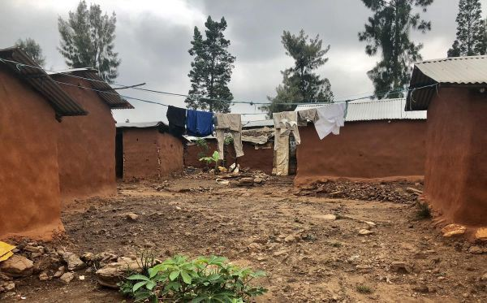

### AYS News Digest 22/4/22: What lies behind the UK\-Rwanda deal
### Danish Refugee Board taking steps to classify Afghanistan as a safe country // German Federal Administrative Court overruling the Leipzig Court’s decision and permitting deportations with more reckless abandon // Mare Liberum publishes 2021 Pushback Report // some good reads and other news

Housing in Nyabiheke; Photo credits: Heaven Crawley, via [UNU](https://cpr.unu.edu/publications/articles/why-the-uk-rwanda-asylum-deal-risks-harming-global-standards.html) Centre for Policy Research

**Three major obstacles to the agreement becoming operational**

In addition to the abhorrent ethics and questionable timing of Priti Patel’s UK\-Rwanda Agreement, the general efficacy of the plan to offshore asylum\-seekers, whether or not they arrive “legally,” is pretty dubious\. The Home Office is presenting the plan as a read\-to\-go programme and not an abstract idea with unpredictable outcomes, a massive price tag, and significant pushback from citizens and human rights watchdogs alike\. Its goal is **not only to send asylum\-seekers to Rwanda for asylum processing but to relocate them permanently** \. In the horrifying, albeit relatively unlikely event of the agreement overcoming any legal and financial challenges, the Migration Policy Institute outlines three major obstacles to the agreement becoming operational:

First, the UK is bound by international law to offer protection to specific categories of asylum seekers, including those from Rwanda\. **Sending Rwandan asylum seekers back to their home country would constitute refoulement,** which is prohibited under a bunch of international laws to which the UK is held accountable\. Avoiding refoulement would require significant pre\-screening processes that would likely disqualify many more people from the relocation scheme in the first place\.

If the goal of the [agreement](https://www.migrationpolicy.org/news/uk-rwanda-asylum-agreement?fbclid=IwAR0EZFJ50E2H48oMoKVtuDDduJyG3fJTFmWc9DsdrfpBDOXoB4kGd6SPCH8) is to relocate asylum seekers before they even begin the application process, significant legal challenges and pre\-qualifications of individual asylum seekers would delay or even rule out relocation\.

Second, the agreement is founded on the principle of “double\-voluntarism,” meaning that **both the UK and Rwanda have to agree to individual relocations** , and as such, they need to be in accordance with Rwanda’s conditions for accepting relocated asylum seekers\. The same flexibility that grants Rwanda’s “de facto veto power” also allows the UK to decide at will to accept asylum seekers who supposedly have not arrived “legally” if it satisfies their racial classification of what makes migrants “desirable” or “undesirable\.” According to MPI, this “would undermine the narrative of stamping out queue jumping and provide migrants with erratic, but psychologically persuasive, evidence that they might not get relocated to Rwanda\.”

Third, it is not clear how long it would take for the agreement to successfully reduce the flow of asylum seekers, and past experiences around the globe have historically shown that “deterrence\-minded enforcement policies” do not curb migration\. Such experiences tend to just create more dangerous and irregular migratory routes, and there is not enough evidence that justifies the amount of money and human lives relocation would cost\.

Still within the vein of violently and explicitly discouraging migration from certain groups of people, [Priti Patel](https://www.theguardian.com/uk-news/2022/apr/22/priti-patel-accused-misleading-parliament-refugee-pushbacks?fbclid=IwAR1d1nGk2Mvn4UofNTM_0jLzPA95WtChK24J-KbWaFdEvR_DnODGAhtogDY) and the Home Office were recently accused of misleading asylum seekers, Parliament, and the public about when pushbacks would be executed in the Channel\. While public discourse was purposely unclear, previously unpublished passages of controversial border policy revealed by court rulings noted pushbacks would not be conducted against asylum seekers crossing the Channel\. This comes three months after Priti Patel threatened the use of pushbacks publicly, assuring lawmakers in January that they were “absolutely still policy” while she knew they were not\.

> _“According to the high court judgment, a clause in the unpublished policy says ‘the actual number of migrant vessels successfully intercepted is likely to be extremely low\.’ It adds that one of the “acceptable outcomes” is that during operational deployments no migrant vessels are assessed as suitable for safe turnaround\._ 

> _Paul O’Connor, the head of bargaining at the PCS, said: ‘PCS has been pressing the Home Office for transparency in these proceedings\. They have gone to considerable lengths to keep certain matters shrouded in secrecy\. This judgment has left them nowhere to hide and has exposed their real agenda\.’”_ 

### SYRIA
### Displaced Syrians living in the Rukban camp in Idlib forced to consider moving to Assad\-controlled areas

The Syrian Association for Citizens’ Dignity \(SACD\) highlights the catch\-22 that Syrian citizens are subjected to, having to choose between horrifying conditions in refugee camps or the likely lethal move to Assad controlled regions\.

The open letter was published due to the Rukban camp’s extreme shortage of food and resources in tandem with the UNHCR and the UN in Syria failing to provide citizens with accurate information about the safety of regions near Rukban, with dire results\.

> _“It is deplorable that more than seven thousand displaced Syrians in Rukban camp are left in a barren desert enduing harsh weather conditions without food or medicine\. The latest reports from Rukban indicate that in the last few days nearly 70 people, mostly women and children, were forced to return to Assad\-held areas, without any security guarantees\. The extreme shortage in basic food items and the migration of cattle have increased the food insecurity in the camp and left the people in a dire situation forced to head to an unknown fate in Assad regime areas\._ 

> _The fate of those forced to return to Assad held areas from Rukban is uncertain\. When similar pressure was exerted on people trapped in Rukban to force them to return, SACD [confirmed](https://syacd.org/sacd-confirms-174-rukban-returnees-arrested-by-assad-regime-despite-russian-guarantees/) that Syrian security services have arrested 174 people who were taken to the so\-called IDP shelters in Homs and transferred to “terrorism courts,” despite having previously received security clearances from the regime\. All the arrested youth and men received guarantees and commitments from the regime and Russia to receive a “personal settlement” which would protect them from persecution and forced recruitment\. Some of the detained returnees have been disappeared and their whereabouts are still unknown\.”_ 

To read more of the open letter, [g](https://www.syacd.org/people-of-rukban-camp-again-face-the-dilemma-starve-in-the-desert-or-die-in-assad-detentions/?fbclid=IwAR1d1nGk2Mvn4UofNTM_0jLzPA95WtChK24J-KbWaFdEvR_DnODGAhtogDY) o [here](https://www.syacd.org/people-of-rukban-camp-again-face-the-dilemma-starve-in-the-desert-or-die-in-assad-detentions/?fbclid=IwAR1d1nGk2Mvn4UofNTM_0jLzPA95WtChK24J-KbWaFdEvR_DnODGAhtogDY) \.
### TURKEY
### Afghans in Izmir forced to sign voluntary return paperwork

Human rights organisations met at the Human Rights Association \(IHD\) office in Izmir on April 21st to discuss reports of torture and abuse of Afghan refugees staying there, including forced removal and deportation, at the Harmandali Removal Centre\.

In addition to three reports of attempted suicide and one death from severe maltreatment, IHD representative Ali Aydin stated that there were roughly **160–170 allegations of torture, including being forced to sign and thumbprint voluntary return paperwork\.**

> _“Afghanistan Consulate officials reportedly visited the Removal Centre on April 14\. Following this visit, the refugees from Afghanistan brought to the İzmir Removal Centre from İzmir, Muğla, Manisa, Denizli, and other provinces were forced to sign and put their thumbprints on the ‘voluntary return papers’ in the sports hall of the institution\.”_ 

[Reportedly](https://bianet.org/english/migration/260844-afghans-in-izmir-forced-to-sign-voluntary-return-papers?fbclid=IwAR10jKNKTeWSyhX6TobYn-hx7Y3liC0xy6ZSnQJWaGjP5IT4MOTzPGj5Ya4) , the people who did not want to sign the papers were handcuffed or seized by the arm by gendarmerie officers and made to put their thumbprints on the papers\. Aydın noted that the people were isolated and they were banned from making a phone call afterward\.

Aydin called for the penalisation of the guilty authority figures at Harmandali and for the removal centre to “acknowledge all refugees’ right to food, housing, healthcare, labor, free movement and settlement, and meet their humanitarian needs\.”
### GREECE
### Mare Liberum: Pushback report 2021

Mare Liberum have published their 2021 Pushback Report that provides a brief overview of the history of European border violence and illustrates different ways of dealing with different migratory movements by the European border regime\. In the main part of the publication, it becomes clear that illegal pushbacks have become a regular practice of human rights violations against people on the move\. These are neither isolated cases nor a “side effect” of so\-called border protection\. Rather, different testimonies reveal impressively that \(physical\) violence, humiliation and torture are used as strategic means to prevent fleeing people from reaching EU territory, including by illegal methods\.

Find the entire report here:
### [Pushback Report 2021 \| Mare Liberum](https://mare-liberum.org/en/pushback-report-2021/)
#### [This publication highlights reports of affected refugees and eyewitnesses and denounces institutionalized violence…](https://mare-liberum.org/en/pushback-report-2021/)

[mare\-liberum\.org](https://mare-liberum.org/en/pushback-report-2021/)

> _Despite international criticism of the Greek state’s alleged use of pushbacks, there appears to be “no end to this illegal practice\.”_ 

As InfoMigrants reported, GCR says that in at least three cases, it has information of asylum seekers from Turkey and Syria being sent back to Turkey without being given a chance to apply for protection on Greek soil\. If proven true, this would be an infringement of international law and qualify as a pushback\.

Greece has consistently denied that its security personnel engage in illegal pushbacks\. Following a four month investigation, Greece’s national transparency authority in March said it had found no evidence of such practices\.
### SEARCH AND RESCUE AT SEA
#### [Until when will Europe let a part of humanity sink in the Mediterranean Sea? \| SOS Mediterranee](https://en.sosmediterranee.org/press/until-when-will-europe-let-a-part-of-humanity-sink-in-the-mediterranean-sea/?fbclid=IwAR0Zb8Jrx9uXZg9hFWtLdzLbwRNH8zIaZlkENQmnpRrn5I-aoqcFA6dRIxU)
#### [Today, while preparing for a new mission at sea, the team onboard Ocean Viking will pay their tribute to those who…](https://en.sosmediterranee.org/press/until-when-will-europe-let-a-part-of-humanity-sink-in-the-mediterranean-sea/?fbclid=IwAR0Zb8Jrx9uXZg9hFWtLdzLbwRNH8zIaZlkENQmnpRrn5I-aoqcFA6dRIxU)

[en\.sosmediterranee\.org](https://en.sosmediterranee.org/press/until-when-will-europe-let-a-part-of-humanity-sink-in-the-mediterranean-sea/?fbclid=IwAR0Zb8Jrx9uXZg9hFWtLdzLbwRNH8zIaZlkENQmnpRrn5I-aoqcFA6dRIxU)
### SPAIN

Tarajal warehouse has been closed after most people housed there were transferred out\. According to local [reports](https://elforodeceuta.es/los-migrantes-en-las-naves-del-tarajal-seran-trasladados-al-ceti/?fbclid=IwAR07k-W2ks4pBJ96v-3aYlCGqiNWgC6wFV7ooWtfwHLgIDrHaXysi9xltTA) , the people will be transferred to [the Temporary Stay Centre for Immigrants](https://elforodeceuta.es/?s=CETI) \( CETI \) in Ceuta, while those with Spanish nationality are awaiting a solution by the Social Services\.

In Melilla, the National Police has [arrested](https://elforodeceuta.es/detenidas-79-personas-por-falsificar-la-nacionalidad-espanola-a-menores-marroquies-nacidos-en-melilla/?fbclid=IwAR10jKNKTeWSyhX6TobYn-hx7Y3liC0xy6ZSnQJWaGjP5IT4MOTzPGj5Ya4) 79 people who allegedly were dedicated to facilitating the fraudulent acquisition of Spanish nationality by Moroccan children born in Melilla\.
### GERMANY
#### Deportations are valid even if long\-term destitution can be proven and foreseen

A Leipzig court ruled on April 21st that before someone can be deported to their home country, authorities have to provide adequate evidence that the individual’s basic needs can be met for a “foreseeable” amount of time in order to justify the deportation\. In response, the German Federal Administrative Court clarified that a “foreseeable” amount of time does not mean that a person’s basic needs must be met long\-term, essentially overruling the Leipzig court’s decision and permitting deportations with more reckless abandon\.

“The latest judgment argued that ensuring a sustainable livelihood upon return is not required by law, citing the European Convention on Human Rights\.

> _In order for a deportation ban to be valid in accordance with the law, the threat of encountering serious human rights violations would need to “occur in such a close temporal connection to the return” that it can still be attributed to the act of returning, thereby justifying a deportation ban\._ 

‘If a foreigner who is obliged to leave the country is able to take advantage of assistance that will prevent him or her from becoming destitute within a foreseeable period of time, a deportation order can only be waived as an exception if the person concerned is threatened with facing destitution soon \(upon return\) and with a high degree of probability upon using up the return assistance,’ the ruling [said](https://www.infomigrants.net/en/post/40034/german-court-deportation-orders-are-valid-even-if-deportees-face-longterm-destitution?fbclid=IwAR04u3xiaTlw5QzX1H4asNGOVhIvaDzUT5jkWkLYNC_OkX6mKOz7BxdBBVg) \.”
### DENMARK
#### Denmark to evaluate deportations of Afghan nationals on a case\-by\-case basis

Denmark’s Ministry of Integration and Immigration sent a letter on April 8th that said Ukrainian asylum cases would be given top priority across the board, which in turn will de\-prioritise any other asylum cases, creating even longer waiting times and even suspending non\-Ukrainian asylum altogether at least until the summer, citing unspecified “overriding reasons” for doing so\.

In addition to adding more insult to injury for any non\-Ukrainian nationals waiting for decisions, effectively putting their lives on indefinite pause by making it impossible to travel outside Denmark or get a job, Denmark has [reportedly](http://refugees.dk/en/news/2022/april/the-minister-will-prioritize-ukrainians-delaying-all-other-immigration-cases/?fbclid=IwAR2AAMSfU62DzxtGETYT27zCsr245ZSfzpmMgZtK7AJiBP3L3ffyC5837mM) made it possible for Ukrainians to work legally even before receiving their residence permits\.

In addition to non\-Ukrainian asylum cases being suspended, the Danish Refugee Board is also [taking steps](https://vinkel360.com/flygtningenaevnet-vurderer-det-er-sikkert-at-sende-lille-gruppe-af-afghanere-tilbage-til-taliban/?fbclid=IwAR1yJ7Rcv7IrfK1JphOH1zhhixSYVBMxJ3AzoraISbxdehk2KNh4Y3EKCZ4) to classify Afghanistan as a safe country, even with regular reports of Taliban sponsored danger and clear evidence that deportations lead to death for those subjected to them\.

> _“The board assesses that the Taliban’s takeover of the country alone is not reason enough to offer Afghans a residence permit in Denmark\. Therefore, the cases will now be assessed on an individual basis, and here the Danish Refugee Board considers it to be safe for 5 out of a total of 17 Afghan refugees to return\. They can therefore look forward to being put on a plane, voluntarily or not, in the near future\.”_ 

### BELARUS

Several organisations in our network of contacts, and probably many more, have been contacted in recent days regarding the case of four people trapped in the border area between Poland and Belarus, one of whom is very ill\. So far they have not received any help, direct support or advice that would help their situation\. Many people are facing a similar situation on a daily basis\. How to assist them?
### GENERAL
#### [Frontex: Migration control from space](https://digit.site36.net/2022/04/14/frontex-migration-control-from-space/?fbclid=IwAR3jcoWiaE0-T6dsbNZfKS06IFDJLewdPsXgasPnmaQrMBTqcXAYKgZDIWA)
#### [In EUROSUR, EU member states use various satellite services for maritime surveillance\. Frontex and the Maritime…](https://digit.site36.net/2022/04/14/frontex-migration-control-from-space/?fbclid=IwAR3jcoWiaE0-T6dsbNZfKS06IFDJLewdPsXgasPnmaQrMBTqcXAYKgZDIWA)

[digit\.site36\.net](https://digit.site36.net/2022/04/14/frontex-migration-control-from-space/?fbclid=IwAR3jcoWiaE0-T6dsbNZfKS06IFDJLewdPsXgasPnmaQrMBTqcXAYKgZDIWA)
### Frontex

Two protests against Frontex’s border “security” operations and the EU’s implicit and explicit support took place in Belgium and the Netherlands, with activists demonstrating outside the Federal Office for Customs and Security \(BAZG\) in Bern and outside the Ministry of Defence and the Ministry of Justice in the Hague\.

The protest in the Hague ended in front of the NIDV, a Dutch arms lobby organisation, where activists distributed copies of shares from Airbus to illustrate the financial cost of border policing\.

The BAZG is the Swiss national link to Frontex, sending guards on Frontex missions and representing Swiss interests on the borders, and on 15 May, Switzerland will be voting on the expansion of Frontex\. According to the activists, the goal is “to make visible who in Switzerland is responsible for the border crimes at the external borders\.”
### WORTH READING
#### [What the EU’s policy toward Ukrainians may mean for other refugees](https://www.thenewhumanitarian.org/analysis/2022/04/21/what-the-EUs-policy-toward-ukrainians-may-mean-for-other-refugees?fbclid=IwAR2NlqCFYQucoy6i3HEQmykf8v_9WUGzq5AmVlpHvwK1b-pTGMbgm7dYdkA)
#### [The warm welcome extended to Ukrainian refugees by the European Union and its member states represents a nearly…](https://www.thenewhumanitarian.org/analysis/2022/04/21/what-the-EUs-policy-toward-ukrainians-may-mean-for-other-refugees?fbclid=IwAR2NlqCFYQucoy6i3HEQmykf8v_9WUGzq5AmVlpHvwK1b-pTGMbgm7dYdkA)

[www\.thenewhumanitarian\.org](https://www.thenewhumanitarian.org/analysis/2022/04/21/what-the-EUs-policy-toward-ukrainians-may-mean-for-other-refugees?fbclid=IwAR2NlqCFYQucoy6i3HEQmykf8v_9WUGzq5AmVlpHvwK1b-pTGMbgm7dYdkA)
- European Network on Statelessness [published a briefing](https://www.statelessness.eu/updates/publications/stateless-people-and-people-risk-statelessness-forcibly-displaced-ukraine) based on the information collected from ENS members and partners working on the ground\. The briefing also makes a series of recommendations to the EU, European States, international agencies and NGOs:

#### [Statelessness and the Ukraine crisis response](https://www.statelessness.eu/statelessness-ukraine-crisis?fbclid=IwAR3LFEJrQ8vFZn1rm0Zt2A3L6AHe1wAfldJA6a-s-i9kbGDu4ES-PEcdxGs)
#### [The last census in Ukraine recorded 82,550 stateless people, and in 2021 UNHCR estimated there to be at least 35,000…](https://www.statelessness.eu/statelessness-ukraine-crisis?fbclid=IwAR3LFEJrQ8vFZn1rm0Zt2A3L6AHe1wAfldJA6a-s-i9kbGDu4ES-PEcdxGs)

[www\.statelessness\.eu](https://www.statelessness.eu/statelessness-ukraine-crisis?fbclid=IwAR3LFEJrQ8vFZn1rm0Zt2A3L6AHe1wAfldJA6a-s-i9kbGDu4ES-PEcdxGs)
- Moria a year later

#### [‘A disaster waiting to happen’: who was really responsible for the fire at Moria refugee camp?](https://www.theguardian.com/world/2022/apr/21/disaster-waiting-to-happen-moria-refugee-camp-fire-greece-lesbos?fbclid=IwAR2ysJcUkPf8sSv4cMTMDg_varXP4m-iWoW86GOM5XvjT2DRkDa267JriWo)

[www\.theguardian\.com](https://www.theguardian.com/world/2022/apr/21/disaster-waiting-to-happen-moria-refugee-camp-fire-greece-lesbos?fbclid=IwAR2ysJcUkPf8sSv4cMTMDg_varXP4m-iWoW86GOM5XvjT2DRkDa267JriWo)
### Find daily updates and special reports on our [Medium page](https://medium.com/are-you-syrious) \.

**If you wish to contribute, either by writing a report or a story, or by joining the info gathering team, please let us know\.**

**We strive to echo correct news from the ground through collaboration and fairness\. Every effort has been made to credit organisations and individuals with regard to the supply of information, video, and photo material \(in cases where the source wanted to be accredited\) \. Please notify us regarding corrections\.**

**If there’s anything you want to share or comment, contact us through Facebook, Twitter or write to: areyousyrious@gmail\.com**

_Converted [Medium Post](https://medium.com/are-you-syrious/ays-news-digest-22-4-22-what-lies-behind-the-uk-rwanda-deal-60d955054c6b) by [ZMediumToMarkdown](https://github.com/ZhgChgLi/ZMediumToMarkdown)._
