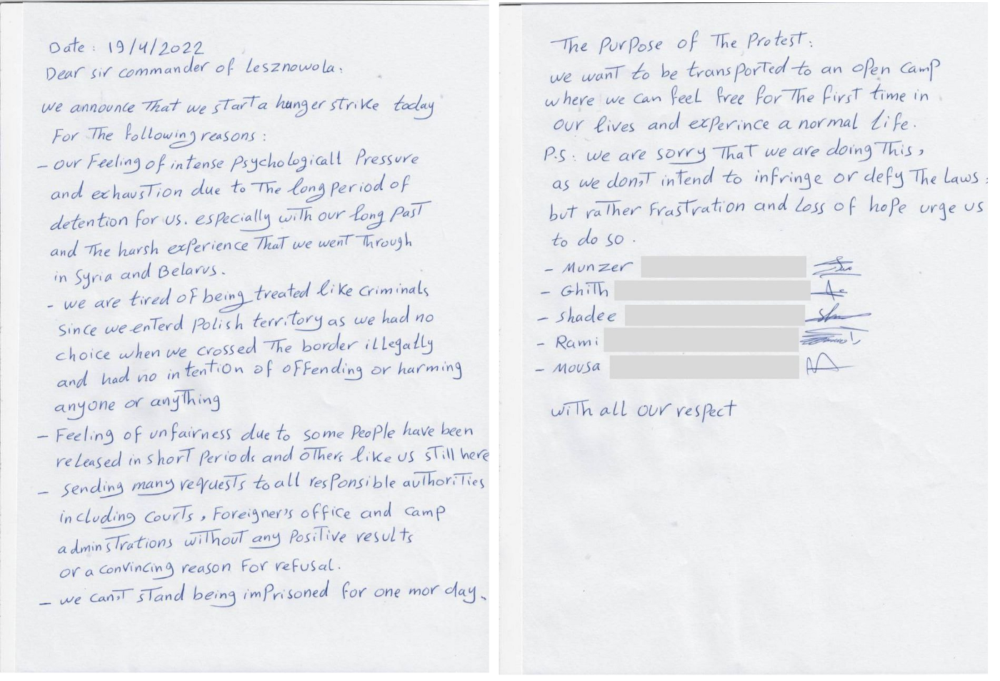

### AYS News Digest 27/04/2022: Proof of Frontex Pushbacks
#### Stateless people from Ukraine are facing rejection and homelessness // Dutch court rules against Croatia deportations // Claim asylum from France: UK Opposition Leader proposes // Grounded rescue operations as lives are lost at sea // Oxfam: Africa drought Imminent, donors needed
### FEATURE

### PROOF OF FRONTEX PUSHBACKS

Details and evidence of [Frontex’s involvement in pushbacks](https://twitter.com/LHreports/status/1519358838574653440?fbclid=IwAR3guM2FpN1vuGqIpj6yCHGrJ0lBT6YhUn6nYXufqXLxh7otmSwrMo9OOJY) in the Aegean have been revealed\.

Following a freedom\-of\-information request by Lighthouse Report and their partners, an incomplete database was shared by Frontex\. Crucial information was removed\. Investigations into the data provided allowed the investigators to link incidents reported by Frontex with pushacks\.

Referred to by Frontex as ‘preventions of departure’:

■■■■■■■■■■■■■■ 
> **[Lighthouse Reports](https://twitter.com/LHreports) @ Twitter Says:** 

> > 6/ In other words: when asylum seekers on boats crossing the Aegean are spotted by Greece or Frontex, Turkey is informed &amp; moves to prevent the crossing &amp; return them to shore in Turkey before they enter EU waters. 

> **Tweeted at [2022-04-27 16:52:33](https://twitter.com/lhreports/status/1519358853753843714).** 

■■■■■■■■■■■■■■ 

With hundreds of these reported incidents, it was found that in 222 cases Frontex was directly involved, leading to at least 957 individuals being pushed back by Frontex\.

[Read the full details of the thorough investigation in this article by Spiegel\.](https://www.spiegel.de/ausland/frontex-in-illegale-pushbacks-von-hunderten-fluechtlingen-involviert-a-086f0e5a-0172-4007-b59c-7bced325cc75)

Meanwhile, you could work for Frontex: a job in [Human Rights Monitoring](https://twitter.com/JGrimheden/status/1519348036748591107?fbclid=IwAR0dT-2TQGvvIiNIgKen0y31tPHbn1HiT4aKKTgNru6xADr8yo-frqdawj4) in being advertised\.
#### GREECE

Police hassle for visiting an old warehouse\.

[Lena K describes how the police on Evros](https://twitter.com/lk2015r/status/1519390819207110657?fbclid=IwAR3qJS0lhV8sp28TyqfNXDXP1pe-d3ar5hNKD6Gku5jYMmES3yLBXLLl6tk) investigated her reasons for visiting an abandoned warehouse, outside of the military zone\.

In Patras, the work of No Name Kitchen in Greece is expanding with a new warehouse\. [Watch their video here\.](https://www.facebook.com/watch/?v=740428067120821)
#### ITALY

](assets/5bf96303f605/0*nCy8cBzhcz9lcRoW)

Photo Credit: [Twitter](https://twitter.com/NFratoianni/status/1519333523068444672?fbclid=IwAR3qJS0lhV8sp28TyqfNXDXP1pe-d3ar5hNKD6Gku5jYMmES3yLBXLLl6tk)

A ruling is expected soon in the case of Andrea Costa\. The ruling is due next week in this case which criminalises solidarity\. A protest will be held on 28th April at 6 pm in Rome\.
#### UKRAINE
#### Stateless people from Ukraine are [facing rejection and homelessness](https://www.aljazeera.com/opinions/2022/4/26/stateless-ukrainians-no-nationality-and-now-no-home?fbclid=IwAR1T6dJjKVGOijmg0U7l3kQAP_xzK9CX7mhNvHxFJXT0GwIZZQFRrF2-g8I) \.

After the breakdown of the Soviet Union, some people became stateless due to racism and border lines\. Some 40,000 stateless people are thought to have left Ukraine, and are now facing lack of support\. Members of the Roma community make up the largest proportion of this stateless group\. Without documentation, people fear for their safety\. Stateless people have been excluded from the European response to refugees fleeing, with people reporting discrimination in neighbouring countries including Hungary and Moldova\. Human Rights Lawyer Kristina Fried says:

> [“European states must make the necessary policy and legislative changes to fulfill their legal obligations respecting stateless people\.”](https://www.aljazeera.com/opinions/2022/4/26/stateless-ukrainians-no-nationality-and-now-no-home?fbclid=IwAR1T6dJjKVGOijmg0U7l3kQAP_xzK9CX7mhNvHxFJXT0GwIZZQFRrF2-g8I) 

#### POLAND

[Five residents at the Lesznowola centre](https://m.facebook.com/story.php?story_fbid=141121025121492&id=102401152326813&m_entstream_source=timeline&tn=%2As%2As-R) in Poland are on hunger strike\.

The five people from Syria have not eaten for more than nine days, and a Polish activist in Warsaw joined their hunger strike from the start\. The group have all been detained for more than four months\.

Despite having meetings scheduled with the camp management, no meetings have taken place and no resolution has been found\. One person was in hospital in pain and all have experienced severe weight loss\.

There was also a demonstration in front of the centre\.
#### NETHERLANDS
#### Dutch court rules against Croatia deportations

In a landmark ruling, [the Dutch court has ruled](https://twitter.com/verheul_julia/status/1518945820464320513?fbclid=IwAR0DKvh5SvgopCUP3Wjpy3BzKauSy8Lq1OAhex0CYM6oGnonWu49DzRJBP0) that it is not admissible to remove people to Croatia\. The Dublin agreement allows EU member nations to deport asylum seekers to their first country of entry, but evidence of pushbacks from Croatia to non\-EU countries means that the Dutch authorities will have to make their own investigation before removing someone from the Netherlands — as is the case with non\-EU countries\.
#### UNITED KINGDOM
#### Opposition leader proposes: claim asylum from France

The leader of the opposition, Sir Keir Starmer, has [called for a route to ending Channel crossings](https://www.independent.co.uk/news/uk/politics/refugees-keir-starmer-patel-rwanda-b2064221.html?fbclid=IwAR0dCtHOdWSSu-20eY8QqPvQyJQuSSF-jw0s4Pr2_R5o31G-tI_DC-sI2uU&r=41854) by allowing people to apply for asylum from France\. The policy, supported by the French authorities, has been rejected by Home Secretary Priti Patel in favour of sending people to Rwanda\.

Starmer describes the Rwanda plan as “distraction tactics to stop everybody talking about [the wrongdoing of the prime minister](https://www.independent.co.uk/news/uk/politics/boris-johnson-partygate-fine-police-b2064208.html) and the cost of living crisis”\.

The Nationality and Borders Bill [continues to be discussed in the House of Lords](https://www.facebook.com/refugeecouncil/posts/369058365268468) , with rejection of some of the cruelest parts, giving hope that not all of the Bill will pass into law\.

News of the racist treatment of asylum seekers, and the removal of people to Rwanda, has been explored by this [left wing publication](https://newleftreview.org/sidecar/posts/fables-of-migration?fbclid=IwAR3jjlfAPHfFwfu86fW32evcWp4-dmArQYrqHCrcYC_j3ewiidB2axi_fTE) and this Greek publication [efsyn](https://www.efsyn.gr/stiles/ypografoyn/341401_anthropismos-me-hroma-kai-thriskeia) \.
#### SEA/SAR
#### Grounded rescue operations as lives are lost at sea

A very high number of people continue to lose their lives at sea on their journey to Europe\.

In the Aegean, [73 people reportedly landed on KYTHIRA, GREECE](https://twitter.com/alarm_phone/status/1518726507740291072?fbclid=IwAR2pWJ8TWz_z9_rgOsWdGYpfAN_VK22zP5Ws9k62csX8s1Fx26ftpoFHwVk) following a shipwreck\.

■■■■■■■■■■■■■■ 
> **[Sea-Watch International](https://twitter.com/seawatch_intl) @ Twitter Says:** 

> > 🔴 For almost 2 months now, Libyan authorities are preventing us from flying operations with #Seabird 1 &amp; 2 inside the Libyan search and rescue zone.
This leaves an area unmonitored from the air where people are pulled back to #Libya against international law - or left to drown. https://t.co/zygMkzKnVc 

> **Tweeted at [2022-04-27 15:30:12](https://twitter.com/seawatch_intl/status/1519338129462804480).** 

■■■■■■■■■■■■■■ 

Meanwhile in the Mediterranean, the Sea\-Watch planes are being prevented from flying in the Libyan search and rescue zone\. This practice has continued for two months now, with unknown numbers of lives in danger and laws being broken through illegal ‘pullbacks’ by the so\-called Libyan Coast Guard\.

[The rescue ship Ocean Viking has performed several difficult operations](https://twitter.com/SOSMedIntl/status/1519244629719363585?fbclid=IwAR1T6dJjKVGOijmg0U7l3kQAP_xzK9CX7mhNvHxFJXT0GwIZZQFRrF2-g8I) involving 72 people from one vessel and 59 from another rescue\.

At least [530 people](https://twitter.com/msehlisafa/status/1519348752653463553?fbclid=IwAR0Ee7sa2LJfYKIsJFeg6fWhLT6dFvQy5YOT8j_5gXcsM6A04L4E4g_ZobE) have lost their lives in the Mediterranean this year\.

To add hope to a desperate situation, the island of Lampedusa is a place of peace\. The mayor of Lampedusa and Linosa, Totò Martello, [wants the island to be a place of peace, without militarization](https://alarmphone.org/en/2022/04/27/lampedusa-as-an-island-of-peace/?fbclid=IwAR3F6gZ5JwSlUPsZyXVsCtfZsLgSdYwV8geZgStALlgnXpai8d7-owwblFc) \. Citing the compassionate response to Ukrainian refugees as an example, organisations support this and call for the end of the use of quarantine ships which should be converted into ferries\.

Several tragedies also occurred in the Canary Islands\. [Six people are reported to have died](https://twitter.com/HelenaMaleno/status/1519230370339774464?fbclid=IwAR2y7t-uNAPabxIZ_UZMjdhYAn2wahAGmcyA78QgdrJqqbxkN1Hps-QNkDE) on a boat that, on the morning of 27th April, was still in distress\.

And in [another incident](https://l.facebook.com/l.php?u=https%3A%2F%2Fwww.infomigrants.net%2Fen%2Fpost%2F40108%2Fcanary-islands-25-feared-dead-as-migrants-boat-capsizes%3Ffbclid%3DIwAR3ztmVO9wVmfm83d5LD3xQh63CABJvfA5ZruIet2lS3MRXeA_k4ioIZiJQ&h=AT0xz6sCVE-X7O1x1RWmuQg48o42svv9A4wZ5-xCmuFYC8ghbPDXkjpxPKD2aQMv2lA0fvT4D-B_x02xUJfYhNbIVlhNmA7gIrFEVVXoavFRZZNKmYHmIPXz7zksK51OBgxKfoWmcbVymw&__tn__=R]-R&c[0]=AT0OX9bbN851N4zNV88WJxkPw9jyO0XkHLqRUKow2LDcEdvlXiyoeK245GJ_Z_mLU1uzQrR7YBpKxBphAWFyTyG2L7v-JdM1OT0lS4myU2F4aP33Z2ZbMmV8dIBaNinCgxgiviaBak0NDsyfCb6npFWe7PRC8LTXk6sIU5HcsBALHUYt4VTmBSadbCvsUPiPDsbClifSuxJL) , there was one confirmed death and 25 other people missing, while 36 people survived and are being treated\.

[This long read](https://www.law.ox.ac.uk/research-subject-groups/centre-criminology/centreborder-criminologies/blog/2022/04/europes-border?fbclid=IwAR2O8B-txtNt4dmuy4tFpqm-sdLz9Vk6pP7UkGIM4ExiajrzsvlovO2OXT8) discusses the deaths at Europe’s sea borders\. It begins:

> “over half of the border deaths, globally, happened in Europe” 

#### GENERAL
#### Oxfam: Africa drought Imminent, donors needed

[Oxfam has called for a global response](https://www.oxfam.org/en/press-releases/joint-statement-global-donors-must-rise-occasion-and-prevent-starvation-and-death?fbclid=IwAR0DKvh5SvgopCUP3Wjpy3BzKauSy8Lq1OAhex0CYM6oGnonWu49DzRJBP0) following warnings of drought in the Horn of Africa\. The press release came as donors convened in Geneva and is supported by 50 other NGOs\.

> “This drought is compounded by the COVID\-19 pandemic, conflict, desert locusts, and now a further surge in food and commodity prices due to the conflict in Ukraine\. Over 14 million people across Somalia, Ethiopia and Kenya — about half of them children — are already on the verge of starvation\. This number will rise to 20 million by the middle of 2022 if the rains continue to fail, prices continue to rise, and significant funds are not surged to meet the needs of those in crisis\. In Somalia alone, over half a million people have already fled their homes in search of food and water since the start of 2022\.” 

The statement continues to outline that, in such circumstances, women and children are usually adversely affected the most— facing an increased risk of gender\-based violence\. It also speculates that, due to the situation in Ukraine, attention is diverted away from other crises\.

**Find daily updates and special reports on our [Medium page](https://medium.com/are-you-syrious) \.**

**If you wish to contribute, either by writing a report or a story, or by joining the info gathering team, please let us know\.**

**We strive to echo correct news from the ground through collaboration and fairness\. Every effort has been made to credit organisations and individuals with regard to the supply of information, video, and photo material \(in cases where the source wanted to be accredited\) \. Please notify us regarding corrections\.**

**If there’s anything you want to share or comment, contact us through Facebook, Twitter or write to: areyousyrious@gmail\.com**

_Converted [Medium Post](https://areyousyrious.medium.com/ays-news-digest-27-04-2022-proof-of-frontex-pushbacks-5bf96303f605) by [ZMediumToMarkdown](https://github.com/ZhgChgLi/ZMediumToMarkdown)._
