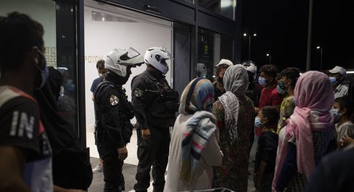
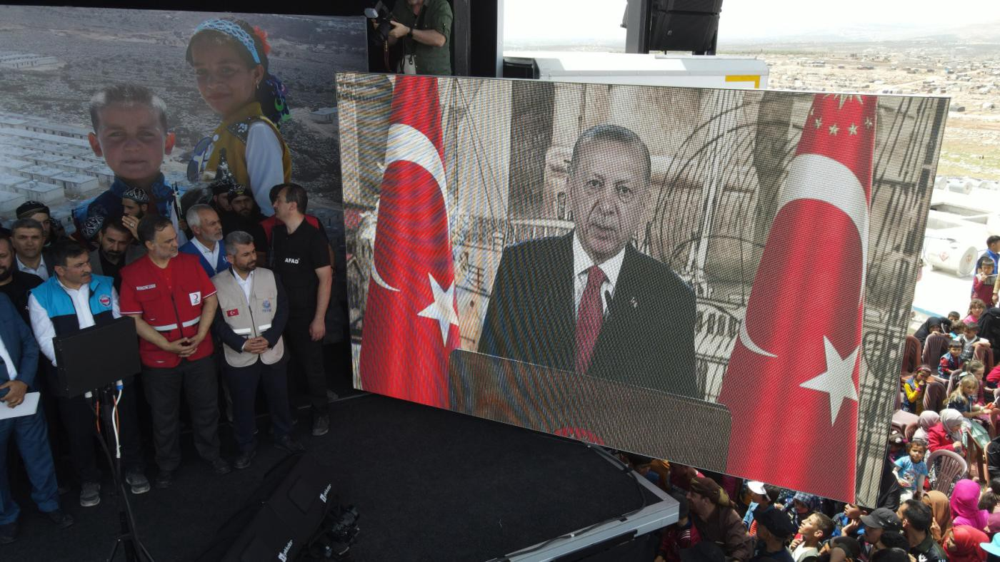
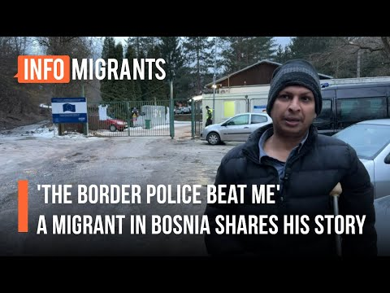
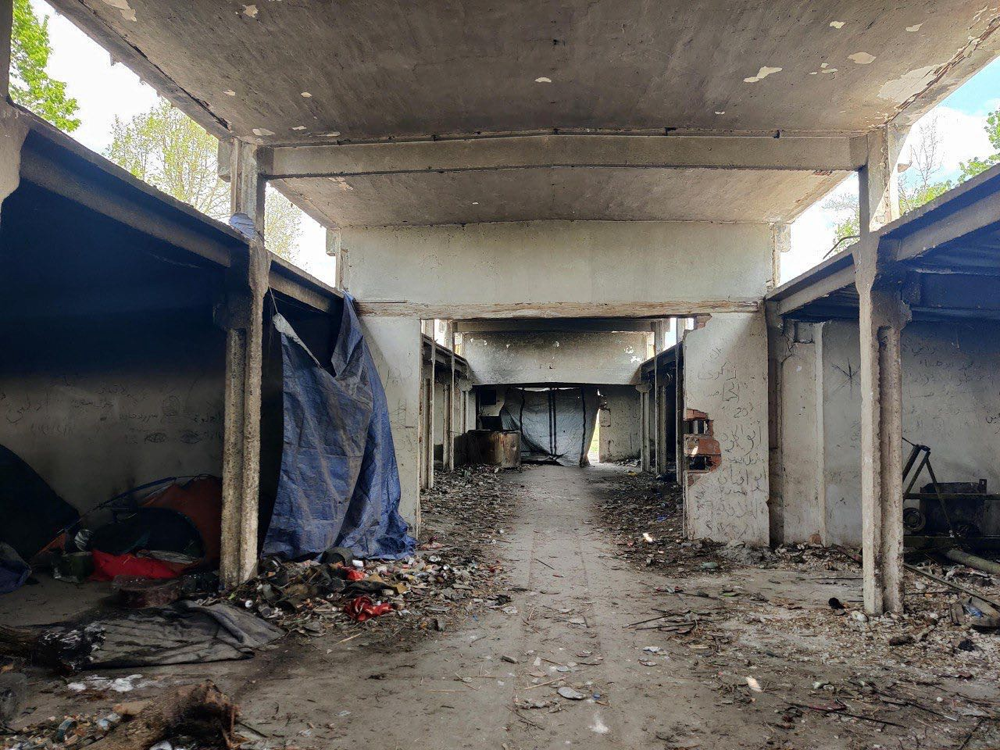
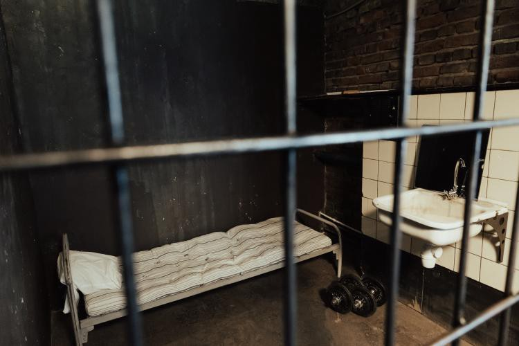

#### AYS News Digest 4/5/2022: How much of an impact will Leggeri’s resignation have on the approach taken by FRONTEX at EU’s borders?

Refugees in Serbia taken to closed camps/Detention and detainment of refugees in Poland/Ocean Viking has finally found a safe place to disembark/A young non\-verbal black British boy placed in an immigration detention centre in the UK/Treatment of foreign national prisoners in the UK/ InfoMigrants provides information on applying for asylum in France/Further resources…\.

Source: Le Temps, Un ex\-agent suisse de Frontex brise l’omerta

**TURKEY**

Erdogan, the Turkish president, announced plans on Tuesday to return one million Syrian refugees to northern Syria\.

Source: Middle East Eye — Erdogan addresses a crowd of displaced Syrians in Idlib on 3rd May 2022\.

The government, with the support of local and international NGOs, aim to build 100,000 houses in parts of the Turkish\-controlled Syria\. These houses will accommodate those fleeing Al\-Assad’s regime\.

■■■■■■■■■■■■■■ 
> **[Julia Hahn](https://twitter.com/juliahahntv) @ Twitter Says:** 

> > Ahead of elections in Turkey next year, President Erdogan announces "a new project for the voluntary return of 1 million Syrians". Erdogan spoke at the opening ceremony of a brick-house-town in Idlib near the Turkish border. Some 500,000 Syrians have already returned, he said. 

> **Tweeted at [2022-05-03 10:13:28](https://twitter.com/juliahahntv/status/1521432746958237700).** 

■■■■■■■■■■■■■■ 

**GREECE**

[The Greek Refugee Council, Oxfam, and Save the Children](https://www.infomigrants.net/en/post/40279/ngos-highlight-a-twotier-system-for-refugees-in-greece?fbclid=IwAR0ImsTWbkMZ5mnfpZIaCENBHOICQ8Wi2tcReQhhap9Rp_WwZgALlzfcn-I) are criticising the Greek government for the disparity in response to Ukrainian refugees versus other asylum seekers\.

As of 19 April, 21,028 people fleeing Ukraine have arrived in Greece\. Ukrainian refugees have access to the labour market and healthcare, and will soon have accommodation and food supply as necessary items\. Ukrainian children are further enrolled immediately in school, and the Ministry of Education has recently announced they will provide language classes to support children through the integration process\.

In contrast, the Greek government over the years has established a harsh policy of deterrence towards asylum seekers from other countries\. It is well reported that the government has taken part in and encouraged push backs on the Aegean Sea, and in addition, for those who do reach the reception centres, suffer from a lack of basic healthcare, nutrition, and water\. There have been a multitude of reports highlighting the overcrowded conditions in camps, combined with mistreatment, isolation, and detainment\.

There have even been reports of refugees being moved to make space and to prioritise Ukrainian refugees, for instance Afghan refugees in Serres camp were:

> “being forced to leave their containers and move to a dilapidated part of the camp, to make space for newly arrived refugees from Ukraine\.” 

On a more positive note, Greece has made an effort to provide learning facilities for refugee children, and as a result, between 2021 and 2022, over 90% of refugee children were enrolled in school\.

You can read the full report here: [Greece: A two\-tier refugee system](https://reliefweb.int/sites/reliefweb.int/files/resources/GCR_Oxfam_STC_Advocacy_Update_April_2022.pdf)

■■■■■■■■■■■■■■ 
> **[Non Refoulement](https://twitter.com/StopRefoulement) @ Twitter Says:** 

> > There is a serious claim that around 20 people, including children and pregnant women, held in police stations in two different towns in Greece, will be deported until the evening. Please don't let this happen!

@[hellenicpolice](https://twitter.com/hellenicpolice)
@[Frontex](https://twitter.com/Frontex)
@[alarm_phone](https://twitter.com/alarm_phone)
@[UNHCRGreece](https://twitter.com/UNHCRGreece)
@[VassilisTsarnas](https://twitter.com/VassilisTsarnas) 

> **Tweeted at [2022-05-03 13:29:58](https://twitter.com/stoprefoulement/status/1521482198393761792).** 

■■■■■■■■■■■■■■ 

■■■■■■■■■■■■■■ 
> **[Eleni Konstantopoulo](https://twitter.com/EleniKonstanto) @ Twitter Says:** 

> > The ESTIA program managed by the 🇬🇷 Ministry of #migration &amp; Asylum has left apartment owners, municipal companies, orgs, &amp; employees who are implementers of the program in disarray, due to 4 month + delay in paying planned funding by the Ministry.  [efsyn.gr/ellada/dikaiom…](https://www.efsyn.gr/ellada/dikaiomata/341606_haos-kai-apognosi-gia-osoys-emplekontai-sto-programma-estia) 

> **Tweeted at [2022-04-28 07:58:08](https://twitter.com/elenikonstanto/status/1519586750271795201).** 

■■■■■■■■■■■■■■ 

■■■■■■■■■■■■■■ 
> **[Tihomir Sabchev](https://twitter.com/TihomirSabchev) @ Twitter Says:** 

> > After decongesting the hotspot islands, the Greek Migration Minister recently announced the decongestion of Greek cities, and the entire country. 

At the same time, Germany has registered the arrival of more than 40,000 refugees who have already received protection in 🇬🇷 

> **Tweeted at [2022-04-29 19:47:52](https://twitter.com/tihomirsabchev/status/1520127749008109571).** 

■■■■■■■■■■■■■■ 

**BALKAN ROUTE**

**Here you can watch the testimony from a Bangladeshi refugee, of mistreatment and violence by Croatian police at the border between Bosnia and Croatia:**

**On 29 April 2022, No Name Kitchen in Serbia posted on Facebook:**

> This has happened today at the European Union borders in Northern [\#Serbia](https://www.facebook.com/hashtag/serbia?__eep__=6&__cft__[0]=AZWGZfOpVxluM9uryXXPjhjYGiRT_yquGEBZ6wz5iZBOKeWU2ysLp_zeGsvbjzQisjaqo58EJh_bl1KMv9sHdKGNFQfhVjUVKgxJBsdDusJIE45Kia0G0PSlDJEcXZd30dFE-Xn2avEZa91TDC9CxIho&__tn__=*NK-R) \. 

> Hundreds of people have been taken by force to a closed camp, Presevo, near the North Macedonian border\. People seeking safety and asylum in Europe, after leaving their homes because of war, are now in a closed camp, a place that is like a prison\. The only difference between a closed camp and a prison is that the people who are inside neither committed any crime, nor are on trial\. They are there simply for migrating\. 

> According to the information we now have, today Serbian police raided: 

> \- an informal camp in the forest of Srpski Krstur along the Tisa River\. 200–250 people, including families with children, used to live there\. 

> \- an abandoned building in Majdan, where around 30–40 used to live, but we found only five men who managed to escape this morning\. They told us how 20 police man arrived at 7 am with eight buses, saying that the people would be transferred to Presevo camp\. 

> \- one abandoned building, near Horgos, where there were 20–30 single men before\. Some of them managed to escape, the others were taken to Presevo\. 

> \- All the small squats and tents along the Horgos border, as Collective Aid told us\. According to the last news from that place, 200 people had been there\. 

> People from places like Iraq, Iran, Syria, Afghanistan, Morocco, Somalia, Palestine are constantly treated like criminals in Europe when they try to find peace\. This is what the externalization of European Union borders means\. 

Source; No Name Kitchen

**POLAND**

**Two Ethiopian refugees who had been detained in Ukraine, and were provided documents proving they are stateless, are once again detained and threatened with deportation by Polish officials:**

■■■■■■■■■■■■■■ 
> **[Lighthouse Reports](https://twitter.com/LHreports) @ Twitter Says:** 

> > 92/ Twice a refugee &amp; twice detained. 2 refugees from Ethiopia’s Tigray conflict were held in Zhuravychi migrant detention centre in Ukraine (see 🧵), released &amp; promised safe passage after Russia’s invasion only to be detained again in Poland. https://t.co/EVT6k1wlnI 

> **Tweeted at [2022-04-22 17:59:49](https://twitter.com/lhreports/status/1517563841114214401).** 

■■■■■■■■■■■■■■ 

**A joint submission to the Universal Periodic Review analyses the human rights issues relating to Poland’s treatment of refugees, asylum seekers, and other migrant groups\.** This is a thorough report that addresses several elements, such as the prevalence of hate crime, the use of immigration detention, the inconsistencies in the application of — and the general lack of respect for the principle of non\-refoulement\. They offer recommendations for each category\. You can read the full report here: [Joint Submission to the Universal Periodic Review](https://www.globaldetentionproject.org/poland-joint-submission-to-the-universal-periodic-review?fbclid=IwAR0lJpLs6CTmuMNdhdeo9aDhrH-b040RZK1vh1QPHZbcIU-Bac3yDtouFz0)

**The European Commission has faced condemnation for failing to impose sanctions on Poland over the [construction of a wall along the Polish\-Belarusian border that cuts through the Bialowieza Forest](https://www.politico.eu/article/meps-blast-brussels-inaction-on-polands-wall-of-shame-in-protected-forest/?fbclid=IwAR1raciyfB4Ezol99ld9MV8dKsSDpzi5IT4tvid4qeKi4n3EbofN8Qeqhas) \.**

Source: Politico, MEPs blast Brussels inaction on Poland’s ‘fence of shame’ in protected forest

The Bialowieza Forest is considered to be one of the last surviving spaces of Europe’s primeval forest, and it is also a cross\-border UNESCO World Heritage Site\.

■■■■■■■■■■■■■■ 
> **[Petra Molnar](https://twitter.com/_PMolnar) @ Twitter Says:** 

> > Poland is constructing a “fence of shame” at its Belarus border against people seeking asylum. It also cuts ancient Białowieża Forest, a surviving patch of Europe's primeval forest. We saw its beauty - and bison - in Nov ‘21.

Support @[GrupaGranica](https://twitter.com/GrupaGranica) + read [politico.eu/article/meps-b…](https://www.politico.eu/article/meps-blast-brussels-inaction-on-polands-wall-of-shame-in-protected-forest/) https://t.co/J00duJCGQR 

> **Tweeted at [2022-04-26 16:11:57](https://twitter.com/_pmolnar/status/1518986245753524225).** 

■■■■■■■■■■■■■■ 

**FRONTEX**

**Despite the resignation of Fabrice Leggeri, [many are skeptical that FRONTEX will change for the better](https://euobserver.com/migration/154843?fbclid=IwAR1BiwTijnW-Xm8k4BpPqCbUIs8uUOmsIl8Cie0lRb4ZRtOMs7jBDIZFzS4) \. Hanne Beirens, director of the Migration Policy Institute Europe, stated:**

> “The political landscape will not make it easy for that person \[a new Frontex director\] to navigate because of this drastic shift towards a kind of almost normalisation of pushbacks,” 

Pushbacks and the lack of respect towards human rights are part of the landscape of EU migration policy\. This article argues European states need to drastically change their approach to immigration and human rights in order for there to be any effective change\.

Source: EU Observer

[**Pro Asyl has published a study on the implementation of an independent human rights monitoring mechanism at the external borders of the EU**](https://www.proasyl.de/material/feasibility-study-independent-human-rights-monitoring-mechanism-at-the-external-borders-of-the-eu/?fbclid=IwAR3mceb_tc-zOYBAojjXRbAPGWdQ0C-x6UpL_oGfY_KB5C7YVn3qOidkmP0) **\.**

The EU has funded a significant sum towards to the development of stricter and more robust EU borders\. This has led to FRONTEX having greater powers and resources\. Reports and testimonies have shown that FRONTEX lacks respect towards fundamental human rights, and despite the easy access to these reports, they have often gone neglected by the relevant authorities\.

> “This has led to a perception of a lack of political oversight and judicial control of events at the European borders, which can result in impunity for committed violations, including possible criminal offenses\.” 

This study therefore delves into the importance of having a monitoring mechanism, that is independent, transparent, and has the necessary powers to act effectively, and create positive change in the treatment of refugees and asylum seekers at EU’s borders\.

**This thread by the Transnational Institute breaks down the overall EU funding that will be provided to FRONTEX between 2021 and 2027:**

■■■■■■■■■■■■■■ 
> **[Transnational Institute](https://twitter.com/TNInstitute) @ Twitter Says:** 

> > The funding will reinforce Fortress Europe: The EU's border agency, Frontex, which has been accused of gross human rights violations, receives 194% more funding and enjoys greater autonomy. 

It now holds unprecedented power over member states’ decisions on border management. https://t.co/1vFbAUNLH6 

> **Tweeted at [2022-05-03 09:14:04](https://twitter.com/tninstitute/status/1521417798374903809).** 

■■■■■■■■■■■■■■ 

[**However, the European Parliament has withheld their approval of the management by the EU’s border agency, FRONTEX, of its 2020 budget\.**](https://www.europarl.europa.eu/news/en/press-room/20220429IPR28235/discharge-meps-delay-signing-off-on-accounts-of-frontex)

> “MEPs cite a failure to fulfil the conditions set out in Parliament’s previous discharge report, as well as the ongoing investigations by the EU’s Anti\-Fraud watchdog OLAF regarding fundamental rights incidents, including migrant push\-backs\.” 

\*discharge report — A tool the European Parliament utilises to monitor how public funds have been spent and how EU projects are carried out\. \*

■■■■■■■■■■■■■■ 
> **[Saskia Bricmont 🇪🇺](https://twitter.com/saskiabricmont) @ Twitter Says:** 

> > #EU Parliament postpones #Frontex discharge (again), following @[EUAntiFraud](https://twitter.com/EUAntiFraud) report and allegations of #pushbacks. The resignation of its director last week does not address structural problems, nor the agency's contribution to the Fortress Europe policy https://t.co/jKWV5ZMCjz 

> **Tweeted at [2022-05-04 12:46:27](https://twitter.com/saskiabricmont/status/1521833635879563268).** 

■■■■■■■■■■■■■■ 

**Further reading:**

**SEA/SAR**

**The SEA\-EYE 4 was threatened by the Libyan coast guard in the early hours of 4 May\.** They were told to leave Libyan territory, however, the SEA\-EYE 4 was in international waters at the time, where they are legally allowed to move freely\.

The Libyan coast guard continued threatening the SEA\-EYE 4 for roughly an hour before leaving\.

This is not the first time the Libyan coast guard has threatened rescue ships\. They have even fired warning shots and in certain cases their violent tactics have led to people drowning\.

■■■■■■■■■■■■■■ 
> **[sea-eye](https://twitter.com/seaeyeorg) @ Twitter Says:** 

> > 🟠Am Morgen wurde die Crew der SEA-EYE 4 durch die sog. libysche Küstenwache bedroht. Das libysche Kriegsschiff forderte uns auf, „libysches Territorium“ zu verlassen. Wir befanden uns zu dem Zeitpunkt aber in internationalen Gewässern, wo sich Schiffe frei bewegen dürfen. 1/4 https://t.co/SXZd3sDhEq 

> **Tweeted at [2022-05-04 10:49:25](https://twitter.com/seaeyeorg/status/1521804183426502657).** 

■■■■■■■■■■■■■■ 

**A tweet by Sea\-Watch International:**

■■■■■■■■■■■■■■ 
> **[Sea-Watch International](https://twitter.com/seawatch_intl) @ Twitter Says:** 

> > 🔴 57 people have just been rescued by our crew. Onboard our United4Rescue alliance ship Sea-Watch 4, they now receive something to eat and drink, new clothes if needed, and medical care. https://t.co/iWThmGdYR8 

> **Tweeted at [2022-05-04 17:38:05](https://twitter.com/seawatch_intl/status/1521907027009753098).** 

■■■■■■■■■■■■■■ 

**Relief for the 294 passengers on the Ocean Viking as they have finally be able to disembark:**

■■■■■■■■■■■■■■ 
> **[SOS MEDITERRANEE](https://twitter.com/SOSMedIntl) @ Twitter Says:** 

> > Pozzallo was finally assigned as a Place of Safety for the 294 survivors stranded on #OceanViking for up to 10 days.
Our relief is immense but we witnessed again the failure of the #EU in coordinating a mechanism of disembarkation, to the detriment of maritime law &amp; human rights. https://t.co/nBIeP9EVOm 

> **Tweeted at [2022-05-04 17:48:02](https://twitter.com/sosmedintl/status/1521909529620930560).** 

■■■■■■■■■■■■■■ 

**ITALY**

**Charges against Andrea Costa have been dropped\!**

■■■■■■■■■■■■■■ 
> **[borderline-europe](https://twitter.com/BorderlineEurop) @ Twitter Says:** 

> > Charges dropped against Andrea Costa! The head of the Italian NGO Baobab Experience was accused of “facilitating prohibited immigration” and threatened with up to 18 years in prison. Yesterday, he was acquitted of all charges. Solidarity wins! #defendsolidarity #AndreaCosta https://t.co/YIgSFh02we 

> **Tweeted at [2022-05-04 08:25:49](https://twitter.com/borderlineeurop/status/1521768045315862530).** 

■■■■■■■■■■■■■■ 

**The mayor of Lampedusa has demanded that the quarantine ships, used to quarantine asylum seekers arriving by boat, are reconverted into ferries to facilitate the rapid transfer of people to Sicily\.**

This will help to create a more welcoming space, and allow for a safe landing point that is no longer overcrowded, that has previously led to emergency situations\.

**FRANCE**

**InfoMigrants respond to the increasing number of questions about how to seek asylum in France after the agreement announced between Rwanda and Britain\.**

Most asylum seekers claim asylum in Paris, however, it is also possible to claim in northern France\. In Calais, the administrative process will take place in the regional capital, Lille\.

Coallia is an association supporting asylum seekers, refugees, and other migrants groups across France\. You can find their website here: [https://coallia\.org/lassociation/notre\-histoire/](https://coallia.org/lassociation/notre-histoire/) \.

InfoMigrants gives a detailed step\-by\-step of the process of registering with Coallia, along with the steps for applying for asylum through the centre d’accueil et d’examen des situations, \(CAES\) \. They further provide information on what you can do if your claim is rejected\. You can find all the information here: [France: How to ask for asylum in Calais](https://www.infomigrants.net/en/post/40259/france-how-to-ask-for-asylum-in-calais?fbclid=IwAR0jf_ZcTtiE08RnqoU7ZdmPgDPnm9_AgqhVb5yA92Dy8mijXSnsEARdPSw)

**A tweet from Human Rights Observers showing police officials removing refugee tents in Calais:**

■■■■■■■■■■■■■■ 
> **[Human Rights Observers](https://twitter.com/HumanRightsObs) @ Twitter Says:** 

> > Nouvelle opération d'#expulsions à #Calais. Les forces de l'ordre expulsent les personnes #exilées de leurs lieux de vie, saisissent leurs tentes et repartent, alors que ces dernières se réinstallent. 
Quelle utilité, si ce n'est d'accentuer la précarité de ces personnes ? https://t.co/OHHmQHwpNP 

> **Tweeted at [2022-05-03 12:18:16](https://twitter.com/humanrightsobs/status/1521464153097056256).** 

■■■■■■■■■■■■■■ 

**UK**

[**A non\-verbal black British boy disappeared from a hospital in Kent where he had been sectioned under the Mental Health Act\.**](https://www.theguardian.com/world/2022/apr/28/non-verbal-black-teenager-who-has-never-left-uk-detained-at-immigration-centre?fbclid=IwAR09UUhixlyp9SECxthkxJpDSgc-LhwYPpDAPT9lEeEeWZm4fFTsnCty7Y4) He was later arrested by the British Transport Police on suspicion of fare evasion and **then detained in an immigration facility in Gatwick** \.

His name, date of birth, and nationality were all recorded incorrectly, stating he was Nigerian\.

> “They describe him as a person who requires leave to enter or remain in the country, which he does not have\. In one document, it states that his removal from the UK was “imminent” as he had failed to give “satisfactory or reliable answers” to immigration officers\.” 

[**This article by Irtiza Majeed Sheikh explores the growing population of foreign national prisoners within the UK prison system\.**](https://www.law.ox.ac.uk/research-subject-groups/centre-criminology/centreborder-criminologies/blog/2022/05/aliens-behind?fbclid=IwAR0AvXNHGdYFRDT23hdqyKJzUUBYzPpXRtRP_Jko_sXRUjoFYZelL6JVjuY)

A foreign national prisoner, according to the UK Home Office, is;

> “someone who is not a British citizen and is convicted in the United Kingdom \(UK\) of a serious criminal offence\.” 

**Between 2010 and 2020, just under 50,000 foreign national offenders were deported from the UK\.**

Two key pieces of legislation, according to Majeed Sheikh, are the **UK Borders Act 2007** and the **Hubs and Spokes policy 2009** \. The former allows for deportation of foreign national offenders who have been sentenced to 12 months or more in prison unless evidence suggests said deportation would breach their human rights\. The latter laid the groundwork for the implementation of prisons specifically for foreign national prisoners, which are isolated from other prisons\.

Source: University of Oxford, Faculty of Law

Majeed Sheikh questions this two\-tier criminal system and how it reflects on the British justice system\. Foreign national prisoners are evidently treated differently from other prisoners\. There is not so much of a focus on rehabilitation, but on eventual deportation to another country, a core objective of the previously mentioned legislation\.

**FURTHER RESOURCES:**
- InfoMigrants, _Reports of abuse of Afghan refugees as Iran continues deportations_ \. Increasing deportations from Iran, rising tensions and conflicts, and mistreatment and pushbacks at the hands of Iranian border officials\.

- Documentary: “ _The European Dream”\._ This documentary tells the story of Idrissa Toure who travelled from Senegal to Spain, and details the complex and dangerous route, as well as the violence he experienced at the borders\.

■■■■■■■■■■■■■■ 
> **[Baynana](https://twitter.com/baynanaes) @ Twitter Says:** 

> > El documental" El Sueño Europeo " contado a través de la historia de ldrissa Touré, un migrante senegalés, explora el camino complicado que deben emprender muchos migrantes irregulares para llegar a España. Para ver el documental en YouTube ⬇️[youtu.be/VMxnTOtfCYQ](https://youtu.be/VMxnTOtfCYQ) https://t.co/yh7VUqk6mS 

> **Tweeted at [2022-05-03 20:09:18](https://twitter.com/baynanaes/status/1521582694852931584).** 

■■■■■■■■■■■■■■ 

- The Guardian, _Denmark accused of racism after anti\-ghetto law adapted for Ukrainians\._

- Statewatch, _Spain and Morocco renew security cooperation agreement linking organised crime and “irregular” immigration_ \.

**Find daily updates and special reports on our [Medium page](https://medium.com/are-you-syrious) \.**

**If you wish to contribute, either by writing a report or a story, or by joining the info gathering team, please let us know\.**

**We strive to echo correct news from the ground through collaboration and fairness\. Every effort has been made to credit organisations and individuals with regard to the supply of information, video, and photo material \(in cases where the source wanted to be accredited\) \. Please notify us regarding corrections\.**

**If there’s anything you want to share or comment, contact us through Facebook, Twitter or write to: areyousyrious@gmail\.com**

_Converted [Medium Post](https://medium.com/are-you-syrious/ays-news-digest-4-5-2022-how-much-of-an-impact-will-leggeris-resignation-have-on-the-approach-ed9a5942b541) by [ZMediumToMarkdown](https://github.com/ZhgChgLi/ZMediumToMarkdown)._
