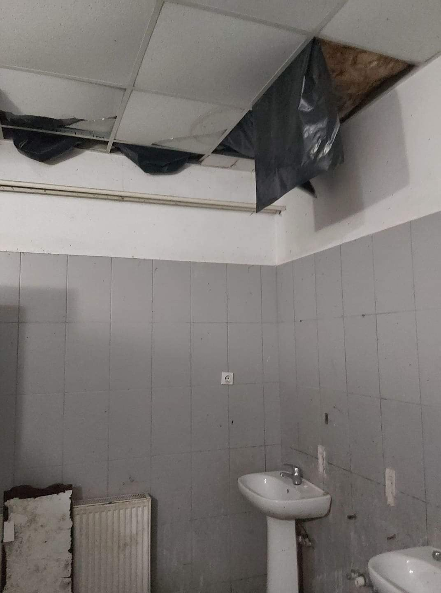

### **AYS News Digest 6/5/22:** Survivors of a shipwreck in Greece facing **439 years in prison**
#### Frontex involved in serious crimes against people seeking protection with its drone operations since 2015/Tunisian coastguard retrieved 24 more bodies of people drowned after boats sank in April, death toll reaches 67, more victims are feared/Worrying camp conditions in Preševo, south of Serbia/Inhumane conditions of detention, 2,500 asylum seekers in Lithuania continue to face for 9 months/ & more news

](assets/30cca1556e27/1*U7jfhlbwMOPXBSsfFn09YQ.jpeg)

Photo: [Borderline Europe](https://twitter.com/BorderlineEurop/status/1522310668736774147?fbclid=IwAR3PDTwml5cQ4CladEghcWjIqoE4MTkbxU9mDEAr8rzHTv-TMqk7YuIwGpM)
#### FEATURED

On May 5, Kheiraldin, Abdallah and Mohamad — survivors of the shipwreck that took place near Paros island on Christmas Eve — were sentenced to a total of 439 years in prison by a Greek court on Syros island\.

Kheiraldin was sentenced to 187 years as the “captain”, Abdallah and Mohamad each to 126 as the “mechanic” and the “assistant”\. Even though the court, who acknowledged that they are not smugglers that acted for profit, dropped the charges of “being part of a criminal organization” and did not impose life sentences, the three fathers were still convicted for “facilitating unauthorized entry”\. In the case of Kheiraldin, he tried three times to reach Greece by land but was turned back each time by EU border guards, which led him to take the boat, states Borderline Europe\.

Despite the fact that a court expert testified that not smugglers but refugees steer boats to escape to the EU, and whilst the prosecutions only witness didn’t show up, a scandalous sentence was still passed, says Mare Liberum\.

■■■■■■■■■■■■■■ 
> **[Mare Liberum e.V.](https://twitter.com/teammareliberum) @ Twitter Says:** 

> > Kheiraldin, Abdallah & Mohamad were sentenced to a total of 439 years in prison today!

This systematic criminalisation of migrants is outragous! Our thoughts are with them and their families.

Free #Paros3 #DropTheCharges #BorderCrimes 

> **Tweeted at [2022-05-05 19:33:39](https://twitter.com/teammareliberum/status/1522298499764834304).** 

■■■■■■■■■■■■■■ 

■■■■■■■■■■■■■■ 
> **[CPT-Lesvos](https://twitter.com/CPTLesvos) @ Twitter Says:** 

> > On 05 May, the trial against them will take place on #Syros. We will be there together with family members! We demand freedom for all those imprisoned for “boat driving” and an end to the criminalization of migration! @[CPTLesvos](https://twitter.com/CPTLesvos) @[cpt_intl](https://twitter.com/cpt_intl) 
#theproblemistheborder #paros3 #samos2 

> **Tweeted at [2022-05-04 10:19:32](https://twitter.com/cptlesvos/status/1521796664008359937).** 

■■■■■■■■■■■■■■ 

#### GREECE
### **Systematic criminalization of people on the move and violent pushbacks continue across the country**

■■■■■■■■■■■■■■ 
> **[Eleni Konstantopoulo](https://twitter.com/EleniKonstanto) @ Twitter Says:** 

> > #Refugees stuck in violent crossfire of #Pushbacks #Evros.5 applications for interim measures have been approved by ECtHR in the last month, while a sixth application of the Hellenic Council for Refugees for a group of 14 people who are trapped is pending [efsyn.gr/ellada/dikaiom…](https://www.efsyn.gr/ellada/dikaiomata/342610_prosfyges-se-diastayroymena-pyra-stis-nisides-toy-ebroy) 

> **Tweeted at [2022-05-06 09:49:22](https://twitter.com/elenikonstanto/status/1522513845129994242).** 

■■■■■■■■■■■■■■ 

A group of 40 Syrians who have been pushed back twice and who had been stuck in a violent crossfire between Greek and Turkish border guards on the island of Evros, describe in [EfSyn newspaper](https://www.efsyn.gr/ellada/dikaiomata/342610_prosfyges-se-diastayroymena-pyra-stis-nisides-toy-ebroy) how they’ve been tortured by the Greek guards\.

The group finally crossed the Greek border for the third time on Friday, May 6\. Together with a group of 14 Palestinians, they filed for interim measures at [the European Court for Human Rights \(ECtHR\), which has already approved five of them](https://www.gcr.gr/en/news/press-releases-announcements/item/1962-the-european-court-for-human-rights-ecthr-grants-interim-measures-for-5th-group-of-syrian-refugees-stranded-on-an-islet-in-the-evros-river) \. The latest one is awaiting approval\.

The Court has ordered the Greek government not to remove the refugees from the country’s territory and to provide them with food, water and proper medical care\. According to EfSyn newspaper, the Prosecutor of Orestiada has instructed the Orestiada Police Directorate to conduct an operation to locate the refugees, and to ensure that they are included in the legal reception and asylum procedures\.
#### SERBIA
### Worrying camp conditions in Preševo

Photo: Transbalkanska Solidarnost Facebook

[Transbalkanska Solidarnost](https://www.facebook.com/transbalkanskasolidarnost/posts/pfbid0Dmph25N4Ah6TbRqFVK1WtkCtXknz4kBh5VQYAts4e8b5SXe6ri7uuZFkS97WeCGGl) reports on the deteriorating conditions of people living in the camp of Preševo, about 10 kilometres from the Macedonian\-Serbian border\.

In striking contrast to this reality, UNHCR has evaluated the camp in Preševo as adequate in terms of shelter, hygiene, level of privacy, medical treatment, and security in a [report](https://data2.unhcr.org/en/documents/details/89400) on camps in Serbia, published at the end of March \(see p\. 14 of the report\) \. And, it mentions that the camp host 319 refugees, mostly of an Afgan origin, however, according to people who stay inside, currently there are 1000 people\.
#### TUNISIA
### Deaths mount off Tunisian coast

Tunisian coastguard retrieves 24 more bodies of people drowned after boats sank in April, death toll reaches 67, more victims are feared

Photo: Wahid Dahech/ Handout via REUTERS

Tunisia’s coastguard has discovered 24 more bodies of people who were aboard boats that sank off the coast near the city of Sfax in late April, a judicial official told [Reuters on May 4](https://www.reuters.com/world/africa/tunisia-finds-24-more-bodies-migrants-after-boats-sank-april-2022-05-04/) \.

The confirmed death toll has now reached 67 from last month’s sinking of four boats as they tried to cross the Mediterranean to Italy\. More than 50 people are still missing\.
#### SEA
### Sea surveillance: Frontex involved in serious crimes with its drone operations since 2015

■■■■■■■■■■■■■■ 
> **[Sea-Watch International](https://twitter.com/seawatch_intl) @ Twitter Says:** 

> > Frontex takes over aerial reconnaissance for Libya with its #drone and is responsible for #pullbacks. Several of the boats sighted in the central Mediterranean are reported to the so-called Libyan Coast Guard via #Frontex and pulled back - often by force. https://t.co/JybzcxbFH7 

> **Tweeted at [2022-05-05 14:47:59](https://twitter.com/seawatch_intl/status/1522226605741027329).** 

■■■■■■■■■■■■■■ 

Frontex’s own data indicates that at least 13,000 people have been spotted using drones in 300 cases, according to Sea\-Watch International\.

From Malta, the European Border Agency monitors and tracks boats in distress using a Heron 1 drone\.

■■■■■■■■■■■■■■ 
> **[Sea-Watch International](https://twitter.com/seawatch_intl) @ Twitter Says:** 

> > For this purpose, the European Border Agency operates a Heron 1 #drone from Malta. Boats in distress are observed and tracked from the air. According to #Frontex's own data, at least 13,000 people in 300 cases have been spotted with the help of long-range drones. https://t.co/5bgRk94TVk 

> **Tweeted at [2022-05-05 14:48:01](https://twitter.com/seawatch_intl/status/1522226613932511235).** 

■■■■■■■■■■■■■■ 

■■■■■■■■■■■■■■ 
> **[Sea-Watch International](https://twitter.com/seawatch_intl) @ Twitter Says:** 

> > Also thanks to the documentation of our Airborne crew, we have to assume that #Frontex drones are involved in several of the illegal returns to #Libya. In Libya, people on the move face severe human rights violations, arbitrary detention, and torture. https://t.co/2PswleaViA 

> **Tweeted at [2022-05-05 14:48:02](https://twitter.com/seawatch_intl/status/1522226621402517507).** 

■■■■■■■■■■■■■■ 

Read more on this [here](https://digit.site36.net/2020/06/26/frontex-air-service-reconnaissance-for-the-so-called-libyan-coast-guard/) \.
#### ITALY
### **100 people reach shore, and two dead in southern Italy**

The Italian coast guard rescued more than 100 people and recovered two bodies after their boat ran aground in Siderno, southern Italy, on May 6\.

Overall 111 people had been aboard, including 12 women and 10 minors when the boat hit an old disused pier on the coast of Siderno, [according to local media](https://www.lacnews24.it/cronaca/migranti-a-siderno-barca-si-incaglia-a-pochi-metri-dalla-riva-ci-sono-due-morti-e-si-temono-dispersi--live_154107/?fbclid=IwAR3eRpIkvo3QJzzaJVtrdR5N4Gl3ArOOdInXCDeGDAuhbNEUtzKeXZsrASY) \.
#### SPAIN

■■■■■■■■■■■■■■ 
> **[Alarm Phone](https://twitter.com/alarm_phone) @ Twitter Says:** 

> > The government of #Spain is dismantling the rescue coordination centre in #Tarifa. 
The work of @[salvamentogob](https://twitter.com/salvamentogob) has been crucial to rescue people at sea. A takeover by the military means a further shift toward deterrence and away from rescuing lives at risk! #MasManosMasVidas 

> **Tweeted at [2022-05-05 10:06:07](https://twitter.com/alarm_phone/status/1522155672967725057).** 

■■■■■■■■■■■■■■ 

#### LITHUANIA
### **For 9 months 2,500 asylum seekers in Lithuania continue to face inhumane conditions of detention**

More than 2,500 people on the move continue to live under inhumane and degrading conditions for 9 months now, despite a [report](https://www.lrt.lt/en/news-in-english/19/1596976/report-slams-lithuania-s-treatment-of-asylum-seekers-as-inhuman-and-degrading?fbclid=IwAR3-BFgZ28kVwZsUElj7FfjIzWHgpwME982GwgEozcyGJd8okf4MlrjUWXA) published by the Seimas Ombudsmen’s Office \(SOO\) at the beginning of the year, which revealed how Lithuania treats refugees, asylum seekers, and other migrant groups — which is equivalent to detention\.

Being arbitrarily detained and with no access to a fair asylum process, survivors of torture and sexual abuse experience mental health distress as health and protection conditions are inadequate and no specialised support for a psychiatric disorder is provided, reports MSF\.

60% of people examined by psychologists from MSF in Lithuania between January and March 2022 have complained of anxiety\. The majority of these patients indicated that their fears were related to the conditions of detention in the detention camps, states journalist Franziska Grillmeier on Twitter\.

■■■■■■■■■■■■■■ 
> **[Franziska Grillmeier](https://twitter.com/f_grillmeier) @ Twitter Says:** 

> > In #Litauen sitzen über 2.500 Geflüchtete und Migrant:innen (die zuvor über #Belarus nach #EU gekommen waren) seit 9 Monaten unter menschenunwürdigen Bedingungen in Haft. /1

(c)@[MSF](https://twitter.com/MSF) https://t.co/jMcPLkcNGQ 

> **Tweeted at [2022-05-06 13:40:52](https://twitter.com/f_grillmeier/status/1522572106311024640).** 

■■■■■■■■■■■■■■ 

> “I used to sleep in the night, now I cannot sleep\. I am very small, I have lost weight, I don’t have vitamins\. A lot of people are sick, but they are not \[physically\] sick\. They do not have covid \[or\] something like this, they are sick mentally,” _says a man detained from Mali\._ 

More on the topic [here](https://www.msf.org/prolonged-detention-over-2500-migrants-lithuania-must-end-now?fbclid=IwAR1VxbkQ4xhYg2li3EpQqb23KMh0sqSxLboH7kAOQfNXT2bef7N3iVrgBSo) \.
#### POLAND
### **Group of lawyers in Krakow: Providing assistance to asylum seekers is legal\!**

Through the website, [Prawo na granicy](https://prawonagranicy.pl/?fbclid=IwAR1VxbkQ4xhYg2li3EpQqb23KMh0sqSxLboH7kAOQfNXT2bef7N3iVrgBSo) \(Law on the border\), a group of lawyers — attorneys\-at\-law, prosecutors, judges, experts with the Krakow Institute for Criminal Law — Foundation, and employees and students of the Criminal Law Department of Jagiellonian University, **raise awareness on the legality of providing assistance to people crossing borders, as well as the unconstitutionality of the law prohibiting the right to stay in the border area** \.

As a response to border violence and prosecution of activists or ordinary people helping people on the move, Grupa Granica invites everyone to read the materials and deepen their knowledge of the law\.

> “The knowledge gathered can be extremely useful and helpful both for people living in border regions and for volunteers from all over Poland wishing to support refugees on the spot” _, states Grupa Granica on Facebook\._ 

#### FRANCE
### **Silmutaneus evictions in Calais and Grande Synthe**

On May 5, French authorities destroyed tents and left people on the streets in Calais and Grande Synthe, according to Human Rights Observers\.

■■■■■■■■■■■■■■ 
> **[Human Rights Observers](https://twitter.com/HumanRightsObs) @ Twitter Says:** 

> > #Expulsions simultanées à #Calais et #GrandeSynthe. À Grande Synthe, les personnes exilées sont expulsées pour permettre aux tractopelles de détruire leurs quelques habitations rudimentaires et leurs tentes. https://t.co/WfkMH5AXHu 

> **Tweeted at [2022-05-05 14:56:34](https://twitter.com/humanrightsobs/status/1522228768777068544).** 

■■■■■■■■■■■■■■ 

■■■■■■■■■■■■■■ 
> **[Human Rights Observers](https://twitter.com/HumanRightsObs) @ Twitter Says:** 

> > À #Calais, 12 lieux de vie expulsés. Les #expulsions se sont faites sans tractopelles, mais le résultat est le même ; les personnes exilées sont expulsées et leurs tentes sont saisies et trainées par terre, les condamnant à l'errance. https://t.co/yhgxZkeiQv 

> **Tweeted at [2022-05-05 14:56:56](https://twitter.com/humanrightsobs/status/1522228860842131458).** 

■■■■■■■■■■■■■■ 

At the same time in Paris, [27 young people were refused access to the Clichy accommodation centre and returned to the street](https://utopia56.org/27-jeunes-remis-a-la-rue-quelques-heures-apres-une-mise-a-labri/?fbclid=IwAR2bsfA3HLrQqfugIV4tuf6enVeOzxnls-Y0ht4zv2qbM7bbE31A_mbzvEI) while others see makeshift camps as the only solution\.

_Around 300 migrants are now staying in this informal camp on the edge of Paris \| Photo: Utopia56_

More specifically, around 300 people — mostly Afghan asylum seekers — are forced to survive in any way they can in the outskirts of Paris, reports InfoMigrants\. Read the article [here](https://www.infomigrants.net/en/post/40322/makeshift-camp-in-paris-the-only-option-for-hundreds-of-migrants?fbclid=IwAR06ajT3LJtl2oC3Smo9UbM0jq4NcgFBlJe_cb4C-6WVtaLIcVNgIz0l23k) \.
#### UK
### **UK’s government cuts overseas foreign aid to leave 40,000 Syrian children out of school**

More than 40,000 Syrian children in northern Syria will be forced out of school amid cuts in the British government’s foreign aid to the UK\-based charity Syria Relief as of 30 April, [reports the Guardian\.](https://www.theguardian.com/global-development/2022/may/05/uk-aid-cuts-have-forced-40000-syrian-children-out-of-school-charity-says?fbclid=IwAR0s4DFpYnMBmd9T536sfvLjpE85i_t0xNJuwpbflfV1Swli_HteGNfmr-Y)

[Syria Relief](https://syriarelief.org.uk/appeals/save-syrias-schools/) based in Manchester is one of the largest Syria\-focused non\-governmental organizations, and currently operates 133 schools in Northern Syria\. However, with the decision of the British government to cut its total foreign aid spending from its commitment of 0\.7% of gross national income to 0\.5%, the number of schools might be reduced to just 24 and, potentially, zero by August 2022\. More on this [here](https://syriarelief.org.uk/media/220504143232/the%20children%20failed%20by%20the%20world%20v6.pdf) \.

In other more positive news from Manchester, Afgan women enjoy cycling for the first time with the support of the Care4Calais organization and the British Cycling organisation\.

](assets/30cca1556e27/1*Kb2ErC6TtvT6fS8U6B29Nw.jpeg)

Photo: [Care4Calais](https://www.facebook.com/care4calais/?__tn__=-UC*F)
#### Events

On 10 May, don’t miss [the free webinar “From the ashes to Europe’s audience: the creation of The Logbook of Moria”](https://exposingtheinvisible.org/news/webinar-logbook-of-moria/) , on the award\-winning investigation into Europe’s most notorious refugee camp, by We are Solomon news media\.

■■■■■■■■■■■■■■ 
> **[Lieke Ploeger](https://twitter.com/liekeploeger) @ Twitter Says:** 

> > 📍 On 10 May, join the free #webinar "From the ashes to Europe's audience: the creation of The Logbook of #Moria", on the awarded investigation into Europe’s most notorious refugee camp, with @ipapangeli
 and @[Malichudis](https://twitter.com/Malichudis) of @[we_are_solomon](https://twitter.com/we_are_solomon)

[exposingtheinvisible.org/news/webinar-l…](https://exposingtheinvisible.org/news/webinar-logbook-of-moria)

#cijieu #IJ4EU https://t.co/f61jPYfiZ9 

> **Tweeted at [2022-05-02 11:17:43](https://twitter.com/liekeploeger/status/1521086528499372034).** 

■■■■■■■■■■■■■■ 

#### **Worth listening** & reading
- Displacements, an IMRC podcast series

> We live in an ever\-increasingly mobile world\. Wilfrid Laurier University’s International Migration Research Centre \(IMRC\) supports scholarship and research on international migration and mobility at global, national, regional and local scales\. The Centre provides platforms for rich debate, research, policy analysis and community engagement\. And now, the IMRC takes on a new digital platform through its exciting and informative podcast\. Join Director Alison Mountz and Associate Director Kim Rygiel as they talk to authors, activists, scholars, creatives and a host of other people engaging in migration, displacement, and related issues\. New episodes are published every other Monday\! 

- Humanitarian and security concerns clash at Greece’s borders

- My Plea for a Sixth Love Language

[](https://www.nytimes.com/2022/05/06/style/modern-love-college-essay-winner-syrian-war-whatsapp-group-chat.html?unlocked_article_code=AAAAAAAAAAAAAAAACEIPuomT1JKd6J17Vw1cRCfTTMQmqxCdw_PIxftm3iWka3DIDm4ciP8JEoyNvELKaad5YZ432CqWAdRGNLsiS_E3w_RENl0oVAiupJae3Y8UOSQ8r8esV3lzwJLEQasx6SevYXO-Nf86z722o1SGLD20S7WjuRBMQG0eqoA5PRyix2pbheqeQLsixNIqiPwrUpgtWWgGZHSVu_XiCAEuPdvQchjd71IyC74PCTqCysWOqO5VKHUkAl3BS3J05244-YkcbItRZPCjWkZmLMnugrwRCXhqKJOrAPAxRovTkrZqtN3duEDGiZr2l7htSvIi7P6TuX26NV0vVLqSIFz2OzcbvzRM8Uha0CW29U5PwH8Ztumzly8LtN7Afg&smid=url-share&fbclid=IwAR3pdiWw2dOpIetvPYSb9QzVPja2ddA4jwePdPY2c4peQDWRIbFz7C8-Zgs)

- What Ukraine, Afghanistan and Syria Have Taught Us About the Political Will Behind International Refugee Law

- Irish journalist Sally Hayden reveals what EU policies mean for those who are prevented from seeking asylum in Europe

**Find daily updates and special reports on our [Medium page](https://medium.com/are-you-syrious) \.**

**If you wish to contribute, either by writing a report or a story, or by joining the info gathering team, please let us know\.**

**We strive to echo correct news from the ground through collaboration and fairness\. Every effort has been made to credit organisations and individuals with regard to the supply of information, video, and photo material \(in cases where the source wanted to be accredited\) \. Please notify us regarding corrections\.**

**If there’s anything you want to share or comment, contact us through Facebook, Twitter or write to: areyousyrious@gmail\.com**

_Converted [Medium Post](https://medium.com/are-you-syrious/ays-news-digest-6-5-22-survivors-of-a-shipwreck-in-greece-facing-439-years-in-prison-30cca1556e27) by [ZMediumToMarkdown](https://github.com/ZhgChgLi/ZMediumToMarkdown)._
