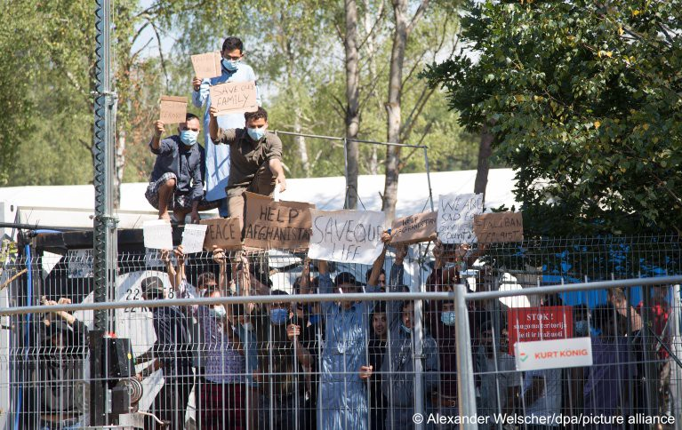
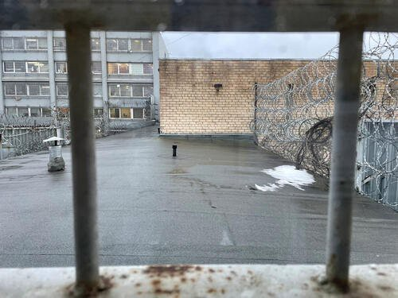
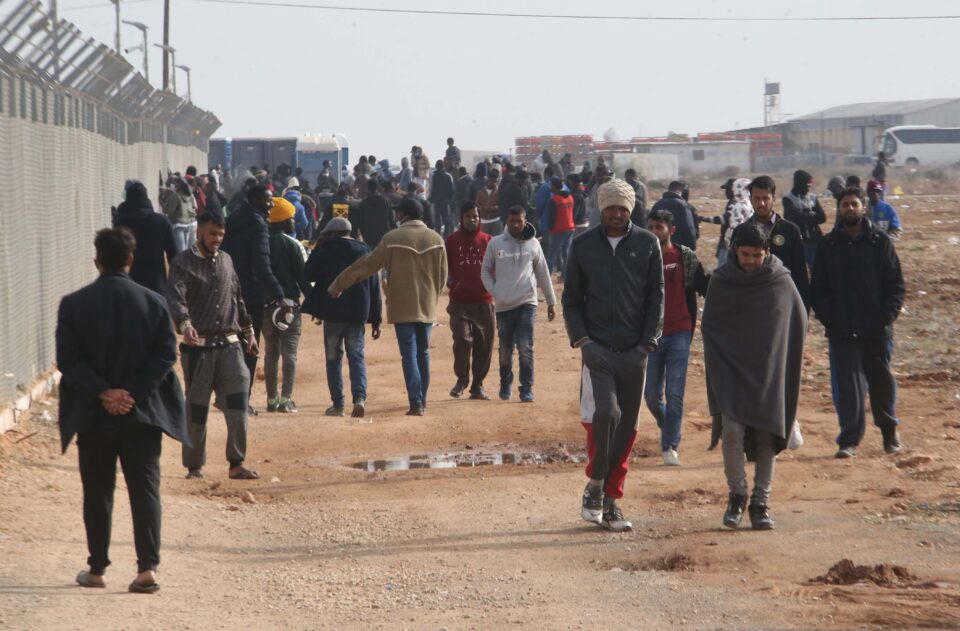
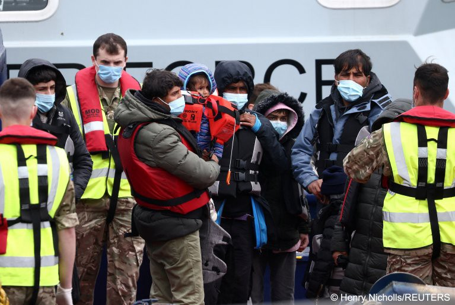

### AYS Digest 11/5/22: 2,500 asylum seekers and refugees being held in prolonged, inhumane detention in Lithuania

Rise in racism and xenophobia in Turkey//\#OtherFaceofEurope//Jonas Grimheden speaks of pushbacks involving FRONTEX//Border enforcement and violence in Hungary//A fire at Pournara facility in Cyprus//Las Vidas sin Rastro Campaign//Expulsions in Calais//UK\-Rwanda deal…

Source: InfoMigrants, 10/5/22
### **TURKEY**

**Rising xenophobia towards refugees and migrants**

There have been several reports over the last few years about the increasing racism towards Syrians in Turkey\. Syrian refugees make up around 3\.6 million of the roughly 4 million refugees in Turkey\.

This resentment, however, extends to many other refugees, asylum seekers, and foreign nationals in the country\. A poll was carried out in 2021 showing that over 70% of Turks would vote for the party that would promise the toughest action against refugees\.

In the midst of economic and political turmoil, there are increasing anti\-refugee sentiments among the general public and within political spheres\. Erdogan pledged he would never send Syrians back to Syria, however, there is now significant pressure on him to take harsher measures\.

European countries should be arguing against any ideas of implementing forced returns, and should be reinforcing the commitment to the safety and dignity of Syrian refugees\.

Further reading:

**Reports further suggest that [migrant women are the most threatened and impacted by rising anti\-refugee and racist rhetoric](https://www.kadinisci.org/2022/05/10/multeci-kadinlar-her-turlu-siddete-acik-en-ucuz-isgucu/?fbclid=IwAR29Q7KdKvrzIIFrtBwK5KCg4F6JD64oBKZYZLM4Zeg4SaGX1udJkPsm2BI)**

There are very high rates of migrant women workers who are being exploited, underpaid, and are unprotected from physical and sexual violence at work and at home\.
### **EU/FRONTEX**

**An interesting [thematic analysis by Statewatch](https://eubudgets.tni.org/section3/?fbclid=IwAR2eQ0MsUMKgmoXYZoWHZl_nhQXYSeJ8PfJLuJAHiYl9tTEFdyj4MtEkmyY#2) on the EU’s security budget**

This analysis delves into the roles of European development aid, the criticism of the EU’s external migration policy, the empowerment of certain EU agencies and so much more\.

**A former FRONTEX officer has voiced their opinion on the referendum on whether to increase funding provided by Switzerland to the agency:**

■■■■■■■■■■■■■■ 
> **[Statewatch](https://twitter.com/StatewatchEU) @ Twitter Says:** 

> > Former Frontex officer pledges to vote “no” in referendum on Swiss funding for the agency

The border guard expressed fears that Switzerland may end up being an accomplice in unlawful actions if the decision to increase funding to Frontex is approved.

[statewatch.org/news/2022/may/…](https://www.statewatch.org/news/2022/may/former-frontex-officer-pledges-to-vote-no-in-referendum-on-swiss-funding-for-the-agency/) 

> **Tweeted at [2022-05-10 13:03:00](https://twitter.com/statewatcheu/status/1524012126284570624).** 

■■■■■■■■■■■■■■ 

**Jonas Grimheden has stayed silent on pushbacks involving FRONTEX, but has made this statement below:**

■■■■■■■■■■■■■■ 
> **[front-LEX](https://twitter.com/LexFront) @ Twitter Says:** 

> > .@[JGrimheden](https://twitter.com/JGrimheden)'s mandate covers joint op's with member states. But he claims he “will not manage” to look at every human rights violation. There are simply too many. 

To date he stayed silent about pushbacks involving Frontex, like the one of Alaa Hamoudi.

[twitter.com/LexFront/statu…](https://twitter.com/LexFront/status/1504389380856811524) https://t.co/ynKxzthvjb 

> **Tweeted at [2022-05-11 11:20:57](https://twitter.com/lexfront/status/1524348834402508800).** 

■■■■■■■■■■■■■■ 

**Twitter Threads on the \#OtherFaceofEurope and the use of technology at borders and within border control:**

■■■■■■■■■■■■■■ 
> **[Border Violence Monitoring Network](https://twitter.com/Border_Violence) @ Twitter Says:** 

> > 1/6 Yesterday Europe celebrated #EuropeDay.
Today we present the #OtherFaceOfEurope. 

Read our 🧵 below...
...and stay tuned for more from our Solidarity Campaign!
#SafePassageForAll
#EndBorderViolence https://t.co/6IY6sjIw12 

> **Tweeted at [2022-05-10 15:06:57](https://twitter.com/border_violence/status/1524043319277408259).** 

■■■■■■■■■■■■■■ 

■■■■■■■■■■■■■■ 
> **[EDRi](https://twitter.com/edri) @ Twitter Says:** 

> > 1/8 #BorderTech is increasingly being used to make decisions &amp; predictions about millions of people on the move. Despite popular public perception that tech is objective &amp; less brutal than humans, its use in border policing deepens discrimination &amp; leads to tragic loss of life. https://t.co/QnZdzXhqte 

> **Tweeted at [2022-05-11 13:32:02](https://twitter.com/edri/status/1524381820355330048).** 

■■■■■■■■■■■■■■ 

### **GREECE**

■■■■■■■■■■■■■■ 
> **[International Kurdistan Committee of Greece](https://twitter.com/StopPushbacks) @ Twitter Says:** 

> > Serhat Yılmaz, Dogan Imrak, İzzettin, and Abdulvahap were arrested in #Turkey due to an illegal #pushback from #Greece in the #Evros region! They expect long years of political prison in bad conditions because Greece/#EU denied them the right to #asylum!
#PushbacksAreIllegal 

> **Tweeted at [2022-05-10 12:47:27](https://twitter.com/stoppushbacks/status/1524008215243104258).** 

■■■■■■■■■■■■■■ 

■■■■■■■■■■■■■■ 
> **[Manos Moschopoulos](https://twitter.com/maledictus) @ Twitter Says:** 

> > Greek government surrogates today insisting that the hit on our economy would be too huge. Would love to see some numbers to back that up — otherwise, it seems that our politics is (once again) beholden to a handful of business interests. 1/2 

> **Tweeted at [2022-05-10 08:54:30](https://twitter.com/maledictus/status/1523949591384756226).** 

■■■■■■■■■■■■■■ 

■■■■■■■■■■■■■■ 
> **[Manos Moschopoulos](https://twitter.com/maledictus) @ Twitter Says:** 

> > Greece’s government blasted the opposition for not being “clear” on condemning Putin’s invasion and showing solidarity with Ukraine. Blocking EU measures to deprive the Kremlin of funding for bombs that target schools, hospitals and neighborhoods is a disgrace. 2/2 

> **Tweeted at [2022-05-10 08:54:31](https://twitter.com/maledictus/status/1523949593054134272).** 

■■■■■■■■■■■■■■ 

### **HUNGARY**

**The impenetrable border**

Hungary has made the effort to welcome Ukrainian refugees, the same rhetoric exists as in many other European countries, where other migrants are still rejected\.

Testimonies from refugees trying to cross from Serbia into Hungary highlight the border violence, pushbacks, and rejections\.

The government that was elected in 2015 got rid of the previous asylum system, and built a 4m high, 175km long, barbered\-wire fence on its border\. In addition, since 2020, individuals can only begin applying for asylum from the Hungarian embassies in Belgrade or Kyiv\. They have to write a letter of intent and then wait for the decision on this letter before being able to travel to Hungary\. They can then submit an asylum application\.

The Hungarian Helsinki Committee have published information leaflets for non\-Ukrainians fleeing from Ukraine to Hungary: [Information for non\-Ukrainian citizens fleeing from Ukraine](https://helsinki.hu/en/information-for-nonukrainian-citizens-fleeing-from-ukraine/?fbclid=IwAR1Av-77356kS7YFMpomF6wFWtsynHtJ4j_3ft8w32pepJ0E4ijZJCayUIg)
### **BOSNIA AND HERZEGOVINA**

■■■■■■■■■■■■■■ 
> **[NoNameKitchen](https://twitter.com/NoNameKitchen1) @ Twitter Says:** 

> > Again harassment against people at the European Union borders: Around 90 people today were forcibly taken from Velika Kladusa (Bosnia and Herzegovina) to Lipa Camp. 

> **Tweeted at [2022-05-11 09:43:07](https://twitter.com/nonamekitchen1/status/1524324213229862913).** 

■■■■■■■■■■■■■■ 

### **LITHUANIA**

**Asylum seekers detained in inhumane conditions**

Source: MSF, 6 May 2022

MSF has stated that over 2,500 asylum seekers and migrants are being held in appalling conditions, several months after they have crossed from Belarus\. MSF’s country representative in Lithuania, Georgina Brown claimed:

> “MSF teams have witnessed the physical and mental health distress caused by detention… People do not have access to a fair asylum process and there is no specialised support for psychiatric disorders or survivors of torture and sexual violence\.” 

Many have been detained since 2021, at a time when there was a rise in the number of people from Iraq, Congo, Syria, Cameroon and Afghanistan who were trying to cross from Belarus to Poland, Lithuania, and Latvia\.

MSF has further added that members of the LGBTQ\+ are especially at risk of discrimination and mental health decline\.

### **CYPRUS**

**Pournara reception centre**

It is located outside the village of Kokkinotrimitha\. Around 100 asylum seekers enter the area each day, and each week, [70 are deported](https://cyprus-mail.com/2022/05/10/over-1500-failed-asylum-seekers-deported-so-far-this-year/?fbclid=IwAR3vSHa-okVT9zx5iFUNLRJUuo9K9AxN1zTCZvY20zRq5n_oWBjwGP-oMg8) \.

> “Police said the Pournara facility, designed for a capacity for 400 people, now hosts around ten times that number — some 4,000\.” 

Source: CyprusMail, May 10 2022

> “Officials of the asylum service told parliamentarians they are considering erecting a double fence around Pournara in a bid to stop people from leaving the facility at will\.” 

**At least six injured in a fire at Pournara**

[InfoMigrants reports that it is still unclear what was the cause of the fire\.](https://www.infomigrants.net/en/post/40423/at-least-6-injured-after-fire-in-cyprus-migrant-camp)

There have been several reports on the conditions at Pournara, highlighting the facts that it is overcrowded, there is a very limited food supply, and there are no activities or educational programmes for the children\.
### **MOROCCO**

**After months of tension between Spain and Morocco, [Spain has thanked Morocco for their work on _“irregular”_ migration](https://www.moroccoworldnews.com/2022/05/348857/spain-thanks-morocco-for-far-reaching-efforts-on-irregular-migration) \.**

In mid\-2021, Spanish media and political parties questioned the work being done by the Moroccan government against organised crime and _“irregular”_ migration\.

As a result of this renewed relationship between the states, they will collectively aim to strengthen coordination and the sharing of information, which includes updating their working methods at the level of police cooperation and liaison officers\.
### **SEA/SAR**

**72 rescued and 28 missing off the Canary Islands**

The first boat was first spotted on Monday morning\. By the time the coastguard and rescue services arrived, only 13 individuals had survived\. There were originally at least 40 people on board\.

A second boat was spotted on Tuesday, and 59 people were brought to safety\.

■■■■■■■■■■■■■■ 
> **[MSF Sea](https://twitter.com/MSF_Sea) @ Twitter Says:** 

> > With an alert through @[alarm_phone](https://twitter.com/alarm_phone) and the precious help of @[PVolontaires](https://twitter.com/PVolontaires) we were able to locate and rescue a rubber boat in distress with 59 people on board this morning. Among the survivors, we had two people traveling with broken limbs.

📷@[Anna_Pantelia](https://twitter.com/Anna_Pantelia) https://t.co/A4RM94Ql2F 

> **Tweeted at [2022-05-10 14:05:46](https://twitter.com/msf_sea/status/1524027924604669952).** 

■■■■■■■■■■■■■■ 

**MSF Sea has also carried out two further operations:**

■■■■■■■■■■■■■■ 
> **[MSF Sea](https://twitter.com/MSF_Sea) @ Twitter Says:** 

> > Over the course of a 5 hour operation, we carried out 2 further rescues last night. The 111 survivors were sailing in rubber boats. There are now 374 people on board the #GeoBarents.

📷@[Anna_Pantelia](https://twitter.com/Anna_Pantelia) https://t.co/mwUOD9EM6T 

> **Tweeted at [2022-05-11 10:52:53](https://twitter.com/msf_sea/status/1524341769080647680).** 

■■■■■■■■■■■■■■ 

**AlarmPhone has alerted about a sinking boat just off the coast of Libya:**

■■■■■■■■■■■■■■ 
> **[Alarm Phone](https://twitter.com/alarm_phone) @ Twitter Says:** 

> > 🆘️! People in distress off #Benghazi! Alarmphone is in contact with a group who fled #Libya. Their boat is leaking, water is coming in. We alerted authorities to rescue them immediately and to prevent a tragedy. 
Help is needed now! https://t.co/z9koVSecvI 

> **Tweeted at [2022-05-11 19:09:17](https://twitter.com/alarm_phone/status/1524466693891837954).** 

■■■■■■■■■■■■■■ 

### **SPAIN**

**Over 12,208 people have died on the southern border of Spain whilst travelling across the Mediterranean since 1988**

The goal of the _Vidas sin rastro_ campaign is to:

> “…denounce the lack of effective responses guaranteeing the rights of the dead, disappeared and their families at the southern border, and to demand the adoption and adaptation of existing mechanisms and instruments on disappearances, identification and repatriation of the dead to the transnational context of migration\.” 

You can find more information about the campaign here:

### **FRANCE**

**More tent removals and expulsions in Calais**

Human Rights Observers state that one person was arrested, which is a common practice to create fear and anxiety among displaced individuals\.

■■■■■■■■■■■■■■ 
> **[Human Rights Observers](https://twitter.com/HumanRightsObs) @ Twitter Says:** 

> > Opérations d'#expulsion à #Calais. Aujourd'hui, 2 personnes ont été arrêtées de façon arbitraire. Pendant les #expulsions, une ou deux personnes sont souvent arrêtées, sans autre but que de harceler les personnes exilées et de les maintenir dans un état de crainte permanente. https://t.co/mNs8Rn2mRg 

> **Tweeted at [2022-05-11 12:19:23](https://twitter.com/humanrightsobs/status/1524363537321283585).** 

■■■■■■■■■■■■■■ 

Human Rights Observers and Utopia56 argued the legality of these expulsions in front of a jury\. They put particular emphasis on the conditions by which individuals are having their belongings confiscated and destroyed\.

■■■■■■■■■■■■■■ 
> **[Human Rights Observers](https://twitter.com/HumanRightsObs) @ Twitter Says:** 

> > 🔔 Aujourd’hui au Tribunal judiciaire de Dunkerque avec @[Utopia_56](https://twitter.com/Utopia_56) nous avons attaqué la légalité des #expulsions, notamment les conditions de confiscation et de destruction des biens personnels, afin de faire condamner en conséquence la commune de #GrandeSynthe.

⬇️ Notre CP https://t.co/OLGSsH4dHp 

> **Tweeted at [2022-05-10 13:38:27](https://twitter.com/humanrightsobs/status/1524021049347788800).** 

■■■■■■■■■■■■■■ 

In addition to this, another letterbox in Calais, that has been used to allow refugees and asylum seekers to defend themselves in legal proceedings, has been damaged\.

■■■■■■■■■■■■■■ 
> **[Human Rights Observers](https://twitter.com/HumanRightsObs) @ Twitter Says:** 

> > Alors qu'hier nous attaquions l'illégalité des #expulsions menées à #GrandeSynthe, à #Calais une autre #boîteauxlettres installées pour permettre aux #exilés de se défendre devant la justice a été endommagée, le panneau rappelant la loi enlevé. 

L'invisibilisation continue. https://t.co/jQg4nsEwcK 

> **Tweeted at [2022-05-11 10:16:10](https://twitter.com/humanrightsobs/status/1524332528290738178).** 

■■■■■■■■■■■■■■ 

### **UK**

**Refugee Council’s response to Queen’s Speech**

A proposal to replace the Human Rights Act 1998 with a British Bill of Rights was announced\. This has caused great concern among organisations for fear that the fundamental rights of refugees, currently in place, will be pushed aside\.

Refugee Council responds to the speech and shares their concerns: [Refugee Council’s response](https://www.refugeecouncil.org.uk/latest/news/refugee-council-responds-to-queens-speech-2022/?fbclid=IwAR3bIUHUlkG2r1FojZomr-G7g_jY8NZJATwH2W_PFsCJ-TL9TPpXUSWmlgc)

■■■■■■■■■■■■■■ 
> **[Statewatch](https://twitter.com/StatewatchEU) @ Twitter Says:** 

> > We were amongst more than 50 organisations that signed a letter to the government calling on them to keep the Human Rights Act.

The move to introduce a 'Bill of Rights' will diminish the ability of people to stand up to powerful institutions, and weaken the international system. 

> **Tweeted at [2022-05-11 10:16:19](https://twitter.com/statewatcheu/status/1524332566215598087).** 

■■■■■■■■■■■■■■ 

**Asylum seekers in hiding to avoid Rwanda deal**

The British Red Cross and the Refugee Council have stated that some asylum seekers have disappeared from hotels for fear of being sent to Rwanda\.

**UK to notify first group of individuals being sent to Rwanda**

This week, the [first group of asylum seekers](https://www.infomigrants.net/en/post/40431/uk-notifications-to-be-issued-to-first-group-of-migrants-destined-for-rwanda?fbclid=IwAR0rV0eZDiVDhisd3ms5Ee09w1cq90LXWw5-khaMmoHYVgKv6z_WXn_Yfsk) will be told about their relocation to Rwanda\.

Thankfully, lawyers are putting up a fight against these deportations, which has resulted in the arrangements for flights being postponed\. The UK government is also currently facing six legal actions brought by migrant rights organisations\.

Source: InfoMigrants, 11th May 2022

**Ukrainians and Afghans could also be sent to Rwanda**

Immigration minister Tom Pursglove did not deny that those who fled from Ukraine could also be considered to be sent to Rwanda\. Furthermore, he also refused to state whether Afghan nationals who worked alongside the British army could be deported\.

■■■■■■■■■■■■■■ 
> **[Colin Yeo](https://twitter.com/ColinYeo1) @ Twitter Says:** 

> > Also, I can’t count the ways the Rwandan system falls short of the minimum requirements of EU asylum law. UK is surely torpedoing any chance of rejoining the Dublin system of it does this to refugees. The Rwanda deal may prove mutually exclusive to other more realistic policies. 

> **Tweeted at [2022-05-10 15:04:45](https://twitter.com/colinyeo1/status/1524042766526861315).** 

■■■■■■■■■■■■■■ 

**WORTH READING:**
- Civil society organisations call on Members of the European Parliament to protect societies from biometric mass surveillance practices\.

- An interesting article by Border Criminologies on the UK\-Rwanda Deal:

- A report by the Danish Refugee Council on border mistreatment and pusbacks:

- Further updates on the UK\-Rwanda Deal:

**Find daily updates and special reports on our [Medium page](https://medium.com/are-you-syrious) \.**

**If you wish to contribute, either by writing a report or a story, or by joining the info gathering team, please let us know\.**

**We strive to echo correct news from the ground through collaboration and fairness\. Every effort has been made to credit organisations and individuals with regard to the supply of information, video, and photo material \(in cases where the source wanted to be accredited\) \. Please notify us regarding corrections\.**

**If there’s anything you want to share or comment, contact us through Facebook, Twitter or write to: areyousyrious@gmail\.com**

_Converted [Medium Post](https://medium.com/are-you-syrious/ays-digest-11-5-22-2-500-asylum-seekers-and-refugees-being-held-in-prolonged-inhumane-detention-a882087ec876) by [ZMediumToMarkdown](https://github.com/ZhgChgLi/ZMediumToMarkdown)._
