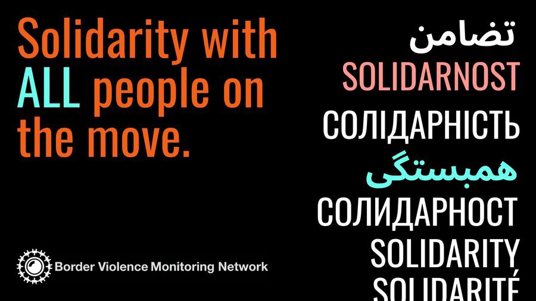
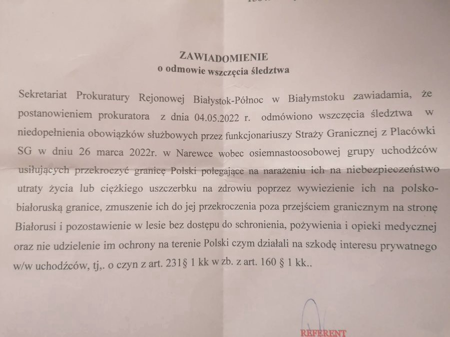

### AYS News Digest 9/5/22: EU threatens Switzerland on Frontex, as the regular citizens plant solidarity
#### Stateless people and those at risk of statelessness fleeing Ukraine are facing big barriers to protection // EU warns of serious consequences if Switzerland votes not to give CHF61 million for the \(securitisation and pushback\) work of Frontex // \+ more news and a handful of recommended reads for you

See BVMN Twitter to find out more about the SOlidarity campaign
### LIBYA
### Hold Stability Support Authority \(SSA\) militia leaders to account

Amnesty International wrote to the Libyan authorities on the complaints received against Abdel Ghani al\-Kikli and his former deputy Lotfi al\-Harari on 19 April 2022, demanding their removal from positions that would allow them to commit further violations, interfere in investigations or grant them immunity, pending investigations\. No response was received in time for publication\.

An Amnesty International delegation visited Libya in February and spoke to nine people who said they suffered grave human rights violations at the hands of the SSA members, as well as eight family members and three activists\.
### [Libya: Hold Stability Support Authority militia leaders to account](https://l.facebook.com/l.php?u=https%3A%2F%2Fwww.amnesty.org%2Fen%2Flatest%2Fnews%2F2022%2F05%2Flibya-hold-stability-support-authority-militia-leaders-to-account%2F%3Ffbclid%3DIwAR20jEU1TNqjxiKImG5SOfp71UVqUwAx1Lf_FJrRFZN4hmIOIS3nzpx3uU8&h=AT3tCd8a-1l-Dp4KJfIj_WvPlw1ZAg7eqnp8NvWdkPaARANlmQsLIZgD-n4a73Ih1Dzz1PaQwfwO0vNJrl7ScdXVWpznosutJjv2T7QsrPq8M853PM59rkZ1bcwolVT5JMGBalnnel5tLw&__tn__=R]-R&c[0]=AT2XabwLJ8WVkHzjXB_unq6b7C7-MP9Vg2td5r5BploPGl-hYiUBv4KW90oasnCFgM0T_Tu54y-qH3c69qdXQLRmltYBhph7DVTUCPBS8DEGciUZDScc4JUci5C9iyXJZkRXT0xeYqWQteZ_g9b0yB6XkFMt9OA507g_vPRRZIBvoQQ4pJJi-DqCqoqGi7R36UlqS6b1_01K)
### [Entrenched impunity has emboldened the state\-funded Stability Support Authority \(SSA\) militia to commit unlawful…](https://l.facebook.com/l.php?u=https%3A%2F%2Fwww.amnesty.org%2Fen%2Flatest%2Fnews%2F2022%2F05%2Flibya-hold-stability-support-authority-militia-leaders-to-account%2F%3Ffbclid%3DIwAR20jEU1TNqjxiKImG5SOfp71UVqUwAx1Lf_FJrRFZN4hmIOIS3nzpx3uU8&h=AT3tCd8a-1l-Dp4KJfIj_WvPlw1ZAg7eqnp8NvWdkPaARANlmQsLIZgD-n4a73Ih1Dzz1PaQwfwO0vNJrl7ScdXVWpznosutJjv2T7QsrPq8M853PM59rkZ1bcwolVT5JMGBalnnel5tLw&__tn__=R]-R&c[0]=AT2XabwLJ8WVkHzjXB_unq6b7C7-MP9Vg2td5r5BploPGl-hYiUBv4KW90oasnCFgM0T_Tu54y-qH3c69qdXQLRmltYBhph7DVTUCPBS8DEGciUZDScc4JUci5C9iyXJZkRXT0xeYqWQteZ_g9b0yB6XkFMt9OA507g_vPRRZIBvoQQ4pJJi-DqCqoqGi7R36UlqS6b1_01K)

[l\.facebook\.com](https://l.facebook.com/l.php?u=https%3A%2F%2Fwww.amnesty.org%2Fen%2Flatest%2Fnews%2F2022%2F05%2Flibya-hold-stability-support-authority-militia-leaders-to-account%2F%3Ffbclid%3DIwAR20jEU1TNqjxiKImG5SOfp71UVqUwAx1Lf_FJrRFZN4hmIOIS3nzpx3uU8&h=AT3tCd8a-1l-Dp4KJfIj_WvPlw1ZAg7eqnp8NvWdkPaARANlmQsLIZgD-n4a73Ih1Dzz1PaQwfwO0vNJrl7ScdXVWpznosutJjv2T7QsrPq8M853PM59rkZ1bcwolVT5JMGBalnnel5tLw&__tn__=R]-R&c[0]=AT2XabwLJ8WVkHzjXB_unq6b7C7-MP9Vg2td5r5BploPGl-hYiUBv4KW90oasnCFgM0T_Tu54y-qH3c69qdXQLRmltYBhph7DVTUCPBS8DEGciUZDScc4JUci5C9iyXJZkRXT0xeYqWQteZ_g9b0yB6XkFMt9OA507g_vPRRZIBvoQQ4pJJi-DqCqoqGi7R36UlqS6b1_01K)
### TURKEY

“We will never expel them from this land\. Our door is wide open to them\. We will continue to host them\. We will not throw them into the lap of murderers,” said Turkish president\.

Turkey has welcomed nearly five million refugees in total, including Syrians and Afghanis, but their presence has caused tensions with locals, especially as the country is in economic turmoil with the weakening lira and soaring energy and food prices\.

AlJazeera [reports](https://l.facebook.com/l.php?u=https%3A%2F%2Fwww.aljazeera.com%2Fnews%2F2022%2F5%2F9%2Fpresident-erdogan-pledges-turkey-will-not-expel-syrian-refugees%3Ffbclid%3DIwAR0fBvO0qVgy7rVPbI2-Ya6TaE6cjVF7eHj8v4MIARUDapuf2TVQQONPmCw&h=AT3Z4tqlSkzvJqJM0FTXf9AeopiCIsvJuSTSKSxK1fHaNjy4EWDyRuK4HJbHQ-_au-GeR7X3ZXnOsGy7Kmzk1Ot9w80R7QAABNulPD8bXclw2I5bUi_Rj_UO3pCValLmsA&__tn__=%2CmH-R&c[0]=AT14P__55IteNWKerLs__Zed7GJyhYm9p10yyqDLpKjVcsk6avtDsKLlNjQ3K0rX64Zu_4_SiWK1KURyhhJtBmPzxCPLGByK-xgCT-mUxmfsDL_i3F80dK9sZrTpWfzki-CEqwcxiL8iWE9BMai8St2RWxCMQ0zHNhIr4BJ0hLNPpf42gbgadwUTuSCisDqWfiMDQ-GYijYL8hNW1yE) that Erdogan announced Turkey would build enough local infrastructure in northwestern Syria to house one million refugees — in addition to the tens of thousands of units already built\.
### GREECE

One hundred and six people, including 20 children, were located by the Greek Coast Guard in a rocky area northwest of the island of Kos late on Saturday were transferred to the Kos Identification Centre\.

A sailing boat was found to have half\-sunk on the shore where the migrants were located\.

The passengers had reportedly managed to swim to the shore and were in good health, local media reported\.
### Relocation of minors

Over 1,200 unaccompanied children in Greece have been relocated to 13 European countries as a result of Greece’s Voluntary Relocation Programme, which has now been running for two years\. Meanwhile, the number of unaccompanied children who sought asylum in the European Union in 2021 jumped by 72%\.
### SERBIA

While Europe shows compassion to refugees from Ukraine, those from outside Europe face the same obstacles to get to the West as before — as BIRN found out on a night time visit to a forest in northern Serbia:
### [For Refugees on Serbia\-Hungary Border, ‘the Game’ Goes on](https://l.facebook.com/l.php?u=https%3A%2F%2Fbalkaninsight.com%2F2022%2F05%2F09%2Ffor-refugees-on-serbia-hungary-border-the-game-goes-on%2F%3Ffbclid%3DIwAR1_4TACN6gqebzt_2AGeOz19npCD263XaeCrOWc77eEt_mb6Iq7Vgm2Ygg&h=AT0pCvKUXRshzKoCRO3E4UkEi3Tx8aYPfx6wahEYHkrBp7rQdZptuDWiwyjTtNMyTF3xhF_OZBRKWi2ZzM_Rx8C6VmX5deH6f0oFAZYVawiJn2JmJhP32I4uLH6PwtiddAVHBwl4YTyh_A&__tn__=R]-R&c[0]=AT0nGAc99gkWG8703nNPLwsCFJ1LPEFBQNrshSi2bP5PkHoSSNVT9fXxrbdghcfktZRRCBFrZDrJHBEvqPwX2yzmpNJbVjxOWR75VHVIOLyvh0hLDHe-b9OJBkEmE7z5epPpgBvH-qx6OOQT1YhJNsoqwXyROZJoAuT9mUhOUg1P5bwDAEcudxeT2Tobe0mx2-8H5cB0uUt5)
### [If you didn’t know the context, it might look like a rave festival was taking place in the forest of Radanovac, on the…](https://l.facebook.com/l.php?u=https%3A%2F%2Fbalkaninsight.com%2F2022%2F05%2F09%2Ffor-refugees-on-serbia-hungary-border-the-game-goes-on%2F%3Ffbclid%3DIwAR1_4TACN6gqebzt_2AGeOz19npCD263XaeCrOWc77eEt_mb6Iq7Vgm2Ygg&h=AT0pCvKUXRshzKoCRO3E4UkEi3Tx8aYPfx6wahEYHkrBp7rQdZptuDWiwyjTtNMyTF3xhF_OZBRKWi2ZzM_Rx8C6VmX5deH6f0oFAZYVawiJn2JmJhP32I4uLH6PwtiddAVHBwl4YTyh_A&__tn__=R]-R&c[0]=AT0nGAc99gkWG8703nNPLwsCFJ1LPEFBQNrshSi2bP5PkHoSSNVT9fXxrbdghcfktZRRCBFrZDrJHBEvqPwX2yzmpNJbVjxOWR75VHVIOLyvh0hLDHe-b9OJBkEmE7z5epPpgBvH-qx6OOQT1YhJNsoqwXyROZJoAuT9mUhOUg1P5bwDAEcudxeT2Tobe0mx2-8H5cB0uUt5)

[l\.facebook\.com](https://l.facebook.com/l.php?u=https%3A%2F%2Fbalkaninsight.com%2F2022%2F05%2F09%2Ffor-refugees-on-serbia-hungary-border-the-game-goes-on%2F%3Ffbclid%3DIwAR1_4TACN6gqebzt_2AGeOz19npCD263XaeCrOWc77eEt_mb6Iq7Vgm2Ygg&h=AT0pCvKUXRshzKoCRO3E4UkEi3Tx8aYPfx6wahEYHkrBp7rQdZptuDWiwyjTtNMyTF3xhF_OZBRKWi2ZzM_Rx8C6VmX5deH6f0oFAZYVawiJn2JmJhP32I4uLH6PwtiddAVHBwl4YTyh_A&__tn__=R]-R&c[0]=AT0nGAc99gkWG8703nNPLwsCFJ1LPEFBQNrshSi2bP5PkHoSSNVT9fXxrbdghcfktZRRCBFrZDrJHBEvqPwX2yzmpNJbVjxOWR75VHVIOLyvh0hLDHe-b9OJBkEmE7z5epPpgBvH-qx6OOQT1YhJNsoqwXyROZJoAuT9mUhOUg1P5bwDAEcudxeT2Tobe0mx2-8H5cB0uUt5)
### FRANCE
### Calais: In 9 places evictions reports

The harassment experienced by people every 48 hours continues — forced to move their tents a few meters, their belongings constantly seized, and there is a general lack of information leading up to this\.

In Paris
### SWITZERLAND
### EU warns of serious consequences if Switzerland votes not to give CHF61 million for Frontex

> _“We have an agreement and we will insist that Switzerland is not able to choose which part of the agreement it may want to respect_ 

> _Schengen is not an “à\-la\-carte menu”_ 

These are the latest “hard core” messages from the EU to Switzerland, said by the EU commissioner Ylva Johansson\. The Swiss electorate will [vote on the new funding of Frontex on May 15](https://www.swissinfo.ch/eng/switzerland-votes-on-its-contribution-to-european-border-agency/47463950?utm_campaign=teaser-in-article&utm_content=o&utm_source=swissinfoch&utm_medium=display) \.

The most important effects in case of a negative vote on this issue will be the end of the Schengen and Dublin accords for Switzerland, she [said](https://www.swissinfo.ch/eng/eu-commissioner-warns-against-swiss--no--vote-on-frontex/47574988?fbclid=IwAR1gDK866zHQPlkx5oCXUPLXyaL28RUlMWCt_Hl8MnYcSEB9NSn1o6C2imc) \.

[Frontex](https://www.dailysabah.com/politics/eu-affairs/frontex-in-midst-of-migrant-pushback-mismanagement-scandals?fbclid=IwAR1v02scjNDHKRISHHVxecnAefIcZEBaGbjAJNXwzZWgmP_mfyXnEkkwTUk) , as we _all_ know, has been at the centre of scandals in the Aegean Sea for years due to its involvement in push backs from Greek to Turkish territory, with the Leggeri [resignation](https://www.schengenvisainfo.com/news/head-of-frontex-resigns-following-reports-of-migrant-pushbacks/) making headlines most recently, that we also [wrote](ays-news-digest-4-5-2022-how-much-of-an-impact-will-leggeris-resignation-have-on-the-approach-ed9a5942b541) about\.

Make sure to read our Frontex series of Specials to get a full overview of the Agency’s history, impact and dubious work in the field, funded by your money, very likely\.
### [AYS Special: Frontex and human rights — How did we arrive here? PART 1 \(2004–2016\)](ays-special-frontex-and-human-rights-how-did-we-arrive-here-part-1-2004-2016-17cffb340c07)
### [Working on an article about Frontex is not an easy task\. Information and allegations about the agency are piling up on…](ays-special-frontex-and-human-rights-how-did-we-arrive-here-part-1-2004-2016-17cffb340c07)

[medium\.com](ays-special-frontex-and-human-rights-how-did-we-arrive-here-part-1-2004-2016-17cffb340c07)
### [AYS Special: Frontex and Human Rights — How did we arrive here? PART 2 \(2017–2019\)](ays-special-frontex-and-human-rights-how-did-we-arrive-here-part-2-2017-2019-83dbb24acb7f)
### [Working on an article about Frontex is not an easy task\. Information and allegations about the agency are piling up on…](ays-special-frontex-and-human-rights-how-did-we-arrive-here-part-2-2017-2019-83dbb24acb7f)

[medium\.com](ays-special-frontex-and-human-rights-how-did-we-arrive-here-part-2-2017-2019-83dbb24acb7f)
### [AYS Special: Frontex and Human Rights — How did we arrive here? Part 3 \(2020\)](ays-special-frontex-and-human-rights-how-did-we-arrive-here-part-3-2020-present-706438d8e29)
### [Third part of our Frontex timeline\. This instalment covers 2020\.](ays-special-frontex-and-human-rights-how-did-we-arrive-here-part-3-2020-present-706438d8e29)

[medium\.com](ays-special-frontex-and-human-rights-how-did-we-arrive-here-part-3-2020-present-706438d8e29)
### [AYS Special: Frontex and Human Rights — How did we arrive here? Part 4 \(2021\) — February update](ays-special-frontex-and-human-rights-how-did-we-arrive-here-part-4-2021-january-update-9e55d65cc950)
### [This is the fourth and last part of AYS Frontex timeline, on the events of 2021\. As of now, it is updated to the end of…](ays-special-frontex-and-human-rights-how-did-we-arrive-here-part-4-2021-january-update-9e55d65cc950)

[medium\.com](ays-special-frontex-and-human-rights-how-did-we-arrive-here-part-4-2021-january-update-9e55d65cc950)

**…and if you are from Switzerland, at least you get to decide on it\.**
### UKRAINE
### More risks in getting protection for those considered stateless

The European Network on Statelessness, a coalition of 170 groups including charities and think tanks supporting stateless people urged EU migration chief Ylva Johansson to rewrite the bloc’s policy on stateless people\.

> _If able to flee, stateless people and those at risk of statelessness face being stuck in limbo in the EU with options limited to applying for asylum, humanitarian protection or statelessness status\._ 

Many people of Roma origin in Ukraine do not have passports and often lack any other paperwork linked to property or employment, meaning they struggle to obtain an official ID, UNHCR confirmed\. Since stateless people must have a valid Ukrainian residency permit and their families are not automatically eligible for protection, many organisations are calling for a change in the way rules are being put into practice within the EU\.

> _Now is a critical moment for the European Union and its member states to put into action their international and regional commitments to protecting the rights of stateless persons, the common letter states\._ 

Other people to whose suffering we have been pointing in our reporting are the people on the move, refugees, and people asking for international protection, many of whom have been long held detained in Volyn\. Read a detailed report on this in the “Worth Reading” section\.
### POLAND

At the same time, detention is a reality for more people in Poland\. Another hunger strike is taking place at the Guarded Centre for Foreigners in Lesznowola\. The 23 protesters protest against violations of their rights, including the right to contact the outside world and the right to access interpreters, Grupa Granica [reports](https://l.facebook.com/l.php?u=https%3A%2F%2Ftwitter.com%2FGrupaGranica%2Fstatus%2F1522978629168373764%3Ffbclid%3DIwAR2ihd8K_4vM6QnYVtAIWLw-PyiSbqBhGqfAHRKB4hpJY05BSzvfsulcud8&h=AT0FqMErEul0XBhgMxOkYSH331W9_y3AhhmkLjeSqhjlFLj-N5Q4TRPt4JIIgOHuOtGcnaQSmd6BbLzk6zFXCyd4ciHSmHqPP9g3SAnzeLshj88e5Yy27Ocal-ROYaWVWwWjVK6Rfz4oow&__tn__=R]-R&c[0]=AT0crzGTisoTsslbZ_cjtXjbDM4JGCV9hNGhx3udWVHFeM8QiLi1OTfG3wmMCMI6gb13Q1jFksuXw3VjBwC_TyRpvCCLPfrVw2FJXnnndp2MUE9yDz5KZgLhURbyT7HWLGr6V8G9oP-kPu2zCnh0xHGUSeWEralkW36KpcgcJYbYWWvlz6EfZQleVdhLcLdQfiLrC0P3Yn52) \.

Many situations and incidents are reported, but not followed up\. One such example is the fact that the prosecutor’s office in Poland refuses to open an investigation into the deportation of people behind barbed wire to Belarus in a specific case concerning a family in Bialystok area\.

### GENERAL
### \(How\) can the EU’s AI Act better protect people on the move?

As the European Union amends the Artificial Intelligence Act \(AI Act\) exploring the impact of AI systems on marginalised communities is vital\. AI systems are increasingly developed, tested and deployed to judge and control migrants and people on the move in harmful ways\. How can the AI Act prevent this — this is the question feeding the efforts of the EDRi network:

> _In migration management, AI is used to [make predictions, assessments and evaluations](https://www.etiasvisa.com/etias-news/etias-artificial-intelligence-border-control) about people in the context of their migration claims\. Of particular concern is the use of AI to assess whether people on the move present a ‘risk’ of illegal activity or security threats\. AI systems in this space are inherently discriminatory, pre\-judging people on the basis of factors outside of their control\. Along with [AI lie detectors](https://edition.cnn.com/travel/article/ai-lie-detector-eu-airports-scli-intl/index.html) , polygraphs and emotion recognition, we see how AI is being used and developed within a broader framework of racialised suspicion against migrants\._ 

[Read more](https://edri.org/our-work/regulating-migration-tech-how-the-eus-ai-act-can-better-protect-people-on-the-move/?fbclid=IwAR0WoUZ-vMRVjdPAo2pl0qaOfWxDyUREmCKEUtSvDthSBen5YLKuJPB5qNw) on this important topic\.
### UK

As the first groups of people are about to find out details on their [move to Rwanda](https://l.facebook.com/l.php?u=https%3A%2F%2Fwww.theguardian.com%2Fuk-news%2F2022%2Fmay%2F09%2Ffirst-refugees-to-be-toldd-this-week-of-their-relocation-to-rwanda%3Ffbclid%3DIwAR1q6wyWOG5_cpm4PyT_YKF_LW0L0mYR53cZeuxetz9_o6FBlcrkbNsz3Lg&h=AT2OTennHhfGmwF5mjxyO3IymuXzOaMREus-OSqzADbOpO45HNcn_LboV4NIzW-hb-kjeDloGZOyEIcmMJLLzmwjw7MPm5ZVk_49r68KNRz6-KYQfc-KmgeaLlThwiEap92TmBr1IobKhg&__tn__=R]-R&c[0]=AT12K5mbpOeMa190IL9sW-O5tj1ioVv46jnpjfEoLo9cqOoyvsiKMcEDxVxMYmcIOqmi7CBmnk8Y4NMlLtl2Umoo3pfYuhTgs5sryNKGJk1W2QrKoZZifEHrQkc9Y42nXjaAO45gkaEwum178Hac40A6FfwSyWEFJA4p19wD50IXlHdWM9VzxzVH5Tu_rFQbTgxPp2bm_V1dCeSDkgU) , the UK Home Office has published three key guidance documents on Rwanda:

\- Assessment of Rwanda as a safe third country
\- Country info on the asylum system
\- Country info on human rights

This guidance will be crucial in the APA and any potential DK agreement

Here are the direct links to documents:

[Country policy and information note: Rwanda, assessment, May 2022](https://assets.publishing.service.gov.uk/government/uploads/system/uploads/attachment_data/file/1073958/RWA_CPIN_Review_of_asylum_processing_-_assessment.pdf)

[Country policy and information note: Rwanda, asylum system, May 2022](https://assets.publishing.service.gov.uk/government/uploads/system/uploads/attachment_data/file/1073959/RWA_CPIN_Review_of_asylum_processing_-_asylum_system_information.pdf)

[Country policy and information note: Rwanda, general human rights, May 2022](https://assets.publishing.service.gov.uk/government/uploads/system/uploads/attachment_data/file/1073960/RWA_CPIN_Review_of_asylum_processing_-_human_rights_information.pdf)

[Country policy and information note: Rwanda, interview notes \(Annex A\), May 2022](https://assets.publishing.service.gov.uk/government/uploads/system/uploads/attachment_data/file/1073961/RWA_CPIN_Review_of_asylum_processing_-_notes.pdf)

In the meantime, things with asylum and integration in the UK are not going as planned, promised, or paid — for example, as [reported](https://l.facebook.com/l.php?u=https%3A%2F%2Fwww.thenational.scot%2Fnews%2F20122585.asylum-seekers-scotland-miss-months-school-amid-home-office-delays%2F%3Ffbclid%3DIwAR1_4TACN6gqebzt_2AGeOz19npCD263XaeCrOWc77eEt_mb6Iq7Vgm2Ygg&h=AT03Odn363ZJ3HpbcdX-Dm8BYcXXUd7_uB3D3bthabCZsixpE8VzHaywPbd5j1Cbl0ymjq3_5d1GLYnPl3hoEOR-dGKyo_SmG3P-oHUdXqnGBaGiaciuuPcynC4YOPy0Iw&__tn__=R]-R&c[0]=AT12K5mbpOeMa190IL9sW-O5tj1ioVv46jnpjfEoLo9cqOoyvsiKMcEDxVxMYmcIOqmi7CBmnk8Y4NMlLtl2Umoo3pfYuhTgs5sryNKGJk1W2QrKoZZifEHrQkc9Y42nXjaAO45gkaEwum178Hac40A6FfwSyWEFJA4p19wD50IXlHdWM9VzxzVH5Tu_rFQbTgxPp2bm_V1dCeSDkgU) , the asylum seeking children in Scotland have spent months living in overcrowded B&B rooms with their families and struggled to access schooling, due to long delays with the asylum screening process\.

More on the UK’s Rwanda decision’s potential consequences in the “Worth Reading” section\.
### WORTH READING
- Everyone fleeing the conflict in Ukraine is entitled to international protection and assistance and no one should be detained:

### [Immigration Detention amidst War: The Case of Ukraine’s Volyn Detention Centre](https://www.globaldetentionproject.org/immigration-detention-amidst-war-the-case-of-ukraines-volyn-detention-centre?fbclid=IwAR2A_NmSIu6mM2msFDjYbj3jjiXiWr3npBPM-HRdHzmsrMMJgFY6gCJaoCQ)
### [In early March, shortly into Russia’s war on Ukraine, the Global Detention Project \(GDP\) began receiving email messages…](https://www.globaldetentionproject.org/immigration-detention-amidst-war-the-case-of-ukraines-volyn-detention-centre?fbclid=IwAR2A_NmSIu6mM2msFDjYbj3jjiXiWr3npBPM-HRdHzmsrMMJgFY6gCJaoCQ)

[www\.globaldetentionproject\.org](https://www.globaldetentionproject.org/immigration-detention-amidst-war-the-case-of-ukraines-volyn-detention-centre?fbclid=IwAR2A_NmSIu6mM2msFDjYbj3jjiXiWr3npBPM-HRdHzmsrMMJgFY6gCJaoCQ)
- _“In October 2021, one Palestinian refugee from Syria, Rajah Hasan Hasan, tried to get through the Polish border to the EU\. After a few days of hiking in the forest, she wanted to return to Minsk, and the Belarusian services detained her\. Her health deteriorated — she died a few days after her arrest\.”_ — On the dramatic situation of people on the move on the Polish\-Belarusian border [_Researchers and Researchers on the Border_](https://translate.google.com/website?sl=auto&tl=en&hl=en-US&client=webapp&u=https://www.bbng.org/poza-kryzysem-granic) _:_

### [Uchodźcy w drugim pokoleniu\. Od czego Palestyńczycy uciekają do białowieskiego lasu i tu umierają?](https://oko-press.translate.goog/od-czego-palestynczycy-uciekaja-do-bialowieskiego-lasu-i-tu-umieraja/?_x_tr_sl=auto&_x_tr_tl=en&_x_tr_hl=en-US&_x_tr_pto=wapp&fbclid=IwAR0fBvO0qVgy7rVPbI2-Ya6TaE6cjVF7eHj8v4MIARUDapuf2TVQQONPmCw)
### [Bezpaństwowość Kurdów i Palestyńczyków to jeden z centralnych problemów politycznych i społecznych Bliskiego Wschodu…](https://oko-press.translate.goog/od-czego-palestynczycy-uciekaja-do-bialowieskiego-lasu-i-tu-umieraja/?_x_tr_sl=auto&_x_tr_tl=en&_x_tr_hl=en-US&_x_tr_pto=wapp&fbclid=IwAR0fBvO0qVgy7rVPbI2-Ya6TaE6cjVF7eHj8v4MIARUDapuf2TVQQONPmCw)

[oko\-press\.translate\.goog](https://oko-press.translate.goog/od-czego-palestynczycy-uciekaja-do-bialowieskiego-lasu-i-tu-umieraja/?_x_tr_sl=auto&_x_tr_tl=en&_x_tr_hl=en-US&_x_tr_pto=wapp&fbclid=IwAR0fBvO0qVgy7rVPbI2-Ya6TaE6cjVF7eHj8v4MIARUDapuf2TVQQONPmCw)
- Mixed Migration Centre update

### [Data on mixed migration \| Mixed Migration Centre](https://l.facebook.com/l.php?u=https%3A%2F%2Fmixedmigration.org%2F4mi%2F4mi-interactive%2Fdata-on-mixed-migration%2F%3Ffbclid%3DIwAR0JsZYfktBoZtgNkvTfN64_oWYxOdTS6ktXLeOvAN-bfGB_hMBGqQQHjf8&h=AT3bA0Y9Vj35WTjHHzjusIVj7-D-fZ2TMQYGKi-BOYR5-tXP_AjRoC_cc8De9chm62wyeptFGcOt5II4XA4O-FgaWV_Teo_CCBG-E0XlTl8F06Fawecpc9IgClOrSDJVKVzhyfBfUGieQw&__tn__=R]-R&c[0]=AT2LNU4eBOjTDo7na_QkW_CKXfuCsqUmI-cu4lgp-u_7JwzMG1odCa6OU6QMyC1CPdQpdkT4J4blAzcT8O6WIkbtzmL4yr8EsFvjIA4ZLzNEkKwatkvoehPfr-Oms97P2v41pZcYp5T8Q4Abin3Vkw3I3XCuvvQdOjIGSg5NrqOn42TR7vtBcXJ8UucOQZwrb2XOm78hb0Ff)
### [© 2022 Mixed Migration Centre\. All right reserved\.](https://l.facebook.com/l.php?u=https%3A%2F%2Fmixedmigration.org%2F4mi%2F4mi-interactive%2Fdata-on-mixed-migration%2F%3Ffbclid%3DIwAR0JsZYfktBoZtgNkvTfN64_oWYxOdTS6ktXLeOvAN-bfGB_hMBGqQQHjf8&h=AT3bA0Y9Vj35WTjHHzjusIVj7-D-fZ2TMQYGKi-BOYR5-tXP_AjRoC_cc8De9chm62wyeptFGcOt5II4XA4O-FgaWV_Teo_CCBG-E0XlTl8F06Fawecpc9IgClOrSDJVKVzhyfBfUGieQw&__tn__=R]-R&c[0]=AT2LNU4eBOjTDo7na_QkW_CKXfuCsqUmI-cu4lgp-u_7JwzMG1odCa6OU6QMyC1CPdQpdkT4J4blAzcT8O6WIkbtzmL4yr8EsFvjIA4ZLzNEkKwatkvoehPfr-Oms97P2v41pZcYp5T8Q4Abin3Vkw3I3XCuvvQdOjIGSg5NrqOn42TR7vtBcXJ8UucOQZwrb2XOm78hb0Ff)

[l\.facebook\.com](https://l.facebook.com/l.php?u=https%3A%2F%2Fmixedmigration.org%2F4mi%2F4mi-interactive%2Fdata-on-mixed-migration%2F%3Ffbclid%3DIwAR0JsZYfktBoZtgNkvTfN64_oWYxOdTS6ktXLeOvAN-bfGB_hMBGqQQHjf8&h=AT3bA0Y9Vj35WTjHHzjusIVj7-D-fZ2TMQYGKi-BOYR5-tXP_AjRoC_cc8De9chm62wyeptFGcOt5II4XA4O-FgaWV_Teo_CCBG-E0XlTl8F06Fawecpc9IgClOrSDJVKVzhyfBfUGieQw&__tn__=R]-R&c[0]=AT2LNU4eBOjTDo7na_QkW_CKXfuCsqUmI-cu4lgp-u_7JwzMG1odCa6OU6QMyC1CPdQpdkT4J4blAzcT8O6WIkbtzmL4yr8EsFvjIA4ZLzNEkKwatkvoehPfr-Oms97P2v41pZcYp5T8Q4Abin3Vkw3I3XCuvvQdOjIGSg5NrqOn42TR7vtBcXJ8UucOQZwrb2XOm78hb0Ff)
- AI, data analytics and automated surveillance are ever more shaping refugees’ futures around the world\. From the external borders of the EU to the US\-Mexico border, “smart border” solutions, developed by private companies for states, are being used to surveil and control people on the move\. Lawyer and anthropologist Petra Molnar tells the BBC’s Frey Lindsay how she’s seen these technologies creep into borders and camps around the world, and Dr Emre Eren Korkmaz of Oxford University describes how this global “border industrial complex” has become hugely profitable for private companies:

### [BBC World Service — Business Daily, Rise of the high\-tech border industry](https://l.facebook.com/l.php?u=https%3A%2F%2Fwww.bbc.co.uk%2Fprogrammes%2Fw3ct1j1q%3Ffbclid%3DIwAR1HFOSSl7hgkAoDi1foq3zbZkaugl_wQoOz4E9t1S1Nkr7bR86Fbm7gtbo&h=AT112pvrybOEXjNfaCO6mmDcNT51QAWrWgJd1wwF98qVQdRU1bfv6pBFTBgZVme9FpB5zcl7sj6K1oKUXJyZA3D2tm-Y3v38SqsisE9lUz5W9-RqEA6cRPKI0vd7b2a-2r-Id_F0oYcL-g&__tn__=R]-R&c[0]=AT2LNU4eBOjTDo7na_QkW_CKXfuCsqUmI-cu4lgp-u_7JwzMG1odCa6OU6QMyC1CPdQpdkT4J4blAzcT8O6WIkbtzmL4yr8EsFvjIA4ZLzNEkKwatkvoehPfr-Oms97P2v41pZcYp5T8Q4Abin3Vkw3I3XCuvvQdOjIGSg5NrqOn42TR7vtBcXJ8UucOQZwrb2XOm78hb0Ff)
### [AI, data analytics and drone surveillance are shaping refugees’ futures AI, data analytics and automated surveillance…](https://l.facebook.com/l.php?u=https%3A%2F%2Fwww.bbc.co.uk%2Fprogrammes%2Fw3ct1j1q%3Ffbclid%3DIwAR1HFOSSl7hgkAoDi1foq3zbZkaugl_wQoOz4E9t1S1Nkr7bR86Fbm7gtbo&h=AT112pvrybOEXjNfaCO6mmDcNT51QAWrWgJd1wwF98qVQdRU1bfv6pBFTBgZVme9FpB5zcl7sj6K1oKUXJyZA3D2tm-Y3v38SqsisE9lUz5W9-RqEA6cRPKI0vd7b2a-2r-Id_F0oYcL-g&__tn__=R]-R&c[0]=AT2LNU4eBOjTDo7na_QkW_CKXfuCsqUmI-cu4lgp-u_7JwzMG1odCa6OU6QMyC1CPdQpdkT4J4blAzcT8O6WIkbtzmL4yr8EsFvjIA4ZLzNEkKwatkvoehPfr-Oms97P2v41pZcYp5T8Q4Abin3Vkw3I3XCuvvQdOjIGSg5NrqOn42TR7vtBcXJ8UucOQZwrb2XOm78hb0Ff)

[l\.facebook\.com](https://l.facebook.com/l.php?u=https%3A%2F%2Fwww.bbc.co.uk%2Fprogrammes%2Fw3ct1j1q%3Ffbclid%3DIwAR1HFOSSl7hgkAoDi1foq3zbZkaugl_wQoOz4E9t1S1Nkr7bR86Fbm7gtbo&h=AT112pvrybOEXjNfaCO6mmDcNT51QAWrWgJd1wwF98qVQdRU1bfv6pBFTBgZVme9FpB5zcl7sj6K1oKUXJyZA3D2tm-Y3v38SqsisE9lUz5W9-RqEA6cRPKI0vd7b2a-2r-Id_F0oYcL-g&__tn__=R]-R&c[0]=AT2LNU4eBOjTDo7na_QkW_CKXfuCsqUmI-cu4lgp-u_7JwzMG1odCa6OU6QMyC1CPdQpdkT4J4blAzcT8O6WIkbtzmL4yr8EsFvjIA4ZLzNEkKwatkvoehPfr-Oms97P2v41pZcYp5T8Q4Abin3Vkw3I3XCuvvQdOjIGSg5NrqOn42TR7vtBcXJ8UucOQZwrb2XOm78hb0Ff)
- Different Effects on Different Immigrant Groups — Testing the Media’s Role in Triggering Perceptions of Economic, Cultural, and Security Threats From Immigration:

### [International Journal of Communication](https://l.facebook.com/l.php?u=https%3A%2F%2Fijoc.org%2Findex.php%2Fijoc%2Farticle%2Fview%2F18143%3Ffbclid%3DIwAR2bPgHcJgttsGrsD9pKjvPNqkC-rAurYzpkKibbBDr9tEluqQXYl1akaeU&h=AT3J0-nbPCH-f-dKuUg9y1MYg9pjz8c1IKYe0flHaGV3rJpjpub3Yk2HUy5FP5UHUXbCZl8QBow4COIIYfzRPmySkr01N_GL41mCzAQF9JBfPGX41XTRm3iWKKKuje7E0WZz2OfCs9VfAA&__tn__=R]-R&c[0]=AT2LNU4eBOjTDo7na_QkW_CKXfuCsqUmI-cu4lgp-u_7JwzMG1odCa6OU6QMyC1CPdQpdkT4J4blAzcT8O6WIkbtzmL4yr8EsFvjIA4ZLzNEkKwatkvoehPfr-Oms97P2v41pZcYp5T8Q4Abin3Vkw3I3XCuvvQdOjIGSg5NrqOn42TR7vtBcXJ8UucOQZwrb2XOm78hb0Ff)
### [Abstract Immigration has become increasingly politicized in Europe, and many countries have implemented more…](https://l.facebook.com/l.php?u=https%3A%2F%2Fijoc.org%2Findex.php%2Fijoc%2Farticle%2Fview%2F18143%3Ffbclid%3DIwAR2bPgHcJgttsGrsD9pKjvPNqkC-rAurYzpkKibbBDr9tEluqQXYl1akaeU&h=AT3J0-nbPCH-f-dKuUg9y1MYg9pjz8c1IKYe0flHaGV3rJpjpub3Yk2HUy5FP5UHUXbCZl8QBow4COIIYfzRPmySkr01N_GL41mCzAQF9JBfPGX41XTRm3iWKKKuje7E0WZz2OfCs9VfAA&__tn__=R]-R&c[0]=AT2LNU4eBOjTDo7na_QkW_CKXfuCsqUmI-cu4lgp-u_7JwzMG1odCa6OU6QMyC1CPdQpdkT4J4blAzcT8O6WIkbtzmL4yr8EsFvjIA4ZLzNEkKwatkvoehPfr-Oms97P2v41pZcYp5T8Q4Abin3Vkw3I3XCuvvQdOjIGSg5NrqOn42TR7vtBcXJ8UucOQZwrb2XOm78hb0Ff)

[l\.facebook\.com](https://l.facebook.com/l.php?u=https%3A%2F%2Fijoc.org%2Findex.php%2Fijoc%2Farticle%2Fview%2F18143%3Ffbclid%3DIwAR2bPgHcJgttsGrsD9pKjvPNqkC-rAurYzpkKibbBDr9tEluqQXYl1akaeU&h=AT3J0-nbPCH-f-dKuUg9y1MYg9pjz8c1IKYe0flHaGV3rJpjpub3Yk2HUy5FP5UHUXbCZl8QBow4COIIYfzRPmySkr01N_GL41mCzAQF9JBfPGX41XTRm3iWKKKuje7E0WZz2OfCs9VfAA&__tn__=R]-R&c[0]=AT2LNU4eBOjTDo7na_QkW_CKXfuCsqUmI-cu4lgp-u_7JwzMG1odCa6OU6QMyC1CPdQpdkT4J4blAzcT8O6WIkbtzmL4yr8EsFvjIA4ZLzNEkKwatkvoehPfr-Oms97P2v41pZcYp5T8Q4Abin3Vkw3I3XCuvvQdOjIGSg5NrqOn42TR7vtBcXJ8UucOQZwrb2XOm78hb0Ff)
- Record levels of hunger persist in Afghanistan: people require humanitarian assistance, livelihood support, jobs, and long\-term investment to help solve the crisis

### [Record levels of hunger persist in Afghanistan: people require humanitarian assistance, livelihood…](https://l.facebook.com/l.php?u=https%3A%2F%2Fwww.wfp.org%2Fnews%2Frecord-levels-hunger-persist-afghanistan-people-require-humanitarian-assistance-livelihood%3Ffbclid%3DIwAR2bPgHcJgttsGrsD9pKjvPNqkC-rAurYzpkKibbBDr9tEluqQXYl1akaeU&h=AT2nGR9yAiw7_eeqUr5sUpiXuHV_saK2w7QRsJ958vuO9QegVLnDAz-hdKVvTXSnJ2Bkh_H_qdgNW44Lajp772rEXBSOF10Rixn_ERcxIFfxDVFwtWUS0HXl0NsgkNDG7Asg9x-Tp_3eAA&__tn__=R]-R&c[0]=AT17WAC9ONhAKdLbyUq0x-_S7mfwI4lv3slYHNW40r_OxnP6c5x8VomJXFteVDqjPA_O9x5DttGxkHaJBYzePLroEJL1ua5FmI3vO-LS3LRN9lx4IY9OMRHlAsaEMAnFJmjXR7HJRTcVjta3rjH7YUP2FXwK2YJmrlWbSEn9AN80YgmVE55NNIgEwIS2ER_TZJISOO3oKX7v)
### [Humanitarian assistance averted a catastrophe in the harsh winter months — but hunger continues across the country at…](https://l.facebook.com/l.php?u=https%3A%2F%2Fwww.wfp.org%2Fnews%2Frecord-levels-hunger-persist-afghanistan-people-require-humanitarian-assistance-livelihood%3Ffbclid%3DIwAR2bPgHcJgttsGrsD9pKjvPNqkC-rAurYzpkKibbBDr9tEluqQXYl1akaeU&h=AT2nGR9yAiw7_eeqUr5sUpiXuHV_saK2w7QRsJ958vuO9QegVLnDAz-hdKVvTXSnJ2Bkh_H_qdgNW44Lajp772rEXBSOF10Rixn_ERcxIFfxDVFwtWUS0HXl0NsgkNDG7Asg9x-Tp_3eAA&__tn__=R]-R&c[0]=AT17WAC9ONhAKdLbyUq0x-_S7mfwI4lv3slYHNW40r_OxnP6c5x8VomJXFteVDqjPA_O9x5DttGxkHaJBYzePLroEJL1ua5FmI3vO-LS3LRN9lx4IY9OMRHlAsaEMAnFJmjXR7HJRTcVjta3rjH7YUP2FXwK2YJmrlWbSEn9AN80YgmVE55NNIgEwIS2ER_TZJISOO3oKX7v)

[l\.facebook\.com](https://l.facebook.com/l.php?u=https%3A%2F%2Fwww.wfp.org%2Fnews%2Frecord-levels-hunger-persist-afghanistan-people-require-humanitarian-assistance-livelihood%3Ffbclid%3DIwAR2bPgHcJgttsGrsD9pKjvPNqkC-rAurYzpkKibbBDr9tEluqQXYl1akaeU&h=AT2nGR9yAiw7_eeqUr5sUpiXuHV_saK2w7QRsJ958vuO9QegVLnDAz-hdKVvTXSnJ2Bkh_H_qdgNW44Lajp772rEXBSOF10Rixn_ERcxIFfxDVFwtWUS0HXl0NsgkNDG7Asg9x-Tp_3eAA&__tn__=R]-R&c[0]=AT17WAC9ONhAKdLbyUq0x-_S7mfwI4lv3slYHNW40r_OxnP6c5x8VomJXFteVDqjPA_O9x5DttGxkHaJBYzePLroEJL1ua5FmI3vO-LS3LRN9lx4IY9OMRHlAsaEMAnFJmjXR7HJRTcVjta3rjH7YUP2FXwK2YJmrlWbSEn9AN80YgmVE55NNIgEwIS2ER_TZJISOO3oKX7v)
- The UN’s refugee agency has expressed concern that other European countries could follow the UK’s lead in trying to send people abroad:

### [New UN warning over UK’s Rwanda plan for migrants](https://l.facebook.com/l.php?u=https%3A%2F%2Fwww.thenationalnews.com%2Fworld%2Fuk-news%2F2022%2F05%2F08%2Fnew-un-warning-over-uks-rwanda-plan-for-migrants%2F%3Ffbclid%3DIwAR0qTqpjN9suEsLLlu3i6oLFmopNO3uAUubxnyYLqGPj57Jgz1m5x8EEGMM&h=AT2YalKTZHwTxWkByNaD9toK7-2G2Es8XpK6vn_n2i5-fDtL44_kniqaplPpuLjDIcgFrwn4qNELlFyIYT8rYx4DhutXWXB-kqpum5-dQKLQdxKD28ZgaEHO_ENVO576YyjYEXJ8PxAkjg&__tn__=R]-R&c[0]=AT12K5mbpOeMa190IL9sW-O5tj1ioVv46jnpjfEoLo9cqOoyvsiKMcEDxVxMYmcIOqmi7CBmnk8Y4NMlLtl2Umoo3pfYuhTgs5sryNKGJk1W2QrKoZZifEHrQkc9Y42nXjaAO45gkaEwum178Hac40A6FfwSyWEFJA4p19wD50IXlHdWM9VzxzVH5Tu_rFQbTgxPp2bm_V1dCeSDkgU)
### [The UN’s refugee agency has expressed concern that other European countries could follow the UK’s lead in trying to…](https://l.facebook.com/l.php?u=https%3A%2F%2Fwww.thenationalnews.com%2Fworld%2Fuk-news%2F2022%2F05%2F08%2Fnew-un-warning-over-uks-rwanda-plan-for-migrants%2F%3Ffbclid%3DIwAR0qTqpjN9suEsLLlu3i6oLFmopNO3uAUubxnyYLqGPj57Jgz1m5x8EEGMM&h=AT2YalKTZHwTxWkByNaD9toK7-2G2Es8XpK6vn_n2i5-fDtL44_kniqaplPpuLjDIcgFrwn4qNELlFyIYT8rYx4DhutXWXB-kqpum5-dQKLQdxKD28ZgaEHO_ENVO576YyjYEXJ8PxAkjg&__tn__=R]-R&c[0]=AT12K5mbpOeMa190IL9sW-O5tj1ioVv46jnpjfEoLo9cqOoyvsiKMcEDxVxMYmcIOqmi7CBmnk8Y4NMlLtl2Umoo3pfYuhTgs5sryNKGJk1W2QrKoZZifEHrQkc9Y42nXjaAO45gkaEwum178Hac40A6FfwSyWEFJA4p19wD50IXlHdWM9VzxzVH5Tu_rFQbTgxPp2bm_V1dCeSDkgU)

[l\.facebook\.com](https://l.facebook.com/l.php?u=https%3A%2F%2Fwww.thenationalnews.com%2Fworld%2Fuk-news%2F2022%2F05%2F08%2Fnew-un-warning-over-uks-rwanda-plan-for-migrants%2F%3Ffbclid%3DIwAR0qTqpjN9suEsLLlu3i6oLFmopNO3uAUubxnyYLqGPj57Jgz1m5x8EEGMM&h=AT2YalKTZHwTxWkByNaD9toK7-2G2Es8XpK6vn_n2i5-fDtL44_kniqaplPpuLjDIcgFrwn4qNELlFyIYT8rYx4DhutXWXB-kqpum5-dQKLQdxKD28ZgaEHO_ENVO576YyjYEXJ8PxAkjg&__tn__=R]-R&c[0]=AT12K5mbpOeMa190IL9sW-O5tj1ioVv46jnpjfEoLo9cqOoyvsiKMcEDxVxMYmcIOqmi7CBmnk8Y4NMlLtl2Umoo3pfYuhTgs5sryNKGJk1W2QrKoZZifEHrQkc9Y42nXjaAO45gkaEwum178Hac40A6FfwSyWEFJA4p19wD50IXlHdWM9VzxzVH5Tu_rFQbTgxPp2bm_V1dCeSDkgU)

\(and a little something on this topic\):
### [Activists disrupt Priti Patel speech in protest against Rwanda refugee plan](https://l.facebook.com/l.php?u=https%3A%2F%2Fwww.theguardian.com%2Fuk-news%2F2022%2Fmay%2F07%2Fsocial-justice-activists-disrupt-priti-patel-speech-to-protest-rwanda-refugee-plan%3FCMP%3DShare_AndroidApp_Other%26fbclid%3DIwAR2OhOZ0oCu0PW0V04H3l_OH8E1Owo1hXUiFQEAAl7aIYxucXtkEi_CoshA&h=AT3kJmGv2RbkGBl7cLK3vx2neoVbdWXzUxhMLKrIsrX2Pn6HPV8G8Z4f5NqCbA1HESvxHT84bMLjRDDlFpp673ycBFw_zpTZ3V2A2bIYBx6NvAWTUuubHQtmncxQXwS5yg&__tn__=%2CmH-R&c[0]=AT12K5mbpOeMa190IL9sW-O5tj1ioVv46jnpjfEoLo9cqOoyvsiKMcEDxVxMYmcIOqmi7CBmnk8Y4NMlLtl2Umoo3pfYuhTgs5sryNKGJk1W2QrKoZZifEHrQkc9Y42nXjaAO45gkaEwum178Hac40A6FfwSyWEFJA4p19wD50IXlHdWM9VzxzVH5Tu_rFQbTgxPp2bm_V1dCeSDkgU)
### [A speech by the home secretary, Priti Patel, was disrupted on Friday evening after pro\-refugee activists infiltrated a…](https://l.facebook.com/l.php?u=https%3A%2F%2Fwww.theguardian.com%2Fuk-news%2F2022%2Fmay%2F07%2Fsocial-justice-activists-disrupt-priti-patel-speech-to-protest-rwanda-refugee-plan%3FCMP%3DShare_AndroidApp_Other%26fbclid%3DIwAR2OhOZ0oCu0PW0V04H3l_OH8E1Owo1hXUiFQEAAl7aIYxucXtkEi_CoshA&h=AT3kJmGv2RbkGBl7cLK3vx2neoVbdWXzUxhMLKrIsrX2Pn6HPV8G8Z4f5NqCbA1HESvxHT84bMLjRDDlFpp673ycBFw_zpTZ3V2A2bIYBx6NvAWTUuubHQtmncxQXwS5yg&__tn__=%2CmH-R&c[0]=AT12K5mbpOeMa190IL9sW-O5tj1ioVv46jnpjfEoLo9cqOoyvsiKMcEDxVxMYmcIOqmi7CBmnk8Y4NMlLtl2Umoo3pfYuhTgs5sryNKGJk1W2QrKoZZifEHrQkc9Y42nXjaAO45gkaEwum178Hac40A6FfwSyWEFJA4p19wD50IXlHdWM9VzxzVH5Tu_rFQbTgxPp2bm_V1dCeSDkgU)

[l\.facebook\.com](https://l.facebook.com/l.php?u=https%3A%2F%2Fwww.theguardian.com%2Fuk-news%2F2022%2Fmay%2F07%2Fsocial-justice-activists-disrupt-priti-patel-speech-to-protest-rwanda-refugee-plan%3FCMP%3DShare_AndroidApp_Other%26fbclid%3DIwAR2OhOZ0oCu0PW0V04H3l_OH8E1Owo1hXUiFQEAAl7aIYxucXtkEi_CoshA&h=AT3kJmGv2RbkGBl7cLK3vx2neoVbdWXzUxhMLKrIsrX2Pn6HPV8G8Z4f5NqCbA1HESvxHT84bMLjRDDlFpp673ycBFw_zpTZ3V2A2bIYBx6NvAWTUuubHQtmncxQXwS5yg&__tn__=%2CmH-R&c[0]=AT12K5mbpOeMa190IL9sW-O5tj1ioVv46jnpjfEoLo9cqOoyvsiKMcEDxVxMYmcIOqmi7CBmnk8Y4NMlLtl2Umoo3pfYuhTgs5sryNKGJk1W2QrKoZZifEHrQkc9Y42nXjaAO45gkaEwum178Hac40A6FfwSyWEFJA4p19wD50IXlHdWM9VzxzVH5Tu_rFQbTgxPp2bm_V1dCeSDkgU)
- Op\-ed: “If Turkey and other countries begin deporting more Syrians back to Syria, Europe could experience a new wave of arrivals\. European policymakers need to devise a more sustainable, longer\-term approach to the issue\.”

### [Turkey’s open door closes: How Europe can better support Syrian refugees](https://l.facebook.com/l.php?u=https%3A%2F%2Fecfr.eu%2Farticle%2Fturkeys-open-door-closes-how-europe-can-better-support-syrian-refugees%2F%3Ffbclid%3DIwAR1-oNFvwo_W_qfOAnug2EvKzHeSECYniXGCmrByrJwMz5IgIXJlmYFWKE4&h=AT1byCVAwKLzgAUKBz7XJ9vENlpOnQYwDidLT4JaHwZos5LUNp3iH96roC-CRmKmHWTeEzHZrUFptNsXZ9OWCuo7fIQsJr4KWqCXj-Qq8Uc9L4FN1XfmE9e7ZpZOkMrFlqgDq65J2MU_Yg&__tn__=R]-R&c[0]=AT14P__55IteNWKerLs__Zed7GJyhYm9p10yyqDLpKjVcsk6avtDsKLlNjQ3K0rX64Zu_4_SiWK1KURyhhJtBmPzxCPLGByK-xgCT-mUxmfsDL_i3F80dK9sZrTpWfzki-CEqwcxiL8iWE9BMai8St2RWxCMQ0zHNhIr4BJ0hLNPpf42gbgadwUTuSCisDqWfiMDQ-GYijYL8hNW1yE)
### [President Recep Tayyip Erdogan recently announced Turkey’s intention to return 1 million Syrian refugees to those parts…](https://l.facebook.com/l.php?u=https%3A%2F%2Fecfr.eu%2Farticle%2Fturkeys-open-door-closes-how-europe-can-better-support-syrian-refugees%2F%3Ffbclid%3DIwAR1-oNFvwo_W_qfOAnug2EvKzHeSECYniXGCmrByrJwMz5IgIXJlmYFWKE4&h=AT1byCVAwKLzgAUKBz7XJ9vENlpOnQYwDidLT4JaHwZos5LUNp3iH96roC-CRmKmHWTeEzHZrUFptNsXZ9OWCuo7fIQsJr4KWqCXj-Qq8Uc9L4FN1XfmE9e7ZpZOkMrFlqgDq65J2MU_Yg&__tn__=R]-R&c[0]=AT14P__55IteNWKerLs__Zed7GJyhYm9p10yyqDLpKjVcsk6avtDsKLlNjQ3K0rX64Zu_4_SiWK1KURyhhJtBmPzxCPLGByK-xgCT-mUxmfsDL_i3F80dK9sZrTpWfzki-CEqwcxiL8iWE9BMai8St2RWxCMQ0zHNhIr4BJ0hLNPpf42gbgadwUTuSCisDqWfiMDQ-GYijYL8hNW1yE)

[l\.facebook\.com](https://l.facebook.com/l.php?u=https%3A%2F%2Fecfr.eu%2Farticle%2Fturkeys-open-door-closes-how-europe-can-better-support-syrian-refugees%2F%3Ffbclid%3DIwAR1-oNFvwo_W_qfOAnug2EvKzHeSECYniXGCmrByrJwMz5IgIXJlmYFWKE4&h=AT1byCVAwKLzgAUKBz7XJ9vENlpOnQYwDidLT4JaHwZos5LUNp3iH96roC-CRmKmHWTeEzHZrUFptNsXZ9OWCuo7fIQsJr4KWqCXj-Qq8Uc9L4FN1XfmE9e7ZpZOkMrFlqgDq65J2MU_Yg&__tn__=R]-R&c[0]=AT14P__55IteNWKerLs__Zed7GJyhYm9p10yyqDLpKjVcsk6avtDsKLlNjQ3K0rX64Zu_4_SiWK1KURyhhJtBmPzxCPLGByK-xgCT-mUxmfsDL_i3F80dK9sZrTpWfzki-CEqwcxiL8iWE9BMai8St2RWxCMQ0zHNhIr4BJ0hLNPpf42gbgadwUTuSCisDqWfiMDQ-GYijYL8hNW1yE)

**Find daily updates and special reports on our [Medium page](https://medium.com/are-you-syrious) \.**

**If you wish to contribute, either by writing a report or a story, or by joining the info gathering team, please let us know\.**

**We strive to echo correct news from the ground through collaboration and fairness\. Every effort has been made to credit organisations and individuals with regard to the supply of information, video, and photo material \(in cases where the source wanted to be accredited\) \. Please notify us regarding corrections\.**

**If there’s anything you want to share or comment, contact us through Facebook, Twitter or write to: areyousyrious@gmail\.com**

_Converted [Medium Post](https://medium.com/are-you-syrious/ays-news-digest-9-5-22-eu-threatens-switzerland-on-frontex-as-the-regular-citizens-plant-6545404ee256) by [ZMediumToMarkdown](https://github.com/ZhgChgLi/ZMediumToMarkdown)._
