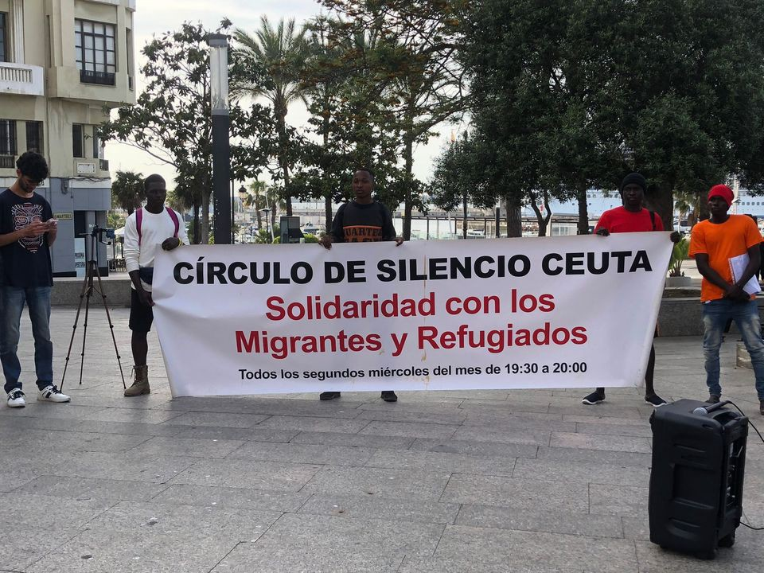
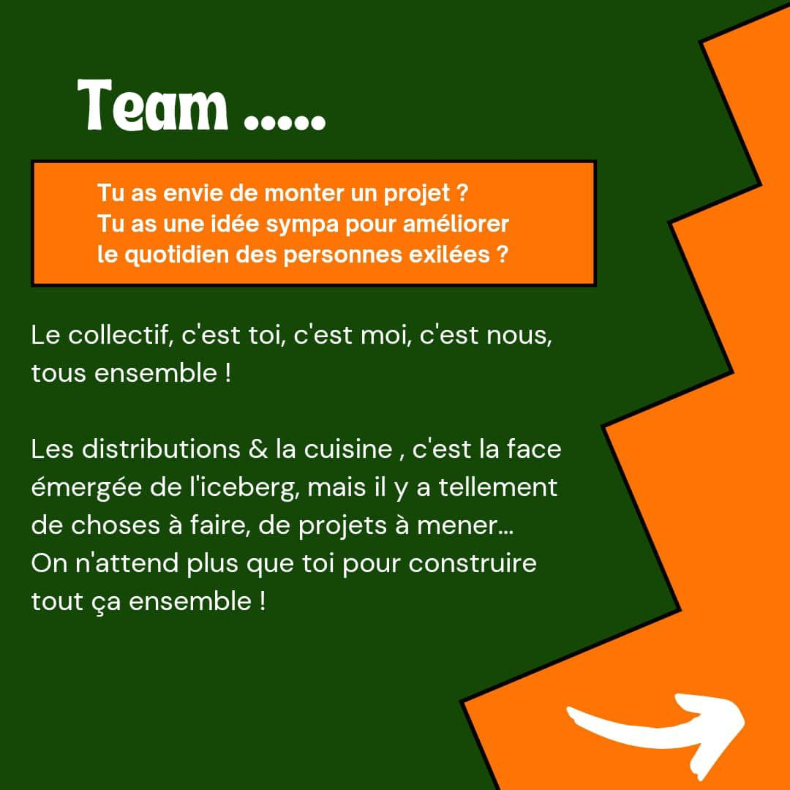
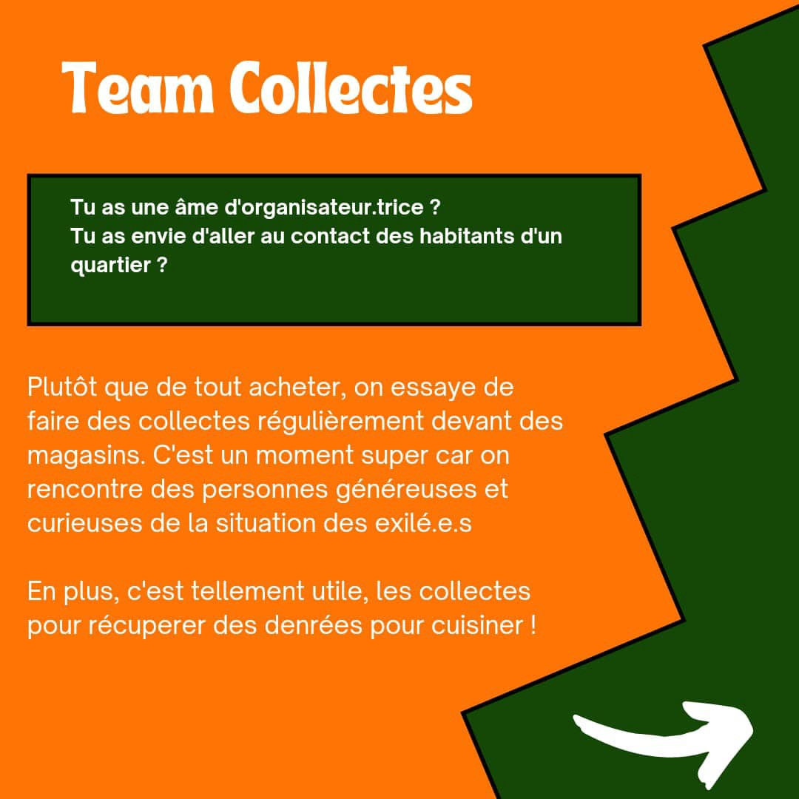

### AYS News Digest 13/5/22: Frontex and Switzerland — After many reports and denouncements, it’s the whistleblowers who raise the concern
#### Germany: 1in 3 negative asylum decisions handed down by BAMF end up being revised after initial court appeals // Hunger strike in Lesznowola // Embarrassing data breach in the Greek migration report // Calls for volunteers in France // How to support anti Rwanda deal efforts in the UK // \+ our team prepared some very interesting and highly useful articles, analysis, reports and personal stories — don’t miss them

Photo source: Frontex
#### FEATURE

Fearing that the country may end up being an accomplice in unlawful actions, a Swiss border guard who served in around 10 Frontex operations has said he will vote “no” in the upcoming referendum on whether or not to increase the Swiss funding of Frontex\.

 podcast](assets/66a987eb8990/0*x5CtWuPpXiPMOwvH)

“Frontex has been allowed to operate along Europe’s borders without any oversight, and why the chances are low that anything will change despite their leader resigning to avoid the music\.” Hear the latest [@refocusmedialabs](https://www.instagram.com/_u/refocusmedialabs?fbclid=IwAR2GawPJvz6tTPq6PlxHins5pcEqlITrECFUpe0m9mNjyr3fqc-fCXR4Wto) podcast

**“Frontex does not work as it should”**

He [reportedly](https://www.statewatch.org/news/2022/may/former-frontex-officer-pledges-to-vote-no-in-referendum-on-swiss-funding-for-the-agency/?fbclid=IwAR1cfGqxXZbH4xIcK-8suj5PQnjdR7RcCapBrBGpvin0I39x9F-fKFmTnnM) witnessed a number of irregularities on his deployments with Frontex, including violence against people on the move seeking to leave Greece for other EU member states, and a colleague telling him he had accepted a bribe from a people smuggler\.

Citing a lack of overseeing missions, arbitrary following of rules and human rights standards, and individual cases of collaboration with smugglers, along with the widely known deprivation of freedom and human rights in the case of asylum seekers, the man in question decided to leave the agency\.

**Will the Swiss people follow his lead? —** We will find out after the national referendum this Sunday, May 15\.

■■■■■■■■■■■■■■ 
> **[Are You Syrious?](https://twitter.com/areyousyrious) @ Twitter Says:** 

> > Make space for Voices From the Borders ⬇️ 

> **Tweeted at [2022-05-12 12:59:59](https://twitter.com/areyousyrious/status/1524736143194996737).** 

■■■■■■■■■■■■■■ 

#### GREECE
### Pushbacks \(even\) of the political asylum seekers

Many Kurdish asylum seekers are now being forced back to Turkey during pushbacks before even being given a chance to apply for asylum upon arrival in Greece\. Among them is the Kurdish writer Meral Simsek who claims she was sent back to Turkey only to face imprisonment after having crossed the Evros river\.

> “The vehicle smelled of blood and urine, indicating that other people had been abused in there,” 

she told news agency AFP, adding that she was then forced to get onto a dinghy which was piloted by two migrant men who “intended to drown” her, InfoMigrants [retells](https://www.infomigrants.net/en/post/40492/greece-accused-of-pushing-back-turkish-activists-seeking-asylum?fbclid=IwAR3C0JQECfuhqjY_KqyJrh5mmypsgnGHnJm-LELyygDc_H8ssd46ldadjNM) the account\.
### “Severe rule of law issues, poor methodology and sheer incompetence”

In an embarrassing data breach, the authorities had to hide the recently published “investigation [report](https://aead.gr/en/publications-en/essays-en/investigation-report-om-2022) of the Migration\-Nationality Subsector of the Sector of Local Authorities \(A’ & B’ Grade\), Decentralized Administration and Migration\-Nationality of the Inspections and Audits Unit of the National Transparency Authority” as it failed to properly hide the names and personal details of those who were interviewed during the investigation\.

“The disclosure of personal data and failed effort at redaction has left us with concerns over the conduct of the investigation,” said Lighthouse Reports Director Klaas van Dijken, whose phone number was included at the bottom of supposedly confidential correspondence, as one of the many breaches of privacy\.

The EAD survey was conducted in March 2022 on the occasion [of the publications](https://www.lighthousereports.nl/shadow-armies-uncovered/) of Spiegel and Lighthouse Reports on the relaunches taking place in Greece and Croatia\.

Those investigating the report also [note](https://omniatv.com/853473814?fbclid=IwAR2P30iEzwsIWgZJm7rgu3Adp6TGCdMdDA0f2QDAwC8WWnnLxVaEqLz7NCk) that it is interesting that the so\-called independent authority asked the Directorate of Criminological Investigations of the Hellenic Police to analyse the audiovisual material provided by the journalists who published the research\.

■■■■■■■■■■■■■■ 
> **[Manos Moschopoulos](https://twitter.com/maledictus) @ Twitter Says:** 

> > The Greek government's attempt to 'investigate' reports of refugee pushbacks is the gift that keeps on giving, exposing severe rule of law issues, poor methodology and sheer incompetence. 

Thread on the 'investigation' and why it can't be taken seriously. 1/18 

> **Tweeted at [2022-05-13 12:50:31](https://twitter.com/maledictus/status/1525096150600130561).** 

■■■■■■■■■■■■■■ 

Speaking on preserving the identity, privacy and rights of those we claim to be protecting, the [Aegean Boat Report \(ABR\) posed a question](https://aegeanboatreport.com/2022/05/12/does-unhcr-enable-the-torture-of-refugees-by-greek-police/?fbclid=IwAR2H29GZcAQF7EeK8ot5Xh_mBy3ZZnSLrfV3G_bT4zllSYLSqhodnB-_c0s) regarding the UNCHR’s involvement when it comes to the relationship between the authorities and people who are counting on their support and protection:

> UNHCR has consistently and strongly criticised the Greek government and its uniformed officers for their barbaric, illegal, pushbacks against people who arrive in Greece\. 

> So why does UNHCR Greece hand the same authorities details about the locations of those men, women and children? 

Suspended Lives \- “Letters to the world from Ritsona” — In the bookstores of France\-Paris

Continuing with the practice of focusing solely on securitisation and violent protection of borders, the very basics for human living are being neglected\.

As some people pointed out, there is no water, but the Samos camp has barbed wire, cameras, and surveillance…

■■■■■■■■■■■■■■ 
> **[Samos Advocacy Collective](https://twitter.com/AdvocacySamos) @ Twitter Says:** 

> > Day 7 without proper access to water!

For the last week, camp residents in the #Samos CCAC only have 2 hours of running water. #refugeesgr 

> **Tweeted at [2022-05-13 07:21:49](https://twitter.com/advocacysamos/status/1525013427978133505).** 

■■■■■■■■■■■■■■ 

#### BOSNIA AND HERZEGOVINA
### Velika Kladuša

_“Now even the Bosnian police has become a problem for the guys on the Balkan route, who no longer have peace\. Some of them managed to stay in Velika Kladusa hiding in abandoned houses, but early yesterday morning while they were sleeping, they received an unexpected visit from the police who took them and put them on the bus to Lipa\. And once this is done, everything else is set on fire\. Food, blankets, curtains, fur bags, everything\. The stoves that the boys use to cook were also destroyed\. But the thing is, they don’t give up\. Nah guys never do this\. Many have escaped from Lipa and arrived in Kladusa to go to the game\. But there’s nothing left for them\. And they need to eat, to be able to live a few days and get back to the game\. Or they just need to fill as much food as they can in that loyal friend called backpack\. To be able to have something to eat in 15–20 days of walking,”_ B\. Bertochi reported\.

#### SAR in the sea

Alarm Phone [reported](https://www.facebook.com/SeebrueckeSchafftsichereHaefen/posts/1636701106702066?__cft__[0]=AZX2SONPB3sa9ldp4TmU5kxm9vssFO08MYQPz9hxEC3-vYO0Rm4S24wv4Wx5-X_gxnspu7QX3r3DpuYdwUpHwwLiz-LAutTOQYGokxGM-6_n0dfGSvNVbVE7xKrhKgTlkS8j-kS5VqGFHEQUrVVCZgg9UAUF7WFnCusw-7kQb895W1c0NHUZFRkew0zS8alKru4&__tn__=R]-R) about a group of 24 people in distress in the Maltese search and rescue zone\. They have already been at sea for 4 days and meanwhile have neither drinking water nor food\. In fact, Maltese authorities are responsible for rescuing people from distress at sea in their search and rescue zone, but time and time again **Malta** disregards this responsibility\.

In **Italy** , another landing was [reported](https://l.facebook.com/l.php?u=https%3A%2F%2Fwww.grandangoloagrigento.it%2Fprimo-piano%2Fancora-uno-sbarco-a-lampedusa-quasi-1000-migranti-in-4-giorni%3Ffbclid%3DIwAR2q5vGKrw2i9MTDFn1UlVVcUoPj1WvTuEr-rExknaau9qY_hyS8S7KBMVA&h=AT1EhhoSjdR6sEWUZPKcsmmuzdVAB9plwj2a-E6E-JLkJxVaR9MQXLHQrAabz3agUZHt1_ZcW1J27Z2i6oOIfVCTEXKw7zuc-WwDQiNBpp68NdL1s9jD1M1v80HVovojlm6VJb7vkUxPxdubKtwlJ3__4xwWnA&__tn__=R]-R&c[0]=AT3125vSjmrvU6oQaGPpA7j7lJk6N4N6wrw79z6yrWoza6-uIhdrGwnnbHGKcA6U0SCbdJxCM39ZLRywhbU0eHME09X507QHxH0CR9HCQ7GTs2SZw2ExLa0Q5WNDtCJKKvL19H-LvkPVRfyO1D1giBdCjj2T63WY7hccVvG6zHkWwSk9ID9Vbb1pmuXCKv4SpeF_Q6OljkgNgEfhfwo) in Lampedusa, with almost 1000 people arriving in 4 days\.

Salvamento Marítimo saved 15 people at sea in the early hours of Friday, May 13 off the coast of **Spain** \. One person in the group, however, was found dead during that mission\. The group were found sailing in a dinghy about 141 kilometers south of Gran Canaria when they were sighted, according to [reports](https://l.facebook.com/l.php?u=http%3A%2F%2Fwww.laprovincia.es%2Fcanarias%2F2022%2F05%2F13%2Fmuerto-14-rescatados-patera-sur-66050795.html%3Ffbclid%3DIwAR241TZRVH0YpR48Zokb-glruSld3qIku8s1oYpTFWVmVg-zDpGYgeIT3CU&h=AT2XUhB_QLMYO5UeL4Am71VtE2z8zmR63W4jT4LM-Q5WuVgzKAG5QH0Z-_hUREECmqlijfYEFAs_1_J-sbRAB-3Dl9OtrYurmdEqZuc0m112y-X8YI4X9gqNuCFP058o80ue_WUPkviQ-367Xe2vYII3tfN_dg&__tn__=R]-R&c[0]=AT3125vSjmrvU6oQaGPpA7j7lJk6N4N6wrw79z6yrWoza6-uIhdrGwnnbHGKcA6U0SCbdJxCM39ZLRywhbU0eHME09X507QHxH0CR9HCQ7GTs2SZw2ExLa0Q5WNDtCJKKvL19H-LvkPVRfyO1D1giBdCjj2T63WY7hccVvG6zHkWwSk9ID9Vbb1pmuXCKv4SpeF_Q6OljkgNgEfhfwo) \.
#### SPAIN
### Volunteers report from the Ceuta Circle of Silence

NNK volunteers in Ceuta write:

> In Ceuta, the Circle of Silence has been going on since 2015\. For 7 years, people have not stopped gathering every second Wednesday of the month, at 19:30, in Plaza de la Constitucion, to fight against the constant violations of migrants’ rights\. 

> As the name suggests, during the action the participants form a circle and remain silent for the agreed time\. At the beginning of each circle, a presentation is made and a communiqué is read out denouncing current situations\. 

> Unfortunately, in Ceuta, there are many violations to denounce every month: the violence of the border, of the institutions, the precariousness of the life of migrants, the constant uncertainty, the violations of the rights of minors, the discrimination, the institutional and non\-institutional racism, etc\. 

#### FRANCE
### The north

As water tanks are being pierced, distributions prohibited and provisional camps dismantled, more hardships for people on the move are being documented by groups on site:

■■■■■■■■■■■■■■ 
> **[Human Rights Observers](https://twitter.com/HumanRightsObs) @ Twitter Says:** 

> > Opération de "mise à l'abri" à #Calais. Les personnes exilées ont le choix entre être #expulsées ou de monter dans un bus vers une destination inconnue. Bloquées derrière un périmètre, il leur est impossible de récupérer leurs tentes et leurs affaires, saisies sous leurs yeux. https://t.co/3WOaPLsv8E 

> **Tweeted at [2022-05-13 12:16:20](https://twitter.com/humanrightsobs/status/1525087546438451207).** 

■■■■■■■■■■■■■■ 

### Volunteering

[Solidarité migrants Wilson](https://www.facebook.com/Solidarit%C3%A9-migrants-Wilson-598228360377940/?__tn__=-UC*F) is looking for people willing to help:

#### POLAND

Drawing attention to the pushbacks and ill\-treatment of migrants attempting to cross into Poland from Belarus; the increased use of immigration detention in Poland including the routine detention of accompanied and unaccompanied children’ and discriminatory treatment of non\-Ukrainian refugees fleeing to Poland, including their detention, the Joint Submission to the Universal Periodic Review is available [here](https://l.facebook.com/l.php?u=https%3A%2F%2Fwww.globaldetentionproject.org%2Funiversal-periodic-review-immigration-detention-in-india-morocco-poland-south-africa%3Ffbclid%3DIwAR1uHxVZS1Ls40UBkN_vfCOmSw5luJAyWpz59OGZzL80kMxwdHYDbSW47TQ&h=AT1lnw7LCuxKsA0G7KoTHTaYueJTvhrVlWnOKrCTCiv8e_jZDcZoVRNJR82ef7vEURkxfnyONDI1_HX_VgucU_GO1475Cp_7iDN4WhockohfLPUgDNCZR21linPMc936sZ6djgbcSsCikrO3nQ&__tn__=R]-R&c[0]=AT2NVuh9zya0r6aIuQLkJ_lktagG5tmL7oS8jDDLWQ7BEJkYDg63ZM-j0D3JIEcbcGuULJEivsCfbk0E37x8-nej7ACkjegR75ZUks3NHe6MDZT4qN-18XspHO7t33Ku4meKNTCo4YST3y4xW-c26WSTWM-yIV7l9k1qvLhrtDJ4IKANY6z32-JGb4p7Ca9ZYZeGCE0ZOk9J) \.
### Hunger strike

Grupa Granica reports of another hunger strike \(the second one as far as I know\) by detainees in one of the closed ‘ [Center for Foreigners](https://www.globaldetentionproject.org/countries/europe/poland/detention-centres/208/lesznowola-guarded-centre-for-aliens?fbclid=IwAR3lvBmszUp0WrUWEOiRyFH0vzbJJc4KfMiPAAoP-MkcoDZ74dmQCOpNFY4) ’ in Lesznowola\.
#### **GERMANY**
### Successful appeals, 1 in 3 cases

One in three negative asylum decisions handed down by the Federal Office for Migration and Refugees \(BAMF\) end up being revised after initial court appeals, resulting in considerable costs for the BAMF, InfoMigrants reports\. [Refugees from Afghanistan](https://www.infomigrants.net/en/post/38943/whats-the-status-of-displaced-afghans-worldwide) in particular tend to be successful with their appeals in court, since the country was taken over by the Islamist Taliban group last August\. Read [more](https://www.infomigrants.net/en/post/40498/one-in-three-rejected-asylum-cases-in-germany-successful-at-appealing?fbclid=IwAR0pTZOfyAxyQNAgG9y4n60nD0TU57vCo9lIcyiWzE_SniQYFnAWjDoriWM) \.
#### DENMARK

Danish authorities are to permanently revoke the residency and deport a Syrian refugee wanted by the Assad regime\. Muhammad Maher has resided in Denmark for seven years after arriving in the country in 2015:

■■■■■■■■■■■■■■ 
> **[Middle East Eye](https://twitter.com/MiddleEastEye) @ Twitter Says:** 

> > Denmark authorities are to permanently revoke the residency and deport a Syrian refugee wanted by the Assad regime. 

Muhammad Maher has resided in Denmark for seven years after arriving in the country in 2015. https://t.co/neLrNRWgIZ 

> **Tweeted at [2022-05-10 13:54:22](https://twitter.com/middleeasteye/status/1524025051879718919).** 

■■■■■■■■■■■■■■ 

#### UK
### Rwanda — how you can help

The reprehensible Rwanda plan is already terrifying people on the move\.

It will abuse their rights, cost taxpayers millions and break international law\. We’re fighting it, and here’s how you can help, Care4Calais calls for support for their actions:

> 1\. Donate to the crowdfunder for our legal challenge\. We are raising funds to cover costs, and to protect us from Home Office costs if we don’t win: [bit\.ly/c4c\-rwanda](https://l.facebook.com/l.php?u=https%3A%2F%2Fbit.ly%2Fc4c-rwanda%3Ffbclid%3DIwAR3daintQGxq0tvF05KgD8Dw1qB5U5MhGiT8xb31n19sXkEZaYylpqB2flg&h=AT3_0uOE1FVBhmGziwFR84o4SYVoCYcRMzi6yPnf6U3Vl3kvXMahnH9T-SuxPt7EWsExWqj8YzLCFjOEufEKXi3JQdtbVBeyr87nBw8qyDvgzzZX6rpBjRNQI9yalhH4XLXdS4DKE8Hywy46jQ&__tn__=-UK-R&c[0]=AT2pRS6-mrBvGbqaoM1rpAMHl3xtGc2Kp01m5dOPXhYfZtXv47_ZQXK46xuevAI7IZrzM2v2w4jAMxX0dM5y8V6PsNLzC8YFDnLM72mjlOwYiDCtceJVOcyfGPysVNWTedygQqZirdnZrJw-U3HMh_QfRAZkf0rfPqo1bZM4anTt-JA) 

> 2\. Share these refugee information leaflets as widely as possible: [bit\.ly/Rwnd1](https://bit.ly/Rwnd1?fbclid=IwAR1Fltx2xk5K1lyjcjG03EVD96r0q2ADWgPjoAdCS59AjNbuESEcGXuFxK4) and [bit\.ly/Rwnd1a](https://l.facebook.com/l.php?u=https%3A%2F%2Fbit.ly%2FRwnd1a%3Ffbclid%3DIwAR0MQLneIGX1G6ydxMVcrJV_3_UqB4KUqyCceNu1dk-NahCKwkufmr6yAPE&h=AT0yoYHt28b2dbrT7Ikp-ab5Da2Yo4FVndkWRDxgivlyPwlVGuGiXTvUtm-huJwEbdlAQb5ND4-ce1fgqPBAu-othmL6yrPsGtrdbkqJYSsKPnp3Kbbo7x8wmBAhwBTxQc-dq8va-5M9jCXsoQ&__tn__=-UK-R&c[0]=AT2pRS6-mrBvGbqaoM1rpAMHl3xtGc2Kp01m5dOPXhYfZtXv47_ZQXK46xuevAI7IZrzM2v2w4jAMxX0dM5y8V6PsNLzC8YFDnLM72mjlOwYiDCtceJVOcyfGPysVNWTedygQqZirdnZrJw-U3HMh_QfRAZkf0rfPqo1bZM4anTt-JA) 

> Please share with: 

> · Any refugees you know 

> · Anyone who works with refugees 

> · Any orgs who work with refugees 

> 3\. Sign up for further updates on how you can [\#StopRwanda](https://www.facebook.com/hashtag/stoprwanda?__eep__=6&__cft__[0]=AZVjZ-T5HQwZnxJ3LqdlFOXG1EznQRSisn5Iv7QUptXZcZYTfYlW0K2ITjoyATEbfcumYkM5d4dd2wXKN2wCV2oDC7qCK2X_q4BBX3doh8Z-tFNs0_UMCm4IW7Vn7kTkP4-Dw5kr3yA0NUDHc2cGTAVx&__tn__=*NK-R) [bit\.ly/C4Cjoin](https://bit.ly/C4Cjoin?fbclid=IwAR0HrwKMCSnSuU0RVP_GWSx-HHjnnWt8p72B6PA-Z1ednN73UHzcvAgDf9c) 

More actions out there:

■■■■■■■■■■■■■■ 
> **[BooksAgainstBorders](https://twitter.com/antiborderbooks) @ Twitter Says:** 

> > Get involved in resisting the border regime! Join @[JCWI_UK](https://twitter.com/JCWI_UK), @[migrantsorg](https://twitter.com/migrantsorg), @[RegulariseUK](https://twitter.com/RegulariseUK),   @[remember_resist](https://twitter.com/remember_resist) and more next month for the Carnival of Resistance, marking a decade of struggle against the Hostile Environment [eventbrite.com/e/carnival-of-…](https://www.eventbrite.com/e/carnival-of-resistance-migrants-rise-against-the-hostile-environment-tickets-333498441817) 

> **Tweeted at [2022-05-13 09:09:47](https://twitter.com/antiborderbooks/status/1525040600797569024).** 

■■■■■■■■■■■■■■ 

A Syrian interpreter who has worked for the British government and the White Helmets has tried to kill himself after waiting nearly two years for a decision on his asylum claim\. More in a [story](https://www.theguardian.com/global-development/2022/may/13/forgotten-syrian-interpreter-attempts-suicide-after-uk-asylum-delays?fbclid=IwAR1uHxVZS1Ls40UBkN_vfCOmSw5luJAyWpz59OGZzL80kMxwdHYDbSW47TQ) by the Guardian\.
#### GENERAL
### Event

Find out why the EU’s AI Act needs to be amended to prevent harmful uses of technology for asylum, immigration and border control purposes — next Monday:

■■■■■■■■■■■■■■ 
> **[Statewatch](https://twitter.com/StatewatchEU) @ Twitter Says:** 

> > Join us next Monday to hear why the EU's AI Act needs to be amended to prevent harmful uses of technology for asylum, immigration and border control purposes.

With @[JaneVKP](https://twitter.com/JaneVKP), @[sarahchander](https://twitter.com/sarahchander), Alyna Smith of @[PICUM_post](https://twitter.com/PICUM_post), @[CaterinaRodelli](https://twitter.com/CaterinaRodelli) and @[_PMolnar](https://twitter.com/_PMolnar) 

[statewatch.org/publications/e…](https://www.statewatch.org/publications/events/ai-at-the-borders-negotiations-regulations-and-fundamental-rights/) https://t.co/4lYU7CswVm 

> **Tweeted at [2022-05-11 11:45:22](https://twitter.com/statewatcheu/status/1524354978625826816).** 

■■■■■■■■■■■■■■ 

#### WORTH READING

[](https://l.facebook.com/l.php?u=https%3A%2F%2Fblogs.lse.ac.uk%2Fgreeceatlse%2F2022%2F05%2F08%2Fa-window-of-opportunity-for-eu-migration-policy%2F%3Ffbclid%3DIwAR3h6OcocjWdTjqDG-PheixjlWKAhBLElQYPZL26SPgTZ3wkBG5Fxt0egG0&h=AT2x1x_uMuzX7QaP2s8Wp6_J0XIoDXglFRvVqtK3vc5GNXKi0jeCWdM5g_-XCAb5KHzvWvwevfJIJiN62RtT9J5p5wJc9YXtQUbHPKlMqH_lJ8T9XptAmjD-kzDB7vaV8TyuEinogQs7hGs-oqVzZli5RoaOZQ&__tn__=R]-R&c[0]=AT3WNL_hTRqWhNE9z5sWD3p2VWGTXug4Dts8D2RrOSLVQchZCOtADxeZOiynzBvketIKweUrItuY4KfQF4SUQMq46D4DGawyyiHlUDOFEX8V1wFfNT0_YIKvo85iBFngutjI725jvNB1_ZU8QyHMNqvukJirV6bDMOSq3EM0MWcf_keRkSTd9P9nwwHsr3qSHzsIZbGG0lq8lWPxETg)

- For the Yale Law School event, “EU’s Citizenship Apartheid,” Ian Urbina discusses The Outlaw Ocean Project’s reporting on the invisible wall that keeps migrants out of Europe\.

- ELENA Weekly update:

[](https://l.facebook.com/l.php?u=https%3A%2F%2Fmailchi.mp%2Fecre%2Felena-weekly-legal-update-13-may-2022%3Fe%3D1fd2db1ebf%26fbclid%3DIwAR3QvLJsQFVh8k41vQ3QiS1Lzxt4Jg4QUiMcluRqMP-ksjmtZBimf9gVR1M&h=AT1UYVpXBY34mhV1lhcw_2JSNZPRwDZOSdHDBjQn5jLpVotocQ7oOZZupXhOwIMILQR96N47uXSA6r82OtlC_T8Ps0v8hRaeTrjIphQhqREHkMw3ue6KMqnMAioftnjIQDcGF0BbjlMSBgOubNDnwEmK_IZbHA&__tn__=R]-R&c[0]=AT1sxg4BXm6P50IobFupgQumiLRfKIhsh3k7vPGnhg-IiOZmDN5Ia0PR-R0x-AthPeKjYpTZ2TtFryYGJZq0MUEQLLKIcAE0JnxwChhfrsgkowe7HXdwaYgCHGJuAD3nJm84XGVAIhnika5dQe1SxfjECrgEoBZV92x4p15DNxpTY1ZX9engF_aERVAT6_9sUWSE98ms2H9YAphbVbc)

- Feasibility study on the setting up of a robust and independent human rights monitoring mechanism at the external borders of the European Union

[](https://l.facebook.com/l.php?u=https%3A%2F%2Fwww.proasyl.de%2Fmaterial%2Ffeasibility-study-independent-human-rights-monitoring-mechanism-at-the-external-borders-of-the-eu%3Ffbclid%3DIwAR23ZO9hbTkuIjyMVxTISOFq9sgZedJnyShSY0hlLij1UpxrbCFSmYU7Vs8&h=AT2XQ7Q9Ispyu2Y8DEYghvMXRI_ILwBqMcublt4SasDbaLAaKkJEc2AMMHs6xQLrvjzapBfS-euoWhtASKGQGovFtvF-BraQYT-dCV_DeOsUvZVojuh7auImidVSr8y7pt9EOF2EMOarHHprXOvQTHyq5wC6oA&__tn__=R]-R&c[0]=AT3WNL_hTRqWhNE9z5sWD3p2VWGTXug4Dts8D2RrOSLVQchZCOtADxeZOiynzBvketIKweUrItuY4KfQF4SUQMq46D4DGawyyiHlUDOFEX8V1wFfNT0_YIKvo85iBFngutjI725jvNB1_ZU8QyHMNqvukJirV6bDMOSq3EM0MWcf_keRkSTd9P9nwwHsr3qSHzsIZbGG0lq8lWPxETg)

- The response to the war in Ukraine stands in sharp contrast to the reaction to other high\-profile mass movements, such as those sparked by the war in Syria and the Taliban’s takeover of Afghanistan last summer after Western forces pulled out\. While thousands of refugees from those conflicts were welcomed, the Temporary Protection Directive was not activated, and the broader effort was geared toward preventing asylum seekers from arriving\.

- While EU policymakers are busy amending the text, one important question springs to mind: whose rights are we talking about?

**Find daily updates and special reports on our [Medium page](https://medium.com/are-you-syrious) \.**

**If you wish to contribute, either by writing a report or a story, or by joining the info gathering team, please let us know\.**

**We strive to echo correct news from the ground through collaboration and fairness\. Every effort has been made to credit organisations and individuals with regard to the supply of information, video, and photo material \(in cases where the source wanted to be accredited\) \. Please notify us regarding corrections\.**

**If there’s anything you want to share or comment, contact us through Facebook, Twitter or write to: areyousyrious@gmail\.com**

_Converted [Medium Post](https://medium.com/are-you-syrious/ays-news-digest-13-5-22-frontex-and-switzerland-after-many-reports-and-denouncing-its-the-66a987eb8990) by [ZMediumToMarkdown](https://github.com/ZhgChgLi/ZMediumToMarkdown)._
