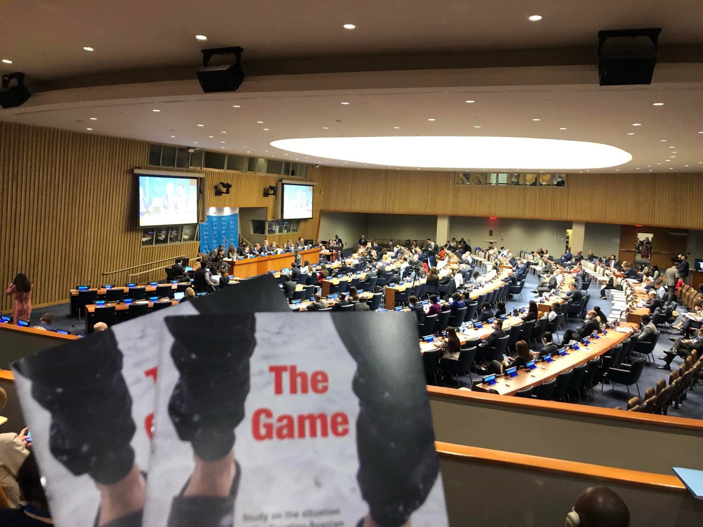
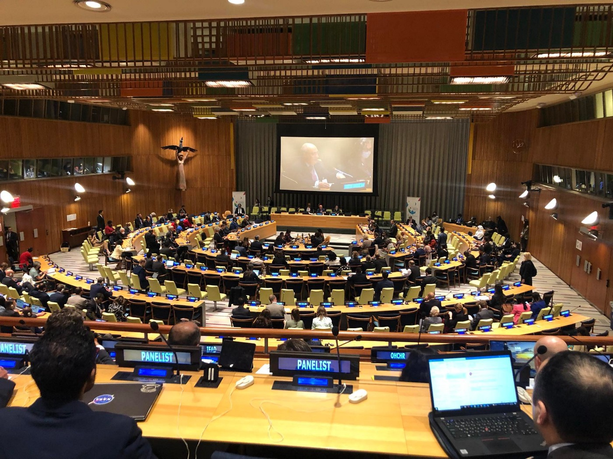

### AYS News Digest 18/5/22: NGOs at the UN, h **ighlighting the mass proliferation of violence and shrinking civil society space in Europe**
#### Personal data in the hands of the Taliban / Abolishing the Italy\-Libya Memorandum by the 2nd November 2022 is the goal of civil society / Ahead of two unfair trials / Detention and repatriation in Turkey — “We know that he was held in very bad conditions for ten days” / The shameful actions of the Polish authorities in the Polish\-Belarusian borderland continue / and some really important texts you should take time to read — share and act\!

#### FEATURE

This week members of the Border Violence Monitoring Network \(BVMN\) and Are You Syrious? \(AYS\) are attending the International Migration Review Forum \(IMRF\) at the UNHQ in New York\.

■■■■■■■■■■■■■■ 
> **[Are You Syrious?](https://twitter.com/areyousyrious) @ Twitter Says:** 

> > Policy debate on the implementation of the Global Compact for Safe, Orderly and Regular Migration (GCM) is starting at the #IMRF2022 in the @[UN](https://twitter.com/UN) - let’s see how much the voices from the ground were heard here in NYC… 🍿#Migration2022 #GCM https://t.co/J5B8rZ202b 

> **Tweeted at [2022-05-18 19:16:18](https://twitter.com/areyousyrious/status/1527005172190351360).** 

■■■■■■■■■■■■■■ 

This is the primary intergovernmental global platform to discuss the implementation of the Global Compact for Safe, Orderly and Regular Migration \(GCM\) in Member States with a focus on progress, lessons learned, gaps and challenges\. BVMN has been invited alongside a range of other stakeholders that have been actively involved at the local, national, regional and global levels in the promotion and protection of human rights, pushing for better options for regular pathways of movement, alternatives to detention, gender and child\-sensitive policy\-making, and the need to prevent the loss of migrant lives in transit\.

Indeed, the priorities of BVMN this week are to further advance focus on the protection of people\-on\-the\-move \(POM\) in European transit states, to refocus key GCM objectives towards ensuring the protection of rights at border zones, including of issues of pushbacks, torture, and arbitrary or inhumane detention\.

After BVMN’s success engaging with the UN’s Committee on Enforced Disappearances \(UNCED\), where the committee included an overwhelming emphasis on pushbacks and the disappearance of migrants, calling on Greece to immediately refrain from pushback operations and collective expulsions, we seek to use this week to further such discussions in the UN debate forum\.

Our team member Joseph Cripps was able to [take the floor](https://twitter.com/Border_Violence/status/1526557386533744644?s=20&t=8iftjeUMlj5uyFAPATM1mQ) on Day One’s Multi\-Stakeholder Hearing and used the platform to **highlight the mass proliferation of violence and shrinking civil society space across European transit and destination States, calling for full recognition of the human rights of POM and the implementation of national Independent Monitoring Mechanisms \(IMM\) \.**

Other contributions came from Civil Society Organisations and migrants themselves who called for coherent rights\-based migration management, the protection of labour rights for migrant workers, and the end of deterrence\-based policies, among others, our team at the UN reports\.

Day Two saw the start of the roundtables, where States were able to discuss the progress made in their respective areas on different objectives from the GCM\. Roundtable 2 was notably focused on Objectives 4, 8, 11 and 13; access to legal identity and proof of documentation, saving lives and internationally coordinated efforts on missing migrants, managing borders in an integrated and secure manner in full compliance of human rights, and promoting the use of non\-custodial alternatives to immigration detention\.

We were surprised to see Commissioner Johansson take her seat on the panel of this roundtable, and yet it is equally important to notice who was not in attendance, with Member State Croatia absent from the floor\. **Commissioner Johansson took her turn to speak, and discussed the necessity of migration into the EU, saying that migration is “normal and manageable”, but we must commit to fighting against “irregular migration, smugglers and traffickers”\.** At the time of writing, the BVMN database holds 1,458 testimonies documenting the illegal pushback and ill\-treatment of over 24,990 individuals at European borders; leaked emails, video footage and extensive testimony collection have proved the illegal pushbacks of migrants in transit in European states to be not the exception, but the rule, and so Commissioner Johansson’s statement that we need migration seems to be misaligned with the policies being enacted under her leadership\.

Shortly after Johansson, Greece took the floor to deny allegations of pushbacks against them, citing a lack of credible or well\-documented evidence and calling the reports of CSOs, “disinformation tactics”\. Of course, just some days ago the National Transparency Authority tasked with setting up an IMM in Greece published their findings without properly redacting them, revealing that 45% of those they interviewed to get an overall image of pushback practices in Greece were border and coast guard officers\.

Just as the Croatian pilot of the IMM was littered with inaction, misuse of funds, ongoing human rights abuses and an ultimate failure to establish a truly independent monitoring mechanism, it seems Greece’s version is doomed to follow the same fate\. Standing next to Commissioner Johansson and just a stone’s throw away from the Greek delegate, the UN Special Rapporteur delivered his speech, citing human rights violations at borders as the biggest challenge of his mandate\. He specifically mentioned the ongoing practice of pushbacks, and called for a new strategy on migration, in line with the commitments of the GCM and international human rights instruments\.

Day Three kicked off with Roundtable 4 — with a special focus on Objectives 1, 3, 7, and 17; the importance of collecting and utilising accurate and disaggregated data for evidence based policies, providing accurate and timely information at all stages of migration, addressing and reducing vulnerabilities in POM, and eliminating discrimination and promoting evidence\-based public discourse on migration\.

The discussions centred around the issues of monitoring undocumented migrants, who are often subject to the worst treatment as a result of existing within monitoring and policy gaps\. Furthermore, the Regional Mixed Migration Centre Manager for Asia called for greater accountability mechanisms to be implicit within the GCM\. He called for attention to where progress has been seen and where it has not, particularly in relation to Objective 8 from the day before, and international coordinated efforts to save lives and trace missing migrants\.

**This is in line with BVMN’s calls for a functioning IMM with the mandate to trigger investigations and embedded accountability mechanisms monitoring by truly independent bodies with the involvement of CSOs** \. Greece’s celebrations of the “extremely low numbers of deaths in the Aegean” on Day Two have shown that we still have our work cut out for us when it comes to the political will to save migrant lives\.

So far, the team of BVMN and AYS representatives have met with four delegations of different Member States, giving them policy briefings on all objectives and thematic areas such as pushbacks, immigration detention and the right to life\. We have been asking those with the opportunity to speak to foreground the topic of pushbacks and human rights violations in European transit and destination states, and so far have heard pushbacks mentioned five times in the roundtables\.

> We hope to continue shifting focus back to gaps in implementation, and to stop Member States celebrating their wins when there is still such a long way to go in terms of a coherent migration management system that is in full respect of the fundamental human rights of people on the move\. 

More to come\.
#### AFGHANISTAN
### Personal data in the hands of the Taliban

The German government has promised to bring vulnerable people to safety from the Taliban\. But the Afghan ex\-employees of the development aid agency GIZ are falling through the cracks\. [Media](https://l.facebook.com/l.php?u=https%3A%2F%2Fwww.br.de%2Fnachrichten%2Fdeutschland-welt%2Fafghanistan-deutschlands-helfer-in-lebensgefahr%2CT61CvtO%3Ffbclid%3DIwAR3HxqP4vZ5-NpPue4uuwjFYG9MckGJXYJrqn1J4YGZz8bh7H_wOXALqjWo&h=AT0MGzK0rQaQWoDIDS6d0KPQ-rt1Rrz7IADGX35suvoS7DAa7UFVF9asg1-csFE7jZxbI223uGSJacu9SchnEMkBjqF_KXpvaOqnjWwtfLUZqg15OKsnlibDBY1p2L-6iLNEjUGd9YLpOR5hqw&__tn__=R]-R&c[0]=AT1tU4yGuRen6XEyEZtO_UxcpQ33nM8H1iwdRss0WZ90joUQAk4OxgRo87kRieuJp9wnv5SW74bvwPNrdTPItld6ZxhJplwmhyvDK5YTToZLDwR-1N7EZvugXbF1t9dEfVYN2HxpYi2lIvkr_dWyH1K77f_YwIfiXN8RH5hZZoNgG5YGVYNC-DUhSBYRt7ai03d4yJrgcSyL) research shows that they are in greater danger than previously believed\.

For example, the teachers had to undergo security checks before starting work and prove this to GIZ with documents\. Afghan security authorities recorded names, dates of birth and biometric data, probably fingerprints and iris scans, among other things\. The former GIZ staff assume that this data is still stored in police computers and databases, which the Taliban now have access to\.

■■■■■■■■■■■■■■ 
> **[Seebrücke International](https://twitter.com/Seebruecke_intl) @ Twitter Says:** 

> > Bayerischer Rundfunk reported today about former local staff of the German development agency GIZ who are stuck in #Afghanistan and being targeted by the #Taliban. #DontForgetAfghanistan https://t.co/EOpJ71msWG 

> **Tweeted at [2022-05-17 17:31:45](https://twitter.com/seebruecke_intl/status/1526616475720728578).** 

■■■■■■■■■■■■■■ 

#### TURKEY
### Detention and repatriation amid “rising anti\-refugee sentiment in the country”

The [Ankara Bar](http://www.ankarabarosu.org.tr/KURULLAR/MHK/MerkezUyeler.html?fbclid=IwAR1Jiun9E600US7yMeWBulnZajHpUVe74zE764G8x0q11DWiqmGP46NlfTk) Association’s Refugee Rights Center has said that hundreds of refugees have been recently detained and sent to the repatriation center amid a rising anti\-refugee sentiment in the country\. The bar association demands to be given answers with regards to the refugees’ detention and to be allowed to talk to them\.
#### “We know that he was held in very bad conditions for ten days”

According to Ebru Beşe, the Head of the Ankara Bar Association Refugee Rights Center, many asylum seekers have been detained, especially in the last ten days, 7sabah [reports](https://www.7sabah.com.tr/haber/86388/siginmacilara-gozalti-avukatlariyla-gorusturulmuyorlar/?fbclid=IwAR3UhDOt-Eh3Rm6hl86UDmhRmtZLG0ihWmhwZWvWdkqn9aHRdbZkiPqo1mc) \.

> Stating that the reason for the detentions was the lack of a work permit, as well as the fact that their names were mentioned in any case even if they were victims, Beşe said, “We also know that they have been kept in the police station in very bad conditions and in large numbers for the last week ten days\.” 

> We want to know the real reason for their detention\. It is very unlawful for a victim to be subject to a deportation decision because he is seeking his rights before the courts\. We demand the reasons for this and a healthy discussion with the victims of these processes, whether at the police station or at the removal centre\. 

The debate about the repatriation of asylum seekers in Turkey, especially Syrians, has been an important agenda item in politics for a while\. Make sure to get a background of the story from our February Special on Turkey:

[](https://l.facebook.com/l.php?u=https%3A%2F%2Fmedium.com%2Fare-you-syrious%2Fays-special-from-turkey-deportations-to-syria-e2ea70e20b14%3Ffbclid%3DIwAR0YzdtGb6oZn93CXnZtm5pk0mQkxGd78lFj590n4JDDRr87oloQqcNM9TQ&h=AT3prHRi_dvurh4sPZNmhrCXOfmXA22P02Rb-rWm7Qgm2SSy-QJBmf87PJLK-ETIrIz7o_r9Iztzz05RraIaFJ6dfrJ0_flM14FN8ywkraq0DSE8C7Nh3JFrCZFKY2asV5Z_HOJ2ghLvpn0aC0q45D7W2pd__A&__tn__=R]-R&c[0]=AT03KVyt83aZafzQh8TT3jUv6ILvkkbrq6t-Ks3krAd_dNVW73BrkAIx-Ia3GtStcxiHatF1mcwaT-CHSkSt_arCMRmrQJejnX-iu-R3_d0EyRT7TJJlBLp8KyTJS4OGNCsGlOq7zoehejfelVyAG6nDi31mrPHrU6KmFiXkJkA4nSObnaMc58SZpcPh3FYIoo5r0LD8TqHh)

#### GREECE

In 2015 when two\-year\-old Alan Kurdi drowned in the Aegean, there was a wave of global sympathy\. After November 2020 when a five\-year\-old drowned in a shipwreck off Samos, his father faces ten years in prison in Greece, charged with endangering his life\. The time of the trial has arrived…

[](https://l.facebook.com/l.php?u=https%3A%2F%2Fwww.aljazeera.com%2Ffeatures%2F2022%2F5%2F16%2Fasylum-seeker-father-faces-10-years-in-greek-jail-for-sons-death%3Ffbclid%3DIwAR0Q3CzwpFX7PD9a_FAvyqPJH-ahNeuXFgo6nJYCEOMzMH5kfrmvCLD6vGI&h=AT0JbWdlZ1jThSnqYjPcl3DcKaxLhJweAaLPtrloKnnfbtYoqQcKq4udy4DzbF695ZqjD7OnyHA2y0dXA90xs-CLrfZgwLy180y4VniGBgtSQBhJg7b3QM01linfpGTx4S_v05kb295C2W2Q6TNX-0PFZQojFA&__tn__=R]-R&c[0]=AT2jrE4A2eGfuttsPHpKMLzLkVpJR8l8XCcjT0jb2lEPD9NoaQXYhFcMGXA2l6wgbinhi0XIV46DoUA96QPW9wbFUWsXL3FrjDRlOebFa34-uKxerefQI-smwYezXlB-xgWDBchcJa-sjatWg7bXC3WNVFt3H6a8qnRTv0pizsGtFBayNFfB7g8fyOyO6zMz11KlmXd9Aymg)

### Pushbacks from the Greek side \(continue\)

At the same time in Greece, according to the [Turkish media,](https://www.turkishminute.com/) Greek soldiers on Friday pushed back 15 Turks, among them five children\.

> The boat was damaged and was losing air\. The group barely made it to the Greek side, where armed men wearing military uniforms and speaking Greek were on a boat hidden between the vegetation, apparently waiting for them\. 

### 43 million euros for no water

Even though residents have been receiving extra water bottles as compensation since the start of the restrictions, the respective amount per person seems to be inconsistent\. Between the 13th and 16th May, the Samos Advocacy Collective was informed that the compensatory water bottle personal allowance had been reduced from six 1\.5L bottles per person to three 1\.5L bottles per person each day\.

> _According to the [Sphere Standards](https://spherestandards.org/wp-content/uploads/Sphere-Handbook-2018-EN.pdf) , a minimum of 15 litres a day per person should be granted\._ 

The current 4\.5 litres per day per person distributed in the camp are nowhere near the minimum standards in humanitarian response\.

Please, take time to read our latest [**AYS Special from Greece: 43 million euros for no water**](ays-special-from-greece-43-million-euros-for-no-water-9a27b897ae38) **\.**
#### ITALY
### Abolishing the Italy\-Libya Memorandum by the 2nd of November 2022 is the goal of civil society

Amnesty International Italia and ASGI organised a conference titled [Five years after the signing of the Memorandum: what access to protection for migrants in Libya?](https://www.asgi.it/primo-piano/memorandum-italia-libia-il-16-maggio-2022-convegno-di-asgi-e-amnesty-international/) where they concluded that “it is necessary to replace the forms of cooperation with other measures to increase the availability of safe and legal access and to have a landing management system that ensures coordination between different governments and is linked to a redistribution mechanism\.

> “ **If this year will go down in history due to the war in Ukraine and the European opening to refugees fleeing that country, we must ensure that this opening also offers glimmers of change to other humanity** , such as those that many governments are trying to forget from other part of the Mediterranean\.” 

Read [more](https://www.asgi.it/primo-piano/memorandum-italia-libia-abolizione-2-novembre/?fbclid=IwAR2iU6niwRsIb8fIeGWm-SVv1CmzE7BvibzZ3wsL0I4Z1aWDFFdGIUo4HB0) \.

In other news, a three\-year Memorandum of Understanding has been signed in Italy to train 3,000 refugees and vulnerable migrants to work in the construction sector in order to help them towards autonomy\. Read InfoMigrants’ [piece](https://l.facebook.com/l.php?u=https%3A%2F%2Fwww.infomigrants.net%2Fen%2Fpost%2F40577%2Fitaly-inks-accord-for-vulnerable-migrants-who-wish-to-work-in-construction%3Ffbclid%3DIwAR1rbotmiwHaNGT5fwLpS7K1pMWPua3k34_9oJqmFbutVl_l172hIKsSOSM&h=AT0xyLaJi5yrS0wP5T6pSmd9Bu7cGUZ5WdD_3gxdAge_GRuKO1mytNmKBaBNYLnmLiGKksPxvBeWWzTPWEmcKaWt9MP7cvLFZIuOvAlxXdkzIW3kaglVPeDF_9ncFl8HP4cd2Gsd8uuOXkAmDhs-21rW8NRRgA&__tn__=R]-R&c[0]=AT3zwtW6vcKVY0mdICo674mkVGzAy0-yzdmsg9bxa9WTydZdD2d7QFOS4e0AlGbYgXLxONqiZ4mwdI0BE2pfWqVLZNNav8s6V7D6qc89Bo8CCrha3m9yAbscydaebsUq9ChOsbSEOk_geo0c50s2sqVVLclE41M8_J42S_4ek3Fjl80RCzEXLPypUDN8inKX0BW93j9dJMhi) on the topic\.
#### SEARCH AND RESCUE AT SEA

In the meantime, SAR missions to save those fleeing Libya continue\.

■■■■■■■■■■■■■■ 
> **[Open Arms](https://twitter.com/openarms_fund) @ Twitter Says:** 

> > Localizada una segunda patera #Med con unas 70 personas exhaustas que llevaban más de 20h de navegación desde su huída #Libia 
Activadas las autoridades italianas por #Astral las personas a bordo son transferidas a guardacostas.
#cadavidacuenta #mision91 #openarms https://t.co/bCqBTWDvMV 

> **Tweeted at [2022-05-18 20:25:48](https://twitter.com/openarms_fund/status/1527022663423647744).** 

■■■■■■■■■■■■■■ 

Five years after the start of investigations, four German crew members of the ship, Iuventa, Kathrin Schmidt, Dariush Beigui, Sascha Girke and Uli Tröder, will find out on Saturday \(21st May\) whether they will face trial\.

■■■■■■■■■■■■■■ 
> **[Mediterranea Saving Humans](https://twitter.com/RescueMed) @ Twitter Says:** 

> > Saturday at 10am we will be at the Trapani Court to stand in solidarity with the 21 defendants in the biggest trial against sea rescue #CivilFleet: the #IuventaCase.

At sea as on shore, saving lives cannot be a crime!
#SAR #SolidarityToResistance #IuventaCase https://t.co/hnjcl0YFH2 

> **Tweeted at [2022-05-18 08:31:40](https://twitter.com/rescuemed/status/1526842945990807553).** 

■■■■■■■■■■■■■■ 

OpenArm’s ‘Astral’ is back on mission again:

■■■■■■■■■■■■■■ 
> **[Oscar Camps](https://twitter.com/campsoscar) @ Twitter Says:** 

> > Primer día de la Mision91 en el #Med central y primer rescate del #Astral. 45 personas hacinadas y en peligro a bordo de una pequeña embarcación de fibra después de navegar durante muchas horas en aguas internacionales huyendo de Libia. Activamos a la administración italiana. https://t.co/Y7V7ayYWX2 

> **Tweeted at [2022-05-18 15:07:00](https://twitter.com/campsoscar/status/1526942433501712384).** 

■■■■■■■■■■■■■■ 

#### POLAND

Mohammad Jasem died in a forest in Podlasie in November 2021\. The family found out a few days ago\. Peter Czaban reveals the shocking and outrageous story of his death and why he was not identified\.

> Mohammad was on his way with his younger brother Bashar\. When Mohammad felt extremely ill, Bashar left him and went to seek help\. He was apprehended by SG and taken to the facility where he tried to ask guards for help for his brother\. He had his passport with him, and the location where he left it on his phone\. He did not receive any help\. He was pushed to Belarus and never saw his brother again\. 

> A few days after Bashar’s extradition, Mohammad’s body was found near Czeremcha\. Authorities were unable to identify him, although his passport — the one Bashar was carrying — was detained at the facility, while Mohammad himself was carrying a backpack carrying Bashar’s identification\. 

> Mohammad was buried as NN in a Christian cemetery\. His family had been looking for him for seven months\. A journalist and activists — not the Polish services — helped determine his fate\. 

Please [listen](https://youtu.be/PyF4JIiqjvQ) to this outrageous story\. Let us not forget Mohammad\.

flowers blooming at the Muslim cemetery in Bohoniki\. Mohammad’s family is hoping that he will be transferred here\.
### The shameful actions of the Polish authorities in the Polish\-Belarusian borderland continue

The Conference of Ambassadors of the Republic of Poland, a gathering of former Polish representatives whose purpose is to analyse foreign policy, identify emerging threats and make recommendations, published a statement on the actions of the Polish authorities in the Polish\-Belarusian border region\.

> In the shadow of the war in Ukraine and the tragedy of hundreds of thousands of war refugees from Ukraine, the humanitarian catastrophe on the Belarusian\-Polish border is still taking place\. Since mid\-2021, there has been a tragedy of refugees from areas affected by armed conflicts or ruled by totalitarian regimes, especially from Syria, Afghanistan and Iraq\. It was provoked with full premeditation by the Lukashenko regime \(probably in agreement with Putin’s Russia\) \. On the other hand, the Polish authorities, instead of applying international standards for the protection of refugees \(also guaranteed by EU law\), have reacted with cruel, inhuman and degrading treatment of refugees \(by using, inter alia, prohibited deportations, the so\-called _push back_ \) who managed to break through the border\. 

Please, take time to go through the reaction prepared by our fellow activists within the Grupa Granica:

#### WORTH READING

[](https://l.facebook.com/l.php?u=https%3A%2F%2Fwww.thenewhumanitarian.org%2FNews-feature%2F2022%2F05%2F17%2FAfghans-risky-crossings-Iran%3Ffbclid%3DIwAR26Vxmk73OhBWGePBaRf-8r5ybT70cSxP7S5dlQQfRSus4f3-C4u15UvdI&h=AT3208Iocez2cPFhr8xIsuHEQ-3d7AYh0JGFzlJo6jBSyUkQyfAuNaezF29xU4hRv-hR3aBbrxVAQcmBc2S1ZaZmfg6PNvlavL6qSxs8K9apxC0hZrRaOpchKSTbrhmgOHQUkytnqd-8tQ9xxUzKQJsPxf77ew&__tn__=R]-R&c[0]=AT2GrqdMZdfxEbYeYhBEHdXiP5sIH-ixj9xfWmdqPv3MjFIYwJgBUtgqn7M8-IzviWwFWf11GyHYceSp9Rb3IblTK5-8HE-mBwovw-xQmqwRgfngHXU77hnFqXWAleGWp2iP9jYUDDvr47aaIwnfSlHg5tXl-Kn1biQdbUtuhzkap8hHWaA6Gm_HLFpooPIMENqURY68qBHo)

- Themed Week on Border Externalisation in Africa:

- How does the local context of specific borders matter in migration management and why must it be discussed in external migration negotiations?

- In pictures: Inside Malta’s crowded migrant detention centers:

[](https://l.facebook.com/l.php?u=https%3A%2F%2Fwww.politico.eu%2Farticle%2Fpictures-inside-malta-crowded-migrant-detention-center%2F%3Ffbclid%3DIwAR07xpR1bJVuHASPpD-nLchKpo-4yobhCCkr-i7KLpSb9vB6M0YW0bbAdIw&h=AT3nUGKrtij0Vg88QHp4DEHhQuWIB5GRUBM70Tp8GKZzWncfBmV03kgz72BBO5Hv_HvJm2d2Zgll-5u0ypWO8ato5WCYHUOQhqcqTbtfnG4JZkMx4DxABqJzL34jnwBjygtr8euiTdOGqAH9n0qA4zoxLMWtkA&__tn__=R]-R&c[0]=AT1ESsSX80yEGmhX5e4cr0Nz6AEQ4zVyFXy0uyLQzOq7fgY6Dt2fiNe4IC_5mvWOGEkcF3d7UF0IAIGo7yIirVl-kY30yQhlQ5HoibHpuJ6oY3bm-8wKjfdxv5tHizyMMjh0an8rOS8LOcvGWbUkAwKQlir1ZXM_rJvgtn1Olg5kMU8a02BNeadat6Bb0wDnA7-Sre9qh5IK)

- Criminalising Solidarity — The real crime is the EU border regime:

[](https://l.facebook.com/l.php?u=https%3A%2F%2Fthecivilfleet.wordpress.com%2F2022%2F05%2F17%2Fthe-real-crime-is-the-eus-border-regime-activists-say-as-refugees-and-rescue-workers-prepare-to-go-to-court%2F%3Ffbclid%3DIwAR0o3uPm6hiI7N3Sc4-VF-fXZBTCGIC0UEIdcoN8B89YzkxP7VTHmKfKgFQ&h=AT2EVLCXIr4BF3aQrLIJseULlG_VhrwtbgXBE4qqT-0lF_pWYirf1sd1l4gMpgROOJjEC848AbPcGgmyaYoNW79lJH_xRmUEhe2oleaQNzU0wUYimZBVRyYz0rs0Q3Z6tRopjwAYlAUBDcT1imlpzOS-AdRD8w&__tn__=R]-R&c[0]=AT1ESsSX80yEGmhX5e4cr0Nz6AEQ4zVyFXy0uyLQzOq7fgY6Dt2fiNe4IC_5mvWOGEkcF3d7UF0IAIGo7yIirVl-kY30yQhlQ5HoibHpuJ6oY3bm-8wKjfdxv5tHizyMMjh0an8rOS8LOcvGWbUkAwKQlir1ZXM_rJvgtn1Olg5kMU8a02BNeadat6Bb0wDnA7-Sre9qh5IK)

- Externalisation of asylum in Europe: Unpacking the UK\-Rwanda Asylum Partnership Agreement; By Nikolas Feith Tan, Senior Researcher at the Danish Institute for Human Rights in Odysseus Academic Network:

[](https://l.facebook.com/l.php?u=https%3A%2F%2Feumigrationlawblog.eu%2Fexternalisation-of-asylum-in-europe-unpacking-the-uk-rwanda-asylum-partnership-agreement%3Ffbclid%3DIwAR0oNJ98z6gtDo5_cEQdtV2Z1glTb49dk2Y0t7Z-tK1ApZMIHbcHi3ut1FU&h=AT1ZCNQJEu7e5vFKqT095qKFfCkv804GNgVd9OgT7N5bY0MG6k4f-2PfBN3vD32XMY-mwKhMyHsChii3SYlznbyF1fRliN7y02TpFe3zKiOtzb_xeP_3SUbp-P1kkEio80-wUgYRQwrUKCOSg98ccj_V1JUsVw&__tn__=R]-R&c[0]=AT1ESsSX80yEGmhX5e4cr0Nz6AEQ4zVyFXy0uyLQzOq7fgY6Dt2fiNe4IC_5mvWOGEkcF3d7UF0IAIGo7yIirVl-kY30yQhlQ5HoibHpuJ6oY3bm-8wKjfdxv5tHizyMMjh0an8rOS8LOcvGWbUkAwKQlir1ZXM_rJvgtn1Olg5kMU8a02BNeadat6Bb0wDnA7-Sre9qh5IK)

- Russia’s invasion of Ukraine is a tale of two atrocities: One engages the attention of the world as an international relations priority, the other, the barbarity of racism, receives little official acknowledgement\.

[](https://l.facebook.com/l.php?u=https%3A%2F%2Fwww.thenewhumanitarian.org%2Fopinion%2F2022%2F05%2F18%2FAfrican-governments-citizens-Ukraine-war%3Ffbclid%3DIwAR0gzJ92IMPUq8i07Qwb11eltfuCRcTo4Ro-wkxixMZAzn1s6uk62jFzV8M&h=AT3_mtvV9xMd32dCYlLwasduaLjOssfYeW9b3_1AyM9PsUa6LhttQV26N6TgdhOoEl2XmCeRcUs0UFOLfGIObHU8U1hO3QjKYZ9PiqET_s9wbsMjNDbo4JLhp5X6cTUoNmP1sWqtHWdMby4v2C16ctcHVP8d-w&__tn__=R]-R&c[0]=AT1ESsSX80yEGmhX5e4cr0Nz6AEQ4zVyFXy0uyLQzOq7fgY6Dt2fiNe4IC_5mvWOGEkcF3d7UF0IAIGo7yIirVl-kY30yQhlQ5HoibHpuJ6oY3bm-8wKjfdxv5tHizyMMjh0an8rOS8LOcvGWbUkAwKQlir1ZXM_rJvgtn1Olg5kMU8a02BNeadat6Bb0wDnA7-Sre9qh5IK)

**Find daily updates and special reports on our [Medium page](https://medium.com/are-you-syrious) \.**

**If you wish to contribute, either by writing a report or a story, or by joining the info gathering team, please let us know\.**

**We strive to echo correct news from the ground through collaboration and fairness\. Every effort has been made to credit organisations and individuals with regard to the supply of information, video, and photo material \(in cases where the source wanted to be accredited\) \. Please notify us regarding corrections\.**

**If there’s anything you want to share or comment, contact us through Facebook, Twitter or write to: areyousyrious@gmail\.com**

_Converted [Medium Post](https://medium.com/are-you-syrious/ays-news-digest-18-5-22-ngos-at-the-un-highlighting-the-mass-proliferation-of-violence-and-a6c922b2f1fb) by [ZMediumToMarkdown](https://github.com/ZhgChgLi/ZMediumToMarkdown)._
