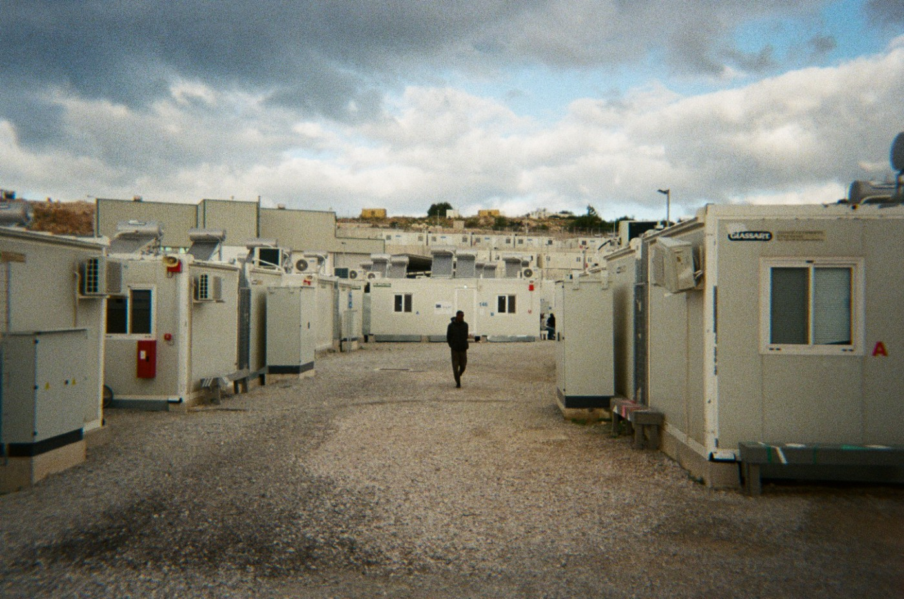
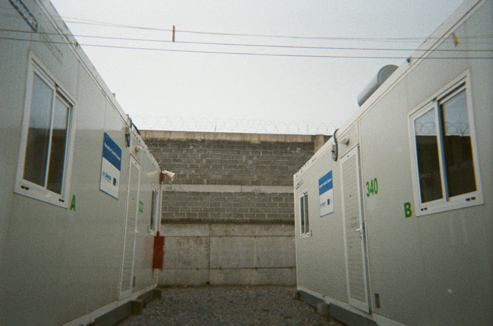

### AYS Special from Greece: 43 Million Euros for no water

After the Closed Controlled Access Centre \(CCAC\) in Samos officially opened in September 2021, it was stated that material conditions would at least improve in the facility [financed by 43 million euros](https://www.dw.com/en/greece-opens-first-refugee-holding-camp-on-samos-island/a-59225924#:~:text=Camps%20to%20cost%20%E2%82%AC1,the%20migrant%20arrivals%20by%20sea.) of EU money\. However, [within weeks](https://www.europemustact.org/post/concerns-of-samos-new-camp-residents-3-weeks-after-its-opening-when-will-i-become-a-human) of the opening, it was already clear that many things were lacking and/or dysfunctional, with residents stating that they felt as if they were in prison\.

The camp has now been operational for seven months and has a current population of roughly 400 people — a fifth of the structure’s full capacity\. Despite this, the running water supply in the camp for residents has been restricted for the [last 13 days](https://twitter.com/AdvocacySamos/status/1526489797627355138) due to a technical fault\. [The water needs to be pumped to the site](https://www.infomigrants.net/en/post/40579/greece-migrants-at-samos-camp-without-running-water) due to its elevated and remote position \- a problem they were always aware of\.

In place since the 6th of May, the tap water supply is limited to only two hours per day \(8–9am and 7–8pm\) with many people stressing that it isn’t even working during the designated hours\.

While General Secretariat for the Reception of Asylum Seekers, Manos Logothetis, states that the ‘pump’ has malfunctioned and is difficult to replace, the current limitation of the water supply is directly restricting the water for people to drink and use to cook, as well as the supply to the showers and toilets\. The lack of water raises serious hygiene and health concerns\.

Even though residents have been receiving extra water bottles as compensation since the start of the restrictions, the respective amount per person seems to be inconsistent\. Between the 13th of May and the 16th of May, the Samos Advocacy Collective was informed that the compensatory water bottle personal allowance had been reduced from six 1\.5L bottles per person to three 1\.5L bottles per person each day\.

> According to the [Sphere Standards](https://spherestandards.org/wp-content/uploads/Sphere-Handbook-2018-EN.pdf) , a minimum of 15 litres a day per person should be granted\. 

The current 4\.5 litres per day per person distributed in the camp are nowhere near the minimum standards in humanitarian response\. While the right to adequate access to water is also regulated in the [revised Drinking Water Directive](https://eur-lex.europa.eu/legal-content/EN/TXT/HTML/?uri=CELEX:32020L2184&from=EN) of the European Union and the [EU Directive 2013/33](https://eur-lex.europa.eu/legal-content/EN/TXT/HTML/?uri=CELEX:32013L0033&from=EN) , it seems needless to highlight that access to water is a fundamental element to ensure human dignity and an adequate standard of living\.

With the camp being located in a remote hill area, the structure is constantly exposed to strong sunlight and residents have little to no means of finding shade\. Given the rising temperatures at the moment, the lack of running water poses serious concerns to residents of the Samos CCAC\.

The absence of consistent water supply for residents living in a facility that has been financed by the European Commission with [43 million euros](https://migration.gov.gr/en/o-ypoyrgos-metanasteysis-kai-asyloy-k-notis-mitarakis-egkainiase-ti-nea-kleisti-elegchomeni-domi-sti-samo/) and has been operational for less than a year is unacceptable as are all camps\. NGOs working on the island have been filling the gap by filling up empty water bottles at community centres, handing out jerry cans and providing wet wipes for people to clean themselves\.

At the moment, it is unknown when the problem will be fixed and how much water will be available for residents in the following days, yet this will not stop the temperature from rising or the need for water increasing\.

**_Article By [Samos Advocacy Collective](https://twitter.com/AdvocacySamos)_**

**Find daily updates and special reports on our [Medium page](https://medium.com/are-you-syrious) \.**

**If you wish to contribute, either by writing a report or a story, or by joining the info gathering team, please let us know\.**

**We strive to echo correct news from the ground through collaboration and fairness\. Every effort has been made to credit organisations and individuals with regard to the supply of information, video, and photo material \(in cases where the source wanted to be accredited\) \. Please notify us regarding corrections\.**

**If there’s anything you want to share or comment, contact us through Facebook, Twitter or write to: areyousyrious@gmail\.com**

_Converted [Medium Post](https://medium.com/are-you-syrious/ays-special-from-greece-43-million-euros-for-no-water-9a27b897ae38) by [ZMediumToMarkdown](https://github.com/ZhgChgLi/ZMediumToMarkdown)._
