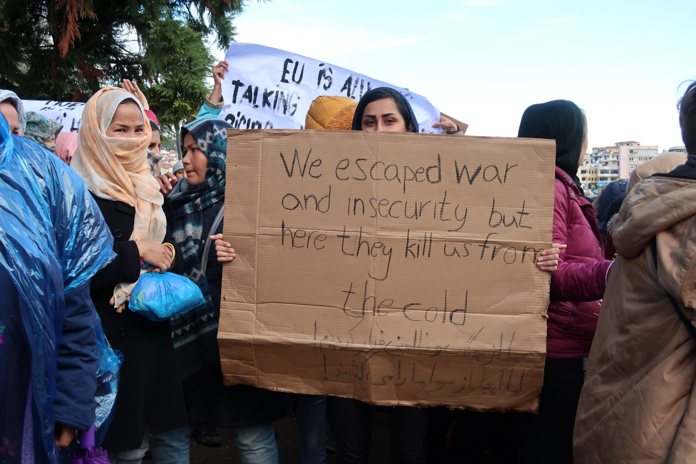

### AYS News Digest 20/5/22: Greece: Dysfunctional democracy and asylum system
#### No legal routes for asylum seekers in the UK — Rwanda expects first transfer of May/Illegal detentions and deportations in Grand Canaria/People still continue to attempt sea crossings/ and some material worth reading and listening to

Photo illustration from one of the earlier protests we wrote about
#### **FEATURE**

Among all European countries, Greece ranked last in [the World Press Index issued by Journalists without Borders](https://rsf.org/en/index) \. Press freedom has faced a setback with journalists covering controversial issues for the country — the frequent pushbacks and refugee issues but also Covid\-19 — facing challenges and self\-censorship due to lack of funds to continue their work\.

Phones being tapped without explanation and monitored through spyware by the Greek authorities, but also the adoption by the Greek parliament of a legal provision to combat COVID\-19 disinformation making it a [criminal offence to spread fake news, punishable by up to five years](https://www.hrw.org/news/2021/11/17/greece-alleged-fake-news-made-crime) imprisonment — these have been some of the current government’s tactics creating a chilling effect on free speech and media freedom\.

With regard to asylum policies, we have repeatedly reported the institutionalized pushbacks by the Greek government which continue to take place in Greek waters\. There have been more than 50 complaints of deportations in Evros and the Aegean, as revealed by the head of the independent authority Andreas Pottakis, who presented the Ombudsman’s annual report for 2021\.

■■■■■■■■■■■■■■ 
> **[Eleni Konstantopoulo](https://twitter.com/EleniKonstanto) @ Twitter Says:** 

> > #Greece Ombudsman is investigating more than 50 complaints of deportations (#pushbacks) in #Evros & the #Aegean, the head of the independent authority Andreas Pottakis presented the Ombudsman's annual report for 2021, to the parliamentary 
 [m.tvxs.gr/mo/i/364563](https://m.tvxs.gr/mo/i/364563) 

> **Tweeted at [2022-05-20 09:47:06](https://twitter.com/elenikonstanto/status/1527586705355821057).** 

■■■■■■■■■■■■■■ 

> The dysfunctional asylum system and inadequate integration have increased social racism and discrimination in the country\. 

Only two days ago, a hostel for unaccompanied minors in Thessaloniki, the second\-largest city in Greece, was attacked by a group of fascists who attacked eight unaccompanied minors, hitting a 16\-year\-old boy from Pakistan on the head with a stick, punching him in the face and stealing his mobile phone\.

■■■■■■■■■■■■■■ 
> **[Lena K.](https://twitter.com/lk2015r) @ Twitter Says:** 

> > A hostel for unaccompanied minors in Thessaloniki was attacked yesterday by group of fascists. Just before that they attacked 8 unaccompanied minors, hitting a 16-year-old boy from Pakistan on the head with a stick, punching him in the face and stealing his mobile phone. 

> **Tweeted at [2022-05-20 14:39:24](https://twitter.com/lk2015r/status/1527660264140816384).** 

■■■■■■■■■■■■■■ 

At the same time, victims of shipwrecks in Greek waters have often been imprisoned, facing lifelong sentences in jail for smuggling while spending sometimes even a year in pre\-trial detention\.

■■■■■■■■■■■■■■ 
> **[borderline-europe](https://twitter.com/BorderlineEurop) @ Twitter Says:** 

> > While we are still relieved about the good outcome of yesterday's #Samos2 trial, the next trial against so-called "boat drivers" is already taking place today, this time in #Kalamata. 
The two defendants have already spent more than a year in pre-trial detention! 
#Dropthecharges 

> **Tweeted at [2022-05-19 10:37:07](https://twitter.com/borderlineeurop/status/1527236904424448005).** 

■■■■■■■■■■■■■■ 

Criticized by NGOs, international media and opposition politicians, the inhumane and flawed asylum system forces people on the move to live on the fringes of society, in limbo, without the right to access the labour market, social services, cash assistance, healthcare systems or accommodation\. The legal info team, Mobile info team, is raising awareness by showcasing the experiences of people seeking asylum on mainland Greece, Crete and Rhodes since the policy changes in late November 2021\. Read the report [here](https://www.mobileinfoteam.org/blockedfromthesystem?fbclid=IwAR2lH8tWnEFtzbfjfiV8T-SZ6piIi8Y5QkttFemqWY86vyWNiFNcnGXAW9o) \.

■■■■■■■■■■■■■■ 
> **[Mobile Info Team](https://twitter.com/mobileinfoteam) @ Twitter Says:** 

> > Today we publish our latest report #BlockedfromtheSystem demonstrating that the 3 narrow avenues to register asylum on mainland Greece since Nov 2021 are dysfunctional. 6 months later there is a near-total lack of access to asylum. 

➡️ Read the report: [mobileinfoteam.org/blockedfromthe…](http://www.mobileinfoteam.org/blockedfromthesystem) https://t.co/4NdS8Zjh8B 

> **Tweeted at [2022-05-19 06:09:46](https://twitter.com/mobileinfoteam/status/1527169623669583872).** 

■■■■■■■■■■■■■■ 

#### GREECE
### **People seeking safety continue to arrive on Samos**

As of May 19, MSF Sea has rescued 48 people in distress on Samos, Greece, including one child and two pregnant women who have been transferred to a hospital, along with five others\.

■■■■■■■■■■■■■■ 
> **[MSF Sea](https://twitter.com/MSF_Sea) @ Twitter Says:** 

> > People seeking safety continue to arrive in #Samos #Greece. In the past 2 weeks, we provided first aid to 48 people in distress. 5 of them, including 1 child and 2 pregnant women were referred to the hospital via ambulance. All others were received by the closed centre in Zervou. 

> **Tweeted at [2022-05-19 12:41:28](https://twitter.com/msf_sea/status/1527268197270966272).** 

■■■■■■■■■■■■■■ 

#### **SEARCH AND RESCUE AT SEA**
### **Ocean Viking team to rescue 158 survivors**

The Ocean Viking rescue team rescued 158 survivors from two overloaded rubber dinghies in the Libyan Search & Rescue Region on May 19\. The people who were rescued were attempting to reach Italy\. They had spent nine hours in the water, including six pregnant women, several children and a three\-month\-old baby, according to SOS Mediterranean on Twitter\.

■■■■■■■■■■■■■■ 
> **[SOS MEDITERRANEE](https://twitter.com/SOSMedIntl) @ Twitter Says:** 

> > This morning, #OceanViking team rescued 158 survivors from 2 unseaworthy & overloaded rubber boats in the Libyan Search & Rescue Region. 1 injured man had to be evacuated via basket stretcher. 
Among the survivors are 6 pregnant women, several children & a 3-month-old baby. (1/2) https://t.co/zBnLRBHluu 

> **Tweeted at [2022-05-19 13:39:56](https://twitter.com/sosmedintl/status/1527282910721585152).** 

■■■■■■■■■■■■■■ 

### **Documenting physical evidence of violence and torture** **of people fleeing Libya**

Medic Mohamed Fadlalla, aboard the GeoBarents rescue ship, documents the physical evidence of violence and torture that people on the move have faced in Libyan jails to make sure that such cases do not fall through the cracks and go unnoticed by the EU authorities, according to a tweet by journalist Franziska Grillmeier on Twitter\.

Those being held in Libya are often tortured by their captors demanding money\.

“As neither he nor his family could pay \(as many survivors often tell me\) they proceeded to beat him\. They then tied his arms up, lit a lighter, and sprayed cologne from a bottle through the flame into his chest and arm\. This created a large area of burns on the boy’s body\.”

■■■■■■■■■■■■■■ 
> **[Franziska Grillmeier](https://twitter.com/f_grillmeier) @ Twitter Says:** 

> > TW: Violence, Torture

The following is an excerpt of a testimony by Mohammed Fadlalla, an internal medicine physician on board of the #GeoBarents right now: 

"Among my responsibilities on the ship is to do my best in accurately and (...)" /1 

> **Tweeted at [2022-05-19 14:45:46](https://twitter.com/f_grillmeier/status/1527299477769699328).** 

■■■■■■■■■■■■■■ 

### **Geo Barents’ disembarkation on hold in Sicily without explanation**

470 rescued people had been waiting at sea for a week when the disembarkation of the humanitarian ship Geo Barents was put on hold once again on May 19 without explanation according to [InfoMigrants](https://www.infomigrants.net/en/post/40661/mediterranean-infant-torture-victims-among-migrants-on-dangerous-crossing?fbclid=IwAR0Ta3YCehjuQMVyf5ZBDje5sgy1GPoN9OmNFdHilKyGERNMlOprZPu919k) \.

The ship still had 238 people waiting on board, and six people jumped into the sea “out of desperation after 11 days of unjustified waiting,”

■■■■■■■■■■■■■■ 
> **[Alarm Phone](https://twitter.com/alarm_phone) @ Twitter Says:** 

> > Our solidarity with crew and survivors on the #GeoBarents!

There is no justification for preventing them from disembarking for 11 days! 

Stop this cruelty and #LetThemLand! 

> **Tweeted at [2022-05-20 10:36:34](https://twitter.com/alarm_phone/status/1527599153877962753).** 

■■■■■■■■■■■■■■ 

**Three dead and 10 missing after a boat capsizes off Tunisia**

Coastal authorities in Tunisia rescued 44 people, 10 are still missing, and three were found dead in Sfax on May 20, [according to Alarabya](https://english.alarabiya.net/News/north-africa/2022/05/20/Three-migrants-dead-10-missing-as-boat-capsizes-off-Tunisia?utm_source=dlvr.it&utm_medium=twitter&fbclid=IwAR2NscZoveTXPKDd7xLVVfotVrKgmVfc-yHWRdz_3pZZudtI9opTC5EiYR4) \.
### **Lives at risk in Central Mediterranean**

A total of 120 people were at risk in the Maltese search and rescue zone after two days at sea and in need of urgent help, Alarm Phone reported on Twitter on May 20\.

After 30 hours of lost connection, Alarm Phone believes that they were intercepted by the Libyan authorities and forced back to Libya\.

■■■■■■■■■■■■■■ 
> **[Alarm Phone](https://twitter.com/alarm_phone) @ Twitter Says:** 

> > 🔴 SOS from Central Med - 120 lives at risk in #Malta SAR!
We have contact to a boat in distress in the Maltese search & rescue zone. After 2 days at sea, the 120 people are exhausted & need urgent rescue now! We call on European authorities to do their duty & rescue the people! https://t.co/84s29v9NcM 

> **Tweeted at [2022-05-19 13:31:11](https://twitter.com/alarm_phone/status/1527280709508812804).** 

■■■■■■■■■■■■■■ 

**A boat with seven people on board has gone missing between Algeria and Spain**

■■■■■■■■■■■■■■ 
> **[Héroes del Mar](https://twitter.com/Heroesdelmar) @ Twitter Says:** 

> > 🚨🚨 PATERA DESAPARECIDA🚨🚨

Familiares nos alertan de 1 Patera Desaparecida con 7 Hombres Argelinos 

Salieron el Miércoles 18 a las 21:00h desde Bejaia
dirección Palma de Mallorca (Islas Baleares)

Embarcación Fibra Azul con Motor 250cv

Hemos alertado a Salvamento Marítimo https://t.co/4MLoUWXeIF 

> **Tweeted at [2022-05-20 16:45:59](https://twitter.com/heroesdelmar/status/1527692121095929856).** 

■■■■■■■■■■■■■■ 

**Italy**

**Afghan woman dies from a heart attack in a tent camp**

After reaching the port of Rocella Ionica, a 70\-year\-old woman from Afghanistan died of a heart attack on Wednesday, May 18, reports [InfoMigrants](https://www.infomigrants.net/en/post/40638/italy-afghan-migrant-woman-suffers-fatal-heart-attack-in-tent-camp?fbclid=IwAR3D9ZsNYCkfM3GeUHxpxbFb5cKZV7RgCZF1uj9sCBcz_qn07RealudfrTE) news media\. She had reached the Calabrian seaport together with 96 others, including many children\.

A medical team in Rocella had checked her upon arrival, but her condition was considered as not serious enough to require hospitalization\. Her condition deteriorated suddenly and she died despite the immediate intervention of health workers and Red Cross volunteers\. The woman was discovered to be diabetic after her death\.

While police are investigating the death, prosecutors in the nearby city of Locri are expected to order an autopsy\.
### **Asylum seekers eligible to open an Italian bank account**

Asylum seekers who are waiting for a residence permit have the right to open a basic bank account in Italy\.

The Italian government website Integrazione Migranti \(Integration Migrants\) has published information about opening a ‘basic bank account’ in Italy\. The ‘FAQ’ site highlights that asylum seekers have the right to open a bank account, and explains which documents are needed\.

Read more [here](https://www.infomigrants.net/en/post/40640/asylum-seekers-how-to-open-an-italian-bank-account?fbclid=IwAR2iLt1En2wwC4E-AbS4pnzdJA2WO2EHHGOQgFCfvpkzt265iB3QYXlPwrE) \.
#### FRANCE
### **Expulsions of exiled people continue in Calais**

■■■■■■■■■■■■■■ 
> **[Human Rights Observers](https://twitter.com/HumanRightsObs) @ Twitter Says:** 

> > À #Calais, même sous la pluie, les #expulsions continuent. Les tentes des personnes exilées, seuls abris dont elles disposent pour faire face aux intempéries, sont saisies. Aucune considération pour leur santé, droit pourtant fondamental et universel en France. https://t.co/53j619zinU 

> **Tweeted at [2022-05-19 14:06:36](https://twitter.com/humanrightsobs/status/1527289624925597696).** 

■■■■■■■■■■■■■■ 

#### **SPAIN**
### **Illegal detentions and deportations in Grand Canaria**

Serious institutional human rights violations are taking place at the CATE detention centre of Gran Canaria and Lanzarote, warns the Spanish Center for the Defense of Human Rights, IRIDIA\.

According to IRIDIA, people are being detained under inadequate conditions for more than 72 hours without being provided with a lawyer\. Despite the organization’s request to visit CATE, the Spanish Ministry of Interior has not allowed visiting\.

IRIDIA has repeatedly denounced the irregular deportations of people with expired orders and the way CATEs function as extensions of police stations with no regulations\.

■■■■■■■■■■■■■■ 
> **[IRIDIA](https://twitter.com/centre_IRIDIA) @ Twitter Says:** 

> > Los CATE funcionan como extensiones de las comisarías y carecen de regulación⚠️

- Se superan las 72h de detención
- Hay dificultades en el acceso a abogados/as o información
- Las condiciones no son adecuadas

@[interiorgob](https://twitter.com/interiorgob) nos denegó la visita al CATE de Gran Canaria y Lanzarote https://t.co/hPi2JBslol 

> **Tweeted at [2022-05-19 10:29:52](https://twitter.com/centre_iridia/status/1527235082402074625).** 

■■■■■■■■■■■■■■ 

At the same time, on the northern coast of Africa, in Ceuta, cross\-border workers will be able to obtain a working visa from May 24\.

The Delegation Government of the autonomous Spanish city, in coordination with the Ministries of the Interior and Foreign Affairs and the Consulate of Spain in Tetouan, will allow cross\-border people to access Ceuta through a visa with limited territorial validity and without a permit an Identity Card of Foreigners \(TIE\) needed\.

ONLY THE FOLLOWING MAY SUBMIT A REQUEST:
- Workers who have been granted valid cross\-border work authorization\.
- Workers who have the previous authorization but “pending registration with Social Security”\.

All of them must be included in the list provided to this Consulate General by the Immigration Office of the Ceuta Government Delegation\.

Read more [here](https://elforodeceuta.es/delegacion-del-gobierno-publica-el-procedimiento-para-la-obtencion-del-visado-del-colectivo-transfronterizo/?fbclid=IwAR0kJzAiVjBzN6UKcaLJOAlMiw0u4oUI-kwbtSou8aJjFXY5BeFe7PoF22Q) \.
#### **CZECH REPUBLIC**
### **Ukrainians seeking refuge in the Czech Republic to take up jobs, otherwise lose welfare benefits**

Of the 348,000 Ukrainians seeking refuge in the Czech Republic, only around 50,000 of them have found jobs in industries that were previously short of workers\. According to [InfoMigrants](https://www.infomigrants.net/en/post/40657/czech-authorities-encourage-ukrainian-refugees-to-seek-work--or-else-lose-benefits?fbclid=IwAR24tPFJGq2nyPhRtIgiaY2GkRWCsvvEjKzloSRzWi5Lx9F0BO9pGkGjOt8) , more than a third of them have either returned home or moved to other countries within the EU and beyond\.

In the meanwhile, those who have stayed and are being hosted in government\-provided shelters are likely to lose their entitlement to the state’s assistance after the Czech government makes changes in the health care system tying benefits to employment status\. In this way, people are forced to seek employment as adults and are provided free health care only for the first 180 days\.
#### UK
### No legal routes for asylum seekers in the UK — Rwanda expects the first transfer in May

There has been much criticism of the controversial asylum agreement between the United Kingdom and Rwanda, but the east African country will receive the first 50 asylum seekers by the end of May despite critical remarks from the United Nations, rights activists, and opposition leaders\.

■■■■■■■■■■■■■■ 
> **[MSF UK](https://twitter.com/MSF_uk) @ Twitter Says:** 

> > On 2nd February, during a Home Affairs Committee meeting, she admitted there were no routes in place for anyone seeking asylum unless they were from Afghanistan or Syria. https://t.co/bhYTckBU9e 

> **Tweeted at [2022-05-19 17:21:48](https://twitter.com/msf_uk/status/1527338747720650752).** 

■■■■■■■■■■■■■■ 

Everyone entering the UK illegally, as well as those who arrived illegally since January 1, will be sent to Rwanda, while the British government will contribute up to £120 million \($157 million, 144 million euros\) \.

■■■■■■■■■■■■■■ 
> **[Vincent Biruta](https://twitter.com/Vbiruta) @ Twitter Says:** 

> > Complex problems call for bold actions. That’s why 🇷🇼 is proud to work with 🇬🇧 on an innovative migration and economic development partnership-no one else is offering the solution needed to save lives and address the illegal migration crisis. 

> **Tweeted at [2022-05-20 13:32:08](https://twitter.com/vbiruta/status/1527643338932989954).** 

■■■■■■■■■■■■■■ 

A controversial reform, passed by the British parliament last month to crack down on illegal immigration, introduces life sentences for people smugglers — the Nationality and Borders Act — which also imposes harsher jail terms for those arriving illegally, and raises fears of discriminating against asylum seekers and refugees\.

Despite this, and no safe and legal routes left to the UK, people are still attempting to reach the UK through sea crossings, risking their lives\. Just a few days ago, a total of 34 people were rescued by the RNLI rescue crew amid a severe storm\.

■■■■■■■■■■■■■■ 
> **[Channel Rescue](https://twitter.com/ChannelRescue) @ Twitter Says:** 

> > Last night, in the midst of the storm, the RNLI received calls from people in trouble in a small boat in the middle of the Channel. Thankfully all 34 people (32 men & 2 women) made it here safely. @PritiPatel we need safe, accessible routes to the UK for people seeking sanctuary! https://t.co/zZdcDj9bAo 

> **Tweeted at [2022-05-19 10:05:18](https://twitter.com/channelrescue/status/1527228898546749440).** 

■■■■■■■■■■■■■■ 

#### GENERAL
### **New podcast episode — The Civil Fleet**

On May 21, Kathrin Schmidt — a rescue worker who saved the lives of 14,000 refugees in the Mediterranean Sea aboard the Iuventa five years ago — and three others from the ship are due to appear in an Italian court on charges of facilitating illegal entry into the country\. They could all face 20 years behind bars\.

She explains what this case means for the future of activist\-led sea rescues, and for the people on the move at Europe’s edges\.

Listen [here](http://bit.ly/3lLA7EF) , [here](http://apple.co/38zTSMr) or [here](http://spoti.fi/3wIpyqZ) \.
### BVMN’s voices from the borders: the closure of the humanitarian corridor

■■■■■■■■■■■■■■ 
> **[Border Violence Monitoring Network](https://twitter.com/Border_Violence) @ Twitter Says:** 

> > 📢 New episode out!  

👉 [soundcloud.com/border-violenc…](https://soundcloud.com/border-violence-monitoring-network/voices-from-the-borders-the-closure-of-the-humanitarian-corridor)

We continue looking into what happened between 2015 and today, taking a closer look at the #ClosureOfTheHumanitarianCorridor and what happened after formal support and widespread media coverage broke off. #OtherFaceOfEurope 

> **Tweeted at [2022-05-20 15:08:38](https://twitter.com/border_violence/status/1527667623814643719).** 

■■■■■■■■■■■■■■ 

#### **WORTH READING**
- Border Violence — Monthly report on illegal pushbacks is here\!

■■■■■■■■■■■■■■ 
> **[Border Violence Monitoring Network](https://twitter.com/Border_Violence) @ Twitter Says:** 

> > 1/ Our monthly report for April is out. 

Read + download the full report here ➡️ [borderviolence.eu/balkan-regiona…](https://www.borderviolence.eu/balkan-regional-report-april-2022/) https://t.co/lN6WJ2Qqgy 

> **Tweeted at [2022-05-20 08:07:03](https://twitter.com/border_violence/status/1527561525623414785).** 

■■■■■■■■■■■■■■ 

- **Border Criminologies \| Interview: EU Border Externalisation and the Migrant Transport Trade in Niger**

Associate researcher Alice Anne Troy\-Donovan at the Center for African Studies at the University of Copenhagen interviews political scientist Philippe Frowd on how historic and current European border interventions shape everyday lives and mobilities in Africa\.

- **Fixing Aid \| The dangers of border technology for refugees**

Biometrics, drones, sensor towers, and robot dogs: In this episode of Fixing Aid, host Alae Ismail explores the growing use of border and surveillance technology and looks at the grave consequences and long\-lasting impacts on refugees and migrants around the globe\.

- **Frontera rima con primavera \(Frontera rhymes with spring\)**

Op\-ed on the border and its opening and closure in Ceuta\.

- **Mixed Migration — hebdo \| May 9–19, 2022**

This week, a quick reflection on what migration is and isn’t — with a cameo from Juan — followed by an unusually lengthy MMh before I go on 1–2 weeks of digital detox\. See you again — at the latest — in June\!

- **Potential and Limits of Municipal Solidarity with Refugees: A Case Study of the Greek Island of Tilos**

New open\-access article by PhD researcher Tihomir Sabchev on academic and policy research in migration and refugee studies, refugee reception/integration at the local level\.

**Find daily updates and special reports on our [Medium page](https://medium.com/are-you-syrious) \.**

**If you wish to contribute, either by writing a report or a story, or by joining the info gathering team, please let us know\.**

**We strive to echo correct news from the ground through collaboration and fairness\. Every effort has been made to credit organisations and individuals with regard to the supply of information, video, and photo material \(in cases where the source wanted to be accredited\) \. Please notify us regarding corrections\.**

**If there’s anything you want to share or comment, contact us through Facebook, Twitter or write to: areyousyrious@gmail\.com**

_Converted [Medium Post](https://medium.com/are-you-syrious/ays-news-digest-20-5-22-greece-dysfunctional-democracy-and-asylum-system-b5a59a90cfed) by [ZMediumToMarkdown](https://github.com/ZhgChgLi/ZMediumToMarkdown)._
