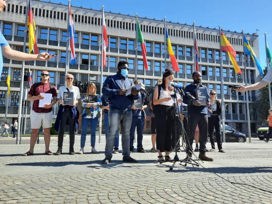
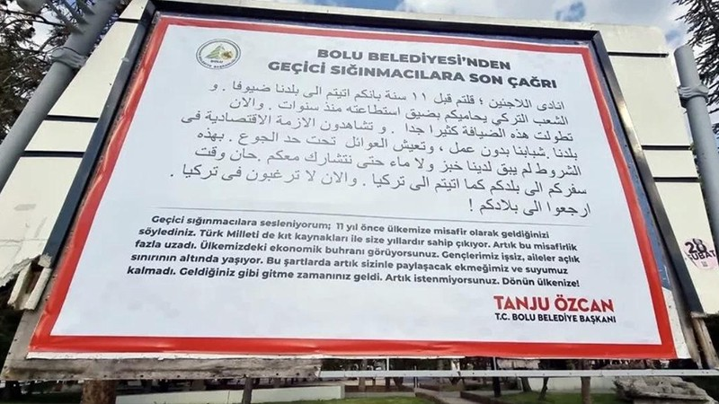

### AYS News Digest 23/5/22: International civil society calls out the Slovenian government
#### Poland: Holes along the border / Estonia: Parliament must ensure that the bill amending the State Borders Act complies with human rights obligations / **Despite Brexit, British police can influence surveillance laws in the EU / Reports, warnings and some important data you should know about**

Photo: InfoKolpa
#### FEATURE

To bring about greater visibility to our Slovenian fellow activists’ indignation and our recent common letter regarding the candidacy of Tatjana Bobnar for the post of Minister of Interior Affairs, we are publishing the entire letter InfoKolpa wrote, co\-signed by AYS with a number of other organisations:

**Dear Sir, Dear Madam,**

**Robert Golob, president of Gibanje Svoboda,**

**Tanja Fajon, president of SD,**

**Luka Mesec, coordinator of Levica,**

**Tatjana Bobnar,**

The civil initiative Infokolpa, the Border Violence Monitoring Network and the undersigned organisations condemn the announced candidacy of Tatjana Bobnar for the post of Minister of Interior Affairs\. Our primary objections relate to her actions directing the actions of police officers at the border and the implementation of deportations to Croatia in 2018, 2019 and 2020\. We recall that in June 2018, Slovenia started the practice of mass deportations of persons and denying them the application for international protection in Slovenia\.

From the beginning of 2018 until the end of March 2022, Slovenia has carried out 29,865 extraditions to Croatia under the informal procedure, according to official data\. Bobnar as Deputy Director\-General of the Slovenian Police and later as Director of the Police participated in one of the worst cases of mass violations of fundamental rights in the modern history of the Slovenian state by co\-signing internal directives on police action at the border\.

During her time at the highest levels, police officers began the practice of systematically rejecting asylum applications and carrying out deportations\. In 2018 and 2019 alone, Slovenia carried out almost 16,000 deportations to Croatia, despite the proven serious risk of torture and inhumane treatment of migrants by the Croatian police\. Many of these cases have been documented in the two volumes of the Black Book of Pushbacks that will be sent to all the presumed coalition parties together with this statement\.

Bobnar is directly complicit in creating a deadly situation on the Balkan migration route by abusing the police and directing police procedures in a way that does not follow legal mandates, but instead constitutes a direct violation of the universal right to life and protection from torture\. The existence of such violations has also been established by the Supreme Court, and it is therefore worrying that the future coalition does not recognise the role of Bobnar in the abuse of the police to carry out mass deportations\.

**Mass deportations** have been recognised as a systemic violation of the principle of non\-refoulment, the prohibition of collective deportation and the denial of access to international protection by both the Supreme Court and the European Parliament Resolution on the rule of law in Slovenia\.

We also draw attention to other problems: restrictive legislation and a lack of adequate staff have created confusion in the field of labour migration, where many foreign nationals and migrant workers wait for months before obtaining or renewing work permits and the possibility to regularize their stay\. We also draw attention to the worrying situation regarding decisions on international protection status, where decision\-makers are rejecting or holding for years applications from people fleeing countries such as Afghanistan or Eritrea\. In 2021, Slovenia issued only 19 positive decisions on international protection status\.

Slovenia needs a person to lead the Ministry of the Interior who will bring the police back into the community and who is able to resolve conflicts\. We need a person who can reorganise the civil service to serve the people\. Above all, we need a person who will be able to confront the serious violations of the fundamental rights of migrants that have been taking place on a massive scale in Slovenian police stations in recent years, and who will be able to carry out a proper investigation into the abuse of official procedures, to find the guilty parties, to apologise for their behaviour and, above all, to ensure that such serious violations do not happen again\. We certainly do not need a person who will justify practices that systematically and brutally violate the human rights of certain groups\.

Political party Gibanje Svoboda, which has won the last elections, has also declared in its programme the removal of the wire from the border and a more humane migration policy\. However, Bobnar’s candidacy as Interior Minister may mean a continuation of the policies pursued by the previous government regarding the abuse of police powers and the normalisation of police violence on a general level\. We remind the future mandate holder that the border fence is not a cosmetic problem and that its removal should not be a populist gesture\.

If the pre\-election confrontations promised to “govern in coalition with civil society”, we hope that the government will heed the warnings of civil society and involve it in shaping a migration policy based on human rights or at least in line with current legislation\.

Infokolpa

Border Violence Monitoring Network

Delavska svetovalnica

Društvo Humanitas — Center za globalno učenje in sodelovanje

Zavod Proja

Are You Syrious? \(Zagreb\)

Centar za mirovne studije \(Zagreb\)

Alarm Phone Austria \(Graz\)

Zagreb Solidarity City \(Zagreb\)

Transbalkan Solidarity

Transnational Migrants Coordination

**Letters of support:**

_“Under the leadership of Tatjana Bobnar, thousands of refugees have been returned to Croatia from Slovenia\. Through the abuse of the informal return system, they were handed directly into the hands of the Croatian police, even though Bobnar knew that these people would be victims of brutal returns outside EU territory\. In recent years, chain returns from Slovenia have accounted for a third of all persons illegally deported from Croatia to BiH\. A fact that has unfortunately made Slovenia one of the main human rights violators in our part of Europe\._ ” — Milena Zajović, president of Are You Syrious? and head of advocacy at Border Violence Monitoring Network

_“After two Austrian court rulings have already found that the Austrian police illegally returned people to Slovenia in 2020 and 2021 with the cooperation of Slovenian police officers under Bobnar’s authority, and that it is very likely that hundreds of illegal chain returns from Austria via Slovenia to Croatia and Bosnia took place in 2020 and 2021, human rights defenders are extremely concerned for Slovenians that one of the most important ministries is overseen by a person with such a problematic past_ \.” — Petra Leschanz, Alarm Phone Austria

_“We support the statement from Infokolpa denouncing the possible appointment of Ms Tatjana Bobnar as Interior Minister of Slovenia\. With this support, we point out the hypocrisy and violence of the European border regime\. For years, the stark violation of the right to apply for asylum has been sustained by illegal pushbacks across the Balkans, leaving thousands of men, women and children exposed to the elements in what is known as a ping\-pong game, where states play with the life of migrants\. Ms Tatjana Bobnar has been a protagonist of this game\. But she is not the only one\. Today European states are trying to ‘clean’ their image and show themselves as friendly to refugees from Ukraine\. But the game of pushbacks and violations of migrants’ rights continues in the Balkans as well as at sea and at the other borders of Europe\. While we join our Slovenians comrades in refusing Ms Tatjana Bobnar as the ministry of the Interior in Slovenia, we claim that the racist European border system must be overthrown by imposing a European residence permit without conditions for all migrants and refugees reaching or willing to reach Europe, against the politics of war and the political instrumentalization of asylum\.”_ — Transnational Migrants Coordination
#### TURKEY
### Anti\-refugee mayor erects billboards telling Syrians in Arabic to leave Turkey

A fine of TL 40,000 \($2,505\) was [reportedly](https://www.turkishminute.com/2022/05/19/efugee-mayor-erects-billboards-telling-syrians-in-arabic-to-leave-turkey/?fbclid=IwAR3MdQGHbJVIJWIxRcywC4URQG3uu0KrtZsxcXS65wnpuiAtjOEr2rnhiac) issued for the Bolu Municipality for “violation of the prohibition of discrimination” of their mayor who placed racist billboards in both Arabic and Turkish, reads: “I’m calling on temporary asylum seekers: 11 years ago, you came to our country as guests\. The Turkish nation has been protecting you for years with its scarce resources\. You’ve overstayed your welcome\. You see the economic depression in our country\. Our youth are unemployed, families live below the poverty line\. Under these conditions, we have no more bread and water to share with you\. It’s time for you to go as you came\. You are no longer wanted, return to your country\.”

According to the Turkish own official data, 2\.6 million people have been prevented from entering Turkey at the border over the last six years\.

[](https://l.facebook.com/l.php?u=https%3A%2F%2Fenglish.alaraby.co.uk%2Fnews%2Fturkey-detains-over-17000-migrants-deportation%3Ffbclid%3DIwAR3989WPN-NDtZrXeLSHHxmIBVYFDj8j4eIFb06R0rxR23EMO-E7X_Bqg5k&h=AT1YdSdrs8i4DNxrQM6AqHR3hmfGupv0BGxYZKyIrhBXmVEHWMQW0N-xfGPVv7CCq7X9MvuSSSBMTbIUDx9md4EeJ8aW92sDE6bnlHKsh8FOmPpgS3gf9jJGQOut6FE34pFTfy7mnBhZcQ&__tn__=R]-R&c[0]=AT2H6Qi3CMIxzVlxCalQxmoMzmmCMQJ9oWw6xbzyu8laLgarrdc-FtdhFvR-RCqkQM2Sr1lxjXqmOghbNDaCq0yBWj28E2NBhe6Y_Ym_lvYJjturjVCXzsfkv2KKOt8a8jvI6VSxKUbrsRc1cz3pi12C3MIo_cW7IoixJ8EknC1Gxv8q-eBAUS-d5dIJS1w1nA1eOgIhrfZK)

At the start of May, the deputy minister of the interior in Turkey stated the country currently hosts 3\.7 million refugees from Syria\. Although their president Erdoğan dismissed suggestions to repatriate refugees, he recently [brought](https://bianet.org/english/world/262158-over-500-000-refugees-have-returned-to-syria-says-turkey-s-interior-minister?fbclid=IwAR3vebIyFcDoVLp7yFZ9eF2P8aDLbrRBCt2ClugTQxm0UymDcWvUF3N8dGc) up the idea to “ [resettle](https://bianet.org/english/politics/261337-erdogan-says-turkey-prepares-a-new-project-for-voluntary-return-of-1-million-syrians) ” about a million people in “briquette houses” in Syria’s Idlib in order to “reduce the number of refugees to reasonable numbers \(sic\! \) \.”
#### GREECE

A report by the Mobile Info Team uncovers harrowing stories of those excluded from asylum procedures in Greece, who face heightened risk of pushbacks

> As the temporary protection recently offered to thousands of Ukrainians shows, the Greek authorities are very much capable of implementing a system which enables safe access to asylum, shelter and basic services\. They must apply this protection on an equal and non\-discriminatory basis\. 

### Samos received water

Following a number of reports and denunciations of the situation at the CCAC in Samos, including our own [Special on Samos](https://l.facebook.com/l.php?u=https%3A%2F%2Fmedium.com%2Fare-you-syrious%2Fays-special-from-greece-43-million-euros-for-no-water-9a27b897ae38%3Ffbclid%3DIwAR2rKocwiQrY8wyuddRJsmkTe5IJak1LdrJT-guk1BRVOg11LLha_F41KdA&h=AT0iSbqb49uqVyRBP93ELxDHvQ1rAvwayHrf_nPvdYo5kRnQEqfCoF10ZLlDkRUKjGPUyAq02dh0k3MwH8T9SX-djk73_qwC-YNGbYNQyKkA_Es63wst55LJ5xx512kOUZ3Pdj6Znx26eQ&__tn__=R]-R&c[0]=AT2NPHYslaTG2kb4iqQ5hBdZ1d1cUkD5SoM7TBRtqY21Q7mRpowIFu3n4WQrX9VknYoWKTKISH5bXxrwoVqiU9n5T_c57BOwLaqIiVJfqfvEnXDjuuhNyq5tTMHeScCSoCmxC7V8zp8OpSzM_T5qFJiwq5e1sYS8ipuD5rf18R3ShO0Hs0tXQwmJGbGtpjqLa_C4RviRZjax) , the situation seems to be getting a fix:

■■■■■■■■■■■■■■ 
> **[Samos Advocacy Collective](https://twitter.com/AdvocacySamos) @ Twitter Says:** 

> > Water problem is fixed!

After 17 Days with no proper access to running water, #asylumseekers in the #Samos CCAC have finally again access constant access to running water. 

> **Tweeted at [2022-05-23 15:30:08](https://twitter.com/advocacysamos/status/1528760196667002880).** 

■■■■■■■■■■■■■■ 

However, there are many other insecurities for the people stuck there, such as the security and lack of privacy for women and other individuals who might feel insecure due to a complete lack of basic standards \(SPHERE\) that would enable safer stay\.

Here are some of the issues:

■■■■■■■■■■■■■■ 
> **[Martha Roussou](https://twitter.com/MarthaRoussou) @ Twitter Says:** 

> > I was on #Samos last week &amp; visited the Closed Controlled Access Centre for asylum seekers, funded by @[EU_Commission](https://twitter.com/EU_Commission)
Considering this is a 'model' camp I was shocked at:
👉No doctor in the camp
👉No safe area for single women
👉Unaccompanied boys and girls together
@[EUHomeAffairs](https://twitter.com/EUHomeAffairs) 

> **Tweeted at [2022-05-23 15:29:03](https://twitter.com/martharoussou/status/1528759923714273292).** 

■■■■■■■■■■■■■■ 

#### SERBIA
### Pushbacks continue, but so does the poor reception system

Hungary regularly pushes back refugees with small children, even when they ask for asylum and protection\. Families with children from Iraq and Syria now live along the open border, APC teams report\. They also say the number of newcomers stopping at the camp of Preševo has increased daily, though people on the move find it difficult to receive reliable information on their position within the camp\.

In Obrenovac:

■■■■■■■■■■■■■■ 
> **[Azil u Srbiji Asylum Protection in Serbia](https://twitter.com/APC_CZA) @ Twitter Says:** 

> > Obrenovac 20/05/22. Više od 50 izbeglih iz Avganistana i Pakistana  spava na otvorenom oko centra za azil. Svedoče nam o sporadičnim praksama uprave kampa da se izbeglice zatvaraju,da im se uskraćuje hrana, higijena, voda, da koristi silu za održavanje stroge discipline u kampu. https://t.co/PcBHY7QWqX 

> **Tweeted at [2022-05-23 11:52:02](https://twitter.com/apc_cza/status/1528705308431994880).** 

■■■■■■■■■■■■■■ 

#### CZECH REPUBLIC
### You risk losing welfare benefits unless you accept the job

In the Czech Republic tens of thousands of refugees from Ukraine are filling jobs that had long been vacant\. Those who aren’t working risk losing welfare benefits under government proposals\.

Nearly 348,000 Ukrainians have found initial refuge in the Czech Republic since the beginning of the Russian invasion in late February\. It is estimated that more than a third of them have since either returned home or moved to other countries in the EU and beyond\.

However, among those who have stayed, more than 50,000 have reportedly found jobs in industries that were previously in dire need of workers, as data from Czech employment offices [show](https://l.facebook.com/l.php?u=http%3A%2F%2Fwww.infomigrants.net%2Fen%2Fpost%2F40657%2Fczech-authorities-encourage-ukrainian-refugees-to-seek-work--or-else-lose-benefits%3Ffbclid%3DIwAR3HRyCpRJMIDNffOvNUfxoHn-EbmeJOBk9qPye6v3UUyUUGa7TMpVPLPrE&h=AT18aTqbhIWk4Jy_qWXMz2rTmlugFxgKkF5EyS2bXtJtzBB2CSozUahrB2V8nzQsOmxygyslGOOyDGiuyxMpq_nMBwBnkCcJdkqBe3sSO2Dvj3Lk4BBZYjzA3hVDi1CchE_5Y8sBZGQLEg&__tn__=R]-R&c[0]=AT2nHP_PN_YwiCe9xDda232_QYyY-gISUk9NqLCw6HFgvOa9yHIooLme_HuyQGTyMsvEmZQJnNpTveKTA40S-aeekSMmdMiHDllH8oH9xoisXw7XoXw693xX_daPxpSG6Vht7k3BtmNtGgRz5eZGNvxZ1UBgMNsAlgbDy5FT5EryU29L4UM_hO3pthmHghHTQ0kB7umAppTQ) \.
#### ESTONIA
### Parliament must ensure that the bill amending the State Borders Act complies with human rights obligations

In a letter addressed to the President of the Estonian Parliament published today, Commissioner Mijatović called on parliamentarians to amend a bill which would, among other things, allow pushbacks in situations of emergency with a mass influx of migrants, and to ensure that it fully complies with Estonia’s human rights obligations\.

Recalling her recent Recommendation on putting an end to pushbacks in Europe, the Commissioner stressed that carrying out individual assessments remains a crucial tool for securing effective protection against refoulement, as well as for upholding other rights of refugees, asylum seekers and migrants\.

The Commissioner also stressed that designating certain border crossings as the only ones where asylum applications can be filed should not lead to violations of member states’ obligations under human rights instruments\. Other concerns about the bill include the lack of suspensive effect of appeals against a decision to immediately return\.

Having expressed her deep appreciation for Estonia’s solidarity and generosity in welcoming people fleeing the war in Ukraine, the Commissioner stressed that the commitment to upholding their human dignity and to fair treatment should be extended to all people arriving at member states’ borders with the same protection needs, regardless of their background or the manner of their arrival\.
#### LITHUANIA
### Indignation over the conditions people are being held in

[Sienos Grupė](https://www.facebook.com/sienosgrupe/?__cft__[0]=AZXPobMtfa2q8V1t8RuNNa5vqeB39qyiDejxwTKGtTScLWcBvjaX2CQfXAU_axtfZRbCIUflnwQn0Jz5JCQwXirl4bkIv0wg2CFZWBP6LacCsgVhMkrry4evzG0NhX1LmGwNEEnEk77Tb6PEKp2LRN4T&__tn__=-UC%2CP-R) [reporting](https://web.facebook.com/sienosgrupe/posts/177001191455334?__cft__[0]=AZWJDEi8TWckFpI-ZQMNJ5Z31wDbA_87Cdx7RDHFomcr4SbCXsgtTI5j0EPtttrzobSKnshpx71VZsbt8E9S3FRaeeIB6tMTgxfaDDATWRQM7F6wmB3YmcZNvwc0-9Q0d8UYI7wLS8AjqN3t-25Gy0B0jOjsXt4ICFFRCb-tl2wc7ovfMaKFPELdbaqmeOYtsWY&__tn__=R]-R) from Lithuania are calling out their state for continuing the poor practice of some of the other EU Member states when it comes to reception conditions:

> We regularly hear from asylum seekers detained in Lithuania that they do not receive enough state\-guaranteed legal aid, some of them do not feel that they are receiving it at all\. Some claim that they have never even seen the lawyer that the state has supposedly appointed for them, others also claim that they are being forced to sign documents written in a language that they do not understand, and some are not even aware of the status of their asylum application, and so on\. 

> This deliberate imitation of work on the part of the Lithuanian authorities can be understood, as it has been said repeatedly that the desire is to get as many asylum seekers as possible to give up and return to their home countries, even if they might face danger there\. Unfair legal procedures contribute to this ‘aim’, as do humiliating living conditions\. 

> Nevertheless, the existence of these sham legal processes should make us, the citizens of Lithuania, angry\. 

> After all, it is from our common money that the lawyer is paid \(and paid quite a lot\) for work that is very poorly done or not done at all\. 

> This tramples on the principles of equality and the rule of law\. 

#### POLAND
### 20th day of the hunger strike — another hunger protest in Lesznowola

This time 23 people went on strike to protest and oppose the violation of fundamental human rights by the Polish system\. At the moment there are 10 people left — Kurds, among them people fleeing political repression\.

The aim of the hunger strikers is to draw attention not only to their own situation, but to the whole pathology connected with the organisation and functioning of closed centres for foreigners in Poland\.

More and more detainees are making desperate attempts to resolve the situation in which they currently find themselves\.

> The protesters and people who support them expect the authorities of the centre to start negotiations as soon as possible\. One of the MPs sent a relevant letter to Lesznowola still on Friday afternoon\. They asked to start negotiations as soon as possible, i\.e\. on Monday\. The negotiations will involve a representative of the strikers, a volunteer to support them, an independent mediator, the MP who sent the letter, the authorities of the Lesznowola centre and an interpreter\. As Grupa Granica, we call for dialogue with the hunger strikers and remind them of the need to respect fundamental rights and freedom from torture\. 

> In solidarity with the protesters\. — [Grupa Granica](https://l.facebook.com/l.php?u=https%3A%2F%2Fbit.ly%2F3PBvD0V%3Ffbclid%3DIwAR2fngbu5To4ObKP75e1FTo4CC2zGS4VwjV2S1if-lZsxDMQAThpwxiqED0&h=AT0Ya1vjSF5QZmFv68c_21D8z3NpZv4uoPt_e0FnKmqNUTK8RpSqFHlY1pyiwmeYobd9V38fDXchE8iHhLlb8hTKOh4iV9X54nJZetCsyIb55MKId8YXggCEm0cBaeRmiQ&__tn__=R]-R&c[0]=AT0aBjfoFd2dE_17mdTPLj4MkBu-QuWl3yJrnTpBgWTa8H08T9MEFfgI9Rnc7Y5ZxkNGw38F4ul8PRomyQPRyOY6AZ20QfkZTbveb77Izx7umgGMrhglhAdA101KECsR3fDX5bTvDzv1Xd33_dnwzi6SxhCHhgcZIB5TgS-6QLVW8GWwGZufwfwxWsoJyI1dFlsruFo9s9Cz) 

### Holes along the border

Reportedly, near the fence on the Polish side of the border there are holes being dug\. They are from one half to two metres deep\. “Especially in the dark, it is easy to fall into such a ditch, it is very dangerous\. A person falling into such a pit can break limbs and is also exposed to other injuries\. You cannot get out of a two\-metre hole on your own,” Fundacja Ocalenie notes, wondering:

> Are Polish authorities setting traps for refugees? 

### At the border with Belarus

Not being sure in what condition the people we go to will be, the activists say they always have a stretcher, a medical pack and a portable defibrillator in the car\.

The whole report on the situation in the field as seen by the Ocalenie team is available [here](https://ocalenie.org.pl/wp-content/uploads/2022/04/Raport-Fundacji-Ocalenie-z-kryzysu-humanitarnego-na-pograniczu-PL-BY_1kor-1.pdf) \.

Story on the two sides of the “refugee” realities in Poland:

[](https://l.facebook.com/l.php?u=https%3A%2F%2Fwww.aljazeera.com%2Ffeatures%2F2022%2F5%2F22%2Fworlds-apart-24-hours-with-two-refugees-in-poland%3Ffbclid%3DIwAR28Kosl1jTmUbMQtFyDgv8vH_QHJoKjyXHWPd23vj01U79iYQdEb3XTCuc&h=AT20UaZzACpXIzbL0XGTKRsiCbGgMjxvIBII2UY67nyGDI6-R8YQK3AJv0ui-x9hz6BlTleJeHMk2balPu-Rz3SZfftsYZD6D42mnZntyPKejsFvmbvKgiidrH7AqmipHWd7wr9nn-OWAg&__tn__=R]-R&c[0]=AT0aBjfoFd2dE_17mdTPLj4MkBu-QuWl3yJrnTpBgWTa8H08T9MEFfgI9Rnc7Y5ZxkNGw38F4ul8PRomyQPRyOY6AZ20QfkZTbveb77Izx7umgGMrhglhAdA101KECsR3fDX5bTvDzv1Xd33_dnwzi6SxhCHhgcZIB5TgS-6QLVW8GWwGZufwfwxWsoJyI1dFlsruFo9s9Cz)

#### FRANCE

Over 1200 expulsions have been reported in the Calais and Grande Synthe area by groups monitoring the situation and supporting people on the move there\.

Human Rights Observers keep collecting testimonies of people there:

■■■■■■■■■■■■■■ 
> **[Human Rights Observers](https://twitter.com/HumanRightsObs) @ Twitter Says:** 

> > La nuit du 13 mai à #Calais, 5 CRS ont encerclé, frappé à plusieurs reprises et gazé 4 personnes #exilées, dont Z., 16 ans. 
Z. vit dans un lieu de vie informel, il voudrait porter plainte. 
Les #violencespolicières ont lieu tout le temps ici. Elles restent impunies. https://t.co/ljvQ8QJy4q 

> **Tweeted at [2022-05-23 10:02:43](https://twitter.com/humanrightsobs/status/1528677798973517824).** 

■■■■■■■■■■■■■■ 

■■■■■■■■■■■■■■ 
> **[Human Rights Observers](https://twitter.com/HumanRightsObs) @ Twitter Says:** 

> > Voilà un exemple des entraves au travail de documentation de HRO lors des #expulsions quasi-quotidiennes des lieux de vie informels à #Calais. 

#SolidaritéEntravée 

> **Tweeted at [2022-05-21 14:51:59](https://twitter.com/humanrightsobs/status/1528025820312248320).** 

■■■■■■■■■■■■■■ 

### Appeal for the safety of children on the move

Utopia 56 along with 51 other associations and collectives have made a collective call for the French government to take steps to keep children on the move safe\.

Their [demands](https://utopia56.org/mineures-et-mineurs-en-danger-a-la-rue-il-est-urgent-de-les-proteger/?fbclid=IwAR28Kosl1jTmUbMQtFyDgv8vH_QHJoKjyXHWPd23vj01U79iYQdEb3XTCuc) are:

– the immediate shelter of any isolated young person presenting as a minor, in the common law child protection systems \(the only facilities authorised to accommodate a minor, capable of guaranteeing him dignified living conditions and quality socio\-educational support\), hotels not being an appropriate solution;

– the recognition and respect of the presumption of minority, the best interests of the child and the right to an effective remedy, the assumption of MNA by child protection having to be maintained until a final judicial decision is taken;

– respect for the right of minors to benefit from a comprehensive and adapted support allowing them to access all their fundamental rights \(socio\-educational, financial, legal support, access to schooling, physical and mental health care\);

– the maintenance of support beyond the age of 18 if the situation so requires \(support through young adults’ contracts or other arrangements if necessary\);

– securing the future, by a majority, for minors who are isolated foreigners and whose identity is not questioned, recognition of the validity of their civil status documents in their country of origin, and obtaining a residence permit\.
#### UK

All the asylum seekers whom ministers want to send to Rwanda have been placed in detention centres after arriving in the UK on small boats, the Home Office has confirmed, the media [report](https://l.facebook.com/l.php?u=https%3A%2F%2Fwww.theguardian.com%2Fuk-news%2F2022%2Fmay%2F22%2Fhome-office-asylum-seekers-detention-centres-rwanda%3Ffbclid%3DIwAR0yTth0NAdLzWdw-pRXnqS5iy6TCQmsuph58xVF7hG-rFdVK0VTy5jPTGk&h=AT0SFMN9DecCFWnD2xBG0f4p-OkkJIAcn3zKl9wYQ2NNBKNwsw9VS6HciffSWiJHzXF9EYPUNhkXMzrkN7Zr73BJtk5LM3duRv_1xtNX2COIWOZhL3tnQwIdmr34X4F7hOxWWN1WtZOgzg&__tn__=R]-R&c[0]=AT3SXdmF9fPQl_5q_FRj74ThM_Xb8yaWcJzmcJR6Uqh0Zu-7wq4_NHoXljjx3xiWalJqT9DjiKfysni-4yvoEP0e1xM-S2TFxG9_Z_RuyOvBJaAAX8nU-LorNDwYiarcAlbOjOhaupRvP7sIo3zpFC3Ql2ogd70gV92rRoAxOl6BmolOwOjFQqPOiULhDInPOLJegw1y_YfB) \.
### Encrypted communication: UK remains member of EU interception group

**Despite Brexit, British police can influence surveillance laws in the EU\. The country is also represented in European secret service circles,** [warns](https://digit.site36.net/2022/05/12/encrypted-communication-britain-remains-member-of-eu-interception-group/?fbclid=IwAR3DfLRBfexDFwdf_yXBTL_afCHZFL8pfu7NpGtqZ-5pGQevQnUkeL7ooiQ) Matthias Monroy, expert researcher in the field\.

Continued close police cooperation with Great Britain [is possible through the Trade and Cooperation Agreement with the EU](https://www.statewatch.org/media/3050/eu-uk-brexit-goodbye-and-hello.pdf) \. This sets out forms of cooperation to prevent and combat serious crime, terrorism and other forms of crime for which Europol is responsible\.

**Don’t forget what continues in places people are fleeing from:**

■■■■■■■■■■■■■■ 
> **[Wim Zwijnenburg](https://twitter.com/wammezz) @ Twitter Says:** 

> > Double tap Turkish #drone strike in Iraq killing two civilians trying to save wounded alleged PKK fighters on the way to the hospital. 

> **Tweeted at [2022-05-23 10:05:39](https://twitter.com/wammezz/status/1528678538496335873).** 

■■■■■■■■■■■■■■ 

At the same time, in **Afghanistan** , an inhumane act and violation of the right to freedom of movement:

A statement to stop Afghans’ emigration out of Afghanistan by sending instructions to the Taliban guarding the provinces bordering Iran not to let Afghans leave Afghanistan\. People should be allowed to move freely in and out of Afghanistan and shouldn’t be forced to continue living under a terrorist regime and suffer\.

Talking about brutal pushbacks to Libya where people are being tortured and detained, it is interesting to see this choice of words: “migrants have been **disembarked on Libyan shores”\.** We fail to see the motive behind such a way of reporting, but are willing to learn\.

■■■■■■■■■■■■■■ 
> **[IOM Libya](https://twitter.com/IOM_Libya) @ Twitter Says:** 

> > In the period of 15 - 21 May 2022, 629 migrants have been disembarked back on Libyan shores.

👇 IOM Libya's Maritime Update👇 https://t.co/SY9EKmQoFO 

> **Tweeted at [2022-05-23 13:17:14](https://twitter.com/iom_libya/status/1528726750909415425).** 

■■■■■■■■■■■■■■ 

#### WORTH READING
- The number of people forced to flee conflict, violence, human rights violations and persecution has crossed the staggering milestone of 100 million for the first time on record\. They need protection and solidarity\.

■■■■■■■■■■■■■■ 
> **[MOAS](https://twitter.com/moas_eu) @ Twitter Says:** 

> > The number of people #ForcedToFlee conflict, violence, #humanrights violations and persecution has crossed the staggering milestone of 100 million for the first time on record.
They need protection and solidarity. #MOAS
 [unhcr.org/news/press/202…](https://www.unhcr.org/news/press/2022/5/628a389e4/unhcr-ukraine-other-conflicts-push-forcibly-displaced-total-100-million.html) via @refugees 

> **Tweeted at [2022-05-23 09:47:43](https://twitter.com/moas_eu/status/1528674022883475457).** 

■■■■■■■■■■■■■■ 

- EU member states push for police use of biometric repository:

[](https://l.facebook.com/l.php?u=https%3A%2F%2Fdigit.site36.net%2F2022%2F05%2F23%2Fnew-eu-information-system-eu-member-states-push-for-police-use-of-biometric-repository%2F%3Ffbclid%3DIwAR27whpf1Mk_wX5yz-3HnajyMMF1nP8D1JWShjnlv7KyKfFn1YeRYU6-8XQ&h=AT15QLTmONf1Trtlq0ldKhRgb9TIKWvRXOJ1lXw4WZ9POB46C7KLM7-EL0ela7eNqJVk7_cBJqpW-LYZLlNgmDx1GeB0S4Em4-Ame_xa8zV5VFoX3ddbjqioF1sxoBPagpETBEWaVR6Iog&__tn__=R]-R&c[0]=AT0iBq3bSwhOcrITI40_zHqGuPWRh9UePMM8SkFHbi1C4jTHCnZ9L6Eq-pcg2Dz5L0QKTGq8z71nCDnkRdGmk0Y_vXCufZ6RPNDsZzHASV8jUQGWEQDvyRTxt53JIcRbGtQ3i0gHZfG15wiiotByti8aLXkIvaxqMEnbIlXIJTQBC4rAMWAP5C2Rbcj1-J79YTDY3-kiN0RW)

- new report on disability inclusion regarding displaced persons in Ethiopia:

**Find daily updates and special reports on our [Medium page](https://medium.com/are-you-syrious) \.**

**If you wish to contribute, either by writing a report or a story, or by joining the info gathering team, please let us know\.**

**We strive to echo correct news from the ground through collaboration and fairness\. Every effort has been made to credit organisations and individuals with regard to the supply of information, video, and photo material \(in cases where the source wanted to be accredited\) \. Please notify us regarding corrections\.**

**If there’s anything you want to share or comment, contact us through Facebook, Twitter or write to: areyousyrious@gmail\.com**

_Converted [Medium Post](https://medium.com/are-you-syrious/ays-news-digest-23-5-22-international-civil-society-calls-out-the-slovenian-government-98637a4ce056) by [ZMediumToMarkdown](https://github.com/ZhgChgLi/ZMediumToMarkdown)._
