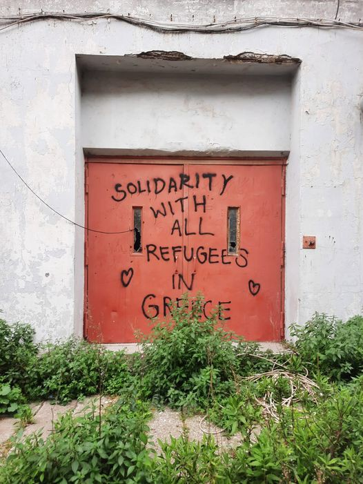

### AYS News Digest 27/5/22: Greek police shot with rubber bullets at two people — report
#### Increasing violence at EU’s external borders with pushbacks, racist treatment and violation of international laws and court rulings

#### Greece

Greek police forces are accused of having shot with rubber bullets at two Afghans trying to cross the border from Turkey\. As Daily Sabah [reports](https://www.dailysabah.com/politics/eu-affairs/greece-allegedly-used-plastic-bullets-against-migrants-in-aegean) , they have not been treated at a hospital\.

Reporter Giorgos Christides writes that 94 people were stranded on an islet on Evros river between Turkey and Greece\. Authorities neglected the orders of the European Court of Human Rights and the local prosecutor for more than five days\. Relatives stated that the group is now back in Turkey\. While the police said they did not find the group, the army showed a video with them\.

■■■■■■■■■■■■■■ 
> **[Giorgos Christides](https://twitter.com/g_christides) @ Twitter Says:** 

> > ! UPDATE: relatives report the group of 94 Syrians is back in Turkey. If so, authorities showed contempt for the @[ECHR_CEDH](https://twitter.com/ECHR_CEDH) and local prosecutor orders, failing to provide immediate medical help, food &amp; water even though they knew where the group was located. More  to follow 

> **Tweeted at [2022-05-27 08:17:11](https://twitter.com/g_christides/status/1530100792300081152).** 

■■■■■■■■■■■■■■ 

He further quoted a talk on Greek TV when deputy migration minister Sophia Voultepsi criticized the reporter for asking her about pushbacks and denied there had been any\. She added that the government does not care about what Brussels is saying\.

■■■■■■■■■■■■■■ 
> **[Giorgos Christides](https://twitter.com/g_christides) @ Twitter Says:** 

> > "There are no pushbacks nor have they ever been proven". The entire video is very enlightening and borderline entertaining, shame it's not subtitled. Another gem: "We don't care at all what Brussels is saying". Can be watched here: [avgi.gr/politiki/41599…](https://www.avgi.gr/politiki/415990_epathe-ntelirio-se-zontani-syndesi-poia-erotisi-tin-ekane-na-bgei-ektos-eleghoy) 

> **Tweeted at [2022-05-26 07:45:36](https://twitter.com/g_christides/status/1529730455049748481).** 

■■■■■■■■■■■■■■ 

The EU Commission has confirmed that Turkey is refusing to accept returns from Greece under the so\-called EU\-Turkey deal from 2016\. Turkey is demanding that Greece stop pushbacks along the border and Greece plans to revoke its decision to consider Turkey a Safe Third Country\. Minos Mouzourakis highlighted the statement on Twitter\.

■■■■■■■■■■■■■■ 
> **[Minos Mouzourakis](https://twitter.com/MinosMouz) @ Twitter Says:** 

> > 🇹🇷 refuses all returns from 🇬🇷 unless Greece:
- stops #PushBacks 
- revokes #SafeThirdCountry list

by @[EU_Commission](https://twitter.com/EU_Commission) COM(2022) 243, 24 May 2022
[bit.ly/3M6v9Nv](https://bit.ly/3M6v9Nv) https://t.co/bLN19x2g8S 

> **Tweeted at [2022-05-27 08:37:03](https://twitter.com/minosmouz/status/1530105792787013635).** 

■■■■■■■■■■■■■■ 

■■■■■■■■■■■■■■ 
> **[Mobile Info Team](https://twitter.com/mobileinfoteam) @ Twitter Says:** 

> > "We won't allow anyone to enter Greece illegally either from #Evros or through the #islands." - Civil Protection Minister Takis Theodorikakos. 

This manifests as systematic #pushbacks denying people their legal right to access asylum systems

#refugeesgr
[reut.rs/3lLn7i5](https://reut.rs/3lLn7i5) 

> **Tweeted at [2022-05-26 13:57:00](https://twitter.com/mobileinfoteam/status/1529823923788951556).** 

■■■■■■■■■■■■■■ 

Meanwhile, Europe Must Act [shared](https://www.europemustact.org/post/the-story-of-two-people-who-twice-were-pushed-back-to-turkey-and-prevented-from-claiming-asylum) the story of two people who claim to have been pushed back twice\. The first time, one of them was pregnant\.

The Racist Violence Recording Network \(RVRN\) [recorded](https://rvrn.org/en/press-conference-on-2021-annual-report/) 72 incidents of racist violence\. In 20 of these cases the perpetrators were law enforcement officials\. “Racially motivated police violence sees a growing trend in recent years”, the organization concludes\. It also demands constant vigilance on the part of competent authorities, as cases also appeared for example in schools\. Any trend of organized violence should be combatted\.

According to NoNameKitchen, eight people in Patras have been arrested by police\. They do not know when they will get out and fear being transferred to the Korinthos detention centre\.

■■■■■■■■■■■■■■ 
> **[NoNameKitchen](https://twitter.com/NoNameKitchen1) @ Twitter Says:** 

> > This last week has been tougher than usual for people on the move here in Patras. When we arrived at the places where people live we noticed that not all of the people were there. When we asked them what had happened and where the missing ones were, they answered “police, police” https://t.co/J8vhbrQjpJ 

> **Tweeted at [2022-05-27 12:16:08](https://twitter.com/nonamekitchen1/status/1530160924379820033).** 

■■■■■■■■■■■■■■ 

**Worth reading:**

\- [**The case of the Paros 3: How Greece is criminalising asylum seekers**](https://english.alaraby.co.uk/analysis/paros-3-how-greece-criminalising-asylum-seekers)
#### Sea

For almost two months, the aircraft of Sea Watch has not been allowed to fly\. The NGO demands authorities stop harassment and let them continue their work, which includes documenting pull\-backs by the so\-called Libyan Coast Guard and operations of Frontex\.

■■■■■■■■■■■■■■ 
> **[Sea-Watch International](https://twitter.com/seawatch_intl) @ Twitter Says:** 

> > Since the beginning of March, we have been unable to fly our aircraft. As a result, not only illegal returns by the so-called Libyan Coast Guard and operations by #Frontex remain undocumented. Also, our aircrew can no longer coordinate rescues by NGO ships. 

> **Tweeted at [2022-05-26 16:15:58](https://twitter.com/seawatch_intl/status/1529858893572079618).** 

■■■■■■■■■■■■■■ 

The Ocean Viking is still waiting for a response from maritime authorities concerning 296 survivors, including 49 minors\. The Red Cross has warned that insomnia and signs of exhaustion are becoming more prevalent\. According to IOM \(via [Infomigrants](http://www.infomigrants.net/en/post/40816/600-people-die-crossing-mediterranean-so-far-in-2022) \), up to 700 people have died already this year while attempting to reach European shores, which is the highest figure since 2014\. More than 4,000 have been returned to Libya\.

■■■■■■■■■■■■■■ 
> **[SOS MEDITERRANEE ITA](https://twitter.com/SOSMedItalia) @ Twitter Says:** 

> > Nonostante le numerose richieste alle autorità marittime, i 296 sopravvissuti della #OceanViking, tra cui 49 minori (il più giovane aveva 3 mesi) e 6 donne incinte, sono ancora senza soluzione per lo sbarco.
Per quanto tempo ancora vivranno un ritardo così inaccettabile? https://t.co/LVp7aqE9Us 

> **Tweeted at [2022-05-27 12:24:45](https://twitter.com/sosmeditalia/status/1530163095968133121).** 

■■■■■■■■■■■■■■ 

#### Spain

Twenty minors from Piniers IV have organized themselves this morning to go to the Minors’ Area of the Autonomous City of Ceuta with the aim of speaking with the person in charge of the area\. Users want to avoid closing the resource because, they say, this is now their home, according to El Foro de Ceuta \( [https://elforodeceuta\.es/la\-policia\-nacional\-dispersa\-a\-una\-veintena\-de\-menores\-de\-piniers\-iv\-que\-querian\-concentrarse\-para\-impedir\-el\-cierre\-del\-recurso](https://elforodeceuta.es/la-policia-nacional-dispersa-a-una-veintena-de-menores-de-piniers-iv-que-querian-concentrarse-para-impedir-el-cierre-del-recurso) \)

Meanwhile, “The Secretary of State for Migration, Jesús Perea, has advocated this Friday for looking with a “very long\-term” horizon in regard to the migratory phenomenon, since we must be prepared because it will be increasingly “less conjunctural” and “ more structural”, Europapress [reports](https://www.europapress.es/islas-canarias/noticia-secretario-migraciones-dice-hay-estar-preparados-porque-migracion-sera-cada-vez-mas-estructural-20220527141202.html) \.
#### Belarus

The Border Committee of Belarus reacted to a video showing Lukashenko’s security forces beating people\. The agency explained that Polish border guards allegedly sent a group of migrants to Belarus, arming them with gas canisters, stones and sticks\. In the footage it can be seen that they are the same people who were beaten up by the border guards\.

■■■■■■■■■■■■■■ 
> **[Belsat TV](https://twitter.com/Belsat_TV) @ Twitter Says:** 

> > @[CzabanPiotr](https://twitter.com/CzabanPiotr) 🔹Памежны камітэт РБ адрэагаваў на відэа, дзе лукашысцкія сілавікі збіваюць мігрантаў

У ведамстве патлумачылі, што польскія памежнікі нібыта спецыяльна накіравалі групу мігрантаў на тэрыторыю Беларусі, узброілі іх газавымі балончыкамі, камянямі ды палкамі. https://t.co/th0pQgJMAl 

> **Tweeted at [2022-05-26 10:10:16](https://twitter.com/belsat_tv/status/1529766861520441345).** 

■■■■■■■■■■■■■■ 

The No Borders Team reports on the 24th day of a hunger strike by ten Kurdish people in Lesznowola\.

Balkan Insight has [published](https://balkaninsight.com/polish-forests) an interactive long read about the situation in Polish forests near the Belarus borders\.

One more corpse was discovered in the Bialowieska forest\. Journalists managed to identify the man and talk about their investigation\.

In another investigation, The New Humanitarian [observes](https://www.thenewhumanitarian.org/news-feature/2022/05/26/Poland-borders-Ukraine-refugees-crackdown) that the number of crossing attempts is increasing again, as hundreds of people have been expelled from a temporary shelter near the border and want to try to get into the European Union as temperatures rise and the crossing seems safer\.
#### Bulgaria

Human Rights Watch has [documented](https://www.hrw.org/news/2022/05/26/bulgaria-migrants-brutally-pushed-back-turkish-border) 19 cases of pushbacks from Bulgaria to Turkey, despite the clear rulings of International Courts\. “Bulgarian authorities are brutally and summarily pushing back migrants and asylum seekers across the land border with Turkey,” said Michelle Randhawa, refugee and migrant rights officer at Human Rights Watch\. Beating, robbing, stripping and the use of police dogs have been reported\. The Helsinki Committee documented 2,500 pushbacks from Bulgaria involving almost 45,000 people in 2021, which is a rapid increase compared to the 15,000 people in 2020\. Frontex has deployed officers at the border\.
#### Serbia

NoNameKitchen reports on police violence at the Serbian — Hungarian border near Sombor\. Even dogs were used to bite, hurt and catch people trying to cross there\. A group of four people they found had bad injuries and wounds on almost all body parts\.

■■■■■■■■■■■■■■ 
> **[NoNameKitchen](https://twitter.com/NoNameKitchen1) @ Twitter Says:** 

> > VIOLENCE IN EUROPE AGAINST PEOPLE MIGRATING:
In these days at the Hungarian-Serbian border the Hungarian police is showing, again and frequently, another tone of the brutality and violence that the actual control of borders is able to putting in place. 

> **Tweeted at [2022-05-25 11:25:35](https://twitter.com/nonamekitchen1/status/1529423431019679744).** 

■■■■■■■■■■■■■■ 

#### Italy

Father Zerai, who inspired the Alarm Phone project, has been freed of accusations of aiding illegal migration\. He was investigated for five years\.

■■■■■■■■■■■■■■ 
> **[Alarm Phone](https://twitter.com/alarm_phone) @ Twitter Says:** 

> > Father Zerai, who inspired the Alarm Phone project, is no longer being criminalised! After a 5-year-long investigation, the charges of "aiding and abetting illegal migration" were dropped. Solidarity will win! @[AgenziaH](https://twitter.com/AgenziaH) 
[avvenire.it/attualita/pagi…](https://www.avvenire.it/attualita/pagine/don-zerai-cadono-tutte-le-accuse-dopo-5-anni-di-indagini) 

> **Tweeted at [2022-05-27 13:11:50](https://twitter.com/alarm_phone/status/1530174942540869633).** 

■■■■■■■■■■■■■■ 

With more than 3,500 children who have disappeared so far this year, more than 30 minors go missing every day in Italy\. Two\-thirds of them are foreign nationals, InfoMigrants [reports](http://www.infomigrants.net/en/post/40806/30-minors-go-missing-in-italy-each-day--with-the-majority-being-foreign-nationals) \. When it comes to finding them, more than 72 percent of the tracked children were Italians, for foreign citizens the success rate was just 31,17 percent; although this is a strong improvement from the 26,35 percent in 2021\. Authorities urge the public to call the emergency hotline \(112\), the hotline for missing persons \(in Italy: 116000\) or use the YouPol app immediately, as the first hours after the disappearance are crucial for tracking the cases\.

With a budget of **38 million euros per year** , Italy received the third biggest sum for research in artificial intelligence for border protection\. The scheme was implemented 15 years ago\. In a document entitled “A clear and present danger,” researchers from Statewatch have now [concluded](https://www.statewatch.org/media/3285/sw-a-clear-and-present-danger-ai-act-migration-11-5-22.pdf) that the AI act does not provide adequate safeguards on the use of the technology in this field\.

In Ventimiglia a new permanent center for migrants is set to open near the border with France, InfoMigrants [writes](https://www.infomigrants.net/en/post/40769/migrant-center-to-open-at-italianfrench-border) \. In the recent weeks about 90 people arrived in the town every day, hoping to reach French territory\.
#### France

Volunteers of the Calais Food Collective have reported new cases of intimidation by police forces\. Controls, fines, insults and manipulation are daily business for them, they write\. However, they want to continue their work\.

■■■■■■■■■■■■■■ 
> **[Calais Food Collective](https://twitter.com/CalaisFoodCol) @ Twitter Says:** 

> > Intimidation Policière : 

Ces clips vidéo sont un petit aperçu de ce que nous rencontrons au quotidien : contrôles d'ID et amendes, insultes verbales et manipulation du pouvoir

Ces tactiques ne fonctionnent pas. Nous continuerons à distribuer nourriture et eau dans tout Calais. https://t.co/PZ6XIOBK9d 

> **Tweeted at [2022-05-26 13:57:45](https://twitter.com/calaisfoodcol/status/1529824110980653063).** 

■■■■■■■■■■■■■■ 

InfoMigrants has [published](https://www.infomigrants.net/en/post/40724/terms-and-acronyms-that-asylum-seekers-need-to-know-in-france) a glossary of terms and acronyms asylum seekers in France should know to understand the complex system and the bureaucracy behind it\.

Some 200 people waited in detention rooms at the Marseille airport in 2021\. Le Monde is [describing](https://www.lemonde.fr/societe/article/2022/05/25/a-l-aeroport-de-marseille-une-zone-d-attente-non-acceptable-pour-les-etrangers_6127559_3224.html) them as **non\-compliant with current requirements** and focuses on the dire conditions of the rooms, which have been reported several times in the recent years\.
#### Denmark

With its racist asylum policy, the Danish government is putting Syrian women at risk of deportation, as it considers the capital Damascus as safe\. While young men face being drafted for military service and therefore are often not deported, this does not apply to elderly people and women\. The Guardian accompanied one young woman, who has managed to avoid deportation and extend her residency permit for two more years now\.

#### UK

Under the resettlement scheme, evacuees from Afghanistan remain stranded in hotels\. The Big Issue [states](https://www.bigissue.com/news/social-justice/afghan-refugees-scheme-stuck-in-hotel-home-office/) that housing more than **10,000 people this way costs the government around 1\.2 million pounds every day** \. Humanitarian NGOs criticize this as unacceptable and not suitable to the situation of the families\. One problem is that some of the hotels are far away from infrastructure and people cannot look for jobs or go to appointments with only one bus driving per day\.

Blogger Colin Yeo checked the migration transparency data, highlighting that only **5\.3% of cases were decided within six months** — in 2019 it was 26\.4%\. 36,000 have been waiting for more than one year\.

■■■■■■■■■■■■■■ 
> **[Colin Yeo](https://twitter.com/ColinYeo1) @ Twitter Says:** 

> > 1. Having a quick flick through the 'migration transparency data' released late yesterday after the main data stuff was published. Some bits that jumped out at me... [gov.uk/government/col…](https://www.gov.uk/government/collections/migration-transparency-data) 

> **Tweeted at [2022-05-27 08:59:43](https://twitter.com/colinyeo1/status/1530111495056547840).** 

■■■■■■■■■■■■■■ 

#### EU

Asgi recorded almost **2,000 pushbacks in Europe in 2022** so far at the EU’s external borders\.

■■■■■■■■■■■■■■ 
> **[ASGI](https://twitter.com/asgi_it) @ Twitter Says:** 

> > Respingimenti illegali alle frontiere dell’#UE: quasi duemila nel 2022. 
Con la guerra in Ucraina le persone hanno cercato protezione, con una solidarietà senza precedenti da parte degli Stati membri. Per migliaia di “altri” l’UE rimane irraggiungibile.
[buff.ly/3wPoym4](https://buff.ly/3wPoym4) https://t.co/aGmBY6aeFw 

> **Tweeted at [2022-05-27 15:51:02](https://twitter.com/asgi_it/status/1530215008180781057).** 

■■■■■■■■■■■■■■ 

**Find daily updates and special reports on our [Medium page](https://medium.com/are-you-syrious) \.**

**If you wish to contribute, either by writing a report or a story, or by joining the info gathering team, please let us know\.**

**We strive to echo correct news from the ground through collaboration and fairness\. Every effort has been made to credit organisations and individuals with regard to the supply of information, video, and photo material \(in cases where the source wanted to be accredited\) \. Please notify us regarding corrections\.**

**If there’s anything you want to share or comment, contact us through Facebook, Twitter or write to: areyousyrious@gmail\.com**

_Converted [Medium Post](https://medium.com/are-you-syrious/ays-news-digest-27-5-22-greek-police-shot-with-rubber-bullets-at-two-people-report-edd1ca7eaf5d) by [ZMediumToMarkdown](https://github.com/ZhgChgLi/ZMediumToMarkdown)._
