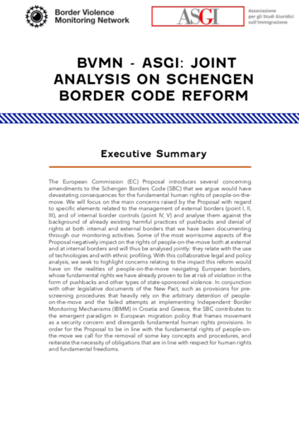
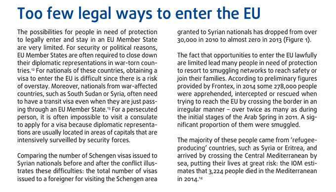

### AYS News Digest 1/6/2022: Schengen Borders Code challenged by joint report
#### **Deported from Turkey to Afghanistan //** Group trapped on Evros River island, again\. // Trapped in Ukraine Detention // Activist Freed from Western Sahara // Evacuations for Afghans from Pakistan // Deportation flight UK\-Iraq stopped // Too few legal routes to EU, EU report says
### FEATURE
#### Schengen Borders Code challenged by joint report

Proposals to changes to the Schengen Borders Code \(SBC\) have been challenged\. In a [joint report](https://www.borderviolence.eu/wp-content/uploads/BVMNASGIJOINTANALYSIS.pdf) by the Border Violence Monitoring Network and The Association for Juridical Studies on Immigration \(ASGI\), the impact of the changes have been analysed in detail\.

The failure of EU member states to have independent monitoring systems is seen as [an indication](https://www.asgi.it/allontamento-espulsione/riforma-del-codice-schengen/?fbclid=IwAR2mzyYluS42ee63m4ROyYV86Ojv7XsZx3oOpIpFOEk1APxmUeegLA0bQBE) of the way that some changes will be implemented\. Use of technology and racial profiling is also raised as having an impact on the movement of people at both internal and external borders\.

The changes to the SBC focus on keeping people out of the Schengen area\. The report authors seek to remind policy makers that there are obligations regarding human rights and fundamental freedoms\.

> “the SBC contributes to the emergent paradigm in European migration policy that frames movement as a security concern and disregards fundamental human rights provisions\.” [Joint Report](https://www.borderviolence.eu/bvmn-asgi-joint-statement-on-schengen-border-code-reform/?fbclid=IwAR2QLkEEtOOB4xNFEFWtpDES9hq2MfRgEBPHRhI99xLwZH2yRnr5CXXY_RE) 

The emphasis on what the realities of people\-on\-the\-move will face is at the heart of the report, which combines legal and political analysis\. [Read the full report here\.](https://www.borderviolence.eu/wp-content/uploads/BVMNASGIJOINTANALYSIS.pdf)
#### ALGERIA

[Expulsions from Algeria have continued in recent days](https://twitter.com/AlarmephoneS/status/1531568734426603520?fbclid=IwAR1xF2LhrTRK5GUM0S7LxOr_b9A_ecLCtwl2nDtosddK2LPr05pcKYqrJ2w) \. People from countries including Sudan, Senegal, Nigeria, Cameroon, Gambia, Mali and many other African nations are being deported from Algeria into the Sahara desert on foot\. Expulsions occur to neighbouring Niger due to a bilateral agreement between the two countries dating from 2014\.
#### TURKEY
#### Deported from Turkey to Afghanistan

People are being deported from Turkey to Afghanistan despite the unsafe conditions\. [The EU has been criticised](https://www.facebook.com/abdul.ghafoor.378/posts/pfbid0XendYQKZagb5Hp5h9ohEanhJQvNHqziF3watPCGkkmaZdTgJ3Pb1dz1wduk9Br7ol) for their deal with Turkey when they allow potentially vulnerable people to be sent to the Taliban\-controlled capital Kabul\.

[This fascinating article](https://www.middleeasteye.net/news/afghanistan-istanbul-kabul-flight-refugees-emigres-prepare?fs=e&s=cl&fbclid=IwAR1a-cLN6Tcn9CnM2rx8NMxxUJ9OK5jwiubtKokE9BQFCjpXZmCjkxDQAdI) , which documents conversations with those on a flight from Istanbul to Kabul, meets people travelling for different reasons\. One man to visit his home country after years living abroad, another to keep an NGO job as well as someone who was being deported against his will\.

Further to this, a [report has been published into human rights abuses relating](https://www.globaldetentionproject.org/turkey-joint-submission-to-the-committee-on-the-elimination-of-discrimination-against-women?fbclid=IwAR0f6NmDPGPRPTtAkw-EPd88fWvhfA6tw_eGmKTlOAUjSHPFtuZB8eMstrM) to those in detention in Turkey, with a particular focus on the treatment of women\. Submitted to the Committee on the Elimination of Discrimination against Women by Global Detention Project and International Refugee Rights Association, the report contains historical background regarding immigrants in Turkey, before assessing and discussing the situation for women both inside and outside of detention centres\.

> “the Committee noted concerns about the precarious and insecure living conditions for women refugees, both inside and outside the refugee camps, including deprivation of basic services and essential goods, education, economic opportunities, health care, clothing, food, heating and hygiene articles and increased risks of sexual and other forms of violence\.” [Joint Submission](https://www.globaldetentionproject.org/turkey-joint-submission-to-the-committee-on-the-elimination-of-discrimination-against-women?fbclid=IwAR0f6NmDPGPRPTtAkw-EPd88fWvhfA6tw_eGmKTlOAUjSHPFtuZB8eMstrM) 

[Read the full report, which includes recommendations, here\.](https://www.globaldetentionproject.org/turkey-joint-submission-to-the-committee-on-the-elimination-of-discrimination-against-women?fbclid=IwAR0f6NmDPGPRPTtAkw-EPd88fWvhfA6tw_eGmKTlOAUjSHPFtuZB8eMstrM)
#### BOSNIA HERZEGOVINA

A man has died in the Una River in Bosnia Herzegovina \(BiH\) \. The man from Afghanistan, identified as AK, was washing himself in the river when the accident occurred\. He had been trapped in BiH for more than two years, as Croatian border practices make reaching safety in the EU so difficult\. No Name Kitchen reports of how people responded to the tragedy\.

■■■■■■■■■■■■■■ 
> **[NoNameKitchen](https://twitter.com/NoNameKitchen1) @ Twitter Says:** 

> > A young person from #Afghanistan DIED IN EUROPE BECAUSE HE NEEDED TO SHOWER. #RefugeesinEurope

A young man drowned in the Una river in Bihac while he was washing himself. His name was A.K., and he has been living in Bihac for two years, stuck at this border on his way to Europe. 

> **Tweeted at [2022-06-01 13:22:07](https://twitter.com/nonamekitchen1/status/1531989471188721664).** 

■■■■■■■■■■■■■■ 

#### GREECE
#### Group trapped on Evros River island, again\.

[A group is once again trapped on an island in the Evros River\.](https://twitter.com/g_christides/status/1531687750965026817?fbclid=IwAR3W7XoLgAOI398s1TaKln-YVOtbFEDk4QDkCrlMFOarJRKrjt4cdvP8UlA) Members of this group also formed part of a larger group of 94 people from Syria who were trapped similarly for five days\. ECHR demanded that this group were assisted by Greek authorities, but they were [reported to have been returned to Turkey\.](https://twitter.com/g_christides/status/1530100792300081152)

[The trial of a Dutch journalist in Greece](https://balkaninsight.com/2022/06/01/dutch-journalists-trial-accused-in-greece-of-helping-an-asylum-seeker-was-set-to-start-today-but-postponed/?fbclid=IwAR09MJfeG704ru6o2gn0HiWNQ5RbpzZk2oaowK_z7mmi18MDPUqqiq4A-D0) has been postponed\. Ingeborg Beugel who has lived in Greece for 41 years, is accused of illegally housing an asylum seeker from Afghanistan\. The trial was due to begin on Wednesday\. Despite authorities being aware of the person staying with her, Beugal could face up to a year in prison and a large fine\. Her guest has since been granted asylum\.

Leader of the Opposition party in Greece Alexis Tsipras, [is visiting Lesvos\.](https://left.gr/news/ligo-prin-tin-anahorisi-gia-lesvo-syskepsi-gia-ellinotoyrkika-kai-oykraniko-ypo-ton-alexi?fbclid=IwAR0yZliSOlOwEO4uFDnIgXbFelwLaMg8rCPN6cX1YpfXqCe2Ps_L0gH1Xu8) He will make a speech at 1930 on Thursday 2nd June in the central square of Mytilene\.

The story of one man’s serious injuries in Patras has been [shared by No Name Kitchen](https://www.facebook.com/NoNameKitchenBelgrade/posts/pfbid0ETvBJT6mRP7jXdQBRHovbZcfhjS6xcEHjzjbLGK86ZgWTxYKgeBk5eDZfMGYshpKl) \. The man had been held by authorities for 7 hours without access to medical treatment, with two broken legs\.

Meanwhile, NGOs are finding it hard to access items to support people in Greece\. [Trucks with donated items are facing difficulty crossing the border](https://twitter.com/Refugees_Gr/status/1531737860658847744?fbclid=IwAR3IaU9Hyl6X4zL8FeeAhk-7qG1BzA_s_ePDhXYBvxP6gNKDlYDIXdFAKkA) from other European countries\.
#### UKRAINE
#### Trapped in Ukraine Detention

People remain detained in Mykolaiv detention centre at the Ukraine front line\. The European Court of Human Rights \(ECHR\) [have demanded the relocation](https://twitter.com/Nadia_Hardman/status/1530220985022140419?fbclid=IwAR3VV-RgusQYf3Nht1sGVt9lrOe0q4aLVhmsS1582QHXc120UunnhHnn_8w) of 8 people from the detention centre, where detainees have reported daily bombings from the Russian conflict in the vicinity of the centre\. Following [legal proceedings initiated by two detainees](https://twitter.com/daria_sartori/status/1528996062672965632?fbclid=IwAR0ywNaQmylf-dUacaOe5w2O6Lrc9paf4uXxCSuRf4bvyoWj45clVe8ySY0) , ECHR have demanded their release, however, other people remain locked up in Zhuravyhchi as well as Mykolaiv\.
#### POLAND

Children are continued victims of border practices in Poland\. [A photo of the withered and injured feet](https://twitter.com/MarGorczynska/status/1531967077308850177?fbclid=IwAR3O9r5nKBCB1bdNAP1bklxqi2DjyA0HlV1w3TTPJ0KgzezCNOLH1BBq6ck) of a 9 year old girl trapped at the Poland\-Belarus border has been shared for \#ChildrensDay
#### SPAIN

](assets/4b80ffed37aa/0*ADDHf-73m673m6Qu.jpg)

Photo Credit: [Shoah\.org\.uk](https://shoah.org.uk/sultana-khaya-moroccan-occupying-forces-intend-to-physically-eliminate-me/)
#### Activist Freed from Western Sahara

[Saharawi activist Sultana Khaya was evacuated from Western Sahara to Gran Canaria](https://twitter.com/TalebSahara/status/1532063648260452354?fbclid=IwAR09JqTJoEq6JfsMunmyTgmgE-OIk5vUwrxWc2d5no-PaJd8oqCOErBguc4) \. Thanks to the efforts of US activists, human rights activist Khaya was finally able to leave house arrest which had been imposed by Moroccan authorities following [her campaign for an independent Western Sahara](https://www.democracynow.org/2022/3/21/sahrawi_activist_sultana_khaya_house_arrest) \.

[Four boats in distress](https://twitter.com/alarm_phone/status/1531971246195351552?fbclid=IwAR0cJAabksLSkulo8qvbhMNQ2hgWaOB8fICKdPKgGQKLx9RfLMnKJ_5nCMg) were assisted to the Canary Islands, carrying approximately 150 people\. Another vessel, carrying 62 people including women and minors, was in Moroccan waters with [the navy due to respond](https://twitter.com/alarm_phone/status/1531971248623845376) \. There is yet to be confirmation of their safety\.

Some good news, thanks for generous support, the van of [No Name Kitchen in Ceuta has been fixed\!](https://www.facebook.com/NoNameKitchenBelgrade/posts/pfbid033jCXcPoWzoKzmn2Vff8wsrYCXfcRq4DM8aTQLp82Gk4v7zHmdEE5TcqAHZtxb3uLl)
#### GERMANY
#### Evacuations for Afghans from Pakistan

[200 Afghans are being evacuated to Germany every week](https://www.infomigrants.net/en/post/40887/german-government-says-it-flies-out-some-200-afghans-per-week-to-germany?fbclid=IwAR0dYvPQMlAeAkrn-vvB8hwr2Hx51klNTVOBfM3EOWk4j5bi4QmKr8LgqQE) \. It is claimed that approximately 200 men and women are being brought from Pakistan to Germany each week, with an additional 18,000 visas having been issued by embassies since August 2021\. Despite this, some people who were due to be rescued died before they were able to be evacuated\.

Despite these claims, reports of local workers who were employed by international organisations, but sometimes through sub\-companies, are being denied access to help has [been reported by Mission Lifeline Search and Rescue](https://mission-lifeline.de/ortskraefte-zuruecklassen-das-hat-methode/?fbclid=IwAR2milvC0yv2GRxtwos87hEJu3yn4hSGQJq0ru3wseUYCO32Lu-XPzmW7-w) , even those with legal training are finding it extremely difficult to apply for removal to a safe place\.

Life in Afghanistan is very dangerous for those [who previously worked for the Afghan authorities](https://twitter.com/PcpGiz/status/1530142645074464768?fbclid=IwAR28V179Pc2foD9sVXvIwgTIzqnTYCGx8w25ZqCvG6Yed4orZKYw7iYASoc) , with fake forms circulating attempting to gain information about the whereabouts of former workers\.

■■■■■■■■■■■■■■ 
> **[Axel Steier](https://twitter.com/Axel_Steier) @ Twitter Says:** 

> > ATTENTION! This is fake! The Taliban are behind it! #Afghanistan #Ortskräfte https://t.co/xvOVz3V4uN 

> **Tweeted at [2022-05-27 07:21:56](https://twitter.com/axel_steier/status/1530086886873649165).** 

■■■■■■■■■■■■■■ 

Once in Germany, the situation for people is still difficult\. An alliance of 57 organisations and associations has [criticised unequal treatment of refugees in Germany](http://news.ippnw.de/commonFiles/pdfs/Soziale_Verantwortung/Brief_Asylblg_Heil_final_layout.pdf?fbclid=IwAR0lw-NHMimnKVzVxbeEdfF8SkbCyJ9a8ZpcQfyM4npYwk5mvE3ecQU50mI) \. Access to medical care must be guaranteed without discrimination for all refugees, it says in an open letter to Federal Social Minister Hubertus Heil \(SPD\) published in Berlin on Wednesday\. The background is a decision by the federal government, which guarantees refugees from Ukraine entitlement to social benefits and thus also to necessary health services\. The regulation is effective from June 1, 2022
#### UNITED KINGDOM
#### Deportation flight UK\-Iraq stopped

A flight to deport [up to 30 people to Iraq was cancelled](https://www.rudaw.net/english/world/31052022?fbclid=IwAR3xoU80qFOjMwtNkLJVmosJo7Jz41n2gLlugSofqPMykAIz5oAQA-mUp1s) \. The flight from the UK to Erbil in the Kurdish region of Iraq, was due to transport people who had been seeking asylum in the UK, some of whom had been there for years\. No reason was given by the UK Home Office, but the flight had drawn heavy criticism from both Kurdish and British communities\.
#### EU
#### “Too few legal routes to EU”, EU report says

There are too few legal ways to enter the EU\. In a report by the EU Rights Agency, legal routes to safety are examined, with the conclusion that practical realities to accessing visas by people needing protections are vast\. Without legal methods to reach safety, people are forced to resort to smuggling networks, putting their lives at risk at high financial cost\.

[The full report, with detailed background, is available here\.](https://fra.europa.eu/sites/default/files/fra-focus_02-2015_legal-entry-to-the-eu.pdf)

Photo Credit: [EURightsAgency via Twitter](https://twitter.com/MarGorczynska/status/1531920888303702022?fbclid=IwAR34-_hygiud_xi-1Nm5P7fXcDf00L-mcTTBbZdPrnSXZPwI2DMtpOBJ5E8)
#### FURTHER INTEREST

[Global Detention Project Annual Report](https://www.globaldetentionproject.org/global-detention-project-annual-report-global-tools-local-impact?fbclid=IwAR0Pv1EOhRwaFGHaIIh3geFqQJxorhjADcGSL2wyje-SNYGBuk9s1UBrkrM) — in an unprecedented year of world events, GDP have provided training sessions, reports and collaborations\. Have a read of their annual report\.

Claiming asylum in Greece is a minefield of bureaucratic practices\. [Here’s an explainer of some of the terminology used\.](https://www.infomigrants.net/en/post/40789/terms-and-acronyms-that-asylum-seekers-need-to-know-in-greece?fbclid=IwAR1bar0FBNDJjmt7eaTVdYx36ZPExridPVLGVxpo0MJSrRqZs-pphHqyP5s)

**Find daily updates and special reports on our [Medium page](https://medium.com/are-you-syrious) \.**

**If you wish to contribute, either by writing a report or a story, or by joining the info gathering team, please let us know\.**

**We strive to echo correct news from the ground through collaboration and fairness\. Every effort has been made to credit organisations and individuals with regard to the supply of information, video, and photo material \(in cases where the source wanted to be accredited\) \. Please notify us regarding corrections\.**

**If there’s anything you want to share or comment, contact us through Facebook, Twitter or write to: areyousyrious@gmail\.com**

_Converted [Medium Post](https://areyousyrious.medium.com/ays-news-digest-1-6-2022-schengen-borders-code-challenged-by-joint-report-4b80ffed37aa) by [ZMediumToMarkdown](https://github.com/ZhgChgLi/ZMediumToMarkdown)._
