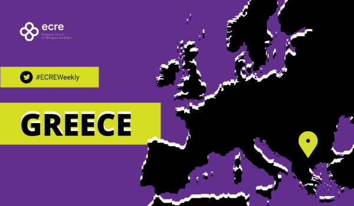
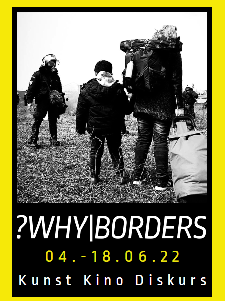
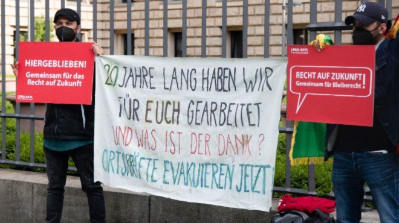

### AYS News Digest 3/6/22: UK insists on the Rwanda plans, in spite of clear data and hunger strikes
#### UK takes in fewer Ukrainians per capita than most of Europe / on the neglected and ignored inhumane practice for people returned to Niger — a report / Greece ignores interim measures, while the surveillance system only sees people to deter, not to rescue / Hungary convicted, but will that change anything?

Racism lives well in the EU, with thousands of people suffering discrimination at every step, both in formal and informal life situations\. Police racial profiling in buses, streets and other places across the EU Member States is a common story we hear every day…
#### FEATURE

UNHCR considers that a clear majority of those recently arriving in the United Kingdom by boat are likely to be refugees\. “ [Refugees](https://www.theguardian.com/world/refugees) and asylum seekers are not, and should not be described as, ‘migrants’,” the Agency’s spokesperson said to the [media](https://www.theguardian.com/uk-news/2022/jun/02/clear-majority-of-people-crossing-channel-are-refugees-says-unhcr?CMP=Share_iOSApp_Other&fbclid=IwAR20bJvXHHtQEFc42_mE-Gm-KUdDv499iTp1iEOtSNtZ4ruSrdn0_Jpcuak) \. However, the government insists on its plans\.

This week, Home Office staff are sending out the first formal removal letters to people who have arrived in small boats, warning them they will be sent 4,000 miles away to Rwanda\. The first plane is supposed to leave the UK for the east African state in two weeks\.

Several asylum seekers are undergoing a [hunger strike](https://l.facebook.com/l.php?u=https%3A%2F%2Fwww.bbc.com%2Fnews%2Fuk-61676961%3Ffbclid%3DIwAR05Ht-5IQeBJOI59ul5QSfpsdqCVURMjB_Rc0STnQMVYe5Cck-T2tK9ypI&h=AT0FKgYDJr1F0Q6y2Rtufr30vHdaIj0dPZac5SNhbXY0MqiSHIx7T0Ol4IWRH-CBKqPnyqLglpLzjm5sHTJ6W4_HxohlGvc9y5jjYDjN7aPpiqystduL2wUrK2N9qfJZr-NQSlCPekv6AA&__tn__=R]-R&c[0]=AT2AeEx1ljK5EDchGk1TB4qTCzFVvHOqq5nQm-V2Lgph1zy7ewexMcx5IanFVEPQpCrxumKn_WRrAZafFwLz3YzKp_d8WdkFHlMfzv-bo21cbph_YD_7Nq5_E3gyrNJnn-5FkgJ_Q1ceTwA2aW86xqX4VXpOwRa_75WetV9ezaa5wGZl_g8NYeDDURMBkigChhBn4M7eexGW) to protest the plan to deport them and others to Rwanda\.

■■■■■■■■■■■■■■ 
> **[Emir Nader](https://twitter.com/EmirNader) @ Twitter Says:** 

> > RWANDA DEPORTATIONS: 
On Tuesday, Priti Patel announced the first deportation flights to 🇷🇼 will depart 14 June. 

The following day, detained asylum seekers, inc Syrians, received letters notifying they'll be on first flight.

We managed to speak with them &amp; see their letters... https://t.co/2aLbqFtLu7 

> **Tweeted at [2022-06-03 10:30:12](https://twitter.com/emirnader/status/1532670981642256384).** 

■■■■■■■■■■■■■■ 

At the same time, the situation with receiving Ukranians is not much better either, unlike what one would expect with all the flags and open signs of solidarity, at least in the public eye\.

The figure of 10 Ukrainian refugees per 10,000 members of the population is the lowest but one out of 28 European countries\. Hundreds of Ukrainian families have chosen to withdraw their applications to come to the UK because of the delays in visa applications\. Poland has admitted the highest rate of Ukrainian refugees of any EU country, taking in 957 refugees per 10,000 members of the population\.

“The UK also fares poorly in comparison with countries that publish only the number of applications for protection or asylum\. Denmark and Finland, for example, have received roughly twice as many applications as the UK visa schemes per capita,” writes the [Guardian](https://www.theguardian.com/uk-news/2022/jun/03/uk-takes-in-fewer-ukrainians-per-capita-than-most-of-europe?fbclid=IwAR3Le1XFjP6UsRzDIHiH7z3l1RFOi1ZBdR5bQDzkRLdJ00WS7iSwjBOriOw) \.
#### NIGER
### Neglected and ignored inhumane practice for people returned to Niger

As we [reported](ays-news-digest-14-3-22-discrimination-of-the-stateless-people-fleeing-ukraine-indicative-of-the-afca05582e69) earlier, violence, starvation and adverse living conditions are reported by deportees from Algeria to the camp of Assamaka in Niger\. On February 7 alone, **1269 people were deported and faced with inhumane treatment and brutality** by the Algerian authorities\.

Now, another arrival of an official expulsion convoy in Assamaka with 781 Niger nationals has been reported\. The official expulsions from Algeria to Niger take place on the basis of a bilateral agreement signed in 2014\. The Algerian state also takes advantage of this to expel numerous nationals from other countries, especially from Sub\-Saharan Africa, in “unofficial” convoys, Alarmphone Sahara warns\.

MSF has issued a report on the inhumane treatment so many people are experiencing in Niger\.

> From January to May 2022, MSF recorded 14,196 migrants expelled from Algeria, including 6,749 non\-Nigeriens\. Some 139 of these migrants were women, and 30 were minors\. Approximately two thousand migrants are expelled from Algeria and Libya every month on average, including people with severe injuries, rape victims, and people suffering from serious trauma\. Upon expulsion, these migrants are abandoned in the middle of the desert at the Algerian\-Nigerien border, at a place called “Point Zero”, 15 km from the town of Assamaka\. 

Find the entire report [here](https://msf.lu/en/news/all-news/msf-denounces-inhumane-treatment-of-migrants-turned-back-from-algeria-and-libya?fbclid=IwAR39_Dbdu7qq_wIycJhbxhbCQhyNMb40ObOG9uB5Sdgzv30LLNe1Sa12dRI) \.
#### GREECE

_The ongoing crackdown on NGOs and criminalisation of solidarity continues at full speed\. While denying pushbacks amid new reports of incidents, the Greek government announces having “blocked” 40,000 people from arriving in the Evros region in the first four months of 2022\._

See what else ECRE reported in their Weekly report, this time on [Greece](https://ecre.org/greece-crack-down-on-ngos-and-criminalisation-of-solidarity-continues-government-announces-blocking-thousands-of-arrivals-in-evros-amid-new-pushback-reports/) \.

### People still trapped in the Evros border area

Out in the open, facing the Greek bank of the Evros\. This is where many people often end up, and another group was reportedly left to spending nights sleeping rough\. In spite of the decision saying,

“the applicants should not be removed until further notice and be provided with food, water and adequate medical care as needed”\.

■■■■■■■■■■■■■■ 
> **[Giorgos Christides](https://twitter.com/g_christides) @ Twitter Says:** 

> > This is the decision about the group by the European Court of Human Rights @[ECHR_CEDH](https://twitter.com/ECHR_CEDH) dated June 1st &amp; ordering Greek authorities that "the applicants should not be removed until further notice and be provided with food, water and adequate medical care as needed" @[hellenicpolice](https://twitter.com/hellenicpolice) https://t.co/4l5KWI13on 

> **Tweeted at [2022-06-03 10:53:29](https://twitter.com/g_christides/status/1532676843891040257).** 

■■■■■■■■■■■■■■ 

However, now the police cannot find the people whose geolocation and other details are being sent to all the actors running the border regime:

■■■■■■■■■■■■■■ 
> **[Giorgos Christides](https://twitter.com/g_christides) @ Twitter Says:** 

> > @[[hellenicpolice](https://twitter.com/hellenicpolice)](https://twitter.com/[hellenicpolice](https://twitter.com/hellenicpolice)) @[ECHR_CEDH](https://twitter.com/ECHR_CEDH) The @[[hellenicpolice](https://twitter.com/hellenicpolice)](https://twitter.com/[hellenicpolice](https://twitter.com/hellenicpolice)) say they can't find them. Was also told @frontex officials took part. In the hope of assisting them, this is a screenshot I took from a video call I just had with the group showing (again) where they are. And this is their geolocation: [goo.gl/maps/k96MDcWrS…](https://goo.gl/maps/k96MDcWrSPE9UGWW6) https://t.co/alK9o8Cypp 

> **Tweeted at [2022-06-03 18:04:02](https://twitter.com/g_christides/status/1532785193991516166).** 

■■■■■■■■■■■■■■ 

As Lena K\. also noted, “there is also an automated border surveillance system in the area — cost 15,049,567\.73 €, EU contribution 11,287,175\.80 € — but it looks like it can only see people to deter, not to rescue\.”
#### CYPRUS
### The tragic death of a young Syrian

The body of a Syrian man who drowned at sea was found, as more people arrived in Cyprus from Turkey\. People arrived in the morning in the Lara area in Paphos, 43 of them\. Upon their arrival, they told the port police that a person was missing at sea, and after searching for him, he was found dead\. The young man is of Syrian nationality and was 24 years old\.

The body was taken to Paphos General Hospital, and two people were [reportedly](https://www.infomigrants.net/en/post/40958/one-dead-off-cyprus-as-more-than-40-syrian-migrants-arrive-from-turkey?fbclid=IwAR0MhUszBzaZA8NKui6yx9HUGW8qfymxjfd_TzNYyt_W2BFTYJy-6mkkZ5U) taken to the hospital due to shortness of breath\.
#### HUNGARY
### Convicted of inhuman and degrading treatment

The European Court of Human Rights \(ECHR\) has convicted Hungary of the inhuman and degrading treatment of an Iraqi refugee family\. The family in question was detained in the transit zone between Serbia and Hungary for more than four months in 2017\.
In the decision, the use of handcuffs and leash on an asylum seeker was said to amount to inhuman and degrading treatment\.

The [decision](https://hudoc.echr.coe.int/eng-press?fbclid=IwAR0VfBMc6AmoyCeOK_OlffoT64x9v5x8se3aV6f1o8-cTzloh1mBko0aFeU#{%22itemid%22:[%22003-7350917-10039000%22]}) says that there had been:
- a violation of Article 3 \(prohibition of inhuman or degrading treatment\) of the European Convention on Human Rights on account of the conditions the mother and children had faced during their four\-month\-long stay in the transit zone\.

The Court also considered that the use of handcuffs and leash on the father when accompanying his wife to a hospital appointment had not been justified\. In addition, it held, unanimously, that there had been:
- a violation of Article 5 §§ 1 \(right to liberty and security\) and 4 \(right to have lawfulness of detention decided speedily by a court\) of the Convention because there had been no legal basis for the family’s detention, and they had not had any way of having their situation examined speedily by a court\.

#### FRANCE

A press release was issued by multiple organizations in Northern France regarding fines and warnings given to them by the police as a means of constant pressure on the human rights defenders in the field:

■■■■■■■■■■■■■■ 
> **[Human Rights Observers](https://twitter.com/HumanRightsObs) @ Twitter Says:** 

> > Au moins 130 verbalisations dressées envers les membres d'HRO et d'@[Utopia_56](https://twitter.com/Utopia_56) sur les différents confinements, ou près de 20000€ d'amende.
La raison ? "Déplacement illicite", malgré des attestations de déplacement.

Le communiqué de presse qui résume tout⬇️
#SolidaritéEntravée https://t.co/T0rJ4RSIY4 

> **Tweeted at [2022-06-02 15:45:10](https://twitter.com/humanrightsobs/status/1532387856790048768).** 

■■■■■■■■■■■■■■ 

#### ROMANIA

The Romanian Coast Guard has intercepted a fishing boat with dozens of people arriving from Turkey\. The boat was intercepted early on Thursday morning, according to [reports](https://l.facebook.com/l.php?u=https%3A%2F%2Fin.investing.com%2Fnews%2Fromania-intercepts-over-50-migrants-in-fishing-boat-off-black-sea-coast-3226367%3Ffbclid%3DIwAR3ck33e35m4vPIWrVIrj5eOcsf0pf-eRG_xBXJYrgrjDQ_ABmNFOO9ZaeY&h=AT1pe6zPTK_X-OXu_mBzUdPR8Trb3w4ScTTS8rKqIPeZd61nGQhwPrzcGY248wkVQCkXubHO-mL6kruNMl8iQTkQGohxm-08KdoZwaf5ps8hlEGl3T98SnMLFK15WWxONFu4Sx2Ku8SJHw&__tn__=R]-R&c[0]=AT0IldlIGtnu2yt490MWp60PtqJz6Ufwwg9MVCJomQUsSXU2cIeODxwQAigVYBgllQn_kFSl6HpS6eir7__cHyZGsEQwAWEDdOfcp6vLR3XJSGsspTAGoP6EFErQ5qEF0jwMo7-3Ob7jA2aYpXdy4eLXiKGgM7Q-SeI4QGLGBD7NnWmfuyU7XEAjxK1CnVAm53mgIDwpqIyb) \.
#### GERMANY

Arash Hampay’ photos are presented at an exhibition in Munich — opening this Saturday 04\.06\.

AK49 has organized the touring exhibition ?WHY\|BORDERS in cooperation with the Bellevue di Monaco in Bahnwärter Thiel, Munich\. At the same time, a supporting program with open\-air cinema and panel discussions will take place at various venues\.

In a **panel discussion** on **Open borders for all?** Parwana Amiri \(artist and author _Letters from Moria_ \), Volker Heins \(political scientist and author of the book _Open Borders for All: A Necessary Utopia_ \), Lara Milena Brose \(filmmaker and activist\) and Arash Hampay \(artist and founder of ?WHY\|BORDERS\) will take part in the discussion\. The event will be moderated by Hanna Hocker \(AK49, organizer ?WHY\|BORDERS\)

When searching through our archive of News Digests, you can find a timeline of reporting on Arash, and to see more about his story, see also:

[](https://l.facebook.com/l.php?u=https%3A%2F%2Fwww.dw.com%2Fen%2Firanian-asylum-seeker-faces-racist-threats-for-helping-migrants-in-greece%2Fav-50931497%3Ffbclid%3DIwAR3ck33e35m4vPIWrVIrj5eOcsf0pf-eRG_xBXJYrgrjDQ_ABmNFOO9ZaeY&h=AT0u7jNnemMg1fKHGBaZtCspepodVUGxSMBM8KAL-mlDs2fyad_SjBK5Y6_BZW52y6KWL9jAgTyRY5C3TPzMiov_gWZi9Rx4JCdS2J-5p7k8ryoNTbSXjOwpG9hU89oUI1zb2Oh4pZLfPg&__tn__=R]-R&c[0]=AT2fGrRlk966AbZz85Y1uvELduXBHhPbVm5qbwMPd6NFYobC3ZKt8nP2WMcaa7MJ2tNYlyJLb1-Qe0c4oDzLpJzVSsCRnQcn-ixV5PYPMGE7aEPAZWJ6d2tMk5wWa2aY9RCsr9v_7fm1zunWS_8BS-BAxr_qaoSNPd9My2DTeMCmSzJDu1_zMO-6K5D99ZBZh9fft_cYGdaj)

### Policy concerns on federal level

On the occasion of the conference of the interior ministers and senators of the federal states and the federal government from 1 to 3 June 2022 \[in WUERZBURG\], PRO ASYL presents below the currently most important refugee policy concerns that fall under the responsibility of the federal states\.

Too many people at risk do not fall under the narrow criteria of the [promised admission](https://www.tagesschau.de/inland/innenpolitik/afghanistan-ortskraefte-deutschland-101.htmlhttps:/www.tagesschau.de/inland/innenpolitik/afghanistan-ortskraefte-deutschland-101.html) \.

Pro Asyl says that according [to plans by the Federal Ministry of the Interior,](https://www.spiegel.de/politik/deutschland/geplantes-rettungsprogramm-innenministerium-haelt-aufnahme-von-hoechstens-5000-fluechtlingen-pro-jahr-aus-afghanistan-fuer-machbar-a-1196e666-3ff1-4458-9cda-609837e391ab) a maximum of 5,000 Afghan refugees are to be brought to Germany each year as part of a federal admissions program\. “Since this also includes family members of people at risk, the federal admissions program would probably only cover 1,000 people at risk\. There are also problems with the recognition and rescue of local workers, the [family reunification from Afghanistan](https://www.proasyl.de/news/familiennachzug-wenn-die-mama-tausende-kilometer-weit-weg-ist/) and the quick acceptance of admission for high\-risk individuals,” they [claim](https://www.proasyl.de/news/pro-asyl-stellt-forderungen-an-die-konferenz-der-innenministerinnen-der-laender/?fbclid=IwAR3gnvaMOYQ_8AOf7gX2a8CkK8eGBTWxsnFS3qmmYiBT6SBy_MoxT79OUSk) \.

Photo: PRO ASYL / Jonas Bickmann
#### ICELAND

Iceland intends to deport about 200 asylum seekers, including a man with a physical disability, according to media reports\. Several organizations are protesting the plans to send people back to countries where they may face persecution or poor and inhuman living standards\. The law might be on their side, InfoMigrants [write](https://l.facebook.com/l.php?u=https%3A%2F%2Fwww.infomigrants.net%2Fen%2Fpost%2F40971%2Ficeland-planning-to-deport-200-asylum-seekers--despite-widespread-protest%3Ffbclid%3DIwAR3ck33e35m4vPIWrVIrj5eOcsf0pf-eRG_xBXJYrgrjDQ_ABmNFOO9ZaeY&h=AT2C1k1CSYdkRa1AC83BwxXAkq6RSRExsVGS-tZ0eAB67z6sKC2SCVva2P-j-Nxv3J1a2tZPLNGn2Fhw9QqAKBTXJjrO1n1oqWMX1VSVGyz8hVabwEok-z1WtSujDiuYhcAt-ELH5XiKFg&__tn__=R]-R&c[0]=AT2RC2tGXNnhE7NxTRUWq0F581d0h9fYT451QM2jCbJPP-5buTkZIN207aPIZO5pGbya4d8XVdiVzanD3ahtbR__ZQ0VP1D5YvOyrcbXRvXpP93YIB8TaxIc1Ar0kZYSQArb1w9XPII4o3WwOPkth2ri7_-QsfesaYNWqc8OU4hCflm7-M_Jad3NjSdkRyBkf7R_0K4UX3Zo) \.
#### BELARUS

A woman died on the Belarusian side, near Usnarz Górny, as reported on May 11\. Many people had reportedly been trying to find her for several weeks\. There was no contact with her, but now, sadly, her death has been confirmed\.

■■■■■■■■■■■■■■ 
> **[Piotr Czaban](https://twitter.com/CzabanPiotr) @ Twitter Says:** 

> > Tu znaleziono ciało naszej mamy - informuje syn ponad 50-letniej Syryjki. 
Według rodziny, kobieta zmarła po stronie białoruskiej, niedaleko Usnarza Górnego.
 Od kilku tygodni wiele osób próbowało ją odnaleźć. Nie było z nią kontaktu.
Dzisiaj rodzina potwierdziła śmierć kobiety. https://t.co/4jps1c9igS 

> **Tweeted at [2022-06-02 09:34:53](https://twitter.com/czabanpiotr/status/1532294672344817664).** 

■■■■■■■■■■■■■■ 

In the meantime, the Polish border guards are openly reporting on their consistent pushbacks:

■■■■■■■■■■■■■■ 
> **[Straż Graniczna](https://twitter.com/Straz_Graniczna) @ Twitter Says:** 

> > W dn.01.06 na terytorium🇵🇱próbowało nielegalnie przedostać się z🇧🇾8 os.-m.in.ob.Jemenu,Sudanu
Zdarzenia miały miejsce na odcinkach #PSGNarewka #PSGBiałowieża
Dziś #PSGDubiczeCerkiewne grupa 20 os. próbowała przekroczyć granicę,przeszło 5 os.-zatrzymane,pozostali wycofali się do🇧🇾 https://t.co/dCD9CqyvXp 

> **Tweeted at [2022-06-02 06:33:15](https://twitter.com/straz_graniczna/status/1532248964300513280).** 

■■■■■■■■■■■■■■ 

#### WORTH READING

[](https://l.facebook.com/l.php?u=https%3A%2F%2Fwww.koraki.org%2Fpost%2Fthe-sound-of-greeces-summer-its-turkeys-fault-part-one%3Ffbclid%3DIwAR2zaNRW7-ASIB-K7I1wiFnJ7ar8rcPGZHNPOtBgP4AJtYIhnqTJGZMg2Xk&h=AT3SbmJknaGuJXA-6Ctz6Hq4wT9DwSByNCyLyenW8gNNBjLQJyFP-VFy4Cp4fV5TBDwT_I6CDzBdzJqH1jLPKfqXXYC-fRZnnR046nohKVj3OC2DaSGE6raSeTNh8_6Se79EVEUnjb4jlQ&__tn__=R]-R&c[0]=AT2FoTFEKV9apG4nXINwscpQDGocKj6GIkHFg4UBWmcPSUGrKdKyIfxVaUemCJLuSe5y5-0ccDVO6NzVKHFx3aCd8e1e7Ezg0b9qDBdAkJdOZLl8b9oo0TQvYaHt_xqYJFvufj15iv1KJv4yRKPPVNYSYkcxoodTH2FhkK2JzJXuqVlTMIQxJXLr8IxyZy94axD9-jTkAksi)

- Since 2011 Italy has faced an extraordinary increase in migrant arrivals, mainly from the Mediterranean route, one of the world’s most dangerous journeys\. The purpose of the present article is to provide a comprehensive picture of the migrants’ health status in the “T\. Fenoglio” centre, Settimo Torinese

[](https://l.facebook.com/l.php?u=https%3A%2F%2Fglobalizationandhealth.biomedcentral.com%2Farticles%2F10.1186%2Fs12992-022-00846-0%3Ffbclid%3DIwAR3Le1XFjP6UsRzDIHiH7z3l1RFOi1ZBdR5bQDzkRLdJ00WS7iSwjBOriOw&h=AT2pPJ8bUHzwu7wEWbBfPzc3GLANIPm2Oy0WtfH88sKmUMTTZV-UGqp6iil0Z4n84jnzUDdG9eey1MAEppaUxl3o_wtT9-hR-XZMt8dHthRDxAuMgvGhCWfzdxyvOIHGCLPgM0Zo8XL72XL7uLCujiil2FLdCw&__tn__=R]-R&c[0]=AT1XRI2eMdwjjo0-EFuz7-R6laqd1FNqJyiCYVVAXekJ5ntJMdxBKSgymQEfyddc4jgIVvzgW6onp8XkBdtElSrHfqfKynKycBqa2_SGUMURFNoHODtKbC4mzrrT_vDoMiqj6i_t5xTEAq0JvLlBtrp7t7QEIKSuvOHl-lrwAuLr1CVmLJ9kuYVrxERv_lHvftlBzwpbrc-H)

- “The idea of a new European migration policy was floated by Italian Interior Minister Luciana Lamorgese during an interview ahead of the Med5 summit that gathers Italy, Spain, Greece, Malta and Cyprus\.”

[](https://l.facebook.com/l.php?u=https%3A%2F%2Fwww.euractiv.com%2Fsection%2Fpolitics%2Fshort_news%2Fitalian-minister-raises-idea-of-new-european-migration-policy%2F%3Ffbclid%3DIwAR1JByETVH1cNVpjzNHBJwPjhqM2XJKX6gejjzLBab7rEcjwdQWqzhKLFZg&h=AT2AsZ-uC3mZiYVgs8fzi5Bb_9hv0tihnJVowHZ1VkDCAhM6yLa8Dza088m1BYpVkvlWBnVjIlxwF9LwTbRDAtla7j44DKcKybFw31HvEzxhGwvhZmgzUBw_q8PQoGOQw_beDW7zP2msBRHsniCBfqx2KuGazQ&__tn__=R]-R&c[0]=AT1XRI2eMdwjjo0-EFuz7-R6laqd1FNqJyiCYVVAXekJ5ntJMdxBKSgymQEfyddc4jgIVvzgW6onp8XkBdtElSrHfqfKynKycBqa2_SGUMURFNoHODtKbC4mzrrT_vDoMiqj6i_t5xTEAq0JvLlBtrp7t7QEIKSuvOHl-lrwAuLr1CVmLJ9kuYVrxERv_lHvftlBzwpbrc-H)

- ECRE weekly bulletin:

[](https://l.facebook.com/l.php?u=https%3A%2F%2Fmailchi.mp%2Fecre%2Fecre-weekly-bulletin-03062022%3Fe%3D5105b82624%26fbclid%3DIwAR0gSutAlXOZWBpt_cKSZV-7yNlwOSAGXyqmfLvd7m1XUPMOga3TkSZzmSI&h=AT1cJx4MWh-SnklYNDt8eh7OgKCLcgNnXeK0BRZrYRlq9ruJJ2XHhBns3PCbCiYZadLI6uIVusA7DIoNdU54VKm_toD5foT6D5AM1t1plBSRN66jTtJ-J7jiJ-mQ4nJNgFnj4_1lnxPFqg&__tn__=R]-R&c[0]=AT2W_YJdlOpKYliLY5yYFVaTP7xDaZGuFOvKSQO5PJg9qG9IGFMx7QwxN2h-MIXSdH8tkeQDLvd-EhBCFw5jI9A0OfCNWb2uvqL2FBk4SfsS4CEr3dqdri7NRNG9cuYjC5PEXrK158bD6NoaJhR9I-LrhASrK0ovoEuKdh5PK2exXZ4zWdHwngtb8z3leID4bi0tVwO6sZGr)

**Find daily updates and special reports on our [Medium page](https://medium.com/are-you-syrious) \.**

**If you wish to contribute, either by writing a report or a story, or by joining the info gathering team, please let us know\.**

**We strive to echo correct news from the ground through collaboration and fairness\. Every effort has been made to credit organisations and individuals with regard to the supply of information, video, and photo material \(in cases where the source wanted to be accredited\) \. Please notify us regarding corrections\.**

**If there’s anything you want to share or comment, contact us through Facebook, Twitter or write to: areyousyrious@gmail\.com**

_Converted [Medium Post](https://medium.com/are-you-syrious/ays-news-digest-3-6-22-uk-insists-on-the-rwanda-plans-in-spite-of-clear-data-and-hunger-strikes-750f1ebf638c) by [ZMediumToMarkdown](https://github.com/ZhgChgLi/ZMediumToMarkdown)._
