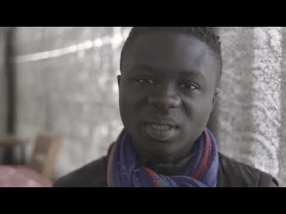
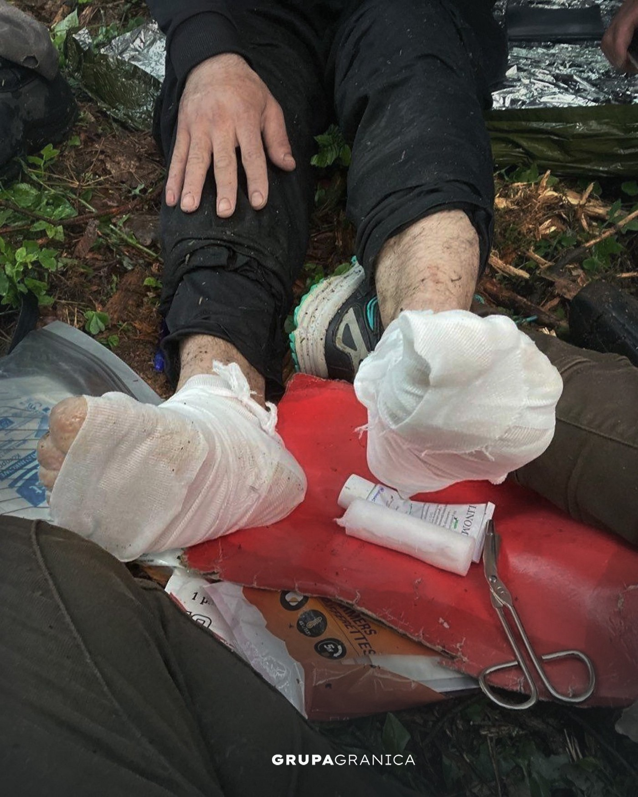
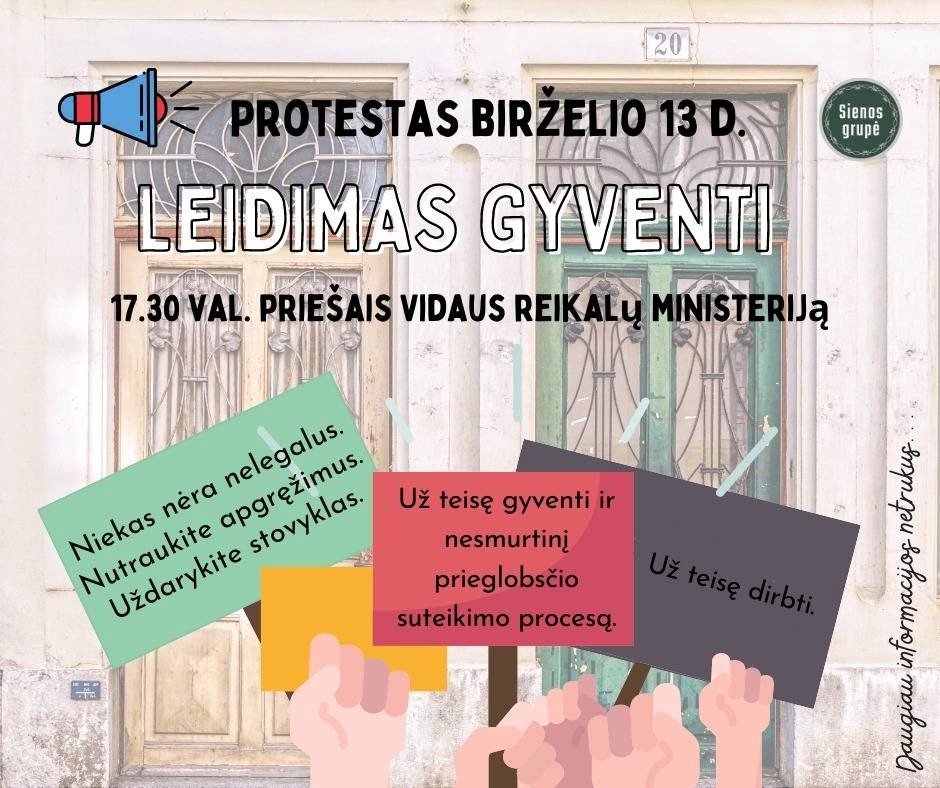

### AYS News Digest 10/6/22: Immediate evacuation from the Evros islet is a matter of urgency
#### MSF calls for the respect of human dignity in border control / New ‘camp’ on Lesvos in the “worst location possible to build the camp“ / ECRI calls out Denmark for anti\-Muslim policies in the country and recommends changes / Poland: Provincial Administrative Court in Warsaw overturned the ruling by the Border Police /

](assets/d8cafc5c05a7/0*rHJ_tQOWeHBCElkn.png)

Via [AlarmPhone](https://alarmphone.org/en/2022/06/10/alarm-phone-demands-immediate-evacuation-of-refugees-from-a-small-islet-in-the-evros-river/?fbclid=IwAR1OGc7oO1oB2ADSJaPNFkSf6JY2sSRTo6a2FPf-3xQbTV5z2CHhroop7nQ)
#### FEATURE

**For more than 48 hours we have again been in contact with a group of 28 Kurdish refugees from Syria \(among them several children\) who are stranded on an islet in the river Evros near Soufli\.**

Alarm Phone Statement:

These people have been suffering for days despite a decision of the European Court of Human Rights which was issued on 3rd June 2022, stating “under Rule 39, that the applicants should not be removed until further notice and be provided with food, water and adequate medical care as needed until further notice\.”

> **What is clear to us, as we stand together and maintain contact with the people on the islet, is that we are again witnessing how the group have become victims of political power games played on their back\.** 

The tensions between Turkey and Greece are rising day by day\. Erdogan is threatening Europe, using people on the move as pawns in his game as he attempts to stabilise his own power\. Many of those who had to flee Syria as a direct result of the war led by Turkey remain trapped in this sick game\. At the same time, Greece is maintaining its position as the door\-keeper of Europe, clinging on to the power this affords them, no matter what the consequences or how many lives it costs\.

In playing this role, Greece thinks itself above the law, and continues to ignore the decisions of European courts\. We are aware of the increasing propaganda against people on the move and against all those who stand in solidarity with them\. Anyone who denounces and challenges human rights violations and crimes along the EU border is automatically declared an enemy of the state\.

Criminalisation is becoming increasingly militarised\. We also stand in solidarity with all those facing criminalisation in Greece because they support the right to freedom of movement\. We can only repeat: we will not let them frighten us\! We will stand with the people for as long as it is required\. We demand the immediate evacuation of the group on the small islet in the Evros river\. We demand that the Greek state comply with the decisions of the European Court of Human Rights\.
#### NIGER
### MSF has strongly criticized the treatment of people on the move in the border region of Niger, Algeria and Libya

Nearly 70 per cent of the people who received medical assistance from MSF said that they had been subjected to violence and degrading treatment by Algerian and Libyan guards, and for this the MSF blames the EU for its policy of strengthening border controls in African nations in a bid to keep people away\.

> The seriousness of the abuses committed against migrants is beyond dispute\. The testimonies of our patients and their physical and mental condition when they arrive in our health structures prove that these people have gone through hell during their expulsion from Algerian and Libyan territory, _they [say](https://www.doctorswithoutborders.ca/article/msf-denounces-inhumane-treatment-migrants-expelled-algeria-and-libya?fbclid=IwAR2YemMEnzCaaJc-B_PfhohoSuDppt07xDPw9pp-tTdIALtaxZyBHctaSek) \._ 

In the meantime, convoys of returned people continue and Alarmphone Sahara denounces the practice as more people suffer:

■■■■■■■■■■■■■■ 
> **[Alarmephone Sahara](https://twitter.com/AlarmephoneS) @ Twitter Says:** 

> > Arrival of an official convoy on 05/6/2022 with 773 (!) Niger migrants from #Algeria to #Assamaka: 
Men: 542
Women: 49
Boys: 89
Girls: 93
#Algeria &amp; #Niger must stop collaborating with the politics of outsourcing European borders on African soil! 

> **Tweeted at [2022-06-09 15:06:38](https://twitter.com/alarmephones/status/1534914874958041088).** 

■■■■■■■■■■■■■■ 

#### GREECE
### Danger\(s\) of the newly built Vastria camp

> “It’s the worst location possible to build the camp,” Yiorgos Dinos, head of the firemen’s union in the region, tells AFP\. 

> “Should a fire start there, it will burn down half the island\.” 

The new “camp” built on Lesvos with all its features screams deterrence and danger\.

The worksite is as far as possible from the island’s main town of Mytilene and its tourist resorts\. Barbed wire keeps out intruders\. A private security company now guards the entrance 24 hours a day, after protesters set fire to construction machinery in February, it is [reported](https://www.msn.com/en-us/news/world/forest-fire-fears-over-new-greek-migrant-camp/ar-AAYfN6X?fbclid=IwAR0edojNV3qoNr8HEfJb9J8U2N6gy8Y_SuaCF1ouXDpEzE9GV7CfbbJKnqc) \.

**Call for support**

Those who cannot volunteer but have some money they wish to donate, [**this**](http://facebook.com/donate/982140565694278/) is one of the options\.
### Persisting systematic detention of asylum seekers in Greece

RSA analyses current detention practices based on the latest available statistics on immigration detention and judicial review thereof, as well as on testimonies from refugees detained in Greece\.

Find the document [here](https://rsaegean.org/wp-content/uploads/2022/06/RSA_LN_Detention_EN.pdf) \.
#### CROATIA

> The Croatian forces are known for their brutal treatment of refugees\. So far, however, neither those politically responsible nor the forces have had to fear any serious consequences\. PRO ASYL supports two refugees and their lawyers in their lawsuits in Croatia\. It is about justice and an end to impunity, _they [write](https://l.facebook.com/l.php?u=https%3A%2F%2Fwww.proasyl.de%2Fnews%2Fpro-asyl-unterstuetzt-betroffene-von-pushbacks-und-polizeigewalt-in-kroatien%2F%3Ffbclid%3DIwAR2QC5SO1wUIy6HwWbS7StoaFOAbsQswFlzOx-RJOBPZrcwdSJ8sVgWispI&h=AT1ZyfzWfPDjfqtX_JxIzW9y631Quaskc-pdXIEj9fBNTduo11T8zBtxy_-Jl3dEQRSKw5CZn9mOn_Ejl6I7rimj18eJlkfZdBObQu-SdQsaGzIog-xIqXfi-Y6LDpjgT6ktvRmYTRyLLAHmZiA-N1dUDI_m0A&__tn__=R]-R&c[0]=AT2U4f4XvvFhpX1PQGSgpoYLAIUfUpbhzG5wZlRpoKU6JJt42tDZUUdv20aEtMzm8cz3hTdeRL9vpxKpKbcB6eBmiBkwUmBsIAQVicjxqfmBrONDdmY0JQgPvxb6RJoTgurRGQskE7BvgyCCWNMEIl6bNjc3rrUaaWhPUnjslwDxUiVSiaAYGWQUGg9LIV_lEpvgqamnPBKr) \._ 

#### Event

From June 1 to June 25, a series of events will take place on the occasion of the World Refugee Day\. Schedule and detailed list of events is available [here](https://www.facebook.com/events/405739554792050/) \.

#### ITALY
### Carola Rackete takes Salvini to court again

In 2019, sea rescuer Caro Rackete had brought refugees to Lampedusa — against the will of the then Italian Interior Minister Salvini\. He publicly insulted her and now has to appear in court, the media [reported](https://l.facebook.com/l.php?u=https%3A%2F%2Fwww.tagesschau.de%2Fausland%2Fsalvini-rackete-prozess-101.html%3Ffbclid%3DIwAR12q5bxBQGF3o2RvrnLf3aPnN6U36S2GtJhLqt493faI0VF8WE96tj3rLE&h=AT1WVZF_42TvrfsPyZ95bOyYwn1kdLRAeuPcTLOG2lHLKKwx0zBseLXiFQPeAyqOjge2JsdB6RxTTQQ2qMHcMeK6Ifvi9LwE87DbQ6hklzHW2cAnYx1Q_hpxSptEk6Dt_MEtRH-Id3_alHCRJZXat-jUz5p4fA&__tn__=R]-R&c[0]=AT2U4f4XvvFhpX1PQGSgpoYLAIUfUpbhzG5wZlRpoKU6JJt42tDZUUdv20aEtMzm8cz3hTdeRL9vpxKpKbcB6eBmiBkwUmBsIAQVicjxqfmBrONDdmY0JQgPvxb6RJoTgurRGQskE7BvgyCCWNMEIl6bNjc3rrUaaWhPUnjslwDxUiVSiaAYGWQUGg9LIV_lEpvgqamnPBKr) \.
#### AUSTRIA

A reminder and summary of what is in the verdict of the Supreme Court regarding the practice of \(chain\! \) pushbacks in Austria that we previously [reported](https://l.facebook.com/l.php?u=https%3A%2F%2Fmedium.com%2Fare-you-syrious%2Fays-news-digest-8-6-22-austrian-supreme-court-confirms-police-carried-out-an-illegal-pushback-6a9392f541a1%3Ffbclid%3DIwAR0rBGpxrbfUOXc5LpBZ-_ue79Aqh6Cl0veiy76oB6BhJ41jqqpL1iib4jI&h=AT3uXNZ42ui8zjN-7DgNq611WWKVNqZ7On8Pb_Cqt9xtxjZrXeT_eiPNEP4itHZ10KsNoyXOmiznQkf3fUHa5zm7i791LReSbfy_Xq7-uyRXKRugpitd96w9asO7lDW6y079pYd0MWhkHnZUVJQdHh0qCw8buA&__tn__=R]-R&c[0]=AT3eaew_B08nGVWAbpTyMD-c53ngc8lRH3Sk6wpP341xvSsiMAMo1miGEyEIveD1cN3O38VTuEibFdL1BJEWwpv-weCmKBmgWFDQo2FNz0Lq5GbouYYHn3ccdjcjKWVlVYwZRwvWDNoKmBE1I_c8M4dtdCLEBHiU502_nPTknOUcJSMaXEQnfWG1Vkoq9mu9k1zgOXWTIb9U) about:

■■■■■■■■■■■■■■ 
> **[ECRE](https://twitter.com/ecre) @ Twitter Says:** 

> > Adm. Court confirms Austrian push-backs  
➡️Police officers carried out illegal push-back to 🇸🇮
➡️Push-backs partly methodically applied 
➡️Requests for protection ignored 
➡️People forced to strip naked and kneel 
➡️Case involves chain pushback to 🇧🇦
👉[bit.ly/3NAhP5u](https://bit.ly/3NAhP5u) https://t.co/mTNWsDvWgu 

> **Tweeted at [2022-06-09 08:31:05](https://twitter.com/ecre/status/1534815333223223296).** 

■■■■■■■■■■■■■■ 

#### GERMANY
### Enrolling for studies

HfBK Dresden can now offer a simplified procedure for refugee students in all fields\. Some of the options for studies are fine arts, costume design, theater design and art therapy\. Find out more if you know anyone who might be interested: [https://www\.hfbk\-dresden\.de/en/](https://www.hfbk-dresden.de/en/?fbclid=IwAR2J4oYVdbkce7o3usRohKHvh0bQdpxZruTP7VZ13j8-kkmZ-u7VcLsML80)
#### POLAND
### Provincial Administrative Court in Warsaw has overturned the ruling by the Border Police

The verdict has a broader significance — it shows a systemic problem with the so\-called deportation law:

> This is yet another verdict by the WSA declaring the so\-called deportation orders to have been issued in violation of the law\. No court doubts that push\-backs are illegal, yet Border police continue to illegally enforce them against people crossing the Polish\-Belarusian border\. — [Marta Górczyńska](https://twitter.com/MarGorczynska) 

■■■■■■■■■■■■■■ 
> **[Helsińska Fundacja Praw Człowieka](https://twitter.com/hfhrpl) @ Twitter Says:** 

> > 🎉Sukces! Wojewódzki Sąd Administracyjny w Warszawie uchylił decyzję @[Straz_Graniczna](https://twitter.com/Straz_Graniczna) w sprawie wywózki Syryjczyka uciekającego przez granicę polsko-białoruską.
☝️Wyrok ma szersze znaczenie – pokazuje systemowy problem z przepisami tzw. ustawy wywózkowej👉 [bit.ly/3MGRq4q](https://bit.ly/3MGRq4q) https://t.co/XKAYG4wCa3 

> **Tweeted at [2022-06-10 14:31:24](https://twitter.com/hfhrpl/status/1535268399475052545).** 

■■■■■■■■■■■■■■ 

### Immersion foot syndrome

> Imagine your feet looking like this\. The pain is unbearable, you can’t walk normally, stand\. \. \. Meanwhile, this is what, for the most part, the feet look like of refugees who spend many days walking through forests and swamps\. 

> Swollen and bent and hurting like hell\. This is so\-called “trench foot”, or a combination of symptoms caused by long\-term pressure by shoes and exposure to low temperature or humidity\. 

> The forest is moist\. It’s raining, mosquitoes and bears are biting\. The outerwear as such dries during the day in the sun\. Shoes and feet, both in adults and children, not necessarily\. They hurt like crazy when cleaning and grooming\. It happens that a grown man cries\. Volunteers clean, dry and grease them\. After such a procedure you can move on\. However, without proper care, it can lead to serious infection and even amputations\. 

#### LITHUANIA

Sienos Grupe is organizing a **protest on June 13th** at 17:30 from the Cathedral square, in front of the Ministry of the Interior\.

[**Protestas : Leidimas Gyventi**](https://www.facebook.com/events/405491898159350/)

#### DENMARK
### ECRI calls out Denmark

**Denmark should address discrimination of Muslims and avoid evictions of families with a migration background in the neighbourhoods referred to as a “parallel society”, the** European Commission against Racism and Intolerance \(ECRI\) reports\.

> Muslims in Denmark, including guest workers and persons who have been granted asylum, are increasingly depicted, including by politicians of different political parties, as a threat to Danish values and culture\. In the worst manifestation of this trend, one political party has made it its main political platform to advocate the “cleansing” of Muslims and to threaten, scorn and insult Muslims and Black people in their own neighbourhoods, with almost no counter speech following from other politicians, and often under police protection provided in the name of freedom of expression\. 

In a [report](https://rm.coe.int/6th-ecri-report-on-denmark-/1680a6d5e4) ECRI calls on the Danish authorities, as a matter of priority, to introduce a national action plan against racism, with a particular emphasis on preventing anti\-Muslim racism and discrimination\. The authorities should introduce positive incentives for all population groups concerned in order to diversify the inhabitants in these areas\.

> ECRI is concerned by the broader implications of the official “parallel society” policy, until recently referred to as “ghetto” policy, and related legislation\. 

#### UK
### All hopes directed at appeal

The High Court has refused the request for an injunction to stop people being sent by force to Rwanda\. “We will be making an urgent application to the Court of Appeal\. This is only the first step in our legal challenge, made stronger by today’s evidence,” Detention Action group says\.

■■■■■■■■■■■■■■ 
> **[Detention Action](https://twitter.com/DetentionAction) @ Twitter Says:** 

> > 🚨BREAKING🚨 Our application has already been granted to appeal the High Court decision allowing next week's #Rwanda flight. Our appeal will be heard on Monday &amp; our larger legal case against this policy will be heard over the coming weeks. Thanks to all those standing with us. 

> **Tweeted at [2022-06-10 17:36:56](https://twitter.com/detentionaction/status/1535315089141661696).** 

■■■■■■■■■■■■■■ 

■■■■■■■■■■■■■■ 
> **[Care4Calais](https://twitter.com/Care4Calais) @ Twitter Says:** 

> > Let us just hope that our sons, husbands, partners, nephews and brothers never have to have their love tested like this. 

The things we hear most commonly from those threatened with Rwanda, is deep shock and despair that the UK would treat them like this. 

> **Tweeted at [2022-06-09 16:19:08](https://twitter.com/care4calais/status/1534933121065693184).** 

■■■■■■■■■■■■■■ 

#### GENERAL

GREECE — Mousafir, who was sentenced to 47 years in the first instance, was completely acquitted of the smuggling charge

■■■■■■■■■■■■■■ 
> **[borderline-europe](https://twitter.com/BorderlineEurop) @ Twitter Says:** 

> > 💥We are totally overwhelmed! Something no one had expected has happened: Mousafir, who was sentenced to 47y in the 1st instance, was completely acquitted of the smuggling charge this morning! The judges accepted "reasonable doubts". This is again a precedent in our struggle! /1 

> **Tweeted at [2022-06-10 10:22:09](https://twitter.com/borderlineeurop/status/1535205671033090049).** 

■■■■■■■■■■■■■■ 

### BVMN opening job positions

■■■■■■■■■■■■■■ 
> **[Border Violence Monitoring Network](https://twitter.com/Border_Violence) @ Twitter Says:** 

> > 📢 Announcing vacancies for two paid positions in the network: we are looking for a new Remote Field Coordinator and a Field Coordinator in Greece.
We look forward to hearing from you!

📅 Apply by June 29th
More info here 👉 [borderviolence.eu/vacancies/](https://www.borderviolence.eu/vacancies/) https://t.co/ybKYhohi5Q 

> **Tweeted at [2022-06-09 11:12:44](https://twitter.com/border_violence/status/1534856015233040386).** 

■■■■■■■■■■■■■■ 

#### WORTH READING
- Under the pretence of stopping smugglers, governments across the EU are criminalizing refugees attempting to settle in a safe country\. These laws violate basic human rights and set a dangerous precedent for the treatment of asylum seekers\.

- Many of the roughly [31 million](https://www.unhcr.org/refugee-statistics/) people on the move who were there prior to Russia’s invasion — from places like Syria, Afghanistan, South Sudan, Venezuela, and Myanmar — [are forced to take irregular or perilous migration routes](https://www.thenewhumanitarian.org/first-person/2022/03/15/ukraine-poland-syria-refugee-welcome-forest) to reach countries where they can seek protection\. Along the way, they are vulnerable to exploitation and abuse from smugglers and criminal groups, including human trafficking, and face harsh border policies and violence from state security forces\. All of this plays out in border regions that are often hard to access and in the shadows of underground economies\.

- We recommend this podcast:

**Find daily updates and special reports on our [Medium page](https://medium.com/are-you-syrious) \.**

**If you wish to contribute, either by writing a report or a story, or by joining the info gathering team, please let us know\.**

**We strive to echo correct news from the ground through collaboration and fairness\. Every effort has been made to credit organisations and individuals with regard to the supply of information, video, and photo material \(in cases where the source wanted to be accredited\) \. Please notify us regarding corrections\.**

**If there’s anything you want to share or comment, contact us through Facebook, Twitter or write to: areyousyrious@gmail\.com**

_Converted [Medium Post](https://medium.com/are-you-syrious/ays-news-digest-10-6-22-immediate-evacuation-from-the-evros-islet-is-a-matter-of-urgency-d8cafc5c05a7) by [ZMediumToMarkdown](https://github.com/ZhgChgLi/ZMediumToMarkdown)._
