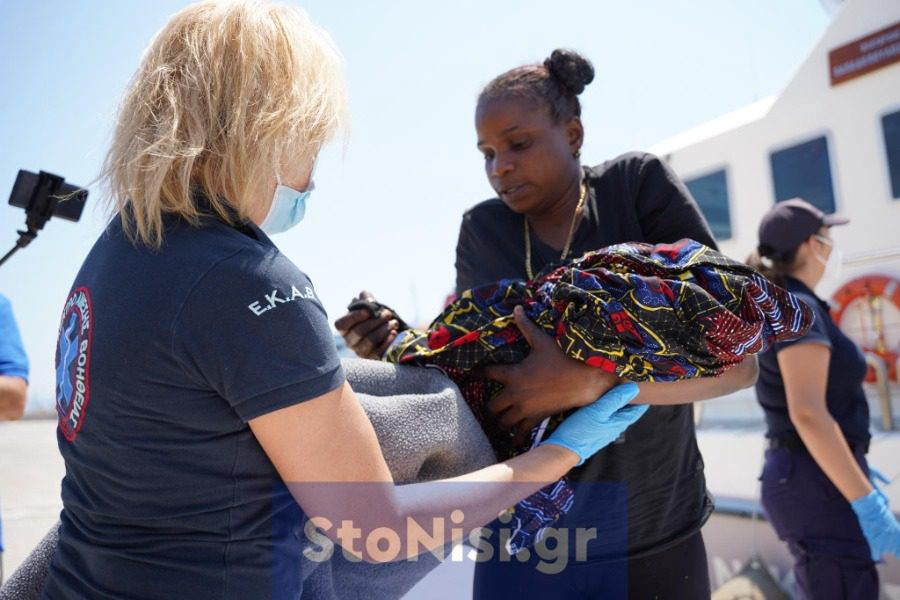
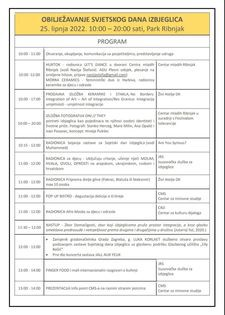
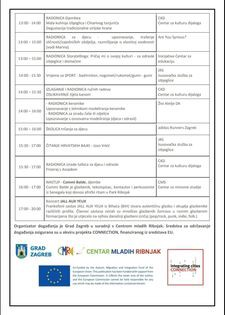
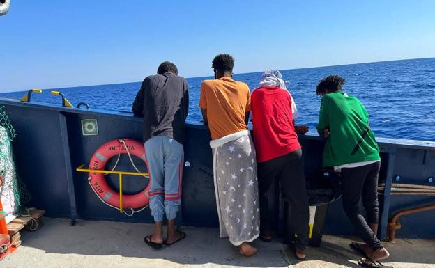
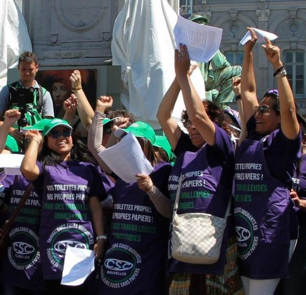

### AYS New Digest 22/6/2022: \#DroptheCharges — the trial of M\.M\. has been further postponed

Case of Akkad vs\. Turkiye/A woman gave birth whilst trying to reach Greece/Protests in Eleonas Camp/UN Special Rapporteur official observation after visiting Greece/Extreme border violence at the Greek border/2021 Frontex Fundamental Rights Officer Report/Aita Mari has finally been allowed to dock in Italy/Undocumented domestic workers’ strike in Brussels/UK\-Rwanda Policy may encourage asylum seekers to take more dangerous routes/ and much more…

Source: No Name Kitchen, 22/6/2022
### FEATURE
#### \#DropTheCharges

Over a year ago, a pregnant Afghan woman set her tent on fire in a suicide attempt while she was staying in Mavrovouni camp on Lesvos\. She has since been charged with arson and is standing trial, and was supposed to be standing trial on 22 June 2022\.

■■■■■■■■■■■■■■ 
> **[Can't evict solidarity](https://twitter.com/cantevict) @ Twitter Says:** 

> > The trial is postponed!!! The court in #Lesvos is once again using the weapon of demoralisation. This approach is now an established part of the brutal #criminalisation of migrants and solidarity. 
BUT: We will stand in solidarity with M.M. and her family!
#DropTheCharges 

> **Tweeted at [2022-06-22 09:14:30](https://twitter.com/cantevict/status/1539537300421496832).** 

■■■■■■■■■■■■■■ 

This suicide attempt took place at a time when her transfer with her family to Germany kept being postponed, whilst she witnessed others departing\. The fire was extinguished relatively quickly and she survived with burns and injuries\. After giving birth, after several more months of waiting, she and her family relocated to Germany\.

She is being charged with endangering the lives of other residents in addition to her charge of arson\. However, her husband and son were both away at the time, and she had left her daughters with neighbours\. She was therefore alone in the tent, with the intention of solely causing harm to herself\.

■■■■■■■■■■■■■■ 
> **[Franziska Grillmeier](https://twitter.com/f_grillmeier) @ Twitter Says:** 

> > ❕Der Prozess von M.M. wurde heute im Gerichtssaal v. #Mytilini begonnen &amp; auf unbestimmte Zeit verschoben. „Das Gericht entschied sich den Fall zu vertagen, um auf einen Zeugen zu warten, der zuvor nicht gefunden wurde. Damit konnten andere Zeug:innen nicht angehört werden,“ 

> **Tweeted at [2022-06-22 08:12:55](https://twitter.com/f_grillmeier/status/1539521801650323456).** 

■■■■■■■■■■■■■■ 

This charge ignores the fact that asylum seekers in camps are living in inhumane conditions, constantly waiting for a decision that will determine their future, living in constant instability and fear, whilst having very limited access to any mental health support\.

### TURKEY
#### [**42,666 individuals, including 24,341 Afghan and 6,025 Pakistani nationals**](https://www.dailysabah.com/politics/turkey-repatriates-42600-irregular-migrants-since-start-of-year/news?fbclid=IwAR1xtNg1L6eTkEDKWwP8WgQ09a9y2ZfqwrYKz79_YFgPBQoujh1RxUS9R6k) **, have been repatriated since the beginning of 2022**

Turkey is currently taking harsher measures at its borders to prevent asylum seekers from crossing into the country\.

■■■■■■■■■■■■■■ 
> **[AMASO](https://twitter.com/AmasoOrg) @ Twitter Says:** 

> > #Turkey has deported 450 Afghans today while @[amnesty](https://twitter.com/amnesty) has urged refugee hosting countries to end violence against Afghans and stop forces expulsion. [amnesty.org/en/latest/news…](https://www.amnesty.org/en/latest/news/2022/06/end-violence-and-serious-human-rights-violations-against-afghan-refugees/) https://t.co/wLzliw2t8j 

> **Tweeted at [2022-06-21 21:23:05](https://twitter.com/amasoorg/status/1539358266932748299).** 

■■■■■■■■■■■■■■ 

#### The case of Akkad vs\. Turkiye

A Syrian national was unlawfully repatriated to Syria by Turkish officials, under the notion of a “voluntary return”\. Muhammad Fawzi Akkad had been granted temporary protection in Turkey, however in 2018 he was arrested as he was trying to enter Greece\. Two days later he was sent back to Syria\.

[In Syria, he was taken by armed militants and was interrogated and beaten\.](https://www.infomigrants.net/en/post/41386/syrian-refugee-was-unlawfully-expelled-from-turkey-human-rights-court-rules?fbclid=IwAR1ocPfmCRBDWBZSpbYGgySlrDZCrf76PTqZ6zwhGfDcTpC8VZkTs6RhgyY) He was later released on the condition he stayed in Aleppo\. However, in July 2018, he returned to Turkey and later traveled to Germany, where he has applied for asylum\.

On Tuesday, 21 June 2022, the Strasbourg court found that there had been four violations in total of the European Convention of Human Rights :
- Violation of Article 3 \(prohibition of inhumane and degrading treatment\) on account of his removal to Syria\. The Court found that Muhammad Akkad faced serious risk of harm on returning to Syria and that the Turkish authorities were aware of said harm\.
- Second violation of Article 3 — the fact he was handcuffed in pairs with other Syrian men on a bus journey that lasted 20 hours amounted to degrading and inhumane treatment\.
- Violation of Article 13 \(right to an effective remedy\) — The Court found that the Turkish authorities denied Mr Akkad any opportunity to challenge this removal, which is a right under Turkish law\.
- Violation of Article 5 §§ 1,2,4 and 5 \(right to liberty and security\) — The Court found that Mr Akkad had been deprived of his liberty from the moment he was arrested to his removal to Syria\.

You can read the full press release by the European Court of Human Rights here: [“The forced return to Syria of a Syrian national with a valid residence permit was in breach of Turkish law and of the Convention”](https://l.facebook.com/l.php?u=https%3A%2F%2Fhudoc.echr.coe.int%2Fapp%2Fconversion%2Fpdf%2F%3Flibrary%3DECHR%26id%3D003-7364545-10062220%26filename%3DJudgment%2520Akkad%2520v.%2520T%25C3%25BCrkiye%2520-%2520Forced%2520return%2520of%2520a%2520Syrian%2520national%2520with%2520a%2520valid%2520residence%2520permit%2520to%2520Syria.pdf%26fbclid%3DIwAR2iyFeOTa9xAVOPc08FZHlYDvRVp1y15MR9gCLFhsmMZZ0WbtFPiw_u1Zo&h=AT1UYy4Hws4i3JHDsjFEBUyP04mgr70bC9mGRI8JN4f-WqRMsupuHXK8p3MDJEcPZXOK_v-3W37MNrByEr8WFnmPPE0zVTC5Q_7sv1S1-8CSLGoLKoY2BmFjp7Art6fo2u2e&__tn__=R]-R&c[0]=AT2D6jcG53BzklqcfpPs8QqNh4tjuVsIru3Rwkh_sOxPLI1Y8747Sg_eh_FtGuDzuKR9vITzAMyP50O80b4alq8QEtDWXhKTGRwky_-MPmniL4o-5C6fDKI3xpQBAs3BVg87GBNOLyIcsKG02gWMdk0F9H7CS0MGc5vDPSUIXUUNWmPPu1JHtDVCQ-Z416Ut3uFG-bSLYN7a)
### GREECE
#### Alarm Phone alerted authorities to a group of 29 who were stranded on an island near Lesvos\. One woman had given birth overnight\.

About three and a half hours later, [Alarm Phone was informed that the group had been rescued from the island](https://www.infomigrants.net/en/post/41395/aegean-sea-alarm-phone-sounds-alert-about-migrants-stranded-on-uninhabited-island?fbclid=IwAR3skrTJFgMHuErRuoHbon-uAUE98xoaJxhx2mkYt7YXnFyDwunRE5-BgSI) \.

Both the mother and baby are reported to be in good health\. When the Greek Coast Guard reached the island, [the mother was in a state of “half\-consciousness”](https://www.keeptalkinggreece.com/2022/06/22/migrant-woman-newborn-islet-lesvos-greece/?fbclid=IwAR31keX2qyI8I-sdjJ9GDr8in2shX2UXdHnJ1_lumzqYxB32VlSe7cicJE0) \.

■■■■■■■■■■■■■■ 
> **[Alarm Phone](https://twitter.com/alarm_phone) @ Twitter Says:** 

> > Another shipwreck in the #Aegean! 

According to official reports, 8 people of this group went missing during the rescue operation. Meanwhile, those who survived the shipwreck were transferred to the #Amygdaleza prison near #Athens! 
1/2 

> **Tweeted at [2022-06-22 16:34:08](https://twitter.com/alarm_phone/status/1539647938393415681).** 

■■■■■■■■■■■■■■ 

■■■■■■■■■■■■■■ 
> **[Alarm Phone](https://twitter.com/alarm_phone) @ Twitter Says:** 

> > The person had to walk himself for 24 hrs from the port to the camp with an injured leg, as authorities were not responding to the emergency call. It seems that he finally arrived at the camp. We are disgusted about the non-assistance of authorities and hope he will recover fast! 

> **Tweeted at [2022-06-22 10:56:02](https://twitter.com/alarm_phone/status/1539562852696088576).** 

■■■■■■■■■■■■■■ 

#### Protests in Eleonas Camp

Refugees and staff in the camp are protesting the announced closure of the facility

■■■■■■■■■■■■■■ 
> **[Daphne Tolis](https://twitter.com/daphnetoli) @ Twitter Says:** 

> > Residents at Eleonas refugee camp in #Athens held a demonstration on Tuesday along with local staff demanding the facility remains open. The Migration Ministry &amp; the Athens municipality have announced the imminent closure of this facility currently housing ~1600 refugees. https://t.co/lPeyEtzwBl 

> **Tweeted at [2022-06-21 20:34:32](https://twitter.com/daphnetoli/status/1539346048342102017).** 

■■■■■■■■■■■■■■ 

■■■■■■■■■■■■■■ 
> **[RSA](https://twitter.com/rspaegean) @ Twitter Says:** 

> > 1/3 Refugees residing in #Eleonas camp protest for second day in row against the announced closure at the end of this month. People from all nationalities stand hand in hand against their transfer to other reception facilities. #refugeesgr https://t.co/9Nm09U8bTx 

> **Tweeted at [2022-06-22 06:44:37](https://twitter.com/rspaegean/status/1539499581846736896).** 

■■■■■■■■■■■■■■ 

#### UN Special Rapporteur visit to Greece and recommendations

An official observation has been published by Mary Lawlor, UN Special Rapporteur, based on her visit, 13–22 June 2022\.

It covers a wide range of issues, such as, the criminalisation of NGO workers and the administrative and legal constraints on humanitarian assistance in Greece\. It further includes the exceptionally high fatality rate at international borders, inhumane treatment of refugees and asylum seekers, pushbacks, smear campaigns, and the focus on security over humanity\.

You can read the full statement here: [“Statement on preliminary observations and recommendations following official visit to Greece”](https://srdefenders.org/statement-on-preliminary-observations-and-recommendations-following-official-visit-to-greece/?fbclid=IwAR2xtX6efIcE4O3sHw3jcsaNGbIvB7hTuJi2e2eBe80t6lByr0OEIAaBW6c)

■■■■■■■■■■■■■■ 
> **[Daphne Tolis](https://twitter.com/daphnetoli) @ Twitter Says:** 

> > UN Special Rapporteur @[MaryLawlorhrds](https://twitter.com/MaryLawlorhrds) is in #Athens presenting her statement of preliminary findings on the situation of Human Rights Defenders after a 9-day visit to Greece. She visited facilities hosting migrants, asylum seekers and refugees. 

> **Tweeted at [2022-06-22 13:11:56](https://twitter.com/daphnetoli/status/1539597054304870406).** 

■■■■■■■■■■■■■■ 

#### Continued border violence at the hands of Greek authorities, where one man is seen being drowned by the border guards, and others were left beaten and stripped…

■■■■■■■■■■■■■■ 
> **[Vassilis Tsarnas](https://twitter.com/VassilisTsarnas) @ Twitter Says:** 

> > #Greece #Kos 9/6
@[ABoatReport](https://twitter.com/ABoatReport): "4 men arrested, beaten, stripped &amp; left drifting in a life raft by the 🇬🇷 coast guard..
I’m embarrassed.. on behalf of the 🇬🇷 ppl, who’s reputation.. is forever stained by these #neoNazi hooligans."
#pushbacks #RefugeesGr
[m.facebook.com/story.php?stor…](https://m.facebook.com/story.php?story_fbid=pfbid0Hh1JnyERPNWFvUukgDpp6c1GTLwFFZwVeNupvoxfoHhp7ookM1cnsF5tLFc8SZPul&id=100064851724634&sfnsn=mo) https://t.co/eJmhpufdDq 

> **Tweeted at [2022-06-22 09:58:03](https://twitter.com/vassilistsarnas/status/1539548262398676993).** 

■■■■■■■■■■■■■■ 

■■■■■■■■■■■■■■ 
> **[Forensic Architecture](https://twitter.com/ForensicArchi) @ Twitter Says:** 

> > Three days ago, a video dated 16/06/2022 was posted online, showing what appears to be Greek border guards beating and, according to the person filming, drowning an asylum seeker in the Evros/Meriç river:
[bit.ly/3n98FBj](https://bit.ly/3n98FBj) / [bit.ly/3N8YWWi](https://bit.ly/3N8YWWi) 

> **Tweeted at [2022-06-22 12:51:33](https://twitter.com/forensicarchi/status/1539591923568091138).** 

■■■■■■■■■■■■■■ 

### SEA/SAR
#### IOM reports that between 12–18 June, [590 people were brought back to Libya](https://www.infomigrants.net/en/post/41382/iom-libya-returns-590-migrants-in-under-a-week?fbclid=IwAR2QbKQI8IOU-wWs_Gpvb_ENBZLeyfFI3j4abLgKNUA1tegP6IWC2ghWPpM)

The tweet below provides a breakdown of how many people on each date had been picked up and returned to Libya\.

■■■■■■■■■■■■■■ 
> **[IOM Libya](https://twitter.com/IOM_Libya) @ Twitter Says:** 

> > In the period of 12 - 18 June 2022, 590 migrants have been disembarked back on Libyan shores.

👇 IOM Libya's Maritime Update👇 https://t.co/DvVTTreLDA 

> **Tweeted at [2022-06-20 14:21:33](https://twitter.com/iom_libya/status/1538889795484667905).** 

■■■■■■■■■■■■■■ 

At the same time, the Moroccan Navy rescued 105 individuals between 17–20 June\. They were provided with medical assistance and brought to the nearest Moroccan ports\. They have taken a stronger stance on human trafficking and smuggling\.

### FRONTEX
#### Annual report by the Frontex Fundamental Rights Officer has been published for 2021

It is a lengthy report covering monitoring, reporting, safeguarding, accountability, competency, cooperation, and ending with recommendations and conclusions\.

One interesting point that was raised was the fact this last year, they have seen a significant increase in Serious Incident reports, mainly in Greece and Lithuania\. The report states, however, that there has been a greater focus on monitoring and training in human rights, and this continues to be a priority into 2022\.

■■■■■■■■■■■■■■ 
> **[Lena K.](https://twitter.com/lk2015r) @ Twitter Says:** 

> > The 2021 Frontex Fundamental Rights Officer report is out. #Evros-related takeaway point 1: In November 2021 Frontex Fundamental Rights Monitors delivered sessions on fundamental rights during a 7-day training to 🇬🇷border guards, organised by UNHCR 🇬🇷 &amp; Hellenic Police. 

> **Tweeted at [2022-06-22 17:30:01](https://twitter.com/lk2015r/status/1539662001521446912).** 

■■■■■■■■■■■■■■ 

You can read the full report here: [Frontex Fundamental Rights Office releases annual report](https://frontex.europa.eu/media-centre/news/news-release/frontex-fundamental-rights-office-releases-annual-report-Jy2PEC?fbclid=IwAR2IIgMe4ZVPrxC5JJ1zamYwGqqBMs349P2lnbrI6avwB6_maZuz80RgQz4)
### CROATIA
#### Zagreb will celebrate World Refugee Day on Saturday, 25th June

Events will start at 10am at Ribnjak park with several organisations participating and presenting\. There will also be opportunities for creative and social activities\. The AYS team will also be there\!

### ITALY
#### On 22nd June, SMH announced that their ship, the Aita Mari, was allowed to dock in Italy

The ship, with 899 passengers, was waiting to dock for days\. SMH have been contacting authorities asking to be allowed to disembark and now they have finally been able to\.

Source: El Diario Vasco, 22/6/2022

■■■■■■■■■■■■■■ 
> **[Asier Sánchez](https://twitter.com/Asiersangar) @ Twitter Says:** 

> > AHORA SIIIIIII @[eitbNoticias](https://twitter.com/eitbNoticias) @[maydayterraneo](https://twitter.com/maydayterraneo) https://t.co/BcUV3upakm 

> **Tweeted at [2022-06-22 15:06:03](https://twitter.com/asiersangar/status/1539625773652496384).** 

■■■■■■■■■■■■■■ 

■■■■■■■■■■■■■■ 
> **[Mediterranea Saving Humans](https://twitter.com/RescueMed) @ Twitter Says:** 

> > A bordo delle navi #AitaMari #SeaEye4 e #SeaWatch4 ci sono in totale 899 persone in attesa di un #PortoSicuro. 

Da giorni chiedono di poter sbarcare, ma le Autorità ignorano le richieste e i propri obblighi derivanti dalle Convenzioni Internazionali.

Fateli scendere! Ora! https://t.co/0a8wFoFCku 

> **Tweeted at [2022-06-21 17:38:19](https://twitter.com/rescuemed/status/1539301703375364096).** 

■■■■■■■■■■■■■■ 

■■■■■■■■■■■■■■ 
> **[Sergio Scandura](https://twitter.com/scandura) @ Twitter Says:** 

> > Breaking via Radio Radicale 18:36

🟢 Messina è il porto di sbarco assegnato ai 483 Naufraghi a bordo della nave di soccorso ONG #SeaEye4.

Operazioni di sbarco previste per domani mercoledì 22 giugno.

(fonti ⚕️ a RR) https://t.co/PGzPI9Di32 

> **Tweeted at [2022-06-21 16:45:56](https://twitter.com/scandura/status/1539288518744227840).** 

■■■■■■■■■■■■■■ 

### BELGIUM
#### On International Domestic Workers’ Day, a group of undocumented domestic workers led their first\-ever strike in Brussels, demanding improved working conditions and regularisation

[There are around 80,000 domestic workers across Belgium who are currently living undocumented](https://picum.org/undocumented-domestic-workers-go-on-first-ever-strike-in-brussels-belgium/?fbclid=IwAR1jGd_22oi9eem3kkFJiihCRsboBdUX7Bq4lDmeyhi1PWeDistrQrJWtF8) \. They often lack any formal contract and are at risk of exploitation and abuse from their employers\.

### FRANCE
#### Police evict 380 people, forcing them back onto the street

■■■■■■■■■■■■■■ 
> **[Utopia 56](https://twitter.com/Utopia_56) @ Twitter Says:** 

> > Ce matin opération de « mise à l’abri » pour 380 personnes exilées qui survivaient à la rue à Paris. À peine arrivés aux centres d’hébergement, certains sont déjà remis à la rue et @[prefpolice](https://twitter.com/prefpolice) expulse illégalement celles et ceux restés sans solution. https://t.co/wWVdnbena7 

> **Tweeted at [2022-06-22 08:40:52](https://twitter.com/utopia_56/status/1539528839151423489).** 

■■■■■■■■■■■■■■ 

### UK
#### UK\-Rwanda Policy risks encouraging asylum seekers to take even more dangerous routes to reach the UK

Matthew Rycroft, a senior civil servant in the Home Office, has exposed [the lack of evidence suggesting that this new policy will reduce the numbers of people taking dangerous routes to enter the UK\.](https://www.thenational.scot/news/20228061.rwanda-policy-see-refugees-taking-risker-routes-uk-home-office-admits/?fbclid=IwAR1u_yv7Q5q2ZUFx9LGsXqloEA5wjDfoATrpEgKyxtrLGiBYOpFKA_s-wcQ) In fact, the number of individuals crossing the Channel is double that of last year, and Rycroft implies that this policy may not actually achieve what the Government claims is the objective and foundation of the policy\.

The President of Rwanda, Paul Kagame, has defended the policy, further stating that this agreement [could be extended to other countries](https://www.lemonde.fr/afrique/article/2022/06/22/paul-kagame-defend-l-expulsion-des-migrants-illegaux-du-royaume-uni-vers-le-rwanda_6131503_3212.html?utm_medium=Social&utm_source=Twitter#Echobox=1655884000-1) \.

This all comes at a time when the British government has proposed the Human Rights Act should be removed and replaced with a “British” Bill of Rights\. There are several deeply worrying issues related to this idea, which are explored in [this article](https://www.hrw.org/news/2022/06/22/uk-governments-bill-wrongs) \.
#### FURTHER RESOURCES:
- Lena Karamanidou and Bernd Kasparek: “From Exception to Extra\-Legal Normality: Pushbacks and Racist State Violence Against People Crossing the Greek\-Turkish Land Border”

- Refugee testimonies on the inhumane and degrading conditions of Libyan detention centres

- Solidarity among activists and refugees in Bern, Switzerland

- Press release preceding the full report written by the UN Special Rapporteur in Greece

**Find daily updates and special reports on our [Medium page](https://medium.com/are-you-syrious) \.**

**If you wish to contribute, either by writing a report or a story, or by joining the info gathering team, please let us know\.**

**We strive to echo correct news from the ground through collaboration and fairness\. Every effort has been made to credit organisations and individuals with regard to the supply of information, video, and photo material \(in cases where the source wanted to be accredited\) \. Please notify us regarding corrections\.**

**If there’s anything you want to share or comment, contact us through Facebook, Twitter or write to: areyousyrious@gmail\.com**

_Converted [Medium Post](https://medium.com/are-you-syrious/ays-new-digest-22-6-2022-dropthecharges-the-trial-of-m-m-has-been-further-postponed-91c959d5f69d) by [ZMediumToMarkdown](https://github.com/ZhgChgLi/ZMediumToMarkdown)._
