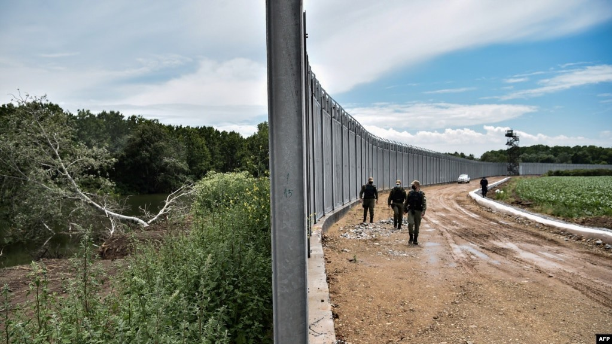
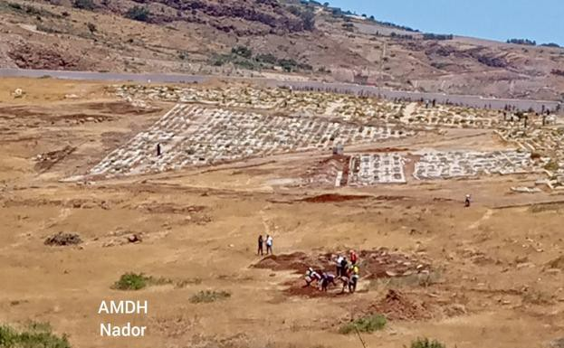

### **AYS News Digest 27/6/2022: UK Government hides exact numbers of asylum seeker deaths in Home Office accommodation**

Greece plans to extend border fence with Turkey/ Deaths of asylum seekers in Home Office Accommodation/Update on the situation on Morocco\-Spain border/Violence and racism against Syrian refugees in Turkey worsens/EP Justice Committee meeting with Notis Mitarachi/2 bodies found on Lesbos beach/Refugee children in Calais prevented from accessing school/ AYS looking for volunteers in Croatia\!/Much more…\.

Source:VOA, 26/6/2022
### TURKEY
#### Violent physical attacks and hate speech on the rise against Syrian refugees in Turkey

Within a month, there were two separate killings of 2 Syrians solely within Istanbul\.

A Syrian refugee currently residing in Istanbul, stated:

> “Incidents against Syrians are being repeated everywhere in Turkey, especially in schools and the workplace\. Hate speech and racism are currently at its highest levels, especially by political parties that incite against Syrian refugees\.” 

> “I face almost daily racism by Turkish youth, not to mention that the employer pays me a wage according to his liking and refused to obtain a work permit for me\. If the authorities know about that, I will be the culprit\. But I did not find any other job\.” 

You can read the full article here: [Syrian refugees recount harassment, abuse in Turkey](https://www.al-monitor.com/originals/2022/06/syrian-refugees-recount-harassment-abuse-turkey?fbclid=IwAR2cOEphJ_5csHoThT_Si_DxDNGLSRja_bAKbXFN_-xPWZSfAKglzvO0KjI#ixzz7XPZEh6Ze)
#### In the last 2 days, Turkey has deported 350 Afghans

■■■■■■■■■■■■■■ 
> **[AMASO](https://twitter.com/AmasoOrg) @ Twitter Says:** 

> > Turkey has deported 350 Afghans in the past 2 days. Thousands of Afghan refugees have been deported to Afghanistan in the past couple of weeks. Fears are high that hundreds are awaiting deportation in the deportation centers in Turkey. https://t.co/MYeS0kPWKI 

> **Tweeted at [2022-06-27 10:11:21](https://twitter.com/amasoorg/status/1541363546151419905).** 

■■■■■■■■■■■■■■ 

### GREECE
#### Greece plans to extend the land frontier fence with Turkey

Greece has recently been experienced another in asylum seekers trying to enter the country from Turkey\. The number of people has increased by roughly 20% compared to last year’s figures\.

As a response to this increase, and the ongoing political tensions between Greece and Turkey, the government plans to add another 80km of barbed wire and steel to the 40km border fence\.

#### Alarm Phone have alerted the Greek Coast Guard of a boat, with 90 people on it, that is sinking in the Aegean

However, they lost contact with the boat and the Coast Guard has claimed they conducted a search operation, failing to find said boat\.

■■■■■■■■■■■■■■ 
> **[Alarm Phone](https://twitter.com/alarm_phone) @ Twitter Says:** 

> > 🆘between #Mykonos &amp; #Ikaria in the #Aegean Sea!

90 people in panic in a boat that is sinking in rough sea. We informed the @[HCoastGuard](https://twitter.com/HCoastGuard) at 21:30 Greek time. They told us they are aware of the distress and that they are on it. A photo sent by the people shows a vessel nearby. https://t.co/gPx0mKNqQQ 

> **Tweeted at [2022-06-26 19:05:19](https://twitter.com/alarm_phone/status/1541135535376310272).** 

■■■■■■■■■■■■■■ 

#### The Civil Liberties Committee have met with Notis Mitarachi, Minister for Migration and Asylum of the Hellenic Republic, today to discuss pushback allegations at Greek borders

You can watch the meeting here:

■■■■■■■■■■■■■■ 
> **[Tineke Strik](https://twitter.com/Tineke_Strik) @ Twitter Says:** 

> > Quite a challenge to take the Greek minister seriously, as long as he disqualifies the consistent reports on pushbacks by UN-  and Council of Europe  bodies as Turkish propaganda. And if he refuses to investigate pushbacks, but criminalises NGOs rescuing  and  helping the victims 

> **Tweeted at [2022-06-27 14:43:21](https://twitter.com/tineke_strik/status/1541431997637312513).** 

■■■■■■■■■■■■■■ 

■■■■■■■■■■■■■■ 
> **[Franziska Grillmeier](https://twitter.com/f_grillmeier) @ Twitter Says:** 

> > .@[nmitarakis](https://twitter.com/nmitarakis) just said that 200.000 asylum seekers have reached #Greece since the #EU-Turkey-Agreement since March 2016. Turkey, he says, is right now actively encouraging “illegal departure”, terming this “push-forwards”. /2 

> **Tweeted at [2022-06-27 13:43:20](https://twitter.com/f_grillmeier/status/1541416896750358528).** 

■■■■■■■■■■■■■■ 

#### Tourists found two bodies on Lesbos beach

The Greek Coast Guard has confirmed that they were two male individuals who had tried to cross from Turkey to Greece\.

### UKRAINE
#### Europol has identified a high risk of human trafficking and exploitation of Ukrainian refugee women

Investigators checked 125 online platforms in 14 different countries, identifying 9 suspected human traffickers\. Almost 42 suspicious online platforms were identified\.

Europol has issued a warning to host countries, urging them to be vigilant and ensure there is appropriate safeguarding and monitoring of any potential human trafficking\.

#### [5\.2 million Ukrainian refugees have been displaced across Europe](https://www.washingtonpost.com/world/interactive/2022/ukraine-refugees-european-union/?utm_medium=social&utm_source=twitter&utm_campaign=wp_main) — one of the largest mass displacements since World War 2

3\.2 million have been granted temporary protection in the EU, with central and eastern european countries hosting a significantly larger proportion of Ukrainians compared to western european countries\.

Source: The Washington Post, 27/6/2022
### SERBIA

The latest Info Park newsletter stated:

> “No medical aid for refugees in Serbia\. On 8 June, Info Park registered third case in the last two weeks of refugees being denied medical aid in health centers across Serbia\. A day prior, young man from Afghanistan with severe signs of concussion was identified by the Info Park’s mobile team\. The young man was taken to OSP Miksalište where the workers of Serbian Commissariat for Refugees and Migrantions \(SCRM\) called for an ambulance, and he was transferred to Clinical Center in Belgrade\. The next day, June 8th, the young man was seen in the park again, still in poor health condition, showing signs of dizziness, balance problems, head pressure, nausea, vomiting, and blurry vision\. He told IP’s team that after he was taken to the hospital, he was left in the waiting room and was not treated nor anyone from the medical staff talked to him\. After 4–5 hours of waiting, he left the hospital on his own and returned to the park where other refugees were trying to help him by bringing him water and keeping him in a lying position\. He told IP’s team that he will try to go to the reception center in Adaševci and ask for medical help there\. On the following day, June 9th, Info Park learned that the young man was accepted in RC in Adaševci, however he was only able to receive painkillers for the camp’s doctor and his condition didn’t improve\. Unfortunately, there are no existing mechanisms to prevent the neglect and discrimination of health institutions towards the refugees in Serbia since there are no organizations capable of accompanying the refugees and migrants during hospital visits on a regular basis\. A few days following the incident, another 18\-year\-old man from Afghanistan with acute medical condition was accompanied by SCRM staff and accepted and treated at the same medical facility\. This only proves that the accessibility of the medical aid varies considerably depending on the presence of the NGOs or other humanitarian staff\.” 

### SEA/SAR
#### Between 19th to the 15th June 2022, 480 individuals have been captured and brought back to Libya

■■■■■■■■■■■■■■ 
> **[IOM Libya](https://twitter.com/IOM_Libya) @ Twitter Says:** 

> > In the period of 19 - 25 June 2022, 480 migrants have been disembarked back on Libyan shores.

👇 IOM Libya's Maritime Update👇 https://t.co/pg0XF7lqaD 

> **Tweeted at [2022-06-27 12:02:00](https://twitter.com/iom_libya/status/1541391392533929984).** 

■■■■■■■■■■■■■■ 

#### MV Louise Michel Twitter post — ‘A Message from Our Guests to Europe’

■■■■■■■■■■■■■■ 
> **[LouiseMichel](https://twitter.com/MVLouiseMichel) @ Twitter Says:** 

> > 1/3: A Message from our guests to Europe:

"We want to enter Italy because we are fleeing difficult living conditions, as well as difficult political crises and situations where the respect of human beings or human rights do not exist. https://t.co/04CeQFJcKj 

> **Tweeted at [2022-06-27 10:49:47](https://twitter.com/mvlouisemichel/status/1541373221076930560).** 

■■■■■■■■■■■■■■ 

#### SOS Mediterranee International have rescued 66 people, after they spent 48 hours at sea in a rubber dinghy:

■■■■■■■■■■■■■■ 
> **[SOS MEDITERRANEE](https://twitter.com/SOSMedIntl) @ Twitter Says:** 

> > This morning after a long search, @[SOSMedIntl](https://twitter.com/SOSMedIntl) rescued 66 people from a rubber boat in distress in Maltese SRR. Survivors show signs of exhaustion after 48h spent at sea.
156 survivors, incl 45 women, 68 unaccompanied minors, 6 children &amp; a 9-month-old baby are now on #OceanViking https://t.co/pSHG0nG7ic 

> **Tweeted at [2022-06-27 08:34:06](https://twitter.com/sosmedintl/status/1541339071687102465).** 

■■■■■■■■■■■■■■ 

### EU
#### The Annual General Conference of the European Council on Refugees and Exiles \(ECRE\) is currently taking place in Brussels \(27th — 28th June\)

■■■■■■■■■■■■■■ 
> **[Leïla Bodeux](https://twitter.com/leilabodeux) @ Twitter Says:** 

> > .@[ecre](https://twitter.com/ecre) explains how its response to Ukraine's refugees is on top of other important advocacy battles that should not be forgotten. Let's work to ensure that all people in need of protection can get access to asylum and dignified reception! #ECRE_AGC22 @[CaritasEuropa](https://twitter.com/CaritasEuropa) https://t.co/uQBfJhYNOu 

> **Tweeted at [2022-06-27 14:47:41](https://twitter.com/leilabodeux/status/1541433087191617538).** 

■■■■■■■■■■■■■■ 

#### First stage of the European Pact on Migration and Asylum to be introduced

This Pact is meant to act as a ‘solidarity plan’, seeking to encourage EU states to relocate asylum seekers arriving at European shores\. If states do not want to be a part of this initiative, they are obligated to provide financial support instead\.

■■■■■■■■■■■■■■ 
> **[Minos Mouzourakis](https://twitter.com/MinosMouz) @ Twitter Says:** 

> > Nothing says solidarity like asking Member States to relocate asylum seekers 🇬🇷 #rejects in flagrant violation of 🇪🇺 law. 
Has @[EUHomeAffairs](https://twitter.com/EUHomeAffairs) weighed in on this? 

> **Tweeted at [2022-06-27 14:46:19](https://twitter.com/minosmouz/status/1541432743669768193).** 

■■■■■■■■■■■■■■ 

### CROATIA

Are You Syrious are looking for volunteers\!

■■■■■■■■■■■■■■ 
> **[Are You Syrious?](https://twitter.com/areyousyrious) @ Twitter Says:** 

> > Jeste li u prilici donirati? Posjetite nas PON/SRI/PET 16-18h na adresi Božidara Magovca 165 (popnite se betonskim stepenicama na plato). Molimo vas da nam se prethodno najavite putem e-maila, Facebooka, Instagrama ili Twittera. Evo trenutne liste potreba⬇️
Hvala na solidarnosti! https://t.co/LVu6hA6Pfj 

> **Tweeted at [2022-06-27 14:17:19](https://twitter.com/areyousyrious/status/1541425448139251712).** 

■■■■■■■■■■■■■■ 

### SPAIN
#### As previously mentioned in the [AYS News Digest 24/6/22](ays-news-digest-24-6-22-deaths-at-the-border-with-spain-44683109e846) , on Friday, 24th June, 2000 people tried to cross the Moroccan\-Spanish border, into Melilla

500 people succeeded, however, the death toll has now risen to 23, with an extra 76 people being injured\. Some organisations have claimed that the [death toll is likely to be as high as 37](https://www.publico.es/internacional/respaldo-bruselas-actuacion-melilla-cruce-forzado-violento-tolerarse.html?fbclid=IwAR10IRSKFscQAUnKNMSKIOjobbYVOCmuQtszKaCoaiOjlJYrMaNhRgzV-rA) \.

The Spanish Prime Minister, Pedro Sanchez, [called this a “violent assault” and was the work of “mafias who traffic human beings”](https://www.politico.eu/article/death-toll-23-melilla-border-crossing-stampede/?fbclid=IwAR33fuREFOOYSXPchlaU7V1mI9xpqAWeulH7yt77qqDNRTFnco-70xj5OTk) \.

Ylva Johansson further stated that she was deeply concerned with the loss of life, however as Lena K points out below, there is no sense of accountability on the part of EU border policy\.

■■■■■■■■■■■■■■ 
> **[Lena K.](https://twitter.com/lk2015r) @ Twitter Says:** 

> > Responses of the EU leadership to the #Melilla massacre. Predictable expression of concern, 'loss of life' as if this was a tragic accident and not the result of EU border policy and legitimation by shifting the blame to the victims for crossing the border 'violently'. https://t.co/gbTVzJfkng 

> **Tweeted at [2022-06-27 11:01:32](https://twitter.com/lk2015r/status/1541376176328941568).** 

■■■■■■■■■■■■■■ 

[InfoMigrants recounts extreme border violence](https://www.infomigrants.net/fr/post/41486/melilla--au-moins-23-migrants-perissent-dans-des-violences-sans-precedent?fbclid=IwAR3gBBteIIQ55MOmMoqZ2veTr_bGr1RyIjRAneY7MjAcSXQTbwSIPc5b1cQ) , with border guards pulling people off the fences, and then beating them\.

**\*CAUTION: The videos below show extremely disturbing images that could be triggering\***

Despite a call for an investigation into this disaster, photos have emerged of Moroccan officials digging graves\. Autopsies are also not being carried out\. [The Spanish government have not stated whether they will open an investigation](https://www.diariovasco.com/politica/marruecos-prepara-entierro-20220626151756-ntrc.html?ref=https%3A%2F%2Ft.co%2F) and they have not provided any explanations for what happened\.

Source: El Diario Vasco, June 26th 2022

■■■■■■■■■■■■■■ 
> **[InfoMigrants](https://twitter.com/InfoMigrants) @ Twitter Says:** 

> > 📷 Hundreds of people took to the streets of Madrid on June 26. 

Organized by the Madrid Anti-racist Association, the rally was in protest against the deadly tragedy in Melilla on Friday when at least 23 African migrants died in a mass attempt to scale the 🇲🇦-🇪🇸 border fence. https://t.co/BdTLEtuiKl 

> **Tweeted at [2022-06-27 14:12:00](https://twitter.com/infomigrants/status/1541424107899654144).** 

■■■■■■■■■■■■■■ 

### FRANCE
#### In Calais, certain refugee children are prevented from attending school

StreetPress has reported on this illegal practice:

■■■■■■■■■■■■■■ 
> **[StreetPress](https://twitter.com/streetpress) @ Twitter Says:** 

> > Dans le Pas-de-Calais, la Préfecture empêche de nombreux enfants exilés d’aller à l’école. StreetPress a enquêté sur cette pratique illégale et s’est procuré cet enregistrement. https://t.co/jlPf8lHbYj 

> **Tweeted at [2022-06-27 13:41:43](https://twitter.com/streetpress/status/1541416489747681285).** 

■■■■■■■■■■■■■■ 

#### Utopia 56 updates on the situation of around 60 young people who have been forced to camp out on the street for the last 30 days

■■■■■■■■■■■■■■ 
> **[Utopia 56](https://twitter.com/Utopia_56) @ Twitter Says:** 

> > Depuis 30 jours, une soixantaine de jeunes isolés (sur)vivent à la rue place de la Bastille à Paris. La seule réponse du gouvernement à nos mails, aura été de saisir le Conseil d’État pour interdire notre mobilisation. Il a perdu. #mineursàlarue https://t.co/6ZwQ7SVPzB 

> **Tweeted at [2022-06-26 04:36:53](https://twitter.com/utopia_56/status/1540916989627072512).** 

■■■■■■■■■■■■■■ 

### UK
#### Since 2020, dozens of asylum seekers, who were recognised as particularly vulnerable by the Home Office, have passed away in government accommodation

The Observer and Liberty Investigates have discovered that between April 2016 and May 2022, there was 107 deaths in Home Office accommodation\.

In addition, since January 2020, there have 82 deaths\. Around 40 individuals were considered to have had a ‘safeguarding element’ which meant the Home Office viewed them as having particular vulnerabilities that needed to be addressed and monitored\.

Many believe there are ‘systemic failures’ and gaps in the safeguarding policies within the Home Office\.

### FURTHER RESOURCES:
- The New Humanitarian — ‘Taliban quake response, Amhara massacre, and South Asia’s monsoon — hit millions: The Cheat Sheet’\.

- Jeff Crisp, MOAS — “Detained and Deported: The UK’s Abusive Approach to New Refugee Arrivals”

- Heinrich Boll Stiftung — “More \(about\) Borders, less \(about\) Humans: Media Coverage of Migration and Asylum Seeking in Greece”

■■■■■■■■■■■■■■ 
> **[Heinrich Böll Stiftung Thessaloniki](https://twitter.com/boell_gr) @ Twitter Says:** 

> > Just published! An interesting study that examines the coverage of #migration and #asylum seeking in eight Greek #media outlets. 
● Download here: [gr.boell.org/en/2022/06/26/…](https://gr.boell.org/en/2022/06/26/more-about-borders-less-about-humans)
● Come to the RETHINK Ideas Forum (29/6) where the co-author Naya Kalfeli will present the study.
#hbsgr10 https://t.co/2W7FKkQs1r 

> **Tweeted at [2022-06-27 07:59:38](https://twitter.com/boell_gr/status/1541330398084567040).** 

■■■■■■■■■■■■■■ 

**Find daily updates and special reports on our [Medium page](https://medium.com/are-you-syrious) \.**

**If you wish to contribute, either by writing a report or a story, or by joining the info gathering team, please let us know\.**

**We strive to echo correct news from the ground through collaboration and fairness\. Every effort has been made to credit organisations and individuals with regard to the supply of information, video, and photo material \(in cases where the source wanted to be accredited\) \. Please notify us regarding corrections\.**

**If there’s anything you want to share or comment, contact us through Facebook, Twitter or write to: areyousyrious@gmail\.com**

_Converted [Medium Post](https://medium.com/are-you-syrious/ays-news-digest-27-6-2022-uk-government-hides-exact-numbers-of-asylum-seeker-deaths-in-home-office-7044fd222609) by [ZMediumToMarkdown](https://github.com/ZhgChgLi/ZMediumToMarkdown)._
