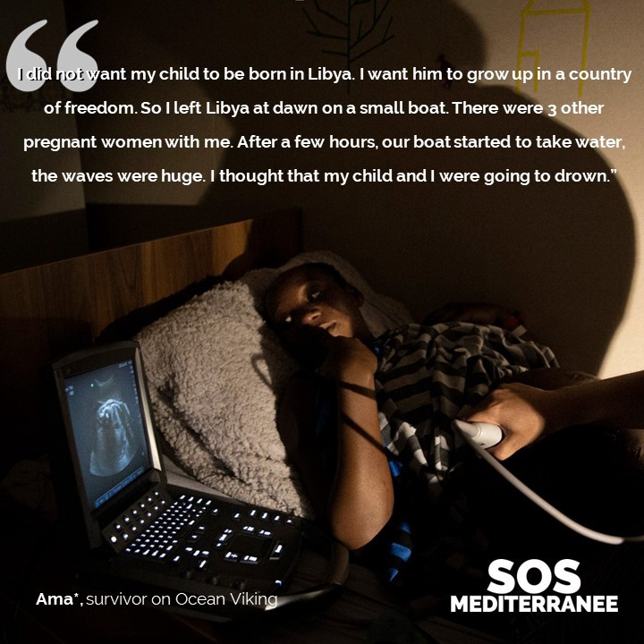

### AYS News Digest 4/7/2022: 306 asylum seekers are waiting to disembark from the SOS Med Ocean Viking

Shootout on Serbia\-Hungary border/FRONTEX has selected an interim Executive Director/ 96 asylum seekers have reached Italy from Libya on a UNHCR charter flight/Kenya calls for an investigation into the events in Melilla on 24th June/Protests taking place across Spain over the events in Melilla/UK Home Office plans for second flight to Rwanda/and much more…

Source: SOS Mediterranee, 4/7/2022
### GREECE
#### Over the weekend, human rights organisations and individual activists on Lesbos [protested against the illegal pushbacks of asylum seekers](https://www.infomigrants.net/en/post/41673/activists-on-lesbos-slam-greece-for-pushing-back-migrants?preview=1656942387474)

Several ministers continue to deny that the coastguard is conducting pushbacks despite the vast amounts of evidence\.
### SERBIA
#### One person has died and another six left injured after a shootout between migrant groups near the Serbia\-Hungary border

It took place roughly 1km from the Hungarian border, after they had been stranded there while trying to reach Hungary\. It is still unclear what triggered this event and police have not yet released a statement\.

### EU

■■■■■■■■■■■■■■ 
> **[Ludek Stavinoha](https://twitter.com/LudekStavinoha) @ Twitter Says:** 

> > 1/ Earlier this year, I filed a complaint to the 
@[EUombudsman](https://twitter.com/EUombudsman) over @[EUHomeAffairs](https://twitter.com/EUHomeAffairs) handling of my #FOIA request. The verdict is now in: the European Commission committed an act of maladministration. 

But this is a bittersweet victory. 
[ombudsman.europa.eu/en/decision/en…](https://ombudsman.europa.eu/en/decision/en/157768) 

> **Tweeted at [2022-07-04 13:57:12](https://twitter.com/ludekstavinoha/status/1543957099301961729).** 

■■■■■■■■■■■■■■ 

### FRONTEX
#### FRONTEX Management board has selected an interim Executive Director, Aija Kalnaja

You can read more about Ms\. Kalnaja’s professional background here: [https://frontex\.europa\.eu/media\-centre/news/news\-release/frontex\-management\-board\-selects\-interim\-executive\-director\-7xkc1H](https://frontex.europa.eu/media-centre/news/news-release/frontex-management-board-selects-interim-executive-director-7xkc1H)
#### The OLAF report on the mismanagement and covering up of pushbacks has now been received by the LIBE committee\. However, it is still not publicly accessible\.

■■■■■■■■■■■■■■ 
> **[Tineke Strik](https://twitter.com/Tineke_Strik) @ Twitter Says:** 

> > After months of pressure from the European Parliament, the LIBE committee finally received the OLAF report on the role of the @[Frontex](https://twitter.com/Frontex) executive management in covering up pushbacks. An essential first step to allow for scrutiny, but it is not enough. 1/3 https://t.co/WvkSDQ05fB 

> **Tweeted at [2022-07-04 15:07:19](https://twitter.com/tineke_strik/status/1543974745099718661).** 

■■■■■■■■■■■■■■ 

### SEA/SAR
#### Last night, the Ocean Viking rescued another 15 individuals\. There are now 306 people on board waiting to disembark, including a woman who is 9\-months pregnant\.

■■■■■■■■■■■■■■ 
> **[SOS MEDITERRANEE](https://twitter.com/SOSMedIntl) @ Twitter Says:** 

> > @[SOSMedIntl](https://twitter.com/SOSMedIntl) performed a 8th rescue tonight. 15 people were adrift for over 2 days on a small rubber boat in the central #Mediterranean.

306 survivors are now on #OceanViking, some were rescued 10 days ago. They need to disembark without further delay. https://t.co/KrQY27uVbD 

> **Tweeted at [2022-07-04 20:46:52](https://twitter.com/sosmedintl/status/1544060196598812673).** 

■■■■■■■■■■■■■■ 

■■■■■■■■■■■■■■ 
> **[SOS MEDITERRANEE](https://twitter.com/SOSMedIntl) @ Twitter Says:** 

> > Samuel*, 17, has scars that bear witness of the violence he suffered in a detention centre in #Libya after being intercepted in #CentralMediterranean. 

Rescued 8 days ago by @[SOSMedIntl](https://twitter.com/SOSMedIntl) from a boat in distress, he & 290 survivors are waiting on #OceanViking for a Place of Safety https://t.co/ukpXXti9wB 

> **Tweeted at [2022-07-04 14:53:59](https://twitter.com/sosmedintl/status/1543971390226894849).** 

■■■■■■■■■■■■■■ 

#### A disturbing video shows two men floating on wooden plank holding a child — MSF Sea were able to rescue the men and resuscitate the baby\. They were part of a group of asylum seekers including pregnant women and children who were all rescued\.

■■■■■■■■■■■■■■ 
> **[Gorden Isler](https://twitter.com/gorden_isler) @ Twitter Says:** 

> > Menschen treiben auf einem Stück Holz. Ein Mann kämpft, um das Leben eines vier Monate alten Babys zu schützen und hält es über Wasser, bis die Seenotretter*innen von @[MSF_Sea](https://twitter.com/MSF_Sea)  eintreffen 🧡🛟. Und die europäische Politik macht jetzt Sommerferien.

https://t.co/fORTS3aCsC 

> **Tweeted at [2022-07-03 09:53:08](https://twitter.com/gorden_isler/status/1543533291491524608).** 

■■■■■■■■■■■■■■ 

#### Alarm Phone has reported that they are in contact with a boat carrying 15 people who are adrift in the Mediterranean\. The boat’s engine stopped working and there is a hole in the bottom of the boat\. Alarm Phone have alerted the authorities\.

■■■■■■■■■■■■■■ 
> **[Alarm Phone](https://twitter.com/alarm_phone) @ Twitter Says:** 

> > 🆘! ~15 persone alla deriva in SAR di #Malta!
Alarmphone è in contatto con una barca in pericolo, il motore ha smesso di funzionare e deve essere soccorsa! Le persone dicono che c'è un buco nella barca, un tubo si sta sgonfiando. Le autorità sono allertate, serve soccorso subito! https://t.co/wFHUOAAlVL 

> **Tweeted at [2022-07-04 13:54:15](https://twitter.com/alarm_phone/status/1543956358818516992).** 

■■■■■■■■■■■■■■ 

### ITALY

96 **asylum seekers have reached Libya on a UNHCR charter flight**

The group came from detention camps in Libya and have experienced trafficking, torture, and other forms of abuse\.

This flight was the third one since the implementation of a protocal in April 2021 by several institutions, such as, the Italian ministries of interior and foreign affairs, the UNHCR, and the Community of Sant’Egidio\.

Chiara Cardoletti, the UNHCR representative for Italy stated:

> “It is an important sign of solidarity and humanity\. In an increasingly uncertain and unsafe world, where over 100 million people have been forced to flee, we hope to be able to continue working together to widen safe pathways — including resettlement — allowing refugees to rebuild their lives safely and with dignity\.”

### SPAIN
### Kenya calls for an in\-depth investigation into the deaths of 23 asylum seekers on the 24th of June

Kenya’s deputy representative, Mike Kiboino, has urged the UN Security Council to protect individuals who are fleeing war and persecution\.

He further stated:

> “What happened to migrants trying to enter the Spanish enclave of Melilla is a blatant violation of the United Nations resolution adopted two years ago to protect and uphold the human rights and freedom of Africans against the excessive use of force and other human rights violations by law enforcement agencies,”

#### AMDH Nador post about a 20\-year old Sudanese male, called Mohanad Maamoun Aissa, who was killed by Moroccan police on the 24th June\.

#### Ylva Johansson will be debating tonight with the European Parliament regarding the events of the 24th June, on the border between Morocco and Spain

■■■■■■■■■■■■■■ 
> **[European Parliament Audiovisual Service](https://twitter.com/europarlAV) @ Twitter Says:** 

> > 🔴 Live at 18:05 CEST

MEPs will debate with Commissioner @[YlvaJohansson](https://twitter.com/YlvaJohansson) the tragic events of 24th June at the border between Morocco and the Spanish enclave of Melilla. #EPlenary

Follow live  📡➡️ [eptwitter.eu/q8bu](http://eptwitter.eu/q8bu) https://t.co/HBaqqAzZcF 

> **Tweeted at [2022-07-04 15:53:48](https://twitter.com/europarlav/status/1543986441012772865).** 

■■■■■■■■■■■■■■ 

■■■■■■■■■■■■■■ 
> **[Ylva Johansson](https://twitter.com/YlvaJohansson) @ Twitter Says:** 

> > My opening speech at #EPlenary debate today on tragedy that took place at #Melilla border crossing.

[ec.europa.eu/commission/com…](https://ec.europa.eu/commission/commissioners/2019-2024/johansson/announcements/commissioner-johanssons-speech-plenary-loss-life-violence-and-inhumane-treatment-against-people_en) https://t.co/7Kt1Ehzq75 

> **Tweeted at [2022-07-04 17:55:54](https://twitter.com/ylvajohansson/status/1544017169570316289).** 

■■■■■■■■■■■■■■ 

#### InfoMigrants reports on protests and demonstrations taking place all over Spain in response to the events of the 24th June

### GERMANY
#### Action guide created to support individuals in taking action against deportations from Berlin Brandenburg airport

You can access the guide here: [https://dumpharder\.neocities\.org/](https://dumpharder.neocities.org/)

■■■■■■■■■■■■■■ 
> **[No Border Assembly Berlin](https://twitter.com/NoBorder_Berlin) @ Twitter Says:** 

> > Without deportation investor, no #StopDeportationCenterBER! "Harder und Partner" plans to build the deportation center at BER airport for 150 million euros - NOT WITH US! Use the guide by @[Abschiebez_BER](https://twitter.com/Abschiebez_BER) to take action against it! [dumpharder.neocities.org](https://dumpharder.neocities.org/) #DumpHarder #DefundRacism https://t.co/jGBoCPcNQN 

> **Tweeted at [2022-07-04 10:44:22](https://twitter.com/noborder_berlin/status/1543908569464070144).** 

■■■■■■■■■■■■■■ 

#### The German government has proposed a new route for asylum seekers whose claims have been rejected but they cannot be deported:

### UK
#### The Home Office plans second flight to deport asylum seekers to Rwanda

The full high court hearing will only take place after the 19th July, however, [the Home Office could arrange for this flight to leave before the decision is made\.](https://www.theguardian.com/uk-news/2022/jul/03/uk-home-office-plans-second-flight-to-deport-asylum-seekers-to-rwanda)

A spokesperson for the UK Home Office stated:

> “We remain committed to our world\-leading migration partnership with Rwanda, which will see those arriving dangerously, illegally or unnecessarily into the UK relocated to rebuild their lives\. This is vital to prevent loss of life in the Channel and break the business model of people smugglers\. Preparations for the next flight are under way\.”

Source: The Guardian, 3/7/22

■■■■■■■■■■■■■■ 
> **[Stop Deportations](https://twitter.com/StpDeportations) @ Twitter Says:** 

> > Priti Patel is planning her next racist deportation flight to Rwanda this month. Rumours are that it may be on 20th July. 

We are building a movement to stop every deportation, whether it’s to Rwanda or anywhere else. Donate to the resistance here: [gofundme.com/f/support-stop…](https://www.gofundme.com/f/support-stop-deportations) 

> **Tweeted at [2022-07-04 10:31:10](https://twitter.com/stpdeportations/status/1543905247382339585).** 

■■■■■■■■■■■■■■ 

#### The Joint Council for the Welfare of Migrants has reported that since May 2020, more than 2500 survivors of modern day slavery, domestic abuse, sexual violence, and other forms of abuse, have been referred to immigration control after they called the police

■■■■■■■■■■■■■■ 
> **[JCWI](https://twitter.com/JCWI_UK) @ Twitter Says:** 

> > ICYMI: Since May 2020, over 2500 victims - including over 400 survivors of domestic abuse and at least 796 survivors of modern slavery - were reported to immigration control after they called the police.

Inhumane & indefensible.
[newstatesman.com/society/2022/0…](https://www.newstatesman.com/society/2022/06/police-refer-crime-victims-deportation-home-office) https://t.co/of5VxgXo6q 

> **Tweeted at [2022-07-04 13:16:26](https://twitter.com/jcwi_uk/status/1543946838952263680).** 

■■■■■■■■■■■■■■ 

#### The Lesbians and Gays support the Migrants \(LGS Migrants\) protested against police presence at the Pride Parade in London over the weekend

Source: Huck, 3/7/2022
#### Help support Hackney Migrant Centre to ensure they can keep providing their crucial advice and guidance to refugees and asylum seekers in London: [https://www\.crowdfunder\.co\.uk/p/help\-hackney\-migrant\-centre](https://www.crowdfunder.co.uk/p/help-hackney-migrant-centre)
#### EXTRA RESOURCES:
- _No Name Kitchen, How important is water in our lives?_ \. Very important project implemented by No Name Kitchen\!

■■■■■■■■■■■■■■ 
> **[NoNameKitchen](https://twitter.com/NoNameKitchen1) @ Twitter Says:** 

> > How important is water in our lives? 
Portable backpack showers. 🚿
A No Name Kitchen & Collettivo Rotte Balcaniche project.

[youtube.com/watch?v=d40Znu…](https://www.youtube.com/watch?v=d40ZnuzA2W8) 

> **Tweeted at [2022-06-03 10:16:16](https://twitter.com/nonamekitchen1/status/1532667474486992896).** 

■■■■■■■■■■■■■■ 

- _Al Jazeera, ‘Venezuelan migrant children struggle to access education’_ \. Research has shown that Venezuelan students in Colombia are being turned away, and 1 in 4 Venezuelan children are enrolled in school in la Libertad and Lima\. The reasons range from not having the correct documentation, to enrolling after the deadline\.

- IOM Asia\-Pacific, Increased death total along migratory routes in Asia

■■■■■■■■■■■■■■ 
> **[IOM Asia-Pacific](https://twitter.com/IOMAsiaPacific) @ Twitter Says:** 

> > Late 2021 saw a major increase in the death toll on migration routes in Asia compared to prior years. These included deaths on routes

from Afghanistan ➡472 

Indonesia-Malaysia ➡61 

to Thailand ➡14 

from Bangladesh’s Bhasan Char ➡23 https://t.co/WczQ8g68kd 

> **Tweeted at [2022-07-04 05:34:08](https://twitter.com/iomasiapacific/status/1543830496613842944).** 

■■■■■■■■■■■■■■ 

- IOM UN Migration — emergency shelter and NFIs being distributed to Afghans affected by the earthquake

**Find daily updates and special reports on our [Medium page](https://medium.com/are-you-syrious) \.**

**If you wish to contribute, either by writing a report or a story, or by joining the info gathering team, please let us know\.**

**We strive to echo correct news from the ground through collaboration and fairness\. Every effort has been made to credit organisations and individuals with regard to the supply of information, video, and photo material \(in cases where the source wanted to be accredited\) \. Please notify us regarding corrections\.**

**If there’s anything you want to share or comment, contact us through Facebook, Twitter or write to: areyousyrious@gmail\.com**

_Converted [Medium Post](https://medium.com/are-you-syrious/ays-news-digest-4-7-2022-306-asylum-seekers-are-waiting-to-disembark-from-the-sos-med-ocean-viking-1ff5f03eae9) by [ZMediumToMarkdown](https://github.com/ZhgChgLi/ZMediumToMarkdown)._
