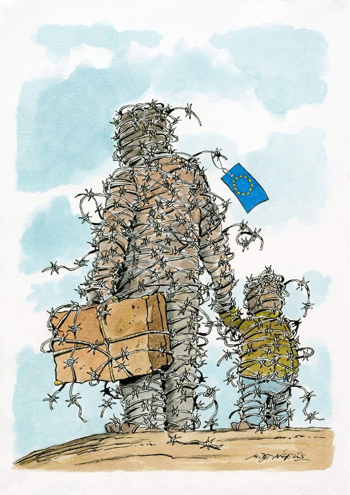
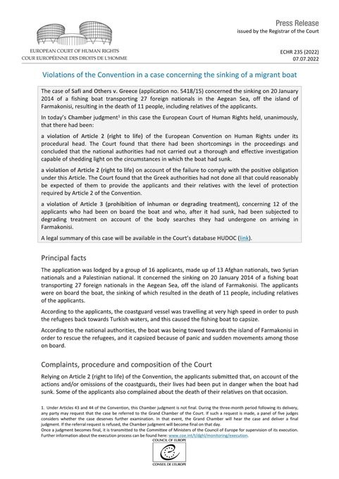

### AYS News Digest 6/7/22: Rohingya child challenges Croatia and Slovenia over violent pushbacks
#### Hungary remains firm they only respect Ukranians’ right to seek protection, and nobody else’s / While a child suees Croatia, its ‘independent border mechanism’ finds no wrongdoings / The huge issue of GPS tagging in the case of UK / Geermany’s capital left without accommodation / & more news, information and good reads for you to share and read

#### FEATURE

A Rohingya child refugee faced repeated beatings by Croatian border officers, had his belongings burnt and his shoes confiscated before numerous forced expulsions, including a “chain” pushback from Slovenia, European Center for Constitutional and Human Rights [reported](https://www.ecchr.eu/en/about-us/) \.

**National, EU, and international law oblige Croatia and Slovenia to act in a child’s best interests and prioritize the identification of their age during their handling by border officers\.**

U\.F\. submitted complaints against Croatia and Slovenia at the UN Child Rights Committee for multiple violations of the Convention on the Rights of the Child \(CRC\) \.

These are the first complaints of their kind against these two states\.

■■■■■■■■■■■■■■ 
> **[ECCHR](https://twitter.com/ECCHRBerlin) @ Twitter Says:** 

> > An unaccompanied Rohingya child was violently pushed back 5 times from #Croatia + subjected to a #chain pushback from #Slovenia. 
He's now filed complaints at the UN Child Rights Committee - the first of their kind #UNCRC #ChildPushbacks 
👉Read more: [bit.ly/3ahfhuD](https://bit.ly/3ahfhuD) https://t.co/DLxIpXDygD 

> **Tweeted at [2022-07-06 08:58:10](https://twitter.com/ecchrberlin/status/1544606619601932290).** 

■■■■■■■■■■■■■■ 

#### THE SEA
### Tragic death of 22 people confirmed

The Malian government has confirmed that 22 Malians, including three children, died off the coast of Libya when their boat got into trouble towards the end of June\.

■■■■■■■■■■■■■■ 
> **[SOS MEDITERRANEE](https://twitter.com/SOSMedIntl) @ Twitter Says:** 

> > Huge relief and emotions onboard #OceanViking: Pozzallo, Sicily, was assigned as a port of disembarkation for the 306 survivors rescued in 8 separate operations. Some of these women, children and men were rescued 12 days ago. https://t.co/4AXGY0tQbb 

> **Tweeted at [2022-07-05 19:43:48](https://twitter.com/sosmedintl/status/1544406711422910471).** 

■■■■■■■■■■■■■■ 

152 survivors, including people with medical cases, unaccompanied minors, families, and children, disembarked in Pozzallo, Sicily\. The remaining 154 survivors spene another night onboard the Ocean Viking\.

We would like to stress out that nobody wants to be a survivor or saved, and if these people’s rights to ask for protection and search for safety would have been respected, they too never would have to be _saved\._

Here is how many of the _saved_ end up in Italy:

■■■■■■■■■■■■■■ 
> **[Jolie Rouge](https://twitter.com/JigginoRuss) @ Twitter Says:** 

> > Oggi a Lampedusa, nel campo di concentramento detto hotspot, sono rinchiuse più di 1.100 persone. Da due giorni manca l'acqua. https://t.co/xKi6SMcMF8 

> **Tweeted at [2022-07-05 14:35:59](https://twitter.com/jigginoruss/status/1544329248625803266).** 

■■■■■■■■■■■■■■ 

#### TURKEY
### A 4\-year old dies, 12 more people injured in a police shooting of a van

Turkish gendarmerie have opened fire on a minibus carrying refugees for allegedly “disobeying stop warnings” in the eastern province of Van, leading to the death of a person and injury of 12 others\.

> Eyewitnesses of the incident said that the deceased was a four\-year\-old child\. 

Reportedly, 40–50 shots were fired at the minibus in the first round\. The same number of shots in the second round reports [say](https://www.duvarenglish.com/one-refugee-killed-12-others-injured-in-gendarmerie-shooting-in-turkeys-eastern-van-news-60995) \. The human rights advocate called the incident a “breach of duty and a violation of the right to life,” and appealed for an independent probe\.
#### GREECE
### Rescuer at sea has become the target of the conservative Greek power

On social networks, the far right is unleashed against a former engineer who, since 2015, has been rescuing migrants at sea, the media report\.

_Greek authorities abduct refugees_ _on the Greek coast_ _and then throw them into the open sea,_ the rescuer stated openly at the European Parliament in May\. With this intervention, broadcast several weeks later on social networks in Greece, the man with the laughing eyes drew the wrath of New Democracy, the conservative party in power\.

However, after the recent court decisions, he posed the question to them — who is now the one defaming thee country abroad?

■■■■■■■■■■■■■■ 
> **[Iasonas Apostolopoulos](https://twitter.com/Iasonas_Apost) @ Twitter Says:** 

> > Το Δικαστήριο αναφέρει ότι οι 🇬🇷αρχές συγκάλυψαν το έγκλημα, βάζοντας την δικογραφία στο αρχείο. Μετά από 8 χρόνια, τα θύματα επιτέλους δικαιώνονται και η Ελλάδα υποχρεούται να καταβάλει αποζημίωση 330.000 ευρώ. Ποιος δυσφημεί τλκ την χώρα στο εξωτερικό;

[efsyn.gr/sites/default/…](https://www.efsyn.gr/sites/default/files/2022-07/Judgment%20Safi%20and%20Others%20v.%20Greece%20-%20Sinking%20of%20a%20migrant%20boat.pdf) 

> **Tweeted at [2022-07-07 16:40:20](https://twitter.com/iasonas_apost/status/1545085317052604424).** 

■■■■■■■■■■■■■■ 

Read the [story](https://www.lemonde.fr/m-le-mag/article/2022/07/03/iasonas-apostolopoulos-sauveteur-de-refugies-honni-du-gouvernement-grec_6133133_4500055.html?fbclid=IwAR2b3ppTTWyGjUzVyBNyKW-cw6xGuQAyDPGOwgIBxAlGKOS4P4Xu8F7Byvg) on Iasonas in Le Monde\.
### Athens insists on closing Eleonas

The municipal authority of Athens insisted on the closure of the refugee structure of Eleonas, rejecting a resolution submitted by the councilor of the faction “Mutiny in the neighborhoods of Athens”, P\. Konstantinou, and supported by the opposition forces\.

The proposition called for the Municipality of Athens and the Ministry of Immigration “not to proceed with the closure of the structure until housing is found for the guests through housing programs within the city — so that the students can continue to attend the schools where they attend and the access of the refugees to public hospitals and in the asylum process — and that there is no dismissal/interruption of the contract of workers in the structure\. It was voted down”, the media [report](https://www.efsyn.gr/ellada/koinonia/350922_ston-elaiona-pia-den-ehoyne-zoi) \.

The mayor seems to insist that the structure was there for the emergency migration context that is no longer present, not explaining what will happen to the 500 people there\.

It all seems to go into the direction of isolating the people:

■■■■■■■■■■■■■■ 
> **[Vassilis Tsarnas](https://twitter.com/VassilisTsarnas) @ Twitter Says:** 

> > #Greece
@[KBakoyannis](https://twitter.com/KBakoyannis), the @[AthensMayor](https://twitter.com/AthensMayor) insists to close #Eleonas camp &amp; it's clear why. It's the only open camp for #RefugeesGr inside #Athens. His goal is the same with the government's. Asylum seekers should be far away from the rest of the society &amp;, practically, in #detention 

> **Tweeted at [2022-07-05 18:20:36](https://twitter.com/vassilistsarnas/status/1544385774732414976).** 

■■■■■■■■■■■■■■ 

In the meantime, the prime minister once again went to Brussels and bluntly [defended](https://euobserver.com/migration/155436?fbclid=IwAR0u0V0Ie1dl26R7Jte6rPWyal3m-2qJZjrpmUKK1qsSaJM4UZbGzLe1nQ4) his country’s track record on migration and media freedoms, two issues that have generated international outrage\.
#### CROATIA
### Yearly report by The Mechanism — what did it have to say about the conduct of border police?

The first [report](https://www.hck.hr/UserDocsImages/dokumenti/Azil,%20migracije,%20trgovanje%20ljudima/Annual%20report%20of%20the%20Independent%20monitoring%20mechanism%20-%201%20July%202022.pdf?vel=2061078) is our by the \(infamous\) “Independent mechanism of monitoring the actions of police officers of the Ministry of the Interior in the area of illegal migration and international protection”, aka The Mechanism\.

In spite of all the earlier warnings and rightful scepticism of its independent element, the MoI and its chosen partners of whom the Mechanism is comprised of insist that its establishment is “the start of an unbiased, independent and expert dialogue with the MoI, which is not led with the exclusive objective of detecting and processing individual illegal actions of police officers, but rather with the purpose of determining normative, institutional, systematic, operational, technical as well as human factors, which contribute or even cause such illegal actions\.”

They did note that “the communication established by the Mechanism throughout the duration of the Agreement was difficult due to the lack of defined official contacts of the Mechanism itself\.”

They also suggested all the other Member States should follow their example, onting in particular that, apart from other benefits, it would help stop the so many times mentioned “abuse of asylum system” that the MoI claims people on the move are doing\.

> The Mechanism considers that the establishment of independent mechanism of monitoring the actions of police officers in all EU Member States based on legally binding rules of the EU would contribute to the enhancement of the asylum system in Member States and a more successful protection of fundamental rights as well as helped align standards when treating irregular migrants and using the same legal tools when treating migrants\. It would also contribute to a more efficient prevention of asylum system abuse in the area of the entire EU, enhancement of police work and exchange of best practice in the work of monitoring mechanisms of Member States\. 

In the meantime, the other states seem to be freshly impressed by the puhbacks:

■■■■■■■■■■■■■■ 
> **[Fenix - Humanitarian Legal Aid](https://twitter.com/FenixAid) @ Twitter Says:** 

> > Yesterday @[ManfredWeber](https://twitter.com/ManfredWeber) expressed a need to “clarify the rules for pushbacks”. 

❗️There already are clear rules for pushbacks: they are illegal.

This is a very dangerous rhetoric, as pushbacks should not in any way be considered a tool for border protection. 

> **Tweeted at [2022-07-06 13:55:20](https://twitter.com/fenixaid/status/1544681404457537537).** 

■■■■■■■■■■■■■■ 

We are more concerned with the abuse of the people, as should the Mechanism be\.

The report also mentions the use of of unmarked vehicles, also for the transport of minors\. One such \(abused\) minor is suing the country\. \(see feature\)

For an overview of some of the most interesting points in the Report, see thread published on BVMN’s Twitter profile:

■■■■■■■■■■■■■■ 
> **[Are You Syrious?](https://twitter.com/areyousyrious) @ Twitter Says:** 

> > the so called independent monitoring mechanism has many flaws in itself, and the first report of the group reflects some of them 

> **Tweeted at [2022-07-05 17:56:30](https://twitter.com/areyousyrious/status/1544379708262998016).** 

■■■■■■■■■■■■■■ 

#### HUNGARY
### Opeen for Ukranians, reluctant to see they are denying the rights to all the others \(asylum seekers\)

On July 4 Serbian officials signed a bilateral agreement on a new regime of border control with Hungary\. Among others, instead of Bezdan, now, the point of [border check](https://nsuzivo.rs/istaknuto/backa-palanka-je-sada-recna-granica-srbija-i-madarska-danas-potpisuju-novi-sporazum-o-kontroli-prelaza) of the river crossing will be Bačka Palanka\. On this occasion, the Hungarian minister once again stressed out their \(ignorant\) opinion that the question of asylum seekers, people on the move close to their borders, is “not a human rights problem but a threat to the security of the two countries”\. The official Hungary [insists](http://will remain inflexible towards "illegal migrants" trying to cross the border from Serbia.) that while they accept people from Ukraine on the one side of the border, they **will remain inflexible towards “illegal migrants” trying to cross the border from Serbia\.**

ECRE comments on the statement:

■■■■■■■■■■■■■■ 
> **[ECRE](https://twitter.com/ecre) @ Twitter Says:** 

> > Hungary will remain "inflexible" towards "illegal migrants" trying to cross the border from Serbia - 
🧐TRANSLATION:
➡️"Inflexible" = systematic and brutal pushbacks 
➡️"Illegal migrants" = people prevented the right to apply for asylum
Via @[InfoMigrants](https://twitter.com/InfoMigrants): [bit.ly/3NKELxV](https://bit.ly/3NKELxV) https://t.co/iEWTg69eRl 

> **Tweeted at [2022-07-06 12:18:46](https://twitter.com/ecre/status/1544657101833863168).** 

■■■■■■■■■■■■■■ 

#### SPAIN

Spanish media outlet has collected testimonies of several of the survivors of the Melilla tragedy in which at least 23 people died\. They all fled the war in the Sudanese region of Darfur and have been trying to reach Europe for several years to seek asylum\.

Interior calculates say that around a hundred people were “rejected at the border”\.

> They speak of wars, of murdered family members, of torture and exploitation in Libya, of the blockade of the route to Italy that has forced them to cross the Algerian desert, of violence and persecution on the Moroccan border\. 

To exercise their right to seeking asylum, the people have to suffer and sometimes die trying to reach the autonomous city in the only way that exists for them, and the Spanish wire fences are only the last part of a long way that passes through Chad, Libya, Algeria and Morocco\.

Although the official rate of acceptance of requests for asylum by the Sudanese in Spain is higher than 90%, majority of the 100 people who tried to enter Spain with the same intention didn’t receive a chance to do so\.

In a [testimony](http://an-lado-marroquies.html?fbclid=IwAR3QlBBDhjBWxywakNBzRE_gmiz6GSH6V9QiuN1wQnZUvxqMatP3QzpkX-4) of one of the your people, it says:

> “It was his friend Nassib who forced the door open with shears, he explains\. “ **I saw him die, it was very sad** \. Everything the Moroccans threw was aimed at him, because he opened the door, and when he did, they beat him with sticks and sprayed him\. Then all the people ran over him to cross” 

More on the aspects of the police officials’ behavior at the border on that day, in a thread:

■■■■■■■■■■■■■■ 
> **[Andres García Berrio](https://twitter.com/Andres_gberrio) @ Twitter Says:** 

> > ¿Qué tienen en común la muerte de al menos 14 personas en el espigón del Tarajal de Ceuta en 2014 y la reciente #MasacreMelilla donde murieron al menos 37 personas? 

En ambas ocasiones agentes policiales utilizaron material antidisturbios en una frontera.

Abro hilo. 

> **Tweeted at [2022-07-05 21:26:33](https://twitter.com/andres_gberrio/status/1544432570506657792).** 

■■■■■■■■■■■■■■ 

#### GERMANY
### The new law — a good sign in the right direction, but its criteria exclude far too many

The federal government’s new draft must be significantly improved and made more precise in the legislative process in order to implement a paradigm shift in asylum and migration policy, said PROASYL\.

> PRO ASYL welcomes the fact that the Federal Government wants to give long\-term tolerated persons a perspective and avoid chain tolerance with the right of opportunity passed by the Federal Cabinet today\. But improvements are necessary, otherwise there is a risk of a kind of lottery for the right to stay\. 

Find their press release here:

### Berlin

> “ **a cut back on the quality of accommodation can no longer be ruled out\.”** 

Berlin currently has less than 200 spots available across some 75 shared accommodations\. German newspaper the _Tagesspiegel_ reported on Tuesday that of 25,915 places, only 854 were still available, InfoMigrants [notes](https://www.infomigrants.net/en/post/41725/berlin-faces-refugee-accommodation-shortage?preview=1657109190286&fbclid=IwAR0CoRn9-Kyes13-l2iIW-GIiBHoCd2EyUw1cc7Ttd9q3m5pVVCx4ko8OlU) \.

Apart from the accommodation problem, the issue of deportation centre at the Berlin’s airport is also in the centre of people’s concerns\. The No Border collective has shared their action guide, with tips and sharepics:
 [https://dumpharder\.neocities\.org/](https://dumpharder.neocities.org/)

■■■■■■■■■■■■■■ 
> **[No Border Assembly Berlin](https://twitter.com/NoBorder_Berlin) @ Twitter Says:** 

> > Without deportation investor, no #StopDeportationCenterBER! "Harder und Partner" plans to build the deportation center at BER airport for 150 million euros - NOT WITH US! Use the guide by @[Abschiebez_BER](https://twitter.com/Abschiebez_BER) to take action against it! [dumpharder.neocities.org](https://dumpharder.neocities.org/) #DumpHarder #DefundRacism https://t.co/jGBoCPcNQN 

> **Tweeted at [2022-07-04 10:44:22](https://twitter.com/noborder_berlin/status/1543908569464070144).** 

■■■■■■■■■■■■■■ 

#### THE NETHERLANDS

As a consequence of Denmark’s cessation of some Syrian refugees’ residence permits, Netherlands authorities can no longer automatically consider transfer to Denmark safe\.
#### UK
### New assault on the rights of modern slavery survivors

> Modern slavery support is at crisis point and, instead of improving access to help, the government seems determined to eradicate it\. Last week, the Slavery and Human Trafficking \(Definition of Victim\) Regulations 2022 were introduced as ‘secondary legislation’ to the Nationality and Borders Act\. These spell out who the UK now considers a ‘real’ victim of human trafficking\. They are needlessly narrow\. 

Open Democracy has a good piece on the topic, analysing all the shortcomings:

### Intrucing for of monitoring — GPS tags

Deep and intimate insight into a person’t life is one of the things enabled to the Home Office with the GPS tags, among others, a profitable business\. Now the Office plans to use it in the case of sending people to [Rwanda](https://www.theguardian.com/uk-news/2022/jul/05/female-trafficking-survivor-targeted-for-uk-removal-to-rwanda-says-charity?fbclid=IwAR3QlBBDhjBWxywakNBzRE_gmiz6GSH6V9QiuN1wQnZUvxqMatP3QzpkX-4) \.

Many people report a constant stigmatizing and degrading feeling\.

BID is now engaging in advocacy and active work on the topic:

■■■■■■■■■■■■■■ 
> **[BID](https://twitter.com/BIDdetention) @ Twitter Says:** 

> > You may have seen headlines saying that the Government is going to GPS tag people they want to deport to Rwanda - but what is GPS tagging &amp; how does it affect people's lives? BID’s @[rudy15_15](https://twitter.com/rudy15_15) explains: https://t.co/AnVMBNNaoX 

> **Tweeted at [2022-07-06 10:25:45](https://twitter.com/biddetention/status/1544628662238154755).** 

■■■■■■■■■■■■■■ 

#### GENERAL

■■■■■■■■■■■■■■ 
> **[Border Violence Monitoring Network](https://twitter.com/Border_Violence) @ Twitter Says:** 

> > 📢 OPEN CALL: BVMN is looking for 2 new volunteers to join our🇺🇳UN Advocacy Team!
Apply now through July 20th (midnight CET) 👉 [borderviolence.eu/call-for-volun…](https://www.borderviolence.eu/call-for-volunteers/) https://t.co/9HUs81bw6q 

> **Tweeted at [2022-07-06 12:41:33](https://twitter.com/border_violence/status/1544662835627696134).** 

■■■■■■■■■■■■■■ 

#### WORTH READING

- June 27\-July 4, 2022 Mixed Migration — hebdo:

[](https://l.facebook.com/l.php?u=https%3A%2F%2Fmixedmigration.substack.com%2Fp%2Fjune-27-july-4-2022-mixed-migrationhebdo%3Ffbclid%3DIwAR3ssW_rYmvlk2_4V6rwSXYECKoGc8urjjDzaj1OvPwqiRBn85Fgu-NYaRg&h=AT2tpFrIn9ZHBEN6--Xo-1EXWlq7uQX_LI2Pm1X1NBxJU_8TMq2DbLc7hf8gFFRvK3Z7Wn2Rbp6Jk2M6QRBcH7YgQSX8z8a_KA49L3pKhS1p3t6kbaaeF4kiNsWEaimybsiWTj5CEr1mi4Zk0K157sdmJD88-Q&__tn__=R]-R&c[0]=AT1HkgF6klqkR4BpYZVQTJpG4E8m-bdoirgVjakWNIi5ItEMDl69QngUYzXXpNc6TU2lvOAAach7ooZXO6_Z2smLRLeobAOCHgq6yeQLRozyYPEq6jIe_BnZtnGQtKhHlt345Tg5tnmUuXC972ZpAJwKHQ__cx-dDKnQNNVKHDHYvwD_g97agSQ_CYwKPXVIIuBFViLHz-97)

- Afghanistan — “the resounding silence from those with the power to help but who choose not to\.”

[](https://l.facebook.com/l.php?u=https%3A%2F%2Fwww.law.ox.ac.uk%2Fresearch-subject-groups%2Fcentre-criminology%2Fcentreborder-criminologies%2Fblog%2F2022%2F07%2Fwe-have-left-our%3Ffbclid%3DIwAR3JM3kpfvCM4S079y75u_QzMjt7zX2M9184fVadn6TPkm1Rh_3KrdlXZzQ&h=AT1b6c5Ke-YkpwM_wcthuVzBF5AZD93cLMetzC-SnlZROuaTMC7mnn_Xpv7DFjyjXUVTh0C2QpmNkDl_CPVVcBW4FndL3fz8-bytKC1hICMFMceLk2y-qdJ1z-zobPfBG4w1qVXpLwsuOqa2PFTPM6ARoSMKsA&__tn__=R]-R&c[0]=AT1HkgF6klqkR4BpYZVQTJpG4E8m-bdoirgVjakWNIi5ItEMDl69QngUYzXXpNc6TU2lvOAAach7ooZXO6_Z2smLRLeobAOCHgq6yeQLRozyYPEq6jIe_BnZtnGQtKhHlt345Tg5tnmUuXC972ZpAJwKHQ__cx-dDKnQNNVKHDHYvwD_g97agSQ_CYwKPXVIIuBFViLHz-97)

- a personal story:

■■■■■■■■■■■■■■ 
> **[MSF Sea](https://twitter.com/MSF_Sea) @ Twitter Says:** 

> > Voices from our last mission at sea. This is Yaovi, a 17 years old young man from Togo who courageously saved a 4-month baby before we were able to locate and rescue people on the rubber boat in distress.  
*Name changed for anonymity.  

👇Here is his testimony https://t.co/xRfdyazSAg 

> **Tweeted at [2022-07-06 13:05:09](https://twitter.com/msf_sea/status/1544668778323234824).** 

■■■■■■■■■■■■■■ 

**Find daily updates and special reports on our [Medium page](https://medium.com/are-you-syrious) \.**

**If you wish to contribute, either by writing a report or a story, or by joining the info gathering team, please let us know\!**

**We strive to echo correct news from the ground through collaboration and fairness\. Every effort has been made to credit organisations and individuals with regard to the supply of information, video, and photo material \(in cases where the source wanted to be accredited\) \. Please notify us regarding corrections\.**

**If there’s anything you want to share or comment, contact us through Facebook, Twitter or write to: areyousyrious@gmail\.com**

_Converted [Medium Post](https://medium.com/are-you-syrious/ays-news-digest-6-7-22-rohingya-child-challenges-croatia-and-slovenia-over-violent-pushbacks-a12dcf649db8) by [ZMediumToMarkdown](https://github.com/ZhgChgLi/ZMediumToMarkdown)._
