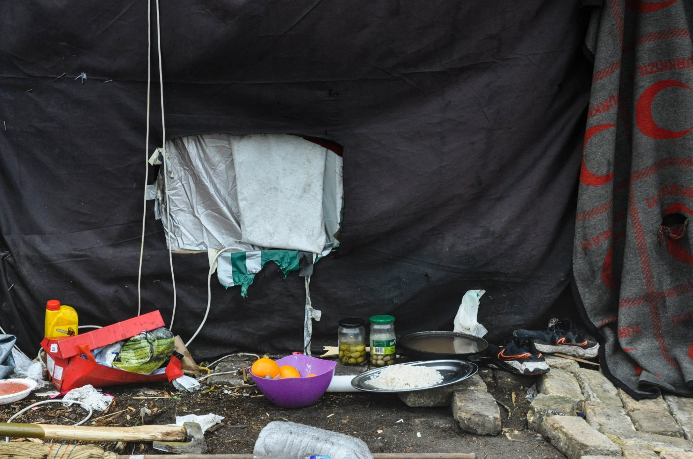
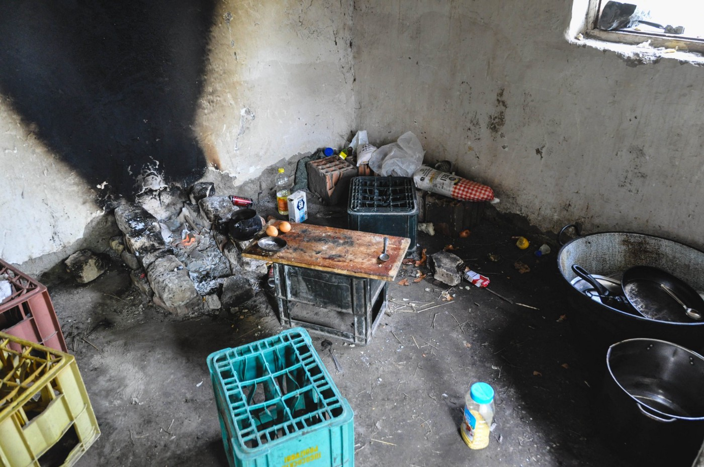
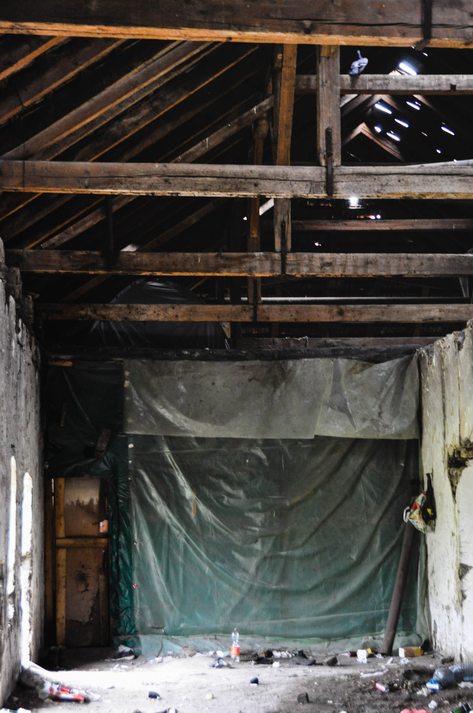

### AYS News Digest 8/7/22: “Historic” ECHR ruling slams Greece over refugee treatment
#### Authorities violated Human Rights in 2014 boat sinking incident / Currently 3\.6 million Syrians in Turkey / 41 people rescued at sea / UK feared to continue unlawful Rwanda plan

Photo: Klikaktiv
### Türkiye

More than 33,000 people and some 600 smugglers were detained in June, InfoMigrants [writes](https://www.infomigrants.net/en/post/41720/over-33000-migrants-detained-in-turkey-in-june?fbclid=IwAR12-jIXDXLhygEqO3HEd5tNXUI8WsZYWgNsVy5bnOulElLWSEuLyvGTlYM) referring to Hürriyet Daily News\. Around 4600 of those have been caught at sea\. The Turkish new agency DHA added that the current count of Syrians in Turkey is around 3\.6 million and more than 500,000 people have returned to Syria; the German news agency dpa adds half a million Afghans since the Taliban took over in August 2021\. In June alone, 16,000 undocumented people were deported, making almost 50,000 in the first half of 2022\.

### Greece

The European Court of Human Rights \(ECHR\) has [ruled](https://hudoc.echr.coe.int/app/conversion/pdf/?library=ECHR&id=003-7380289-10089391&filename=Judgment%20Safi%20and%20Others%20v.%20Greece%20-%20Sinking%20of%20a%20migrant%20boat.pdf&fbclid=IwAR3fvPt1QWE_iLDRcW0Xy-f27w3XAVu1SeGWTHguFNWSyROrVONfgtRMWxc) that the Greek government and authorities violated human rights in a boat sinking in January 2014\. They did not properly investigate the circumstances or meet the required standards to provide applicants and the relatives of the eleven dead people with protection\. The court further determined degrading treatment of twelve people who had to undergo body searches after arriving on Farmakonisi island\. Refugee Support Aegean [praised](https://twitter.com/rspaegean/status/1544999854757351425?fbclid=IwAR0qloPQi33hYkWEgmrHuXVGXE9yWQgxmHaUM8_hY05jy_9L2x0kG_A5vxI) the ruling as historic and a victory for human rights\.

■■■■■■■■■■■■■■ 
> **[Vassilis Tsarnas](https://twitter.com/VassilisTsarnas) @ Twitter Says:** 

> > #ECtHR: Judgment Safi &amp; Others v. #Greece - Sinking of a migrant boat off #Farmakonisi, resulting to 11 deaths. The Court found violations concerning the Right to Life &amp; the prohibition of #torture. 🇬🇷 to pay 330,000€
[hudoc.echr.coe.int/app/conversion…](https://hudoc.echr.coe.int/app/conversion/pdf/?library=ECHR&id=003-7380289-10089391&filename=Judgment%20Safi%20and%20Others%20v.%20Greece%20-%20Sinking%20of%20a%20migrant%20boat.pdf)
#StopPushBacks #PushBacks #RefugeesGr https://t.co/xexzbk0xZY 

> **Tweeted at [2022-07-07 09:13:33](https://twitter.com/vassilistsarnas/status/1544972881955799042).** 

■■■■■■■■■■■■■■ 

A woman was found dead from starvation in Greece\. Lawyer Alexandros Georgoulis says, “She was trying to hide for days from the police” in fear of being pushed back by police\.

■■■■■■■■■■■■■■ 
> **[Alexandros Georgoulis](https://twitter.com/GeorgoulisLAW) @ Twitter Says:** 

> > A few hours ago a #refugee woman was found dead from starvation. She was trying to hide for days from the police. The approach of the Greek government is deadly. #Pushback policy must stop! Till then we ll count victims. @[Tineke_Strik](https://twitter.com/Tineke_Strik) @[SteliosKoul](https://twitter.com/SteliosKoul) @[ClareDalyMEP](https://twitter.com/ClareDalyMEP) https://t.co/WVQFVC3QEE 

> **Tweeted at [2022-07-08 19:25:41](https://twitter.com/georgoulislaw/status/1545489315790200834).** 

■■■■■■■■■■■■■■ 

#### SERBIA

The Serbian collective Klikaktiv, active in advocacy and direct support to the refugees and people on the move, reports:
“This Sunday in the field sadly brought nothing new and nothing positive\. People whom we encountered in the field are getting more and more desperate\. On the one side, they are exhausted of the constant pressures and torture they experience at the EU borders, and on the other side, financially they are in greater problem because in the constant police actions they are being pushed back from the borders with Hungary, Croatia and Romania, all the way to Preševo, that is, the border with North Macedonia\.

In order to get back to the north of Serba, they need at least 200 euro for transport, mostly taxis\. Some people we spoke to relived these returns several times and feel completely powerless and robbed because of it\.

Photos: Klikaktiv

For years now we have been hearing about people who arrived to the border with Hungary and Austria, but were violently and without any consideration of their cases, pushed back to Serbia\.

These kind of stories put forward some clear questions, like the one asking what are exactly the borders of the EU and when exactly do the Member States decide some human rights apply to some human beings, while not to others? What are the limits of human suffering after which someone would be received as a human being who has found themselves on the territory and needs help? The answer to these questions needs to be universal — all people who find themselves on the territory of an EU Member State are guaranteed basic human rights, which in practice is not the case\.

The EU is paradoxically spreading and shrinking beyond its clear borders\. So, on the one side it is spreading its borders by posting Frontex and border police at the borders with countries that are not part of the EU, and on the other side, it scrutinises and investigates in detail its territory, all the way to Vienna, in order to kick the unwanted refugees outside of the EU\.

In the end, after the people share with us their suffering, in the field, we remain with an unpleasant question: ‘Why are they doing this to us and will they stop any time soon?’”

#### SEARCH AND RESCUE AT SEA

41 people have been rescued by Geo Barents from two fiber boats in distress in the Maltese SAR Zone, MSF reported, after an alert issued by Alarm Phone\.

■■■■■■■■■■■■■■ 
> **[MSF Sea](https://twitter.com/MSF_Sea) @ Twitter Says:** 

> > ⚠️ Urgent medical evacuations happened on board during the night. ⚠️
A survivor was suffering repeated seizures and needed specialized care. Currently, many survivors are in precarious medical and psychological conditions and need to receive assistance. 

📷@[michaelbunel](https://twitter.com/michaelbunel) https://t.co/XNkyXJXEes 

> **Tweeted at [2022-07-08 14:03:06](https://twitter.com/msf_sea/status/1545408133681627138).** 

■■■■■■■■■■■■■■ 

In Greek waters, an Israeli unmanned aircraft will patrol the Aegean from today for a period of six months\. It is a HERON\-type drone of the Israeli Aerospace Industry \(IAI\), which was leased by the European organization Frontex for six million euros, for the benefit of the Coast Guard, the Greek media reported\.

On Cyprus, 53 people who got off a vessel that Alarm Phone had reported about were received, but Cypriot authorities seems to have confirmed these people will be pushed back, announcing in the [media](https://www.sigmalive.com/news/local/978972/pafos-egkyos-gynaika-sto-nosokomeio-eftase-me-ploiario-metanaston?fbclid=IwAR18bdLyvHoZLQn1AAXEiijfaRT8jXOaARvKS_tPW2TrK7moUmCSD2Yqcnw) their return to Lebanon\.

In the meantime, the reception centre in Lampedusa is reportedly in horrible condition\.

■■■■■■■■■■■■■■ 
> **[GiusiNicolini](https://twitter.com/giusi_nicolini) @ Twitter Says:** 

> > Sono 2.100 le persone ammassate nel Centro di #accoglienza a #Lampedusa. Anche donne (4 sono gravide),bambini, malati e bisognosi di cure dormono per terra, dove pure mangiano, tra i rifiuti. I posti letto sono meno di 200. Potrebbero essere foto della #Libia. Ma no, è #Italia https://t.co/rKceI3layF 

> **Tweeted at [2022-07-08 08:32:53](https://twitter.com/giusi_nicolini/status/1545325032972451840).** 

■■■■■■■■■■■■■■ 

#### ITALY

**An appeals court in the southern city of Reggio Calabria will review admissible evidence in a trial against the former mayor of Riace**

As InfoMigrants [recalls](http://www.infomigrants.net/en/post/41788/court-to-review-evidence-in-appeals-trial-for-former-mayor?fbclid=IwAR18bdLyvHoZLQn1AAXEiijfaRT8jXOaARvKS_tPW2TrK7moUmCSD2Yqcnw) , the former mayor of Riace has been charged with criminal association, fraud, graft, embezzlement, bid\-rigging, false statements, and aiding and abetting migration\. An additional 17 people are standing trial with Lucano, on different charges, following an investigation by Locri prosecutors and finance police that led to the house arrest of Lucano in October 2018\.
#### FRANCE
### Tear gas and more trauma for Afghans

■■■■■■■■■■■■■■ 
> **[BLAST, Le souffle de l'info](https://twitter.com/blast_france) @ Twitter Says:** 

> > Violences et gaz lacrymo : le calvaire des réfugiés afghans

➡ [youtu.be/NAre4pUCGTk](https://youtu.be/NAre4pUCGTk)

Mercredi 6 juillet à l’appel des associations, des agents de l’#ONU sont venus constater la situation des #réfugiés afghans au parc de la Bergère à Bobigny. Reportage. #France https://t.co/qsuymYdCIq 

> **Tweeted at [2022-07-07 15:41:20](https://twitter.com/blast_france/status/1545070468884996101).** 

■■■■■■■■■■■■■■ 

### Criminalisation in a literal sense — banned and expelled with measures usually reserved for criminals

“I **n less than two months, two British guys that I often met in Calais, engaged day and night in helping people exiled on the Franco\-British border, were arrested, expelled and then banned from French territory\. In short, treated like criminals** ”, _Calais based journalist [Louis Witter](https://twitter.com/LouisWitter) reports\._

■■■■■■■■■■■■■■ 
> **[Louis Witter](https://twitter.com/LouisWitter) @ Twitter Says:** 

> > En moins de deux mois, la préfecture du Pas-de-Calais a fait de ces deux militants britanniques un exemple pour toutes celles et ceux qui, de l'autre côté de la Manche, souhaiteraient s'engager en France pour rendre la vie moins difficile aux personnes en transit à la frontière. 

> **Tweeted at [2022-07-07 19:10:09](https://twitter.com/louiswitter/status/1545123019093413891).** 

■■■■■■■■■■■■■■ 

The State surely thinks that chasing helpers and humanitarians will make less noise than the hunt for the people on the move that they engage in every day on the coast\. That it will certainly go unnoticed\. And the State is not wrong, he writes\.

“The French volunteers have experienced successive fines \(nearly 40,000 €\), and prefectural orders prohibiting them from distributing water and food\. For foreign volunteers, it’s pure and simple expulsion and a ban on returning\.”

■■■■■■■■■■■■■■ 
> **[Louis Witter](https://twitter.com/LouisWitter) @ Twitter Says:** 

> > Nik, militant britannique auprès des exilés, s’est vu délivrer une « interdiction administrative de territoire », habituellement réservée aux terroristes. Motif invoqué par le Ministère de l’Interieur ? « Ouverture de squats » et « actions revendicatives ».[nordlittoral.fr/148426/article…](https://www.nordlittoral.fr/148426/article/2022-07-08/affaire-du-squat-frederic-sauvage-un-militant-britannique-sous-le-joug-d-une?fbclid=IwAR1V1j-9Ew0KwQSslQfKkvk5MZG3rjoD7ZATN7pieRfYTYddfgV5fBEe8fE#l5ci1pauwp3i2a767yb) 

> **Tweeted at [2022-07-08 13:38:32](https://twitter.com/louiswitter/status/1545401951898288131).** 

■■■■■■■■■■■■■■ 

#### LITHUANIA
### Ignoring the ECJ decision, moving on with an even stricter policy

Just like the statements we heard these days coming from Hungary, a similar stance is present in Lithuania\. Their MoI stated the country “must defend itself”, and therefore — in spite of the recent ECJ decisions, “won’t back down from its decisions on migrants”\.

As the media [report](https://www.delfi.lt/en/politics/bilotaite-lithuania-must-defend-itself-wont-back-down-from-its-decisions-on-migrants.d?id=90636931&fbclid=IwAR0RS3tF0P1viVqZkrwSH6f171gICfUpBujJEibrAsA9E7D-z3hQslcE-9Y) , in her words, _the decisions taken by Lithuania were necessary not only for the country’s national security but also for the protection of the EU’s external border\._

More importantly, the minister stated that Lithuania’s actions had been coordinated with international institutions and the European Commission, adding that the current legal regulation on irregular migrants no longer matches the realities, therefore, **Lithuania is seeking to change the rules\.**

A reminder — the Court’s decision said no country should detain people just because they entered ‘illegally’\. See the decision here below and read more on this in the ‘Worth reading’ section\.

[](https://l.facebook.com/l.php?u=https%3A%2F%2Feur-lex.europa.eu%2Flegal-content%2FEN%2FALL%2F%3Furi%3DCELEX%253A62022CJ0072%26fbclid%3DIwAR0Ex_b9x5Ahlgd1c-TwRTSVzFI21YJ71CUO4B6qrM5KgxGZT2w_MjAF_Q8&h=AT3abzYCgxOrwN0rMlj_fHIMimCTqa39oO9fYF2fI9Tb1U-rfYNNViEG_l0gkg24U1STep9Lkkf3wsfCLvOKkMjbHfriOoogQKSguoH3tDbUbcKuso9pHs7-xGjmxlBxvWyVgWKR8uw1vdbCqz4Jqh87vn9JfJp3aEkJYadDs650GQbtmQ&__tn__=R]-R&c[0]=AT3gMbILkfF5kOeJkKV7TurL91Or6pxZavdaM9QYmzLK9mAPNyJcSxPTrysNOcWoki40fSGg57JdvlhuNnA51QLGfFMF3VrF4Pkdo0nM66mNb7YRzFquR5YtBIroFv23egPcv_N6CRkElCXZchUJPIuo7-6FrsCFWmbtNM33WU9PQUBhEIZWQ2QyNQR_wU10hxgaX9ATdWGg)

### UK

The Home Office keeps detaining new arrivals in detention, but also uses prisons, as the numbers are too big\. Movement for Justice reports they spoke to a detainee who has been held in prison four months past the release date\. Hence, the government plans to reopen unused facilities and open new detention camps\. Now that Prime Minister Johnson has resigned as Tory leader and also will pass on his goverment mandate, Movement of Justice fears that the criminalization of refugees will continue\.

■■■■■■■■■■■■■■ 
> **[Here to Stay UK](https://twitter.com/HeretoStayUK) @ Twitter Says:** 

> > Spoke to a detainee being held in prison 4mths past release date. He was told he couldn’t be moved to detention cause they filled up w/ cross channel refugees. @[ukhomeoffice](https://twitter.com/ukhomeoffice) keep detaining refugees on arrival. Numbers in detention are rising for 1st time in yrs (1/3) 

> **Tweeted at [2022-07-08 09:00:20](https://twitter.com/followmfj/status/1545331942798675969).** 

■■■■■■■■■■■■■■ 

Steve Valdez\-Symonds, refugee and migrants rights director at Amnesty UK, has made clear that expelling people for asking for protection on UK soil is unlawful\. “It’s a violation of the Convention to which this country agreed by which it, like others, is to take responsibility for people on its soil,” he underlines\. The deal was “utterly wrong” he concludes\. The summary of a Home Affairs Committee meeting on Wednesday on migration and asylum can be found on the Parliaments [website](https://committees.parliament.uk/oralevidence/10545/pdf/?fbclid=IwAR1-FPESTFMgl_OPgqziWeSwg79ke32bi2LumccbnaxuH6kYXfFPSRWFNt0) \.

■■■■■■■■■■■■■■ 
> **[Steve Valdez-Symonds](https://twitter.com/stevesymondsAI) @ Twitter Says:** 

> > Simply expelling people who’ve made claims on UK soil in attempt to make them &amp; their claims someone else’s responsibility is unlawful. It’s a violation of the Convention to which this country agreed by which it, like others, is to take responsibility for people on its soil. 1/12 

> **Tweeted at [2022-07-08 11:35:51](https://twitter.com/stevesymondsai/status/1545371078595321856).** 

■■■■■■■■■■■■■■ 

The criticism of the UK policy goes along with an analysis by five UN Special Rapporteurs, Statewatch [writes](https://www.statewatch.org/news/2022/july/un-special-rapporteurs-critical-of-uk-rwanda-deal/?fbclid=IwAR2NJ2EQ6xfuIEgfP7Qx5L8hLxL4nNXlgHQM60RDtCTfdqhmGQ3XsBhsEUQ) \. They stated concerns that the UK may breach obligations to protect victims of trafficking by not promptly investigating such cases and not providing adequate protection for them\. They further conclude the scheme might not meet the need for individual adjudication and lead to onward refoulment in Rwanda\. Experiences from the past have also shown some people had problems with delays with procedures and acess to asylum\. Some were even “forcibly expelled to neighbouring countries”\.
#### GENERAL

With the spike in criminalization of human rights defenders, a database has been set up with some drafts of the first cases in several countries\. You can contribute to the database with more information on the existing cases or by addding records of new ones:

IRC reiterated that over 1 million people reliant on the Bab Al\-Hawa border crossing for humanitarian assistance risk losing life\-saving healthcare without UN Security Council reauthorization\. Find their report here:

#### WORTH READING
- The European Court of Justice \(CJEU\) found Lithuanian legislation allowing mass detention and preventing asylum requests for irregular arrivals in violation of EU law\. Amnesty International reports on abusive practices by Lithuanian authorities\. A Polish court has declared pushbacks illegal as the no\-access border zone has been replaced with a 186 kilometer steel wall\.

[](https://l.facebook.com/l.php?u=https%3A%2F%2Fecre.org%2Feastern-borders-cjeu-finds-lithuanias-legislation-unlawful-amid-new-reports-of-abuses-polish-court-ruling-on-the-illegality-of-pushbacks-poland-replaces-a-no-access-zone-with-steel-wall%2F%3Ffbclid%3DIwAR3MO48lhaoLDBFUCwIiHCEcMwHykXVr3bJrFMhn_NcdzXuUXuQm1vzYE8Q&h=AT3oXv25ssGjuBxEiaBDjjoGF8wDjplOEw2gdjSOg7KOw70ShLwdyP08esJ62AsbDTaRsuxtEJWu3BXkOZwdXiszxXMygDwtJJoD39hcZGQLibLOuL9jrYj2mCpwOOOtlng3x84E9jsk6hDJUfSscOU4HE23Hok6kA&__tn__=R]-R&c[0]=AT3gMbILkfF5kOeJkKV7TurL91Or6pxZavdaM9QYmzLK9mAPNyJcSxPTrysNOcWoki40fSGg57JdvlhuNnA51QLGfFMF3VrF4Pkdo0nM66mNb7YRzFquR5YtBIroFv23egPcv_N6CRkElCXZchUJPIuo7-6FrsCFWmbtNM33WU9PQUBhEIZWQ2QyNQR_wU10hxgaX9ATdWGg)

- The latest Sustainable Development Goals report discusses the 5,895 people who died fleeing their countries in 2021

[](https://l.facebook.com/l.php?u=https%3A%2F%2Funstats.un.org%2Fsdgs%2Freport%2F2022%2F%3Ffbclid%3DIwAR1PahYTa3N1pKRlUSZ9hQjR8bcrwDUxvvb-fcZUpCOkuNnSpGGRIxkY1UQ&h=AT3n46VnS1G9prSfsZvHcLIJ2N6hh3dkhsX5J_g2wNXYOgoZu8Wknvhpng4eKPKVR1fKshAji500FeKFqd1X0bs8BHidvP7-X9ZrdJgWRKoZ4BGByvwTpLS1I_QGtQtQ9xaYSo6HPP_a9sw55usHntJGvlrib9jhByRVSgN8Jy0-rybHwQ&__tn__=R]-R&c[0]=AT0NbDOh8ocax4iaadJB4RGSNs1oORFq5bBXB9ueqF-mmzZ2L54qU1fWQ35wYdEP4BinoJCecU2nRZo0LGWhdcFy5mcWmv2cAfCyIgsVXUE_dEH1EBdyZGbJ_SqGHEGz2I7rdGHZUCLy6DGzQytliqZlujRcg1KhkEZ3BxFklI1gmwDBhCdaAgkO6_t8WXurPIYT5qPu2_7i)

- **Libyan authorities harass Sea Watch activists —** Sea\-Watch pilots search for shipwrecked refugees off the Libyan coast\. This is now over: the authorities in Tripoli demand a permit — wrongly, as an expert opinion shows\. See more in this article:

[](https://l.facebook.com/l.php?u=https%3A%2F%2Fwww.spiegel.de%2Fausland%2Flibysche-behoerden-drangsalieren-sea-watch-aktivisten-es-werden-noch-mehr-menschen-ertrinken-a-493c5760-601e-4efd-8347-078f0d82059a%3Ffbclid%3DIwAR2x7j_D0MVClouBzNCt6YTxj5TxKqfYqWdr0rgo9fSQ0W1BqNTa4b7sjoo&h=AT1-IBYOaHThT2HgXSWLLKiW8nnZZ_hM_KXl0sbaCuFb9WwxLQvMtsUO9QjrCPcujvW6lT6BPCbBJM1eYtBNKSO3mUA-rOw-R8ZOLSKymQiSo40dXeoNMkuwKz_V-74eq4a9ox3PlaP2qh3vaNQM1D5tMcuwoDhU_DpYexLnPAEw0iHS0Q&__tn__=R]-R&c[0]=AT05TO9EhfOEMs457jH6lp_KCATIFqRkqs69w_x3px-y6r2ylZwFHfELRQCYs7woGmBU7aBkkIf_-Aob4FQ1B2jQMCZfxBPeD2o3Qf3d3zsYAv2zE40B2bhVQF6YVP24SPYdeAqHxR78oXI6nXQS5ejg6oy56ZVgsDeCesVVot3J3_6ayQ0yHBYNaGj5DJLQnXDuF36yKIXM)

**Find daily updates and special reports on our [Medium page](https://medium.com/are-you-syrious) \.**

**If you wish to contribute, either by writing a report or a story, or by joining the info gathering team, please let us know\!**

**We strive to echo correct news from the ground through collaboration and fairness\. Every effort has been made to credit organisations and individuals with regard to the supply of information, video, and photo material \(in cases where the source wanted to be accredited\) \. Please notify us regarding corrections\.**

**If there’s anything you want to share or comment, contact us through Facebook, Twitter or write to: areyousyrious@gmail\.com**

_Converted [Medium Post](https://medium.com/are-you-syrious/ays-news-digest-8-7-22-historic-echr-ruling-slams-greece-over-refugee-treatment-46b61b217bc0) by [ZMediumToMarkdown](https://github.com/ZhgChgLi/ZMediumToMarkdown)._
