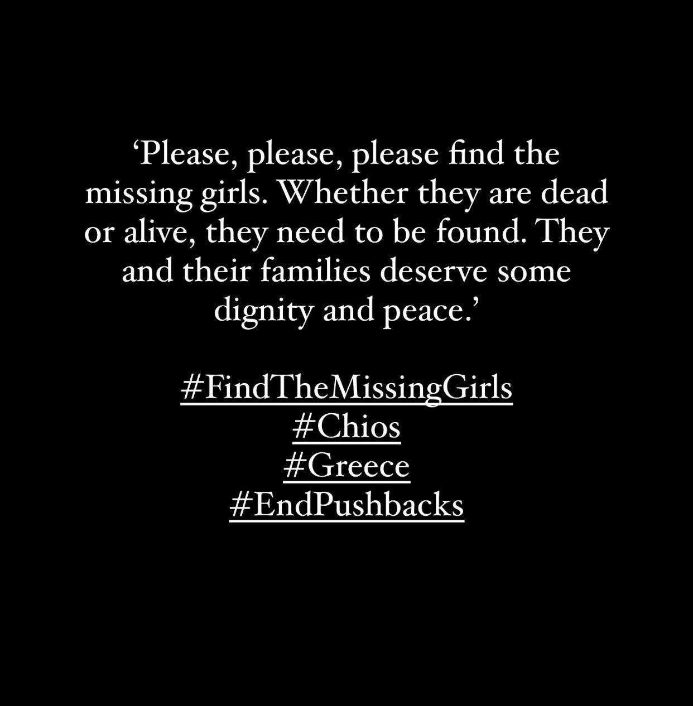

### AYS Special from Greece: Immediate Search and Rescue of Civilians Needed Now
#### In most functioning democracies search and rescue within the territory of the country does not require the intervention of the national ombudsman, but Greece is no ordinary country\. After the distressing discovery of [a Somali woman who had died from hunger and thirst on the 8th of July](https://astraparis.gr/pethainoyn-avoithitoi-sta-voyna-tis-chioy-prosfyges-kai-metanastes/?fbclid=IwAR3TDNve3KEE9nHR15zdbWlloiXMWDZFf-qD-4588WCPe7S_g_Q2rVYy2_s) two more women from Somalia are also missing\.

\(message sent from friends of the missing girls\)

> We were alerted of three women that were stuck in the mountainous forest of Kardymyla, Chios by an NGO on another island and that one lady was ill and reported to be in a coma\. Different agencies and organizations were contacted by a few volunteers in Chios to try and support them\. Later on we found out that this woman had sadly died and her body had been found\. Local news reported she died due to starvation and a lack of water as she hid in the forest, having arrived five days prior\. 

> Since then there has been communication with the friends and family members of the three women who are concerned that two other women are still outside, who they are now presuming may be dead\. 

> — _Madi Williamson, Nurse and Human Rights Defender_ 

They arrived with a group of approximately 30 people on the 29th of June but hid from authorities for fear of being illegally pushed back to Turkey\. 20 people from this group appear to have been identified on 1st and 2nd of July and transferred to the covid quarantine facility in Lefkonia\. Eight other people from the group were pushed back to Turkey including one man who was with the two missing women and a 16\-year\-old boy\.

> The friends and family report that there has also been contact from people who arrived with the ladies and on this boat to Chios on the 29th of June who were pushed back to Turkey\. 

> **Those that were pushed back report that the women were deteriorating in health due to a lack of food and water and the journey and they were all extremely scared of being pushed back and tried to hide\.** — _Anonymous aid worker_ 

The UNHCR, as well as citizens, gave to the police and the port authority of Chios specific reports and information detailing the location of the people and asked for a search and rescue operation to be launched yet the port authority stated it was outside their jurisdiction\. The police stated that the investigation was ongoing despite the fact that there was no evidence of a search taking place and had initially asked what “kind of people” were being reported missing\.

> Back in 2015 refugees were welcomed on the islands of the Aegean, they were given blankets, food, met with solidarity\. In 2022 they hide from the police fearing pushback and in their efforts to avoid this dying from starvation\. The woman who passed away had no doubt survived so much to reach Greece, struggled and fought to reach safety and to practice her legal right to claim asylum\. We see that the approach of the Greek government is deadly and, until this stops, every day we will reach — as a society, as Europe — a new low for our values counting more and more victims\. — _Alexandros Georgoulis, Lawyer_ 

The brother of one of the three women, who lives in another European country, will come to Chios tomorrow to view the body of the deceased woman and state whether she is his sister as her identity is still unknown\. A harrowing journey for any family member to have to make\.

[In February of this year five people from Somalia were among those who froze to death](https://www.dailysabah.com/politics/eu-affairs/somalia-urges-probe-into-death-of-citizens-after-greek-pushback) at the Greek\-Turkish border along the Evros river prompting the Somali Government to intervene and call for an investigation by UNHCR and both countries governments\.

[Today the Greek Ombudsman has called for an immediate intervention regarding the two missing women](https://astraparis.gr/paremvasi-toy-synigoroy-toy-politi-gia-tin-tychi-ton-trion-gynaikon-prosfygon-sta-kardamyla-chioy/) , having received a letter from the Greek Helsinki Monitor, and have requested further information from the Chios police\.

Situations such as this are exacerbated by the fact that people now fear speaking out about the situation in Greece due to the increasing criminalization faced by those who work in solidarity with asylum seekers, a process designed to have exactly this effect\. The criminalization of solidarians not only negatively impacts the lives of those who face court cases — stress and anxiety, damage to mental wellbeing, negative repercussions for personal relationships, limited ability to work, potential difficulty in gaining future employment — but also, and most importantly, individuals on the move who are left without advocacy at times of crisis when their lives hang in the balance\. It is also thought that [the current practice of reporting the location of new arrivals to authorities](https://www.efsyn.gr/ellada/koinonia/351677_kryfto-toy-thanatoy) so that solidarians can go to the spot to offer support — food, water, protection from pushbacks — without fear of prosecution is now preventing people from sharing their location with those who could help them to survive\.

The Greek Government’s policies in this regard are only adding to their reckless endangerment of people’s lives and the long list of deaths — mothers, fathers, sons and daughters — who have lost their lives on Greek territory and at Greece’s borders as a direct result of them\. The recent ruling of the European Court of Human Rights on the Farmakonisi case has confirmed that they can indeed be held accountable for their lack of action when people’s lives are in danger\.

> NGO workers, volunteers, family and friends of the women and members of the Somali community are requesting for a thorough search and investigation to be conducted to locate the two missing ladies and also some transparency and accountability over the situation\. The practice of pushbacks needs to end as, not only does it violate human rights, it causes death and harm\. — _Anonymous aid worker_ 

**_Report by Emma Musty, AYS, in collaboration with an anonymous source who wished not to be named due to the real and present threat of criminalization\._**

**Find daily updates and special reports on our [Medium page](https://medium.com/are-you-syrious) \.**

**If you wish to contribute, either by writing a report or a story, or by joining the info gathering team, please let us know\!**

**We strive to echo correct news from the ground through collaboration and fairness\. Every effort has been made to credit organisations and individuals with regard to the supply of information, video, and photo material \(in cases where the source wanted to be accredited\) \. Please notify us regarding corrections\.**

**If there’s anything you want to share or comment, contact us through Facebook, Twitter or write to: areyousyrious@gmail\.com**

_Converted [Medium Post](https://medium.com/are-you-syrious/ays-special-from-greece-immediate-search-and-rescue-of-civilians-needed-now-84cab804c0a2) by [ZMediumToMarkdown](https://github.com/ZhgChgLi/ZMediumToMarkdown)._
