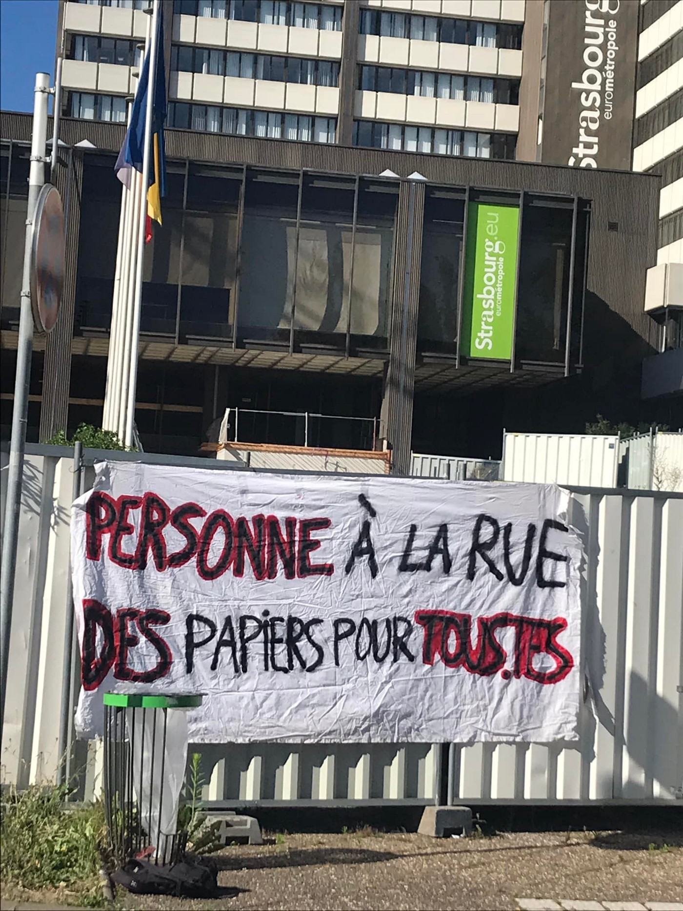
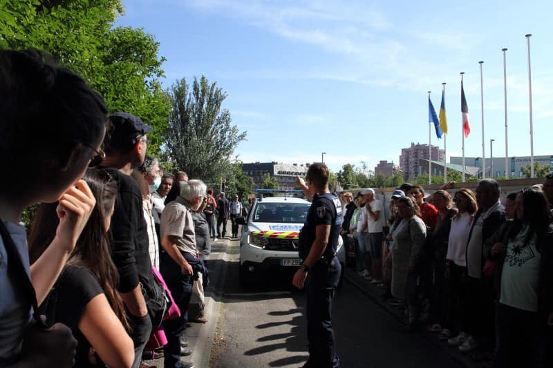
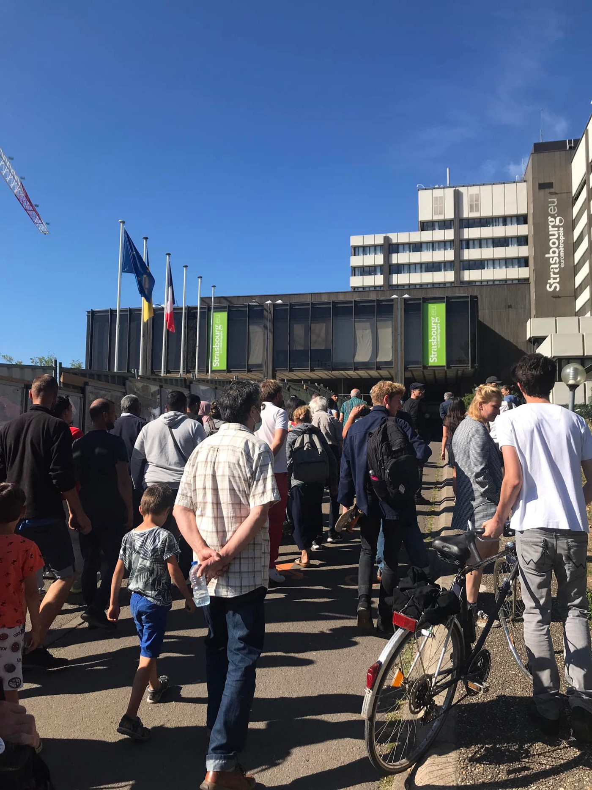

### AYS Daily Digest 12/07/22: People seeking asylum in Greece murdered by governmental neglect
#### One woman tragically and needlessly died\. The other two women remain missing / People still stuck on board Geo Barents / Syrian aid access resolution expires amid UN Security Council standoff / What Germany’s asylum reform means for people with a ‘Duldung’ / & more reporting and news from our info team

In Strasbourg, fighting for a chance for those without regularised stay \(Photo: D’ailleurs Nous Sommes d’Ici 67\)
#### **FEATURE**

A woman has died on Chios from starvation and dehydration\. Fearing a pushback to Turkey upon her arrival, she and two other women hid in the forest for five days before contacting NGO workers\. Too scared to send their location in order to receive medical aid, one woman tragically and needlessly died\. The other two women remain missing\.

■■■■■■■■■■■■■■ 
> **[Ruhi Loren Akhtar](https://twitter.com/RuhiLoren) @ Twitter Says:** 

> > A woman died in #Chios Island, Greece today due to starvation, no water and the poor conditions as she hid in the forests after arrival fearing #pushback to Turkey. 

People seeking asylum are being murdered in Greece as they arrive.

#EndPushbacks #Greece  #RestInPeace #Murder https://t.co/qCoOcgJ8vn 

> **Tweeted at [2022-07-08 22:41:12](https://twitter.com/ruhiloren/status/1545538521112379392).** 

■■■■■■■■■■■■■■ 

The deflection of responsibility and accountability by Greek authorities amounts to murder through conscious inaction\. Chios’ port authority, when contacted by locals and UNHCR, claimed that the plight of these women was outside of their jurisdiction\.

See yesterday’s special for more information — ‘In most functioning democracies search and rescue within the territory of the country does not require the intervention of the national ombudsman, but Greece is no ordinary country’:

Don’t miss reading our **AYS Special from Greece: Immediate Search and Rescue of Civilians Needed Now:**

#### SAR

314 people, including children, who were on the decks of [\#GeoBarents](https://www.facebook.com/hashtag/geobarents?__eep__=6&__cft__[0]=AZVgmth69BF_xcDeuSrIk26v2TclejaX75Z8QvP_3TI1wwsdpnGaMFVU9OepzW0kTi_MnXdDxm3UOFFu07xv_2J3MNIFAwfn8RRNvBz816DqH1xjiXESR1QTER4kida7BwJKFL1MQSfwihxcLG4Y9_lcMe8kwMwy4BPYSz5R58K9potbGy1SBC1Iyhv9lRR3Tb4&__tn__=R]-R) , waiting for a place of safety, finally find a place to land…

■■■■■■■■■■■■■■ 
> **[MSF Sea](https://twitter.com/MSF_Sea) @ Twitter Says:** 

> > 🙌 After almost 5 unnecessary days of waiting, our 314 survivors will disembark in the port of #Taranto in Italy! 
What a relief after all the traumatic experiences they went through. https://t.co/FMcwFN8uAK 

> **Tweeted at [2022-07-11 21:10:10](https://twitter.com/msf_sea/status/1546602773629788163).** 

■■■■■■■■■■■■■■ 

#### **GREECE**

A child, whose body was found on 7th July in a truck at the port of Igoumenitsa, remains unidentified\. The boy carried no phone or documentation, and is presumed to have died from the high temperatures in the cargo truck he had snuck into\.

■■■■■■■■■■■■■■ 
> **[Epirus Post](https://twitter.com/EpirusPost_GR) @ Twitter Says:** 

> > Αγνώστων στοιχείων το παιδί που βρέθηκε νεκρό στο λιμάνι • EpirusPost • Ειδήσεις, Ιωάννινα, Άρτα, Πρέβεζα, Θεσπρωτία [epiruspost.gr/agnoston-stoic…](https://www.epiruspost.gr/agnoston-stoicheion-to-paidi-poy-vrethi/) 

> **Tweeted at [2022-07-07 09:44:37](https://twitter.com/epiruspost_gr/status/1544980698708205568).** 

■■■■■■■■■■■■■■ 

### **Frontex, the Farmakonisi shipwreck**

Whilst borders remain so aggressively policed, such tragedies will inevitably continue\. In their latest press release, Frontex has announced their plan to deploy unmanned aircraft to patrol the Eastern Mediterranean, support the Hellenic authorities, and ‘support the efforts of saving lives of people who are very often victims of smugglers and traffickers’\.

In a press conference about the Farmakonisi shipwreck that took place on 11th July, Giorgos Tsarbopoulos \(UN High Commissioner for Refugees\) stated that ‘s _ea borders \[…\] by nature risk human lives\. The protection of human life takes priority and must be protected before one even speaks of protecting borders_ \.’ The language used by Frontex and the Hellenic authorities suggests they agree with this\. Their actions prove otherwise\.

Eight years after the shipwreck in 2014, there is finally a modicum of justice — The Strasbourg Court has recognised the causal link between the negligence of the Greek state and the deaths of 12 people\. As Konstantinos Tsitselikis, Professor of Human Rights Law at the University of Macedonia, stated at the conference:

> ‘ _The criminal responsibility of State authorities is superseded by the need to prevent the arrival of refugees and migrants on Greek territory with any means\. International and Greek law are selectively implemented’\._ 

The case will be re\-opened in Greek courts to investigate and attribute criminal responsibility\. Tsitselikis adds that alongside pushbacks, the infamous ‘black vans’ that carry out kidnappings in Athens and Thessaloniki continue to operate\. As he asks, _‘What of the rule of law? Will there be accountability_ ?’

Read more [here](https://rsaegean.org/en/key-points-press-conference-farmakonisi-shipwreck/?fbclid=IwAR23GuSdzHKbMhpteAASwPj-1Chgc8B-IwkxXadJt2V6PrKMu3G8EOIh_pc) \.
#### NORTH MACEDONIA
### People found in a truck on the border

North Macedonian police said they had discovered 87 people in a van on Saturday on a highway in the south of the country\. Two Macedonians, suspected of being smugglers, were arrested\. The people were found crammed in a truck, as usual, unfortunately, [during](https://www.infomigrants.net/en/post/41824/north-macedonia-police-discover-87-migrants-in-truck?fbclid=IwAR3pjI5GryxBwGjQq3pcMpxgZFgr-Ws4yXdxQchFmUNeS81IXFNlYj_Roco) a “routine check on a highway near the border town of Gevgelija\.”
#### CROATIA
### A new modus operandi?

In Croatia, fewer people are staying at the reception centre, and fewer people arrive in the Free Shop of our organisation in Zagreb\. The main reason for this is the fact that most of those who wish to move on and continue on their way to the Western EU manage to do so, still illegally and in the only way they can, but now without most of them being pushed back by the Croatian police\. The recent practice is that many people trying to enter Croatia, or those who have been found in the country by the police, are being given a document that stipulates seven days for them to leave the European Economic Space, during which they can freely move around the country, basically giving them the option and possibility to leave in the same way most entered — along the so\-called green borders, meaning entering Slovenia and other countries illegally\. This means more people get to pass through or at least try without being pushed back violently, but again, this poses a question — what will become of their request for international protection once they reach another EU Member State?
#### GERMANY
### What Germany’s asylum reform means for people with a ‘Duldung’

An overview has been published of what the new law means for all those with a temporary residence document which enables them to reside legally in Germany for a limited period of time while their obligation to leave still stands, Duldung\. Multiple such documents have been repeatedly extending temporary suspensions of deportations and are widely considered a barrier to integration\.

The InfoMigrants article explains:

> What does the new law mean? 

> Which groups can apply for a residence permit? 

> Who receives a ‘Duldung’? 

> How many ‘tolerated’ and those ‘obliged to leave the country’ are living in Germany? 

However, what reports, both the German ones and this one, skip mentioning is the fact that in this same new law the period for pre\-deportation detention is extended from three up to SIX months, which looks like a concession to the conservatives and right\-wingers to get this law accepted\.
#### FRANCE

Follow the court decision and find out more in this thread:

■■■■■■■■■■■■■■ 
> **[Human Rights Observers](https://twitter.com/HumanRightsObs) @ Twitter Says:** 

> > En décembre 2021, 6 personnes exilées ont saisi la justice afin d’attaquer la légalité de 2 expulsions à Grande-Synthe, avec l'aide de Maître @[GiustiJ](https://twitter.com/GiustiJ).
Demain, le Tribunal judiciaire de Dunkerque rendra sa décision.
La vidéo récap pour en savoir plus (suite en thread)⬇️ https://t.co/LPTre5bwSJ 

> **Tweeted at [2022-07-11 13:44:31](https://twitter.com/humanrightsobs/status/1546490622336503809).** 

■■■■■■■■■■■■■■ 

France witnesses more evictions:

■■■■■■■■■■■■■■ 
> **[Human Rights Observers](https://twitter.com/HumanRightsObs) @ Twitter Says:** 

> > https://t.co/NCIMXEUyr5 

> **Tweeted at [2022-07-11 13:44:55](https://twitter.com/humanrightsobs/status/1546490722249068551).** 

■■■■■■■■■■■■■■ 

Find our newest report from France in the Specials sections, tomorrow\!

In the meantime, in Strasbourg, meeting with the representatives of the City of Strasbourg due to eviction and an announcement that people will be placed in a gymnasium sports hall… D’ailleurs Nous Sommes d’Ici 67:

Photos: D’ailleurs Nous Sommes d’Ici 67
#### POLAND

**Judge Anna Jacyniewicz from the District Court in Białystok blocked the initiation of an investigation into the case of the Iraqi man who died as a result of the inactions of the Polish Border guards and Belarusian officials\.**

> **The court protects the perpetrators\.** 

> We have hard evidence that on the Polish\-Belarusian border, Border Guard officers, together with officers of the Belarusian regime — contributed to the death of a young man\. 

> We have photos, videos, license plates of police cars, images of Polish officers and photos of the victim’s body\. Meanwhile, the Bialystok prosecutor’s office claims that there is no evidence that any man died and that there were some Polish officers present\. 

> The Bialystok prosecutor’s office has been deliberately preventing even the initiation of an investigation into this case for many months\. Now in these disgusting actions their disposition towards the ruling judge Anna Jacyniewicz supported, who with premeditation issued a ruling preventing the opening of an investigation and prosecution of the perpetrators, a ruling in which Judge Jacyniewicz Bezczelnie is lying\! — [Ośrodek Monitorowania Zachowań Rasistowskich i Ksenofobicznych](https://www.facebook.com/osrodek.monitorowania/?__cft__[0]=AZUjVRmizH7GttSLGZdiIgWmK7OB47OC2-RuUXaFXYu0qqWN6cfzSpip0b1x2s9tEWv2sGsLv5ZlUaAv5dIPpq6uasGuWVJVJezd5ev38qXvbcbS47Qv_z3C1CVRafFSo15-qgGCoGN1X1o7tnSku51R&__tn__=-UC%2CP-R) _reports_ 

#### UK
### Rwanda case adjourned

The Divisional Court has granted the application for an adjournment of the Rwanda case until September, it was reported\.

“However the Government has refused to rule out flights in the interim, before the lawfulness of the policy is determined by the courts,” Care for Calais reported\.

> We are currently working with more than 20 people who have been detained and issued with Rwanda notices since the last court case, and many of those from before remain detained, exhausted and alone, and terrified for what the future might bring\. They have suffered some of the very worst things that can happen on this planet\. They have appalling physical and mental scars, and now face the threat of further extreme trauma\. Some have now been in detention more than six weeks and urgently need to be released\. 

> The Rwanda plan is brutal\. Given the more humane and effective options available is this really what we as a compassionate country want to do? 

#### GENERAL
### Syria — Aid access resolution expires amid UN Security Council standoff

As Russia uses its veto, diplomats fail to find a last\-minute compromise to keep aid flowing to millions in the rebel\-held northwest\.

> “Members of the UN Security Council have put politics ahead of the lives of Syrian civilians, most of them children and women, who are in urgent need of life\-saving assistance\.
 

> There is simply no justification for restricting aid to Syrians at a time when humanitarian needs are at their height… The job of the Security Council is to protect civilians, not to be the direct cause of suffering and loss of life\.” — _said a statement by a group of Syrian and international NGOs working in the northwest_ 

As the New Humanitarian [reports](https://www.thenewhumanitarian.org/news/2022/07/11/Syria-aid-access-resolution-expires-amid-UN-Security-Council-standoff?fbclid=IwAR3XC6k8EtTELj591mb0MsekerRK2Bn33VDv4ygCjg9zE9CqUxNInzCgcJM) , the UN and many other aid organisations say the role it plays in [coordination, logistics, and procurement](https://www.thenewhumanitarian.org/analysis/2022/06/27/Is-Russia-about-to-block-a-key-aid-route-into-northwest-Syria) of aid will be extremely difficult to replace, at least in the short term\.
#### WORTH READING
- Begüm Başdaş talks with Der Spiegel reporter Giorgos Christides on the human rights violations at the external borders of the EU — link [here](https://www.youtube.com/watch?v=IHIUVJ0SVhc)
- A podcast about how Borderline Europe on Lesvos assists refugees\. One particular aspect of the podcast is about a family who they support\. The family have been on Lesvos for six years, and have had multiple asylum rejections\. Unrecognised, they cannot be deported nor leave the island\.

■■■■■■■■■■■■■■ 
> **[Eleni Konstantopoulo](https://twitter.com/EleniKonstanto) @ Twitter Says:** 

> > A podcast on how @[BorderlineEurop](https://twitter.com/BorderlineEurop) on #Lesvos assists #Refugees. A reference to a family they support, struck me; The family is 6yrs on the island, not recognized, multiple #asylum rejections, can't be deported, can't leave the island. 
Enforced #detention with no #HumanRights❗👇 

> **Tweeted at [2022-07-11 14:38:08](https://twitter.com/elenikonstanto/status/1546504114208636930).** 

■■■■■■■■■■■■■■ 

Podcast [here](https://civilfleet.libsyn.com/episode-28-refugee-life-pushbacks-and-criminalisation-on-lesvos)
- Mixed Migration:

[](https://l.facebook.com/l.php?u=https%3A%2F%2Fmixedmigration.substack.com%2Fp%2Fjuly-4-11-2022-mixed-migrationhebdo%3Ffbclid%3DIwAR1HAe7usb10A_O7bh1UaF6xWU011v8MLrDlUagnf_9pVW03ovp64mCl7Uc&h=AT37G1KHgrNsTzZnqE7iX--zlzsOFxZ5T1x679OXyOJcU7kiNkntFrL7s83r6MB64lHuLCEnc8KP0Notbg-iEcoc-fkdLqJwASD75t12I8gg4AsL4gvPl06OhUk_-frZ-Mo0K-DfI5Qm3_CuLQJiM-w5vNFv0GXB640neLTkdg2yoJTn3Q&__tn__=R]-R&c[0]=AT0NWUXnX7pTYKSw7A8zlX7UUO9B7e-rVXVZSNc13YDbMrm2TB8G2MML2YczvQkme2YhovvXnd4oel6sknFiB6_kdXw-tB0Xwws4m3uRnJU1Qk5D3BJJWz90VxLfQrSz18efZc4YoKeH3bUe5n9C71RbKyOw9NmAUlzq93Yt5JBMapzkSvp2GgeTKCdVeUSdAmjr9uxN04oS)

> Faces without a trace, the second border tragedy 

> Their names and faces are known, but not their traces\. 

> \-Where are they??\- 

[](https://l.facebook.com/l.php?u=https%3A%2F%2Fwww.canarias7.es%2Fnacional%2Fdesaparecidos-salto-melilla-20220708114015-ntrc.html%3Ffbclid%3DIwAR1m4ky_OXiDFIIiLxPeEizonKfD50z17khJOhMZEbVRfIPf7HTPoLERZdU&h=AT1xj312mS8w8YgznWDZGl7eXTRefvQjkEXCMlEeFRMFStlM3Q3YLesI707dWiVeofiF6xW6K6G7yuYYiSIuWEbpfKhDa53WJX_S2otYsk8OH1Ro7lu21Anp0vlIX-6ioif23gM1LvwDnkFRyNPnz-2EGrMetuoiGyB_x7j_4sFcXi8-2A&__tn__=R]-R&c[0]=AT1X89NqIGKV8xuOdP4_8Ac-phBikzhUpczAyH56vXLAKYkvapr6eOiagpnId3xgnIdLxF-56TMeIuqnG-VsK4ybC76Vzbcypl5hR606279A_0yW39DW9GGTI2iMj6IdC5bKOFbFYRxWBUkrbCe3FPwn7IHueoeC9yQagb-w6p0rpwoyMSKbsgWksHNk0vWTZxbCcXDW1gH4)

**Find daily updates and special reports on our [Medium page](https://medium.com/are-you-syrious) \.**

**If you wish to contribute, either by writing a report or a story, or by joining the info gathering team, please let us know\!**

**We strive to echo correct news from the ground through collaboration and fairness\. Every effort has been made to credit organisations and individuals with regard to the supply of information, video, and photo material \(in cases where the source wanted to be accredited\) \. Please notify us regarding corrections\.**

**If there’s anything you want to share or comment, contact us through Facebook, Twitter or write to: areyousyrious@gmail\.com**

_Converted [Medium Post](https://medium.com/are-you-syrious/ays-daily-digest-12-07-22-people-seeking-asylum-in-greece-murdered-by-governmental-neglect-73e4ceb5b556) by [ZMediumToMarkdown](https://github.com/ZhgChgLi/ZMediumToMarkdown)._
