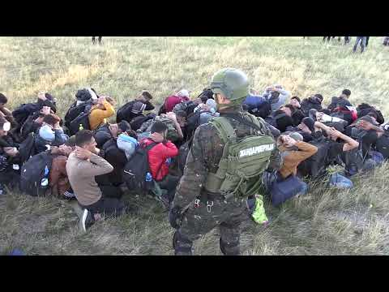
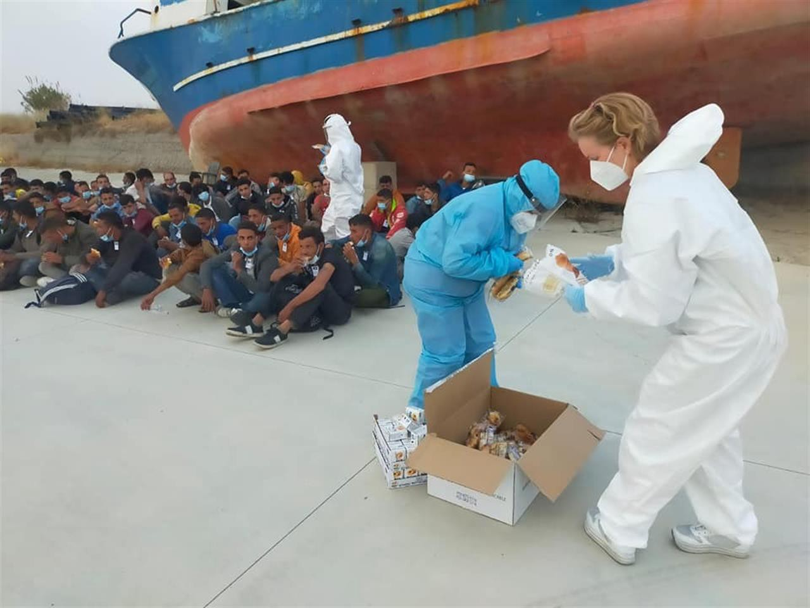

### AYS Daily Digest 13/07/22: The EU strikes a new anti\-trafficking deal with Morocco
#### Deportations on the rise from Turkey to Afghanistan / In Serbia, police boasts with the same shocking images we’ve seen in Libya / France: evictions on the outskirts of Paris / Italy: Regular landings in Roccella Jonica, ‘the Lampedusa that Italy ignores’ / & more news

_A handout photo made available by a local resident shows hundreds of migrants crossing the Spanish and Morocco Melilla border near Nador, Morocco, 24 June 2022 \| Photo: EPA/STRINGER_

The EU has struck a new ‘partnership’ on immigration with Morocco, in spite of the violence exacted by Moroccan authorities in Melilla last month\. The deal “ _provides for support in border management, strengthening police cooperation, and awareness campaign on the dangers of illegal immigration and boosted cooperation with EU agencies_ \.” The announcement, made by the European Commission, seeks to combat “t _he rise of new, extremely violent strategies, adopted by criminal networks_ \.”

Morocco’s partnership with the EU, prioritised over investigating the events of the 24th June, exemplifies an approach to migration that prioritises numbers over people\. The EU executive stressed how Morocco blocked over 26,000 ‘irregular departures’ and dismantled 100 trafficking networks so far in 2022\. Numbers, not people, is what the EU executive chose to stress\.

> This partnership comes as the head of Frontex has ‘warned’ that the EU must “ _not wait until we have a crisis at our borders\. We… need to reach out earlier on_ ”\. 

More [here](https://www.infomigrants.net/en/post/41842/eu-anticipates-potential-new-migration-waves?fbclid=IwAR39wuHtFeA1aLDl_nRswMkhXrijVB7NqpXhQ4KdiJK4MAKJGP-QHHb0ylw) \.

On 12th July 2022, the European Parliament’s Justice Committee’s working group on Frontex to discuss Article 46 \(The Management Board expects that, pursuant to Article 46\.

■■■■■■■■■■■■■■ 
> **[Border Violence Monitoring Network](https://twitter.com/Border_Violence) @ Twitter Says:** 

> > 1/ Yesterday, @[EP_Justice](https://twitter.com/EP_Justice) working group on @[Frontex](https://twitter.com/Frontex) met on Art. 46 or when does [Frontex](https://twitter.com/Frontex) finally suspend or terminate operations in countries where human rights are violated? 🌟 Highlights 🌟 https://t.co/mQw7fgd0zD 

> **Tweeted at [2022-07-13 10:15:02](https://twitter.com/border_violence/status/1547162679453925376).** 

■■■■■■■■■■■■■■ 

#### **SEARCH AND RESCUE AT SEA**

**In Morocco:** 257 people have been returned to the Moroccan shore from the Mediterranean and the Atlantic between 9th\-12th July, report the Moroccan Royal Navy\. In June, at least 23 people trying to climb the border fence between Morocco and Melilla, many at the hands of the Moroccan police\. _MAP_ news agency suggest that the intercepted individuals may have been pulled back more than ‘rescued’\. More [here](https://www.infomigrants.net/en/post/41873/moroccan-navy-bring-257-migrants-back-to-shore?fbclid=IwAR2Rxih5_OtcCjeh4_6bYdYtAf9Qz66ENpJwXa6e7Kz6KtpI-r6KbmPsLPY) from _InfoMigrants_ \.

**In Libya:** IOM reports that nearly 300 people were returned to Libya last week\. Since January 2022, at least 10,200 people have been returned\.

Sea Watch reports that over 32,500 people were intercepted fleeing to Europe and pulled\-back to Libya in 2021\. A detailed report from _SOS MEDITERRANEE_ details the last two weeks in the Mediterranean, in which over 800 people have been assisted or rescued by civil rescue organisations, and a general update on maritime search\-and\-rescue\.

> Women, men and children continue to drown in the central Mediterranean, and SAR NGOs continue to be targeted by authorities\. 

Read the report in full [here](https://en.sosmediterranee.org/news/eyes-on-the-central-med-42-repeated-tragedies-at-sea-women-children-and-men-drown/?fbclid=IwAR2slMdy-vZjWrVfByFTFvD6F3kZjjmfom0JQCBZZNKeTjM4TqkgZ1r8Sx8) \.
#### **TURKEY**
### **Deportations on the rise from Turkey to Afghanistan**

Last week roughly 900 Afghans were deported from Turkey to Afghanistan, and AMASO have reported that this number is increasing\. Consequently, a climate of increased fear has taken hold amongst Afghan refugees living in Turkey\.
#### **SERBIA**
### Repressive apparatus in place, police boasts with the same images we’ve seen in Libya

](assets/551b94d3fe7e/0*gKaqGYCwsh0fU8CR.jpg)

source: [https://www\.subotica\.com/](https://www.subotica.com/)

The Serbian minister of police visited the are where these images were made, and made the following statement:

“No smuggling gang will pass without being discovered, smashed and their members punished in the accordance with the law\. In Serbia, nobody can go using weapons unauthorized and trade with people\. Serbia will not allow its territory is a place where all sorts of bandits and the scum of entire Asia is gathering\. Serbia is not a parking lot for migrants and ill not allow our way of life is in any way endangered due to the activities of traders of people’s misery\.”

However, it is the police that often has the strongest ties to the ongoing criminal, and from both sides, the victims and targets are people on the move\. So now, some NGOs and civil sector actors demand an investigation into the connection of smugglers and highly positioned people in the Serbian Ministry of Police\.

As in some other areas along the Balkans, the smuggling here also takes place with the knowledge, support and part taking \(and profit, of course\) of the police\. Hence, it seems the police is the one who is responsible for jeopardising both the people on the move and destabilising any possible security and peace of the locals\.

**APC reports that an increasing number of people are entering Serbia from North Macedonia\.** Over 1000 individuals, mostly from Syria, Pakistan and Afghanistan have been placed in Preševo reception camp\.

■■■■■■■■■■■■■■ 
> **[Azil u Srbiji Asylum Protection in Serbia](https://twitter.com/APC_CZA) @ Twitter Says:** 

> > Preševo, 07.11.2022. Increased influx of refugees entering Serbia from North Macedonia. Over 1000 people, mostly from Syria,Pakistan and Afghanistan, placed in Presevo reception camp alone. Besides crossing along green borders, people also move in groups along the E75 highway. https://t.co/9bB4EcDSP3 

> **Tweeted at [2022-07-13 13:18:10](https://twitter.com/apc_cza/status/1547208765375750144).** 

■■■■■■■■■■■■■■ 

#### **ITALY**
### **Violence at the Pian Del Lago CPR in Caltanissetta**

The automatic repatriation of citizens of Tunisian origin leads to violence against detainees\. Multiple individuals have required medical assistance, reluctantly granted by the authorities after extended displays of solidarity by other detainees in the face of threats and violent retaliation\. Full report [here](https://www.lasciatecientrare.it/al-cpr-di-pian-del-lago-ancora-proteste-e-pestaggi/?fbclid=IwAR2tZCFs4zgOyTxsZYHX-zcP4H80AWKU95Phk7OKvaSvn7cwfBm0Chd2dVw) \.
### **Regular landings in Roccella Jonica, _‘the Lampedusa that Italy ignores_ ’**

Source: _Vita_

An average of two people arrive everyday in Rocella Jonica\. Last year, 5,100 individuals arrived\. 4,400 people have already arrived this year\. Most are from Syria, Afghanistan, Iran, and more recently Bangladesh and Palestine\. As in Lampedusa, overcrowding has become a problem as arrivals increase\. More [here](http://www.vita.it/it/article/2022/07/13/roccella-jonica-la-lampedusa-che-litalia-ignora/163540/?fbclid=IwAR0JpsUd7mpM5a0t_noMCwoHzc_5m063BThBo653lUhA4-BJ77OJNCgXVI0) \.
#### **FRANCE**
### **Continuing to mistreat minors**

Since 2012 **at least 33,786 children have been held in French detention** centres, mostly in Mayotte, report [_Le Monde_](https://www.lemonde.fr/idees/article/2022/07/13/nous-appelons-le-gouvernement-et-les-deputes-a-interdire-definitivement-l-enfermement-administratif-des-enfants_6134661_3232.html?fbclid=IwAR1HBpI0Hd90IXPXXjjnAO16iUu-B5E7heZJ3sviK-K7F1rh8zH-Ji2eNaY) _\._ At least 1,460 of these individuals have been held in Metropolitan France, held for administrative reasons\. This is a violation of international human rights, and France has been convicted of this in the past\. In 2021, the European Court of International Human Rights ruled against France for the degrading and dehumanising detention of a mother and her four month old baby for 11 days\. A collection of human rights groups have recorded their objections in _Le Monde,_ calling on the French government and MPs to definitively ban the administrative detention of children\.
### **Utopia 56 reports of evictions on the outskirts of Paris**

■■■■■■■■■■■■■■ 
> **[Utopia 56](https://twitter.com/Utopia_56) @ Twitter Says:** 

> > Un message du pôle jeunesse, intégration, santé : « Madame, monsieur, nous vous informons que vous et votre enfant serez remis à la rue dès demain. Nous vous prions de recevoir nos cordiales salutations. » 
Depuis 72h, elles survivent sur un campement en périphérie de Paris. ⬇️ https://t.co/etzIzQ1sw1 

> **Tweeted at [2022-07-12 09:52:32](https://twitter.com/utopia_56/status/1546794630041280512).** 

■■■■■■■■■■■■■■ 

Whilst France has managed to welcome 100,000 Ukrainian refugees in the past four months, many other individuals are evicted and forced to live and sleep outside\. Currently 220 people sleep beneath a bridge at Bagnolet, including roughly sixty minors\.
### **Evictions at Grand\-Synthe: ‘ _zone de non\-droit pour les personnes exilées’_**

Dunkirk’s Tribunal has ruled against any wrongdoing in the weekly expulsions that have taken place in 2021 in Dunkirk and Loon\-Plage, citing inadmissible evidence in their verdict\. Since 1st January 2022 there have been 24 further evictions\. In their press release, Human Rights Observers note that this exemplifies the dysfunction of the justice system\. Grand\-Synthe has become ‘ _a zone of non\-rights for people on the move_ ’\. HRO, Utopia 56 and L’ Auberge des Migrants write that ‘It’s the right to rights which is refused to exiled persons: at no moment during an eviction are they considered human beings\.’ See the press release [here](https://twitter.com/HumanRightsObs/status/1547256478028992514?fbclid=IwAR0tq7-CrKe3WAA5m8zLgT-WAvVR8_SAxhuEzUVQeTa0X6YfMxDaeGjioP4) \.
### **The Interior Minister seeks to make foreigners more “deportable”, regardless of the nature of their presence in France\.**

In an interview with _Le Monde_ on 9th July, Gérald Darmanin proposes a reform to parliamentary practice: anyone found guilty of ‘un acte grave’ \(‘a serious act’\) will become deportable\.

■■■■■■■■■■■■■■ 
> **[Gérald DARMANIN](https://twitter.com/GDarmanin) @ Twitter Says:** 

> > Nous proposerons au Parlement d’autoriser l’expulsion de tout étranger reconnu coupable d’un acte grave par la justice, quelle que soit sa condition de présence sur le territoire national.

[amp.lefigaro.fr/actualite-fran…](https://amp.lefigaro.fr/actualite-france/immigration-le-gouvernement-veut-expulser-tout-etranger-ayant-commis-des-actes-graves-20220709) 

> **Tweeted at [2022-07-09 13:28:29](https://twitter.com/gdarmanin/status/1545761812016250882).** 

■■■■■■■■■■■■■■ 

Stéphane Maugendre, advising _InfoMigrants_ , highlights the ambiguity of these ‘serious acts’\. French law has always authorised the expulsion of foreigners who act ‘against public order’, yet Darmanin’s rhetoric is disquietingly non\-specific\. What might be manipulated or misrepresented as ‘serious acts’? Maugendre — a lawyer specialising in foreigners’ rights — considers Darmanin’s words to be politically motivated: the French law, as it currently exists, is sufficient for such expulsions\. She says that _‘Anyone can already be deported_ \.’

Read more [here](https://www.infomigrants.net/en/post/41883/france-everything-to-know-about-the-deportation-of-foreigners--with-or-without-papers?fbclid=IwAR20vrSjSdMYv8Vtir7xlNIkVYalwczbOyXc9uPtDgf0kn-04PXXYl_ZDvo) \.
#### POLAND

On 8 July, the trial of Elżbieta Podlesna, who was involved in providing humanitarian aid to refugees, began before a court in Włodawa\.

Podlesna was accused of verbally insulting a police officer — this is alleged to have happened in September last year during an action to save the lives of three Syrian refugees who had entered swamps near Włodawa\.

We join Grupa Granica in expressing our solidarity with Elżbieta Podlesna and all those persecuted for providing humanitarian aid and saving the lives of refugees in the Polish\-Belarusian border region\.

[](https://l.facebook.com/l.php?u=https%3A%2F%2Foko.press%2Fna-bagnie-umierali-ludzie-policjant-poczul-sie-zniewazony-elzbieta-podlesna%2F%3Ffbclid%3DIwAR37skIj2ySQGhOIbend5GInZ-UMSyubfKt6GZ5NknG6d07RJ0N6rBScFx8&h=AT0Px-zgnE3YetMvHXW74jmKn9TN0keD3Ae05Aw9mEFqBbLW6R69df80ZfROgn5vvJ_EOKsDedCXEUKiDCqiJF0Oqywc1ygDLb52vI32Mvt-TqmwKchELT-lM9U0lNNjsI6JIebsNlvfLMghG1wTNasljDUfuG7SpyNcjjwJJhqtTJgS9w&__tn__=R]-R&c[0]=AT3spnHrhxEYmgVdE5vdns0G3BRzvTzQpUk2YMPLsXo_NcBXLBlbY5ukPyqWpYuBP8O3QUOhFpRXnjsdp2IuOjM38YN_zXbKAtMTxvdl7L3B7OvNFQFLuUJ-ASX_YRG97m4RO5X0r8X9TLc0pyphds1xGgpiiMk4fAdXEm8wBhWoMGDRirtoD6yhexMg45DfgksfldNYbYKh)

#### GENERAL

EU Commissioner for Home Affairs Ylva Johansson has announced that 13 EU countries are ready for the relocation, with over 8,000 relocations already agreed upon and others ready to provide financial aid\. She said that this was a positive result, InfoMigrants [reported](https://www.infomigrants.net/en/post/41871/8000-voluntary-relocations-via-eu-immigration-pact) \. Despite the previous fails, they seem determined to try out the voluntary solidarity mechanism\. We will see\.

For the latest update on Frontex — please read the BVMN thread:

■■■■■■■■■■■■■■ 
> **[Border Violence Monitoring Network](https://twitter.com/Border_Violence) @ Twitter Says:** 

> > 1/ Yesterday, @[EP_Justice](https://twitter.com/EP_Justice) working group on @[Frontex](https://twitter.com/Frontex) met on Art. 46 or when does [Frontex](https://twitter.com/Frontex) finally suspend or terminate operations in countries where human rights are violated? 🌟 Highlights 🌟 https://t.co/mQw7fgd0zD 

> **Tweeted at [2022-07-13 10:15:02](https://twitter.com/border_violence/status/1547162679453925376).** 

■■■■■■■■■■■■■■ 

#### WORTH READING
- Word matter\. This is why in AYS we try to shape the narrative differently, use different language that we believe fits the reality of the situation and core of what is in place much better\. Much of the language widely used in the context of migration and human rights when it comes to people fleeing their homes, is based on the political terminology shaped to stress the securitsation and border regimes rather than freedom and right to movement\. ERIM is a project that brings such terminology to the fore\. Latest in their glossary is the often used termin — irregular migration\. Read what Marijana Hameršak had to say about that [here](https://e-erim.ief.hr/pojam/iregularizirane-migracije?fbclid=IwAR3aSQhiWP6gTedrkb8r1_0g6f_wcdLm0Zes-BtMnDvxJd_4SicIU5N7zVo) \.

Based on the multi\-sited ethnographic research \(observation, participation, interviews and other methods\), research associates from Croatia, Slovenia and Serbia in the framework of ERIM aim to encompass the levels and experiences of different agents, from refugees and other migrants, to members of local communities, and employees and representatives of local authorities, international and other organizations\. By distancing from the notion that the migration regime is a signifier of the abstract and monolithic power of the state, ERIM approaches the irregularized migration regime as a dynamic field of heterogeneous and even opposed practices and interactions of various actors that are articulated in specific ways on the peripheries of the EU\.
- an interesting [finding](https://morningstaronline.co.uk/article/b/mod-determined-refugee-pushback-policy-would-breach-life-saving-convention?fbclid=IwAR35rXDDopOrh87qQXBsrk_E3ZGFU4lwME53R5wXOoQK2DZJSnZWUHl_E-0) : the UK dropped its pushback policy after the Ministry of Defence determined that the tactic would be a “breach of the saving life at sea convention”
- Building Walls at Sea: An Assessment of the Legality of the Greek Floating Barrier:

[](https://l.facebook.com/l.php?u=https%3A%2F%2Facademic.oup.com%2Fijrl%2Fadvance-article%2Fdoi%2F10.1093%2Fijrl%2Feeac021%2F6634875%3Flogin%3Dfalse%26fbclid%3DIwAR2nkkI0xj2ywAwsPsmdhjRqiorDJ8kWBcRmwSJbpScTv-zYEThpSQ4y8yA&h=AT3iwESmxUjl0ja6qpeQNScn81yo1I8NxAHCfH284clZ8AVRouNMlyLdNsdUwyX8wYtbza4P7gPJrK5QFORJlLsgAFrSBfzi1ukHg4GJWDYtY5iwOoTlUa_XV5MIJogNDBbczpBMeYBPEt8Y0gsuktedv_29PlTU2USgQ_Uplsc83zAMOw&__tn__=R]-R&c[0]=AT39aYj-fmDs3jsM6XWfEhJerL7dW8iF5Im4TvxKapPiDUQ5_Tv5I7X6Pu8hcQxN6NLNNjT_eEsEb7BibIdAPVT5AVN_yEYbdcH9Q-g3Lsw5qFg3uBpig4onAU3Zy74OMuh95vNgU82UYQdT23lcsPO1GL7GwYvONSB25rX2wnHpByBsSKZkRKdp4gqhvifEeiW4GRicLw0X)

- Pro Asyl reports from the Belarus border in Poland

[](https://l.facebook.com/l.php?u=https%3A%2F%2Fwww.proasyl.de%2Fnews%2Funterwegs-in-europas-letztem-dschungel%2F%3Ffbclid%3DIwAR3ozERUCxsT-6k93kAEHA8WSDzORjHxAy7hOEQ89ypZaFzGylM-OatXOxg&h=AT0ABA1fqSkZbcWS1jy09VWQrr9UEOrjHZXDOa9jT-PUGLZHCqTqVKLSjq_bEhMGwZRpSNDed1vFSfcBqdfHcrhARoXKNZLilCIsuct5e-Guc4ClBy7O1emJSX5CEg4BmYVT_5r8ELMPWIxhWAxbqxJWt25vvKgy04Oj7mvW2AWrKDjP7w&__tn__=R]-R&c[0]=AT3spnHrhxEYmgVdE5vdns0G3BRzvTzQpUk2YMPLsXo_NcBXLBlbY5ukPyqWpYuBP8O3QUOhFpRXnjsdp2IuOjM38YN_zXbKAtMTxvdl7L3B7OvNFQFLuUJ-ASX_YRG97m4RO5X0r8X9TLc0pyphds1xGgpiiMk4fAdXEm8wBhWoMGDRirtoD6yhexMg45DfgksfldNYbYKh)

**Find daily updates and special reports on our [Medium page](https://medium.com/are-you-syrious) \.**

**If you wish to contribute, either by writing a report or a story, or by joining the info gathering team, please let us know\!**

**We strive to echo correct news from the ground through collaboration and fairness\. Every effort has been made to credit organisations and individuals with regard to the supply of information, video, and photo material \(in cases where the source wanted to be accredited\) \. Please notify us regarding corrections\.**

**If there’s anything you want to share or comment, contact us through Facebook, Twitter or write to: areyousyrious@gmail\.com**

_Converted [Medium Post](https://medium.com/are-you-syrious/ays-daily-digest-13-07-22-the-eu-strikes-a-new-anti-trafficking-deal-with-morocco-551b94d3fe7e) by [ZMediumToMarkdown](https://github.com/ZhgChgLi/ZMediumToMarkdown)._
