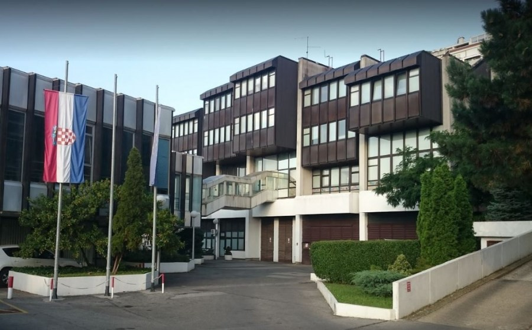
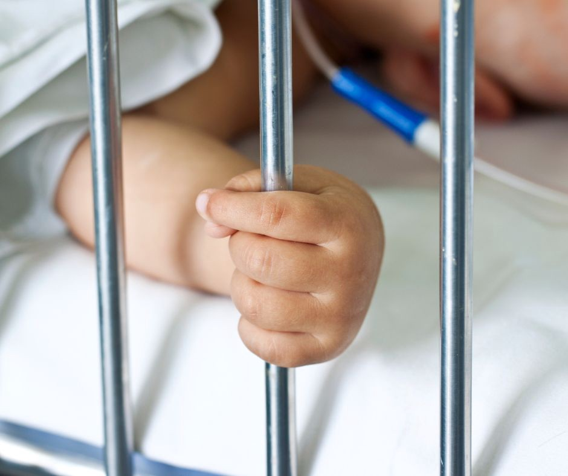

### AYS Special from Croatia— Hrvatska: **Izbjeglica mora biti zdrava\!**
#### Osobe koje su u Hrvatskoj ostvarile međunarodnu zaštitu svakodnevno se susreću s preprekama pri ostvarivanju prava na primarnu zdravstvenu zaštitu — prava koje im je zakonom zagarantirano\. Razlog tome je birokratske prirode…

### Zanemareni u sustavu koji to nije

Premda uživaju jednaka prava kao i osobe osigurane iz obveznog zdravstvenog osiguranja, osobe koje su u Hrvatskoj ostvarile međunarodnu zaštitu nisu osiguranici Hrvatskog zavoda za zdravstveno osiguranje, već su direktno pod nadležnosti Ministarstva zdravstva\.

U praksi to znači da:
- ne mogu posjedovati zdravstvenu iskaznicu
- usluge liječnicima se ne naplaćuju automatski
- ne mogu dobiti biti u sustavu e\-naručivanja na specijalističke preglede
- djeca bez obzira na radni status roditelja ne mogu dobiti zdravstveno osiguranje preko Zavoda
- rodilje ne mogu ostvariti porodiljnu naknadu

Upravo zbog neinformiranosti liječnika i izrazito kompliciranje procedure koja ih primorava da na kraju mjeseca dostavljaju račune Ministarstvu Zdravstva zbog refundacije troškova, velik broj liječnika odbija primiti pacijente koji imaju status međunarodne zaštite\.

Ministarstvo zdravstva RH

Takvom slučaju, koji ni po čemu nije iznimka, svjedočili smo i prije mjesec, kada nas je volonterka koja pruža podršku jednoj izbjegličkoj obitelji koja se preselila u Zagreb obavijestila kako već mjesecima pokušavaju pronaći pedijatra za dijete\.

Nakon bezbrojnih odbijanja i preporuke da se u hitnim slučajevima dijete može odvesti na hitnu, jedna pedijatrica je pristala primiti dijete, no nije znala kako ga upisati u elektronski sustav i na koji način administrirati preglede\. **Dijete je tako mjesecima bilo izvan sustava zdravstvene skrbi** , što je posebno zabrinulo roditelje\.

Roditelji, Sirijske izbjeglice, u Hrvatsku su došli procesom preseljenja iz Turske, a jedan od razloga zašto su **odlučili doći u Hrvatsku je upravo zato što** **u Turskoj obitelj nije mogla ostvariti adekvatnu zdravstvenu zaštitu** , budući da kao izbjeglice na nju nisu imali pravo\. Iako u Hrvatskoj uživaju pravo na zdravstvenu zaštitu, ostvarivanje prava pokazalo se izrazito teškim\.

### Izostavljanje i neinformiranje liječnika

Premda u Izvješću Akcijskog plana za integraciju iz 2018\. godine \(Novi Akcijski plan već godinama nije donesen\) stoji kako je mjera “sustavno informiranje \(na mjesečnoj bazi\) zdravstvenih radnika o okvirima prava iz Zakona o obveznom zdravstvenom osiguranju i zdravstvenoj zaštiti stranaca u Republici Hrvatskoj za osobe kojima je odobrena međunarodna zaštita” uspješno provedena, svakodnevno se susrećemo s liječnicima koje Ministarstvo zdravstva nije educiralo o pravima osoba pod međunarodnom zaštitom i načinu administriranja ovih pacijenata\.

Tome kako sustav ne štiti one najranjivije svjedoči i priča mlade majke i njenog novorođenčeta\. Budući da je dijete rođeno prerano, majka je pokušavala što prije pronaći pedijatra, kako bi dijete moglo dobiti uputnice za brojne specijalističke preglede\.

Iako je pronašla pedijatricu koja je pristala upisati dijete, pedijatrica je, neznajući proceduru, majci sugerirala da dijete registrira u Zavodu za zdravstveno osiguranje jer ga bez matičnog broja osiguranika ne može upisati u sustav\.

Nakon što smo razgovarali s pedijatricom i objasnili joj proceduru — pojavio se sljedeći problem\. Jedan od dokumenata potrebnih kako bi osobe pod međunarodnom zaštitom ostvarile pravo na zdravstvenu zaštitu je kopija dozvole boravka\. S obzirom na to da se radilo o novorođenčetu, majka je čekala službeno priznavanje azila djetetu, nakon kojeg može podnijeti zahtjev za izdavanje iskaznice\.

> Cijela procedura obično traje više od mjesec dana, a dijete je hitno trebalo specijalistički pregled\. 

Pedijatrica je ipak uspjela izdati uputnicu, no poteškoće su se pojavile na sljedećoj stanici — specijalističkom pregledu u bolnici\. Budući da dijete i dalje nije imalo potreban dokument, kontaktiralo nas je osoblje bolnice jer nisu znali na koji način administrirati pregled\. Naposljetku, izašli su majci u susret i obavili su pregled besplatno, usprkos nemogućnošću da im se pregled refundira\.

Usprkos naporu svih medicinskih djelatnika da dijete dobije odgovarajuću zdravstvenu skrb, ova priča pokazuje koliko je **u praksi teško ostvariti prava za one najranjivije** \. Također, majka ovog djeteta nema pravo na porodiljnu naknadu, budući da je **gubitkom posla izgubila i pravo na osiguranje** u sustavu Hrvatskog zdravstvenog osiguranja, koje administrira rodiljne i porodiljne naknade\.
### Nedostatak političke volje

Zaposlenjem osobe pod međunarodnom zaštitom stječu pravo na zdravstveno osiguranje preko HZZO\-a, no gubitkom posla ne mogu isto pravo steći kao nezaposlene osobe, već se vraćaju u začarani krug administracije prava osoba pod međunarodnom zaštitom\.

Upravo to se dogodilo i gospodinu M\., izbjeglici koji je radio i stoga imao zdravstveno osiguranje preko HZZO\-a\. Budući da boluje od kroničnih bolesti odlučio je ugovoriti i dopunsko zdravstveno osiguranje\. No **prestankom radnog odnosa, izgubio je pravo na osnovno zdravstveno osiguranje** , a time i na dopunsko, te nije postojao način da mu se lijekovi subvencioniraju, osim da se ponovno ne zaposli, čak i ako uvjeti rada nisu dobri, kako bi mogao ponovno dobiti pun opseg zdravstvene zaštite\.

**Ovakva praksa onemogućava osobama pun opseg zdravstvene zaštite jer nezaposlene osobe nemaju osnovno zdravstveno osiguranje \(premda imaju jednaka prava\) te stoga ne mogu ugovoriti dopunsko osiguranje\.**

Važno je istaknuti da se ovdje radi o osobama kojima je Hrvatska dodijelila međunarodnu zaštitu, dakle pravo da ostanu i izgrade svoj život u Hrvatskoj, no usprkos tome, ovi primjeri pokazuju koliko su u praksi oni još uvijek sustavno diskriminirani temeljem zakona koji bi trebali štiti njihova prava\.

Iako je malo potrebno da bi se ova nepravda ispravila, izgleda da nema političke volje za takve promjene\. Primjerice, reguliranjem zdravstvene zaštite za izbjeglice preko Hrvatskog zavoda za zdravstveno osiguranje, omogućilo bi im se jednostavno i lako ostvarivanje prava koja su im zakonom zagarantirana\.

> Do tada — izbjeglica mora biti zdrava\! 

> Ili, voditi neprekidnu borbu s birokratskim sustavom, kako bi ostvarila svoja prava\. 

Organizacija BRID i Are You Syrious izdali su online priručnik za Administrativni upis pacijenata pod međunarodnom zaštitom, kako bi liječnicima omogućili lakše snalaženje

**_This text was written in Croatian by AYS Staff member Anamaria Macanović\. Following this, you will be able to find the English version in translation by AYS member, Sanja Matešić\._**

**Find daily updates and special reports on our [Medium page](https://medium.com/are-you-syrious) \.**

**If you wish to contribute, either by writing a report or a story, or by joining the info gathering team, please let us know\!**

**We strive to echo correct news from the ground through collaboration and fairness\. Every effort has been made to credit organisations and individuals with regard to the supply of information, video, and photo material \(in cases where the source wanted to be accredited\) \. Please notify us regarding corrections\.**

**If there’s anything you want to share or comment, contact us through Facebook, Twitter or write to: areyousyrious@gmail\.com**

_Converted [Medium Post](https://medium.com/are-you-syrious/ays-special-from-croatia-hrvatska-izbjeglica-mora-biti-zdrava-edc68708be82) by [ZMediumToMarkdown](https://github.com/ZhgChgLi/ZMediumToMarkdown)._
