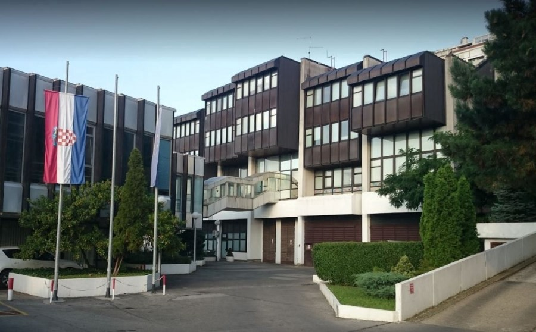
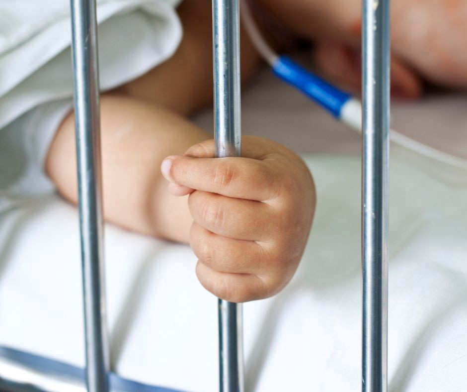

### **AYS Special from Croatia: A Refugee must be Healthy\!**
#### Every day, people who have been granted international protection in Croatia are hindered from exercising their right to primary health care — a right guaranteed them by law\. The obstacles are bureaucratic in nature\.

Ministry of Health of the Republic of Croatia
### **Neglected in a system which is not what it claims to be**

Although they enjoy the same rights as persons insured through the compulsory health insurance system, people who have been granted international protection in Croatia are not insured by the Croatian Health Insurance Fund\. Instead, they fall directly under the competence of the Ministry of Health\.

In practice, this means the following:
- they cannot have a health insurance card
- providers of medical services are not paid automatically
- they cannot make e\-appointments for specialist examinations
- regardless of the employment status of their parents, children cannot be insured through the Croatian Health Insurance Fund
- new mothers cannot get maternity pay

Because doctors are not well informed and have to go through a very complicated procedure which requires them to send their bills to the Ministry of Health at the end of each month to be reimbursed, many doctors refuse to accept patients whose status is that of a person under international protection\.

A case in point, by no means exceptional, occurred a month ago\. We were informed by one of our volunteers who was supporting a refugee family which had moved to Zagreb that they had been trying for months to find a paediatrician for their child\. After experiencing countless rejections and being told that they could take the child to the emergency ward in case of need, a paediatrician agreed to take on their child, but did not know how to enter the child into the electronic system and how to deal with the paperwork\.

**The child was thus excluded from the health care system for months** , which made the parents very anxious\.

The parents, refugees from Syria, had arrived in Croatia through the process of resettlement from Turkey\. One of the reasons why **they decided to move to Croatia was that in Turkey, the family could not obtain adequate health care** , since they did not have that right as refugees\. Although in Croatia they enjoy the right to health care, exercising that right has proved to be extremely difficult\.

### **Failure to include and inform physicians**

Although in the Action Plan for Integration of 2018 \(there has not been a new Action Plan for years\) it says that the measure of “systematically informing \(on a monthly basis\) health care workers about the framework of rights enshrined in the Act on Health Insurance and Health Care of Foreigners in the Republic of Croatia for persons granted international protection“ has been successfully implemented, every day we meet physicians who have not been educated by the Ministry of Health on the rights of persons under international protection and the way the paperwork for these patients should be handled\.

The story of a young mother and her newborn baby illustrates yet again the way the system is failing to protect the most vulnerable\. Since the baby was premature, the mother tried to find a paediatrician as soon as possible so the child could be referred to specialists for the numerous specialist examinations needed\.

She found a paediatrician willing to take on the child, but because the doctor was unaware of the procedure, she told the mother to register the baby with the Croatian Health Insurance Fund because she could not register the child in the system without a health insurance number\. We spoke to the paediatrician and explained the procedure to her, but then another problem arose\. One of the documents required for persons under international protection to exercise the right to health care is a copy of their residence permit\.

Since the patient was a newborn, the mother had to wait for the child to be officially granted asylum, after which she could apply for a card to be issued\.

> The whole procedure usually takes more than a month, but the baby needed a specialist examination urgently\. 

The paediatrician managed to issue a referral, but new difficulties arose at the next station — the specialist exam in the hospital\. Since the child still did not have the required document, we were contacted by the hospital staff because they did not know how to deal with the paperwork\. In the end, they decided to help the mother and performed the examination free of charge, although they could have been reimbursed\.

Despite the efforts of all the medical workers to provide the child with the appropriate health care, this story shows **how difficult it is in practice to exercise the rights of the most vulnerable** \. In addition, the mother of this child does not have the right to maternity pay, since she has lost her job and with it her right to insurance in the Croatian health insurance system, which administers maternity pay\.
### **Lack of political will**

When a person under international protection gets a job, they acquire the right to health insurance through the Croatian Health Insurance Fund, but when they lose their job they cannot acquire the same right as unemployed, but fall back into the vicious circle of bureaucracy implementing the rights of persons under international protection\.

This is precisely what happened to Mr\. M, a refugee who had a job and thus had health insurance through the CHIF\. Since he is suffering from chronic illnesses, he also opted to pay for supplemental health insurance\. **When his employment contract was terminated, he lost the right to basic health insurance** , and consequently also to supplemental health insurance\. There was no way for his medication to be subsidized, unless he took another job, even if the working conditions were poor\. This was the only way for him to get full coverage\.

**This practice makes it impossible to have full coverage because unemployed persons do not have basic health insurance \(although they have equal rights\), and without it they cannot contract for supplemental health insurance\.**

It must be pointed out that these are people to whom Croatia has granted international protection, meaning the right to stay and create a life for themselves in Croatia, but these examples show to what extent they are still systematically discriminated against in practice on the basis of laws which are supposed to protect their rights\.

Although very little is needed to rectify this injustice, it seems there is no political will to make the required changes\. For example, regulating health care for refugees through the Croatian Health Insurance Fund would enable the easy and simple exercise of rights guaranteed them by law\.

> Until then — a refugee must be healthy\! 

> Or wage an endless struggle with the bureaucratic system to exercise their rights\. 

The organisation BRID and Are You Syrious have published an online Handbook for the Administrative Registration of Patients under International Protection to help physicians negotiate the paperwork\.

**_This text was written in Croatian by AYS Staff member Anamaria Macanović, English translation by AYS member, Sanja Matešić\._**

**Find daily updates and special reports on our [Medium page](https://medium.com/are-you-syrious) \.**

**If you wish to contribute, either by writing a report or a story, or by joining the info gathering team, please let us know\!**

**We strive to echo correct news from the ground through collaboration and fairness\. Every effort has been made to credit organisations and individuals with regard to the supply of information, video, and photo material \(in cases where the source wanted to be accredited\) \. Please notify us regarding corrections\.**

**If there’s anything you want to share or comment, contact us through Facebook, Twitter or write to: areyousyrious@gmail\.com**

_Converted [Medium Post](https://medium.com/are-you-syrious/ays-special-from-croatia-hrvatska-a-refugee-must-be-healthy-1312bac91041) by [ZMediumToMarkdown](https://github.com/ZhgChgLi/ZMediumToMarkdown)._
