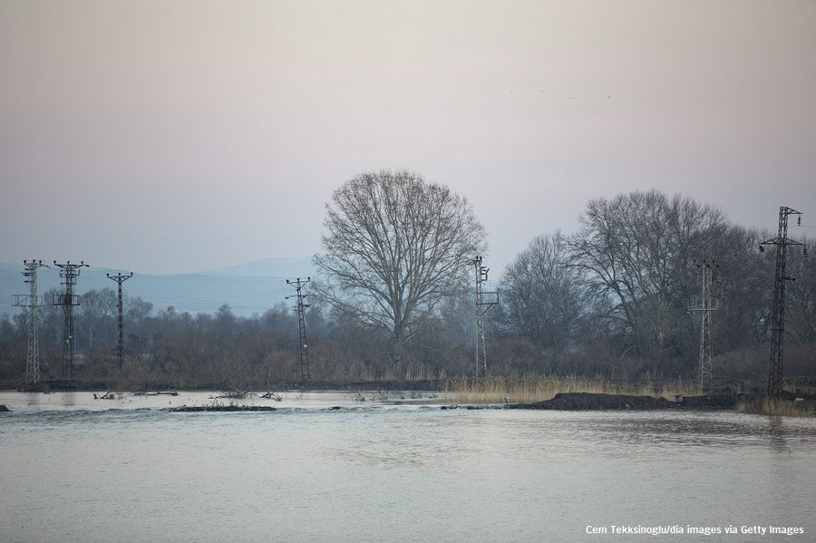
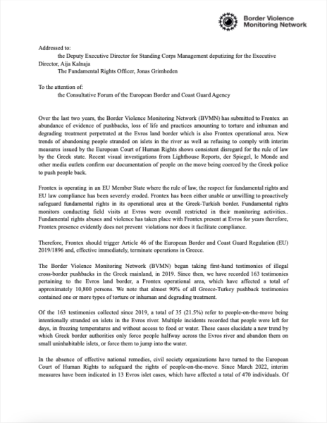
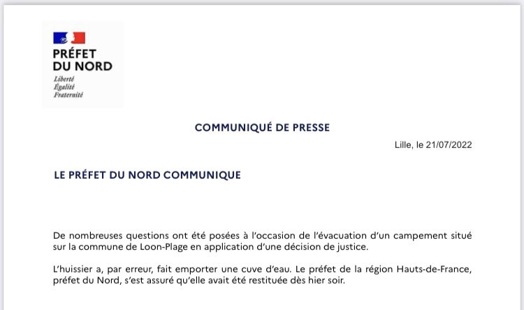

### AYS News Digest 22/7/22: Brutal beatings, two deaths and 50 people stuck on the Evros islet
#### Italian authorities breached rights of asylum\-seeker to be presumed a minor until his age had been properly assessed // Ombudsman opens investigation into EU\-Gambia repatriation agreement // French authorities leave people without water “by mistake” // reports, analysis and suggested reads from our team

#### FEATURE

■■■■■■■■■■■■■■ 
> **[Amnesty EU](https://twitter.com/AmnestyEU) @ Twitter Says:** 

> > We are very concerned about 50 #Refugees including 12 children, 3 pregnant women and a 70 year old diabetic woman who are stranded on an Evros river islet. https://t.co/23cthJeTQh 

> **Tweeted at [2022-07-22 12:42:14](https://twitter.com/amnestyeu/status/1550461213376667648).** 

■■■■■■■■■■■■■■ 

■■■■■■■■■■■■■■ 
> **[Giorgos Christides](https://twitter.com/g_christides) @ Twitter Says:** 

> > The refugees @[AmnestyEU](https://twitter.com/AmnestyEU) is referring to are still there. Greek authorities have their location, but as usual show no willingness to follow court orders. In a video call I had with a young girl from the group today, she took me through the Evros islet and begged for help 👇 https://t.co/vfHoZhOT5q 

> **Tweeted at [2022-07-22 13:39:30](https://twitter.com/g_christides/status/1550475624589967365).** 

■■■■■■■■■■■■■■ 

“What the trapped people are telling constitutes another brutal and criminal, if not outright murderous, attempt to illegally repatriate refugees from the Greek bank of the Evros to islands in the river, where they are abandoned by the Greek authorities to cross to Turkey on their own,” media reported\.

The people appealed to the European Court of Human Rights with the help of Hellenic Council for Refugees and HumanRights360, asking for an urgent order to be given to the Greek government to carry out a rescue operation, to ensure basic conditions and to register their request for asylum\.

The Greek member organisations of the Border Violence Monitoring Network \(BVMN\) have previously collected 35 testimonies where groups were stranded on islets during a pushback, relating to the experiences of 2,450 people\. In the recent report [https://borderviolence\.eu/20548\-2/](https://t.co/cNO2okRS2J) we analysed two similar cases and outlined the fundamental rights violations of the Greek state\.

Earlier in July the BVMN shared a [letter](https://www.borderviolence.eu/letter-of-concern-to-frontex-2/) of concern the Network had sent to Frontex, regarding illegal pushbacks at the Greek\-Turkish border and the recent publication of new evidence of Greek authorities coercing asylum seekers into pushing other transit groups back to Turkey by Lighthouse Reports, Le Monde, der Spiegel, the Guardian, and other media outlets:

#### TURKEY
### Securitisation widened to the network of taxi drivers

Taxi drivers, who do not ask for official documents from foreigners wishing to make interprovincial travel, will be charged with “migrant smuggling,” according to a new regulation by the Turkish Interior Ministry\.

“Foreigners under international protection” in Turkey have an official “Protection ID” obtained from provincial immigration offices\. The media [reported](https://www.hurriyetdailynews.com/mandatory-for-taxi-drivers-to-ask-documents-from-foreigners-175463?fbclid=IwAR0yXp2kyiFD8u3hyXWP6EIiT9-gP4FxXRMN2H8-F8QPNuUh4rKnJYprC-8) that these people will have to get a second document named “Travel Permit” before intercity travel\. Tourists, on the other hand, need to show their passports\.
#### SEARCH AND RESCUE AT SEA

■■■■■■■■■■■■■■ 
> **[Sea-Watch International](https://twitter.com/seawatch_intl) @ Twitter Says:** 

> > Fortunately, #Seabird1 found the boat in distress and could alert the merchant vessel VICTORIA, which is now waiting for instructions from #Malta &amp; #Italy.

The people are more than 2 days on the sea already &amp; need to be rescued immediately! Don't play with human lives, act now! 

> **Tweeted at [2022-07-21 16:55:45](https://twitter.com/seawatch_intl/status/1550162624771416069).** 

■■■■■■■■■■■■■■ 

Still, people keep being pushed back to the Libyan Coast Guard and to the country that has consistently been breaking all the rules, laws and depriving people of their basic rights\.

In the latest turn of events, Libya’s SSA security force \(not subject to scrutiny\) is accused of abusing people on the move\.

#### ITALY
### At least 10,000 people exploited on farms

Abuse continues once people reach the EU member states, too\. 
One such example we had been reporting about in previous years is that of farm workers across Italy\.

There are at least 10,000 “migrant farmworkers” living in makeshift settlements in Italy, considered places of exploitation in which they are deprived of their basic rights, recent reports confirm\. The report “shows the way in which we acknowledge and deny dignity to those lives and that work”, said the Labor Minister:

> For far too long we have carried the burden of places that reject our founding principles and the respect due to every human being\. We cannot and do not want to carry that burden any longer\. 

Find out more [here](https://www.infomigrants.net/en/post/42056/no-rights-for-10000-migrants-in-italys-ghetto-camps?fbclid=IwAR3ItVYUqNsyIVLBgb7KWYvPj9xg8z_1VR3QzLFHFaHofMmczOjPNXZ83fI) \.
### Italian authorities breached the rights of asylum\-seeker to be presumed and treated as a minor until his age had been properly assessed\.

On 21 July 2022, the European Court of Human Rights sentenced Italy to pay compensation for the non\-pecuniary damage suffered by a Gambian boy, Darboe Ousainou, an unaccompanied foreign minor who arrived on Italian shores in June 2016, when he was just 17 years old, ASGI reported\.

The court decision is available in PDF document version [here](https://hudoc.echr.coe.int/app/conversion/pdf/?library=ECHR&id=003-7390634-10107747&filename=Judgment%20Darboe%20and%20Camara%20v.%20Italy%20-%20Italian%20authorities%20breached%20rights%20of%20asylum-seeker%20to%20be%20presumed%20and%20treated%20as%20a%20minor.pdf) \.
### Ombudsman opens investigation into EU\-Gambia repatriation agreement

In May 2018, the European Union signed an agreement with Gambia, called Good Practices Procedure on identification and return, never made public on the assumption that it was not a formal agreement\. ASGI filed an application for civic access to the European Commission, but received a rejection\.

On 6 July 2022, thanks to the support of the Strategic Litigation: International Human Rights Legal Clinic of the University of Turin, the matter was reported to the European Ombudsman, who has now decided to **open an investigation and confirmed the need to be able to view the agreement to assess whether or not it is an international agreement, therefore subject to the obligation of publicity** , ASGI writes\.
#### FRANCE

In response to everyone who voiced their concern, anger and disbelief at the fact that the local authorities had taken away water from the area and left people without the most basic need in life during a heat wave, the Prefecture has responded they “did it by mistake”, assuring the public that the water will be reinstalled in the same place:

#### GERMANY
### Hassan, an activist and a _spiritus movens_ from Sudan has died

Hassan Numan, 45, a political scientist and refugee from Sudan, was expected to speak at an [activist](https://taz.de/Anwalt-fuer-Menschenrechte/!5801144/) gathering, the Transborder Camp, but he never made the trip\. From 2017, Numan lived in a run\-down refugee camp in [Osnabrück](https://taz.de/Sichere-Haefen-in-Niedersachsen/!5856703/) ’ss Ickerweg\. He became famous as the man with the whistle, TAZ writes in an [article](https://taz.de/Nachruf-auf-Hassan-Numan/!5865830/) dedicated to the man who inspired many\.

> They blocked the entrances with garbage cans, barred the gates and started singing — the Sudanese national anthem or Arabic children’s songs\. Chaos reigned — and the police withdrew again\. “Zero violence is important to us,” Numan said at the time\. With this principle they were able to prevent deportations again and again\. “We want to assert our rights\. And we are many, we can achieve something\.” 

■■■■■■■■■■■■■■ 
> **[Maurice Stierl](https://twitter.com/MauriceStierl) @ Twitter Says:** 

> > Hassan Numan, an activist from Sudan, has passed away. He was key in organising anti-deportation protests in Germany. Whenever the police came to the camp, inhabitants used whistles to sound the alarm to prevent deportations. The yellow whistle is now a symbol of resistance. https://t.co/VWk2GFyVMH 

> **Tweeted at [2022-07-21 10:03:01](https://twitter.com/mauricestierl/status/1550058756964290561).** 

■■■■■■■■■■■■■■ 

#### GENERAL
### Frontex

■■■■■■■■■■■■■■ 
> **[Matthias Monroy (@Mastodon)](https://twitter.com/matthimon) @ Twitter Says:** 

> > The new #Frontex agreement with #Niger is the border agency's first "operational partnership against migrant smuggling" in the world. It serves to counter migration far away from #FortressEurope.
Police agencies are forming joint "investigative teams" against helpers of migrants: 

> **Tweeted at [2022-07-22 12:56:41](https://twitter.com/matthimon/status/1550464851692101632).** 

■■■■■■■■■■■■■■ 

Monroy notes this could also endanger initiatives like Alarm Phone Sahara, which is trying to prevent people starving in the desert by providing them with information to not get lost or die of thirst\.

Statewatch also reports:

> “The negotiating directives for the deal with Senegal, also obtained by Statewatch, demand criminal and civil immunity \[ \! \! \! \] of Frontex staff in Senegal “under all circumstances”\. 

[](https://l.facebook.com/l.php?u=https%3A%2F%2Fwww.statewatch.org%2Fnews%2F2022%2Fjuly%2Feu-tracking-the-pact-plan-for-frontex-to-deploy-vessels-surveillance-equipment-and-carry-out-operational-tasks-in-senegal-and-mauritania%2F%3Ffbclid%3DIwAR0VLCjuCBnYuR5HgotaMQsT_kG-3oyTIcAaCA7x1H_m9tpnIbtyrIgJtXI&h=AT3eco_sTSeiGMOecB2xBGDiCYCEoePPjUsRX-kJCYSISVcUN2pPOZ-AviVWFHXYyo1Hu4__ZXKbyyDh6_LANnOMxSaEf7JfgWzBIGHVpM6vwpJrmHUL7ZxC-NC0cmZSGA--qJbDpWnhCFch4Mbi5jPCJ--eZrt2Nw&__tn__=R]-R&c[0]=AT1A_CG4LwlY-8r_s7Ts3uV_uNOcDtLP7mV4DwNRWRr3dPPHzX274ZDEkpVlYD07ZeYsq58bkKnHw-e4rwAyEeVmMCyb5_uv1hDPxRwgZMn9hrQrb1nuxpKSPIN7vOBF3BCrqUbYZbv8XSSG8X-EubtYjiOnra6n95oEbr93BDZS3MbXoW93Zx3JRnanAeRrFAfAmFQ10vlh)

#### WORTH READING
- “Those voicing concern are met with denial rather than diplomacy, but accountability mechanisms at various levels continue to offer formal recognition of rights violations and persistent issues related to the national implementation of the Common European Asylum System \(CEAS\) in Greece\. The NGO community in Greece also remains very active in highlighting the realities of the asylum system\. Taken together, these collective efforts around advocacy and reporting, case law, activism, and dialogue serve as a foundation on which significant improvements can be made if only the EU and national governments demonstrate the political will\.”

- We’re sharing a report from the Chief Inspector of Borders and Immigration heavily criticizing the UK government’s handling of Channel migrants\. The report said the treatment was “unacceptable, ineffective and inefficient”:

[](https://l.facebook.com/l.php?u=http%3A%2F%2Fwww.infomigrants.net%2Fen%2Fpost%2F42103%2Freport-criticizes-uks-handling-of-channel-migrants%3Ffbclid%3DIwAR23ZEw_lky8FWhFyuAncu_zIjE1gAGHPodXqOMuJVN-_8h7MMw4M8veDe0&h=AT0qFdhES1gjeCdn303vHXSIKnO0khC6jrAzI7RTZW9dSKci6T_xrvaA3313tEHTy8zusfBhBlxZf0Y0drF9tzycFaeajsF1eeUtM7YljuHZGyfR4xBXyH_ePfsgv89uSHNL8nfhMe02168zCBUd3s_mjJmjiSoe9A&__tn__=R]-R&c[0]=AT2GO-8BivibCWDGpcyMX8zIGVbYFB6LqMqMTjgj3ttrdrL-tZOaPkZwF6Adqqcv4uCPyrUBziPDKpLtIPK0hncgGUmrH2TrbY8Q_6zO0QsBc1JfzPpufNa5HjFFJuYG9E9l8iUvVFW0eiR3s21tWOJvhKyBngG18PWc_Qxx4sN3pow3wFKPTEzuexAiojjJa2OAr9h8HxYl)

- Support our friend organisation from Germany on their way to support fragile civil support to people on the move in Bosnia and Herzegovina:

- Forced Migration Current Awareness:

[](https://l.facebook.com/l.php?u=https%3A%2F%2Ffm-cab.blogspot.com%2F2022%2F07%2Fthematic-focus-detention.html%3Ffbclid%3DIwAR0BGLSLC0tGLLRgwDNiWRcJd2ZHdrgApXRs3pLfiZY8NHkenFMYnPC0xbQ&h=AT02fKNmu4AX4T4VRrN0Bd_LloDHqUpLhv5ONXBXDTrgIDvqT2i9wA8D1VNJnxluYVnTogcnkb8wD9HUM_DqziivmLgFs6yFvnHokX6IlXNp6_ZSRmM1b0_LydY5j5s1hTwrcr62n5NCFQ1tnmb-qJe3s58jBbTiig&__tn__=R]-R&c[0]=AT1A_CG4LwlY-8r_s7Ts3uV_uNOcDtLP7mV4DwNRWRr3dPPHzX274ZDEkpVlYD07ZeYsq58bkKnHw-e4rwAyEeVmMCyb5_uv1hDPxRwgZMn9hrQrb1nuxpKSPIN7vOBF3BCrqUbYZbv8XSSG8X-EubtYjiOnra6n95oEbr93BDZS3MbXoW93Zx3JRnanAeRrFAfAmFQ10vlh)

**Find daily updates and special reports on our [Medium page](https://medium.com/are-you-syrious) \.**

**If you wish to contribute, either by writing a report or a story, or by joining the Info Gathering team, please let us know\!**

**We strive to echo correct news from the ground through collaboration and fairness\. Every effort has been made to credit organisations and individuals with regard to the supply of information, video, and photo material \(in cases where the source wanted to be accredited\) \. Please notify us regarding corrections\.**

**If there’s anything you want to share or comment, contact us through Facebook, Twitter or write to: areyousyrious@gmail\.com**

_Converted [Medium Post](https://medium.com/are-you-syrious/ays-news-digest-22-7-22-brutal-beatings-two-deaths-and-50-people-stuck-in-the-evros-islet-f3ad3a811bdb) by [ZMediumToMarkdown](https://github.com/ZhgChgLi/ZMediumToMarkdown)._
