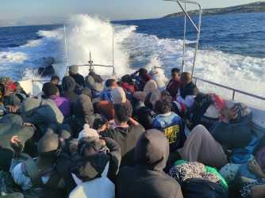

### **AYS News Digest 29/07/22: Investigation reveals Frontex not only covered up but financed Greek pushbacks**
#### Despite evidence, forced pushbacks to carry on in the Aegean Sea // French court refuses to open reception centres for Ukrainians to all people in need // Minors at risk of human trafficking in Europe

 G](assets/32c0039ce61e/1*unQG5jdd7lZM51diStr1CQ.jpeg)

A group of 30 people on two lifeboats were pushed back toward Turkish territorial waters by the Greek Coast Guard / Photo: [TC](https://en.sg.gov.tr/pushback-news) G
#### FEATURE

An extended investigation by the European Anti\-Fraud Office \(OLAF\) reveals how the EU’s border agency, Frontex, is directly involved in the illegal pushbacks of hundreds of refugees by Greek authorities\.

The 129\-page confidential report proves that Frontex under former executive director Fabrice Leggeri covered up human rights violations conducted by the Greek authorities and financed forced pushbacks in the Aegean Sea with European taxpayer money, a collective investigation said, written by several prominent migration journalists and published in Der Spiegel\.

■■■■■■■■■■■■■■ 
> **[Giorgos Christides](https://twitter.com/g_christides) @ Twitter Says:** 

> > ❗EXCLUSIVE: We got our hands on the secretive 129 p. OLAF investigation into @[Frontex](https://twitter.com/Frontex). It proves the Greek Coast Guard systematically commits pushbacks that FX knew all about - but covered it all up, as @[derspiegel](https://twitter.com/derspiegel) and partners have long reported [spiegel.de/ausland/fronte…](https://www.spiegel.de/ausland/frontex-skandal-um-pushbacks-und-fabrice-leggeri-vertuscht-verschleiert-belogen-a-6f3df3b4-8eef-4ae6-832b-237514cdb9fb) 1/20 

> **Tweeted at [2022-07-28 09:13:34](https://twitter.com/g_christides/status/1552583030455377920).** 

■■■■■■■■■■■■■■ 

Frontex repeatedly denied its involvement, however, data from its operational database show that the Greek Coast Guard has been systematically conducting these pushbacks since March 2020 with the help of the EU’s Frontex border protection agency, as revealed by the joint investigation by [Lighthouse Reports](https://www.lighthousereports.nl/investigation/frontex-the-eu-pushback-agency/) , [Der Spiegel](https://www.spiegel.de/international/europe/frontex-involved-in-illegal-pushbacks-of-hundreds-of-refugees-a-9fe90845-efb1-4d91-a231-48efcafa53a0) , [SRF Rundschau](https://www.srf.ch/news/abstimmungen-15-mai-2022/finanzierung-frontex/migration-frontex-in-pushbacks-in-aegaeis-involviert?wt_mc_o=srf.share.app.srf-app.unknown) , [Republik](https://www.republik.ch/2022/04/27/inside-frontex-die-geheime-datenbank-der-eu) and [Le Monde](https://www.lemonde.fr/international/article/2022/04/27/refoulements-en-mer-egee-les-recensements-errones-ou-mensongers-de-frontex_6123944_3210.html) \.

Similarly, the Greek government has long been arguing that it is carrying out effective border surveillance with full respect for “international law” and “European values”\. However, in just two years, between March 2020 and March 2022, t **he Greek state has enforced 1,018 pushbacks on the Aegean Sea, with at least 27,464 asylum seekers as victims** , as captured by the new [interactive platform](https://aegean.forensic-architecture.org/) of [Forensic Architecture](https://forensic-architecture.org/) , the pioneering research centre based at Goldsmiths, University of London, and [Forensis](https://twitter.com/counterinv) , its newly founded sister organisation in Berlin, and reported by Greek media platform [Solomon](https://wearesolomon.com/mag/on-the-move/dark-waters-of-the-aegean-1018-illegal-pushbacks-carried-out-by-the-greek-state/?mc_cid=8a040fd752&mc_eid=1e016abc35) \.

**Despite evidence forced pushbacks to carry on in the Agean sea**

Even though the report was presented in February 2022 to the European Parliament’s Committees on Budgetary Control \(CONT\) and on Civil Liberties, Justice and Home Affairs \(LIBE\) by the Director\-General of the European Anti\-Fraud Office \(OLAF\), Ville Itälä, nothing has changed so far and human rights violations and pushbacks routinely continue at the EU’s external border in Greece\.

](assets/32c0039ce61e/1*nTZOUSJIqvRf0tM87yOuRw.jpeg)

Thirty\-nine people were pushed back by Greek Coast Guards to Turkish territorial waters on 29 June\. Photograph: [Turkish Coast Guard](https://en.sg.gov.tr/pushback-news)

While on an official trip to Athens on 28 July, German Foreign Minister Annalena Baerbock “only wanted to talk to the Frontex representatives in Greece,” a spokesperson for the Greek coast guard confirmed to [Le Monde](https://www.lemonde.fr/en/international/article/2022/07/30/german-foreign-minister-asks-athens-to-prevent-european-values-from-sinking-at-its-borders_5991955_4.html) \.

■■■■■■■■■■■■■■ 
> **[Lena K.](https://twitter.com/lk2015r) @ Twitter Says:** 

> > So according to media reports it was not OK to meet the Hellenic Coast Guard because they conduct pushbacks but OK to meet the agency that has been covering them up for years. 

> **Tweeted at [2022-07-29 11:28:10](https://twitter.com/lk2015r/status/1552979291541016579).** 

■■■■■■■■■■■■■■ 

Just hours after the publication of Frontex covering up illegal returns by the Greek government, the German Foreign Minister admitted that there had been pushbacks incompatible with European law and offered reassurances that “measures have been taken immediately”, however, refused to meet with the Greek port police, several Greek media outlets reported\.

In light of verified new evidence by European media and countless new victims, the non\-governmental organisation front\-LEX asked Frontex to activate Art\. 46 which sets out [an obligation to suspend or terminate operations where serious or systematic fundamental rights violations are known](https://eur-lex.europa.eu/legal-content/EN/TXT/PDF/?uri=CELEX:32019R1896&from=en) \(pg\. 48\) and immediately terminate the Agency’s operations in the Aegean Sea\. But the EU agency’s acting Executive Director Aija Kalnaja has refused to end Frontex operations in Greece, arguing that “this provision cannot be triggered based on isolated incidents”\.

■■■■■■■■■■■■■■ 
> **[front-LEX](https://twitter.com/LexFront) @ Twitter Says:** 

> > Everyone knows that the 43,000 victims in the Aegean Sea are not a tragedy, but #Frontex strategy
 
Everyone but @[KalnajaAija](https://twitter.com/KalnajaAija). In her response, the new Director *REFUSES* to terminate #Frontex operation, arguing that

Art. 46 "cannot be triggered based on *isolated incidents*" 🤣 https://t.co/tODF4A72EM 

> **Tweeted at [2022-07-28 11:31:37](https://twitter.com/lexfront/status/1552617770390634503).** 

■■■■■■■■■■■■■■ 

#### GREECE
### Labour exploitation and hate speech

Greece’s anti\-immigration political leadership has exposed migrants to labour exploitation and increased hate speech\. A video documents the incident of Ahmed Fiaz, a 38\-year\-old farm worker who was the victim of a racist attack by the farmer he was working with for the last seven years, on 21 July near Argos in mainland Greece, according to the Greek antiracist organization KEERFA\.

■■■■■■■■■■■■■■ 
> **[Vassilis Tsarnas](https://twitter.com/VassilisTsarnas) @ Twitter Says:** 

> > #Greece: Ahmed Fiaz, a 38-year-old farm worker was the victim of a racist attack by the farmer he was working for the last 7 years, on 22/7, near Argos. He had just filed a complaint for being unpaid, which also "enraged" the farmer
#HateCrimes #Immigrants
[fb.watch/ezQG5AtaKb/](https://fb.watch/ezQG5AtaKb/) 

> **Tweeted at [2022-07-29 17:42:00](https://twitter.com/vassilistsarnas/status/1553073367540027393).** 

■■■■■■■■■■■■■■ 

#### **SEARCH AND RESCUE AT SEA**

1000lives were rescued in the Central Mediterranean in the past period of merely a week— the Ocean Viking with 387 people and the Geo Barents, with 659 people are still waiting to be assigned a safe port\. On board, there are more than 300 minors, including several babies less than one year old, and pregnant women awaiting to disembark in an absolute emergency\.

The people were rescued between 25 and 28 July by the Ocean Viking in international waters off the coast of Libya and the MSF\-operated Geo Barents between 25 and 28 July, which rescued 659 people in 11 separate rescue operations in the central Mediterranean\.

■■■■■■■■■■■■■■ 
> **[MSF Sea](https://twitter.com/MSF_Sea) @ Twitter Says:** 

> > Over 300 minors, incl. several babies less than 1 y/o, rescued by #OceanViking &amp; #GeoBarents are awaiting authorisation to disembark in a place of safety under extremely difficult conditions at sea. With many other survivors, incl. pregnant women, they spent up to 6 days at sea. https://t.co/VLTC8kJiZo 

> **Tweeted at [2022-07-29 12:45:07](https://twitter.com/msf_sea/status/1552998656361504768).** 

■■■■■■■■■■■■■■ 

■■■■■■■■■■■■■■ 
> **[MSF Sea](https://twitter.com/MSF_Sea) @ Twitter Says:** 

> > Despite all efforts from @[MSF_Sea](https://twitter.com/MSF_Sea), @[SOSMedIntl](https://twitter.com/SOSMedIntl) &amp; @[ifrc](https://twitter.com/ifrc) teams providing support &amp; care in this critical period of blockage at sea, the physical &amp; psychological well-being of survivors is rapidly deteriorating. Survivors on #GeoBarents &amp; #OceanViking urgently need places of safety. https://t.co/Y4f8uMOBYO 

> **Tweeted at [2022-07-29 13:12:28](https://twitter.com/msf_sea/status/1553005538442616832).** 

■■■■■■■■■■■■■■ 

■■■■■■■■■■■■■■ 
> **[MSF Sea](https://twitter.com/MSF_Sea) @ Twitter Says:** 

> > Delays in designating a place of safety to disembark the survivors rescued in the #CentralMediterranean also prevent civil NGO ships from responding to potential other distress calls, leaving people to their fate in the world deadliest sea migration route since 2014. https://t.co/djoJuPg0Tt 

> **Tweeted at [2022-07-29 14:52:02](https://twitter.com/msf_sea/status/1553030597085483008).** 

■■■■■■■■■■■■■■ 

At least 30 people, including women and children, are feared dead after a flimsy dinghy sank in the Mediterranean Sea off Libya’s coast, medical charity Doctors Without Borders \(MSF\) said on 29 July\.

■■■■■■■■■■■■■■ 
> **[MSF Sea](https://twitter.com/MSF_Sea) @ Twitter Says:** 

> > 🔴Update🔴  

➡️ At least 30 people reported missing, including 5 women and 8 children    
➡️4 women currently on board have lost a child and 1 of them lost her 2 children 
➡️ Among the missing children, 3 are one-year old babies 
➡️Several people on board have lost a brother https://t.co/rhXg0YKcFZ 

> **Tweeted at [2022-06-29 12:29:07](https://twitter.com/msf_sea/status/1542122992121020417).** 

■■■■■■■■■■■■■■ 

#### **FRANCE**
### **French court refuses to open reception centers for Ukrainians to all people in need**

The Paris administrative court ruled against a request from the Utopia 56 and Médecins du Monde associations to “open the emergency accommodation centers dedicated to displaced Ukrainians in Paris to all people in extremely precarious situation, whatever their nationality or country of origin”, [INFO MIGRANTS wrote](http://www.infomigrants.net/fr/post/42271/paris--un-tribunal-refuse-douvrir-les-centres-pour-deplaces-ukrainiens-aux-autres-migrants?fbclid=IwAR3RgjdaujCLy3zAyHrI0D-xG54Rixbq53slUEhu5kUMeYgiJ-bW7PFGyjw) \.

■■■■■■■■■■■■■■ 
> **[Utopia 56](https://twitter.com/Utopia_56) @ Twitter Says:** 

> > La juge a statué, si elle reconnaît que nombre de personnes vulnérables dorment à la rue, elle n’y voit pas de carence de @[Prefet75_IDF](https://twitter.com/Prefet75_IDF) et @[Interieur_Gouv](https://twitter.com/Interieur_Gouv). La logique là dedans? Avec @[MdM_France](https://twitter.com/MdM_France) et @[DjemaounSamy](https://twitter.com/DjemaounSamy) nous étudions la possibilité de faire appel. [utopia56.org/places-vacante…](https://utopia56.org/places-vacantes-dans-les-centres-daccueil-dedies-aux-deplaces-ukrainiens-pas-de-doubles-standards-selon-la-juge-des-referes) 

> **Tweeted at [2022-07-29 07:29:26](https://twitter.com/utopia_56/status/1552919213060366336).** 

■■■■■■■■■■■■■■ 

### **Grassroots organizations providing water face police aggression in Northern France**

French authorities routinely tear down tents of people on the move in the French city of Calais as they wait to cross the English Channel to the UK\. These evictions take place every 48 hours, reports the non\-governmental organization Human Rights Observers on Twitter\. Since January 2022, there have been 1,029 evictions\.

■■■■■■■■■■■■■■ 
> **[Human Rights Observers](https://twitter.com/HumanRightsObs) @ Twitter Says:** 

> > Nouvelles #expulsions à #Calais. Après avoir expulsé les personnes exilées, leurs tentes (parfois pleines d'affaires, comme on peut le voir ici) sont volées.
Ces expulsions ont lieu toutes les 48h en moyenne.

On compte 1029 expulsions de lieux de vie depuis le 1er janvier 2022. https://t.co/1w3X66XJGe 

> **Tweeted at [2022-07-28 13:09:48](https://twitter.com/humanrightsobs/status/1552642480155332609).** 

■■■■■■■■■■■■■■ 

■■■■■■■■■■■■■■ 
> **[L'Auberge des Migrants](https://twitter.com/AubergeMigrants) @ Twitter Says:** 

> > 👇 https://t.co/inuTOniCLq 

> **Tweeted at [2022-07-29 10:58:42](https://twitter.com/aubergemigrants/status/1552971874266624000).** 

■■■■■■■■■■■■■■ 

#### **ITALY**
### **Minors at risk of trafficking**

One in four victims of human trafficking in Europe is a minor, as shows the report Little Invisible Slaves 2022 \( [Piccoli Schiavi Invisibili 2022](https://s3.savethechildren.it/public/files/uploads/pubblicazioni/piccoli-schiavi-invisibili-2022.pdf) \) published by Save the Children on 27 July on the occasion of the International Day Against Human Trafficking\.

Facts:
- Human trafficking in Europe creates a revenue of around 29\.4 million\.
- One\-fourth of the 14,000 identified cases concern minors with 64% trapped in prostitution rings\.
- 45\.4% are between 18 and 25 years old, but there are also those who aren’t even 17 yet\.

Specifically, concerning Italy, the highest number of exploited nationalities were Nigeria \(65\.6%\), Pakistan \(4\.5%\), Morocco \(2\.6%\) and Gambia \(2\.5%\) and the Ivory Coast \(2\.3%\), the report found, revealing sexual \(48\.9%\) and labour exploitation \(18\.8%\) as the most common form of exploitation in the country\. Read more [here](https://www.infomigrants.net/en/post/42250/human-trafficking-one-in-four-victims-in-europe-is-a-minor?fbclid=IwAR19lI3LapHke0hoDN7_Xo90XPHcUT0_k6C5W9sxvkZFr-6vynFbtq8eXos) \.
#### **UK**
### **More than 200 people cross the English Channel in small boats**

On 27 July, 202 people crossed the English Channel in five small boats, according to the British Ministry of Defence \(MoD\), [as the BBC reports](https://www.bbc.co.uk/news/uk-england-kent-62337674) \. The total number of arrivals reached 2,976 in July, compared to over 3,500 in July 2021\.

In six months, figures released by the MoD show that approximately 10,000 people have arrived in the United Kingdom on small boats from across the Channel, while a total of 28,526 people made the crossing in 2021, as reported by [The Guardian](https://amp.theguardian.com/uk-news/2022/jun/04/number-of-people-to-reach-uk-in-small-boats-in-2022-nears-10000) \.

**Find daily updates and special reports on our [Medium page](https://medium.com/are-you-syrious) \.**

**If you wish to contribute, either by writing a report or a story or by joining the Info Gathering team, please let us know\!**

**We strive to echo correct news from the ground through collaboration and fairness\. Every effort has been made to credit organisations and individuals with regard to the supply of information, video, and photo material \(in cases where the source wanted to be accredited\) \. Please notify us regarding corrections\.**

**If there’s anything you want to share or comment on, contact us through Facebook, Twitter or write to: areyousyrious@gmail\.com**

_Converted [Medium Post](https://medium.com/are-you-syrious/ays-news-digest-29-07-22-investigation-reveals-frontex-not-only-covered-up-but-financed-greek-32c0039ce61e) by [ZMediumToMarkdown](https://github.com/ZhgChgLi/ZMediumToMarkdown)._
