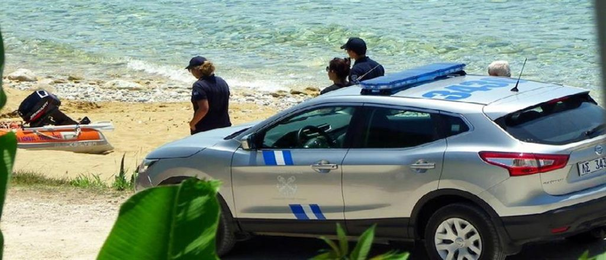

#### AYS News Digest 02/08/2022: Frontex drones continue to search but not to rescue
#### Frontex drones allegedly used to support so\-called Libyan Coast Guard refoulements at sea//Another fatality during an attempted crossing from Turkey to Greece//Murder of Nigerian national in Italy//Deportations from France, Germany and Bosnia//UK Home Office funding to France to prevent Channel crossings

Reconstruction of the 30 July 2021, interception facilitated by a Frontex drone\. In addition to the track of the Frontex drone, the map shows the track of Seabird \(a Sea\-Watch airplane\) that witnessed the interception\. It also shows the NGO vessel Sea Watch 3 in the vicinity\. There is no vessel tracking data for the Libyan Coast Guard patrol boat Ras Jadir or the intercepted vessel\. Map courtesy of Border Forensics, image courtesy of Human Rights Watch\.

Money invested in EU Frontex by member states continues to provide little to no assurance of human rights in the so\-called ‘Libyan Search and Rescue Zone’, and instead is used to allegedly ensure the refoulement of refugees to Libya and further abuses\.

■■■■■■■■■■■■■■ 
> **[Sea-Watch International](https://twitter.com/seawatch_intl) @ Twitter Says:** 

> > Frontex claims aerial surveillance of the Mediterranean is to save people - But in reality, Frontex Drone information is mainly used for illegal interceptions by the so-called Libyan Coast Guard, as the case of #SeaWatch3 shows: https://t.co/dBnN2ORFdE 

> **Tweeted at [2022-08-01 16:41:47](https://twitter.com/seawatch_intl/status/1554145379029061634).** 

■■■■■■■■■■■■■■ 

As reported by Human Rights Watch, the aerial surveillance is almost certainly used to inform Libyan boats of the location of people at sea, leading to them being returned to the African country, which has a confirmed record of human rights abuses\. Frontex refused to comment when challenged on this topic\.

A group of approximately [45 people were in danger off the coast of Crete\.](https://twitter.com/alarm_phone/status/1554031526219841537?fbclid=IwAR32SIPWhsUH_j4wUzkxi0-TbKCEjf0NYdLDMRqMWnPR5vYO6m2-C0zk9ww) The group left Egypt on around 24th July and requested help on 28th July\. After some assistance was provided by a merchant ship in the area, contact was eventually lost, despite repeated requests to the coast guard of both Malta and Greece\.

Seawatch has received a positive outcome from their legal challenge\. Both rescue ships were detained for arbitrary reasons and, following their complaint, a positive response has been received\.

“The ruling provides clear legal security for NGOs and is a victory for sea rescue\. In the future, ships will thus continue to do what they do best: Rescue people instead of being arbitrarily stuck in port\.” [Seawatch](https://twitter.com/seawatch_intl/status/1554046228882677764)

Greece

**Refugee dies in attempt to swim from Turkey to Greece**

Source: IN\.GR

A man has [died in his attempt to swim](https://twitter.com/g_christides/status/1553683782229696514?fbclid=IwAR22mCqfCodOSpnOtnucNpFqYMTZAUbfAmdR_qNgjrVmatB4yoj-Y4U8gHI) from the Turkish mainland to the island of Kos\.

The 29\-year\-old man, who was reportedly of Palestinian origin, had set off to reach Kos from the Akar region of Turkey\. The distance from coast to coast is more than 24 km\. His body was recovered and taken to the General Hospital of Kos, but he was later pronounced dead\.

An autopsy has been ordered by the Port Authority, which is conducting the preliminary investigation\.

Also at the Greece\-Turkey border, a [large group has reported](https://twitter.com/alarm_phone/status/1553765498977935361) being pushed back in the Evros region\. The group were near to Mikro Dereio when they requested medical assistance\. After contact was lost with the group, later the members reported being illegally ejected from the area\.

[Another sad death](https://twitter.com/g_christides/status/1553683782229696514?fbclid=IwAR2--g61w8VgPIf_bDeQ2UXNJMH-wJVNJ6M6D7tdwBBYO0iMQjoEg48wNLg) has occurred at the Greek border with North Macedonia\.

■■■■■■■■■■■■■■ 
> **[Giorgos Christides](https://twitter.com/g_christides) @ Twitter Says:** 

> > ‼️Unfortunately there's more deadly news, this time from Greece's border with North Macedonia. I was told a Pakistani migrant trying to cross the border was robbed and killed by a gang of migrants at the village of Mikrodasos. 
This incident has wider meaning and implications 1/5 

> **Tweeted at [2022-07-31 10:07:34](https://twitter.com/g_christides/status/1553683782229696514).** 

■■■■■■■■■■■■■■ 

ITALY

**Killing of Nigerian street seller causes outrage in Italy**

In a shocking incident apparently recorded on video by onlookers and by surveillance cameras, a [Nigerian man was wrestled to the ground and killed](https://www.theguardian.com/world/2022/jul/31/killing-of-nigerian-street-seller-causes-outrage-in-italy?fbclid=IwAR0Ueet3Kqx3l1nz49MknfEz5k6981i0305J-dO1_OpI6cM0c4AvzQRWmIk) on the streets of Civitanova Marche\. The Marche region is still dominated politically by the far\-right Brothers of Italy, and the death of the man follows a steady flow of anti\-refugee messaging by the far right in the run\-up to snap elections on 25th September\.

BOSNIA HERZEGOVINA

**Two people from Pakistan deported from Bosnia**

In 2020, Bosnia\-Herzegovina signed an agreement with Pakistan to allow deportations from the Balkan state\. [Sunday saw the first people deported\.](https://balkaninsight.com/2022/08/01/bosnia-deports-two-pakistani-migrants-as-test-case/?fbclid=IwAR2MgLgy4XC0qeTxEvzkZULlYVzwg6oeFyppnHOxpU0t4_69sDcQ1F_bYa4) In what was described as a “test case” the two men were on a commercial flight from Sarajevo to Islamabad\. Around 13% of people on the move in BiH are from Pakistan\.

FRANCE

[**Families have been deported from France to Georgia**](https://twitter.com/lacimade/status/1554083235801473026?fbclid=IwAR1L5UfYUZVyQuQKotlTG1dioKkc6LpRVSWc6l0DKgY3wCbEt4u-Q43lD8Y) **on a charter flight, including children**

The families, who had been held in detention after police came to their homes during the early morning of 27th July, consisted of [adults with children ranging from 2 to 16 years old](https://www.lacimade.org/expulsion-massive-familles-georgiennes-charter/?fbclid=IwAR39SVDINbwxOn0geypfVZkhSuJe1tVKedDrWkTDTj5yD1EQz-_FeAO9Es4) \. The exact number of people deported on 28th July is not known precisely\. La Cimade organisation criticises the behaviour of the French state in respect to detaining minors and denying access to legal support during the time of detention\.

GERMANY

**Germany should not deport people to Poland**

The legal organisation [Pro Asyl calls for a halt to deportations to Poland](https://twitter.com/ecre/status/1554127804782051329?fbclid=IwAR1E1atZ9KaRgQ7bMkSAq1jG-wuUOmKElIrubz3vMFdh29gYPF6sIZpj3Ps) , citing evidence of illegal pushbacks and dire detention conditions\. The Dublin Agreement, which states that someone can be returned to the first EU country that they entered, was suspended due to the influx of people into Poland from Ukraine\. [From 1st August, the suspension has ceased, meaning that deportations could resume](https://www.proasyl.de/news/dublin-abschiebungen-nach-polen-muessen-gestoppt-werden/?fbclid=IwAR3fSwAxmOaYFpifMW3sMNeumlcxuzRmpEN4sKg74g07lHiHFiDQ_qZ15OY) \. Wędrzyn camp, Poland’s response to the rise in numbers, is notoriously awful\. Asylum seekers are detained, sometimes 24 people to a room, alongside those facing deportation due to criminal offences\. Grupa Granica offers an insight into the situation in Poland right now, with [numbers requesting assistance at the Belarus border rising and illegal pushbacks continuing\.](https://www.instagram.com/p/CguWjCzNnCn/?hl=en&fbclid=IwAR0NQhvfCW7X0t6pQiATnOe9VXRkRI57amVCb502bpN-r7_8m9_mOqsdmKA)

UNITED KINGDOM

**France to receive millions more from UK to stop channel crossings**

Home Secretary Priti Patel, in what is likely to be her last act in the role, [is expected to announce further funding](https://www.thetimes.co.uk/article/cf134224-10e4-11ed-b5dc-213f5c972cc4?shareToken=b0c4ab46aebf55d2ec859697b8960f56&fbclid=IwAR1E1atZ9KaRgQ7bMkSAq1jG-wuUOmKElIrubz3vMFdh29gYPF6sIZpj3Ps) for the French authorities\. The UK has already paid £80 million in the last two years to France, which has halted around 50% of small boat crossings during that time\.

Meanwhile, in Home Office\-provided accommodation, a [four\-year\-old was taken to hospital](https://www.theguardian.com/uk-news/2022/jul/31/home-office-contractor-serco-gives-children-hotel-food-containing-worms?fbclid=IwAR0j9Hcvk7iraViUczy-tfBV9y_869PBA5Z_CwgiHd6wGj4Ri0ebK__YaDY) after eating food containing worms\. The child began vomiting shortly after he started eating the food provided\. Other family members experienced similar symptoms in the hotel somewhere in the Midlands\. The use of hotels to provide accommodation for asylum seekers trebled in 2021, despite Home Office promises to reduce the numbers\.

**GENERAL**

The shocking number of missing children is the subject of [this article](https://inews.co.uk/news/migrant-parents-losing-babies-crossing-europe-1770616?utm_source=Sailthru&utm_medium=email&utm_campaign=The%20Essential%20-%201st%20August&utm_term=inews&fbclid=IwAR3qQvdBTdlLqQ10EarK81p3f2K9HHIXhkykpKCUcj8K5cwgNTUwd_8oG9w) \. As many as 25,600 missing people on a migration journey were reported missing in 2011 across Europe\. The article tells the harrowing story of one mother whose baby was lost after leaving, attempting to reach Europe from Libya\.

**SEA and SAR**

**OCEAN VIKING lands survivors in Salerno, GEO BARENTS still seeks safe port**

Also, in some better news from Italy, MV OCEAN VIKING was [finally able to land 387 refugees at Salerno, Italy,](https://twitter.com/SOSMedIntl/status/1554096954262654977?fbclid=IwAR0NQhvfCW7X0t6pQiATnOe9VXRkRI57amVCb502bpN-r7_8m9_mOqsdmKA) after many hours afloat in overcrowded rubber boats, and several days on the OCEAN VIKING’s deck, facing heat stress and dehydration as negotiations were conducted between SOS Mediterranée and Italian port authorities\.

‘The rescues of the 387 women, children and men rescued from imminent danger by the \#OceanViking on 24–25 July are finally complete\. All landed safely in Salerno, Italy\.

We wish them the medical care and assistance they deserve\.’

■■■■■■■■■■■■■■ 
> **[MSF Sea](https://twitter.com/MSF_Sea) @ Twitter Says:** 

> > 🔴 659 people, including 150+ minors are still stranded at sea under extremely difficult conditions. Among them a pregnant woman and many babies. 

🔴 7 requests to disembark in a place of safety were sent to Italian authorities and 3 to Malta. No positive response so far. https://t.co/d0PRW022Av 

> **Tweeted at [2022-08-01 15:35:19](https://twitter.com/msf_sea/status/1554128652752797697).** 

■■■■■■■■■■■■■■ 

At the time of writing, however, MV GEO BARENTS is still [seeking a similar port of disembarkation for 659 survivors, including 150\+ minors\.](https://twitter.com/MSF_Sea/status/1554128652752797697?fbclid=IwAR0AcYLiAjnzxKbfHHuQ7-jjYfHp5HlaqxpkAGJTCm7Vn2ZBCtqxyWsJGCc)

**Find daily updates and special reports on our [Medium page](https://medium.com/are-you-syrious) \.**

**If you wish to contribute, either by writing a report or a story or by joining the Info Gathering team, please let us know\!**

**We strive to echo correct news from the ground through collaboration and fairness\. Every effort has been made to credit organisations and individuals with regard to the supply of information, video, and photo material \(in cases where the source wanted to be accredited\) \. Please notify us regarding corrections\.**

**If there’s anything you want to share or comment on, contact us through Facebook, Twitter or write to: areyousyrious@gmail\.com**

_Converted [Medium Post](https://areyousyrious.medium.com/ays-news-digest-02-08-2022-frontex-drones-continue-to-search-but-not-to-rescue-f86c271d1457) by [ZMediumToMarkdown](https://github.com/ZhgChgLi/ZMediumToMarkdown)._
