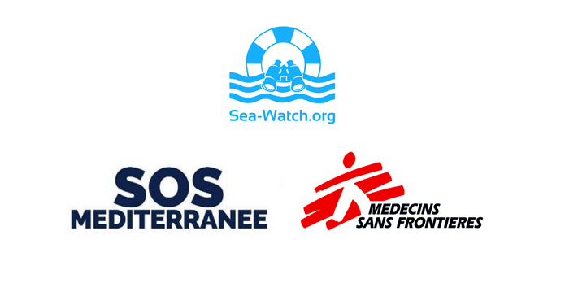
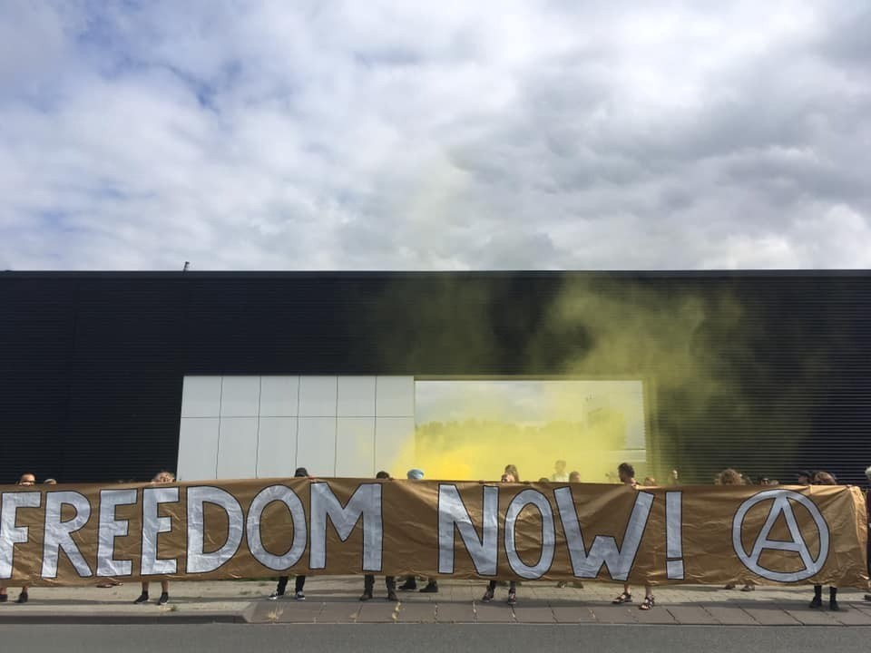

### AYS News Digest 04\-06/08/22: After 9 days at sea, 659 people disembark the Geo Barents
#### **659 people finally disembark Geo Barents, over 1500 lives and 21 vessels saved by SOS Mediterranee, MSF and Sea Watch in the past two weeks // Deportations from Algeria // Attempted crossings from Lebanon to Italy // A year of the humanitarian crisis in figures from MEDIENDIENST // Arbitrary arrests persist in Belgium // Further EU funding for migration management projects in Cyprus, Spain, Greece, Italy and Poland // Frontex’s ‘debriefings’ — interrogations? // & more**

](assets/ab3b1f8370be/1*P3hYSHHwWygatCrTs0Be-Q.png)

[https://twitter\.com/MSF\_Sea/status/1555092804690497536/photo/1](https://twitter.com/MSF_Sea/status/1555092804690497536/photo/1)

SAR

**The 659** people rescued at sea by Geo Barents were finally allowed to disembark in the port of Taranto, Italy, on August 4, after nine days of waiting on board\.

■■■■■■■■■■■■■■ 
> **[MSF Sea](https://twitter.com/MSF_Sea) @ Twitter Says:** 

> > 🟢 Update 🟢
The disembarkation of the 659 survivors rescued by our team is not over. 248 people are already onshore while 411 survivors are still waiting. The disembarkation will continue during the night time. https://t.co/HQf8Ad48Pe 

> **Tweeted at [2022-08-05 18:54:00](https://twitter.com/msf_sea/status/1555628203007434752).** 

■■■■■■■■■■■■■■ 

In total over the past two weeks, SOS MEDITERRANEE, MSF and SEA\-WATCH have rescued **21 boats in distress** saving the lives of around **1,500 people** \. The organizations urgently call for the provision of European state\-led search and rescue maritime assets in the central Mediterranean to prevent more deaths\.

■■■■■■■■■■■■■■ 
> **[Sea-Watch International](https://twitter.com/seawatch_intl) @ Twitter Says:** 

> > Without the presence of civil assets in the #CentralMed, the people rescued during #lifesaving operations would have been left to their fate on the world's deadliest sea migration route since 2014.

Read our joint press release with @[MSF_Sea](https://twitter.com/MSF_Sea) &amp; @[SOSMedIntl](https://twitter.com/SOSMedIntl): [sea-watch.org/en/sos-mediter…](https://sea-watch.org/en/sos-mediterranee-msf-sea-watch/) 

> **Tweeted at [2022-08-03 09:38:55](https://twitter.com/seawatch_intl/status/1554763735507558400).** 

■■■■■■■■■■■■■■ 

Joint Press release: [SOS MEDITERRANEE, MSF and SEA\-WATCH alert on the critical risk of more deaths in the central Mediterranean this summer in the absence of European state led search and rescue operations](https://sea-watch.org/en/sos-mediterranee-msf-sea-watch/)

**Alarm Phone on Malta** : “Malta’s local Maritime Rescue Coordination Centre \(MRCC\) — RCC Malta — and Armed Forces of Malta are doing all to prevent rescue operations and arrivals in Malta, backed up by the government”

■■■■■■■■■■■■■■ 
> **[Alarm Phone](https://twitter.com/alarm_phone) @ Twitter Says:** 

> > "In our opinion - and we have years of experience with them - RCC Malta and the Armed Forces of Malta are doing all to prevent rescue operations and arrivals in Malta, backed up by the government,” Alarm Phone said.
[aljazeera.com/features/longf…](https://www.aljazeera.com/features/longform/2022/7/31/ready-for-rescue-refugees-mediterranean-sea) 

> **Tweeted at [2022-08-04 15:57:11](https://twitter.com/alarm_phone/status/1555221317619798021).** 

■■■■■■■■■■■■■■ 

On the same topic, Malta continues to break international law

■■■■■■■■■■■■■■ 
> **[Gorden Isler](https://twitter.com/gorden_isler) @ Twitter Says:** 

> > Last Monday night, the #SEAEYE4 saved 87 lives in the Maltese (!) SAR Zone. Requests to @[Armed_Forces_MT](https://twitter.com/Armed_Forces_MT) to coordinate the distress and a place of safety remained unanswered. #Malta continues to break international law and ignores its responsibility for its own SAR zone. https://t.co/dztRNEiSR9 

> **Tweeted at [2022-08-05 17:10:44](https://twitter.com/gorden_isler/status/1555602216597209091).** 

■■■■■■■■■■■■■■ 

#### ALGERIA
### **Algeria is forcibly returning two thousand people to Niger every month**

Doctors Without Borders have documented the role of Algeria on the route between Sudan, Ceuta and Melilla in turning around people from all over Africa against their will\. See below for more detail\.

#### GREECE
### **A new route from Lebanon directly to Italy?**

Five people arrested on smuggling charges, found on an unseaworthy vessel with 100 migrants on board, including 40 children and 19 women\. All the individuals aboard were from Lebanon, and it appears that more people are seeking to reach Europe this way\. UNHCR have observed a significant increase in the number of people choosing to depart from Lebanon, even if most arrivals in Italy remain from Libya and Turkey\. Read more [here](https://www.infomigrants.net/en/post/42362/greek-authorities-arrest-five-smugglers-moving-migrants-from-lebanon-to-italy?fbclid=IwAR3C0EhPAy4eBjkbbOL9hzd-D2roYQFrTCkGs-9tTAqQrFFLxODWL6VBxuU) and [here](https://www.washingtonpost.com/world/greece-charges-5-with-smuggling-96-migrants-to-italy-by-sea/2022/08/02/8a30d5d6-1283-11ed-8482-06c1c84ce8f2_story.html?fbclid=IwAR2QUlr0t4T7st5SJnxPWRt6taxg5mVgPaE2Yak5-F7P4caiPwU2ynvqUIg) \.
#### BELARUS
### **A year in figures of the humanitarian crisis**

At least **23 people** have died at the EU’s external border with Belarus over the past year, and **187 missing persons** were reported by humanitarian organizations at the end of June, as officially documented by the German information service platform, [MEDIENDIENST INTEGRATION](https://mediendienst-integration.de/artikel/ein-jahr-humanitaere-krise-an-der-belarus-EU-Grenze.html?fbclid=IwAR3-xTkYKzrFCavOMftgXO-a9hVleac0_E_ThFBPmZjOXKcPr4pHtah6RvY) \.

Since last summer, several hundred people were illegally refused entrance and pushed back from Lithuania and Poland as both countries legalized illegal rejections at the border without the affected persons being able to apply for asylum\.

In Poland, the aid organization Grupa Granica recorded over 11,000 requests from people in need at the Polish\-Belarusian border, when the government introduced a restricted area with Belarus from September 2021 until June 2022\. People were blocked from accessing 183 towns along the more than 400\-kilometre border without any exemption for journalists or people providing humanitarian, legal and medical aid\. While at the same time, a border wall was constructed which was finalised by the end of June\.

Despite the restrictions, people in need continued to reach Europe through Belarus reaching 42,000 crossings to Poland and almost 7,000 to Lithuania from May 2021 to mid\-July this year\. And almost 14,000 migrants with a connection to Belarus reached Germany during the same period, mainly originating from Iraq, Syria, Lebanon and currently Sudan and Ghana\.

Read more [here](https://mediendienst-integration.de/artikel/ein-jahr-humanitaere-krise-an-der-belarus-EU-Grenze.html?fbclid=IwAR3-xTkYKzrFCavOMftgXO-a9hVleac0_E_ThFBPmZjOXKcPr4pHtah6RvY) and [here](https://www.infomigrants.net/en/post/42418/poland-says-more-subsaharan-migrants-are-attempting-to-cross-into-eu-via-poland?fbclid=IwAR3vxlalo7M092LMrc_CdlJokNLLiHvqxqh5T6TiYwSMvt1wawZLNnzNGLA) \.
#### SPAIN
### **14 people jailed following the Melilla tragedy**

In June this year \( [reported in this Digest](ays-news-digest-24-6-22-deaths-at-the-border-with-spain-44683109e846) \), more 20 people died after an incident at the border of Morocco and the Spanish territory of Melilla\. Fourteen men now face eight months in prison\. The men from Cameroon, Chad, Sudan, South Sudan and Libya have been charged with offences including belonging to a criminal gang and insulting officials\. The lawyer representing the group intends to appeal the decision\.

Melilla and Spain’s other territory Ceuta are the EU’s only land borders with Africa, yet the sea routes to Spain remain popular\. The number of arrivals on the Canary Islands accounts for two out of three arrivals in Spain, whilst it seems arriving on Spain’s coast directly has diminished\.

GERMANY

**Statement against internal EU pushbacks, Germany\.**

This joint statement by the refugee councils of three of Germany’s states acknowledges and condemns pushbacks between Germany and Poland\. Pushbacks have been reported at the Görlitz border point\. The refugee councils of Brandenburg, Sachsen and Mecklenburg\-Vorpommern are appalled by the situation and call for clarification\.

■■■■■■■■■■■■■■ 
> **[borderline-europe](https://twitter.com/BorderlineEurop) @ Twitter Says:** 

> > Pushbacks only exist at the EU's external borders? Wrong! At the German-Polish border, cases of #pushbacks are increasing. In Görlitz, a group of refugees were denied the right to apply for asylum and forcibly deported to Poland. #nopushbackislegal
More: [bit.ly/3PY11GM](https://bit.ly/3PY11GM) https://t.co/28gcSfRBOJ 

> **Tweeted at [2022-08-04 12:25:25](https://twitter.com/borderlineeurop/status/1555168024239521792).** 

■■■■■■■■■■■■■■ 

A man has finally been charged for [a crime against an asylum shelter](https://www.infomigrants.net/en/post/42372/man-charged-with-murder-over-1991-asylum-shelter-fire?) dating from 1991\. The man was charged with, amongst other things , murder following the arson of the shelter in the town of Saarlouis near the French border\. Authorities at the time had failed to find a suspect, but new evidence has recently come to light\.

The topic of how LGBTQI\+ refugees are treated is the subject of [this article](https://www.migazin.de/2022/08/02/queere-gefluechtete-wenn-verhalten-abschiebung/) \.

“The logic of the authority goes something like this: If a queer refugee behaves inconspicuously in his home country, he cannot be persecuted for his sexuality — and consequently cannot successfully apply for asylum\.”

This response, shared by many other EU authorities, has caused outrage in the Queer community with groups, including the Lesbian and Gay Association of Germany, demanding change\.
#### BELGIUM
### **Arbitrary arrests and detention still persistent in Belgium**

Racial profiling by police continues to be a persistent problem in Belgium\. People who have entered the country on holiday to visit family have been arrested and kept at the Caricole closed detention centre, near Brussels Airport, because their stay is considered “suspicious” by the federal police and the Foreigners’ Office, states the grassroots NGO, [Getting the Voice out](https://www.gettingthevoiceout.org/arrestaties-en-deportaties-aan-de-lopende-band-02-08-2022-2/) \.

Police officers in civilian clothes often conduct arbitrary arrests of individuals considered “suspicious”, in the streets, on public transport, in airports, at the Foreigners Office, in open centres or even in people’s homes\.

**Arrests at people’s homes** : _“after a request for regularisation, a request for marriage or co\-habitation or a procedure for recognising a child, the administration of the concerned commune must register the official domicile\. Very soon after the police arrive at the home to “carry out a control” and, if they consider people “suspicious”, arrest them and take them to a detention centre”_ , writes Getting the Voice out\.

The vague formulation of the police motives leading to the so\-called ‘routine checks’, has been reported by [Belgian media](https://www.brusselstimes.com/167494/united-nations-committee-racial-descrimination-concerned-about-belgiums-police-violence-racial-profiling-black-lives-matter-coronavirus-fighting-measures-lockdown-migrants-charleroi) over the years and highlighted since 2021 by the UN Committee for the Elimination of Racial Discrimination \(CERD\) in a report raising concerns over the alleged racist violence and profiling by police in Belgium\.
#### FRANCE
### **Political rhetoric continues to distort and dehumanise people on the move**

Utopia 56 has highlighted the hypocrisy of the French government’s rhetoric: people on the move are not treated as people\. Whilst Macron extols the importance of protecting children, 60 isolated minors continue to live at Place de la Bastille, where they have been for 68 days\.

■■■■■■■■■■■■■■ 
> **[Utopia 56](https://twitter.com/Utopia_56) @ Twitter Says:** 

> > Depuis 68 jours, plus de 60 jeunes isolés et à la rue survivent place de la Bastille. 
Depuis 68 jours, le gouvernement ignore leur appel à l’aide.
@[EmmanuelMacron](https://twitter.com/EmmanuelMacron) « La protection de l’enfance sera notre priorité ». https://t.co/Fghyogh0mT 

> **Tweeted at [2022-08-03 06:33:06](https://twitter.com/utopia_56/status/1554716975561154560).** 

■■■■■■■■■■■■■■ 

This double\-standard was further evidenced on 2nd August when a man living at Grande\-Synthe suffered an epileptic fit\. It took 25 minutes for the fire brigade to come, who then waited 200m away from the man in need until the police arrived\. He was eventually taken to hospital an hour later, his human right to medical aid having been withheld\.

In a similar vein, the Dunkirk court has recently dismissed a case, brought by six individuals on the move, about the legality of an eviction from Grande\-Synthe in 2021\. Why? There was ‘no proof’ that they had ever lived there — reported by Human Rights Observers:

■■■■■■■■■■■■■■ 
> **[Human Rights Observers](https://twitter.com/HumanRightsObs) @ Twitter Says:** 

> > Le 12/07, le tribunal de Dunkerque a débouté 6 personnes exilées qui attaquaient la légalité de 2 expulsions à Grande-Synthe en 2021.
Il n'était soi-disant pas possible de prouver leur présence sur le lieu de vie. Un énième montage juridique raciste au pays des droits de l'Homme. https://t.co/ZGltScrLQE 

> **Tweeted at [2022-08-02 11:56:12](https://twitter.com/humanrightsobs/status/1554435895406825474).** 

■■■■■■■■■■■■■■ 

This avoidance of responsibility is rife amongst French bureaucrats, as illustrated here\. Actu Nice asked Christian Estrosi, the Mayor of Nice no less, where evicted people would go\. His answer: _ce n’est pas mon affaire_ \. See below for more\.

■■■■■■■■■■■■■■ 
> **[Romane Frachon (she)](https://twitter.com/RomFra) @ Twitter Says:** 

> > Christian Estrosi, costard cravate, qui organise une conf de presse au milieu des tentes de migrants. "Et où iront ces personnes, une fois expulsées dans les 48 heures ? Le maire balaye la question d’un revers de la main : ce n’est pas mon affaire." Un papier de @[cyrilbottollier](https://twitter.com/cyrilbottollier) 

> **Tweeted at [2022-08-02 14:38:08](https://twitter.com/romfra/status/1554476646798966784).** 

■■■■■■■■■■■■■■ 

**Gérald Darmanin continues to peddle a dehumanising narrative against ‘ _delinquent foreigners_ ’, seeking to legalise and simplify the process of expelling individuals from mainland France\.** Marc Duranton, a legal practitioner at French NGO La Cimade, writes that Darmanin’s words are pure politics: they manipulate public opinion, suggesting that French law is highly protective of foreign citizens\. This is simply misleading\. Read more [here](https://www.infomigrants.net/fr/post/42336/expulsions-des-etrangers-delinquants--darmanin-vante-sa-fermete-mais-ne-propose-rien-de-nouveau?fbclid=IwAR0tC3xAqBQWVG_NwoUnwt2fOHEXmtrXEbuUyqQ5Q_TKjnk3sXY4Li7xvtQ) \.
### **Mayotte**

**Following the violent death of Burundian national Mohamed Feruzi on 17th July 2022, over 200 foreign nationals have marched in solidarity against entrenched xenophobia on the French overseas territory of Mayotte\.** La Cimade has noted the unequal rhetoric that surrounds migration to the island, with governmental bodies often seen to blame foreigners for problems faced by the territory\. More [here](http://www.infomigrants.net/fr/post/42255/a-mayotte-les-demandeurs-dasile-selevent-contre-les-agressions-xenophobes?fbclid=IwAR3C0EhPAy4eBjkbbOL9hzd-D2roYQFrTCkGs-9tTAqQrFFLxODWL6VBxuU) \.
#### NETHERLANDS
### **International No Border Camp in Rotterdam: ‘Abolish Frontex’**

No Border Camp 2022 is taking place in Rotterdam from Monday 8 to Sunday 14 August and puts in the spotlight the EU’s border regime, Frontex\. Hundreds of international activists will gather for a week of actions, meetings, workshops, discussions and culture in the context of the struggle for a world without borders and freedom of movement for all\. Follow No Border Camp social media for the exact location\.

[Press release — No Border Camp 2022](https://nobordercamps.eu/abolish-frontex/)

■■■■■■■■■■■■■■ 
> **[No Border Camp NL](https://twitter.com/camp_nl) @ Twitter Says:** 

> > Counting down to No Border Camp! It's in Rotterdam, starting next monday, August 8. Pressrelease: [nobordercamps.eu/2022/08/03/8-1…](https://nobordercamps.eu/2022/08/03/8-14-august-international-no-border-camp-in-rotterdam-abolish-frontex/) 
Follow us for more info, RT is nice. https://t.co/vncZy50cE3 

> **Tweeted at [2022-08-03 11:52:23](https://twitter.com/camp_nl/status/1554797325419151360).** 

■■■■■■■■■■■■■■ 

#### EU
### **€171 million for “migration management projects”**

Up to 171 million in new funding will be offered to Cyprus, Spain, Greece, Italy and Poland to aid in the reception of asylum seekers\.

The funds in Cyprus will go toward building facilities to host the migrants and pre\-departure centres in the area of Menoyia, in Larnaka; while in Spain, for Ceuta and the Canary isles, to reinforce shelters; in Greece, to support international organizations and the improvement of human rights of the refugees, and direct assistance for repatriation procedures for Poland\. And finally, in Italy, to strengthen the reception system from arrival to all phases of reception, to protect and care for the most vulnerable refugee children and women\. Read more [here](https://ec.europa.eu/commission/presscorner/detail/en/mex_22_4842?fbclid=IwAR2P2o7HvwjGf-_4LbA-GD09W8DG-pSAp3bBLsr_Fx8IrBUPUCuvDGunG8U) \.
#### FRONTEX
### “ _Clearly, Frontex is, again, acting in parallel to the law_ ”

**Statewatch** **have published an article that highlights the ways in which Frontex evade responsibility, particularly through the interrogation\-not\-interrogation ‘debriefing’ interviews that are conducted with individuals upon their arrival in Europe\.** Cova Bachiller López and Fran Morenilla unpick the ‘debriefing’ process and use it to ask: _“So, what is the actual relevance of these interviews in dismantling criminal networks? What is the value of testimonies gathered under the conditions described above, without lawyer, privacy and, at times, interpreter?_ \[…\] _One should also question the relevance of Frontex’s work and the seemingly incessant expansion_ \.’ Read the full article [here](https://www.statewatch.org/analyses/2022/questioning-the-interviewers-frontex-s-covert-interrogations-at-the-spanish-southern-border/?fbclid=IwAR2-oDr8H45uFQpZjX0gZA_HS6ASkK4AKMug5Z73oRT7a3Y1B7zWwMu0uIY) \.
#### WORTH READING AND WATCHING
- From the Polish border — Meet activist Mirosław Miniszewski — now with [English subtitle](https://www.youtube.com/watch?v=KKZn2YKidc4) s\.
- New Humanitarian — so far the reception of [Ukrainian refugees](https://www.thenewhumanitarian.org/news-feature/2022/08/04/Poland-Ukraine-refugee-concern-grows?fbclid=IwAR0r3xlu1JY_5cXdJSRXrSoxLCGcGsfsbS1PdErK6KiWj8DHNOKiorA6SC0) has gone smoothly, but volunteers are burning out\. What happens next?
- [Journal of Ethnic and Migration Studies](https://www.tandfonline.com/doi/full/10.1080/1369183X.2022.2099363?fbclid=IwAR1_B7oLtuZw_IjFo8xP24jt4KjBtGc6CcRwgkLsHzwu3vcbGQxI19-89ao) discuss how actors from the far right and the political mainstream obstruct humanitarian NGOs\.
- Tareq Alaows — Syrian refugee in Germany, talks about the [racist asylum policy of the EU](https://www.thenewhumanitarian.org/interview/2022/07/26/Tareq-Alaows-on-the-EU-racist-refugee-system) \.
- Refugees International shared a [report](https://www.refugeesinternational.org/reports/2022/7/25/2022-global-refugee-work-rights-report?) on allowing work access for asylum seekers\.
- Balkan Insight — [tensions rising towards Ukrainian refugees in neighbouring countries\.](https://balkaninsight.com/2022/08/05/democracy-digest-report-warns-of-refugee-fatigue-orbans-cpac-speech/)
- [Refugee history](http://refugeehistory.org/blog/2022/8/4/who-is-counting-refugees-displacement-data-its-limitations-and-potential-for-misuse?fbclid=IwAR03GkQ5GoWLxu6DRHAjpquM7lA3ermt4ePnOYI01fgR5vJ1WQeMsUhF8yM) by Dr Jeff Crisp, Fellow at the Refugee Studies Centre, University of Oxford\.

**Find daily updates and special reports on our [Medium page](https://medium.com/are-you-syrious) \.**

**If you wish to contribute, either by writing a report or a story or by joining the Info Gathering team, please let us know\!**

**We strive to echo correct news from the ground through collaboration and fairness\. Every effort has been made to credit organisations and individuals with regard to the supply of information, video, and photo material \(in cases where the source wanted to be accredited\) \. Please notify us regarding corrections\.**

**If there’s anything you want to share or comment on, contact us through Facebook, Twitter or write to: areyousyrious@gmail\.com**

_Converted [Medium Post](https://medium.com/are-you-syrious/ays-news-digest-04-06-08-2022-after-9-days-at-sea-659-disembark-the-geo-barents-ab3b1f8370be) by [ZMediumToMarkdown](https://github.com/ZhgChgLi/ZMediumToMarkdown)._
