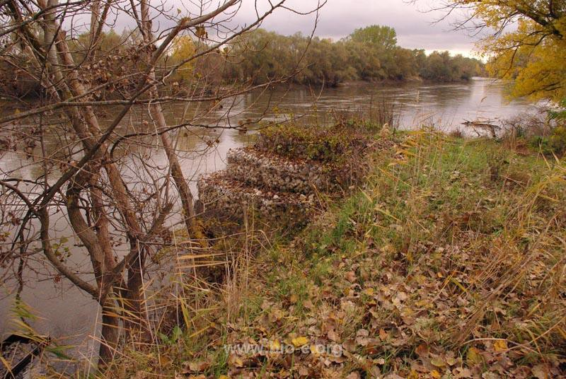

### AYS News Digest 10/8/22: A five\-year\-old girl died on Evros, her family still remains there, helpless
#### New victims of shipwrecks, but also new SAR vessels in the continuous struggle to cross into what is perceived as safety / A police officer fired a machine gun six times at a 16\-year old Senegalese in Germany / Recent reports pinpoint the lack of protection of migrants against the risks of exploitation, closely linked to the shortcomings of the British asylum system / More reports, news, updates and some really important and interesting propositions for reading

Evros \(Photo: bio\-e\.org\)
#### FEATURE

On the islet of Evros east of the village of Kissari, people are still stranded\. Following the tragic death of the five\-year\-old girl came a shocking appeal for help sent by Baida A\., a 28\-year\-old from Syria, to the media\.

> What will we become? 

> Maybe in the morning we will all be dead\. 

> The island is full of snakes, scorpions, insects and I don’t know what else… I beg, I beg\. We are living a hell on earth, I swear to you it is hell on earth and no one can help us 

A scorpion bite is reportedly the direct cause of death of the little Maria, and it also stung a nine\-year\-old girl, Agia, who remained helpless on the island with fever and vomiting for the second day yesterday\. According to what the people there report, Maria’s lifeless body remains unburied\. “To preserve it as much as they can, the refugees have put it in the cold waters of the river, while her mother is grieving on the riverbank”, says the tragic report published in the Greek [media](https://www.efsyn.gr/ellada/dikaiomata/355170_egklima-diarkeias-ston-ebro) \.

The media report that “one Syrian refugee from the group died on the Greek bank of the Evros after a violent attempt by the Greek authorities, and two others tragically drowned when they fell into the river from the boat during their transport to the islet by the Greek authorities\.”

> According to the complaints, the people were detained in Turkey in a detention center\. After a few days, the Turkish authorities forced them to cross the Greek\-Turkish border again, otherwise they would be deported to Syria\. They split them into two or more groups and scattered them in different parts of the region, where they had no possibility to turn back, as the Turkish authorities threatened to push them back to Syria, nor the possibility to reach the Greek shore, where they were waiting the murderous violence of the Greek authorities and the serious possibility that they will turn them back\. 

> The geographical footprint available to “Ef\.Syn\.” depicted them last week on Greek soil east of the river\. On Sunday, the refugees were again driven to the islet east of Kissari village, the same islet where their nightmarish adventure began three weeks ago, _EFSYN reports\._ 

■■■■■■■■■■■■■■ 
> **[Amnesty EU](https://twitter.com/AmnestyEU) @ Twitter Says:** 

> > We call Greece to comply urgently with @[ECHR_CEDH](https://twitter.com/ECHR_CEDH) interim measures &amp; fulfil its obligations under Rule 39. These people’s human rights to life, physical integrity &amp; health must be protected. They must be urgently rescued, provided support, healthcare and granted access to asylum. 

> **Tweeted at [2022-07-22 12:48:56](https://twitter.com/amnestyeu/status/1550462899885424640).** 

■■■■■■■■■■■■■■ 

“ECtHR ordered the Greek authorities to provide assistance to Syrian refugees stranded on the islet of Evros but instead they pushed them back to Turkey\. This blatant violation of international law and disrespect for European courts illustrate the rule of law crisis in Greece”, said MEP Tineke Strik\.

[BVMN](https://www.borderviolence.eu/urgent-update-briefing-on-the-continuous-violations-of-the-rule-of-law-in-greece-as-people-still-stranded-on-islet-in-evros/?fbclid=IwAR0klncy4OUzx-Y0AAqjAskjEmN9zyaYw0cSlXmH3i0IMF0GN76BmXmocIA) issued an update — “Despite the ECtHR indicating a Rule 39 measure mandating the Greek state to carry out search and rescue operations, as well as provide medical support, access to Greek territory and food and water, the group remains on the islet today in severely deteriorating conditions\. Alarmingly, the transit group reported that a young five\-year\-old girl died in the early hours of 9 August 2022, and a nine\-year\-old girl is in urgent need of medical care\. BVMN joins the Greek Council of Refugees and Human Rights 360 to urgently call upon the Greek authorities to carry out search and rescue and provide the transit group access to their fundamental rights\. The briefing further makes recommendations to the European Commission to hold Greece accountable for such violations\.”
