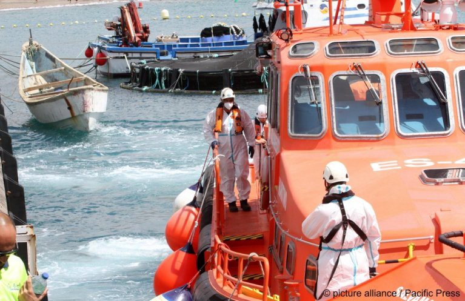
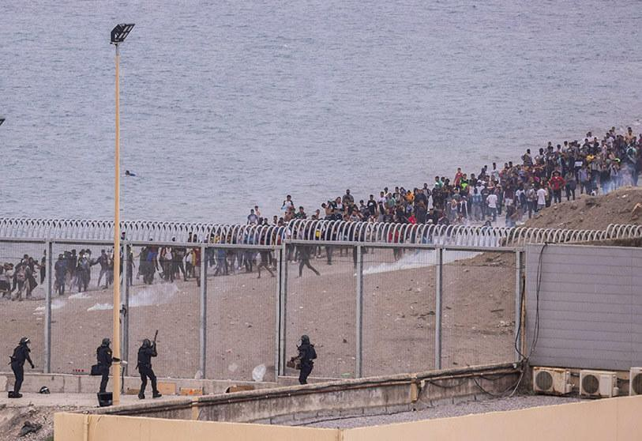
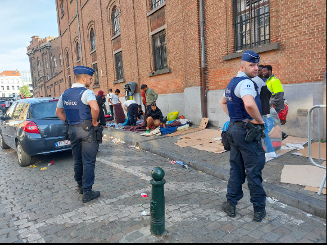

### **AYS News Digest 18/08/22: 1500 asylum seekers and refugees forcibly displaced by the closure of Athens’ Eleonas camp**

Closure of Eleonas reception centre // further inaction on the Evros border // 17 people in distress near Lampedusa // an EU\-Morocco deal in the same vein as the EU\-Turkey one? // an increase in detentions and departure preventions in Tunisia and Libya // Tripoli’s flight ban violates international law // indefinite detention in Poland // Berlin airport’s deportation centre finds a dodgy donor // Frontex and EUCAP Sahel\-Niger sign an ‘operational partnership’ // Josoor forced to dissolve & much more

](assets/de95c32c81c0/1*VjeslTrnl9Zw3wdH476YTQ.png)

A screenshot from footage taken at Eleonas by a resident\. Available here: [https://twitter\.com/SchmitzFlorian\_/status/1559559874983469059](https://twitter.com/SchmitzFlorian_/status/1559559874983469059)
#### Residents of Eleonas camp will be forced to live on the streets\.

As reported in [AYS News Digest 07/07/22](ays-news-digest-6-7-22-rohingya-child-challenges-croatia-and-slovenia-over-violent-pushbacks-a12dcf649db8) , the mayor and Municipality of Athens insist that the initial emergency migration circumstances that led to the camp’s opening are no longer present\. What they have deemed necessary, however, is a new soccer stadium which will be built upon the former site of the reception centre\. The permanent closure of Eleonas will deny many individuals access to their schools, work places, and basic services\. Disregarding sustainable solutions to reception and integration, the authorities attempted to begin transfers on 16th August\. Met with protests from residents and former employees of the camp, the authorities are unrelenting and the eviction has been rescheduled for today\. The true logic behind Eleonas’ closure seems to be one of occlusion: an attempt to hide further those marginalised by the asylum system from the public eye, from social responsibility, and to push these people towards pseudo\-detention in more rural parts of Greece, away from Athens\.

■■■■■■■■■■■■■■ 
> **[Europe Must Act](https://twitter.com/EuropeMustAct) @ Twitter Says:** 

> > 1/Today, close to 1500 asylum seekers and refugees are being forcibly displaced by Greek authorities from the reception centre of Eleonas, in Athens, to be moved in closed and remote camps in Greece. 

> **Tweeted at [2022-08-16 11:32:42](https://twitter.com/europemustact/status/1559503412831653890).** 

■■■■■■■■■■■■■■ 

#### **GREECE**
#### Greece’s reception of Ukrainian refugees highlights the politics of wilful inequality

About 7000 people have entered Greece from Turkey this year, either across the land border or the Aegean Sea\. Forced to take irregular routes upon which exploitation and abuse is rife, individuals arriving via such routes are met with divergent treatment to those arriving from Ukraine\. As many as 17,000 refugees live in Greek camps, and are reliant upon residence in government structures to access financial aid\. By contrast, 18,000 Ukrainians \(72,000 Ukrainians have entered Greece since Russia invaded Ukraine in late February 2022\) have applied for protection under an EU TPD, which gives people the right to live, work, and access essential services in EU member states for up to two years\. [Greece’s Migration Minister Notis Mitarachi referred to Ukrainians as ‘ _real refugees_ ’ in March](https://twitter.com/nmitarakis/status/1498621457005531140?s=20&t=Kg57eegZuB-4jOeawIN8Pw) , and the discrepancy in the efficiency and humane\-ness of reception in Greece illustrates that significantly different solutions to reception are possible\. Kleio Nikolopoulou, an advocacy officer and lawyer for the Greek Council of Refugees, says that:

> “\[They\] don’t want people \[from Asia and Africa\] to actually enter the country,” Nikolopoulou said\. “It is so frustrating to see how differently \[Ukrainians and non\-Ukrainians\] are being handled\.” 

Read Melissa Pawson’s brilliant article in full here:

#### 49 people stranded on an islet at the Evros river border, including 16 children and a pregnant woman

Only days after a [five\-year\-old girl died on Evros](ays-news-digest-10-8-22-a-5-year-old-girl-died-on-evros-her-family-still-remains-there-helpless-869b6d619c2d) , another group of people find themselves trapped there\. The European Court of Human Rights has mandated Greece to receive the group: “ _to apply Rule 39 until further notice \[…\] the applicants should not be removed from Greece and be provided with food, water and adequate medical care as needed until further notice\.”_

■■■■■■■■■■■■■■ 
> **[Border Violence Monitoring Network](https://twitter.com/Border_Violence) @ Twitter Says:** 

> > 🔴❗URGENT:
Another group have been stranded on an islet in the #Εβρος border river near to Didymoteicho, reportedly for the last two days. There are 45 Syrians and 4 Kurdish Turkish people, including 16 children and one woman who is four months pregnant. 1/ https://t.co/8c3iZBvqld 

> **Tweeted at [2022-08-16 16:02:57](https://twitter.com/border_violence/status/1559571423974330369).** 

■■■■■■■■■■■■■■ 

■■■■■■■■■■■■■■ 
> **[Border Violence Monitoring Network](https://twitter.com/Border_Violence) @ Twitter Says:** 

> > Today at 17.33CET the @[ECHR_CEDH](https://twitter.com/ECHR_CEDH) granted interim measures for the group of 49 Syrian and Turkish asylum seekers trapped on an islet in the #Εβρος border river. The Court has mandated Greece to provide the group with material reception conditions, asylum procedures and 1/ https://t.co/WGDw1E4KRt 

> **Tweeted at [2022-08-17 18:29:34](https://twitter.com/border_violence/status/1559970709320994818).** 

■■■■■■■■■■■■■■ 

Hopefully BVMN’s prompt actions will prevent another tragedy such as last week’s, forcing the Greek authorities to act\. Indeed, Greek authorities claimed that those stranded on Evros last week had been ‘found’ after their four\-day ordeal— a linguistic choice that suggests the Greek police had no agency over the situation\. [Pushbacks have been reported in both directions](https://www.infomigrants.net/en/post/42664/migrants-stranded-on-evros-island-found-by-greek-authorities?fbclid=IwAR34v9Is3cery92y8SYDfnXQ3NaBuKb1H_NpsWtMU8Qn8azbHspuxQlpjco) , showing how such language reframes and misleads an understanding of the situation\. This linguistic gaming echoes the evasion of responsibility that both Turkish and Greek authorities justify through the geographical complexity of the Evros border\. Human Rights 360 write that:

> “When life is at risk, to claim that the area right next to your door does not belong to you and you claim that you don’t care for what is happening there, is just a pretext in order to evade your liability\.” 

■■■■■■■■■■■■■■ 
> **[HumanRights360](https://twitter.com/rights360) @ Twitter Says:** 

> > Joint @[GCRefugees](https://twitter.com/GCRefugees) &amp; #HR360 statement on the Evros islet case:👇
🇬🇷 gvt insists that the islet, with 39 refugees and the dead body of a 5 y-o child, does not belong to the 🇬🇷 territory &amp; therefore not liable for their protection. Yet, even so, this is not valid. 

> **Tweeted at [2022-08-15 12:31:11](https://twitter.com/rights360/status/1559155743760203783).** 

■■■■■■■■■■■■■■ 

■■■■■■■■■■■■■■ 
> **[Eleni Konstantopoulo](https://twitter.com/EleniKonstanto) @ Twitter Says:** 

> > 'Today, the #Evros #Refugees will be taken to the Fylakio Prison, where the Minister of migration &amp; #Asylum will visit them &amp; make statements. They are 22 men, 9 women and 7 children. Why is the Minister part of the 'screening' of the asylum process? [capital.gr/politiki/36529…](https://www.capital.gr/politiki/3652951/ston-ebro-gia-sunantisi-me-tous-38-metanastes-o-n-mitarakis) 

> **Tweeted at [2022-08-16 09:43:58](https://twitter.com/elenikonstanto/status/1559476047585939460).** 

■■■■■■■■■■■■■■ 

Read more about Evros’ sovereignty [here](https://www.efsyn.gr/politiki/antipoliteysi/355810_poy-anikei-telika-i-nisida-ston-ebro) , as members of the Greek parliament ask for clarity over the islet’s nationality\. Of course, it is fear of pushbacks and violence that are forcing people to stay on the Evros island black\-spots in the first place\.
#### Alarm Phone has reported that 21 people, stranded on Agathonisi, have been pushed back to Turkish waters by the Hellenic Coast Guard

■■■■■■■■■■■■■■ 
> **[Alarm Phone](https://twitter.com/alarm_phone) @ Twitter Says:** 

> > 🆘from #Agathonisi, Dodekanisa islands, #Greece

21 ppl stranded on Agathonisi, one of them injured. They sent this video and claim that a local fisherman burned their boat. We informed @GCoastGuard &amp; @[hellenicpolice](https://twitter.com/hellenicpolice).

#StopPushbacks https://t.co/GlUpxi5GaQ 

> **Tweeted at [2022-08-17 10:00:20](https://twitter.com/alarm_phone/status/1559842557210902529).** 

■■■■■■■■■■■■■■ 

#### SEARCH AND RESCUE
#### 17 people are in distress near Lampedusa\. Authorities watch on as the situation escalates, 24h after being alerted by Alarm Phone **\.**

■■■■■■■■■■■■■■ 
> **[Alarm Phone](https://twitter.com/alarm_phone) @ Twitter Says:** 

> > 🆘️near Lampedusa!
We have contact to a boat with 17 people on board, drifting in #Maltese SAR. European authorities were alerted 11h ago but instead of acting they have been watching the situation escalate. The situation is critical - without immediate rescue we fear the worst! https://t.co/JdL1ISBBeO 

> **Tweeted at [2022-08-17 19:34:33](https://twitter.com/alarm_phone/status/1559987061465178113).** 

■■■■■■■■■■■■■■ 

The Maltese SAR zone is seeing numerous violations of international law as Malta refuses to rescue those in distress, and the so\-called Libyan coastguard enacts pullbacks\.

■■■■■■■■■■■■■■ 
> **[Sea-Watch International](https://twitter.com/seawatch_intl) @ Twitter Says:** 

> > A boat in distress in the Maltese search and rescue zone: #Malta refuses to rescue, the so-called Libyan Coast Guard intercepts the people. Both violate international law.
An incident that we, unfortunately, have to observe all too often. https://t.co/s7jSdsF4GP 

> **Tweeted at [2022-08-17 09:52:34](https://twitter.com/seawatch_intl/status/1559840600349982720).** 

■■■■■■■■■■■■■■ 

#### 18 people have tragically died in a shipwreck off the coast of Tarfaya, Morocco

Seven women and a baby are amongst the victims, who spent eight hours awaiting a rescue that never came\.

■■■■■■■■■■■■■■ 
> **[Helena Maleno Garzón](https://twitter.com/HelenaMaleno) @ Twitter Says:** 

> > 🔴 TRAGEDIA. Mueren dieciocho  personas, entre ellas siete mujeres y un bebé, en un naufragio frente a las costas de Tarfaya. Estuvieron ocho horas de agonía esperando un rescate. 

> **Tweeted at [2022-08-16 12:47:36](https://twitter.com/helenamaleno/status/1559522263556411392).** 

■■■■■■■■■■■■■■ 

#### **45 Moroccans rescued off the Canary Islands**

Spanish authorities received a distress call from a vessel 7km off Fuerteventura on Monday night\. The boat was located in a distressing condition, with three deceased bodies on board amongst those who were rescued\.

_Spanish rescuers were busy this weekend, pulling people from the waters around their Atlantic archipelago, the Canary Islands \| Photo: Picture Alliance / Pacific Press_

Full article [here](http://www.infomigrants.net/en/post/42660/three-dead-45-migrants-rescued-off-canary-islands?fbclid=IwAR0JVYwSQFCwmqtJi3c9NUGkLvaUAf29HsnKtmxMki9YfrfMEKZ9V0J2oHY) \.

**Tunisia has intercepted 657 people at sea over the weekend**

There have been reports of 46 separate incidents between 12–15th August, with 657 individuals either stopped from crossing or rescued after their boats came into trouble\. As Tunisia’s economic and political situation deteriorates, more people seek to cross the Mediterranean to escape rising unemployment\.

#### MOROCCO

**13 migrants have been sentenced to 2\.5 years in prison and fined 10,000 Moroccan Dirham \(circa €1000\) at court in Nador** \.

The severity of their sentence illustrates the use of the judicial system as a deterrent that is used against people and to political ends, rather than to help those seeking refuge\.

#### Morocco is set to receive €500 million from the EU to control its borders against irregular immigration\. A new EU\-Turkey deal?

**AP/BERNAT ARMANGUE** — Migrants next to the Spanish\-Moroccan border

The majority of irregular entries into Spain come via Morocco, and the increased budget allocation \(2x what it was previously\) is intended to fund border control infrastructure and resources up to 2027\.

This prospective agreement comes just seven weeks after the Melilla massacre on 24th June 2022, [when at least 23 people were killed trying to cross the Barrio Chino fence\.](ays-news-digest-24-6-22-deaths-at-the-border-with-spain-44683109e846) Moroccan authorities have been accused of [instrumentalising migration](https://english.alaraby.co.uk/analysis/spain-and-morocco-new-friendship-inked-blood?fbclid=IwAR3zwquiwj235Dcdtjb-w3LFr_MKmRE3OKfs5_FUmmjIUlWsu5Z7HoX5lFs) by AMDH \(Moroccan Association of Human Rights\) to improve relations with Madrid — On 24th June, over 2000 people walked to the border fence for over an hour, observed but unchecked\. It seems that the excessive violence on the Melilla border has been welcomed enthusiastically by Spain and the EU\.

> “The Melilla massacre highlighted Morocco’s readiness to sacrifice its friendship with its African neighbours to gain the validation of a European state” 

> “The death of those young Africans on the European borders is a warning to us about the deadly nature of the Moroccan\-Spanish security collaboration on immigration” 

Those responsible for the violence and murders on the 24th June have still not been held accountable\.

As _Globalist_ puts it:

> Morocco\-EU, when the “Erdogan model” pays _— read their take on border blackmail and outsourced violence in full_ [here](https://www.globalist.it/world/2022/08/16/migranti-marocco-ue-quando-il-modello-erdogan-paga/?fbclid=IwAR0CGbE5mrzApk2RBExT7v974Kb7dslpul1JF4WBHJYiHOVqWPNAu16rKQw) \. 

More [here](https://newsrnd.com/news/2022-08-15-morocco-will-receive-500-million-from-the-eu-to-control-its-borders.rkLBEDBORq.html?fbclid=IwAR0O_QnNvVF93FuQB6XpVPKgEpzI-WPg7wguYRNoofwWHvRSpDQj_pNc2rg) and [here](https://english.alaraby.co.uk/analysis/spain-and-morocco-new-friendship-inked-blood?fbclid=IwAR3zwquiwj235Dcdtjb-w3LFr_MKmRE3OKfs5_FUmmjIUlWsu5Z7HoX5lFs) too\.
#### **LIBYA**
#### [On Monday, the Libyan authorities reportedly rounded up and detained dozens of migrants in Tripoli\.](https://www.thenationalnews.com/mena/2022/08/16/libya-detains-dozens-of-migrants-in-home-raids-in-tripoli/?fbclid=IwAR1Xpin-Q_1AqtTbvFBv2DqB6IngiPyNJOQRLxA-7mpvcT10mjWNB-J2kDw) People on the move stuck in Libya are increasingly targeted as scapegoats for the nation’s problems\. Such raids are now regular occurrences\.

](assets/de95c32c81c0/1*9lU7vXXM3f3ffE5YdqUepw.jpeg)

Photo: EPA/STR [https://www\.infomigrants\.net/en/post/42644/dozens\-of\-migrants\-detained\-in\-libya\-during\-police\-raids?fbclid=IwAR3GFpEcFsJ1XawwSCwUY5PzyL0QkQgQ4kwy0590HDdguskKA9UpTIwu5Fg](https://www.infomigrants.net/en/post/42644/dozens-of-migrants-detained-in-libya-during-police-raids?fbclid=IwAR3GFpEcFsJ1XawwSCwUY5PzyL0QkQgQ4kwy0590HDdguskKA9UpTIwu5Fg)

A police statement said that legal measures would be taken against those detained in Tripoli’s Airport Road area, and claimed that these raids are linked to an increase in local crime including prostitution, robbery and drug trafficking\. Proof for such allegations remains absent\.

**5000individuals \(at least\)** , **including women and children, were detained in similar operations last year** \. Human rights activists have long decried such detention centres, which are ‘ _rife with abuse’\._

InfoMigrants reports that the whole operation could be a cover up for the deaths of two migrants at the weekend, who worked as garbage collectors in the Airport Road area\. Tarik Lamloum, a Libyan activist working for the Belaady Organisation for Human Rights, told _AP_ that:

> “Most migrants in the area are workers in workshops and farms, not criminals” 

More here:

■■■■■■■■■■■■■■ 
> **[Refugees In Libya](https://twitter.com/RefugeesinLibya) @ Twitter Says:** 

> > Yesterday the so-called security forces violently raided homes of refugees living at the #airport_road About 100+ were arrested followed by arbitrary detentions.Their properties all stolen, Libya seems to enjoy these notorious inhumane acts on people, while the world is silent 😶 https://t.co/7uiJd8x5Rt 

> **Tweeted at [2022-08-16 07:26:31](https://twitter.com/refugeesinlibya/status/1559441457538387969).** 

■■■■■■■■■■■■■■ 

#### The German Government has ratified findings by the Bundestag’s researchers that Tripoli’s flight ban violates international law\.

However, unless Germany brings the matter to the ICAO, the International Civil Aviation will not intervene, and the ban on civilian flights for sea rescue in the central Mediterranean will remain despite the fact that the high seas are outside all territorial waters\.

> “More than hypocritical assurances to speak out against Libya’s de facto ban on rescue flights, concrete action is needed” — Clara Bünger, member of the Bundestag\. 

More detail here:

and an English language version here:

#### **A Libyan police officer has been identified as responsible for human trafficking and repeated abuse in Tazerbo, Libya** \.

Last week he received a promotion to the rank of lieutenant\-colonel\.

■■■■■■■■■■■■■■ 
> **[Refugees In Libya](https://twitter.com/RefugeesinLibya) @ Twitter Says:** 

> > #Mansour_Farag_Ahneesh
 Agricultural police officer have been identified as the culprit of human trafficking in #Tazerbo where he owned a warehouse for 3years, killed, raped &amp; tortured many. Upon discovery,331 victims were found in the warehouse.They were from 3 nationality
1/2 https://t.co/5zq3v3fwHO 

> **Tweeted at [2022-08-17 10:09:03](https://twitter.com/refugeesinlibya/status/1559844749057703937).** 

■■■■■■■■■■■■■■ 

#### ITALY
#### Minors are being tried and imprisoned in Italy as adults, “while the real traffickers remain in Libya _”\._

_Il Fatto Quotidiano_ cites an ANSA \(Italy’s National Associated Press Agency\) report, detailing the stories of minors on un\-crewed vessels that cross the central Mediterranean\. The smugglers and human traffickers never board the boats themselves, whilst minors fleeing conflict and persecution are charged\. Watch ANSA’s report here:

#### The southern Italian region of Calabria allocates €10 million to create an environmentally sustainable ‘village’ for non\-EU workers

The Piana di Gioia Tauro area hosts many migrant workers, oftern employed in citrus groves and the port area\. The project intends to provide suitable housing for around 100 workers, who currently live in precarious or makeshift accommodation\.

#### POLAND
#### The Polish government continues to practice a policy of indefinite detention, often locking up those seeking protection before asylum procedures have begun\.

> “People are detained to prevent an alleged risk of absconding or to carry out an identity check\. Before they are interned, a Polish court must approve it\. But the court decides on the detention based on what the border guards say\. That’s very selective\. Those seeking protection are not asked about their reasons for asylum or about what they have experienced\. Their health situation is also usually ignored\. The judges only ask the refugees to confirm that they crossed the border illegally\. This is usually sufficient for them to establish that there is a risk of absconding and that there is therefore a reason for detention\.” 

Based on this preordained narrative, people are indefinitely held in prison\-like conditions where cameras are banned, valuables must be handed in, and access to the outside world is severely restricted\. Read the full interview with Maria Poszytek below:

#### GERMANY
#### The German government’s plan to build a €150 million deportation centre at Berlin airport has found a dodgy donor

The investor, Jürgen Harder, has criminal record for corruption, and stands to profit significantly from the construction of this joint deportation centre — what Brandenburg authorities refer to as a ‘ _authority centre’,_ consisting of a detention building and transit centre to hold up to 118 people\. The rental cost for a 30 year contract? **€759, 220 per month\.**

Read more from FragDenstaat, and the documents they have published revealing this here:

#### No Border Assembly Berlin has shared an action guide to oppose the centre’s construction\.

See their guide below to take action\!

#### BELGIUM
#### At 9am on 16/08/22 , a group of refugees sleeping on the pavements of Brussels were forcibly moved on with no humanitarian provisions\.

An eviction taking place in Brussels\. Photo: Riet Dhont\.
#### DENMARK
#### The Danish government has announced its plans to resettle 200 refugees \(explicitly not asylum seekers\) from Rwanda each year, based on the nation’s economic and social capacity to do so\.

InfoMigrants remind its readers that Danish immigration policies have become increasingly harsh recently\. Not only does this policy explicitly exclude asylum seekers, but in April Denmark sought to instigate a policy similar to the UK’s one of transferring asylum seekers to Rwandan soil\. In June 2021, Denmark passed a law that allows it to process asylum seekers out of Europe\. More [here](http://www.infomigrants.net/en/post/42689/denmark-to-resettle-200-refugees-from-rwanda?fbclid=IwAR0garPb0YiiT2xGK6l1FStawrRpSq8DQ1n3pNkCj9g7Z8yD6iRTY3zfsyA) \.

This follows news that the UK government’s policy advisors warned against its asylum\-exportation policy due to concerns about Rwanda’s human rights record, as reported by the [BBC](https://www.bbc.co.uk/news/uk-62566194) \. A legal review of the UK’s policy will begin on 5th September, and this could well influence whether nations such as Denmark will continue to explore similar options\. More detail [here](http://www.infomigrants.net/en/post/42684/uk-government-warned-not-to-embark-on-rwanda-policy-by-own-advisers?fbclid=IwAR0kymfqVV4_Wcw4bAcZp12FXoslCRCTIZk7ynCFZTaTcaBdZYLFgMLD39s) \.

**FRONTEX**
#### EUCAP \(EU Capacity Building Mission\) Sahel Niger and Frontex have signed a new “operational partnership against migrant smuggling” in Brussels

Frontex will now be co\-operating with the republic of Niger along the country’s borders with Libya and Algeria, expanding well beyond Europe and further militarising migration policies through the externalisation of the EU border regime\.

Frontex are also due to set up a ‘risk analysis cell’ in Autumn 2022, in Mauritania\.

**GENERAL**
### Dissolution of Josoor
#### After 2\.5 years of documenting rights violations and supporting survivors of pushbacks, Josoor has permanently stopped operations\. It will dissolve officially on the 1st October 2022\.

Read the full statement [here](https://www.josoor.net/post/announcement-on-the-dissolution-of-josoor) \.

Josoor’s position in Turkey has become untenable, and this is a worrying example as actors on the ground become increasingly criminalised, and their residence permits revoked\.

■■■■■■■■■■■■■■ 
> **[Fenix - Humanitarian Legal Aid](https://twitter.com/FenixAid) @ Twitter Says:** 

> > The dissolving of Josoor is a worrying example of the damage caused by the clampdown of civil society in 🇬🇷 and 🇪🇺 at large.

"wherever human rights are systematically violated, the governments responsible will do anything in their power to remove all witnesses" -@[JosoorNet](https://twitter.com/JosoorNet) 

> **Tweeted at [2022-08-17 13:43:28](https://twitter.com/fenixaid/status/1559898709185499136).** 

■■■■■■■■■■■■■■ 

**WORTH READING:**
- **FragDenstaat** — Freedom of information campaigners at FragDenstaat have found a way to make information requests to Frontex more transparent to the public\. Frontex’s online platform \(called “PAD”\) — controlled by the EU border police — is used to respond to information requests: these responses can be changed, and Frontex can revoke access to information, as well as access the data of those who request it\. Fragdenstaat has built a platform to automatically import data from Frontex, making Frontex’s data\-fence much more transparent\. It also identifies Frontex’s use of Captcha security as violating the EU’s accessibility directive\. Read more below\.

- **Arrested Lawyers Initiative** — A blogpost detailing the practice of pushbacks and its legal implications: ‘Pushbacks: A Core Element of Policies Against Irregularised Mobility and Asylum’\. **REALLY worth reading\!**

- UNHCR launches a cartoon series for asylum seekers in Tunisia…

**Find daily updates and special reports on our [Medium page](https://medium.com/are-you-syrious?source=email-156a28ef10e4-1660244456586-newsletter.subscribeToProfile-------------------------68bdcd3d_8cf3_4eba_889e_fd5281d60100--------3e266993d553) \.**

**If you wish to contribute, either by writing a report or a story, or by joining the Info Gathering team, please let us know\!**

**We strive to echo correct news from the ground through collaboration and fairness\. Every effort has been made to credit organisations and individuals with regard to the supply of information, video, and photo material \(in cases where the source wanted to be accredited\) \. Please notify us regarding corrections\.**

**If there’s anything you want to share or comment, contact us through Facebook, Twitter or write to: [areyousyrious@gmail\.com](mailto:areyousyrious@gmail.com)**

_Converted [Medium Post](https://medium.com/are-you-syrious/ays-news-digest-18-08-22-1500-asylum-seekers-and-refugees-forcibly-displaced-by-the-closure-of-de95c32c81c0) by [ZMediumToMarkdown](https://github.com/ZhgChgLi/ZMediumToMarkdown)._
